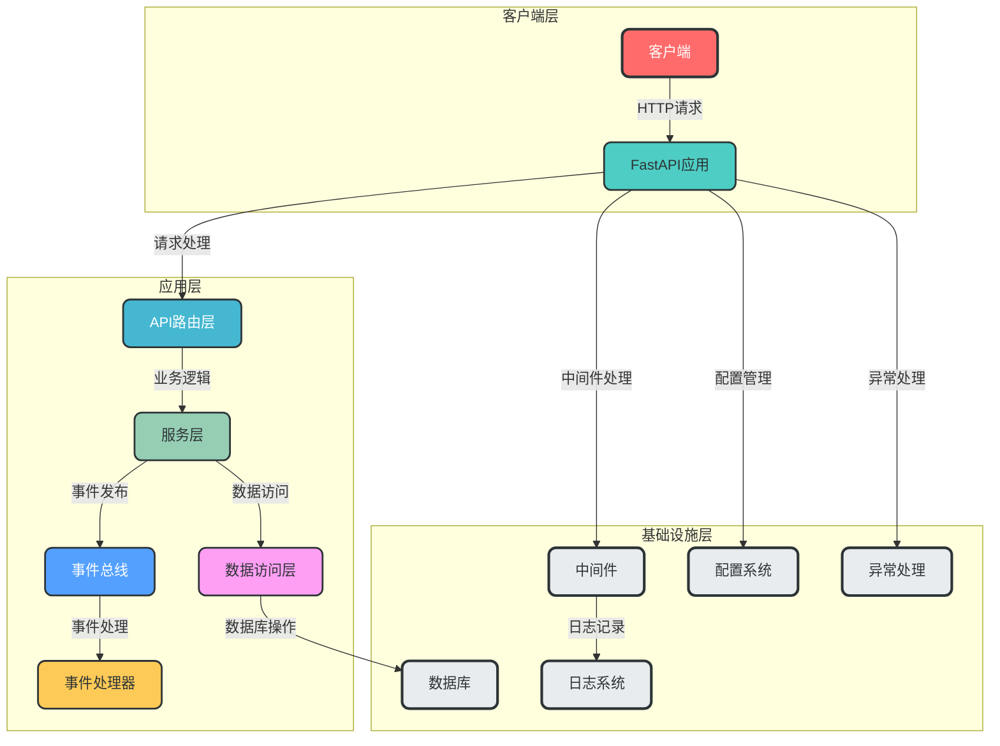
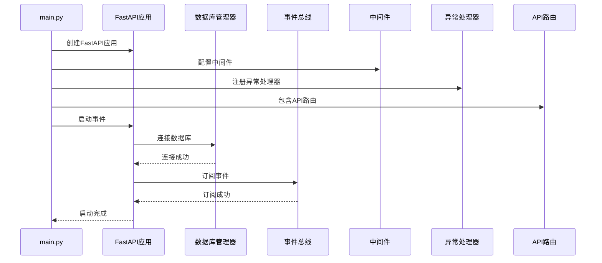
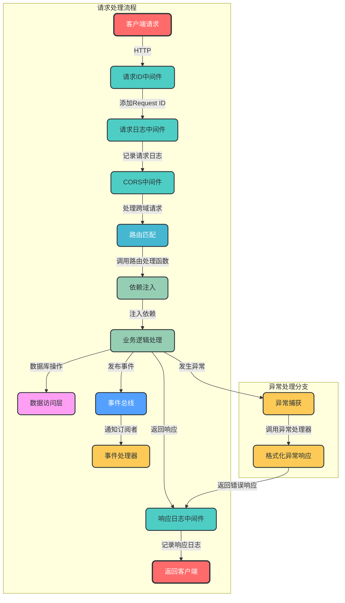
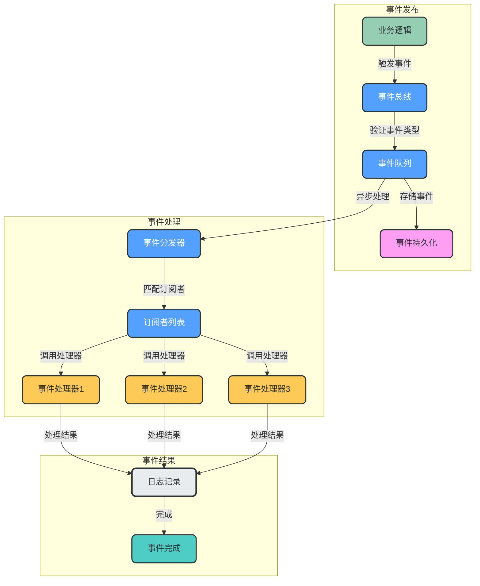

# AgentFlow

## 项目概述

AgentFlow是一个基于FastAPI构建的现代化企业级API服务框架，采用分层架构设计，支持事件驱动和模块化开发。该框架提供了完善的配置管理、数据库集成、中间件支持、异常处理和事件系统，旨在帮助开发者快速构建高性能、可扩展的API服务。

## 项目架构

### 整体架构图



### 目录结构

```
AgentFlow/
├── app/                      # 主应用目录
│   ├── api/                  # API路由层
│   │   └── v1/               # API v1版本
│   │       ├── auth.py       # 认证相关路由
│   │       └── users.py      # 用户相关路由
│   ├── config/               # 配置管理
│   ├── databases/            # 数据库配置
│   ├── dependencies/         # 依赖注入
│   ├── events/               # 事件系统
│   ├── exception/            # 异常处理
│   ├── middleware/           # 中间件
│   ├── models/               # 数据模型
│   ├── repositories/         # 数据访问层
│   ├── schemas/              # 请求响应模式
│   ├── services/             # 业务逻辑层
│   └── utils/                # 工具函数
├── main.py                   # 项目入口
├── pyproject.toml            # 项目配置
└── README.md                 # 项目文档
```

## 核心流程

### 应用启动流程



### HTTP请求处理流程



### 事件驱动流程



## 技术栈

- **Web框架**: FastAPI
- **ASGI服务器**: Uvicorn
- **数据库**: SQLite（支持扩展其他数据库）
- **ORM**: SQLAlchemy
- **依赖注入**: FastAPI内置依赖系统
- **配置管理**: Pydantic Settings
- **日志**: Python logging模块
- **事件系统**: 自定义事件总线
- **API文档**: Swagger UI / ReDoc

## 快速开始

### 安装依赖

```bash
pip install -e .
```

### 运行应用

```bash
python main.py
```

### 访问API文档

- Swagger UI: http://localhost:8000/docs
- ReDoc: http://localhost:8000/redoc

## 配置选项

### 环境变量

| 变量名 | 描述 | 默认值 |
|--------|------|--------|
| UVICORN_RELOAD | 启用热重载模式 | true |
| UVICORN_HOST | 服务器绑定地址 | 0.0.0.0 |
| UVICORN_PORT | 服务器绑定端口 | 8000 |
| APP_NAME | 应用名称 | AgentFlow |
| APP_VERSION | 应用版本 | 1.0.0 |
| API_V1_STR | API v1前缀 | /api/v1 |

### 命令行参数

```bash
python main.py [options]

选项：
  -h, --help     显示帮助信息
  --reload       启用热重载模式
  --host HOST    服务器绑定地址
  --port PORT    服务器绑定端口
```

## 项目特点

1. **分层架构设计**：清晰分离关注点，便于维护和扩展
2. **事件驱动架构**：支持松耦合的组件通信
3. **完善的中间件支持**：内置CORS、日志、请求ID中间件
4. **统一的异常处理**：集中处理所有异常，返回标准化响应
5. **模块化设计**：API按版本组织，便于迭代和升级
6. **依赖注入**：简化组件间的依赖管理
7. **自动API文档**：生成交互式API文档
8. **配置管理**：支持环境变量和命令行参数配置
9. **热重载支持**：便于开发和调试

## 开发指南

### 添加新API路由

1. 在`app/api/v1/`目录下创建新的路由文件
2. 定义路由处理函数
3. 在`app/api/v1/__init__.py`中包含新路由

### 添加新事件

1. 在`app/events/`目录下定义新的事件类型
2. 在业务逻辑中发布事件
3. 定义事件处理器
4. 在应用启动时订阅事件

### 添加新中间件

1. 在`app/middleware/`目录下创建新的中间件
2. 在`main.py`中注册中间件

## 示例集合

为了帮助开发者更好地理解和使用AgentFlow框架，我们提供了一系列示例代码，涵盖了框架的主要功能和使用场景。

### 示例列表

- **[快速入门](./examples/quickstart/)**：创建一个简单的API应用，了解框架的基本使用方法
- **[认证系统](./examples/auth/)**：实现完整的用户认证系统，包括JWT认证、OAuth2密码流等
- **[数据库操作](./examples/database/)**：使用数据库抽象层进行CRUD操作，实现仓储模式
- **[事件系统](./examples/events/)**：学习如何使用框架的事件总线，实现事件驱动架构
- **[配置管理](./examples/config/)**：学习如何使用框架的配置管理功能
- **[中间件使用](./examples/middleware/)**：了解如何使用和自定义中间件
- **[测试策略](./examples/testing/)**：了解如何为FastAPI应用编写测试
- **[部署指南](./examples/deployment/)**：学习如何部署FastAPI应用到生产环境

### 如何使用示例

1. 进入示例目录：`cd examples/<示例名称>`
2. 安装依赖：`pip install -r requirements.txt`
3. 运行应用：`python main.py`
4. 访问API文档：打开浏览器访问 `http://localhost:8000/docs`

## 测试

### 运行测试

```bash
pytest
```

### 查看测试覆盖率

```bash
pytest --cov=app
```

## 部署

### 生产环境部署

```bash
# 关闭热重载，指定生产环境配置
export UVICORN_RELOAD=false
export UVICORN_HOST=0.0.0.0
export UVICORN_PORT=8000
python main.py
```

### Docker部署

（示例Dockerfile）

```dockerfile
FROM python:3.11-slim

WORKDIR /app

COPY pyproject.toml .
RUN pip install --no-cache-dir -e .

COPY . .

CMD ["python", "main.py", "--reload=false"]
```

## 许可证

MIT License

## 贡献

欢迎提交Issue和Pull Request！

## 联系方式

如有问题或建议，请通过以下方式联系：

- 项目地址：https://github.com/yourusername/AgentFlow
- 邮件：your.email@example.com