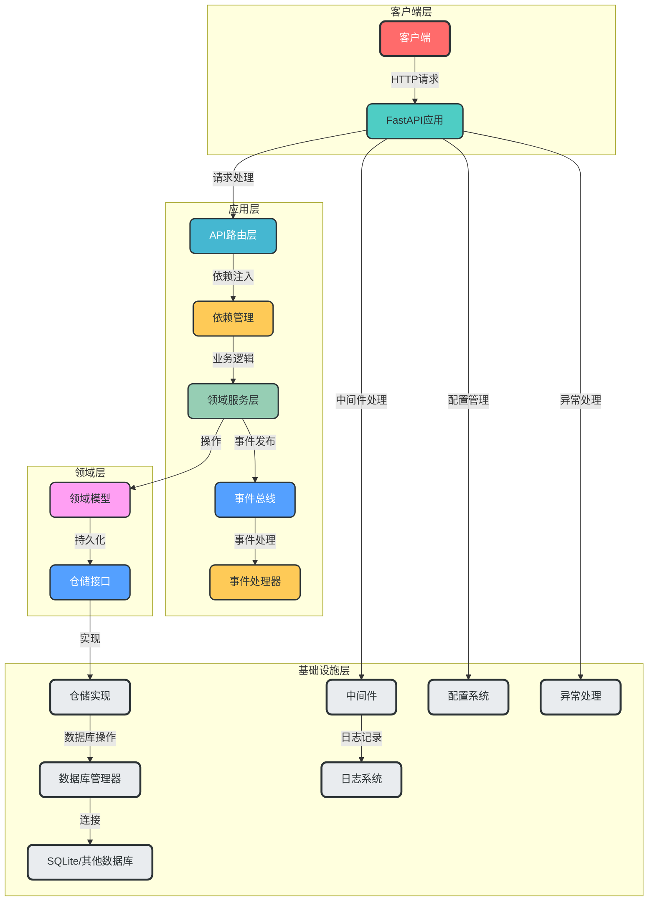
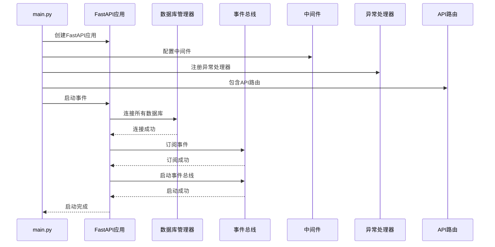
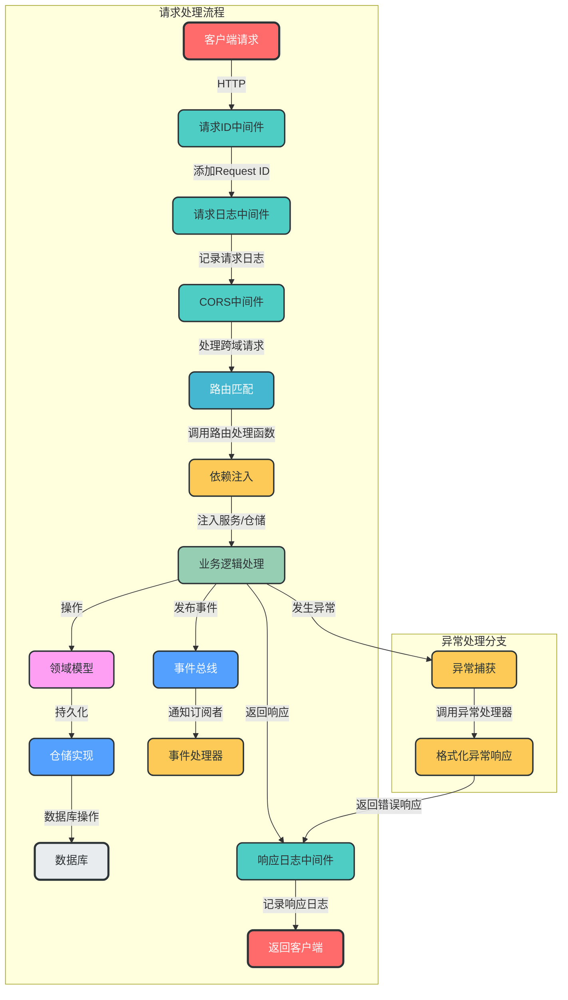
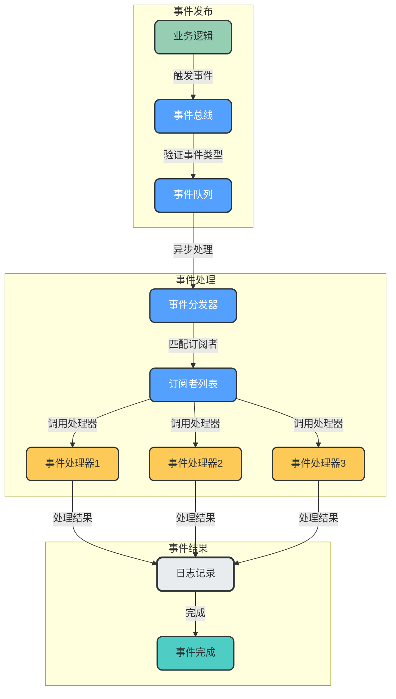

# FastAPI Enterprise Framework Template

## 项目概述

FastAPI Enterprise Framework Template 是一个基于FastAPI构建的现代化企业级API服务框架，采用**领域驱动设计（DDD）**和分层架构，支持事件驱动和模块化开发。该框架提供了完善的配置管理、多数据库支持、中间件系统、统一异常处理和事件总线，旨在帮助开发者快速构建高性能、可扩展、易于维护的API服务。

## 项目架构

### 整体架构图



### 目录结构

```
fastapi-enterprise-framework-template/
├── app/                      # 主应用目录
│   ├── api/                  # API路由层
│   │   └── v1/               # API v1版本
│   │       ├── __init__.py   # 路由聚合
│   │       ├── auth.py       # 认证相关路由
│   │       ├── health.py     # 健康检查路由
│   │       └── users.py      # 用户相关路由
│   ├── config/               # 配置管理
│   │   ├── __init__.py       # 配置导出
│   │   ├── base.py           # 基础配置
│   │   ├── database.py       # 数据库配置
│   │   ├── logger.py         # 日志配置
│   │   └── settings.py       # 应用设置
│   ├── dependencies/         # 依赖注入
│   │   ├── __init__.py       # 依赖导出
│   │   ├── auth.py           # 认证依赖
│   │   ├── config.py         # 配置依赖
│   │   ├── database.py       # 数据库依赖
│   │   ├── repository.py     # 仓储依赖
│   │   └── service.py        # 服务依赖
│   ├── domains/              # 领域层（DDD）
│   │   ├── base/             # 基础领域
│   │   │   ├── models/       # 基础模型
│   │   │   └── repositories/ # 基础仓储接口
│   │   └── user/             # 用户领域
│   │       ├── models/       # 用户模型
│   │       ├── repositories/ # 用户仓储接口
│   │       ├── schemas/      # 用户领域模式
│   │       └── services/     # 用户服务
│   ├── exception/            # 异常处理
│   │   ├── __init__.py       # 异常导出
│   │   ├── base.py           # 基础异常
│   │   ├── business.py       # 业务异常
│   │   ├── http.py           # HTTP异常
│   │   └── handler.py        # 异常处理器
│   ├── infrastructure/       # 基础设施层
│   │   ├── database/         # 数据库基础设施
│   │   │   ├── base.py       # 数据库基础
│   │   │   ├── manager.py    # 数据库管理器
│   │   │   └── sqlite/       # SQLite实现
│   │   └── events/           # 事件系统
│   │       ├── __init__.py   # 事件导出
│   │       ├── bus.py        # 事件总线
│   │       └── event.py      # 事件定义
│   ├── middleware/           # 中间件
│   │   ├── __init__.py       # 中间件导出
│   │   ├── authentication.py # 认证中间件
│   │   ├── cors.py           # CORS中间件
│   │   ├── request.py        # 请求ID中间件
│   │   └── request_logger.py # 请求日志中间件
│   ├── schemas/              # 应用层模式
│   │   ├── __init__.py       # 模式导出
│   │   └── response.py       # 响应模式
│   └── utils/                # 工具函数
│       ├── __init__.py       # 工具导出
│       ├── jwt.py            # JWT工具
│       └── password.py       # 密码工具
├── docs/                     # 设计文档
├── examples/                 # 使用示例
├── tests/                    # 测试代码
├── main.py                   # 项目入口
├── pyproject.toml            # 项目配置
└── README.md                 # 项目文档
```

## 核心概念

### 1. 领域驱动设计（DDD）

框架采用DDD架构，将业务逻辑与技术实现分离，主要包含以下核心组件：

- **领域模型**：封装业务规则和状态的核心对象
- **领域服务**：实现跨实体的业务逻辑
- **仓储接口**：定义数据访问契约
- **聚合根**：作为领域模型的入口点

### 2. 分层架构

- **API层**：处理HTTP请求和响应，路由管理
- **应用层**：协调领域层和基础设施层，处理用例
- **领域层**：包含核心业务逻辑和领域模型
- **基础设施层**：提供技术支持，如数据库、事件系统等

### 3. 多数据库支持

框架采用数据库管理器模式，支持多种数据库后端：

- 统一的数据库连接管理
- 支持动态注册数据库连接
- 支持多种数据库类型（SQLite、PostgreSQL、MySQL等）
- 事务管理支持

### 4. 事件驱动架构

- 基于发布-订阅模式的事件总线
- 支持同步和异步事件处理
- 事件类型安全检查
- 可扩展的事件处理器

### 5. 依赖注入

- 基于FastAPI的依赖注入系统
- 分层的依赖管理
- 可测试性设计
- 依赖倒置原则的实现

## 核心流程

### 应用启动流程



### HTTP请求处理流程



### 事件驱动流程



## 技术栈

- **Web框架**: FastAPI 0.100+
- **ASGI服务器**: Uvicorn
- **数据库**: SQLite（支持扩展其他数据库）
- **ORM**: SQLAlchemy 2.0+
- **依赖注入**: FastAPI内置依赖系统
- **配置管理**: Pydantic Settings v2
- **日志**: Python logging模块
- **事件系统**: 自定义事件总线
- **API文档**: Swagger UI / ReDoc
- **测试**: Pytest

## 快速开始

### 安装依赖

```bash
pip install -e .
```

### 运行应用

```bash
python main.py
```

### 访问API文档

- Swagger UI: http://localhost:8000/docs
- ReDoc: http://localhost:8000/redoc

## 配置选项

### 环境变量

| 变量名 | 描述 | 默认值 |
|--------|------|--------|
| UVICORN_RELOAD | 启用热重载模式 | true |
| UVICORN_HOST | 服务器绑定地址 | 0.0.0.0 |
| UVICORN_PORT | 服务器绑定端口 | 8000 |
| APP_NAME | 应用名称 | FastAPI Enterprise |
| APP_VERSION | 应用版本 | 1.0.0 |
| API_V1_STR | API v1前缀 | /api/v1 |

### 命令行参数

```bash
python main.py [options]

选项：
  -h, --help     显示帮助信息
  --reload       启用热重载模式
  --host HOST    服务器绑定地址
  --port PORT    服务器绑定端口
```

## 项目特点

1. **领域驱动设计（DDD）**：清晰的领域划分，便于复杂业务建模
2. **分层架构**：关注点分离，便于维护和扩展
3. **事件驱动**：支持松耦合的组件通信
4. **多数据库支持**：灵活的数据库后端切换
5. **完善的中间件系统**：内置CORS、日志、请求ID等中间件
6. **统一的异常处理**：集中处理所有异常，返回标准化响应
7. **模块化设计**：API按版本组织，便于迭代和升级
8. **依赖注入**：简化组件间的依赖管理
9. **自动API文档**：生成交互式API文档
10. **可测试性设计**：便于编写单元测试和集成测试

## 开发指南

### 添加新领域

1. 在`app/domains/`目录下创建新的领域目录
2. 定义领域模型（models）
3. 定义仓储接口（repositories）
4. 实现领域服务（services）
5. 定义领域模式（schemas）

### 添加新API路由

1. 在`app/api/v1/`目录下创建新的路由文件
2. 定义路由处理函数
3. 在`app/api/v1/__init__.py`中包含新路由
4. 配置必要的依赖注入

### 添加新事件

1. 在`app/infrastructure/events/`目录下定义新的事件类型
2. 在业务逻辑中发布事件
3. 定义事件处理器
4. 在应用启动时订阅事件

### 添加新中间件

1. 在`app/middleware/`目录下创建新的中间件
2. 在`main.py`中注册中间件

## 示例集合

为了帮助开发者更好地理解和使用该框架，我们提供了一系列示例代码，涵盖了框架的主要功能和使用场景。

### 示例列表

- **[快速入门](./examples/quickstart/)**：创建一个简单的API应用，了解框架的基本使用方法
- **[认证系统](./examples/auth/)**：实现完整的用户认证系统，包括JWT认证、OAuth2密码流等
- **[数据库操作](./examples/database/)**：使用仓储模式进行CRUD操作
- **[事件系统](./examples/events/)**：学习如何使用框架的事件总线，实现事件驱动架构

### 如何使用示例

1. 进入示例目录：`cd examples/<示例名称>`
2. 安装依赖：`pip install -r requirements.txt`
3. 运行应用：`python main.py`
4. 访问API文档：打开浏览器访问 `http://localhost:8000/docs`

## 测试

### 运行测试

```bash
pytest
```

### 查看测试覆盖率

```bash
pytest --cov=app
```

## 部署

### 生产环境部署

```bash
# 关闭热重载，指定生产环境配置
export UVICORN_RELOAD=false
export UVICORN_HOST=0.0.0.0
export UVICORN_PORT=8000
python main.py
```

### Docker部署

（示例Dockerfile）

```dockerfile
FROM python:3.11-slim

WORKDIR /app

COPY pyproject.toml .
RUN pip install --no-cache-dir -e .

COPY . .

CMD ["python", "main.py", "--reload=false"]
```

## 许可证

MIT License

## 贡献

欢迎提交Issue和Pull Request！

## 联系方式

如有问题或建议，请通过以下方式联系：

- 项目地址：https://github.com/yourusername/fastapi-enterprise-framework-template
- 邮件：your.email@example.com