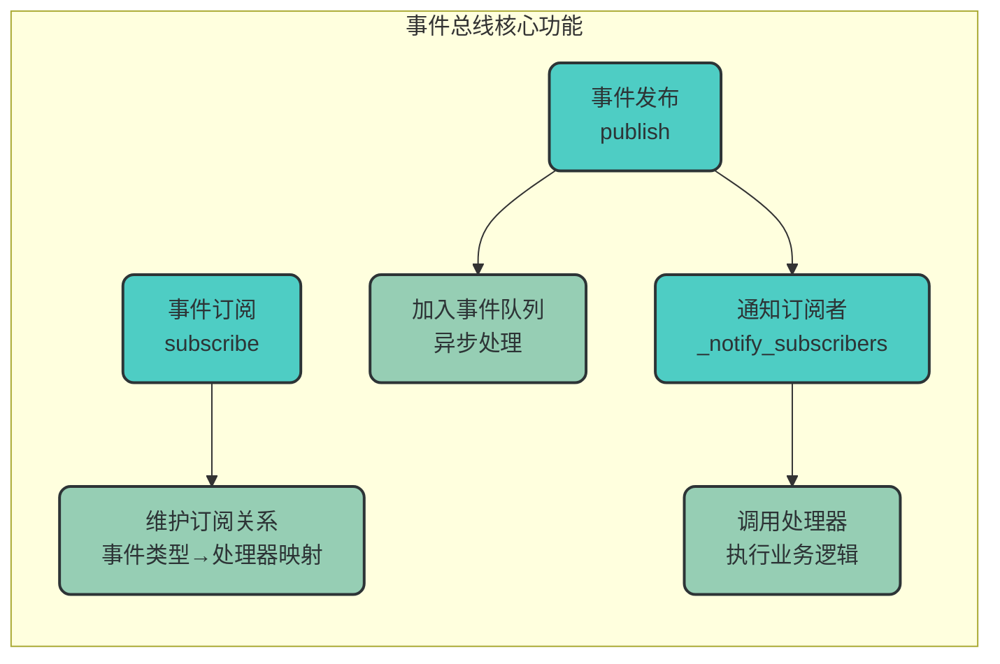
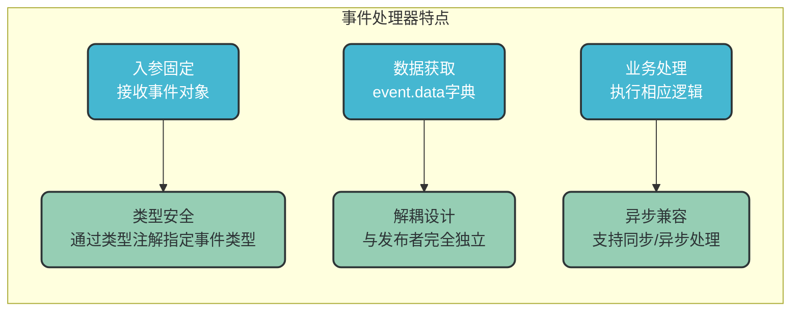
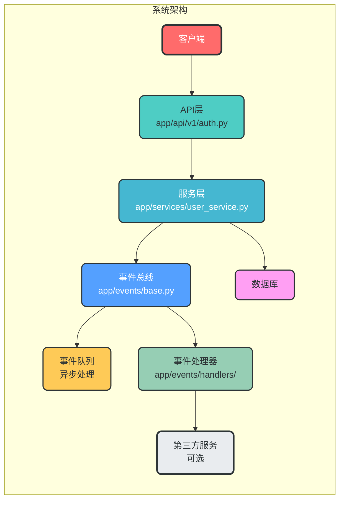
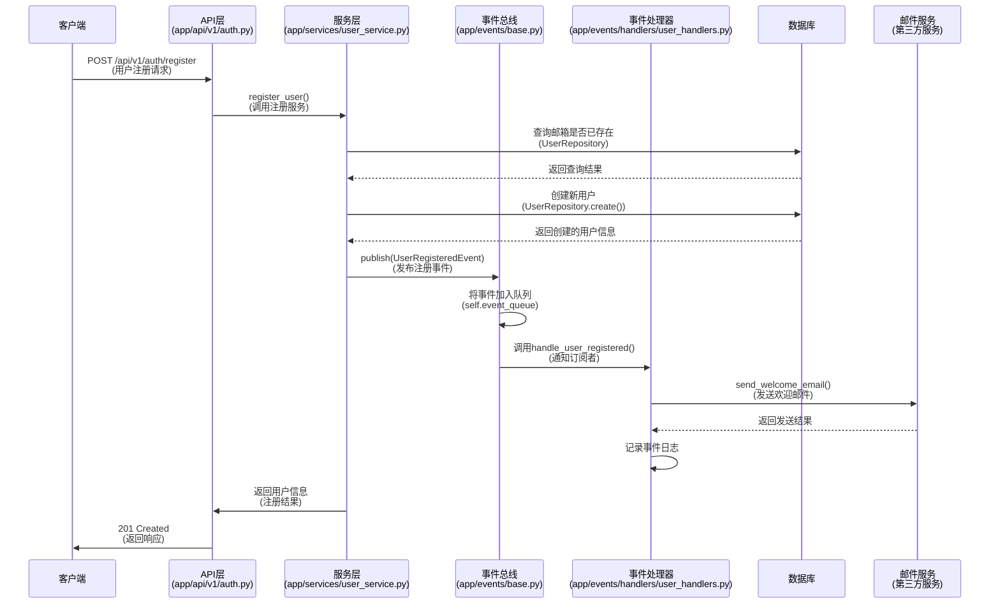
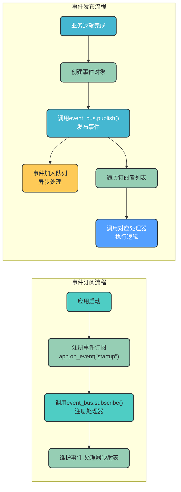
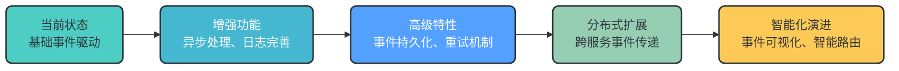

# 事件驱动模块设计文档

## 1. 文档概述

### 1.1 设计目标

本设计文档旨在提供一套完整的事件驱动架构解决方案，适用于 `AgentFlow` 项目及类似的企业级应用。通过事件驱动设计，实现系统各组件间的解耦，提高系统的可扩展性、可维护性和响应速度。

### 1.2 核心概念

| 概念 | 定义 |
|------|------|
| 事件(Event) | 系统中发生的特定行为或状态变化，包含事件类型和相关数据 |
| 事件处理器(EventHandler) | 接收并处理特定类型事件的函数，实现业务逻辑 |
| 事件总线(EventBus) | 管理事件发布、订阅关系和通知机制的核心组件 |
| 事件类型(EventType) | 标识事件类别的枚举值，用于事件路由 |
| 订阅(Subscribe) | 注册事件处理器到特定事件类型的过程 |
| 发布(Publish) | 发送事件到事件总线的过程 |

## 2. 目录结构设计

```
├── app/
│   ├── events/                    # 事件驱动核心模块
│   │   ├── __init__.py            # 包初始化，导出核心组件
│   │   ├── base.py                # 事件总线、基础事件类定义
│   │   ├── handlers/              # 事件处理器目录
│   │   │   ├── __init__.py        # 处理器包初始化
│   │   │   └── user_handlers.py   # 用户相关事件处理器
│   │   ├── types.py               # 事件类型枚举定义
│   │   └── models/                # 事件模型定义
│   │       ├── __init__.py        # 事件模型包初始化
│   │       └── user_events.py     # 用户相关事件模型
│   ├── api/                       # API层
│   │   └── v1/
│   │       └── auth.py            # 认证相关API
│   ├── services/                  # 服务层
│   │   └── user_service.py        # 用户服务，发布事件
│   ├── config/                    # 配置文件
│   │   └── event_config.py        # 事件驱动配置
│   └── main.py                    # 应用入口，事件订阅注册
```

## 3. 核心组件设计

### 3.1 事件总线设计

`EventBus` 是事件驱动架构的核心，负责管理事件的发布、订阅和通知。

#### 3.1.1 核心功能



#### 3.1.2 关键方法解析

| 方法 | 功能描述 |
|------|----------|
| `subscribe(event_type, handler)` | 注册事件处理器到指定事件类型 |
| `publish(event)` | 发布事件，将事件放入队列并通知订阅者 |
| `_notify_subscribers(event)` | 遍历并调用所有订阅该事件类型的处理器 |
| `start_async_processor()` | 启动异步事件处理线程（可选） |
| `stop_async_processor()` | 停止异步事件处理线程（可选） |

### 3.2 事件模型设计

#### 3.2.1 基础事件类

```python
# app/events/base.py
class Event:
    """基础事件类"""
    def __init__(self, event_type, data=None):
        self.event_type = event_type
        self.data = data or {}
        self.timestamp = datetime.now()
```

#### 3.2.2 事件类型定义

```python
# app/events/types.py
from enum import Enum

class EventType(Enum):
    """事件类型枚举"""
    USER_REGISTERED = "user_registered"
    USER_LOGGED_IN = "user_logged_in"
    TASK_COMPLETED = "task_completed"
    NOTIFICATION_SENT = "notification_sent"
```

#### 3.2.3 业务事件类示例

```python
# app/events/models/user_events.py
from app.events.base import Event
from app.events.types import EventType

class UserRegisteredEvent(Event):
    """用户注册事件"""
    def __init__(self, user_id, username, email):
        super().__init__(
            event_type=EventType.USER_REGISTERED,
            data={
                "user_id": user_id,
                "username": username,
                "email": email
            }
        )

class UserLoggedInEvent(Event):
    """用户登录事件"""
    def __init__(self, user_id, username, ip_address):
        super().__init__(
            event_type=EventType.USER_LOGGED_IN,
            data={
                "user_id": user_id,
                "username": username,
                "ip_address": ip_address
            }
        )
```

### 3.3 事件处理器设计

事件处理器是接收并处理特定类型事件的函数，它是事件驱动架构中的核心业务组件。

#### 3.3.1 处理器示例

```python
# app/events/handlers/user_handlers.py
import logging
from app.events.models.user_events import UserRegisteredEvent, UserLoggedInEvent

logger = logging.getLogger(__name__)

def handle_user_registered(event: UserRegisteredEvent):
    """处理用户注册事件"""
    user_id = event.data["user_id"]
    username = event.data["username"]
    email = event.data["email"]
    
    # 实际业务逻辑：发送欢迎邮件、生成初始化数据等
    logger.info(
        f"【用户注册事件】: 用户ID={user_id}, 用户名={username}, 邮箱={email} 注册成功"
    )

def handle_user_logged_in(event: UserLoggedInEvent):
    """处理用户登录事件"""
    user_id = event.data["user_id"]
    username = event.data["username"]
    ip_address = event.data["ip_address"]
    
    # 实际业务逻辑：更新登录时间、记录登录日志等
    logger.info(
        f"【用户登录事件】: 用户ID={user_id}, 用户名={username}, IP={ip_address} 登录成功"
    )
```

#### 3.3.2 处理器特点



## 4. 事件驱动完整数据流程

### 4.1 系统架构流程



### 4.2 用户注册场景完整流程



### 4.3 事件订阅与发布机制



## 5. 配置与初始化

### 5.1 事件总线初始化

```python
# app/main.py
from fastapi import FastAPI
from app.events.base import EventBus
from app.events.handlers.user_handlers import handle_user_registered, handle_user_logged_in
from app.events.types import EventType

# 初始化事件总线
event_bus = EventBus()

app = FastAPI()

# 注册事件订阅
@app.on_event("startup")
async def startup_event():
    """应用启动时注册事件处理器"""
    # 订阅用户注册事件
    event_bus.subscribe(EventType.USER_REGISTERED, handle_user_registered)
    # 订阅用户登录事件
    event_bus.subscribe(EventType.USER_LOGGED_IN, handle_user_logged_in)
    
    # 启动异步事件处理器（可选）
    event_bus.start_async_processor()

# 关闭事件总线
@app.on_event("shutdown")
async def shutdown_event():
    """应用关闭时清理资源"""
    event_bus.stop_async_processor()
```

### 5.2 事件总线配置

```python
# app/config/event_config.py
class EventConfig:
    """事件驱动配置类"""
    # 是否启用异步事件处理
    ASYNC_ENABLED = True
    # 异步事件队列最大长度
    QUEUE_MAX_SIZE = 1000
    # 异步处理线程数
    WORKER_COUNT = 2
    # 是否启用事件日志
    LOG_ENABLED = True
    # 事件日志级别
    LOG_LEVEL = "INFO"
```

## 6. 事件驱动架构优势

| 优势 | 描述 | 实现方式 |
|------|------|----------|
| **解耦设计** | 发布者和订阅者无需知道对方存在，降低组件间耦合度 | 事件总线作为中间层，管理事件流转 |
| **可扩展性** | 可以轻松添加新的事件类型和处理器，无需修改现有代码 | 基于事件类型的动态订阅机制 |
| **异步处理** | 支持同步和异步事件处理，提高系统响应速度 | 事件队列 + 异步处理器线程池 |
| **可维护性** | 业务逻辑和事件处理分离，代码结构清晰 | 模块化设计，职责单一 |
| **灵活性** | 相同事件可以有多个处理器，实现不同的业务逻辑 | 一对多的事件订阅关系 |
| **可追溯性** | 完整的事件日志记录，便于问题排查和系统监控 | 结构化事件日志，包含事件类型、数据和时间戳 |

## 7. 最佳实践

### 7.1 事件设计原则

1. **事件命名规范**：使用动词+名词形式，清晰表达事件含义（如 `UserRegisteredEvent`）
2. **数据最小化**：事件数据只包含必要信息，避免传递大量冗余数据
3. **不可变性**：事件发布后不可修改，确保事件的可靠性和一致性
4. **唯一标识**：为每个事件分配唯一ID，便于追踪和去重
5. **版本控制**：支持事件版本管理，便于后续扩展和兼容

### 7.2 处理器设计原则

1. **单一职责**：每个处理器只处理一种类型的事件，实现单一业务逻辑
2. **幂等性**：处理器应该支持重复执行，避免因事件重试导致的数据不一致
3. **异常处理**：处理器内部应有完善的异常捕获机制，避免影响其他处理器
4. **性能考虑**：处理器应尽量轻量化，避免执行耗时操作（耗时操作建议异步处理）
5. **日志记录**：每个处理器应记录详细的事件处理日志，便于调试和监控

### 7.3 事件总线使用建议

1. **全局单例**：事件总线应设计为全局单例，确保所有组件使用同一个实例
2. **异步优先**：对于非实时性要求的事件，建议使用异步处理方式
3. **队列监控**：定期监控事件队列长度，避免队列溢出
4. **优雅关闭**：应用关闭时，确保所有队列中的事件都处理完成
5. **测试覆盖**：编写完善的单元测试和集成测试，确保事件驱动机制的可靠性

## 8. 扩展与演进

### 8.1 未来扩展方向

1. **事件持久化**：将事件持久化到数据库，支持事件回放和重试机制
2. **事件溯源**：基于事件日志实现系统状态的重建和审计
3. **分布式事件总线**：支持跨服务、跨节点的事件传递，适用于微服务架构
4. **事件可视化**：提供事件流可视化界面，便于监控和分析系统运行状态
5. **智能路由**：根据事件属性实现更复杂的事件路由规则

### 8.2 演进路径



## 9. 总结

本设计文档提供了一套完整的事件驱动架构解决方案，包含核心概念、目录结构设计、数据流程示例和最佳实践。通过事件驱动设计，`AgentFlow` 项目实现了业务逻辑的解耦，提高了系统的可扩展性和可维护性，符合企业级架构的设计标准。

事件驱动架构是现代软件设计的重要范式之一，特别适合于复杂系统、微服务架构和高并发场景。随着 `AgentFlow` 项目的发展，可以根据实际需求逐步扩展和完善事件驱动机制，实现更高级的功能和特性。