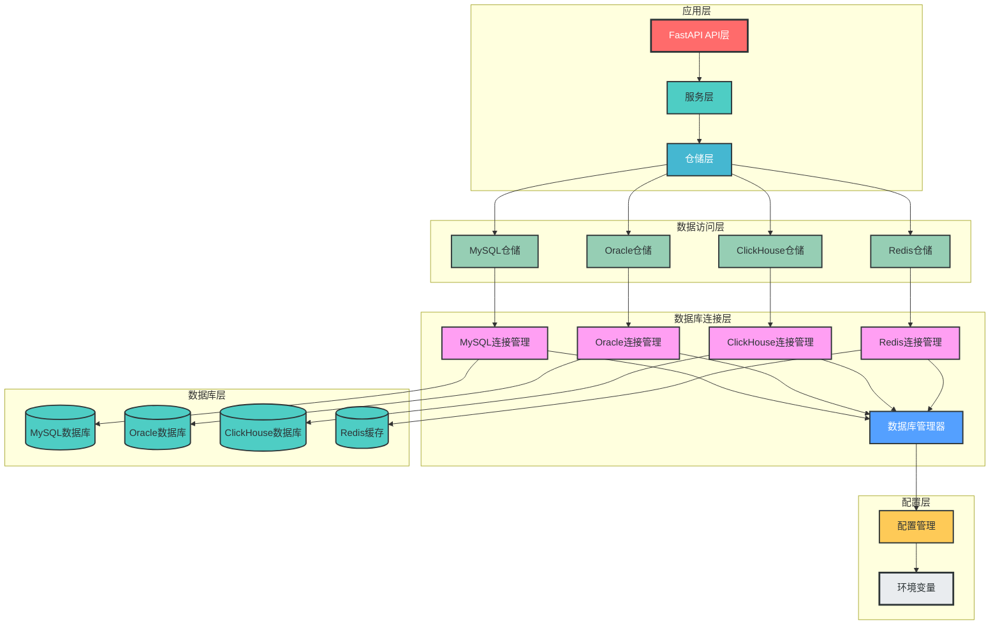
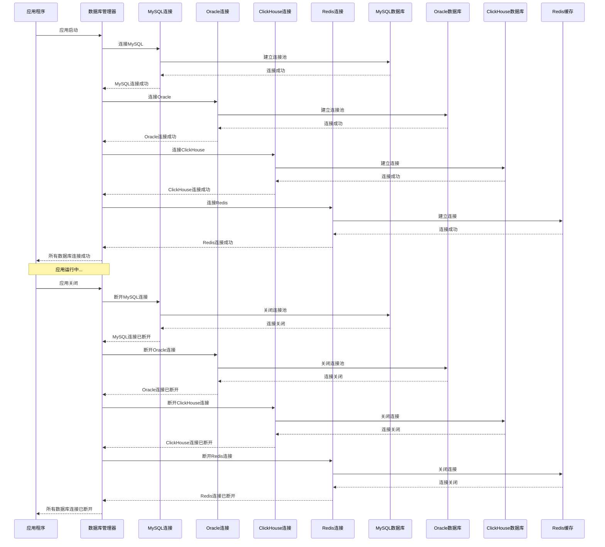
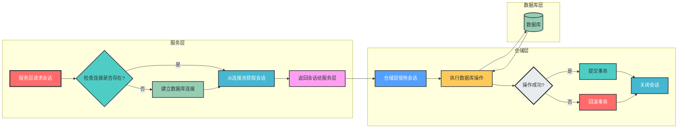
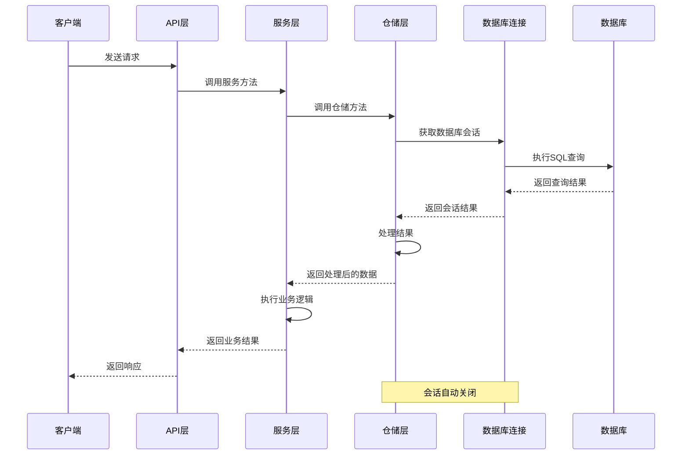
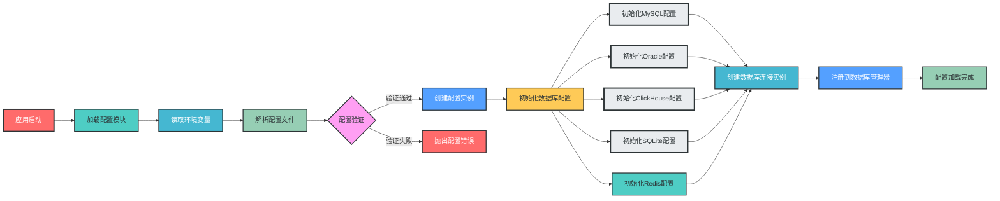

# 多数据库管理与配置设计

## 一、设计概述

本设计实现了一套**生产级的多数据库管理架构**，支持MySQL、Oracle、ClickHouse、SQLite和Redis等多种数据库类型。通过**统一的配置管理**、**标准化的连接接口**和**灵活的依赖注入机制**，实现了业务层与数据访问层的解耦，符合开闭原则、单一职责原则和依赖倒置原则，具备良好的可扩展性和可维护性。

## 二、关键流程流程图

### 1. 多数据库架构整体架构图



### 2. 多数据库连接管理流程



### 3. 数据库会话获取流程



### 4. 仓储层调用流程



### 5. 配置加载流程



## 三、目录结构设计

```
fastapi_mvc/
├── app/                     # 应用核心目录
│   ├── __init__.py
│   ├── main.py              # 应用入口
│   ├── config/              # 配置模块
│   │   ├── __init__.py      # 配置注入导出
│   │   ├── settings.py      # 主配置文件
│   │   ├── database.py      # 数据库配置
│   │   └── redis.py         # Redis配置
│   ├── databases/           # 多数据库管理模块
│   │   ├── __init__.py      # 数据库连接导出和依赖注入
│   │   ├── base.py          # 数据库基类和通用工具
│   │   ├── mysql/           # MySQL数据库模块
│   │   │   ├── __init__.py
│   │   │   ├── connection.py # MySQL连接管理
│   │   │   └── base.py       # MySQL模型基类
│   │   ├── oracle/          # Oracle数据库模块
│   │   │   ├── __init__.py
│   │   │   └── connection.py # Oracle连接管理
│   │   ├── clickhouse/      # ClickHouse数据库模块
│   │   │   ├── __init__.py
│   │   │   └── connection.py # ClickHouse连接管理
│   │   ├── sqlite/          # SQLite数据库模块
│   │   │   ├── __init__.py
│   │   │   └── connection.py # SQLite连接管理
│   │   └── redis/           # Redis缓存模块
│   │       ├── __init__.py  # Redis接口统一导出
│   │       ├── base.py       # Redis基础接口
│   │       ├── client.py     # Redis客户端封装
│   │       └── cache.py      # 缓存工具类
│   ├── repositories/        # 仓储层（按业务域和数据库类型划分）
│   │   ├── __init__.py      # 仓储依赖注入
│   │   ├── mysql/           # MySQL仓储实现
│   │   │   ├── user_repository.py
│   │   │   └── order_repository.py
│   │   ├── clickhouse/      # ClickHouse仓储实现
│   │   │   └── analytics_repository.py
│   │   └── redis/           # Redis仓储实现
│   │       └── cache_repository.py
│   └── ...                  # 其他模块
├── .env                     # 开发环境变量
├── .env.prod                # 生产环境变量
└── .env.test                # 测试环境变量
```

## 四、配置管理设计

### 1. 配置基类

```python
# app/config/base.py
from pydantic_settings import BaseSettings as PydanticBaseSettings
from pydantic_settings import SettingsConfigDict
from typing import Optional


class BaseSettings(PydanticBaseSettings):
    """配置基类，统一配置加载逻辑"""
    
    model_config = SettingsConfigDict(
        env_file=".env",         # 默认.env文件路径
        env_file_encoding="utf-8", # 文件编码
        case_sensitive=False,      # 环境变量不区分大小写
        extra="ignore"              # 忽略未知配置项
    )
    
    @classmethod
    def from_env(cls, env_file: Optional[str] = None) -> "BaseSettings":
        """从指定环境文件加载配置
        
        Args:
            env_file: 环境文件路径，如果不指定则使用默认路径
            
        Returns:
            配置实例
        """
        if env_file:
            return cls(_env_file=env_file)
        return cls()
```

### 2. 主配置文件

```python
# app/config/settings.py
from app.config.base import BaseSettings
from typing import List, Optional

class AppSettings(BaseSettings):
    """应用主配置"""

    # 应用基本信息
    APP_NAME: str = "AgentFlow"
    APP_VERSION: str = "1.0.0"
    APP_DESCRIPTION: str = "AgentFlow应用"

    # 运行环境
    ENVIRONMENT: str = "development"  # development, testing, production
    DEBUG: bool = True

    # 服务器配置
    HOST: str = "0.0.0.0"
    PORT: int = 8000
    RELOAD: bool = True
    API_V1_STR: str = "/api/v1"

    # CORS配置
    CORS_ORIGINS: List[str] = ["*"]
    CORS_ALLOW_CREDENTIALS: bool = True
    CORS_ALLOW_METHODS: List[str] = ["*"]
    CORS_ALLOW_HEADERS: List[str] = ["*"]

    # JWT配置
    SECRET_KEY: str = "your-secret-key"
    ALGORITHM: str = "HS256"
    ACCESS_TOKEN_EXPIRE_MINUTES: int = 30

    # 配置文件优先级
    model_config = BaseSettings.model_config.copy()
    model_config["env_prefix"] = "APP_"  # 应用配置的环境变量前缀

# 全局配置实例 - 应用启动时自动加载配置
app_settings = AppSettings()
```

### 2. 数据库配置

```python
# app/config/database.py
from app.config.base import BaseSettings
from typing import Dict, Any, Optional

class MySQLConfig(BaseSettings):
    """MySQL数据库配置"""
    HOST: str = "localhost"
    PORT: int = 3306
    USER: str = "root"
    PASSWORD: str = "password"
    DATABASE: str = "fastapi_mvc"
    CHARSET: str = "utf8mb4"
    POOL_SIZE: int = 10
    MAX_OVERFLOW: int = 20
    POOL_PRE_PING: bool = True
    
    @property
    def URL(self) -> str:
        """生成MySQL连接URL"""
        return f"mysql+pymysql://{self.USER}:{self.PASSWORD}@{self.HOST}:{self.PORT}/{self.DATABASE}?charset={self.CHARSET}"

    model_config = BaseSettings.model_config.copy()
    model_config["env_prefix"] = "MYSQL_"

class OracleConfig(BaseSettings):
    """Oracle数据库配置"""
    HOST: str = "localhost"
    PORT: int = 1521
    USER: str = "sys"
    PASSWORD: str = "password"
    SERVICE_NAME: str = "ORCLPDB1"
    
    @property
    def URL(self) -> str:
        """生成Oracle连接URL"""
        return f"oracle+cx_oracle://{self.USER}:{self.PASSWORD}@{self.HOST}:{self.PORT}/?service_name={self.SERVICE_NAME}"

    model_config = BaseSettings.model_config.copy()
    model_config["env_prefix"] = "ORACLE_"

class ClickHouseConfig(BaseSettings):
    """ClickHouse数据库配置"""
    HOST: str = "localhost"
    PORT: int = 8123
    USER: str = "default"
    PASSWORD: str = ""
    DATABASE: str = "default"
    
    @property
    def URL(self) -> str:
        """生成ClickHouse连接URL"""
        return f"clickhouse+http://{self.USER}:{self.PASSWORD}@{self.HOST}:{self.PORT}/{self.DATABASE}"

    model_config = BaseSettings.model_config.copy()
    model_config["env_prefix"] = "CLICKHOUSE_"

class SQLiteConfig(BaseSettings):
    """SQLite数据库配置"""

    HOST: Optional[str] = None  # SQLite不需要host，但保留字段以保持一致性
    PORT: Optional[int] = None  # SQLite不需要port，但保留字段以保持一致性
    USER: Optional[str] = None  # SQLite不需要user，但保留字段以保持一致性
    PASSWORD: Optional[str] = None  # SQLite不需要password，但保留字段以保持一致性
    DATABASE: str = "agentflow"
    DATABASE_FILE: str = "app.db"

    # SQLAlchemy配置
    ECHO_SQL: bool = False

    @property
    def URL(self) -> str:
        """生成SQLite连接URL"""
        return f"sqlite:///{self.DATABASE_FILE}"

    model_config = BaseSettings.model_config.copy()
    model_config["env_prefix"] = "SQLITE_"

# 数据库配置实例
# 当前只实现了SQLite，其他数据库类型可以根据需要添加
sqlite_config = SQLiteConfig()
# mysql_config = MySQLConfig()
# oracle_config = OracleConfig()
# clickhouse_config = ClickHouseConfig()
```

### 3. Redis配置

```python
# app/config/redis.py
from app.config.base import BaseSettings

class RedisConfig(BaseSettings):
    """Redis配置"""
    HOST: str = "localhost"
    PORT: int = 6379
    PASSWORD: str = ""
    DB: int = 0
    PREFIX: str = "fastapi_mvc"
    
    @property
    def URL(self) -> str:
        """生成Redis连接URL"""
        if self.PASSWORD:
            return f"redis://:{self.PASSWORD}@{self.HOST}:{self.PORT}/{self.DB}"
        return f"redis://{self.HOST}:{self.PORT}/{self.DB}"

    model_config = BaseSettings.model_config.copy()
    model_config["env_prefix"] = "REDIS_"

# Redis配置实例
redis_config = RedisConfig()
```

## 五、多数据库连接管理

### 1. 数据库基类

```python
# app/databases/base.py
from abc import ABC, abstractmethod
from typing import Any, Generator, Dict

class DatabaseConnection(ABC):
    """数据库连接基类"""
    
    @abstractmethod
    def connect(self) -> Any:
        """建立数据库连接"""
        pass
    
    @abstractmethod
    def disconnect(self) -> None:
        """断开数据库连接"""
        pass
    
    @abstractmethod
    def get_session(self) -> Generator[Any, None, None]:
        """获取数据库会话"""
        pass

class DatabaseManager:
    """数据库管理器，管理多个数据库连接"""
    
    def __init__(self):
        self._connections: Dict[str, DatabaseConnection] = {}
    
    def register(self, name: str, connection: DatabaseConnection) -> None:
        """注册数据库连接"""
        self._connections[name] = connection
    
    def get(self, name: str) -> DatabaseConnection:
        """获取数据库连接"""
        if name not in self._connections:
            raise ValueError(f"Database connection '{name}' not registered")
        return self._connections[name]
    
    def connect_all(self) -> None:
        """连接所有数据库"""
        for name, connection in self._connections.items():
            connection.connect()
    
    def disconnect_all(self) -> None:
        """断开所有数据库连接"""
        for name, connection in self._connections.items():
            connection.disconnect()

# 全局数据库管理器实例
database_manager = DatabaseManager()
```

### 2. MySQL连接管理

```python
# app/databases/mysql/connection.py
from sqlalchemy import create_engine
from sqlalchemy.ext.declarative import declarative_base
from sqlalchemy.orm import sessionmaker
from app.config.database import mysql_config
from app.databases.base import DatabaseConnection
from app.logger.logger import logger

class MySQLConnection(DatabaseConnection):
    """MySQL数据库连接管理"""
    
    def __init__(self):
        self._engine = None
        self._SessionLocal = None
        self._Base = declarative_base()
    
    def connect(self):
        """建立MySQL连接"""
        try:
            self._engine = create_engine(
                mysql_config.URL,
                pool_size=mysql_config.POOL_SIZE,
                max_overflow=mysql_config.MAX_OVERFLOW,
                pool_pre_ping=mysql_config.POOL_PRE_PING
            )
            self._SessionLocal = sessionmaker(autocommit=False, autoflush=False, bind=self._engine)
            # 测试连接
            with self._engine.connect() as conn:
                conn.execute("SELECT 1")
            logger.info("MySQL连接成功")
        except Exception as e:
            logger.error(f"MySQL连接失败: {str(e)}")
            raise
    
    def disconnect(self):
        """断开MySQL连接"""
        if self._engine:
            self._engine.dispose()
            logger.info("MySQL连接已断开")
    
    def get_session(self):
        """获取MySQL会话"""
        if not self._SessionLocal:
            self.connect()
        db = self._SessionLocal()
        try:
            yield db
        finally:
            db.close()
    
    @property
    def engine(self):
        """获取MySQL引擎"""
        if not self._engine:
            self.connect()
        return self._engine
    
    @property
    def Base(self):
        """获取MySQL模型基类"""
        return self._Base

# MySQL连接实例
mysql_connection = MySQLConnection()
```

### 3. Oracle连接管理

```python
# app/databases/oracle/connection.py
from sqlalchemy import create_engine
from sqlalchemy.ext.declarative import declarative_base
from sqlalchemy.orm import sessionmaker
from app.config.database import oracle_config
from app.databases.base import DatabaseConnection
from app.logger.logger import logger

class OracleConnection(DatabaseConnection):
    """Oracle数据库连接管理"""
    
    def __init__(self):
        self._engine = None
        self._SessionLocal = None
        self._Base = declarative_base()
    
    def connect(self):
        """建立Oracle连接"""
        try:
            self._engine = create_engine(
                oracle_config.URL,
                pool_size=10,
                max_overflow=20,
                pool_pre_ping=True
            )
            self._SessionLocal = sessionmaker(autocommit=False, autoflush=False, bind=self._engine)
            # 测试连接
            with self._engine.connect() as conn:
                conn.execute("SELECT 1 FROM DUAL")
            logger.info("Oracle连接成功")
        except Exception as e:
            logger.error(f"Oracle连接失败: {str(e)}")
            raise
    
    def disconnect(self):
        """断开Oracle连接"""
        if self._engine:
            self._engine.dispose()
            logger.info("Oracle连接已断开")
    
    def get_session(self):
        """获取Oracle会话"""
        if not self._SessionLocal:
            self.connect()
        db = self._SessionLocal()
        try:
            yield db
        finally:
            db.close()
    
    @property
    def engine(self):
        """获取Oracle引擎"""
        if not self._engine:
            self.connect()
        return self._engine
    
    @property
    def Base(self):
        """获取Oracle模型基类"""
        return self._Base

# Oracle连接实例
oracle_connection = OracleConnection()
```

### 4. ClickHouse连接管理

```python
# app/databases/clickhouse/connection.py
from clickhouse_driver import Client
from clickhouse_sqlalchemy import make_session
from sqlalchemy import create_engine
from app.config.database import clickhouse_config
from app.databases.base import DatabaseConnection
from app.logger.logger import logger

class ClickHouseConnection(DatabaseConnection):
    """ClickHouse数据库连接管理"""
    
    def __init__(self):
        self._client = None
        self._engine = None
    
    def connect(self):
        """建立ClickHouse连接"""
        try:
            # 原生客户端连接
            self._client = Client(
                host=clickhouse_config.HOST,
                port=clickhouse_config.PORT,
                user=clickhouse_config.USER,
                password=clickhouse_config.PASSWORD,
                database=clickhouse_config.DATABASE
            )
            # SQLAlchemy引擎连接
            self._engine = create_engine(clickhouse_config.URL)
            # 测试连接
            self._client.execute("SELECT 1")
            logger.info("ClickHouse连接成功")
        except Exception as e:
            logger.error(f"ClickHouse连接失败: {str(e)}")
            raise
    
    def disconnect(self):
        """断开ClickHouse连接"""
        if self._client:
            self._client.disconnect()
            logger.info("ClickHouse连接已断开")
    
    def get_session(self):
        """获取ClickHouse会话"""
        if not self._engine:
            self.connect()
        session = make_session(self._engine)
        try:
            yield session
        finally:
            session.close()
    
    @property
    def client(self):
        """获取ClickHouse原生客户端"""
        if not self._client:
            self.connect()
        return self._client
    
    @property
    def engine(self):
        """获取ClickHouse引擎"""
        if not self._engine:
            self.connect()
        return self._engine

# ClickHouse连接实例
clickhouse_connection = ClickHouseConnection()
```

### 5. Redis连接管理

#### 5.1 Redis基础接口

```python
# app/databases/redis/base.py
from abc import ABC, abstractmethod
from typing import Any, Optional, Dict, List

class RedisInterface(ABC):
    """Redis基础接口，统一Redis操作方法"""
    
    @abstractmethod
    def get(self, key: str) -> Optional[str]:
        """获取缓存值"""
        pass
    
    @abstractmethod
    def set(self, key: str, value: Any, expire: int = 3600) -> bool:
        """设置缓存值"""
        pass
    
    @abstractmethod
    def delete(self, key: str) -> bool:
        """删除缓存"""
        pass
    
    @abstractmethod
    def hash_set(self, name: str, key: str, value: Any) -> bool:
        """设置哈希值"""
        pass
    
    @abstractmethod
    def hash_get(self, name: str, key: str) -> Optional[str]:
        """获取哈希值"""
        pass
    
    @abstractmethod
    def hash_getall(self, name: str) -> Dict[str, str]:
        """获取所有哈希值"""
        pass
    
    @abstractmethod
    def list_push(self, name: str, *values: Any) -> int:
        """列表右侧推入"""
        pass
    
    @abstractmethod
    def list_pop(self, name: str) -> Optional[str]:
        """列表右侧弹出"""
        pass
    
    @abstractmethod
    def publish(self, channel: str, message: str) -> int:
        """发布消息"""
        pass
    
    @abstractmethod
    def subscribe(self, channel: str):
        """订阅频道"""
        pass
```

#### 5.2 Redis客户端实现

```python
# app/databases/redis/client.py
import redis
from app.config.redis import redis_config
from app.logger.logger import logger
from app.databases.redis.base import RedisInterface
from typing import Any, Optional, Dict, List

class RedisClient(RedisInterface):
    """Redis客户端封装，实现统一接口"""
    
    def __init__(self):
        self._client = None
        self._prefix = redis_config.PREFIX
    
    def connect(self):
        """建立Redis连接"""
        try:
            self._client = redis.from_url(
                redis_config.URL,
                decode_responses=True
            )
            # 测试连接
            self._client.ping()
            logger.info("Redis连接成功")
        except Exception as e:
            logger.error(f"Redis连接失败: {str(e)}")
            raise
    
    def disconnect(self):
        """断开Redis连接"""
        if self._client:
            self._client.close()
            logger.info("Redis连接已断开")
    
    @property
    def client(self):
        """获取Redis客户端实例"""
        if not self._client:
            self.connect()
        return self._client
    
    def get_key(self, key: str) -> str:
        """添加前缀的完整键名"""
        return f"{self._prefix}:{key}"
    
    def get(self, key: str) -> Optional[str]:
        """获取缓存"""
        return self.client.get(self.get_key(key))
    
    def set(self, key: str, value: Any, expire: int = 3600) -> bool:
        """设置缓存"""
        return self.client.set(self.get_key(key), value, ex=expire)
    
    def delete(self, key: str) -> bool:
        """删除缓存"""
        return bool(self.client.delete(self.get_key(key)))
    
    def hash_set(self, name: str, key: str, value: Any) -> bool:
        """设置哈希值"""
        return self.client.hset(self.get_key(name), key, value)
    
    def hash_get(self, name: str, key: str) -> Optional[str]:
        """获取哈希值"""
        return self.client.hget(self.get_key(name), key)
    
    def hash_getall(self, name: str) -> Dict[str, str]:
        """获取所有哈希值"""
        return self.client.hgetall(self.get_key(name))
    
    def list_push(self, name: str, *values: Any) -> int:
        """列表右侧推入"""
        return self.client.rpush(self.get_key(name), *values)
    
    def list_pop(self, name: str) -> Optional[str]:
        """列表右侧弹出"""
        return self.client.rpop(self.get_key(name))
    
    def publish(self, channel: str, message: str) -> int:
        """发布消息"""
        return self.client.publish(self.get_key(channel), message)
    
    def subscribe(self, channel: str):
        """订阅频道"""
        return self.client.subscribe(self.get_key(channel))

# Redis客户端实例
redis_client = RedisClient()
```

#### 5.3 Redis缓存工具类

```python
# app/databases/redis/cache.py
from typing import Any, Optional, TypeVar, Generic
from app.databases.redis.client import redis_client
import json

T = TypeVar('T')

class RedisCache(Generic[T]):
    """Redis缓存工具类，提供类型安全的缓存操作"""
    
    def __init__(self, prefix: str = "cache", expire: int = 3600):
        self._prefix = prefix
        self._expire = expire
    
    def _get_full_key(self, key: str) -> str:
        """获取完整键名"""
        return f"{self._prefix}:{key}"
    
    def get(self, key: str) -> Optional[T]:
        """获取缓存，自动反序列化"""
        value = redis_client.get(self._get_full_key(key))
        if value:
            return json.loads(value)
        return None
    
    def set(self, key: str, value: T, expire: Optional[int] = None) -> bool:
        """设置缓存，自动序列化"""
        expire_time = expire or self._expire
        return redis_client.set(
            self._get_full_key(key),
            json.dumps(value),
            expire=expire_time
        )
    
    def delete(self, key: str) -> bool:
        """删除缓存"""
        return redis_client.delete(self._get_full_key(key))
    
    def clear(self, pattern: str) -> int:
        """清除匹配模式的缓存"""
        keys = redis_client.client.keys(self._get_full_key(pattern))
        if keys:
            return redis_client.client.delete(*keys)
        return 0

# 全局缓存实例
cache = RedisCache()
```

### 6. SQLite连接管理

```python
# app/databases/sqlite/connection.py
from sqlalchemy import create_engine, text
from sqlalchemy.ext.declarative import declarative_base
from sqlalchemy.orm import sessionmaker
from app.config.database import sqlite_config
from app.databases.base import DatabaseConnection
from app.logger.logger import logger


class SQLiteConnection(DatabaseConnection):
    """SQLite数据库连接管理"""

    def __init__(self):
        self._engine = None
        self._SessionLocal = None
        self._Base = declarative_base()

    def connect(self):
        """建立SQLite连接"""
        try:
            self._engine = create_engine(
                sqlite_config.URL,
                connect_args={
                    "check_same_thread": False
                },  # SQLite特定配置，允许在多线程中使用
            )
            self._SessionLocal = sessionmaker(
                autocommit=False, autoflush=False, bind=self._engine
            )
            # 测试连接
            with self._engine.connect() as conn:
                conn.execute(text("SELECT 1"))
            logger.info("SQLite连接成功")
        except Exception as e:
            logger.error(f"SQLite连接失败: {str(e)}")
            raise

    def disconnect(self):
        """断开SQLite连接"""
        if self._engine:
            self._engine.dispose()
            self._engine = None
            logger.info("SQLite连接已断开")

    def get_session(self):
        """获取SQLite会话"""
        if not self._SessionLocal:
            self.connect()
        db = self._SessionLocal()
        try:
            yield db
        finally:
            db.close()

    @property
    def engine(self):
        """获取SQLite引擎"""
        if not self._engine:
            self.connect()
        return self._engine

    @property
    def Base(self):
        """获取SQLite模型基类"""
        return self._Base

# SQLite连接实例
sqlite_connection = SQLiteConnection()
```

## 六、数据库注册与初始化

### 1. 数据库连接导出与依赖注入

```python
# app/databases/__init__.py
from fastapi import Depends
from app.databases.base import database_manager
from app.databases.sqlite.connection import sqlite_connection

# 注册数据库连接
database_manager.register("sqlite", sqlite_connection)

# 导出数据库连接实例
sqlite = sqlite_connection


# 依赖注入函数 - 用于FastAPI Depends
def get_sqlite_db():
    """SQLite数据库会话依赖注入"""
    yield from sqlite_connection.get_session()


# 依赖注入容器 - 用于FastAPI Depends
class DatabaseDeps:
    """数据库依赖注入容器，提供统一的依赖注入接口"""

    @staticmethod
    def sqlite():
        return Depends(get_sqlite_db)


# 导出依赖注入容器
deps = DatabaseDeps()
```

### 2. 应用初始化与配置注入

```python
# main.py
from fastapi import FastAPI, Depends
import argparse
import os
from app.config import (
    app_settings,
    config_deps,
    AppSettings,
    SQLiteConfig,
    LoggingConfig,
)
from app.databases import database_manager, sqlite
from app.api.v1 import api_v1_router
from app.middleware import setup_cors, request_logger_middleware
from app.exceptions.exception_handler import global_exception_handler
from app.logger.logger import logger

# 创建FastAPI应用
app = FastAPI(
    title=app_settings.APP_NAME,
    version=app_settings.APP_VERSION,
    openapi_url=f"{app_settings.API_V1_STR}/openapi.json",
)


# 应用启动事件
@app.on_event("startup")
async def startup_event():
    """应用启动事件 - 初始化数据库连接"""
    logger.info(f"应用启动: {app_settings.APP_NAME} v{app_settings.APP_VERSION}")
    logger.info("正在连接所有数据库...")
    database_manager.connect_all()
    # 创建所有表
    sqlite.Base.metadata.create_all(bind=sqlite.engine)
    logger.info("所有数据库连接成功")


# 应用关闭事件
@app.on_event("shutdown")
async def shutdown_event():
    """应用关闭事件 - 断开数据库连接"""
    logger.info("应用关闭，正在断开数据库连接...")
    database_manager.disconnect_all()
    logger.info("所有数据库连接已断开")
```

### 3. 配置注入实现

```python
# app/config/__init__.py
from fastapi import Depends
from app.config.settings import app_settings, AppSettings
from app.config.database import sqlite_config, SQLiteConfig
from app.config.logger import logging_config, LoggingConfig


# 配置依赖注入函数
def get_app_settings() -> AppSettings:
    """获取应用主配置"""
    return app_settings


def get_sqlite_config() -> SQLiteConfig:
    """获取SQLite配置"""
    return sqlite_config


def get_logging_config() -> LoggingConfig:
    """获取日志配置"""
    return logging_config


# 配置依赖注入容器
class ConfigDeps:
    """配置依赖注入容器，提供统一的配置访问接口"""

    @staticmethod
    def app():
        """应用主配置依赖"""
        return Depends(get_app_settings)

    @staticmethod
    def sqlite():
        """SQLite配置依赖"""
        return Depends(get_sqlite_config)

    @staticmethod
    def logging():
        """日志配置依赖"""
        return Depends(get_logging_config)


# 导出配置实例和依赖容器
__all__ = [
    # 配置实例
    "app_settings",
    "sqlite_config",
    "logging_config",
    # 配置类型
    "AppSettings",
    "SQLiteConfig",
    "LoggingConfig",
    # 依赖注入
    "ConfigDeps",
    "config_deps",
    # 依赖函数
    "get_app_settings",
    "get_sqlite_config",
    "get_logging_config",
]


# 创建依赖容器实例
config_deps = ConfigDeps()
```

## 七、仓储层实现示例

### 1. 仓储基类与依赖注入

```python
# app/repositories/base.py
from abc import ABC, abstractmethod

class BaseRepository(ABC):
    """仓储基类，定义仓储层通用接口"""
    
    @abstractmethod
    def get(self, id: int):
        """根据ID获取实体"""
        pass
    
    @abstractmethod
    def get_multi(self, skip: int = 0, limit: int = 100):
        """获取实体列表"""
        pass
```

### 2. MySQL仓储示例（使用依赖注入）

```python
# app/repositories/mysql/user_repository.py
from sqlalchemy.orm import Session
from typing import Optional, List
from app.repositories.base import BaseRepository
from app.models.mysql.user import User
from app.schemas.v1.user import UserCreate, UserUpdate

class UserRepository(BaseRepository):
    """用户仓储（MySQL）"""
    
    def __init__(self, db: Session):
        self.db = db
    
    def get(self, user_id: int) -> Optional[User]:
        """根据ID获取用户"""
        return self.db.query(User).filter(User.id == user_id).first()
    
    def get_by_username(self, username: str) -> Optional[User]:
        """根据用户名获取用户"""
        return self.db.query(User).filter(User.username == username).first()
    
    def get_multi(self, skip: int = 0, limit: int = 100) -> List[User]:
        """获取用户列表"""
        return self.db.query(User).offset(skip).limit(limit).all()
    
    def create(self, user_in: UserCreate) -> User:
        """创建用户"""
        db_user = User(**user_in.dict())
        self.db.add(db_user)
        self.db.commit()
        self.db.refresh(db_user)
        return db_user
    
    def update(self, user_id: int, user_in: UserUpdate) -> Optional[User]:
        """更新用户"""
        db_user = self.get(user_id)
        if db_user:
            update_data = user_in.dict(exclude_unset=True)
            for field, value in update_data.items():
                setattr(db_user, field, value)
            self.db.add(db_user)
            self.db.commit()
            self.db.refresh(db_user)
        return db_user
    
    def delete(self, user_id: int) -> Optional[User]:
        """删除用户"""
        db_user = self.get(user_id)
        if db_user:
            self.db.delete(db_user)
            self.db.commit()
        return db_user
```

### 3. Redis仓储示例（使用统一接口）

```python
# app/repositories/redis/cache_repository.py
from typing import Optional, Dict, Any
from app.repositories.base import BaseRepository
from app.databases.redis.client import RedisInterface

class CacheRepository:
    """缓存仓储（Redis）"""
    
    def __init__(self, redis_client: RedisInterface):
        self._redis = redis_client
    
    def get(self, key: str) -> Optional[Any]:
        """根据键获取缓存"""
        return self._redis.get(key)
    
    def set(self, key: str, value: Any, expire: int = 3600) -> bool:
        """设置缓存"""
        return self._redis.set(key, value, expire=expire)
    
    def delete(self, key: str) -> bool:
        """删除缓存"""
        return self._redis.delete(key)
    
    def get_user_cache(self, user_id: int) -> Optional[Dict[str, Any]]:
        """获取用户缓存"""
        return self._redis.hash_getall(f"user:{user_id}")
    
    def set_user_cache(self, user_id: int, user_data: Dict[str, Any], expire: int = 3600) -> bool:
        """设置用户缓存"""
        # 先删除旧缓存
        self._redis.delete(f"user:{user_id}")
        # 设置新缓存
        for key, value in user_data.items():
            self._redis.hash_set(f"user:{user_id}", key, value)
        # 设置过期时间
        return self._redis.set(f"user:{user_id}:expire", "1", expire=expire)
```

### 4. ClickHouse仓储示例

```python
# app/repositories/clickhouse/analytics_repository.py
from typing import List, Dict, Any
from app.repositories.base import BaseRepository
from app.databases.clickhouse.connection import clickhouse_connection

class AnalyticsRepository(BaseRepository):
    """数据分析仓储（ClickHouse）"""
    
    def __init__(self):
        self._client = clickhouse_connection.client
    
    def get(self, id: int) -> Optional[Dict[str, Any]]:
        """根据ID获取分析数据"""
        query = f"SELECT * FROM analytics WHERE id = {id}"
        result = self._client.execute(query, with_column_types=True)
        if result and len(result[0]) > 0:
            return dict(zip([col[0] for col in result[1]], result[0][0]))
        return None
    
    def get_multi(self, skip: int = 0, limit: int = 100) -> List[Dict[str, Any]]:
        """获取分析数据列表"""
        query = f"SELECT * FROM analytics LIMIT {limit} OFFSET {skip}"
        result = self._client.execute(query, with_column_types=True)
        if result:
            columns = [col[0] for col in result[1]]
            return [dict(zip(columns, row)) for row in result[0]]
        return []
    
    def get_user_activity(self, start_date: str, end_date: str) -> List[Dict[str, Any]]:
        """获取用户活动数据"""
        query = f"""
        SELECT 
            user_id,
            COUNT(*) as activity_count,
            toDate(event_time) as event_date
        FROM user_events
        WHERE event_time BETWEEN '{start_date}' AND '{end_date}'
        GROUP BY user_id, event_date
        ORDER BY event_date DESC
        """
        result = self._client.execute(query, with_column_types=True)
        if result:
            columns = [col[0] for col in result[1]]
            return [dict(zip(columns, row)) for row in result[0]]
        return []
    
    def insert_user_event(self, user_id: int, event_type: str, event_data: Dict[str, Any]) -> None:
        """插入用户事件"""
        query = """
        INSERT INTO user_events (user_id, event_type, event_data, event_time)
        VALUES (%(user_id)s, %(event_type)s, %(event_data)s, now())
        """
        self._client.execute(query, {
            'user_id': user_id,
            'event_type': event_type,
            'event_data': event_data
        })
```

### 5. 仓储依赖注入容器

```python
# app/repositories/__init__.py
from fastapi import Depends
from app.repositories.mysql.user_repository import UserRepository
from app.repositories.redis.cache_repository import CacheRepository
from app.repositories.clickhouse.analytics_repository import AnalyticsRepository
from app.databases import deps

# 仓储依赖注入容器
class RepositoryDeps:
    """仓储依赖注入容器，提供统一的仓储依赖注入接口"""
    
    @staticmethod
    def user_repository():
        """用户仓储依赖注入"""
        return Depends(lambda db=deps.mysql(): UserRepository(db))
    
    @staticmethod
    def cache_repository():
        """缓存仓储依赖注入"""
        return Depends(lambda redis=deps.redis(): CacheRepository(redis))
    
    @staticmethod
    def analytics_repository():
        """数据分析仓储依赖注入"""
        return Depends(AnalyticsRepository)

# 导出仓储依赖注入容器
repo_deps = RepositoryDeps()
```

## 八、服务层使用示例

### 1. 单数据库服务示例

```python
# app/services/v1/user_service.py
from typing import List, Optional
from app.repositories import repo_deps
from app.repositories.mysql.user_repository import UserRepository
from app.schemas.v1.user import UserCreate, UserUpdate, UserResponse
from app.exceptions.custom_exc import ResourceNotFound

class UserServiceV1:
    """V1版本用户业务服务"""
    
    def __init__(self, user_repo: UserRepository = repo_deps.user_repository()):
        self.user_repo = user_repo
    
    def create_user(self, user_in: UserCreate) -> UserResponse:
        """创建用户"""
        # 检查用户名是否已存在
        if self.user_repo.get_by_username(user_in.username):
            raise ValueError("用户名已存在")
        
        user = self.user_repo.create(user_in)
        return UserResponse.from_orm(user)
    
    def get_user(self, user_id: int) -> UserResponse:
        """获取用户详情"""
        user = self.user_repo.get(user_id)
        if not user:
            raise ResourceNotFound(detail=f"用户ID {user_id} 不存在")
        return UserResponse.from_orm(user)
    
    def get_user_list(self, skip: int = 0, limit: int = 100) -> List[UserResponse]:
        """获取用户列表"""
        users = self.user_repo.get_multi(skip=skip, limit=limit)
        return [UserResponse.from_orm(user) for user in users]
    
    def update_user(self, user_id: int, user_in: UserUpdate) -> UserResponse:
        """更新用户"""
        user = self.user_repo.update(user_id, user_in)
        if not user:
            raise ResourceNotFound(detail=f"用户ID {user_id} 不存在")
        return UserResponse.from_orm(user)
    
    def delete_user(self, user_id: int) -> UserResponse:
        """删除用户"""
        user = self.user_repo.delete(user_id)
        if not user:
            raise ResourceNotFound(detail=f"用户ID {user_id} 不存在")
        return UserResponse.from_orm(user)
```

### 2. 多数据库服务示例

```python
# app/services/v1/analytics_service.py
from typing import List, Dict, Any
from app.repositories import repo_deps
from app.repositories.mysql.user_repository import UserRepository
from app.repositories.clickhouse.analytics_repository import AnalyticsRepository
from app.repositories.redis.cache_repository import CacheRepository
from app.schemas.v1.analytics import UserActivityResponse

class AnalyticsServiceV1:
    """V1版本数据分析服务 - 演示多数据库协同使用"""
    
    def __init__(
        self,
        user_repo: UserRepository = repo_deps.user_repository(),
        analytics_repo: AnalyticsRepository = repo_deps.analytics_repository(),
        cache_repo: CacheRepository = repo_deps.cache_repository()
    ):
        self.user_repo = user_repo
        self.analytics_repo = analytics_repo
        self.cache_repo = cache_repo
    
    def get_user_activity(
        self, user_id: int, start_date: str, end_date: str
    ) -> List[UserActivityResponse]:
        """获取用户活动数据 - 结合MySQL、ClickHouse和Redis"""
        
        # 1. 从Redis缓存获取数据
        cache_key = f"user_activity:{user_id}:{start_date}:{end_date}"
        cached_data = self.cache_repo.get(cache_key)
        
        if cached_data:
            return [UserActivityResponse(**item) for item in cached_data]
        
        # 2. 验证用户是否存在（MySQL）
        user = self.user_repo.get(user_id)
        if not user:
            raise ValueError(f"用户ID {user_id} 不存在")
        
        # 3. 从ClickHouse获取活动数据
        activity_data = self.analytics_repo.get_user_activity(start_date, end_date)
        
        # 4. 过滤当前用户的数据
        user_activity = [
            item for item in activity_data if item['user_id'] == user_id
        ]
        
        # 5. 转换为响应模型
        responses = [UserActivityResponse(**item) for item in user_activity]
        
        # 6. 缓存结果（Redis）
        self.cache_repo.set(cache_key, [resp.dict() for resp in responses], expire=3600)
        
        return responses
    
    def track_user_event(
        self, user_id: int, event_type: str, event_data: Dict[str, Any]
    ) -> None:
        """追踪用户事件 - 写入ClickHouse并更新缓存"""
        
        # 1. 验证用户是否存在（MySQL）
        user = self.user_repo.get(user_id)
        if not user:
            raise ValueError(f"用户ID {user_id} 不存在")
        
        # 2. 写入ClickHouse
        self.analytics_repo.insert_user_event(user_id, event_type, event_data)
        
        # 3. 清除相关缓存
        cache_pattern = f"user_activity:{user_id}:*"
        self.cache_repo.delete(cache_pattern)
```

### 3. API层使用示例

```python
# app/api/v1/user_router.py
from fastapi import APIRouter, HTTPException
from typing import List
from app.services.v1.user_service import UserServiceV1
from app.schemas.v1.user import UserCreate, UserUpdate, UserResponse

router = APIRouter(prefix="/v1/users", tags=["users"])

@router.post("/", response_model=UserResponse, status_code=201)
def create_user(
    user_in: UserCreate,
    user_service: UserServiceV1 = UserServiceV1()
):
    """创建新用户"""
    return user_service.create_user(user_in)

@router.get("/{user_id}", response_model=UserResponse)
def get_user(
    user_id: int,
    user_service: UserServiceV1 = UserServiceV1()
):
    """获取用户详情"""
    return user_service.get_user(user_id)

@router.get("/", response_model=List[UserResponse])
def get_users(
    skip: int = 0,
    limit: int = 100,
    user_service: UserServiceV1 = UserServiceV1()
):
    """获取用户列表"""
    return user_service.get_user_list(skip=skip, limit=limit)

@router.put("/{user_id}", response_model=UserResponse)
def update_user(
    user_id: int,
    user_in: UserUpdate,
    user_service: UserServiceV1 = UserServiceV1()
):
    """更新用户信息"""
    return user_service.update_user(user_id, user_in)

@router.delete("/{user_id}", response_model=UserResponse)
def delete_user(
    user_id: int,
    user_service: UserServiceV1 = UserServiceV1()
):
    """删除用户"""
    return user_service.delete_user(user_id)
```

## 九、环境变量配置示例

```env
# .env
# 应用配置
APP_NAME=FastAPI MVC
APP_VERSION=1.0.0
DEBUG=True

# MySQL配置
MYSQL_HOST=localhost
MYSQL_PORT=3306
MYSQL_USER=root
MYSQL_PASSWORD=password
MYSQL_DATABASE=fastapi_mvc
MYSQL_CHARSET=utf8mb4
MYSQL_POOL_SIZE=10
MYSQL_MAX_OVERFLOW=20
MYSQL_POOL_PRE_PING=True

# Oracle配置
ORACLE_HOST=localhost
ORACLE_PORT=1521
ORACLE_USER=sys
ORACLE_PASSWORD=password
ORACLE_SERVICE_NAME=ORCLPDB1

# ClickHouse配置
CLICKHOUSE_HOST=localhost
CLICKHOUSE_PORT=8123
CLICKHOUSE_USER=default
CLICKHOUSE_PASSWORD=
CLICKHOUSE_DATABASE=default

# Redis配置
REDIS_HOST=localhost
REDIS_PORT=6379
REDIS_PASSWORD=
REDIS_DB=0
REDIS_PREFIX=fastapi_mvc

# SQLite配置
SQLITE_DATABASE_FILE=app.db
```

## 十、设计说明

### 1. 核心设计原则

- **单一职责原则**：每个数据库模块只负责一种数据库的连接和管理，Redis模块独立实现缓存相关功能
- **依赖倒置原则**：业务层依赖抽象接口（如`RedisInterface`、`BaseRepository`），而非具体实现
- **开闭原则**：添加新数据库类型或功能时，不需要修改现有代码，只需扩展接口
- **接口隔离原则**：每个数据库接口只定义必要的方法，避免臃肿的接口设计
- **里氏替换原则**：子类可以替换父类，保持接口一致性，便于测试和扩展
- **组合优于继承**：通过依赖注入和组合方式实现功能扩展，提高代码灵活性

### 2. Redis接口统一设计

- **抽象接口定义**：通过`RedisInterface`抽象类统一Redis操作方法，包括基本的`get`/`set`/`delete`以及哈希、列表、发布订阅等高级操作
- **统一实现规范**：所有Redis客户端实现必须遵循相同的接口规范，便于替换和扩展
- **类型安全封装**：通过`RedisCache`泛型类提供类型安全的缓存操作，自动处理序列化和反序列化
- **键名管理**：统一的键名前缀管理，避免不同模块之间的键名冲突

### 3. 多库注入封装设计

- **统一依赖注入容器**：通过`DatabaseDeps`类提供统一的数据库依赖注入接口，简化服务层代码
- **仓储层依赖注入**：通过`RepositoryDeps`类封装仓储层依赖注入，实现业务层与数据访问层的解耦
- **配置注入**：通过`ConfigDeps`类提供统一的配置访问接口，便于配置管理和环境切换
- **简化的依赖声明**：服务层只需声明所需的仓储类型，无需关心具体的数据库连接细节

### 4. 配置管理特点

- **集中配置**：所有数据库配置集中管理，便于维护和监控
- **环境隔离**：支持多环境配置（开发、测试、生产），通过`.env`文件实现环境切换
- **类型安全**：使用Pydantic进行配置验证，确保类型安全和配置完整性
- **灵活扩展**：支持动态添加新的数据库配置，无需修改核心代码
- **配置注入**：通过依赖注入方式访问配置，便于测试和替换

### 5. 数据库管理特点

- **统一接口**：所有数据库连接都实现相同的`DatabaseConnection`接口，便于统一管理
- **连接池管理**：自动管理数据库连接池，提高性能和资源利用率
- **会话管理**：提供安全的会话管理，自动关闭会话，避免资源泄漏
- **异常处理**：统一的异常处理机制，便于排查问题和监控
- **日志记录**：详细的日志记录，包括连接建立、断开、查询执行等关键操作
- **Redis集成**：将Redis纳入统一的数据库管理体系，支持统一的连接初始化和关闭

### 6. 扩展性设计

- **模块化设计**：每个数据库类型作为独立模块，便于扩展和维护
- **插件式架构**：支持动态添加新的数据库类型，只需实现相应的接口
- **统一注册机制**：通过数据库管理器统一注册和管理数据库连接，便于集中管理
- **灵活的依赖注入**：支持在服务层灵活注入不同的数据库连接和仓储实现
- **仓储层扩展**：支持按业务域和数据库类型划分仓储，便于扩展新的业务功能

### 7. 生产级特性

- **连接池优化**：针对不同数据库类型优化连接池配置，提高性能
- **超时处理**：完善的超时处理机制，避免长时间阻塞
- **重试机制**：关键操作的重试机制，提高系统可靠性
- **监控支持**：预留监控接口，便于集成Prometheus等监控系统
- **健康检查**：提供数据库健康检查接口，便于容器化部署和监控
- **安全配置**：支持SSL连接、密码加密等安全特性

### 8. 测试友好设计

- **依赖注入**：便于使用Mock对象替换真实数据库连接，提高测试速度
- **接口抽象**：基于接口设计，便于编写单元测试
- **配置隔离**：支持测试环境配置，避免影响生产环境
- **事务管理**：支持测试用例的事务回滚，保持测试数据一致性

### 9. 代码质量保障

- **类型注解**：全面的类型注解，提高代码可读性和IDE支持
- **文档完备**：完善的代码文档和设计文档，便于团队协作
- **代码规范**：遵循统一的代码规范，提高代码质量
- **自动化测试**：支持自动化测试，包括单元测试、集成测试和端到端测试

## 十一、最佳实践

1. **合理选择数据库类型**：根据业务需求选择合适的数据库类型
   - MySQL/Oracle：关系型数据存储，适合生产环境的核心业务数据
   - SQLite：轻量级本地数据库，适合开发测试和小型应用
   - ClickHouse：数据分析和报表，适合大规模数据查询
   - Redis：缓存和会话管理，适合高频访问的数据

2. **使用连接池**：启用数据库连接池，根据应用负载调整连接池大小和超时时间

3. **合理配置连接参数**：
   - MySQL：调整`pool_size`、`max_overflow`、`pool_pre_ping`等参数
   - Redis：合理设置连接超时和读写超时

4. **使用依赖注入**：在服务层使用依赖注入获取数据库会话和仓储，便于测试和扩展

5. **统一异常处理**：在数据库层和服务层实现统一的异常处理机制，便于排查问题

6. **详细的日志记录**：记录数据库连接、查询和错误信息，便于监控和调试

7. **定期监控数据库性能**：监控数据库连接数、查询响应时间、缓存命中率等指标

8. **使用事务管理**：对于复杂操作，使用事务确保数据一致性

9. **合理设计仓储层**：根据业务需求设计合适的仓储接口，避免过度设计

10. **缓存策略设计**：
    - 合理设置缓存过期时间
    - 实现缓存预热机制
    - 处理缓存穿透、缓存击穿和缓存雪崩问题
    - 定期清理过期缓存

11. **测试驱动开发**：编写单元测试和集成测试，确保数据库操作的正确性

12. **代码复用**：提取通用的数据库操作逻辑，避免重复代码

13. **安全性考虑**：
    - 避免SQL注入
    - 加密敏感数据
    - 限制数据库用户权限
    - 使用SSL连接数据库

14. **性能优化**：
    - 优化SQL查询
    - 使用索引
    - 实现分页查询
    - 避免N+1查询问题

15. **可维护性设计**：
    - 清晰的目录结构
    - 模块化设计
    - 完善的文档
    - 一致的代码风格

## 十二、总结

本设计实现了一套**生产级的多数据库管理架构**，支持MySQL、Oracle、ClickHouse、SQLite和Redis等多种数据库类型。通过**统一的配置管理**、**标准化的连接接口**、**灵活的依赖注入机制**和**完善的Redis接口统一**，实现了业务层与数据访问层的解耦，符合开闭原则、单一职责原则和依赖倒置原则。

该设计具备以下核心优势：

- **良好的可扩展性**：支持动态添加新的数据库类型和功能，无需修改核心代码
- **高度的灵活性**：通过依赖注入和组合方式实现功能扩展，提高代码灵活性
- **生产级的可靠性**：包含连接池管理、异常处理、日志记录等生产级特性
- **测试友好**：便于编写单元测试和集成测试，提高代码质量
- **清晰的架构设计**：模块化设计，便于团队协作和维护

该设计适用于**中大型应用**，尤其是需要同时使用多种数据库的场景。通过**模块化设计**和**插件式架构**，可以轻松扩展支持新的数据库类型，满足不断变化的业务需求。整体架构设计合理，代码结构清晰，是一套可落地的多数据库管理解决方案。

