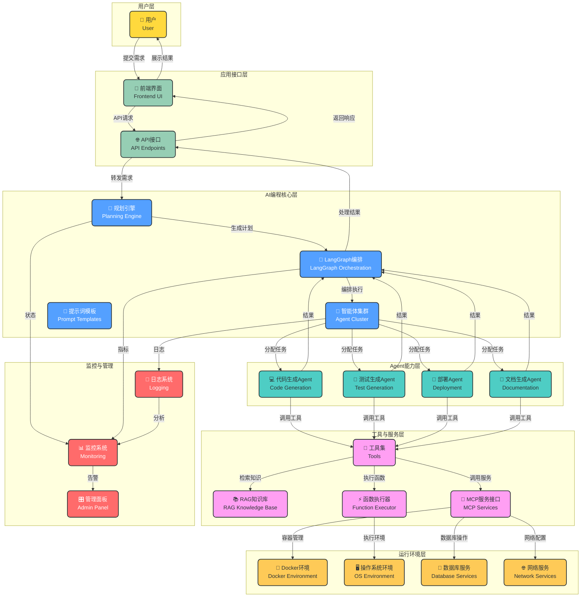
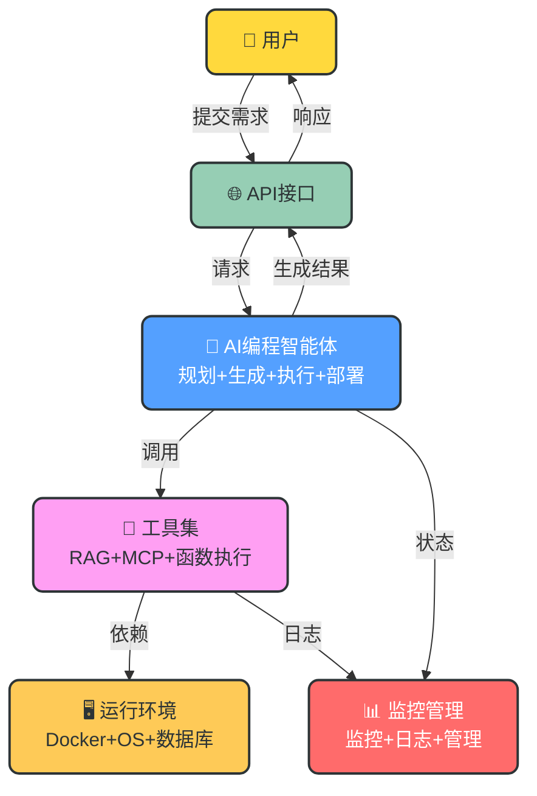

# AI编程智能体架构设计

## 项目概述

本项目是一个基于FastAPI的企业级AI编程智能体框架，能够接收用户编程需求，自动规划任务、生成代码、执行测试并部署。系统采用分层设计，集成了现代AI编程工具链，提供高性能、可扩展的编程自动化解决方案，适用于企业软件开发、自动化测试、持续部署等多种场景。

## 核心架构图

## 极简架构图（汇报版）

## 架构组成

### 1. 用户层
- **用户**：通过前端界面与系统交互，提交编程需求

### 2. 应用接口层
- **API接口**：提供标准化的RESTful API，处理用户请求和响应
- **前端界面**：提供用户友好的交互界面，展示任务执行状态和结果

### 3. AI编程核心层
- **规划引擎**：分析用户需求，生成任务执行计划
- **智能体集群**：管理多个专业AI编程智能体
- **LangGraph编排**：协调智能体执行，管理工作流
- **提示词模板**：管理和优化提示词，提高生成质量

### 4. Agent能力层
- **代码生成Agent**：根据需求生成高质量代码
- **测试生成Agent**：生成单元测试和集成测试
- **部署Agent**：负责应用部署和环境配置
- **文档生成Agent**：生成技术文档和使用手册

### 5. 工具与服务层
- **工具集**：集成各种AI编程工具
- **RAG知识库**：检索代码示例、最佳实践等知识
- **MCP服务接口**：调用外部微服务
- **函数执行器**：执行代码和脚本

### 6. 运行环境层
- **Docker环境**：提供隔离的容器运行环境
- **操作系统环境**：支持多种操作系统
- **数据库服务**：提供数据存储支持
- **网络服务**：处理网络通信

### 7. 监控与管理
- **监控系统**：监控系统健康和性能
- **日志系统**：记录系统运行日志
- **管理面板**：提供系统管理界面

## 核心流程

### 1. 需求处理流程
1. **用户提交需求**：用户通过前端界面提交编程需求
2. **API请求处理**：API接口接收并验证请求
3. **需求分析与规划**：规划引擎分析需求，生成任务执行计划
4. **Agent编排**：LangGraph根据计划编排Agent执行
5. **任务分配**：智能体集群将任务分配给相应的专业Agent

### 2. Agent执行流程
1. **代码生成**：代码生成Agent生成符合需求的代码
2. **测试生成**：测试生成Agent生成测试用例
3. **测试执行**：执行测试用例，验证代码质量
4. **部署执行**：部署Agent将代码部署到目标环境
5. **文档生成**：文档生成Agent生成相关文档

### 3. 结果反馈流程
1. **结果收集**：收集各Agent的执行结果
2. **结果处理**：处理和整合执行结果
3. **响应生成**：生成用户友好的响应
4. **结果返回**：通过API接口返回结果给用户
5. **结果展示**：前端界面展示执行结果

### 4. 监控管理流程
1. **状态监控**：监控系统实时监控各组件状态
2. **日志记录**：日志系统记录系统运行日志
3. **性能分析**：分析系统性能指标
4. **告警处理**：当出现异常时触发告警
5. **系统管理**：通过管理面板进行系统配置和管理

## 技术特点

- **模块化设计**：各组件解耦，支持独立扩展和替换
- **多Agent协作**：多个专业Agent协同工作，提高执行效率
- **LangGraph编排**：基于LangGraph的强大工作流管理
- **RAG增强**：结合检索增强生成，提高代码质量
- **Docker化部署**：支持容器化部署，环境一致性好
- **完整监控体系**：实时监控系统状态，确保高可用性
- **可扩展性**：支持水平扩展，适应不同规模需求
- **安全可靠**：完善的安全措施和权限管理

## 应用场景

- **企业软件开发**：自动化代码生成、测试和部署
- **快速原型开发**：快速生成原型代码，加速产品迭代
- **自动化测试**：自动生成和执行测试用例
- **持续集成/持续部署**：自动化CI/CD流程
- **代码重构**：辅助代码重构，提高代码质量
- **技术文档生成**：自动生成技术文档和API文档
- **教育与培训**：作为编程学习辅助工具
- **开源项目贡献**：辅助开源项目开发和维护

## 技术栈

### 核心框架
- **FastAPI**：高性能API框架
- **LangGraph**：Agent编排框架
- **LangChain**：AI应用开发框架

### 大模型支持
- **OpenAI API**：GPT系列模型
- **本地部署模型**：如Qwen、DeepSeek等

### 工具集
- **代码生成**：GitHub Copilot、CodeLlama
- **测试生成**：TestGPT、Diffblue
- **部署工具**：Docker、Kubernetes
- **文档生成**：Docusaurus、Sphinx

### 基础设施
- **容器编排**：Kubernetes
- **监控系统**：Prometheus + Grafana
- **日志系统**：ELK Stack / Loki
- **数据库**：MongoDB、MySQL
- **向量数据库**：Pinecone、Milvus

## 总结

本架构设计提供了一个完整、可扩展、高性能的AI编程智能体解决方案，结合了现代AI编程工具链的最佳实践。通过模块化设计和多Agent协作，实现了从用户需求到代码部署的全流程自动化。

该架构不仅满足当前的AI编程需求，也为未来的技术发展和业务增长预留了空间，是构建现代智能编程系统的理想选择。系统支持灵活的功能扩展和定制，可根据不同企业的需求进行调整，提高软件开发效率，降低开发成本，加速产品上市时间。