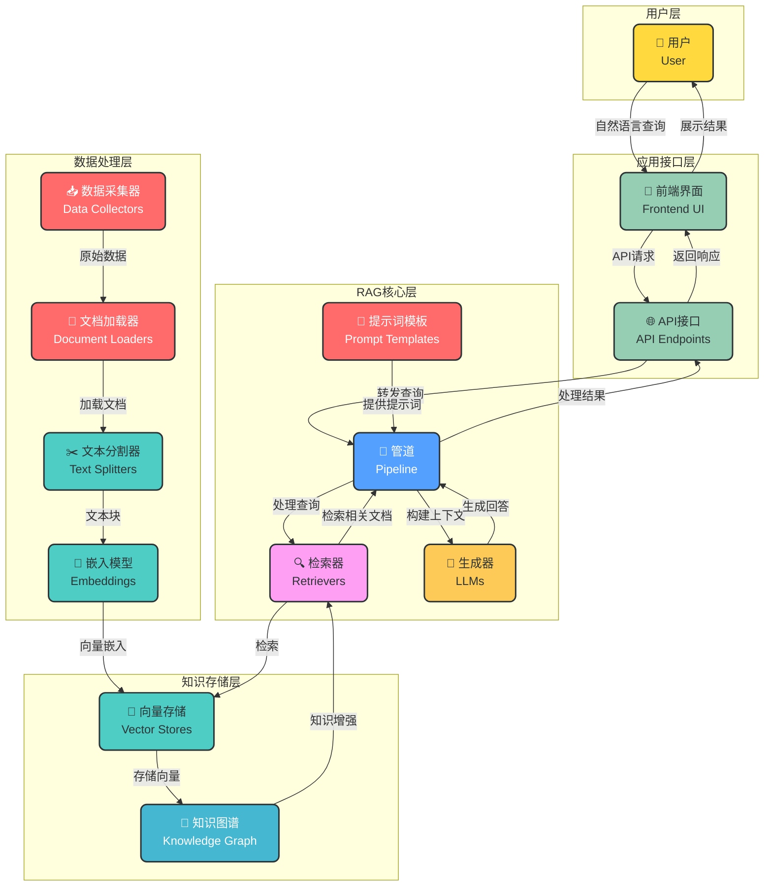
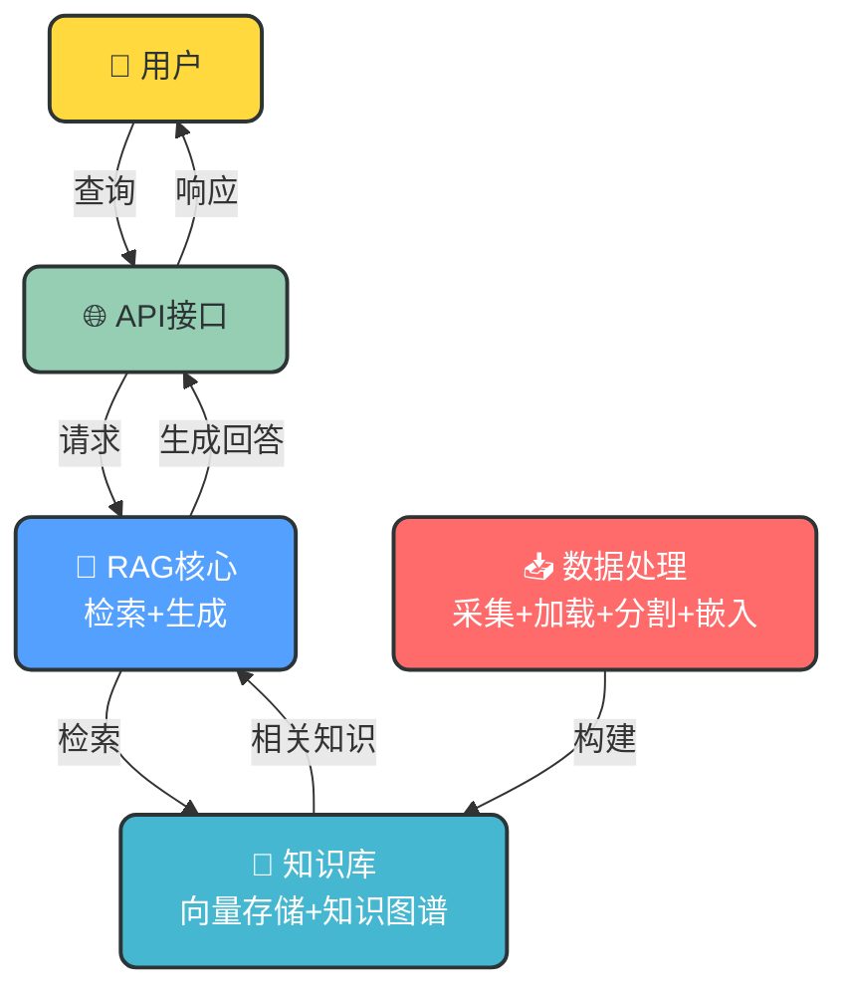

# RAG知识库架构简要总结

## 项目概述

本项目是一个基于FastAPI的企业级框架模板，集成了完整的RAG（Retrieval-Augmented Generation）知识库功能。项目采用模块化设计，提供了高性能、可扩展的知识库解决方案，适用于企业内部知识管理、客户支持、教育培训等多种场景。

## 核心架构图

## 极简架构图（汇报版）

## 架构组成

### 1. 用户层
- **用户**：通过前端界面与系统交互，发送自然语言查询

### 2. 应用接口层
- **API接口**：提供标准化的RESTful API，处理用户请求和响应
- **前端界面**：提供用户友好的交互界面，展示查询结果

### 3. RAG核心层
- **管道**：协调检索和生成过程，管理数据流
- **检索器**：根据用户查询检索相关文档
- **生成器**：基于检索的上下文生成回答
- **提示词模板**：管理和优化提示词，提高生成质量

### 4. 知识存储层
- **向量存储**：存储文本向量嵌入，支持高效相似性搜索
- **知识图谱**：构建和管理实体之间的关系网络，增强知识表达

### 5. 数据处理层
- **数据采集器**：从多种来源采集数据
- **文档加载器**：将不同格式的文档加载为统一表示
- **文本分割器**：将长文本分割为合适大小的文本块
- **嵌入模型**：将文本转换为向量表示

## 核心流程

1. **数据处理流程**：
   - 数据采集 → 文档加载 → 文本分割 → 嵌入模型 → 向量存储 → 知识图谱构建

2. **用户查询流程**：
   - 用户发送查询 → 前端界面 → API接口 → 管道处理 → 检索器检索 → 构建上下文 → 生成器生成回答 → 评估反馈 → 返回结果

3. **知识增强流程**：
   - 向量存储提供语义检索 → 知识图谱补充结构化知识 → 融合检索结果 → 构建丰富上下文 → 生成高质量回答

## 技术特点

- **模块化设计**：各组件解耦，支持独立扩展和替换
- **多模态支持**：可处理文本、图像等多种数据类型
- **高性能检索**：优化的向量存储和检索算法
- **可扩展性**：支持水平扩展和垂直扩展
- **安全可靠**：完善的安全措施和监控机制

## 应用场景

- **企业知识库**：存储和检索企业内部知识
- **客户支持**：提供智能客服，回答客户问题
- **教育培训**：构建教育资源库，支持个性化学习
- **医疗健康**：管理医疗知识，辅助诊断和治疗
- **金融服务**：提供金融知识查询，支持投资决策

## 总结

本架构设计提供了一个完整、可扩展、高性能的RAG知识库解决方案，结合了现代知识库系统的最佳实践。通过模块化设计和插件系统，支持灵活的功能扩展和定制，满足不同场景的需求。

该架构不仅满足当前的知识库需求，也为未来的技术发展和业务增长预留了空间，是构建现代智能知识库的理想选择。