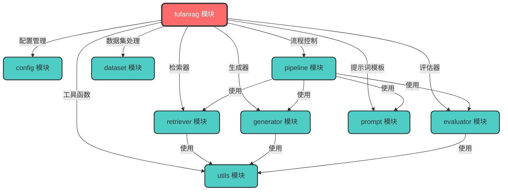
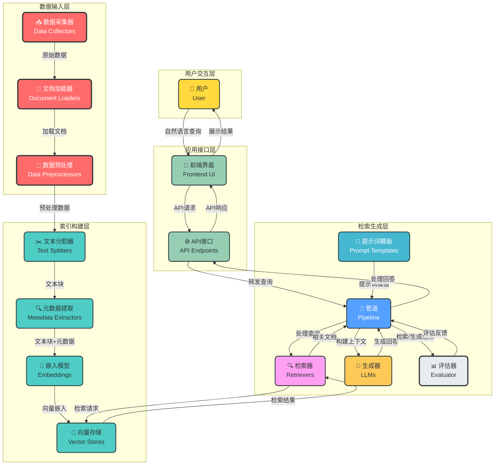
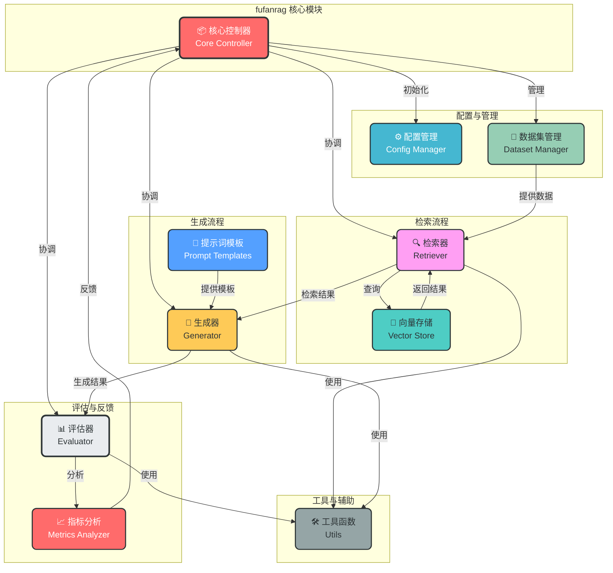
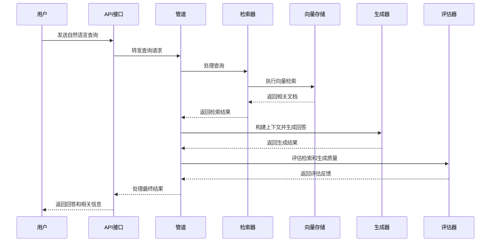

# RAG 知识库模块设计

## 模块架构图

```mermaid
flowchart TD
    A["fufanrag 模块"]:::main -->|配置管理| B["config 模块"]:::module
    A -->|流程控制| C["pipeline 模块"]:::module
    A -->|检索器| D["retriever 模块"]:::module
    A -->|生成器| E["generator 模块"]:::module
    A -->|评估器| F["evaluator 模块"]:::module
    A -->|提示词模板| G["prompt 模块"]:::module
    A -->|数据集处理| H["dataset 模块"]:::module
    A -->|工具函数| I["utils 模块"]:::module
    
    C -->|使用| D
    C -->|使用| E
    C -->|使用| F
    C -->|使用| G
    
    D -->|使用| I
    E -->|使用| I
    F -->|使用| I
    
    classDef main fill:#FF6B6B,stroke:#2D3436,stroke-width:3px,color:white,rx:8,ry:8;
    classDef module fill:#4ECDC4,stroke:#2D3436,stroke-width:2px,color:#2D3436,rx:8,ry:8;
```

## RAG 核心流程与数据流

```mermaid
flowchart TD
    subgraph "用户交互层"
        U["👤 用户<br/>User"]:::user
    end
    
    subgraph "数据输入层"
        I1["📥 数据采集器<br/>Data Collectors"]:::input
        I2["📄 文档加载器<br/>Document Loaders"]:::input
        I3["🔄 数据预处理<br/>Data Preprocessors"]:::input
    end
    
    subgraph "索引构建层"
        A1["✂️ 文本分割器<br/>Text Splitters"]:::index
        A2["🔍 元数据提取<br/>Metadata Extractors"]:::index
        A3["🔢 嵌入模型<br/>Embeddings"]:::index
        A4["💾 向量存储<br/>Vector Stores"]:::index
    end
    
    subgraph "检索生成层"
        B1["🔍 检索器<br/>Retrievers"]:::retriever
        B2["🔗 管道<br/>Pipeline"]:::pipeline
        B3["🤖 生成器<br/>LLMs"]:::generator
        B4["📝 提示词模板<br/>Prompt Templates"]:::prompt
        B5["📊 评估器<br/>Evaluator"]:::evaluator
    end
    
    subgraph "应用接口层"
        C1["🌐 API接口<br/>API Endpoints"]:::api
        C2["📱 前端界面<br/>Frontend UI"]:::api
    end
    
    %% 数据输入流程
    I1 -->|原始数据| I2
    I2 -->|加载文档| I3
    I3 -->|预处理数据| A1
    A1 -->|文本块| A2
    A2 -->|文本块+元数据| A3
    A3 -->|向量嵌入| A4
    
    %% 用户请求流程
    U -->|自然语言查询| C2
    C2 -->|API请求| C1
    C1 -->|转发查询| B2
    B2 -->|处理查询| B1
    B1 -->|相关文档| B2
    B4 -->|提示词模板| B2
    B2 -->|构建上下文| B3
    B3 -->|生成回答| B2
    B2 -->|处理回答| C1
    C1 -->|API响应| C2
    C2 -->|展示结果| U
    
    %% 评估反馈流程
    B2 -->|检索/生成结果| B5
    B5 -->|评估反馈| B2
    
    %% 数据流向存储
    B1 -->|检索请求| A4
    A4 -->|检索结果| B1
    
    classDef user fill:#FFD93D,stroke:#2D3436,stroke-width:2px,color:#2D3436,rx:8,ry:8;
    classDef input fill:#FF6B6B,stroke:#2D3436,stroke-width:3px,color:white,rx:8,ry:8;
    classDef index fill:#4ECDC4,stroke:#2D3436,stroke-width:2px,color:#2D3436,rx:8,ry:8;
    classDef retriever fill:#FF9FF3,stroke:#2D3436,stroke-width:2px,color:#2D3436,rx:8,ry:8;
    classDef pipeline fill:#54A0FF,stroke:#2D3436,stroke-width:2px,color:white,rx:8,ry:8;
    classDef generator fill:#FECA57,stroke:#2D3436,stroke-width:2px,color:#2D3436,rx:8,ry:8;
    classDef prompt fill:#45B7D1,stroke:#2D3436,stroke-width:2px,color:white,rx:8,ry:8;
    classDef evaluator fill:#E9ECEF,stroke:#2D3436,stroke-width:3px,color:#2D3436,rx:8,ry:8;
    classDef api fill:#96CEB4,stroke:#2D3436,stroke-width:2px,color:#2D3436,rx:8,ry:8;
```

## 模块内部数据流详细说明

```mermaid
flowchart TD
    subgraph "fufanrag 核心模块"
        CORE["📦 核心控制器<br/>Core Controller"]:::main
    end
    
    subgraph "配置与管理"
        CONF["⚙️ 配置管理<br/>Config Manager"]:::config
        DATA["📁 数据集管理<br/>Dataset Manager"]:::data
    end
    
    subgraph "检索流程"
        RET["🔍 检索器<br/>Retriever"]:::retriever
        VEC["💾 向量存储<br/>Vector Store"]:::vector
    end
    
    subgraph "生成流程"
        GEN["🤖 生成器<br/>Generator"]:::generator
        PRO["📝 提示词模板<br/>Prompt Templates"]:::prompt
    end
    
    subgraph "评估与反馈"
        EVAL["📊 评估器<br/>Evaluator"]:::evaluator
        MET["📈 指标分析<br/>Metrics Analyzer"]:::metrics
    end
    
    subgraph "工具与辅助"
        UTIL["🛠️ 工具函数<br/>Utils"]:::util
    end
    
    %% 核心控制流
    CORE -->|初始化| CONF
    CORE -->|管理| DATA
    CORE -->|协调| RET
    CORE -->|协调| GEN
    CORE -->|协调| EVAL
    
    %% 数据流程
    DATA -->|提供数据| RET
    RET -->|查询| VEC
    VEC -->|返回结果| RET
    RET -->|检索结果| GEN
    PRO -->|提供模板| GEN
    GEN -->|生成结果| EVAL
    EVAL -->|分析| MET
    MET -->|反馈| CORE
    
    %% 工具使用
    RET -->|使用| UTIL
    GEN -->|使用| UTIL
    EVAL -->|使用| UTIL
    
    classDef main fill:#FF6B6B,stroke:#2D3436,stroke-width:3px,color:white,rx:8,ry:8;
    classDef config fill:#45B7D1,stroke:#2D3436,stroke-width:2px,color:white,rx:8,ry:8;
    classDef data fill:#96CEB4,stroke:#2D3436,stroke-width:2px,color:#2D3436,rx:8,ry:8;
    classDef retriever fill:#FF9FF3,stroke:#2D3436,stroke-width:2px,color:#2D3436,rx:8,ry:8;
    classDef vector fill:#4ECDC4,stroke:#2D3436,stroke-width:2px,color:#2D3436,rx:8,ry:8;
    classDef generator fill:#FECA57,stroke:#2D3436,stroke-width:2px,color:#2D3436,rx:8,ry:8;
    classDef prompt fill:#54A0FF,stroke:#2D3436,stroke-width:2px,color:white,rx:8,ry:8;
    classDef evaluator fill:#E9ECEF,stroke:#2D3436,stroke-width:3px,color:#2D3436,rx:8,ry:8;
    classDef metrics fill:#FF6B6B,stroke:#2D3436,stroke-width:2px,color:white,rx:8,ry:8;
    classDef util fill:#95A5A6,stroke:#2D3436,stroke-width:2px,color:#2D3436,rx:8,ry:8;
```

## RAG 知识库工作流程

```mermaid
sequenceDiagram
    participant User as 用户
    participant API as API接口
    participant Pipeline as 管道
    participant Retriever as 检索器
    participant VectorStore as 向量存储
    participant Generator as 生成器
    participant Evaluator as 评估器
    
    User->>API: 发送自然语言查询
    API->>Pipeline: 转发查询请求
    Pipeline->>Retriever: 处理查询
    
    Retriever->>VectorStore: 执行向量检索
    VectorStore-->>Retriever: 返回相关文档
    
    Retriever-->>Pipeline: 返回检索结果
    Pipeline->>Generator: 构建上下文并生成回答
    Generator-->>Pipeline: 返回生成结果
    
    Pipeline->>Evaluator: 评估检索和生成质量
    Evaluator-->>Pipeline: 返回评估反馈
    
    Pipeline-->>API: 处理最终结果
    API-->>User: 返回回答和相关信息
```
</parameter>
<index>
0
</index>
</function>