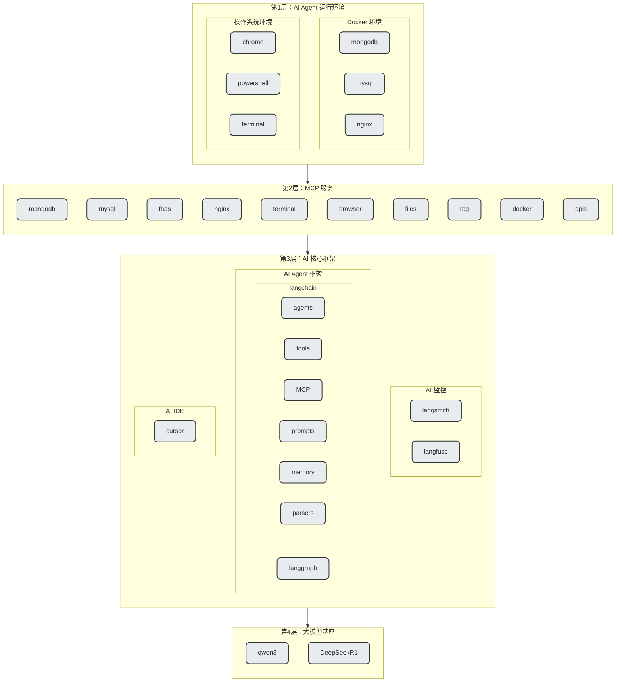

```mermaid
graph TB
    %% 严格使用预设配色+样式规范，统一圆角rx8 ry8，避免STYLESEPARATOR报错
    classDef level1 fill:#45B7D1,stroke:#2D3436,stroke-width:3px,color:white,rx:8,ry:8
    classDef level2 fill:#4ECDC4,stroke:#2D3436,stroke-width:2px,color:#2D3436,rx:8,ry:8
    classDef level3 fill:#96CEB4,stroke:#2D3436,stroke-width:2px,color:#2D3436,rx:8,ry:8
    classDef level4 fill:#FFEAA7,stroke:#2D3436,stroke-width:2px,color:#2D3436,rx:8,ry:8
    classDef nodeStyle fill:#E9ECEF,stroke:#2D3436,stroke-width:2px,color:#2D3436,rx:8,ry:8
    
    %% 第1层：AI Agent 运行环境（来自1.md）
    subgraph Level1["第1层：AI Agent 运行环境"]
        direction TB
        subgraph DockerEnv["Docker 环境"]
            mongodb1[mongodb]:::nodeStyle
            mysql1[mysql]:::nodeStyle
            nginx1[nginx]:::nodeStyle
        end
        subgraph OSEnv["操作系统环境"]
            chrome[chrome]:::nodeStyle
            powershell[powershell]:::nodeStyle
            terminal[terminal]:::nodeStyle
        end
    end
    
    %% 第2层：MCP 服务（来自2.md）
    subgraph Level2["第2层：MCP 服务"]
        direction TB
        mongodb2[mongodb]:::nodeStyle
        mysql2[mysql]:::nodeStyle
        faas[faas]:::nodeStyle
        nginx2[nginx]:::nodeStyle
        terminal2[terminal]:::nodeStyle
        browser[browser]:::nodeStyle
        files[files]:::nodeStyle
        rag[rag]:::nodeStyle
        docker[docker]:::nodeStyle
        apis[apis]:::nodeStyle
    end
    
    %% 第3层：AI 核心框架（来自3.md，移除大模型基座）
    subgraph Level3["第3层：AI 核心框架"]
        direction TB
        subgraph AIMonitor["AI 监控"]
            langsmith[langsmith]:::nodeStyle
            langfuse[langfuse]:::nodeStyle
        end
        
        subgraph AIAgentFrame["AI Agent 框架"]
            langgraph[langgraph]:::nodeStyle
            subgraph langchain["langchain"]
                agents[agents]:::nodeStyle
                tools[tools]:::nodeStyle
                mcp[MCP]:::nodeStyle
                prompts[prompts]:::nodeStyle
                memory[memory]:::nodeStyle
                parsers[parsers]:::nodeStyle
            end
        end
        
        subgraph AIIde["AI IDE"]
            cursor[cursor]:::nodeStyle
        end
    end
    
    %% 第4层：大模型基座（来自3.md，提升为第4层）
    subgraph Level4["第4层：大模型基座"]
        direction TB
        qwen3[qwen3]:::nodeStyle
        DeepSeekR1[DeepSeekR1]:::nodeStyle
    end
    
    %% 层级关系连线
    Level1 --> Level2
    Level2 --> Level3
    Level3 --> Level4
    
    %% 绑定样式
    style Level1 level1
    style Level2 level2
    style Level3 level3
    style Level4 level4
    style DockerEnv level2
    style OSEnv level2
    style AIMonitor level3
    style AIAgentFrame level3
    style AIIde level3
    style langchain nodeStyle
```