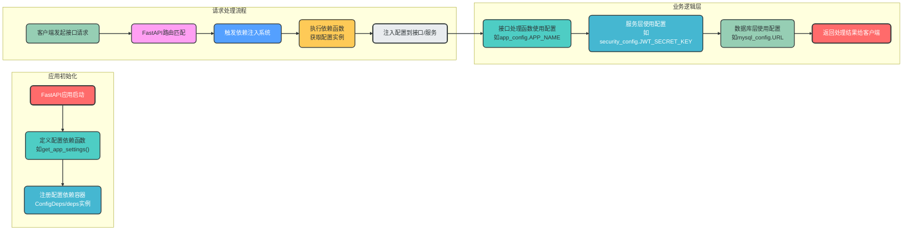
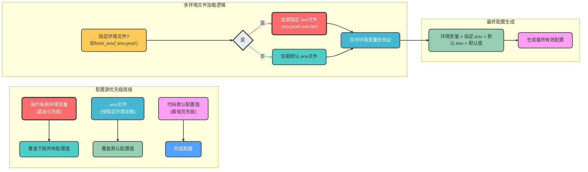

# FastAPI企业家架构 - 配置模块设计

## 一、核心流程图
### 1. 配置加载核心流程

```mermaid
flowchart LR
    %% 初始化阶段
    subgraph 初始化阶段
        A["创建配置类实例<br/>如AppSettings()"]:::primary 
        A --> B["触发配置加载流程"]:::secondary
    end
    
    %% 配置加载阶段
    subgraph 配置加载阶段
        B --> C["加载操作系统环境变量"]:::tertiary
        C --> D["加载指定.env文件<br/>(.env/.env.test/.env.prod)"]:::quaternary
        D --> E["合并配置源<br/>环境变量覆盖.env文件值"]:::quinary
    end
    
    %% 验证与返回阶段
    subgraph 验证与返回阶段
        E --> F["Pydantic配置验证<br/>类型检查/值校验"]:::senary
        F --> G{"验证通过?"}:::septenary
        G -- 是 --> H["返回初始化配置实例"]:::octonary
        G -- 否 --> I["抛出配置验证异常"]:::primary
    end
    
    %% 样式定义（仅保留Mermaid 100%兼容属性）
    classDef primary fill:#FF6B6B,stroke:#2D3436,stroke-width:3px,color:white,rx:8,ry:8
    classDef secondary fill:#4ECDC4,stroke:#2D3436,stroke-width:2px,color:#2D3436,rx:8,ry:8
    classDef tertiary fill:#45B7D1,stroke:#2D3436,stroke-width:2px,color:white,rx:8,ry:8
    classDef quaternary fill:#96CEB4,stroke:#2D3436,stroke-width:2px,color:#2D3436,rx:8,ry:8
    classDef quinary fill:#FF9FF3,stroke:#2D3436,stroke-width:2px,color:#2D3436,rx:8,ry:8
    classDef senary fill:#54A0FF,stroke:#2D3436,stroke-width:2px,color:white,rx:8,ry:8
    classDef septenary fill:#FECA57,stroke:#2D3436,stroke-width:2px,color:#2D3436,rx:8,ry:8
    classDef octonary fill:#E9ECEF,stroke:#2D3436,stroke-width:3px,color:#2D3436,rx:8,ry:8
```



### 2. 配置依赖注入使用流程



### 3. 多环境配置加载优先级流程



## 文档目的

本文档详细介绍了FastAPI企业家架构中的配置模块设计，旨在为开发人员提供清晰的配置管理指南，包括配置加载方式、环境变量使用、.env配置文件管理、默认配置设置、配置加载优先级以及配置生效条件等核心内容。

## 阅读指南

- **设计概述**：了解配置模块的整体设计理念和核心功能
- **目录结构**：掌握配置模块的文件组织和职责划分
- **核心实现**：深入学习配置基类、主配置类和各组件配置的实现细节
- **依赖注入**：理解如何通过FastAPI依赖注入获取配置
- **环境变量配置**：学习多环境配置文件的编写规范
- **配置使用示例**：掌握在应用中如何使用配置
- **最佳实践**：遵循配置管理的推荐做法
- **扩展功能**：了解配置模块的扩展能力和高级特性

## 二、设计概述

本设计实现了一套**生产级的配置管理模块**，基于FastAPI框架和pydantic-settings库，用于加载和管理.env环境变量、数据库配置以及应用配置。该设计遵循**单一职责原则**、**依赖倒置原则**和**开闭原则**，具有良好的可扩展性、可维护性和类型安全性。

### 核心功能

- **基于pydantic-settings**：使用最新的pydantic-settings库加载和验证配置
- **环境变量管理**：支持多环境配置（开发、测试、生产）
- **数据库配置**：统一管理多种数据库（MySQL、PostgreSQL、Redis等）的配置
- **配置注入**：支持通过FastAPI Depends进行配置依赖注入
- **类型安全**：所有配置项都有明确的类型定义和验证
- **灵活扩展**：支持动态添加新的配置项和配置源

## 三、目录结构设计

```
fastapi_entrepreneur/
├── app/                     # 应用核心目录
│   ├── __init__.py          # 应用初始化
│   ├── main.py              # 应用入口
│   ├── config/              # 配置模块
│   │   ├── __init__.py      # 配置导出和依赖注入
│   │   ├── base.py          # 配置基类和通用工具
│   │   ├── settings.py      # 主配置类
│   │   ├── database.py      # 数据库配置
│   │   ├── redis.py         # Redis配置
│   │   └── security.py      # 安全配置
│   └── ...                  # 其他模块
├── .env                     # 开发环境变量
├── .env.test                # 测试环境变量
├── .env.prod                # 生产环境变量
├── pyproject.toml           # 项目依赖配置
└── README.md                # 项目说明文档
```

## 四、配置模块核心实现

### 1. 配置基类设计

配置模块的核心是`BaseSettings`基类，它统一了所有配置类的加载逻辑，支持从多种源加载配置。

#### 配置加载流程

1. **初始化配置类**：当创建配置类实例时（如`AppSettings()`），配置基类会自动触发加载流程
2. **加载环境变量**：首先从操作系统环境变量中加载符合命名规则的配置
3. **加载.env文件**：然后从指定的.env文件中加载配置，覆盖默认值
4. **验证配置**：使用pydantic的验证功能确保所有配置项的类型和值都符合要求
5. **返回配置实例**：返回一个完全初始化且经过验证的配置实例

```python
# app/config/base.py
from typing import Optional
from pydantic_settings import BaseSettings as PydanticBaseSettings
from pydantic_settings import SettingsConfigDict

class BaseSettings(PydanticBaseSettings):
    """配置基类，统一配置加载逻辑"""
    
    model_config = SettingsConfigDict(
        env_file=".env",         # 默认.env文件路径
        env_file_encoding="utf-8", # 文件编码
        case_sensitive=False,      # 环境变量不区分大小写
        extra="ignore"              # 忽略未知配置项
    )
    
    @classmethod
    def from_env(cls, env_file: Optional[str] = None) -> "BaseSettings":
        """从指定环境文件加载配置
        
        Args:
            env_file: 环境文件路径，如果不指定则使用默认路径
            
        Returns:
            配置实例
        """
        if env_file:
            return cls(_env_file=env_file)
        return cls()
```

### 2. 主配置类

主配置类`AppSettings`定义了应用的核心配置项，并为每个配置项提供了合理的默认值。

#### 默认配置的设计与作用

**默认配置的作用：**
- **降低使用门槛**：用户无需设置所有配置项即可快速启动应用
- **确保应用稳定性**：为关键配置提供安全的默认值
- **简化开发流程**：开发人员无需在开发环境中配置所有项
- **提供明确的配置参考**：默认值展示了配置项的预期用途和格式

**默认配置的设计原则：**
- **安全性优先**：默认值应遵循安全最佳实践（如DEBUG=True仅在开发环境默认）
- **开发友好**：开发环境默认值应便于本地开发和调试
- **合理默认**：默认值应适合大多数使用场景
- **明确性**：默认值应清晰表达配置项的预期用途

```python
# app/config/settings.py
from typing import Optional
from app.config.base import BaseSettings

class AppSettings(BaseSettings):
    """应用主配置"""
    
    # 应用基本信息 - 提供明确的应用标识默认值
    APP_NAME: str = "FastAPI Entrepreneur"
    APP_VERSION: str = "1.0.0"
    APP_DESCRIPTION: str = "FastAPI企业家架构配置模块"
    
    # 运行环境 - 默认开发环境便于开发调试
    ENVIRONMENT: str = "development"  # development, testing, production
    DEBUG: bool = True                # 开发环境默认开启调试模式
    
    # 服务器配置 - 默认配置便于本地开发
    HOST: str = "0.0.0.0"             # 监听所有网络接口
    PORT: int = 8000                  # 默认使用8000端口
    RELOAD: bool = True               # 开发环境默认开启自动重载
    
    # CORS配置 - 开发环境默认允许所有跨域请求
    CORS_ORIGINS: list[str] = ["*"]
    CORS_ALLOW_CREDENTIALS: bool = True
    CORS_ALLOW_METHODS: list[str] = ["*"]
    CORS_ALLOW_HEADERS: list[str] = ["*"]
    
    # 日志配置 - 默认INFO级别平衡信息和性能
    LOG_LEVEL: str = "INFO"
    LOG_FILE: Optional[str] = None    # 默认不输出到文件
    
    # 配置文件优先级
    model_config = BaseSettings.model_config.copy()
    model_config["env_prefix"] = "APP_"  # 应用配置的环境变量前缀

# 创建全局配置实例 - 应用启动时自动加载配置
app_settings = AppSettings()
```

### 3. 数据库配置

```python
# app/config/database.py
from typing import Optional
from app.config.base import BaseSettings

class MySQLConfig(BaseSettings):
    """MySQL数据库配置"""
    
    HOST: str = "localhost"
    PORT: int = 3306
    USER: str = "root"
    PASSWORD: str = "password"
    DATABASE: str = "fastapi_entrepreneur"
    CHARSET: str = "utf8mb4"
    
    # 连接池配置
    POOL_SIZE: int = 10
    MAX_OVERFLOW: int = 20
    POOL_PRE_PING: bool = True
    POOL_RECYCLE: int = 3600
    
    # SQLAlchemy配置
    ECHO_SQL: bool = False
    
    @property
    def URL(self) -> str:
        """生成MySQL连接URL"""
        return f"mysql+pymysql://{self.USER}:{self.PASSWORD}@{self.HOST}:{self.PORT}/{self.DATABASE}?charset={self.CHARSET}"
    
    model_config = BaseSettings.model_config.copy()
    model_config["env_prefix"] = "MYSQL_"

class PostgreSQLConfig(BaseSettings):
    """PostgreSQL数据库配置"""
    
    HOST: str = "localhost"
    PORT: int = 5432
    USER: str = "postgres"
    PASSWORD: str = "password"
    DATABASE: str = "fastapi_entrepreneur"
    
    # 连接池配置
    POOL_SIZE: int = 10
    MAX_OVERFLOW: int = 20
    POOL_PRE_PING: bool = True
    
    @property
    def URL(self) -> str:
        """生成PostgreSQL连接URL"""
        return f"postgresql+psycopg2://{self.USER}:{self.PASSWORD}@{self.HOST}:{self.PORT}/{self.DATABASE}"
    
    model_config = BaseSettings.model_config.copy()
    model_config["env_prefix"] = "POSTGRES_"

class SQLiteConfig(BaseSettings):
    """SQLite数据库配置"""
    
    DATABASE_FILE: str = "app.db"
    
    @property
    def URL(self) -> str:
        """生成SQLite连接URL"""
        return f"sqlite:///{self.DATABASE_FILE}"
    
    model_config = BaseSettings.model_config.copy()
    model_config["env_prefix"] = "SQLITE_"

# 创建数据库配置实例
mysql_config = MySQLConfig()
postgres_config = PostgreSQLConfig()
sqlite_config = SQLiteConfig()
```

### 4. Redis配置

```python
# app/config/redis.py
from typing import Optional
from app.config.base import BaseSettings

class RedisConfig(BaseSettings):
    """Redis配置"""
    
    HOST: str = "localhost"
    PORT: int = 6379
    PASSWORD: Optional[str] = None
    DB: int = 0
    PREFIX: str = "fastapi_entrepreneur"
    
    # 连接池配置
    MAX_CONNECTIONS: int = 100
    
    # 超时配置
    CONNECTION_TIMEOUT: int = 5
    READ_TIMEOUT: int = 3
    WRITE_TIMEOUT: int = 3
    
    @property
    def URL(self) -> str:
        """生成Redis连接URL"""
        if self.PASSWORD:
            return f"redis://:{self.PASSWORD}@{self.HOST}:{self.PORT}/{self.DB}"
        return f"redis://{self.HOST}:{self.PORT}/{self.DB}"
    
    model_config = BaseSettings.model_config.copy()
    model_config["env_prefix"] = "REDIS_"

# 创建Redis配置实例
redis_config = RedisConfig()
```

### 5. 安全配置

```python
# app/config/security.py
from typing import Optional
from app.config.base import BaseSettings

class SecurityConfig(BaseSettings):
    """安全配置"""
    
    # JWT配置
    JWT_SECRET_KEY: str = "your-secret-key-here"
    JWT_ALGORITHM: str = "HS256"
    JWT_ACCESS_TOKEN_EXPIRE_MINUTES: int = 30
    JWT_REFRESH_TOKEN_EXPIRE_DAYS: int = 7
    
    # 密码配置
    PASSWORD_HASH_ALGORITHM: str = "bcrypt"
    PASSWORD_HASH_ROUNDS: int = 12
    
    # CORS配置
    CORS_ORIGINS: list[str] = ["*"]
    
    model_config = BaseSettings.model_config.copy()
    model_config["env_prefix"] = "SECURITY_"

# 创建安全配置实例
security_config = SecurityConfig()
```

## 五、配置依赖注入实现

### 1. 配置导出和依赖注入

```python
# app/config/__init__.py
from fastapi import Depends
from app.config.settings import app_settings, AppSettings
from app.config.database import (
    mysql_config, MySQLConfig,
    postgres_config, PostgreSQLConfig,
    sqlite_config, SQLiteConfig
)
from app.config.redis import redis_config, RedisConfig
from app.config.security import security_config, SecurityConfig

# 配置依赖注入函数
def get_app_settings() -> AppSettings:
    """获取应用主配置"""
    return app_settings

def get_mysql_config() -> MySQLConfig:
    """获取MySQL配置"""
    return mysql_config

def get_postgres_config() -> PostgreSQLConfig:
    """获取PostgreSQL配置"""
    return postgres_config

def get_sqlite_config() -> SQLiteConfig:
    """获取SQLite配置"""
    return sqlite_config

def get_redis_config() -> RedisConfig:
    """获取Redis配置"""
    return redis_config

def get_security_config() -> SecurityConfig:
    """获取安全配置"""
    return security_config

# 配置依赖注入容器
class ConfigDeps:
    """配置依赖注入容器，提供统一的配置访问接口"""
    
    @staticmethod
    def app():
        """应用主配置依赖"""
        return Depends(get_app_settings)
    
    @staticmethod
    def mysql():
        """MySQL配置依赖"""
        return Depends(get_mysql_config)
    
    @staticmethod
    def postgres():
        """PostgreSQL配置依赖"""
        return Depends(get_postgres_config)
    
    @staticmethod
    def sqlite():
        """SQLite配置依赖"""
        return Depends(get_sqlite_config)
    
    @staticmethod
    def redis():
        """Redis配置依赖"""
        return Depends(get_redis_config)
    
    @staticmethod
    def security():
        """安全配置依赖"""
        return Depends(get_security_config)

# 导出配置实例和依赖容器
__all__ = [
    # 配置实例
    "app_settings",
    "mysql_config",
    "postgres_config",
    "sqlite_config",
    "redis_config",
    "security_config",
    
    # 配置类型
    "AppSettings",
    "MySQLConfig",
    "PostgreSQLConfig",
    "SQLiteConfig",
    "RedisConfig",
    "SecurityConfig",
    
    # 依赖注入
    "ConfigDeps",
    "deps",
    
    # 依赖函数
    "get_app_settings",
    "get_mysql_config",
    "get_postgres_config",
    "get_sqlite_config",
    "get_redis_config",
    "get_security_config",
]

# 创建依赖容器实例
deps = ConfigDeps()
```

## 六、环境变量配置示例

环境变量是配置管理的核心，本模块支持通过环境变量和.env文件灵活配置应用。

### 环境变量命名规则

- **使用大写字母和下划线**：如`APP_NAME`、`MYSQL_HOST`
- **添加模块前缀**：不同模块的配置使用不同的前缀，避免命名冲突
  - 应用配置：`APP_`
  - MySQL配置：`MYSQL_`
  - PostgreSQL配置：`POSTGRES_`
  - Redis配置：`REDIS_`
  - 安全配置：`SECURITY_`
- **清晰的命名**：配置名应准确反映其用途，如`JWT_ACCESS_TOKEN_EXPIRE_MINUTES`

### .env文件结构

.env文件采用键值对格式，每行表示一个配置项：

```env
# 这是注释
CONFIG_KEY=CONFIG_VALUE
```

### 多环境配置

为不同环境创建独立的.env文件，便于环境切换：

- **开发环境**：`.env` - 本地开发时使用的配置
- **测试环境**：`.env.test` - 测试环境配置
- **生产环境**：`.env.prod` - 生产环境配置

### 1. 开发环境配置 (.env)

```env
# 应用配置
APP_NAME=FastAPI Entrepreneur
APP_VERSION=1.0.0
APP_DESCRIPTION=FastAPI企业家架构配置模块
ENVIRONMENT=development
DEBUG=True
HOST=0.0.0.0
PORT=8000
RELOAD=True

# MySQL配置
MYSQL_HOST=localhost
MYSQL_PORT=3306
MYSQL_USER=root
MYSQL_PASSWORD=password
MYSQL_DATABASE=fastapi_entrepreneur
MYSQL_CHARSET=utf8mb4
MYSQL_POOL_SIZE=10
MYSQL_MAX_OVERFLOW=20
MYSQL_POOL_PRE_PING=True

# Redis配置
REDIS_HOST=localhost
REDIS_PORT=6379
REDIS_PASSWORD=
REDIS_DB=0
REDIS_PREFIX=fastapi_entrepreneur

# 安全配置
SECURITY_JWT_SECRET_KEY=your-development-secret-key-here
SECURITY_JWT_ALGORITHM=HS256
SECURITY_JWT_ACCESS_TOKEN_EXPIRE_MINUTES=30
```

### 2. 生产环境配置 (.env.prod)

```env
# 应用配置
APP_NAME=FastAPI Entrepreneur
APP_VERSION=1.0.0
APP_DESCRIPTION=FastAPI企业家架构配置模块
ENVIRONMENT=production
DEBUG=False
HOST=0.0.0.0
PORT=8000
RELOAD=False

# MySQL配置
MYSQL_HOST=mysql-prod
MYSQL_PORT=3306
MYSQL_USER=prod_user
MYSQL_PASSWORD=strong-prod-password
MYSQL_DATABASE=fastapi_entrepreneur_prod
MYSQL_CHARSET=utf8mb4
MYSQL_POOL_SIZE=20
MYSQL_MAX_OVERFLOW=50
MYSQL_POOL_PRE_PING=True

# Redis配置
REDIS_HOST=redis-prod
REDIS_PORT=6379
REDIS_PASSWORD=strong-redis-password
REDIS_DB=0
REDIS_PREFIX=fastapi_entrepreneur_prod

# 安全配置
SECURITY_JWT_SECRET_KEY=your-production-secret-key-here
SECURITY_JWT_ALGORITHM=HS256
SECURITY_JWT_ACCESS_TOKEN_EXPIRE_MINUTES=60
```

### 使用指定的.env文件

通过`from_env`方法可以加载指定的环境文件：

```python
# 加载生产环境配置
from app.config.settings import AppSettings

prod_settings = AppSettings.from_env(".env.prod")
print(prod_settings.ENVIRONMENT)  # 输出: production
```

## 七、配置使用示例

### 1. 在应用入口使用配置

```python
# app/main.py
from fastapi import FastAPI
from fastapi.middleware.cors import CORSMiddleware
from app.config import app_settings, deps
from app.config.database import mysql_config

# 创建FastAPI应用实例
app = FastAPI(
    title=app_settings.APP_NAME,
    version=app_settings.APP_VERSION,
    description=app_settings.APP_DESCRIPTION,
    debug=app_settings.DEBUG
)

# 配置CORS
app.add_middleware(
    CORSMiddleware,
    allow_origins=app_settings.CORS_ORIGINS,
    allow_credentials=app_settings.CORS_ALLOW_CREDENTIALS,
    allow_methods=app_settings.CORS_ALLOW_METHODS,
    allow_headers=app_settings.CORS_ALLOW_HEADERS,
)

# 测试配置依赖注入
@app.get("/config")
def get_config(
    app_config: deps.app(),
    mysql_config: deps.mysql(),
    redis_config: deps.redis()
):
    """获取配置信息"""
    return {
        "app_name": app_config.APP_NAME,
        "environment": app_config.ENVIRONMENT,
        "mysql_host": mysql_config.HOST,
        "redis_url": redis_config.URL
    }

# 启动应用
if __name__ == "__main__":
    import uvicorn
    uvicorn.run(
        "app.main:app",
        host=app_settings.HOST,
        port=app_settings.PORT,
        reload=app_settings.RELOAD
    )
```

### 2. 在服务层使用配置

```python
# app/services/user_service.py
from fastapi import Depends
from app.config import deps, SecurityConfig
from app.models.user import User
from app.schemas.user import UserCreate, UserResponse

class UserService:
    """用户服务"""
    
    def __init__(self, security_config: SecurityConfig = deps.security()):
        self.security_config = security_config
    
    def create_user(self, user_in: UserCreate) -> UserResponse:
        """创建用户"""
        # 使用安全配置进行密码哈希
        hashed_password = self._hash_password(user_in.password)
        # 创建用户逻辑...
        return UserResponse(
            id=1,
            username=user_in.username,
            email=user_in.email
        )
    
    def _hash_password(self, password: str) -> str:
        """哈希密码"""
        # 使用安全配置中的哈希算法
        # 实际实现中应使用passlib等库
        return f"hashed_{password}_{self.security_config.PASSWORD_HASH_ALGORITHM}"
```

### 3. 在数据库连接中使用配置

```python
# app/database/connection.py
from sqlalchemy import create_engine
from sqlalchemy.ext.declarative import declarative_base
from sqlalchemy.orm import sessionmaker
from app.config import mysql_config

# 创建SQLAlchemy引擎
engine = create_engine(
    mysql_config.URL,
    pool_size=mysql_config.POOL_SIZE,
    max_overflow=mysql_config.MAX_OVERFLOW,
    pool_pre_ping=mysql_config.POOL_PRE_PING,
    echo=mysql_config.ECHO_SQL
)

# 创建会话工厂
SessionLocal = sessionmaker(autocommit=False, autoflush=False, bind=engine)

# 创建模型基类
Base = declarative_base()

# 数据库会话依赖注入
def get_db():
    """获取数据库会话"""
    db = SessionLocal()
    try:
        yield db
    finally:
        db.close()
```

## 八、配置管理最佳实践

### 1. 配置命名规范

- **使用大写字母和下划线**：如`APP_NAME`、`MYSQL_HOST`
- **添加前缀**：不同类型的配置使用不同的前缀，如`MYSQL_`、`REDIS_`、`SECURITY_`
- **清晰的命名**：配置名应清晰反映其用途，如`JWT_ACCESS_TOKEN_EXPIRE_MINUTES`

### 2. 环境变量管理

- **多环境分离**：为不同环境创建独立的.env文件
- **敏感信息保护**：不在代码中硬编码敏感信息，如密码、密钥等
- **版本控制排除**：将.env文件添加到.gitignore，避免敏感信息泄露
- **配置示例**：提供.env.example文件，包含所有必需的配置项和示例值

### 3. 配置验证

- **使用pydantic验证**：利用pydantic的验证功能确保配置的完整性和正确性
- **添加默认值**：为可选配置项提供合理的默认值
- **类型注解**：为所有配置项添加明确的类型注解
- **自定义验证**：对复杂的配置项添加自定义验证逻辑

### 4. 配置加载顺序

1. **环境变量**：从操作系统环境变量加载
2. **.env文件**：从当前目录的.env文件加载
3. **默认值**：使用代码中定义的默认值

### 5. 配置注入最佳实践

- **使用依赖注入**：通过依赖注入方式获取配置，便于测试和替换
- **避免全局访问**：尽量避免直接访问全局配置实例，优先使用依赖注入
- **配置隔离**：不同模块只获取所需的配置，避免过度依赖
- **测试友好**：支持在测试中轻松替换配置

## 九、扩展功能设计

### 1. 支持多种配置源

可以扩展配置模块，支持从多种源加载配置：

```python
# app/config/base.py - 扩展版
from typing import Optional, Dict, Any
from pydantic_settings import BaseSettings as PydanticBaseSettings
from pydantic_settings import SettingsConfigDict
from pydantic import Field

class BaseSettings(PydanticBaseSettings):
    """扩展配置基类，支持多种配置源"""
    
    # 配置源优先级：环境变量 > .env文件 > 代码默认值
    model_config = SettingsConfigDict(
        env_file=".env",
        env_file_encoding="utf-8",
        case_sensitive=False,
        extra="ignore",
        # 支持从不同路径加载配置
        env_file=("/etc/app/config.env", ".env.local", ".env")
    )
    
    @classmethod
    def from_dict(cls, config_dict: Dict[str, Any]) -> "BaseSettings":
        """从字典加载配置"""
        return cls(**config_dict)
    
    @classmethod
    def from_json(cls, json_str: str) -> "BaseSettings":
        """从JSON字符串加载配置"""
        import json
        return cls(**json.loads(json_str))
```

### 2. 配置热重载

支持配置的热重载，无需重启应用即可更新配置：

```python
# app/config/settings.py - 支持热重载
from typing import Optional
from pydantic_settings import BaseSettings as PydanticBaseSettings
from pydantic_settings import SettingsConfigDict
import watchfiles
import asyncio

class AppSettings(PydanticBaseSettings):
    """支持热重载的应用配置"""
    
    # 配置项...
    
    model_config = SettingsConfigDict(
        env_file=".env",
        env_file_encoding="utf-8",
        case_sensitive=False,
        extra="ignore"
    )
    
    def watch_changes(self, callback: callable) -> None:
        """监听配置文件变化"""
        """
        async def watcher():
            async for changes in watchfiles.awatch(".env", ".env.*"):
                print("配置文件已更改，重新加载配置...")
                # 重新加载配置
                new_settings = AppSettings()
                # 更新当前实例的属性
                for key, value in new_settings.model_dump().items():
                    setattr(self, key, value)
                # 调用回调函数
                callback(self)
        
        # 启动监听任务
        asyncio.create_task(watcher())
```

### 3. 配置监控和日志

添加配置监控和日志功能，便于追踪配置变化：

```python
# app/config/monitoring.py
from typing import Dict, Any
import logging
from app.config import app_settings

logger = logging.getLogger(__name__)

class ConfigMonitor:
    """配置监控类，用于记录配置变化"""
    
    def __init__(self):
        self._previous_config = app_settings.model_dump()
    
    def check_changes(self) -> Dict[str, Any]:
        """检查配置变化"""
        current_config = app_settings.model_dump()
        changes = {}
        
        # 检查配置变化
        for key, value in current_config.items():
            if key not in self._previous_config:
                changes[key] = {"old": None, "new": value}
            elif self._previous_config[key] != value:
                changes[key] = {"old": self._previous_config[key], "new": value}
        
        # 检查删除的配置项
        for key in self._previous_config:
            if key not in current_config:
                changes[key] = {"old": self._previous_config[key], "new": None}
        
        # 更新之前的配置
        self._previous_config = current_config.copy()
        
        # 记录配置变化
        if changes:
            logger.info(f"配置已更改: {changes}")
        
        return changes
```

## 十、总结

本设计实现了一套**生产级的配置管理模块**，基于FastAPI和pydantic-settings，具有以下优势：

1. **类型安全**：所有配置项都有明确的类型定义和验证，减少运行时错误
2. **易于扩展**：支持动态添加新的配置项和配置源
3. **环境友好**：支持多环境配置，便于开发、测试和生产环境的切换
4. **依赖注入**：支持通过FastAPI Depends进行配置依赖注入，便于测试和替换
5. **清晰的结构**：配置模块结构清晰，便于维护和管理
6. **最佳实践**：遵循了配置管理的最佳实践，如命名规范、敏感信息保护等

该配置模块设计适用于各种规模的FastAPI应用，尤其是需要管理多种数据库和复杂配置的中大型应用。通过合理使用该配置模块，可以提高应用的可维护性、可扩展性和安全性，同时降低配置管理的复杂度。