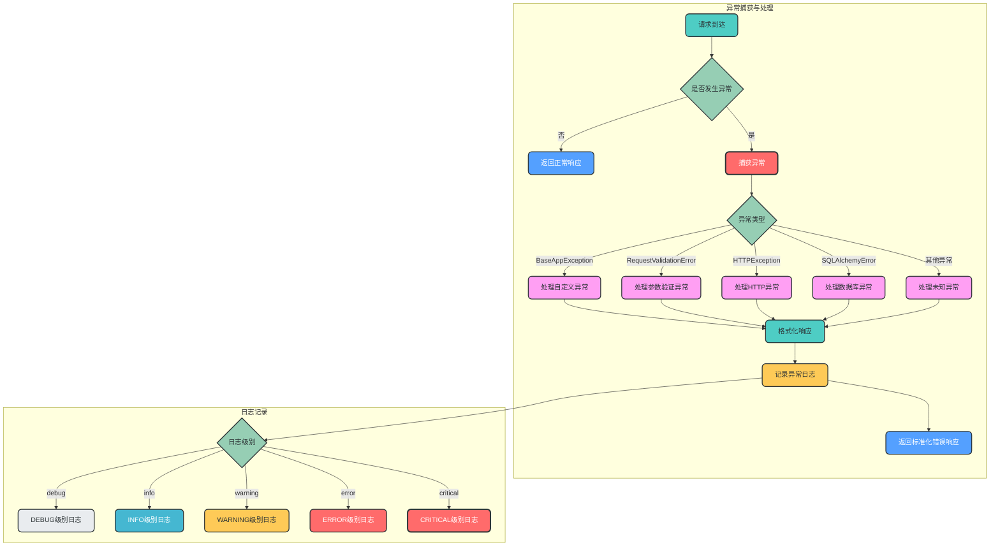

# FastAPI 企业级全局异常处理模块设计

## 1. 文档概述

### 1.1 设计目标

本设计文档旨在为FastAPI应用提供一套企业级别的全局异常处理解决方案，实现标准化响应、分层异常体系、全类型异常捕获、请求链路追踪和精细化日志管理，同时保证架构的可扩展性和易维护性。

### 1.2 适用场景

适用于中大型FastAPI应用，特别是需要：
- 统一前后端交互规范
- 精细化错误管理
- 完善的问题追踪机制
- 高可扩展性的异常处理架构

## 2. 核心设计思路

| 设计原则 | 实现方案 | 预期效果 |
|---------|---------|---------|
| 标准化响应 | 统一成功/失败返回结构 | 降低前后端对接成本，提高API一致性 |
| 分层异常体系 | 按业务场景拆分异常类型 | 便于异常分类管理和扩展 |
| 全量异常捕获 | 覆盖所有异常类型 | 确保系统稳定性，避免未处理异常导致崩溃 |
| 请求链路追踪 | Request ID关联请求上下文 | 便于问题定位和日志分析 |
| 日志分级记录 | 不同异常类型对应不同日志级别 | 便于监控和问题排查，保护敏感信息 |
| 易扩展架构 | 模块化设计，支持按需扩展 | 降低维护成本，适应业务变化 |

## 3. 架构设计

### 3.1 模块分层结构

```
├── exception/
│   ├── __init__.py                # 包初始化文件，导出核心组件
│   ├── base.py                    # 基础异常类定义
│   ├── business.py                # 业务相关异常类
│   ├── http.py                    # HTTP相关异常类
│   ├── auth.py                    # 认证授权相关异常类
│   ├── database.py                # 数据库相关异常类
│   ├── handler.py                 # 全局异常处理器
│   └── response.py                # 标准化响应工具
├── middleware/
│   ├── __init__.py                # 包初始化文件
│   └── request.py                 # 请求ID中间件、请求日志中间件
├── config/
│   └── logger.py                  # 日志配置
├── schemas/
│   └── response.py                # 响应模型定义
└── utils/
    └── request.py                 # 请求工具
```

### 3.2 核心组件关系

```mermaid
flowchart TD
    subgraph 请求处理流程
        A[客户端请求] --> B[Request ID中间件<br/>(middleware/request.py)]
        B --> C[请求日志中间件<br/>(middleware/request.py)]
        C --> D[FastAPI路由处理]
        D --> E{业务逻辑执行}
        E -->|正常| F[返回标准化成功响应]
        E -->|异常| G[抛出异常]
        G --> H[全局异常处理器]
        H --> I[返回标准化错误响应]
    end
    
    subgraph 异常处理体系
        G -->|自定义业务异常| J[BusinessException]
        G -->|认证授权异常| K[AuthException]
        G -->|资源不存在| L[NotFoundException]
        G -->|参数验证异常| M[ValidationException]
        G -->|数据库异常| N[DatabaseException]
        G -->|未知异常| O[Exception]
        
        J --> H
        K --> H
        L --> H
        M --> H
        N --> H
        O --> H
    end
    
    subgraph 日志与追踪
        C --> P[记录请求日志]
        P --> Q[关联Request ID]
        Q --> R[按级别分类存储]
        H --> S[记录异常日志]
        S --> T[关联Request ID]
        T --> U[按级别分类存储]
        B --> V[生成Request ID]
        V --> W[添加到请求上下文]
        W --> X[添加到响应头]
    end
    
    style A fill:#FF6B6B,stroke:#2D3436,stroke-width:3px,color:white,rx:8,ry:8
    style B fill:#4ECDC4,stroke:#2D3436,stroke-width:2px,color:#2D3436,rx:8,ry:8
    style C fill:#4ECDC4,stroke:#2D3436,stroke-width:2px,color:#2D3436,rx:8,ry:8
    style D fill:#45B7D1,stroke:#2D3436,stroke-width:2px,color:white,rx:8,ry:8
    style E fill:#96CEB4,stroke:#2D3436,stroke-width:2px,color:#2D3436,rx:8,ry:8
    style F fill:#54A0FF,stroke:#2D3436,stroke-width:2px,color:white,rx:8,ry:8
    style G fill:#FF9FF3,stroke:#2D3436,stroke-width:2px,color:#2D3436,rx:8,ry:8
    style H fill:#4ECDC4,stroke:#2D3436,stroke-width:2px,color:#2D3436,rx:8,ry:8
    style I fill:#54A0FF,stroke:#2D3436,stroke-width:2px,color:white,rx:8,ry:8
    style J fill:#FF6B6B,stroke:#2D3436,stroke-width:2px,color:white,rx:8,ry:8
    style K fill:#FF6B6B,stroke:#2D3436,stroke-width:2px,color:white,rx:8,ry:8
    style L fill:#FF6B6B,stroke:#2D3436,stroke-width:2px,color:white,rx:8,ry:8
    style M fill:#FF6B6B,stroke:#2D3436,stroke-width:2px,color:white,rx:8,ry:8
    style N fill:#FF6B6B,stroke:#2D3436,stroke-width:2px,color:white,rx:8,ry:8
    style O fill:#FF6B6B,stroke:#2D3436,stroke-width:2px,color:white,rx:8,ry:8
    style P fill:#FECA57,stroke:#2D3436,stroke-width:2px,color:#2D3436,rx:8,ry:8
    style Q fill:#FECA57,stroke:#2D3436,stroke-width:2px,color:#2D3436,rx:8,ry:8
    style R fill:#FECA57,stroke:#2D3436,stroke-width:2px,color:#2D3436,rx:8,ry:8
    style S fill:#FECA57,stroke:#2D3436,stroke-width:2px,color:#2D3436,rx:8,ry:8
    style T fill:#FECA57,stroke:#2D3436,stroke-width:2px,color:#2D3436,rx:8,ry:8
    style U fill:#FECA57,stroke:#2D3436,stroke-width:2px,color:#2D3436,rx:8,ry:8
    style V fill:#4ECDC4,stroke:#2D3436,stroke-width:2px,color:#2D3436,rx:8,ry:8
    style W fill:#4ECDC4,stroke:#2D3436,stroke-width:2px,color:#2D3436,rx:8,ry:8
    style X fill:#4ECDC4,stroke:#2D3436,stroke-width:2px,color:#2D3436,rx:8,ry:8
```

## 4. 标准化响应格式

### 4.1 统一响应格式设计

为了确保API响应的一致性，我们在`schemas/response.py`中定义了统一的响应模型，成功响应和错误响应共享相同的基础结构，仅在数据字段上有所差异。

#### 4.1.1 基础响应模型

```python
# schemas/response.py
from pydantic import BaseModel
from typing import Any, Optional

class BaseResponse(BaseModel):
    """基础响应模型，所有响应的统一结构"""
    code: int
    message: str
    request_id: str
    
    class Config:
        from_attributes = True

class SuccessResponse(BaseResponse):
    """成功响应模型"""
    data: Any = None
    
    class Config:
        arbitrary_types_allowed = True

class ErrorResponse(BaseResponse):
    """错误响应模型"""
    error_details: Optional[dict] = None
```

#### 4.1.2 成功响应格式

```json
{
    "code": 200,
    "message": "success",
    "data": {
        // 业务数据
    },
    "request_id": "uuid-v4-string"
}
```

#### 4.1.3 错误响应格式

```json
{
    "code": 400,
    "message": "错误描述信息",
    "error_details": {
        // 详细错误信息（可选，生产环境可配置隐藏）
    },
    "request_id": "uuid-v4-string"
}
```

#### 4.1.4 设计合理性说明

1. **统一基础结构**：成功响应和错误响应共享相同的`code`、`message`和`request_id`字段，确保前后端对接的一致性
2. **差异化数据字段**：
   - 成功响应使用`data`字段返回业务数据
   - 错误响应使用`error_details`字段返回详细错误信息
   - 这种设计既保证了基础结构的统一，又允许根据响应类型返回不同的数据
3. **类型安全**：通过Pydantic模型确保响应格式的类型安全
4. **可扩展性**：可以轻松扩展基础响应模型，添加更多公共字段
5. **清晰的语义区分**：通过不同的响应类名和字段名，清晰区分成功和错误场景
6. **生产环境友好**：`error_details`字段为可选，便于在生产环境隐藏敏感错误信息

### 4.3 响应状态码映射

| 业务状态码 | HTTP状态码 | 含义 |
|----------|-----------|------|
| 200 | 200 | 成功 |
| 400 | 400 | 请求参数错误 |
| 401 | 401 | 未认证 |
| 403 | 403 | 无权限 |
| 404 | 404 | 资源不存在 |
| 409 | 409 | 资源冲突 |
| 500 | 500 | 服务器内部错误 |
| 502 | 502 | 网关错误 |
| 503 | 503 | 服务不可用 |
| 504 | 504 | 网关超时 |

## 5. 自定义异常体系

### 5.1 基础异常类设计

```python
# exception/base.py
class BaseAppException(Exception):
    """应用基础异常类"""
    def __init__(
        self,
        message: str = "服务器内部错误",
        code: int = 500,
        error_details: dict = None,
        log_level: str = "error"
    ):
        self.message = message
        self.code = code
        self.error_details = error_details or {}
        self.log_level = log_level
        super().__init__(self.message)
```

### 5.2 业务异常分层

```mermaid
classDiagram
    class BaseAppException {
        +message: str
        +code: int
        +error_details: dict
        +log_level: str
        +__init__(message, code, error_details, log_level)
    }
    
    class BusinessException {
        +__init__(message, code=400, error_details=None, log_level="warning")
    }
    
    class AuthException {
        +__init__(message, code=401, error_details=None, log_level="warning")
    }
    
    class ForbiddenException {
        +__init__(message, code=403, error_details=None, log_level="warning")
    }
    
    class NotFoundException {
        +__init__(message, code=404, error_details=None, log_level="info")
    }
    
    class ValidationException {
        +__init__(message, code=400, error_details=None, log_level="info")
    }
    
    class DatabaseException {
        +__init__(message, code=500, error_details=None, log_level="error")
    }
    
    class ThirdPartyException {
        +__init__(message, code=502, error_details=None, log_level="error")
    }
    
    BaseAppException <|-- BusinessException
    BaseAppException <|-- AuthException
    BaseAppException <|-- ForbiddenException
    BaseAppException <|-- NotFoundException
    BaseAppException <|-- ValidationException
    BaseAppException <|-- DatabaseException
    BaseAppException <|-- ThirdPartyException
```



### 5.3 异常类实现

```python
# exception/business.py
from .base import BaseAppException

class BusinessException(BaseAppException):
    """业务逻辑异常"""
    def __init__(
        self,
        message: str = "业务逻辑错误",
        code: int = 400,
        error_details: dict = None,
        log_level: str = "warning"
    ):
        super().__init__(message, code, error_details, log_level)

class NotFoundException(BaseAppException):
    """资源不存在异常"""
    def __init__(
        self,
        message: str = "资源不存在",
        code: int = 404,
        error_details: dict = None,
        log_level: str = "info"
    ):
        super().__init__(message, code, error_details, log_level)

# exception/auth.py
class AuthException(BaseAppException):
    """认证异常"""
    def __init__(
        self,
        message: str = "认证失败",
        code: int = 401,
        error_details: dict = None,
        log_level: str = "warning"
    ):
        super().__init__(message, code, error_details, log_level)

class ForbiddenException(BaseAppException):
    """权限不足异常"""
    def __init__(
        self,
        message: str = "权限不足",
        code: int = 403,
        error_details: dict = None,
        log_level: str = "warning"
    ):
        super().__init__(message, code, error_details, log_level)

# exception/http.py
class ValidationException(BaseAppException):
    """参数验证异常"""
    def __init__(
        self,
        message: str = "参数验证失败",
        code: int = 400,
        error_details: dict = None,
        log_level: str = "info"
    ):
        super().__init__(message, code, error_details, log_level)

# exception/database.py
class DatabaseException(BaseAppException):
    """数据库异常"""
    def __init__(
        self,
        message: str = "数据库操作失败",
        code: int = 500,
        error_details: dict = None,
        log_level: str = "error"
    ):
        super().__init__(message, code, error_details, log_level)
```

## 6. 全局异常捕获机制

### 6.1 异常捕获流程



### 6.2 全局异常处理器实现

```python
# exception/handler.py
from fastapi import Request, status
from fastapi.responses import JSONResponse
from fastapi.exceptions import RequestValidationError
from starlette.exceptions import HTTPException as StarletteHTTPException
from sqlalchemy.exc import SQLAlchemyError
from .base import BaseAppException
from .response import ErrorResponse
from config.logger import logger
from utils.request import get_request_id

async def custom_exception_handler(request: Request, exc: Exception):
    """全局异常处理器
    
    使用async关键字的原因：
    1. FastAPI要求异常处理器必须是异步函数，以匹配其异步处理模型
    2. 支持在异常处理过程中调用异步操作（如异步日志记录、异步数据库操作等）
    3. 保持与FastAPI框架的设计一致性，充分利用异步IO的性能优势
    4. 允许在异常处理中使用await关键字调用其他异步组件
    
    异步处理器与同步方法的关系：
    - 异步异常处理器**可以处理同步方法抛出的异常**
    - FastAPI框架会自动处理同步函数的调用，包括异常捕获
    - 当同步方法抛出异常时，FastAPI会将其转换为异步异常处理流程
    - 这种设计确保了无论业务代码是同步还是异步，都能得到统一的异常处理
    """
    request_id = get_request_id(request)
    
    # 1. 处理自定义异常
    if isinstance(exc, BaseAppException):
        error_response = ErrorResponse(
            code=exc.code,
            message=exc.message,
            error_details=exc.error_details,
            request_id=request_id
        )
        log_level = exc.log_level
    
    # 2. 处理FastAPI参数验证异常
    elif isinstance(exc, RequestValidationError):
        error_details = {
            "errors": exc.errors(),
            "body": exc.body
        }
        error_response = ErrorResponse(
            code=status.HTTP_400_BAD_REQUEST,
            message="请求参数验证失败",
            error_details=error_details,
            request_id=request_id
        )
        log_level = "info"
    
    # 3. 处理Starlette HTTP异常
    elif isinstance(exc, StarletteHTTPException):
        error_response = ErrorResponse(
            code=exc.status_code,
            message=exc.detail,
            request_id=request_id
        )
        log_level = "warning" if exc.status_code < 500 else "error"
    
    # 4. 处理数据库异常
    elif isinstance(exc, SQLAlchemyError):
        error_details = {
            "original_error": str(exc)
        }
        error_response = ErrorResponse(
            code=status.HTTP_500_INTERNAL_SERVER_ERROR,
            message="数据库操作失败",
            error_details=error_details,
            request_id=request_id
        )
        log_level = "error"
    
    # 5. 处理其他未知异常
    else:
        error_details = {
            "exception_type": type(exc).__name__,
            "original_error": str(exc)
        }
        error_response = ErrorResponse(
            code=status.HTTP_500_INTERNAL_SERVER_ERROR,
            message="服务器内部错误",
            error_details=error_details,
            request_id=request_id
        )
        log_level = "error"
    
    # 记录异常日志
    log_exception(request, exc, error_response, log_level)
    
    # 返回标准化错误响应
    return JSONResponse(
        status_code=error_response.code,
        content=error_response.dict()
    )


def log_exception(request: Request, exc: Exception, error_response: ErrorResponse, log_level: str):
    """记录异常日志"""
    log_data = {
        "request_id": error_response.request_id,
        "path": request.url.path,
        "method": request.method,
        "client_ip": request.client.host if request.client else "unknown",
        "code": error_response.code,
        "message": error_response.message,
        "error_details": error_response.error_details,
        "exception_type": type(exc).__name__
    }
    
    # 根据日志级别记录日志
    if log_level == "debug":
        logger.debug(f"[Exception] {error_response.message}", extra=log_data)
    elif log_level == "info":
        logger.info(f"[Exception] {error_response.message}", extra=log_data)
    elif log_level == "warning":
        logger.warning(f"[Exception] {error_response.message}", extra=log_data)
    elif log_level == "error":
        logger.error(f"[Exception] {error_response.message}", extra=log_data, exc_info=True)
    elif log_level == "critical":
        logger.critical(f"[Exception] {error_response.message}", extra=log_data, exc_info=True)
```

### 6.3 标准化响应工具

响应构建器已优化，使用`schemas/response.py`中定义的统一响应模型，确保所有响应格式的一致性。

```python
# exception/response.py
from typing import Any, Optional
from schemas.response import SuccessResponse, ErrorResponse

class ResponseBuilder:
    """响应构建器，基于统一响应模型"""
    
    @staticmethod
    def success(data: Any = None, message: str = "success", code: int = 200, request_id: str = None) -> dict:
        """构建成功响应"""
        return SuccessResponse(
            code=code,
            message=message,
            data=data,
            request_id=request_id
        ).dict()
    
    @staticmethod
    def error(message: str, code: int, error_details: Optional[dict] = None, request_id: str = None) -> dict:
        """构建错误响应"""
        return ErrorResponse(
            code=code,
            message=message,
            error_details=error_details,
            request_id=request_id
        ).dict()
```

## 7. 请求ID链路追踪

### 7.1 Request ID 生成与传递

```mermaid
flowchart TD
    subgraph Request ID 生命周期
        A[客户端请求] --> B{是否携带Request ID}
        B -->|是| C[使用客户端提供的Request ID]
        B -->|否| D[生成新的Request ID]
        
        C --> E[存储Request ID到请求上下文]
        D --> E
        
        E --> F[记录请求日志（关联Request ID）]
        F --> G[处理请求]
        G --> H{是否调用第三方服务}
        
        H -->|是| I[传递Request ID到第三方服务]
        I --> J[处理第三方服务响应]
        J --> K
        H -->|否| K
        
        K --> L[记录响应日志（关联Request ID）]
        L --> M[返回响应（包含Request ID）]
        M --> N[客户端接收响应]
    end
    
    style A fill:#4ECDC4,stroke:#2D3436,stroke-width:2px,color:#2D3436,rx:8,ry:8
    style B fill:#96CEB4,stroke:#2D3436,stroke-width:2px,color:#2D3436,rx:8,ry:8
    style C fill:#54A0FF,stroke:#2D3436,stroke-width:2px,color:white,rx:8,ry:8
    style D fill:#54A0FF,stroke:#2D3436,stroke-width:2px,color:white,rx:8,ry:8
    style E fill:#4ECDC4,stroke:#2D3436,stroke-width:2px,color:#2D3436,rx:8,ry:8
    style F fill:#FECA57,stroke:#2D3436,stroke-width:2px,color:#2D3436,rx:8,ry:8
    style G fill:#96CEB4,stroke:#2D3436,stroke-width:2px,color:#2D3436,rx:8,ry:8
    style H fill:#96CEB4,stroke:#2D3436,stroke-width:2px,color:#2D3436,rx:8,ry:8
    style I fill:#45B7D1,stroke:#2D3436,stroke-width:2px,color:white,rx:8,ry:8
    style J fill:#96CEB4,stroke:#2D3436,stroke-width:2px,color:#2D3436,rx:8,ry:8
    style K fill:#96CEB4,stroke:#2D3436,stroke-width:2px,color:#2D3436,rx:8,ry:8
    style L fill:#FECA57,stroke:#2D3436,stroke-width:2px,color:#2D3436,rx:8,ry:8
    style M fill:#54A0FF,stroke:#2D3436,stroke-width:2px,color:white,rx:8,ry:8
    style N fill:#4ECDC4,stroke:#2D3436,stroke-width:2px,color:#2D3436,rx:8,ry:8
```



### 7.2 Request ID 中间件实现

```python
# middleware/request.py
import uuid
from fastapi import Request, Response
from utils.request import set_request_id

async def request_id_middleware(request: Request, call_next):
    """Request ID中间件"""
    # 从请求头获取Request ID，若不存在则生成新的
    request_id = request.headers.get("X-Request-ID", str(uuid.uuid4()))
    
    # 设置Request ID到请求上下文
    set_request_id(request, request_id)
    
    # 处理请求
    response = await call_next(request)
    
    # 将Request ID添加到响应头
    response.headers["X-Request-ID"] = request_id
    
    return response
```

### 7.3 Request ID 工具函数

```python
# utils/request.py
from fastapi import Request

REQUEST_ID_KEY = "request_id"

def set_request_id(request: Request, request_id: str):
    """设置Request ID到请求上下文"""
    if not hasattr(request.state, REQUEST_ID_KEY):
        setattr(request.state, REQUEST_ID_KEY, request_id)

def get_request_id(request: Request) -> str:
    """从请求上下文获取Request ID"""
    return getattr(request.state, REQUEST_ID_KEY, "")
```

### 7.4 请求日志中间件实现

```python
# middleware/request.py
import time
from fastapi import Request, Response
from config.logger import logger
from utils.request import get_request_id

async def request_log_middleware(request: Request, call_next):
    """请求日志中间件"""
    # 记录请求开始时间
    start_time = time.time()
    
    # 获取请求基本信息
    request_id = get_request_id(request)
    path = request.url.path
    method = request.method
    client_ip = request.client.host if request.client else "unknown"
    
    # 记录请求信息（不记录请求体，避免敏感信息泄露）
    logger.info(
        "[Request Received]",
        extra={
            "request_id": request_id,
            "path": path,
            "method": method,
            "client_ip": client_ip,
            "headers": {k: v for k, v in request.headers.items() if k not in ["Authorization", "Cookie"]}
        }
    )
    
    # 处理请求
    response = await call_next(request)
    
    # 计算请求处理时间
    process_time = time.time() - start_time
    
    # 记录响应信息
    logger.info(
        "[Request Completed]",
        extra={
            "request_id": request_id,
            "path": path,
            "method": method,
            "client_ip": client_ip,
            "status_code": response.status_code,
            "process_time": round(process_time * 1000, 2)  # 转换为毫秒
        }
    )
    
    return response
```

## 8. 日志记录策略

### 8.1 日志级别与异常类型映射

| 异常类型 | 建议日志级别 | 说明 |
|---------|------------|------|
| 参数验证异常 | INFO | 客户端请求错误，便于统计和分析 |
| 资源不存在 | INFO | 客户端请求错误，资源未找到 |
| 认证失败 | WARNING | 安全相关，需要关注但不紧急 |
| 权限不足 | WARNING | 安全相关，需要关注但不紧急 |
| 业务逻辑错误 | WARNING | 业务流程错误，需要业务人员关注 |
| 数据库异常 | ERROR | 服务器内部错误，需要立即处理 |
| 第三方服务异常 | ERROR | 外部依赖问题，需要监控和处理 |
| 未知异常 | ERROR | 系统bug，需要紧急修复 |
| 系统崩溃 | CRITICAL | 严重错误，需要立即处理 |

### 8.2 日志内容规范

```json
{
    "timestamp": "2023-01-01T12:00:00.000Z",
    "level": "ERROR",
    "message": "数据库操作失败",
    "request_id": "uuid-v4-string",
    "path": "/api/users/1",
    "method": "GET",
    "client_ip": "192.168.1.1",
    "code": 500,
    "error_details": {
        "original_error": "Database connection failed"
    },
    "exception_type": "SQLAlchemyError",
    "stack_trace": "..."
}
```

### 8.3 日志配置实现

```python
# config/logger.py
import logging
import json
from datetime import datetime

class JSONFormatter(logging.Formatter):
    """JSON格式日志格式化器"""
    
    def format(self, record):
        log_record = {
            "timestamp": datetime.utcnow().isoformat() + "Z",
            "level": record.levelname,
            "message": record.getMessage(),
            "request_id": getattr(record, "request_id", ""),
            "path": getattr(record, "path", ""),
            "method": getattr(record, "method", ""),
            "client_ip": getattr(record, "client_ip", ""),
            "code": getattr(record, "code", 0),
            "error_details": getattr(record, "error_details", {})
        }
        
        # 记录异常信息
        if record.exc_info:
            log_record["exception_type"] = record.exc_info[0].__name__
            log_record["stack_trace"] = self.formatException(record.exc_info)
        
        return json.dumps(log_record, ensure_ascii=False)

# 配置日志器
logger = logging.getLogger("app")
logger.setLevel(logging.DEBUG)

# 移除默认处理器
for handler in logger.handlers[:]:
    logger.removeHandler(handler)

# 添加控制台处理器
console_handler = logging.StreamHandler()
console_handler.setFormatter(JSONFormatter())
logger.addHandler(console_handler)

# 添加文件处理器（生产环境使用）
# file_handler = logging.FileHandler("app.log")
# file_handler.setFormatter(JSONFormatter())
# logger.addHandler(file_handler)
```

## 9. 模块集成与使用

### 9.1 模块注册

```python
# main.py
from fastapi import FastAPI
from exception.handler import custom_exception_handler
from middleware.request import request_id_middleware, request_log_middleware
from exception.base import BaseAppException
from fastapi.exceptions import RequestValidationError
from starlette.exceptions import HTTPException as StarletteHTTPException

app = FastAPI(title="FastAPI Example", version="1.0.0")

# 注册中间件
app.middleware("http")(request_id_middleware)
app.middleware("http")(request_log_middleware)

# 注册异常处理器
app.add_exception_handler(BaseAppException, custom_exception_handler)
app.add_exception_handler(RequestValidationError, custom_exception_handler)
app.add_exception_handler(StarletteHTTPException, custom_exception_handler)
app.add_exception_handler(Exception, custom_exception_handler)
```

### 9.2 业务代码中使用

```python
# api/user.py
from fastapi import APIRouter, Depends
from exception.business import NotFoundException, BusinessException
from exception.auth import AuthException, ForbiddenException
from exception.response import ResponseBuilder
from utils.request import get_request_id

router = APIRouter(prefix="/users", tags=["users"])

@router.get("/{user_id}")
async def get_user(user_id: int, request: Request):
    # 示例1：正常返回
    if user_id == 0:
        return ResponseBuilder.success(
            data={"user_id": 0, "name": "admin"},
            request_id=get_request_id(request)
        )
    
    # 示例2：抛出资源不存在异常
    elif user_id == 1:
        raise NotFoundException(message="用户不存在")
    
    # 示例3：抛出业务逻辑异常
    elif user_id == 2:
        raise BusinessException(message="用户状态异常", error_details={"user_id": user_id})
    
    # 示例4：抛出认证异常
    elif user_id == 3:
        raise AuthException(message="认证失败")
    
    # 示例5：抛出权限不足异常
    else:
        raise ForbiddenException(message="没有访问权限")
```

## 10. 扩展与维护指南

### 10.1 添加新的异常类型

1. 继承BaseAppException或其子类
2. 在exception包下创建新的模块或在现有模块中添加
3. 根据业务需求设置默认code和log_level
4. 在全局异常处理器中添加对应的处理逻辑（如果需要）

### 10.2 扩展异常处理逻辑

1. 在`custom_exception_handler`函数中添加新的异常类型判断
2. 实现对应的处理逻辑
3. 确保返回标准化的ErrorResponse

### 10.3 调整日志策略

1. 修改`config/logger.py`中的日志配置
2. 调整日志级别与异常类型的映射关系
3. 配置不同环境的日志输出格式和位置

### 10.4 扩展响应格式

1. 修改`response.py`中的响应模型
2. 确保向后兼容
3. 更新相关文档

## 11. 部署与配置建议

### 11.1 环境配置

| 配置项 | 开发环境 | 测试环境 | 生产环境 |
|-------|---------|---------|---------|
| 显示错误详情 | True | True | False |
| 日志级别 | DEBUG | INFO | WARNING |
| 日志输出 | 控制台 | 控制台+文件 | 文件+ELK |
| Request ID 生成 | 随机生成 | 随机生成 | 随机生成 |

### 11.2 配置示例

```python
# config.py
from pydantic_settings import BaseSettings
from typing import Optional

class Settings(BaseSettings):
    # 异常处理配置
    SHOW_ERROR_DETAILS: bool = True
    
    # 日志配置
    LOG_LEVEL: str = "DEBUG"
    LOG_FILE: Optional[str] = None
    LOG_FORMAT: str = "json"
    
    class Config:
        env_file = ".env"
        case_sensitive = True

settings = Settings()
```

### 11.3 生产环境优化

1. 关闭错误详情显示，保护敏感信息
2. 使用JSON格式日志，便于日志分析工具处理
3. 配置日志轮转，避免日志文件过大
4. 集成ELK或其他日志分析系统
5. 配置监控告警，及时发现和处理异常

## 12. 总结与展望

### 12.1 设计优势

1. **标准化**：统一的响应格式和异常处理机制，降低前后端对接成本
2. **分层设计**：清晰的异常分类，便于管理和扩展
3. **全量捕获**：覆盖所有异常类型，确保系统稳定性
4. **链路追踪**：Request ID关联请求上下文，便于问题定位
5. **精细化日志**：不同异常类型对应不同日志级别，便于监控和分析
6. **易扩展**：模块化设计，支持按需扩展，不侵入业务代码

### 12.2 未来优化方向

1. 集成APM工具，实现更细粒度的性能监控
2. 添加异常统计和告警功能
3. 实现异常自愈机制，对于某些可恢复的异常自动重试
4. 提供异常处理的可视化管理界面
5. 支持多语言国际化错误信息

## 13. 参考资料

1. [FastAPI官方文档 - 异常处理](https://fastapi.tiangolo.com/tutorial/handling-errors/)
2. [RESTful API设计最佳实践](https://restfulapi.net/)
3. [日志最佳实践](https://12factor.net/logs)
4. [分布式追踪系统设计](https://opentelemetry.io/docs/concepts/what-is-opentelemetry/)
