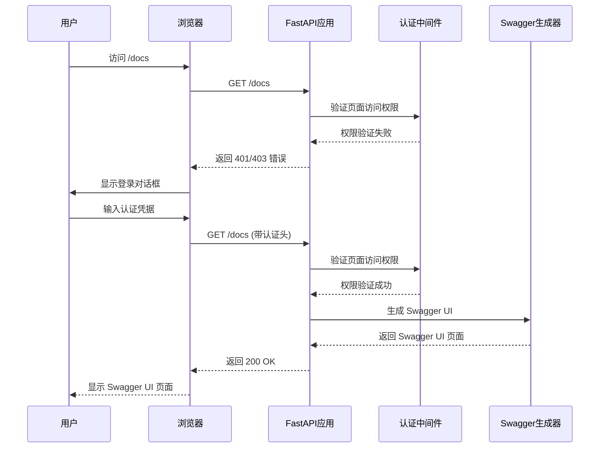
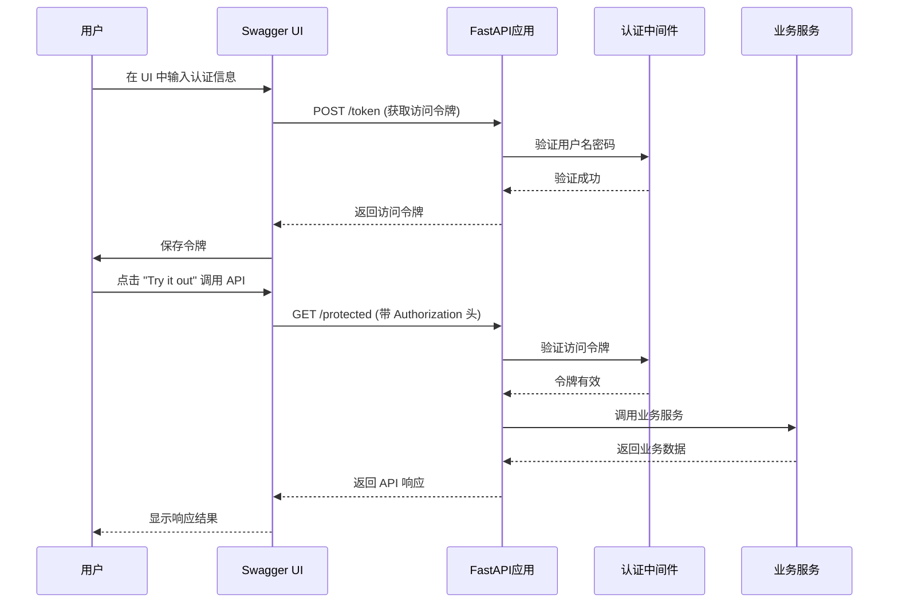
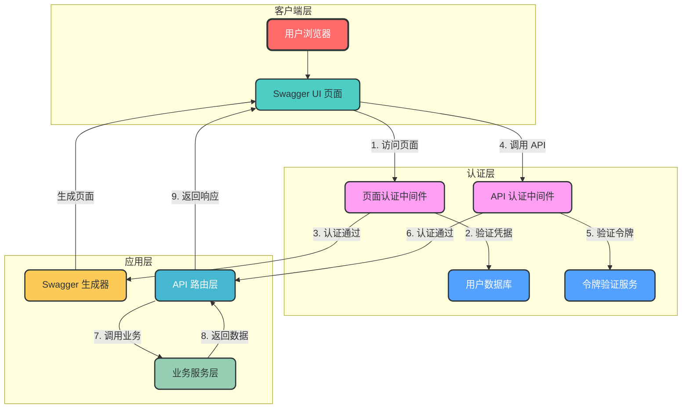
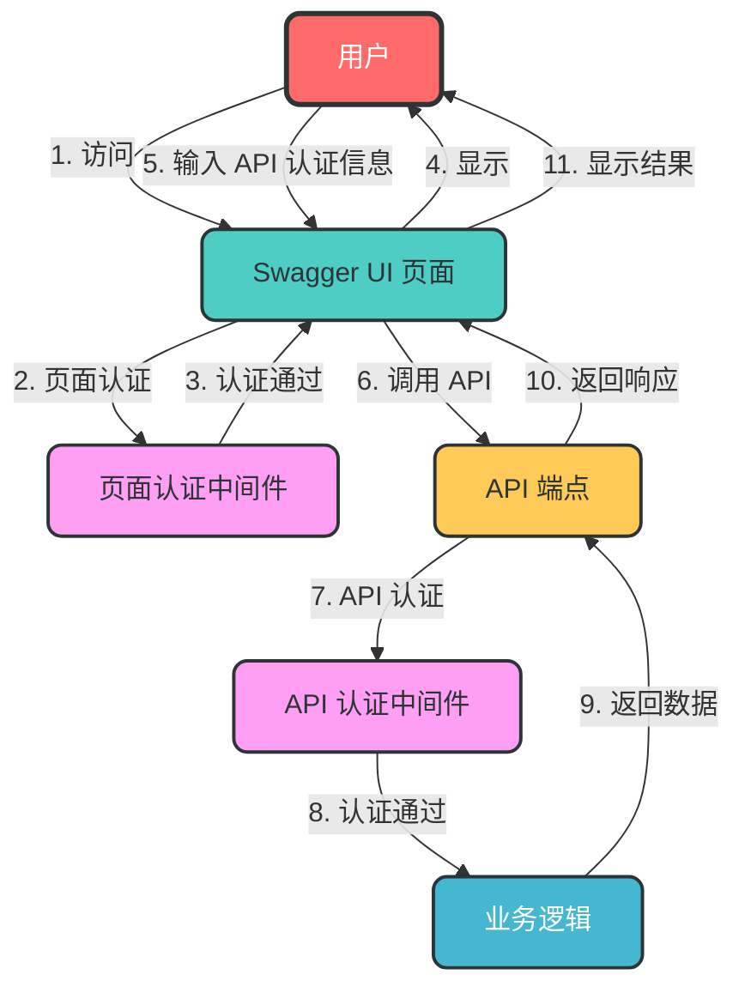

# FastAPI 认证设计：Swagger UI 页面认证 vs API 端点认证

## 一、概述

本文档详细介绍 FastAPI 应用中两种核心认证机制：**Swagger UI 页面认证**和**API 端点认证**，包括它们的设计目标、实现原理、认证流程、代码示例及最佳实践。

## 二、认证类型与方式

### 2.1 认证类型对比

| 认证类型 | 保护对象 | 核心目的 | 典型使用场景 |
|---------|---------|---------|------------|
| **Swagger UI 页面认证** | Swagger UI 页面本身 | 防止未授权用户访问 API 文档 | 生产环境、敏感 API 文档 |
| **API 端点认证** | API 接口 | 防止未授权用户调用 API | 所有需要保护的 API 端点 |

### 2.2 认证方式详细对比

| 认证类型 | 认证方式 | 适用场景 | 实现原理 | 安全性 | 易用性 | 实现复杂度 | 典型协议 |
|---------|---------|---------|---------|-------|-------|---------|---------|
| **Swagger UI 页面认证** | API Key 认证 | 简单内部系统，快速实现 | 通过 URL 参数或请求头传递 API Key | 中 | 高 | 低 | API Key |
| **Swagger UI 页面认证** | Basic Auth 认证 | 需要用户名密码验证的场景 | 使用 HTTP Basic Authentication 协议 | 中 | 高 | 低 | Basic Auth |
| **API 端点认证** | OAuth2 Password Flow | 需要用户名密码登录的系统 | 通过 OAuth2 密码授权流程获取访问令牌 | 高 | 中 | 高 | OAuth2 |
| **API 端点认证** | HTTP Bearer 认证 | 通用的 Bearer 令牌认证 | 验证请求头中的 Bearer 令牌 | 高 | 中 | 中 | Bearer Token |
| **API 端点认证** | JWT 认证 | 前后端分离，需要无状态认证 | 使用 JSON Web Token 进行身份验证 | 高 | 中 | 中 | JWT |
| **API 端点认证** | API Key 认证 | 简单 API 保护，内部服务调用 | 通过请求头或 URL 参数传递 API Key | 中 | 高 | 低 | API Key |

## 三、Swagger UI 页面认证

### 3.1 设计目标

- 保护 Swagger UI 页面的访问安全
- 防止未授权用户获取 API 文档信息
- 支持多种认证方式
- 与 FastAPI 架构无缝集成

### 3.2 认证流程



### 3.3 实现方式

#### 3.3.1 API Key 认证

**适用场景**：简单内部系统，快速实现
**实现原理**：通过 URL 参数或请求头传递 API Key

```python
# app/main.py
from fastapi import FastAPI, Security, HTTPException
from fastapi.security.api_key import APIKeyQuery, APIKeyHeader
from fastapi.openapi.docs import get_swagger_ui_html

app = FastAPI(
    docs_url=None,  # 禁用默认 Swagger UI
    openapi_url=None  # 禁用默认 OpenAPI JSON
)

# 定义 API Key 安全方案
API_KEY = "your-secret-key"
api_key_query = APIKeyQuery(name="api-key", auto_error=False)
api_key_header = APIKeyHeader(name="X-API-Key", auto_error=False)

async def get_api_key(
    api_key_query: str = Security(api_key_query),
    api_key_header: str = Security(api_key_header),
) -> str:
    """验证 API Key"""
    if api_key_query == API_KEY or api_key_header == API_KEY:
        return api_key_query or api_key_header
    raise HTTPException(status_code=403, detail="Invalid API Key")

# 自定义 Swagger UI 路由
@app.get("/docs", include_in_schema=False)
async def custom_swagger_ui_html(api_key: str = Security(get_api_key)):
    """带 API Key 保护的 Swagger UI"""
    return get_swagger_ui_html(
        openapi_url="/openapi.json",
        title="API Documentation"
    )

# 自定义 OpenAPI JSON 路由
@app.get("/openapi.json", include_in_schema=False)
async def get_open_api_endpoint(api_key: str = Security(get_api_key)):
    """带 API Key 保护的 OpenAPI JSON"""
    from fastapi.openapi.utils import get_openapi
    return get_openapi(
        title="API Documentation",
        version="1.0.0",
        routes=app.routes,
    )
```

#### 3.3.2 Basic Auth 认证

**适用场景**：需要用户名密码验证的场景
**实现原理**：使用 HTTP Basic Authentication 协议

```python
# app/main.py
from fastapi import FastAPI, Depends, HTTPException, status
from fastapi.security import HTTPBasic, HTTPBasicCredentials
from fastapi.openapi.docs import get_swagger_ui_html

app = FastAPI(
    docs_url=None,  # 禁用默认 Swagger UI
    openapi_url=None  # 禁用默认 OpenAPI JSON
)

# 定义 Basic Auth 安全方案
basic_auth = HTTPBasic()

async def verify_basic_auth(credentials: HTTPBasicCredentials = Depends(basic_auth)):
    """验证 Basic Auth 凭据"""
    if credentials.username != "admin" or credentials.password != "admin123":
        raise HTTPException(
            status_code=status.HTTP_401_UNAUTHORIZED,
            detail="Invalid credentials",
            headers={"WWW-Authenticate": "Basic"},
        )
    return credentials.username

# 自定义 Swagger UI 路由
@app.get("/docs", include_in_schema=False)
async def custom_swagger_ui_html(username: str = Depends(verify_basic_auth)):
    """带 Basic Auth 保护的 Swagger UI"""
    return get_swagger_ui_html(
        openapi_url="/openapi.json",
        title="API Documentation"
    )

# 自定义 OpenAPI JSON 路由
@app.get("/openapi.json", include_in_schema=False)
async def get_open_api_endpoint(username: str = Depends(verify_basic_auth)):
    """带 Basic Auth 保护的 OpenAPI JSON"""
    from fastapi.openapi.utils import get_openapi
    return get_openapi(
        title="API Documentation",
        version="1.0.0",
        routes=app.routes,
    )
```

## 三、API 端点认证

### 3.1 设计目标

- 保护 API 端点的调用安全
- 支持多种认证协议
- 与 Swagger UI 良好集成，方便测试
- 实现细粒度的访问控制

### 3.2 认证流程



### 3.3 实现方式

#### 3.3.1 OAuth2 Password Flow

**适用场景**：需要用户名密码登录的系统
**实现原理**：通过 OAuth2 密码授权流程获取访问令牌

```python
# app/main.py
from fastapi import FastAPI, Depends
from fastapi.security import OAuth2PasswordBearer, OAuth2PasswordRequestForm

app = FastAPI(
    # 配置 Swagger UI 中的 OAuth2 认证
    swagger_ui_init_oauth={
        "clientId": "your-client-id",
        "appName": "API Documentation",
        "scopes": {
            "read": "Read access",
            "write": "Write access"
        }
    }
)

# OAuth2 配置
oauth2_scheme = OAuth2PasswordBearer(tokenUrl="/token")

# 令牌端点
@app.post("/token")
async def login(form_data: OAuth2PasswordRequestForm = Depends()):
    """获取访问令牌"""
    # 验证用户名密码（示例代码）
    if form_data.username != "admin" or form_data.password != "admin123":
        from fastapi import HTTPException, status
        raise HTTPException(status_code=status.HTTP_401_UNAUTHORIZED)
    # 返回令牌
    return {"access_token": "mock-token", "token_type": "bearer"}

# 受保护的 API 端点
@app.get("/protected")
async def protected_route(token: str = Depends(oauth2_scheme)):
    """受 OAuth2 保护的 API 端点"""
    return {"message": "Protected resource", "token": token}
```

#### 3.3.2 HTTP Bearer 认证

**适用场景**：通用的 Bearer 令牌认证
**实现原理**：验证请求头中的 Bearer 令牌

```python
# app/main.py
from fastapi import FastAPI, Depends
from fastapi.security import HTTPBearer, HTTPAuthorizationCredentials

app = FastAPI()

# HTTP Bearer 配置
bearer_scheme = HTTPBearer()

# 受保护的 API 端点
@app.get("/protected")
async def protected_route(credentials: HTTPAuthorizationCredentials = Depends(bearer_scheme)):
    """受 HTTP Bearer 保护的 API 端点"""
    # 验证令牌（示例代码）
    if credentials.credentials != "valid-token":
        from fastapi import HTTPException, status
        raise HTTPException(status_code=status.HTTP_401_UNAUTHORIZED)
    return {"message": "Protected resource", "token": credentials.credentials}
```

#### 3.3.3 JWT 认证

**适用场景**：前后端分离，需要无状态认证
**实现原理**：使用 JSON Web Token 进行身份验证

```python
# app/main.py
from fastapi import FastAPI, Depends, HTTPException, status
from fastapi.security import OAuth2PasswordBearer, OAuth2PasswordRequestForm
from jose import JWTError, jwt
from passlib.context import CryptContext
from datetime import datetime, timedelta

app = FastAPI()

# 配置
SECRET_KEY = "your-secret-key"
ALGORITHM = "HS256"
ACCESS_TOKEN_EXPIRE_MINUTES = 30

# 密码加密上下文
pwd_context = CryptContext(schemes=["bcrypt"], deprecated="auto")

# OAuth2 配置
oauth2_scheme = OAuth2PasswordBearer(tokenUrl="/token")

# 生成访问令牌
def create_access_token(data: dict, expires_delta: timedelta = None):
    """生成 JWT 访问令牌"""
    to_encode = data.copy()
    expire = datetime.utcnow() + (expires_delta or timedelta(minutes=ACCESS_TOKEN_EXPIRE_MINUTES))
    to_encode.update({"exp": expire})
    return jwt.encode(to_encode, SECRET_KEY, algorithm=ALGORITHM)

# 验证密码
def verify_password(plain_password, hashed_password):
    """验证密码"""
    return pwd_context.verify(plain_password, hashed_password)

# 获取密码哈希
def get_password_hash(password):
    """获取密码哈希值"""
    return pwd_context.hash(password)

# 模拟用户数据库
fake_users_db = {
    "testuser": {
        "username": "testuser",
        "hashed_password": get_password_hash("testpassword"),
        "disabled": False,
    },
}

# 获取当前用户
async def get_current_user(token: str = Depends(oauth2_scheme)):
    """从 JWT 令牌中获取当前用户"""
    credentials_exception = HTTPException(
        status_code=status.HTTP_401_UNAUTHORIZED,
        detail="Could not validate credentials",
        headers={"WWW-Authenticate": "Bearer"},
    )
    try:
        payload = jwt.decode(token, SECRET_KEY, algorithms=[ALGORITHM])
        username: str = payload.get("sub")
        if username is None:
            raise credentials_exception
    except JWTError:
        raise credentials_exception
    user = fake_users_db.get(username)
    if user is None:
        raise credentials_exception
    return user

# 获取当前活跃用户
async def get_current_active_user(current_user = Depends(get_current_user)):
    """获取当前活跃用户"""
    if current_user["disabled"]:
        raise HTTPException(status_code=400, detail="Inactive user")
    return current_user

# 令牌端点
@app.post("/token")
async def login_for_access_token(form_data: OAuth2PasswordRequestForm = Depends()):
    """登录并获取访问令牌"""
    user = fake_users_db.get(form_data.username)
    if not user or not verify_password(form_data.password, user["hashed_password"]):
        raise HTTPException(
            status_code=status.HTTP_401_UNAUTHORIZED,
            detail="Incorrect username or password",
            headers={"WWW-Authenticate": "Bearer"},
        )
    access_token = create_access_token(data={"sub": user["username"]})
    return {"access_token": access_token, "token_type": "bearer"}

# 受保护的 API 端点
@app.get("/protected")
async def protected_route(current_user: dict = Depends(get_current_active_user)):
    """受 JWT 保护的 API 端点"""
    return {"message": "Protected resource", "user": current_user["username"]}
```

#### 3.3.4 API Key 认证

**适用场景**：简单 API 保护，内部服务调用
**实现原理**：通过请求头或 URL 参数传递 API Key

```python
# app/main.py
from fastapi import FastAPI, Security, HTTPException
from fastapi.security.api_key import APIKeyQuery, APIKeyHeader

app = FastAPI()

# 配置 API Key
API_KEY = "your-secret-api-key"
api_key_query = APIKeyQuery(name="api-key", auto_error=False)
api_key_header = APIKeyHeader(name="X-API-Key", auto_error=False)

# 验证 API Key
async def get_api_key(
    api_key_query: str = Security(api_key_query),
    api_key_header: str = Security(api_key_header),
):
    """验证 API Key"""
    if api_key_query == API_KEY or api_key_header == API_KEY:
        return api_key_query or api_key_header
    raise HTTPException(
        status_code=403,
        detail="Could not validate API Key",
    )

# 受保护的 API 端点
@app.get("/protected")
async def protected_route(api_key: str = Security(get_api_key)):
    """受 API Key 保护的 API 端点"""
    return {"message": "Protected resource", "api_key": api_key}
```

## 四、集成实现方案

### 4.1 完整集成示例

```python
# app/main.py
from fastapi import FastAPI, Depends, HTTPException, status
from fastapi.security import (
    HTTPBasic, HTTPBasicCredentials,
    OAuth2PasswordBearer, OAuth2PasswordRequestForm
)
from fastapi.openapi.docs import get_swagger_ui_html
from fastapi.openapi.utils import get_openapi

app = FastAPI(
    docs_url=None,  # 禁用默认 Swagger UI
    redoc_url=None,  # 禁用默认 ReDoc
    openapi_url=None,  # 禁用默认 OpenAPI JSON
    # 配置 Swagger UI 中的 API 认证
    swagger_ui_oauth2_redirect_url="/docs/oauth2-redirect",
    swagger_ui_init_oauth={
        "clientId": "test-client",
        "appName": "API Documentation",
        "scopes": {
            "read": "Read access",
            "write": "Write access"
        }
    }
)

# ------------------------
# 1. Swagger UI 页面认证配置
# ------------------------
basic_auth = HTTPBasic()

async def verify_swagger_access(credentials: HTTPBasicCredentials = Depends(basic_auth)):
    """验证 Swagger UI 页面访问权限"""
    if credentials.username != "swagger_user" or credentials.password != "swagger_pass":
        raise HTTPException(
            status_code=status.HTTP_401_UNAUTHORIZED,
            detail="Invalid Swagger UI credentials",
            headers={"WWW-Authenticate": "Basic"},
        )
    return credentials.username

# ------------------------
# 2. API 端点认证配置
# ------------------------
oauth2_scheme = OAuth2PasswordBearer(tokenUrl="/token")

async def verify_api_access(token: str = Depends(oauth2_scheme)):
    """验证 API 端点访问权限"""
    if token != "valid-token":  # 实际应用中应验证 JWT
        raise HTTPException(
            status_code=status.HTTP_401_UNAUTHORIZED,
            detail="Invalid API token",
            headers={"WWW-Authenticate": "Bearer"},
        )
    return token

# ------------------------
# 3. 令牌端点
# ------------------------
@app.post("/token")
async def login(form_data: OAuth2PasswordRequestForm = Depends()):
    """获取 API 访问令牌"""
    if form_data.username != "api_user" or form_data.password != "api_pass":
        raise HTTPException(
            status_code=status.HTTP_401_UNAUTHORIZED,
            detail="Invalid API credentials",
        )
    return {"access_token": "valid-token", "token_type": "bearer"}

# ------------------------
# 4. 自定义 Swagger UI 路由
# ------------------------
@app.get("/docs", include_in_schema=False)
async def custom_swagger_ui_html(username: str = Depends(verify_swagger_access)):
    """带页面认证的 Swagger UI"""
    return get_swagger_ui_html(
        openapi_url="/openapi.json",
        title="API Documentation",
        oauth2_redirect_url=app.swagger_ui_oauth2_redirect_url,
        init_oauth=app.swagger_ui_init_oauth,
    )

@app.get("/openapi.json", include_in_schema=False)
async def get_open_api_endpoint(username: str = Depends(verify_swagger_access)):
    """带页面认证的 OpenAPI JSON"""
    return get_openapi(
        title="API Documentation",
        version="1.0.0",
        routes=app.routes,
    )

# ------------------------
# 5. 受保护的 API 端点
# ------------------------
@app.get("/protected")
async def protected_route(token: str = Depends(verify_api_access)):
    """受 API 认证保护的端点"""
    return {"message": "This is a protected resource", "token": token}
```

### 4.2 集成架构



## 五、最佳实践

### 5.1 Swagger UI 页面认证最佳实践

1. **生产环境建议启用**：防止敏感 API 文档泄露
2. **使用强密码**：避免使用简单密码，定期更换
3. **限制访问 IP**：只允许内部 IP 访问 Swagger UI
4. **使用 HTTPS**：保护认证数据传输安全
5. **考虑禁用**：如果 API 文档不包含敏感信息，可考虑禁用
6. **单独凭据**：页面认证与 API 认证使用不同的凭据

### 5.2 API 端点认证最佳实践

1. **始终启用**：所有非公开 API 都应添加认证
2. **使用标准协议**：优先选择 OAuth2/JWT 等标准协议
3. **细粒度授权**：基于角色或权限的访问控制
4. **合理的令牌有效期**：避免令牌有效期过长或过短
5. **实现刷新令牌机制**：提高安全性，减少用户登录频率
6. **添加限流保护**：防止暴力破解攻击
7. **日志记录**：记录认证失败和成功的日志，便于审计

### 5.3 集成使用最佳实践

1. **分层认证**：同时启用页面认证和 API 认证，提供双重保护
2. **清晰的错误信息**：提供明确的认证错误信息，便于调试
3. **文档说明**：在 README 中说明认证方式和测试方法
4. **环境隔离**：不同环境使用不同的认证配置
5. **自动化测试**：编写认证相关的自动化测试用例

## 六、配置管理

### 6.1 环境变量配置

```dotenv
# .env 文件

# Swagger UI 页面认证配置
SWAGGER_UI_USERNAME=swagger_user
SWAGGER_UI_PASSWORD=swagger_pass

# API 端点认证配置
API_JWT_SECRET_KEY=your-secret-key
API_JWT_ALGORITHM=HS256
API_JWT_EXPIRE_MINUTES=30

# 调试模式
DEBUG_MODE=False
```

### 6.2 配置管理实现

```python
# app/config/settings.py
from pydantic_settings import BaseSettings

class Settings(BaseSettings):
    """应用配置类"""
    # Swagger UI 页面认证配置
    SWAGGER_UI_USERNAME: str = "swagger_user"
    SWAGGER_UI_PASSWORD: str = "swagger_pass"
    
    # API 端点认证配置
    API_JWT_SECRET_KEY: str = "your-secret-key"
    API_JWT_ALGORITHM: str = "HS256"
    API_JWT_EXPIRE_MINUTES: int = 30
    
    # 调试模式
    DEBUG_MODE: bool = False
    
    class Config:
        env_file = ".env"
        case_sensitive = True

# 全局配置实例
settings = Settings()
```

## 七、测试与验证

### 7.1 Swagger UI 页面认证测试

1. 启动应用：`uvicorn app.main:app --reload`
2. 访问 `http://localhost:8000/docs`
3. 系统应提示输入用户名密码
4. 输入正确的页面认证凭据（如 `swagger_user`/`swagger_pass`）
5. 成功访问 Swagger UI 页面
6. 输入错误凭据，应返回 401 错误

### 7.2 API 端点认证测试

1. 在 Swagger UI 页面点击 "Authorize" 按钮
2. 选择 OAuth2 认证，输入 API 认证凭据（如 `api_user`/`api_pass`）
3. 点击 "Authorize" 完成认证
4. 尝试调用 `/protected` API
5. 应成功返回数据
6. 退出认证后再次调用，应返回 401 错误

## 八、认证机制对比



| 对比维度 | Swagger UI 页面认证 | API 端点认证 |
|---------|-------------------|-------------|
| **保护对象** | Swagger UI 页面 (`/docs`, `/openapi.json`) | API 端点 (`/users`, `/items` 等) |
| **实现方式** | 自定义路由 + 依赖注入 | FastAPI 安全方案 |
| **认证时机** | 访问 Swagger UI 页面时 | 调用 API 端点时 |
| **配置位置** | 应用初始化 + 自定义路由 | 安全方案定义 + 路由依赖 |
| **Swagger UI 集成** | 无需在 UI 中配置 | 在 UI 中配置认证信息 |
| **典型协议** | Basic Auth, API Key | OAuth2, JWT, API Key |

## 九、总结

FastAPI 应用中的认证机制分为两个层次：

1. **Swagger UI 页面认证**：保护 API 文档的访问安全，防止未授权用户获取 API 信息
2. **API 端点认证**：保护 API 接口的调用安全，防止未授权用户调用 API

两者**相互独立但又可以结合使用**，提供双重保护。在实际应用中，应根据业务需求和安全要求选择合适的认证方式：

- 对于**生产环境**，建议同时启用两种认证
- 对于**开发环境**，可以只启用 API 端点认证，方便开发测试
- 对于**公开 API**，可以只启用 API 端点认证，Swagger UI 页面可以公开访问

通过合理设计和配置认证机制，可以有效保护 FastAPI 应用的安全性，防止未授权访问和数据泄露。

## 十、扩展阅读

1. [FastAPI 官方文档 - Security](https://fastapi.tiangolo.com/advanced/security/)
2. [FastAPI 官方文档 - Custom Docs UI](https://fastapi.tiangolo.com/advanced/custom-docs-ui/)
3. [OAuth2 官方文档](https://oauth.net/2/)
4. [JWT 官方文档](https://jwt.io/introduction/)
5. [REST API 安全最佳实践](https://owasp.org/www-project-api-security/)
6. [Pydantic Settings 官方文档](https://docs.pydantic.dev/latest/concepts/pydantic_settings/)