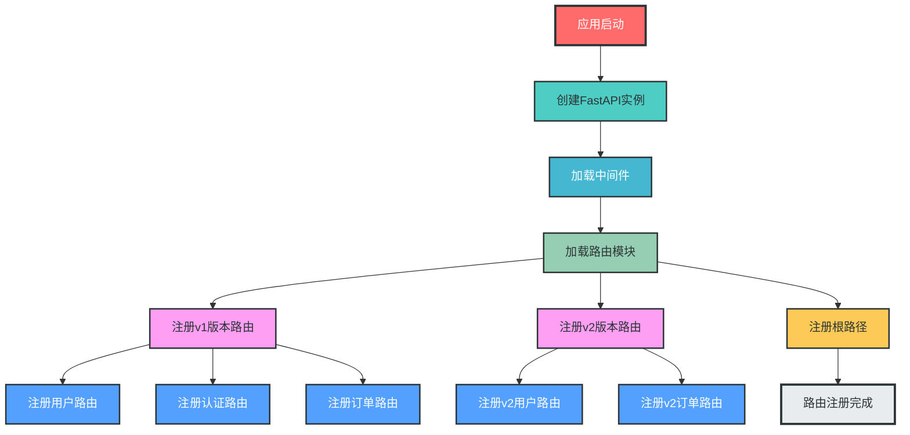
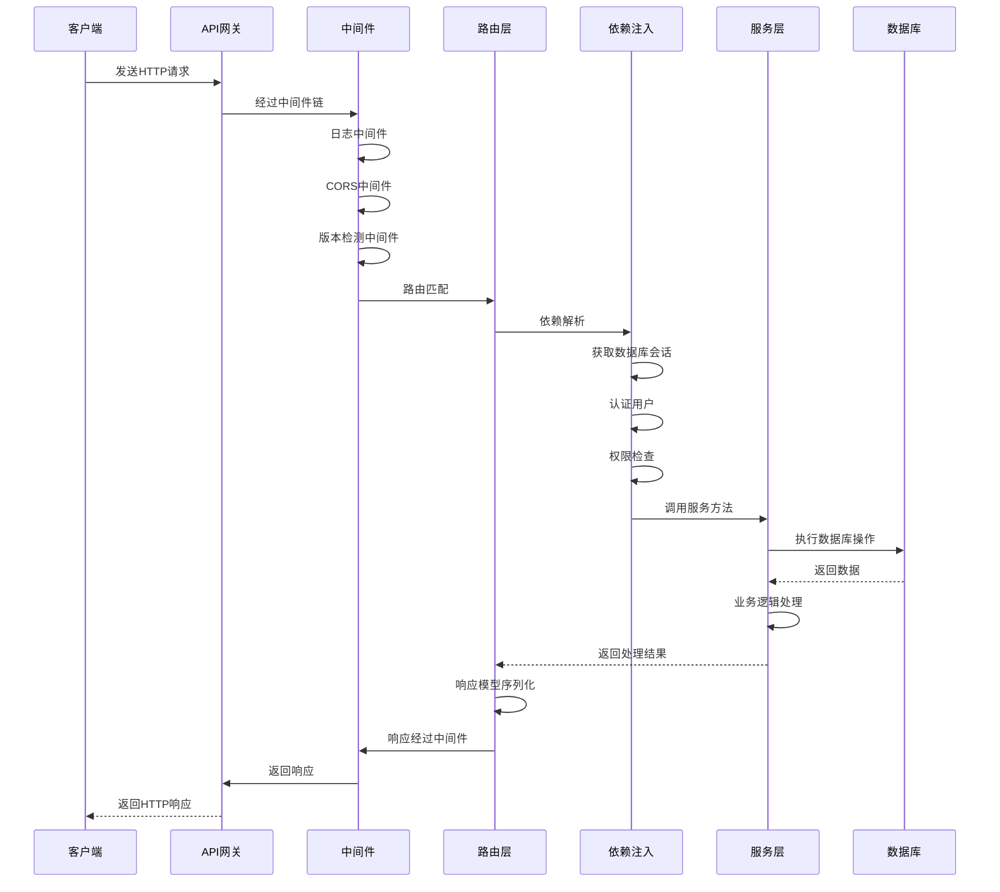
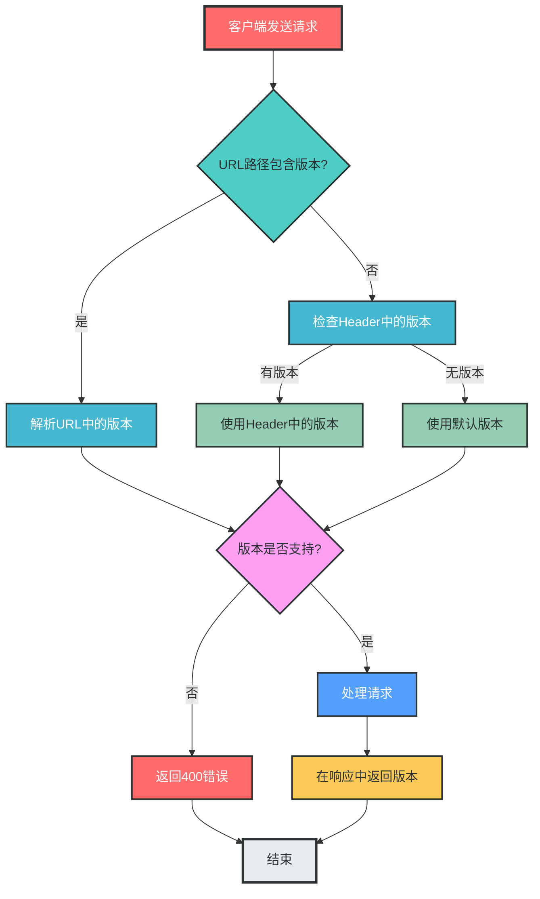
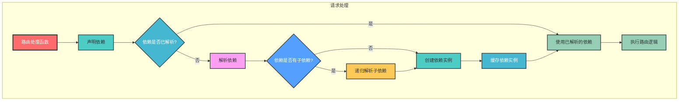
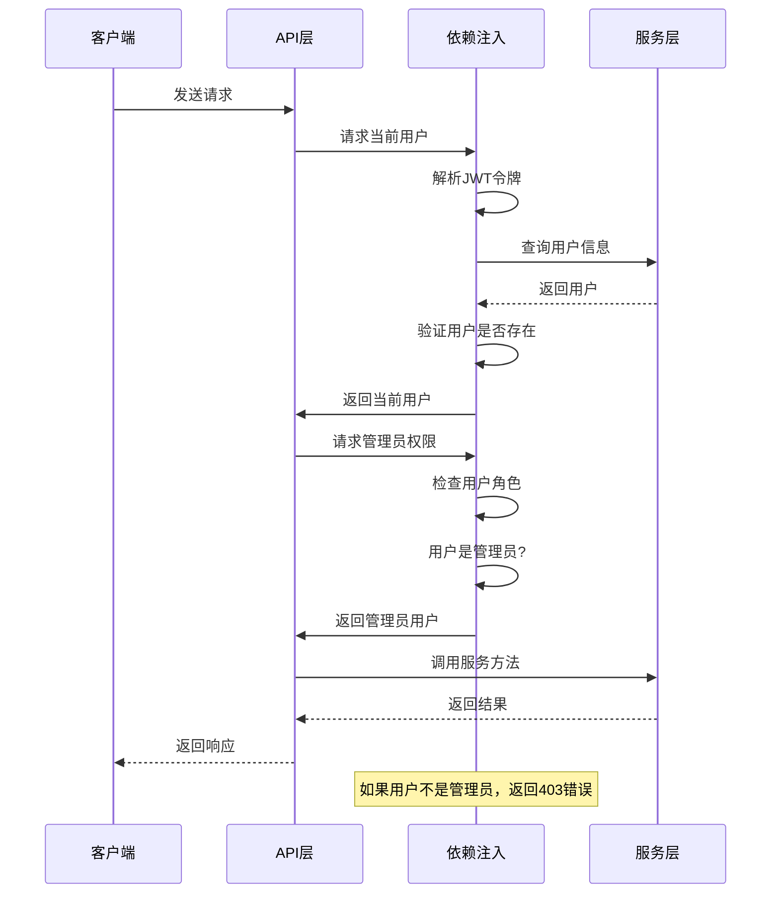

# FastAPI路由模块设计说明

## 一、快速开始

### 1. 基础路由示例

```python
# app/routes/basic.py
from fastapi import APIRouter

router = APIRouter(
    prefix="/basic",
    tags=["基础路由"]
)

@router.get("/hello")
def hello():
    """简单的Hello World路由"""
    return {"message": "Hello FastAPI!"}
```

### 2. 路由注册示例

```python
# app/routes/__init__.py
from fastapi import APIRouter
from app.routes import basic

api_router = APIRouter(prefix="/api")
api_router.include_router(basic.router)

# app/main.py
from fastapi import FastAPI
from app.routes import api_router

app = FastAPI()
app.include_router(api_router)
```

### 3. 运行应用

```bash
uvicorn app.main:app --reload
```

访问 `http://localhost:8000/api/basic/hello` 即可看到响应。

## 二、路由设计原则

1. **RESTful API设计**：遵循RESTful设计规范，使用合适的HTTP方法和状态码
2. **清晰的URL结构**：URL应简洁、直观，反映资源层级关系
3. **API版本控制**：支持多版本API共存，便于平滑升级
4. **模块化设计**：按业务域划分路由，保持代码组织清晰
5. **依赖注入**：充分利用FastAPI的依赖注入系统，实现关注点分离
6. **中间件机制**：使用中间件处理横切关注点，如日志、认证、限流等
7. **自动文档生成**：利用FastAPI的自动文档功能，提高开发效率
8. **类型安全**：使用Pydantic模型进行请求和响应验证
9. **权限控制**：实现细粒度的权限控制，确保API安全
10. **可测试性**：设计易于测试的路由结构
11. **性能优化**：考虑路由性能，避免不必要的计算和数据库查询
12. **异常处理**：统一的异常处理机制，确保API响应的一致性

## 三、路由目录结构

```
fastapi_mvc/
├── app/                     # 应用核心目录
│   ├── __init__.py
│   ├── main.py              # 应用入口（路由注册）
│   ├── routes/              # 路由模块（按业务域和版本划分）
│   │   ├── __init__.py      # 路由注册入口
│   │   ├── v1/              # v1版本路由
│   │   │   ├── __init__.py  # v1版本路由注册
│   │   │   ├── user.py       # 用户相关路由
│   │   │   ├── auth.py       # 认证相关路由
│   │   │   ├── order.py      # 订单相关路由
│   │   │   └── health.py     # 健康检查路由
│   │   └── v2/              # v2版本路由
│   │       ├── __init__.py  # v2版本路由注册
│   │       ├── user.py       # v2用户相关路由
│   │       └── order.py      # v2订单相关路由
│   ├── dependencies/        # 依赖注入模块
│   │   ├── __init__.py
│   │   ├── auth.py          # 认证依赖
│   │   ├── db.py            # 数据库依赖
│   │   └── rate_limit.py    # 限流依赖
│   ├── middleware/          # 中间件模块
│   │   ├── __init__.py
│   │   ├── logging.py       # 日志中间件
│   │   ├── cors.py          # CORS中间件
│   │   └── version.py       # 版本检测中间件
│   └── ...                  # 其他模块
└── ...                      # 其他目录
```

## 四、路由注册机制

### 1. 路由模块设计

#### 1.1 同步路由

```python
# app/routes/v1/user.py
from fastapi import APIRouter, Depends, HTTPException, status
from sqlalchemy.orm import Session
from typing import List

from app.schemas.v1.user import UserCreate, UserUpdate, UserResponse
from app.services.v1.user_service import UserService
from app.dependencies.db import get_db
from app.dependencies.auth import get_current_user, get_admin_user
from app.models.user import User

# 创建路由实例
router = APIRouter(
    prefix="/users",          # 路由前缀
    tags=["[v1] 用户管理"],  # 文档标签
    dependencies=[Depends(get_current_user)],  # 路由级依赖
    responses={404: {"description": "Not Found"}},  # 响应模型
)

# GET /api/v1/users
@router.get("/", response_model=List[UserResponse])
def get_users(
    skip: int = 0, 
    limit: int = 100,
    db: Session = Depends(get_db),
    current_user: User = Depends(get_current_user)
):
    """获取用户列表"""
    user_service = UserService(db)
    return user_service.get_users(skip=skip, limit=limit)

# GET /api/v1/users/{user_id}
@router.get("/{user_id}", response_model=UserResponse)
def get_user(
    user_id: int,
    db: Session = Depends(get_db),
    current_user: User = Depends(get_current_user)
):
    """获取用户详情"""
    user_service = UserService(db)
    user = user_service.get_user(user_id)
    if not user:
        raise HTTPException(status_code=404, detail="用户不存在")
    return user

# POST /api/v1/users
@router.post("/", response_model=UserResponse, status_code=status.HTTP_201_CREATED)
def create_user(
    user_in: UserCreate,
    db: Session = Depends(get_db),
    current_user: User = Depends(get_admin_user)
):
    """创建用户（仅管理员）"""
    user_service = UserService(db)
    return user_service.create_user(user_in)

# PUT /api/v1/users/{user_id}
@router.put("/{user_id}", response_model=UserResponse)
def update_user(
    user_id: int,
    user_in: UserUpdate,
    db: Session = Depends(get_db),
    current_user: User = Depends(get_admin_user)
):
    """更新用户（仅管理员）"""
    user_service = UserService(db)
    return user_service.update_user(user_id, user_in)

# DELETE /api/v1/users/{user_id}
@router.delete("/{user_id}", status_code=status.HTTP_204_NO_CONTENT)
def delete_user(
    user_id: int,
    db: Session = Depends(get_db),
    current_user: User = Depends(get_admin_user)
):
    """删除用户（仅管理员）"""
    user_service = UserService(db)
    user_service.delete_user(user_id)
    return None
```

#### 1.2 异步路由

异步路由是FastAPI的核心特性之一，能够提高API的并发处理能力，特别适合IO密集型操作。

```python
# app/routes/v1/async_user.py
from fastapi import APIRouter, Depends, HTTPException, status
from sqlalchemy.ext.asyncio import AsyncSession
from typing import List

from app.schemas.v1.user import UserCreate, UserUpdate, UserResponse
from app.services.v1.async_user_service import AsyncUserService
from app.dependencies.async_db import get_async_db
from app.dependencies.auth import get_current_user, get_admin_user
from app.models.user import User

# 创建异步路由实例
async_router = APIRouter(
    prefix="/async-users",      # 路由前缀
    tags=["[v1] 异步用户管理"], # 文档标签
    dependencies=[Depends(get_current_user)],  # 路由级依赖
    responses={404: {"description": "Not Found"}},  # 响应模型
)

# GET /api/v1/async-users
@async_router.get("/", response_model=List[UserResponse])
async def get_users(
    skip: int = 0, 
    limit: int = 100,
    db: AsyncSession = Depends(get_async_db),
    current_user: User = Depends(get_current_user)
):
    """异步获取用户列表"""
    user_service = AsyncUserService(db)
    return await user_service.get_users(skip=skip, limit=limit)

# GET /api/v1/async-users/{user_id}
@async_router.get("/{user_id}", response_model=UserResponse)
async def get_user(
    user_id: int,
    db: AsyncSession = Depends(get_async_db),
    current_user: User = Depends(get_current_user)
):
    """异步获取用户详情"""
    user_service = AsyncUserService(db)
    user = await user_service.get_user(user_id)
    if not user:
        raise HTTPException(status_code=404, detail="用户不存在")
    return user

# POST /api/v1/async-users
@async_router.post("/", response_model=UserResponse, status_code=status.HTTP_201_CREATED)
async def create_user(
    user_in: UserCreate,
    db: AsyncSession = Depends(get_async_db),
    current_user: User = Depends(get_admin_user)
):
    """异步创建用户（仅管理员）"""
    user_service = AsyncUserService(db)
    return await user_service.create_user(user_in)

# PUT /api/v1/async-users/{user_id}
@async_router.put("/{user_id}", response_model=UserResponse)
async def update_user(
    user_id: int,
    user_in: UserUpdate,
    db: AsyncSession = Depends(get_async_db),
    current_user: User = Depends(get_admin_user)
):
    """异步更新用户（仅管理员）"""
    user_service = AsyncUserService(db)
    return await user_service.update_user(user_id, user_in)

# DELETE /api/v1/async-users/{user_id}
@async_router.delete("/{user_id}", status_code=status.HTTP_204_NO_CONTENT)
async def delete_user(
    user_id: int,
    db: AsyncSession = Depends(get_async_db),
    current_user: User = Depends(get_admin_user)
):
    """异步删除用户（仅管理员）"""
    user_service = AsyncUserService(db)
    await user_service.delete_user(user_id)
    return None
```

### 2. 异步路由最佳实践

#### 2.1 异步依赖

异步路由可以使用异步依赖，提高整体性能。

```python
# app/dependencies/async_dependency.py
from typing import Optional
import asyncio
from fastapi import Depends, Request

async def async_auth_dependency(request: Request) -> dict:
    """异步认证依赖"""
    # 模拟异步认证操作
    await asyncio.sleep(0.05)
    return {"user_id": 1, "username": "test_user"}

# 使用示例
@async_router.get("/async-protected")
async def async_protected_route(
    auth_data: dict = Depends(async_auth_dependency)
):
    """使用异步依赖的路由"""
    return {"auth_data": auth_data}
```

#### 2.2 异步数据库操作

对于异步路由，建议使用异步数据库驱动和ORM，如SQLAlchemy 2.0的异步API。

```python
# app/dependencies/async_db.py
from sqlalchemy.ext.asyncio import AsyncSession, create_async_engine
from sqlalchemy.orm import sessionmaker
from app.config.settings import settings

# 创建异步数据库引擎
async_engine = create_async_engine(
    settings.DATABASE_URL,
    echo=settings.DEBUG,
    future=True
)

# 创建异步会话工厂
AsyncSessionLocal = sessionmaker(
    async_engine,
    class_=AsyncSession,
    expire_on_commit=False
)

async def get_async_db() -> AsyncSession:
    """获取异步数据库会话"""
    async with AsyncSessionLocal() as session:
        try:
            yield session
            await session.commit()
        except Exception:
            await session.rollback()
            raise
        finally:
            await session.close()
```

#### 2.3 异步服务层

异步路由对应的服务层也应该使用异步方式实现。

```python
# app/services/v1/async_user_service.py
from sqlalchemy.ext.asyncio import AsyncSession
from sqlalchemy.future import select
from typing import List, Optional

from app.models.user import User
from app.schemas.v1.user import UserCreate, UserUpdate

class AsyncUserService:
    """异步用户服务"""
    def __init__(self, db: AsyncSession):
        self.db = db
    
    async def get_users(self, skip: int = 0, limit: int = 100) -> List[User]:
        """异步获取用户列表"""
        result = await self.db.execute(select(User).offset(skip).limit(limit))
        return result.scalars().all()
    
    async def get_user(self, user_id: int) -> Optional[User]:
        """异步获取用户详情"""
        result = await self.db.execute(select(User).filter(User.id == user_id))
        return result.scalar_one_or_none()
    
    async def create_user(self, user_in: UserCreate) -> User:
        """异步创建用户"""
        db_user = User(**user_in.dict())
        self.db.add(db_user)
        await self.db.commit()
        await self.db.refresh(db_user)
        return db_user
    
    async def update_user(self, user_id: int, user_in: UserUpdate) -> User:
        """异步更新用户"""
        result = await self.db.execute(select(User).filter(User.id == user_id))
        db_user = result.scalar_one_or_none()
        if not db_user:
            return None
        
        # 更新用户信息
        for field, value in user_in.dict(exclude_unset=True).items():
            setattr(db_user, field, value)
        
        await self.db.commit()
        await self.db.refresh(db_user)
        return db_user
    
    async def delete_user(self, user_id: int) -> bool:
        """异步删除用户"""
        result = await self.db.execute(select(User).filter(User.id == user_id))
        db_user = result.scalar_one_or_none()
        if not db_user:
            return False
        
        await self.db.delete(db_user)
        await self.db.commit()
        return True
```

#### 2.4 同步与异步路由混合使用

FastAPI允许在同一个应用中混合使用同步和异步路由，根据业务需求选择合适的实现方式。

```python
# app/routes/v1/__init__.py
from fastapi import APIRouter
from app.routes.v1 import user, async_user, auth, order, health

# 创建v1版本路由集合
api_v1_router = APIRouter(prefix="/v1")

# 注册同步路由
api_v1_router.include_router(user.router, tags=["[v1] 用户管理"])
api_v1_router.include_router(auth.router, tags=["[v1] 认证管理"])
api_v1_router.include_router(order.router, tags=["[v1] 订单管理"])
api_v1_router.include_router(health.router, tags=["[v1] 健康检查"])

# 注册异步路由
api_v1_router.include_router(async_user.async_router, tags=["[v1] 异步用户管理"])
```

#### 2.5 异步路由注意事项

1. **避免在异步路由中使用同步操作**：同步操作会阻塞事件循环，降低并发性能
2. **使用异步库**：对于IO操作，使用异步版本的库（如aiohttp、aioredis等）
3. **合理使用异步依赖**：异步路由中的依赖也应该尽可能使用异步实现
4. **注意数据库连接管理**：确保异步数据库连接正确关闭
5. **监控异步性能**：关注异步路由的性能指标，如响应时间、并发数等

### 3. 版本路由注册

```python
# app/routes/v1/__init__.py
from fastapi import APIRouter
from app.routes.v1 import user, auth, order, health

# 创建v1版本路由集合
api_v1_router = APIRouter(prefix="/v1")

# 注册各业务路由
api_v1_router.include_router(user.router, tags=["[v1] 用户管理"])
api_v1_router.include_router(auth.router, tags=["[v1] 认证管理"])
api_v1_router.include_router(order.router, tags=["[v1] 订单管理"])
api_v1_router.include_router(health.router, tags=["[v1] 健康检查"])
```

```python
# app/routes/__init__.py
from fastapi import APIRouter
from app.routes import v1, v2

# 创建主路由集合
api_router = APIRouter(prefix="/api")

# 注册各版本路由
api_router.include_router(v1.api_v1_router)
api_router.include_router(v2.api_v2_router)
```

### 3. 应用入口注册

```python
# app/main.py
from fastapi import FastAPI
from fastapi.middleware.cors import CORSMiddleware
from app.routes import api_router
from app.middleware.logging import LoggingMiddleware
from app.middleware.version import VersionCheckMiddleware
from app.config.settings import settings

# 创建FastAPI实例
app = FastAPI(
    title="FastAPI MVC",
    version="1.0.0",
    description="FastAPI生产级应用架构",
    docs_url="/docs",
    redoc_url="/redoc",
    openapi_url="/openapi.json"
)

# 添加中间件
app.add_middleware(
    CORSMiddleware,
    allow_origins=settings.CORS_ORIGINS,
    allow_credentials=True,
    allow_methods=["*"],
    allow_headers=["*"],
)
app.add_middleware(LoggingMiddleware)
app.add_middleware(VersionCheckMiddleware)

# 注册路由
app.include_router(api_router)

# 根路径
@app.get("/")
def root():
    return {"message": "Welcome to FastAPI MVC", "version": "1.0.0"}
```

## 五、路由分组与嵌套路由

### 1. 路由分组设计

对于复杂的业务系统，可以使用路由分组来更好地组织路由结构。路由分组允许将相关的路由组合在一起，便于管理和维护。

```python
# app/routes/v1/admin/__init__.py
from fastapi import APIRouter, Depends
from app.routes.v1.admin import user_management, order_management, system_settings
from app.dependencies.auth import get_admin_user

# 创建管理员路由分组
admin_router = APIRouter(
    prefix="/admin",
    tags=["[v1] 管理员管理"],
    dependencies=[Depends(get_admin_user)]  # 管理员权限依赖
)

# 注册管理员子路由
admin_router.include_router(user_management.router, prefix="/users", tags=["[v1] 管理员-用户管理"])
admin_router.include_router(order_management.router, prefix="/orders", tags=["[v1] 管理员-订单管理"])
admin_router.include_router(system_settings.router, prefix="/settings", tags=["[v1] 管理员-系统设置"])
```

### 2. 嵌套路由设计

嵌套路由允许在路由中创建更深层次的嵌套结构，适用于复杂的资源关系。

```python
# app/routes/v1/order.py
from fastapi import APIRouter, Depends, HTTPException, status
from sqlalchemy.orm import Session
from typing import List

from app.schemas.v1.order import OrderCreate, OrderUpdate, OrderResponse, OrderItemResponse
from app.services.v1.order_service import OrderService
from app.dependencies.db import get_db
from app.dependencies.auth import get_current_user
from app.models.user import User

# 创建订单主路由
order_router = APIRouter(
    prefix="/orders",
    tags=["[v1] 订单管理"],
    dependencies=[Depends(get_current_user)]
)

# 创建订单项嵌套路由
order_item_router = APIRouter(prefix="/{order_id}/items")

# GET /api/v1/orders/{order_id}/items
@order_item_router.get("/", response_model=List[OrderItemResponse])
def get_order_items(
    order_id: int,
    db: Session = Depends(get_db),
    current_user: User = Depends(get_current_user)
):
    """获取订单的所有订单项"""
    order_service = OrderService(db)
    return order_service.get_order_items(order_id)

# GET /api/v1/orders/{order_id}/items/{item_id}
@order_item_router.get("/{item_id}", response_model=OrderItemResponse)
def get_order_item(
    order_id: int,
    item_id: int,
    db: Session = Depends(get_db),
    current_user: User = Depends(get_current_user)
):
    """获取订单的单个订单项"""
    order_service = OrderService(db)
    order_item = order_service.get_order_item(order_id, item_id)
    if not order_item:
        raise HTTPException(status_code=404, detail="订单项不存在")
    return order_item

# 注册嵌套路由到主路由
order_router.include_router(order_item_router)

# GET /api/v1/orders
@order_router.get("/", response_model=List[OrderResponse])
def get_orders(
    skip: int = 0, 
    limit: int = 100,
    db: Session = Depends(get_db),
    current_user: User = Depends(get_current_user)
):
    """获取订单列表"""
    order_service = OrderService(db)
    return order_service.get_orders(skip=skip, limit=limit)
```

### 3. 路由注册顺序

在FastAPI中，路由的注册顺序很重要，因为FastAPI会按照路由注册的顺序进行匹配。因此，应该先注册更具体的路由，再注册更通用的路由。

```python
# 推荐：先注册具体路由，再注册通用路由
@router.get("/users/me")
def get_current_user_profile():
    """获取当前用户信息"""
    pass

@router.get("/users/{user_id}")
def get_user(user_id: int):
    """获取指定用户信息"""
    pass

# 不推荐：先注册通用路由，再注册具体路由
@router.get("/users/{user_id}")
def get_user(user_id: int):
    """获取指定用户信息"""
    pass

@router.get("/users/me")
def get_current_user_profile():
    """获取当前用户信息"""
    pass
```

## 六、路由模块拆分策略

### 1. 按业务域拆分

按业务域拆分是最常见的路由拆分方式，将相关的业务功能放在同一个模块中。

**示例结构：**

```
app/routes/
├── v1/
│   ├── user.py          # 用户相关路由
│   ├── auth.py          # 认证相关路由
│   ├── order.py         # 订单相关路由
│   ├── product.py       # 产品相关路由
│   └── payment.py       # 支付相关路由
└── v2/
    ├── user.py          # v2版本用户路由
    └── order.py         # v2版本订单路由
```

**拆分原则：**
- 同一业务域的路由放在同一个文件中
- 不同业务域的路由分离到不同文件
- 业务域划分应遵循单一职责原则

### 2. 按版本拆分

按版本拆分允许不同版本的API共存，便于平滑升级和向后兼容。

**示例结构：**

```
app/routes/
├── v1/                  # v1版本路由
│   ├── __init__.py
│   ├── user.py
│   └── order.py
├── v2/                  # v2版本路由
│   ├── __init__.py
│   ├── user.py
│   └── order.py
└── __init__.py          # 版本路由注册
```

**拆分原则：**
- 每个版本使用独立的目录
- 版本间的路由完全隔离
- 版本升级时只修改对应版本的路由

### 3. 按访问权限拆分

按访问权限拆分可以将不同权限级别的路由分离，便于权限管理和维护。

**示例结构：**

```
app/routes/v1/
├── public/              # 公开路由（无需认证）
│   ├── __init__.py
│   └── auth.py
├── protected/           # 受保护路由（需要认证）
│   ├── __init__.py
│   ├── user.py
│   └── order.py
└── admin/               # 管理员路由（需要管理员权限）
    ├── __init__.py
    ├── user_management.py
    └── system_settings.py
```

**拆分原则：**
- 不同权限级别的路由分离到不同目录
- 每个权限级别使用独立的路由前缀和依赖
- 权限检查集中在路由级或模块级

### 4. 按功能类型拆分

按功能类型拆分将不同类型的功能分离，如管理功能、业务功能、工具功能等。

**示例结构：**

```
app/routes/v1/
├── admin/               # 管理功能
├── business/            # 核心业务功能
├── utils/               # 工具功能
└── health/              # 健康检查
```

**拆分原则：**
- 功能类型划分清晰，便于定位和维护
- 核心业务功能与辅助功能分离
- 工具类功能独立管理

### 5. 混合拆分策略

在实际项目中，通常会结合多种拆分策略，形成更灵活的路由结构。

**示例结构：**

```
app/routes/
├── v1/                  # 按版本拆分
│   ├── public/          # 按权限拆分
│   │   ├── auth.py
│   │   └── health.py
│   ├── protected/       # 按权限拆分
│   │   ├── user/        # 按业务域拆分
│   │   ├── order/       # 按业务域拆分
│   │   └── product/     # 按业务域拆分
│   └── admin/           # 按权限拆分
│       ├── user_management.py
│       └── system_settings.py
└── v2/                  # 按版本拆分
    └── ...
```

**拆分原则：**
- 先按版本拆分，再按权限拆分，最后按业务域拆分
- 拆分层次不宜过深，建议不超过3层
- 保持路由结构的一致性和可扩展性

### 6. 拆分的最佳实践

1. **保持模块大小适中**：每个路由模块的代码行数建议不超过500行
2. **使用清晰的命名**：路由文件和函数名应清晰反映其功能
3. **避免循环依赖**：确保路由模块之间不存在循环依赖
4. **使用统一的路由注册方式**：保持路由注册的一致性
5. **定期重构**：随着业务的发展，定期调整路由结构
6. **考虑团队协作**：路由拆分应便于团队成员并行开发

## 七、API版本控制

### 1. URL路径版本控制

```python
# 示例URL格式
# v1版本: /api/v1/users
# v2版本: /api/v2/users
```

### 2. Header版本控制

```python
# app/middleware/version.py
from fastapi import Request, HTTPException
from starlette.middleware.base import BaseHTTPMiddleware
from app.config.version import SUPPORTED_VERSIONS, DEFAULT_API_VERSION

class VersionCheckMiddleware(BaseHTTPMiddleware):
    """版本检测中间件"""
    async def dispatch(self, request: Request, call_next):
        # 从Header获取版本
        api_version = request.headers.get("X-API-Version", DEFAULT_API_VERSION)
        
        # 验证版本是否支持
        if api_version not in SUPPORTED_VERSIONS:
            raise HTTPException(
                status_code=400,
                detail=f"不支持的API版本，支持的版本: {SUPPORTED_VERSIONS}"
            )
        
        # 将版本存储到request.state
        request.state.api_version = api_version
        
        # 处理请求
        response = await call_next(request)
        
        # 在响应头中返回版本
        response.headers["X-API-Version"] = api_version
        
        return response
```

## 八、中间件与依赖注入

### 1. 中间件设计

```python
# app/middleware/logging.py
from fastapi import Request
from starlette.middleware.base import BaseHTTPMiddleware
from app.logger.config import logger
import time

class LoggingMiddleware(BaseHTTPMiddleware):
    """日志中间件"""
    async def dispatch(self, request: Request, call_next):
        # 请求开始时间
        start_time = time.time()
        
        # 记录请求信息
        logger.info(f"请求开始: {request.method} {request.url}")
        
        # 处理请求
        response = await call_next(request)
        
        # 请求处理时间
        process_time = time.time() - start_time
        
        # 记录响应信息
        logger.info(
            f"请求结束: {request.method} {request.url} "
            f"状态码: {response.status_code} "
            f"处理时间: {process_time:.3f}s"
        )
        
        # 在响应头中添加处理时间
        response.headers["X-Process-Time"] = str(process_time)
        
        return response
```

### 2. 依赖注入设计

```python
# app/dependencies/auth.py
from fastapi import Depends, HTTPException, status
from fastapi.security import OAuth2PasswordBearer
from jose import JWTError, jwt
from sqlalchemy.orm import Session
from typing import Optional

from app.config.settings import settings
from app.models.user import User
from app.dependencies.db import get_db

# OAuth2密码流
oauth2_scheme = OAuth2PasswordBearer(tokenUrl="/api/v1/auth/token")

def get_current_user(
    token: str = Depends(oauth2_scheme),
    db: Session = Depends(get_db)
) -> User:
    """获取当前登录用户"""
    credentials_exception = HTTPException(
        status_code=status.HTTP_401_UNAUTHORIZED,
        detail="无效的认证凭据",
        headers={"WWW-Authenticate": "Bearer"},
    )
    
    try:
        # 解码JWT令牌
        payload = jwt.decode(
            token,
            settings.SECRET_KEY,
            algorithms=[settings.ALGORITHM]
        )
        user_id: str = payload.get("sub")
        if user_id is None:
            raise credentials_exception
    except JWTError:
        raise credentials_exception
    
    # 获取用户
    user = db.query(User).filter(User.id == user_id).first()
    if user is None:
        raise credentials_exception
    
    return user

def get_admin_user(
    current_user: User = Depends(get_current_user)
) -> User:
    """获取管理员用户"""
    if not current_user.is_admin:
        raise HTTPException(
            status_code=status.HTTP_403_FORBIDDEN,
            detail="需要管理员权限"
        )
    return current_user
```

### 3. 依赖注入高级用法

#### 3.1 类依赖

使用类作为依赖，可以更好地组织相关的依赖逻辑。

```python
# app/dependencies/pagination.py
from typing import Optional
from fastapi import Query

class Pagination:
    """分页依赖类"""
    def __init__(
        self,
        skip: int = Query(0, ge=0, description="跳过的记录数"),
        limit: int = Query(100, ge=1, le=1000, description="返回的记录数")
    ):
        self.skip = skip
        self.limit = limit

# 使用示例
@router.get("/", response_model=List[UserResponse])
def get_users(
    pagination: Pagination = Depends(),
    db: Session = Depends(get_db),
    current_user: User = Depends(get_current_user)
):
    """获取用户列表"""
    user_service = UserService(db)
    return user_service.get_users(skip=pagination.skip, limit=pagination.limit)
```

#### 3.2 异步依赖

对于异步操作，可以使用异步函数作为依赖。

```python
# app/dependencies/async_dependency.py
from typing import Optional
import asyncio

async def async_dependency() -> str:
    """异步依赖示例"""
    await asyncio.sleep(0.1)  # 模拟异步操作
    return "async_value"

# 使用示例
@router.get("/async")
async def async_route(
    async_value: str = Depends(async_dependency),
    current_user: User = Depends(get_current_user)
):
    """异步路由示例"""
    return {"async_value": async_value, "user_id": current_user.id}
```

#### 3.3 依赖的依赖

依赖可以嵌套，即一个依赖可以依赖于另一个依赖。

```python
# app/dependencies/nested_dependency.py
from fastapi import Depends

# 基础依赖
def get_base_dependency() -> str:
    """基础依赖"""
    return "base_value"

# 依赖于基础依赖的高级依赖
def get_advanced_dependency(base_value: str = Depends(get_base_dependency)) -> dict:
    """依赖于基础依赖的高级依赖"""
    return {
        "base": base_value,
        "advanced": "advanced_value"
    }

# 使用示例
@router.get("/advanced")
def advanced_route(
    advanced_data: dict = Depends(get_advanced_dependency),
    current_user: User = Depends(get_current_user)
):
    """使用嵌套依赖的路由示例"""
    return {"advanced_data": advanced_data, "user_id": current_user.id}
```

#### 3.4 依赖的缓存

FastAPI默认会为同一个请求中的多个依赖调用缓存依赖结果，避免重复计算。

```python
# app/dependencies/cached_dependency.py
import time

# 计算成本高的依赖
def expensive_dependency() -> dict:
    """计算成本高的依赖"""
    time.sleep(1)  # 模拟耗时计算
    return {"result": "expensive_result"}

# 使用示例
@router.get("/cached")
def cached_route(
    result1: dict = Depends(expensive_dependency),
    result2: dict = Depends(expensive_dependency),  # 会使用缓存的结果
    current_user: User = Depends(get_current_user)
):
    """使用缓存依赖的路由示例"""
    # result1和result2是同一个对象
    return {
        "result1": result1,
        "result2": result2,
        "is_same_object": result1 is result2,  # 返回True
        "user_id": current_user.id
    }
```

#### 3.5 动态依赖

根据不同的条件返回不同的依赖。

```python
# app/dependencies/dynamic_dependency.py
from fastapi import Depends, Request
from typing import Callable, TypeVar, Generic

T = TypeVar("T")

class DynamicDependency(Generic[T]):
    """动态依赖容器"""
    def __init__(self, dependency: Callable[..., T]):
        self.dependency = dependency

# 动态依赖工厂
def get_dynamic_dependency(
    request: Request,
    db: Session = Depends(get_db)
) -> DynamicDependency:
    """根据请求路径返回不同的依赖"""
    path = request.url.path
    
    if "/admin/" in path:
        # 管理员路径使用管理员依赖
        return DynamicDependency(get_admin_user)
    else:
        # 普通路径使用普通用户依赖
        return DynamicDependency(get_current_user)

# 使用示例
@router.get("/dynamic")
def dynamic_route(
    dynamic_dep: DynamicDependency = Depends(get_dynamic_dependency),
    db: Session = Depends(get_db)
):
    """使用动态依赖的路由示例"""
    # 解析动态依赖
    current_user = dynamic_dep.dependency(db=db)
    return {"user_id": current_user.id, "is_admin": current_user.is_admin}
```

#### 3.6 全局依赖

可以为整个应用或路由组添加全局依赖。

```python
# app/main.py
# 为整个应用添加全局依赖
app = FastAPI(
    dependencies=[Depends(global_dependency)]
)

# 或为路由组添加全局依赖
api_router = APIRouter(
    prefix="/api",
    dependencies=[Depends(global_dependency)]
)
```

## 九、路由权限控制

### 1. 基于依赖的权限控制

```python
# 示例：需要管理员权限的路由
@router.post("/", response_model=UserResponse, status_code=status.HTTP_201_CREATED)
def create_user(
    user_in: UserCreate,
    db: Session = Depends(get_db),
    current_user: User = Depends(get_admin_user)  # 管理员权限依赖
):
    """创建用户（仅管理员）"""
    # 实现逻辑...
```

### 2. 基于角色的权限控制

```python
# app/dependencies/role.py
from fastapi import Depends, HTTPException, status
from typing import List

from app.dependencies.auth import get_current_user
from app.models.user import User

def get_user_with_roles(required_roles: List[str]):
    """基于角色的权限控制依赖"""
    def role_checker(current_user: User = Depends(get_current_user)) -> User:
        # 检查用户角色是否包含所需角色
        if not any(role in current_user.roles for role in required_roles):
            raise HTTPException(
                status_code=status.HTTP_403_FORBIDDEN,
                detail=f"需要以下角色之一: {required_roles}"
            )
        return current_user
    return role_checker

# 使用示例
@router.get("/admin", dependencies=[Depends(get_user_with_roles(["admin", "superuser"]))])
def admin_dashboard():
    return {"message": "管理员面板"}
```

## 十、路由限流设计

### 1. 限流概述

限流是保护API服务的重要机制，通过限制单位时间内的请求数量，可以防止恶意请求、资源过载和服务崩溃。FastAPI中可以通过中间件或依赖注入实现限流。

### 2. 限流算法

#### 2.1 固定窗口算法

固定窗口算法将时间划分为固定大小的窗口，在每个窗口内限制请求数量。

#### 2.2 滑动窗口算法

滑动窗口算法是固定窗口算法的改进，通过滑动的时间窗口来计算请求数量，更加平滑。

#### 2.3 令牌桶算法

令牌桶算法维护一个令牌桶，定期向桶中添加令牌，请求需要消耗令牌才能被处理。

#### 2.4 漏桶算法

漏桶算法将请求放入漏桶中，漏桶以固定速率处理请求，平滑突发流量。

### 3. 限流实现

#### 3.1 基于Redis的限流中间件

```python
# app/middleware/rate_limit.py
import time
import redis
from fastapi import Request, HTTPException
from starlette.middleware.base import BaseHTTPMiddleware
from app.config.settings import settings
from app.logger.config import logger

class RateLimitMiddleware(BaseHTTPMiddleware):
    """基于Redis的限流中间件"""
    def __init__(self, app, redis_client=None, limit=100, window=60):
        """
        初始化限流中间件
        
        Args:
            app: FastAPI应用实例
            redis_client: Redis客户端实例
            limit: 每个窗口的请求限制
            window: 窗口大小（秒）
        """
        super().__init__(app)
        self.redis = redis_client or redis.Redis(
            host=settings.REDIS_HOST,
            port=settings.REDIS_PORT,
            db=settings.REDIS_DB
        )
        self.limit = limit
        self.window = window
    
    async def dispatch(self, request: Request, call_next):
        # 获取客户端IP作为限流key
        client_ip = request.client.host
        key = f"rate_limit:{client_ip}:{int(time.time() // self.window)}"
        
        try:
            # 原子操作：增加计数并获取当前值
            current = self.redis.incr(key)
            
            # 设置过期时间（仅在第一次设置时）
            if current == 1:
                self.redis.expire(key, self.window)
            
            # 检查是否超过限制
            if current > self.limit:
                logger.warning(f"IP {client_ip} 超过限流限制: {current}/{self.limit}")
                raise HTTPException(
                    status_code=429,
                    detail="请求过于频繁，请稍后再试",
                    headers={"Retry-After": str(self.window)}
                )
            
            # 处理请求
            response = await call_next(request)
            
            # 添加限流信息到响应头
            response.headers["X-RateLimit-Limit"] = str(self.limit)
            response.headers["X-RateLimit-Remaining"] = str(max(0, self.limit - current))
            response.headers["X-RateLimit-Reset"] = str(int(time.time() + self.window - (time.time() % self.window)))
            
            return response
            
        except redis.RedisError as e:
            logger.error(f"Redis限流中间件错误: {e}")
            # Redis错误时，允许请求继续处理
            return await call_next(request)
```

#### 3.2 基于依赖的限流

```python
# app/dependencies/rate_limit.py
import time
import redis
from fastapi import Depends, HTTPException, Request
from app.config.settings import settings
from app.logger.config import logger

# 创建Redis客户端
redis_client = redis.Redis(
    host=settings.REDIS_HOST,
    port=settings.REDIS_PORT,
    db=settings.REDIS_DB
)

def rate_limit(limit: int = 100, window: int = 60):
    """基于依赖的限流装饰器"""
    def rate_limit_dependency(request: Request):
        # 获取客户端IP作为限流key
        client_ip = request.client.host
        key = f"rate_limit:{client_ip}:{int(time.time() // window)}"
        
        try:
            # 原子操作：增加计数并获取当前值
            current = redis_client.incr(key)
            
            # 设置过期时间（仅在第一次设置时）
            if current == 1:
                redis_client.expire(key, window)
            
            # 检查是否超过限制
            if current > limit:
                logger.warning(f"IP {client_ip} 超过限流限制: {current}/{limit}")
                raise HTTPException(
                    status_code=429,
                    detail="请求过于频繁，请稍后再试",
                    headers={"Retry-After": str(window)}
                )
            
            return {"limit": limit, "remaining": max(0, limit - current), "reset": int(time.time() + window - (time.time() % window))}
            
        except redis.RedisError as e:
            logger.error(f"Redis限流依赖错误: {e}")
            # Redis错误时，允许请求继续处理
            return None
    
    return rate_limit_dependency

# 特定路由的限流依赖
def strict_rate_limit():
    """严格的限流依赖（例如：登录接口）"""
    return rate_limit(limit=10, window=60)()
```

#### 3.3 限流使用示例

```python
# 1. 全局限流（中间件方式）
# app/main.py
from app.middleware.rate_limit import RateLimitMiddleware

# 添加限流中间件
app.add_middleware(RateLimitMiddleware, limit=100, window=60)

# 2. 路由级限流（依赖方式）
# app/routes/v1/auth.py
from app.dependencies.rate_limit import strict_rate_limit

@router.post("/login", dependencies=[Depends(strict_rate_limit)])
def login(
    form_data: OAuth2PasswordRequestForm = Depends(),
    db: Session = Depends(get_db)
):
    """登录接口（严格限流）"""
    # 实现登录逻辑
    pass

# 3. 路由组限流
# app/routes/v1/__init__.py
from app.dependencies.rate_limit import rate_limit

# 创建带限流的路由组
limited_router = APIRouter(
    prefix="/limited",
    dependencies=[Depends(rate_limit(limit=50, window=60))]
)

# 注册路由到限流路由组
limited_router.include_router(user.router, prefix="/users")
```

### 4. 分布式限流

对于分布式部署的应用，需要使用分布式限流方案，确保所有实例共享相同的限流状态。

```python
# app/middleware/distributed_rate_limit.py
import time
import redis
from fastapi import Request, HTTPException
from starlette.middleware.base import BaseHTTPMiddleware
from app.config.settings import settings
from app.logger.config import logger

class DistributedRateLimitMiddleware(BaseHTTPMiddleware):
    """分布式限流中间件"""
    def __init__(self, app, redis_client=None, limit=100, window=60, key_prefix="distributed_rate_limit"):
        """
        初始化分布式限流中间件
        
        Args:
            app: FastAPI应用实例
            redis_client: Redis客户端实例
            limit: 每个窗口的请求限制
            window: 窗口大小（秒）
            key_prefix: 限流key前缀
        """
        super().__init__(app)
        self.redis = redis_client or redis.Redis(
            host=settings.REDIS_HOST,
            port=settings.REDIS_PORT,
            db=settings.REDIS_DB
        )
        self.limit = limit
        self.window = window
        self.key_prefix = key_prefix
    
    async def dispatch(self, request: Request, call_next):
        # 可以基于不同维度进行限流
        # 1. 基于IP
        client_ip = request.client.host
        # 2. 基于用户ID（如果已认证）
        user_id = getattr(request.state, "user_id", None)
        # 3. 基于路由路径
        path = request.url.path
        
        # 构建限流key（可以根据需求组合不同维度）
        key = f"{self.key_prefix}:{client_ip}:{path}:{int(time.time() // self.window)}"
        
        try:
            # 使用Lua脚本实现原子操作
            lua_script = """
            local key = KEYS[1]
            local limit = tonumber(ARGV[1])
            local window = tonumber(ARGV[2])
            
            local current = redis.call('incr', key)
            if current == 1 then
                redis.call('expire', key, window)
            end
            
            return current
            """
            
            # 执行Lua脚本
            current = self.redis.eval(lua_script, 1, key, self.limit, self.window)
            
            # 检查是否超过限制
            if current > self.limit:
                logger.warning(f"限流触发: {key} - {current}/{self.limit}")
                raise HTTPException(
                    status_code=429,
                    detail="请求过于频繁，请稍后再试",
                    headers={"Retry-After": str(self.window)}
                )
            
            # 处理请求
            response = await call_next(request)
            
            # 添加限流信息到响应头
            response.headers["X-RateLimit-Limit"] = str(self.limit)
            response.headers["X-RateLimit-Remaining"] = str(max(0, self.limit - current))
            response.headers["X-RateLimit-Reset"] = str(int(time.time() + self.window - (time.time() % self.window)))
            
            return response
            
        except redis.RedisError as e:
            logger.error(f"分布式限流中间件错误: {e}")
            # Redis错误时，允许请求继续处理
            return await call_next(request)
```

### 5. 限流配置建议

1. **根据业务需求调整限流参数**：
   - 公开API：较为宽松的限制（如1000次/分钟）
   - 登录接口：严格限制（如10次/分钟）
   - 敏感操作：更严格的限制（如5次/分钟）

2. **分级限流策略**：
   - 基于IP的限流
   - 基于用户ID的限流
   - 基于API路径的限流

3. **优雅降级**：
   - 限流中间件在Redis不可用时应优雅降级，允许请求继续处理
   - 记录限流触发日志，便于监控和分析

4. **监控和告警**：
   - 监控限流触发次数
   - 对频繁触发限流的IP或用户进行告警
   - 定期分析限流数据，调整限流策略

## 十一、路由异常处理

### 1. 自定义异常类

```python
# app/exceptions/base.py
class AppException(Exception):
    """应用基础异常类"""
    def __init__(self, status_code: int, detail: str, error_code: str = None):
        self.status_code = status_code
        self.detail = detail
        self.error_code = error_code
        super().__init__(self.detail)

# app/exceptions/user.py
from app.exceptions.base import AppException
from fastapi import status

class UserNotFoundException(AppException):
    """用户不存在异常"""
    def __init__(self, user_id: int):
        super().__init__(
            status_code=status.HTTP_404_NOT_FOUND,
            detail=f"用户 {user_id} 不存在",
            error_code="USER_NOT_FOUND"
        )

class UserAlreadyExistsException(AppException):
    """用户已存在异常"""
    def __init__(self, username: str):
        super().__init__(
            status_code=status.HTTP_400_BAD_REQUEST,
            detail=f"用户名 {username} 已存在",
            error_code="USER_ALREADY_EXISTS"
        )
```

### 2. 全局异常处理

```python
# app/exceptions/handler.py
from fastapi import Request
from fastapi.responses import JSONResponse
from fastapi.exceptions import RequestValidationError, HTTPException
from sqlalchemy.exc import SQLAlchemyError
from app.exceptions.base import AppException
from app.logger.config import logger

async def app_exception_handler(request: Request, exc: AppException):
    """自定义应用异常处理器"""
    return JSONResponse(
        status_code=exc.status_code,
        content={
            "detail": exc.detail,
            "error_code": exc.error_code,
            "path": request.url.path,
            "method": request.method
        }
    )

async def http_exception_handler(request: Request, exc: HTTPException):
    """HTTP异常处理器"""
    return JSONResponse(
        status_code=exc.status_code,
        content={
            "detail": exc.detail,
            "error_code": f"HTTP_{exc.status_code}",
            "path": request.url.path,
            "method": request.method
        }
    )

async def validation_exception_handler(request: Request, exc: RequestValidationError):
    """请求验证异常处理器"""
    return JSONResponse(
        status_code=422,
        content={
            "detail": "请求参数验证失败",
            "error_code": "VALIDATION_ERROR",
            "path": request.url.path,
            "method": request.method,
            "errors": exc.errors()
        }
    )

async def sqlalchemy_exception_handler(request: Request, exc: SQLAlchemyError):
    """SQLAlchemy异常处理器"""
    logger.error(f"数据库错误: {exc}")
    return JSONResponse(
        status_code=500,
        content={
            "detail": "数据库操作失败",
            "error_code": "DATABASE_ERROR",
            "path": request.url.path,
            "method": request.method
        }
    )

async def general_exception_handler(request: Request, exc: Exception):
    """通用异常处理器"""
    logger.error(f"未处理的异常: {exc}")
    return JSONResponse(
        status_code=500,
        content={
            "detail": "服务器内部错误",
            "error_code": "INTERNAL_SERVER_ERROR",
            "path": request.url.path,
            "method": request.method
        }
    )

# 注册异常处理器
# app/main.py
from app.exceptions.handler import (
    app_exception_handler,
    http_exception_handler,
    validation_exception_handler,
    sqlalchemy_exception_handler,
    general_exception_handler
)
from app.exceptions.base import AppException
from fastapi import HTTPException, RequestValidationError
from sqlalchemy.exc import SQLAlchemyError

# 注册异常处理器
app.add_exception_handler(AppException, app_exception_handler)
app.add_exception_handler(HTTPException, http_exception_handler)
app.add_exception_handler(RequestValidationError, validation_exception_handler)
app.add_exception_handler(SQLAlchemyError, sqlalchemy_exception_handler)
app.add_exception_handler(Exception, general_exception_handler)
```

### 3. 异常使用示例

```python
# app/routes/v1/user.py
from app.exceptions.user import UserNotFoundException, UserAlreadyExistsException

# GET /api/v1/users/{user_id}
@router.get("/{user_id}", response_model=UserResponse)
def get_user(
    user_id: int,
    db: Session = Depends(get_db),
    current_user: User = Depends(get_current_user)
):
    """获取用户详情"""
    user_service = UserService(db)
    user = user_service.get_user(user_id)
    if not user:
        raise UserNotFoundException(user_id)  # 使用自定义异常
    return user

# POST /api/v1/users
@router.post("/", response_model=UserResponse, status_code=status.HTTP_201_CREATED)
def create_user(
    user_in: UserCreate,
    db: Session = Depends(get_db),
    current_user: User = Depends(get_admin_user)
):
    """创建用户（仅管理员）"""
    user_service = UserService(db)
    # 检查用户是否已存在
    if user_service.get_user_by_username(user_in.username):
        raise UserAlreadyExistsException(user_in.username)  # 使用自定义异常
    return user_service.create_user(user_in)
```

## 十二、路由文档生成

### 1. 自动文档配置

```python
# app/main.py
app = FastAPI(
    title="FastAPI MVC",
    version="1.0.0",
    description="FastAPI生产级应用架构",
    docs_url="/docs",          # Swagger UI
    redoc_url="/redoc",        # ReDoc
    openapi_url="/openapi.json" # OpenAPI Schema
)
```

### 2. 路由文档注释

```python
@router.get("/users/{user_id}", response_model=UserResponse)
def get_user(user_id: int, db: Session = Depends(get_db)):
    """获取用户详情
    
    - **user_id**: 用户ID
    
    返回用户的详细信息，包括：
    - 用户基本信息
    - 角色信息
    - 创建时间
    
    示例响应：
    ```json
    {
        "id": 1,
        "username": "admin",
        "email": "admin@example.com",
        "is_active": true,
        "is_admin": true,
        "created_at": "2023-01-01T00:00:00"
    }
    ```
    """
    # 实现逻辑...
```

## 十三、路由测试策略

### 1. 单元测试

```python
# tests/unit/test_user_routes.py
from fastapi.testclient import TestClient
from app.main import app
from unittest.mock import patch

client = TestClient(app)

@patch("app.services.v1.user_service.UserService.get_user")
def test_get_user(mock_get_user):
    """测试获取用户详情"""
    # 模拟服务层返回
    mock_get_user.return_value = {
        "id": 1,
        "username": "test",
        "email": "test@example.com",
        "is_active": True,
        "is_admin": False,
        "created_at": "2023-01-01T00:00:00"
    }
    
    # 发送请求
    response = client.get("/api/v1/users/1", headers={"Authorization": "Bearer test_token"})
    
    # 验证响应
    assert response.status_code == 200
    assert response.json()["username"] == "test"
    mock_get_user.assert_called_once_with(1)
```

### 2. 集成测试

```python
# tests/integration/test_user_routes.py
from fastapi.testclient import TestClient
from app.main import app
from app.database.connection import get_db
from app.database.base import Base
from sqlalchemy import create_engine
from sqlalchemy.orm import sessionmaker
import pytest

# 创建测试数据库引擎
SQLALCHEMY_DATABASE_URL = "sqlite:///./test.db"
engine = create_engine(
    SQLALCHEMY_DATABASE_URL,
    connect_args={"check_same_thread": False}
)

# 创建测试会话
TestingSessionLocal = sessionmaker(autocommit=False, autoflush=False, bind=engine)

# 创建测试表
Base.metadata.create_all(bind=engine)

# 依赖覆盖
@pytest.fixture
def override_get_db():
    db = TestingSessionLocal()
    try:
        yield db
    finally:
        db.close()

app.dependency_overrides[get_db] = override_get_db

# 创建测试客户端
client = TestClient(app)

def test_create_user():
    """测试创建用户"""
    # 发送请求
    response = client.post(
        "/api/v1/users",
        json={
            "username": "test",
            "email": "test@example.com",
            "password": "test123"
        },
        headers={"Authorization": "Bearer admin_token"}
    )
    
    # 验证响应
    assert response.status_code == 201
    assert response.json()["username"] == "test"
    assert response.json()["email"] == "test@example.com"
```

## 十四、关键流程流程图

### 1. 路由注册流程



### 2. 请求处理流程



### 3. API版本控制流程



### 4. 依赖注入流程



### 5. 权限控制流程



## 十五、最佳实践

1. **合理划分路由模块**：按业务域和版本划分路由，保持模块清晰
2. **使用路由前缀和标签**：提高API文档的可读性和组织性
3. **充分利用依赖注入**：实现关注点分离，提高代码复用性和可测试性
4. **使用中间件处理横切关注点**：如日志、CORS、限流等
5. **实现细粒度的权限控制**：确保API安全
6. **编写详细的文档注释**：自动生成高质量的API文档
7. **设计可测试的路由**：便于编写单元测试和集成测试
8. **使用响应模型**：确保API响应的一致性和类型安全
9. **实现API版本控制**：支持平滑升级和向后兼容
10. **监控和日志记录**：便于排查问题和性能优化

## 十六、路由缓存设计

### 1. 缓存概述

路由缓存是提高API性能的重要手段，通过将频繁访问且变化不频繁的API响应缓存起来，可以减少数据库查询、计算和网络传输，显著提高API的响应速度和处理能力。

### 2. 缓存适用场景

- **频繁访问的数据**：如热门商品、最新资讯等
- **计算密集型操作**：如复杂的统计报表、数据分析等
- **外部API调用**：如天气查询、支付接口等
- **静态数据**：如配置信息、枚举值等

### 3. 缓存实现方式

#### 3.1 基于装饰器的路由缓存

```python
# app/utils/cache.py
import hashlib
import json
from functools import wraps
from typing import Optional, Callable, Any
import redis
from app.config.settings import settings
from app.logger.config import logger

# 创建Redis客户端
redis_client = redis.Redis(
    host=settings.REDIS_HOST,
    port=settings.REDIS_PORT,
    db=settings.REDIS_DB
)

def cache(expire: int = 300, key_prefix: str = "route_cache"):
    """
    路由缓存装饰器
    
    Args:
        expire: 缓存过期时间（秒）
        key_prefix: 缓存键前缀
    
    Returns:
        装饰器函数
    """
    def decorator(func: Callable) -> Callable:
        @wraps(func)
        async def async_wrapper(*args, **kwargs):
            # 生成缓存键
            cache_key = _generate_cache_key(func, args, kwargs, key_prefix)
            
            # 尝试从缓存获取
            cached_data = redis_client.get(cache_key)
            if cached_data:
                logger.debug(f"缓存命中: {cache_key}")
                return json.loads(cached_data)
            
            # 执行原始函数
            result = await func(*args, **kwargs)
            
            # 将结果存入缓存
            redis_client.setex(cache_key, expire, json.dumps(result, default=str))
            logger.debug(f"缓存设置: {cache_key}，过期时间: {expire}秒")
            
            return result
        
        @wraps(func)
        def sync_wrapper(*args, **kwargs):
            # 生成缓存键
            cache_key = _generate_cache_key(func, args, kwargs, key_prefix)
            
            # 尝试从缓存获取
            cached_data = redis_client.get(cache_key)
            if cached_data:
                logger.debug(f"缓存命中: {cache_key}")
                return json.loads(cached_data)
            
            # 执行原始函数
            result = func(*args, **kwargs)
            
            # 将结果存入缓存
            redis_client.setex(cache_key, expire, json.dumps(result, default=str))
            logger.debug(f"缓存设置: {cache_key}，过期时间: {expire}秒")
            
            return result
        
        # 根据原始函数类型返回相应的包装器
        if asyncio.iscoroutinefunction(func):
            return async_wrapper
        else:
            return sync_wrapper
    
    return decorator

def _generate_cache_key(func: Callable, args: tuple, kwargs: dict, prefix: str) -> str:
    """
    生成缓存键
    
    Args:
        func: 函数对象
        args: 函数参数
        kwargs: 函数关键字参数
        prefix: 键前缀
    
    Returns:
        缓存键字符串
    """
    # 函数名和模块名
    func_info = f"{func.__module__}.{func.__name__}"
    
    # 序列化参数
    args_str = json.dumps(args, default=str, sort_keys=True)
    kwargs_str = json.dumps(kwargs, default=str, sort_keys=True)
    
    # 生成哈希值
    hash_obj = hashlib.md5()
    hash_obj.update((func_info + args_str + kwargs_str).encode('utf-8'))
    hash_str = hash_obj.hexdigest()
    
    return f"{prefix}:{hash_str}"

# 使用示例
@router.get("/popular-products", response_model=List[ProductResponse])
@cache(expire=600)  # 缓存10分钟
async def get_popular_products(
    db: AsyncSession = Depends(get_async_db)
):
    """获取热门商品列表（带缓存）"""
    product_service = AsyncProductService(db)
    return await product_service.get_popular_products(limit=10)
```

#### 3.2 基于中间件的缓存

```python
# app/middleware/cache.py
import hashlib
import json
from fastapi import Request, Response
from starlette.middleware.base import BaseHTTPMiddleware
from app.utils.cache import redis_client
from app.logger.config import logger

class CacheMiddleware(BaseHTTPMiddleware):
    """基于中间件的路由缓存"""
    def __init__(self, app, expire=300, exclude_paths=None):
        """
        初始化缓存中间件
        
        Args:
            app: FastAPI应用实例
            expire: 缓存过期时间（秒）
            exclude_paths: 排除缓存的路径列表
        """
        super().__init__(app)
        self.expire = expire
        self.exclude_paths = exclude_paths or []
    
    async def dispatch(self, request: Request, call_next):
        # 只缓存GET请求
        if request.method != "GET":
            return await call_next(request)
        
        # 检查是否排除该路径
        path = request.url.path
        if any(exclude in path for exclude in self.exclude_paths):
            return await call_next(request)
        
        # 生成缓存键
        cache_key = self._generate_cache_key(request)
        
        # 尝试从缓存获取
        cached_data = redis_client.get(cache_key)
        if cached_data:
            logger.debug(f"中间件缓存命中: {cache_key}")
            # 解析缓存数据
            cache_info = json.loads(cached_data)
            # 创建响应
            response = Response(
                content=json.dumps(cache_info["body"], default=str),
                status_code=cache_info["status_code"],
                media_type="application/json"
            )
            # 添加缓存头
            response.headers["X-Cache"] = "HIT"
            response.headers["X-Cache-Key"] = cache_key
            return response
        
        # 处理请求
        response = await call_next(request)
        
        # 只缓存成功响应
        if response.status_code == 200:
            # 读取响应体
            body = await response.body()
            
            # 创建缓存数据
            cache_data = {
                "status_code": response.status_code,
                "body": json.loads(body),
                "headers": dict(response.headers)
            }
            
            # 存入缓存
            redis_client.setex(cache_key, self.expire, json.dumps(cache_data, default=str))
            logger.debug(f"中间件缓存设置: {cache_key}，过期时间: {self.expire}秒")
            
            # 添加缓存头
            response.headers["X-Cache"] = "MISS"
            response.headers["X-Cache-Key"] = cache_key
        
        return response
    
    def _generate_cache_key(self, request: Request) -> str:
        """生成缓存键"""
        # 请求方法和路径
        method_path = f"{request.method}:{request.url.path}"
        
        # 查询参数（排序后）
        query_params = sorted(request.query_params.items())
        query_str = json.dumps(query_params, default=str, sort_keys=True)
        
        # 生成哈希值
        hash_obj = hashlib.md5()
        hash_obj.update((method_path + query_str).encode('utf-8'))
        hash_str = hash_obj.hexdigest()
        
        return f"middleware_cache:{hash_str}"

# 使用示例
# app/main.py
from app.middleware.cache import CacheMiddleware

# 添加缓存中间件
app.add_middleware(
    CacheMiddleware,
    expire=300,
    exclude_paths=["/api/v1/auth", "/api/v1/admin"]
)
```

#### 3.3 基于依赖的缓存

```python
# app/dependencies/cache.py
from typing import Optional, Any
from fastapi import Depends, Request
from app.utils.cache import redis_client, _generate_cache_key
from app.logger.config import logger

def cache_dependency(
    request: Request,
    expire: int = 300,
    key_prefix: str = "dependency_cache"
) -> Any:
    """
    基于依赖的缓存
    
    Args:
        request: FastAPI请求对象
        expire: 缓存过期时间（秒）
        key_prefix: 缓存键前缀
    
    Returns:
        缓存数据或None
    """
    # 生成缓存键（这里简化处理，实际可以根据需求生成更复杂的键）
    cache_key = f"{key_prefix}:{request.url.path}:{str(sorted(request.query_params.items()))}"
    
    # 尝试从缓存获取
    cached_data = redis_client.get(cache_key)
    if cached_data:
        logger.debug(f"依赖缓存命中: {cache_key}")
        return json.loads(cached_data)
    
    return None

# 使用示例
@router.get("/stats", response_model=StatsResponse)
async def get_stats(
    cache_data: Optional[dict] = Depends(cache_dependency),
    db: AsyncSession = Depends(get_async_db)
):
    """获取统计数据"""
    if cache_data:
        return cache_data
    
    # 执行实际的统计逻辑
    stats_service = AsyncStatsService(db)
    stats = await stats_service.get_stats()
    
    # 手动设置缓存（可以考虑在服务层或中间件中自动处理）
    cache_key = f"dependency_cache:{request.url.path}:{str(sorted(request.query_params.items()))}"
    redis_client.setex(cache_key, 300, json.dumps(stats, default=str))
    
    return stats
```

### 4. 缓存失效策略

#### 4.1 时间失效策略

最常用的缓存失效策略，设置固定的过期时间。

```python
# 设置缓存，过期时间300秒
redis_client.setex(cache_key, 300, json.dumps(data))
```

#### 4.2 主动失效策略

当数据发生变化时，主动删除相关缓存。

```python
# app/services/v1/product_service.py
from app.utils.cache import redis_client

class AsyncProductService:
    # ...
    
    async def update_product(self, product_id: int, product_in: ProductUpdate) -> Product:
        """更新产品"""
        # 执行更新操作
        # ...
        
        # 主动失效相关缓存
        await self._invalidate_product_cache(product_id)
        
        return updated_product
    
    async def _invalidate_product_cache(self, product_id: int):
        """失效产品相关缓存"""
        # 失效单个产品缓存
        product_cache_key = f"route_cache:product:{product_id}"
        redis_client.delete(product_cache_key)
        
        # 失效产品列表缓存（可以使用通配符删除）
        product_list_keys = redis_client.keys("route_cache:products:*")
        if product_list_keys:
            redis_client.delete(*product_list_keys)
        
        logger.debug(f"主动失效产品缓存: {product_id}")
```

#### 4.3 缓存穿透防护

对于不存在的数据，也会尝试从缓存获取，导致缓存穿透。可以使用布隆过滤器或空值缓存来防护。

```python
# 空值缓存示例
if not data:
    # 设置空值缓存，过期时间较短
    redis_client.setex(cache_key, 60, json.dumps(None))
    return None
```

### 5. 分布式缓存

对于分布式部署的应用，需要使用分布式缓存，如Redis，确保所有实例共享相同的缓存状态。

```python
# app/config/redis.py
from redis import Redis, RedisCluster
from app.config.settings import settings


def get_redis_client():
    """
    获取Redis客户端
    支持单节点Redis和Redis Cluster
    """
    if settings.REDIS_CLUSTER_ENABLED:
        # 使用Redis Cluster
        return RedisCluster(
            startup_nodes=settings.REDIS_CLUSTER_NODES,
            password=settings.REDIS_PASSWORD,
            decode_responses=True
        )
    else:
        # 使用单节点Redis
        return Redis(
            host=settings.REDIS_HOST,
            port=settings.REDIS_PORT,
            db=settings.REDIS_DB,
            password=settings.REDIS_PASSWORD,
            decode_responses=True
        )

# 使用示例
redis_client = get_redis_client()
```

### 6. 缓存的监控和调试

```python
# app/utils/cache_monitor.py
from app.utils.cache import redis_client

def get_cache_stats():
    """获取缓存统计信息"""
    # 获取Redis信息
    info = redis_client.info("stats")
    
    # 统计缓存键数量
    cache_keys = redis_client.keys("route_cache:*")
    middleware_keys = redis_client.keys("middleware_cache:*")
    dependency_keys = redis_client.keys("dependency_cache:*")
    
    return {
        "total_keys": len(cache_keys) + len(middleware_keys) + len(dependency_keys),
        "route_cache_keys": len(cache_keys),
        "middleware_cache_keys": len(middleware_keys),
        "dependency_cache_keys": len(dependency_keys),
        "redis_hits": info.get("keyspace_hits", 0),
        "redis_misses": info.get("keyspace_misses", 0),
        "hit_rate": round(info.get("keyspace_hits", 0) / (info.get("keyspace_hits", 0) + info.get("keyspace_misses", 0) + 1) * 100, 2) if (info.get("keyspace_hits", 0) + info.get("keyspace_misses", 0)) > 0 else 0
    }

# 使用示例
@router.get("/cache-stats", response_model=CacheStatsResponse)
async def get_cache_statistics(
    current_user: User = Depends(get_admin_user)
):
    """获取缓存统计信息（仅管理员）"""
    return get_cache_stats()
```

### 7. 缓存最佳实践

1. **合理设置缓存过期时间**：
   - 频繁变化的数据：较短的过期时间（如60秒）
   - 不频繁变化的数据：较长的过期时间（如3600秒或更长）
   - 静态数据：可以设置很长的过期时间（如86400秒）

2. **使用适当的缓存粒度**：
   - 粗粒度缓存：缓存整个响应，适用于简单的GET请求
   - 细粒度缓存：缓存数据片段，适用于复杂的组合查询

3. **考虑缓存一致性**：
   - 对于强一致性要求的数据，谨慎使用缓存
   - 对于弱一致性要求的数据，可以使用缓存，并设置适当的过期时间
   - 数据更新时，主动失效相关缓存

4. **监控缓存性能**：
   - 监控缓存命中率
   - 监控缓存大小和内存使用
   - 监控缓存失效频率

5. **使用缓存降级**：
   - 当缓存服务不可用时，能够优雅降级到直接查询数据库
   - 实现缓存服务的健康检查

6. **考虑缓存预热**：
   - 对于热门数据，在系统启动时主动加载到缓存
   - 定时任务定期刷新缓存

## 十七、路由性能优化

### 1. 路由设计优化

- **精简路由层级**：避免过深的路由嵌套，减少路由匹配的复杂度
- **合理使用路由前缀**：使用路由前缀可以减少路由注册的重复代码，同时提高路由匹配效率
- **避免使用复杂的路径参数**：复杂的路径参数会增加路由匹配的计算成本
- **优先使用具体路由**：将具体路由放在通用路由之前，减少不必要的路由匹配尝试

### 2. 依赖注入优化

- **减少依赖链长度**：避免过长的依赖链，减少依赖解析的时间
- **合理使用依赖缓存**：对于频繁使用且计算成本高的依赖，可以考虑使用缓存
- **使用同步依赖处理同步操作**：对于同步操作，使用同步依赖可以避免异步上下文切换的开销

### 3. 响应处理优化

- **使用适当的响应模型**：只返回必要的数据字段，减少网络传输量
- **使用`response_model_exclude_unset`**：只返回实际设置的字段，减少响应大小
- **避免在路由函数中进行复杂计算**：将复杂计算移至服务层，便于缓存和测试
- **使用`StreamingResponse`处理大文件**：对于大文件下载，使用流式响应可以减少内存占用

### 4. 数据库查询优化

- **使用适当的索引**：为频繁查询的字段添加索引
- **避免N+1查询问题**：使用ORM的预加载功能（如SQLAlchemy的`joinedload`、`selectinload`）
- **限制查询结果数量**：使用`limit`和`offset`分页，避免一次性返回大量数据
- **使用缓存**：对于频繁访问且变化不频繁的数据，使用缓存减少数据库查询

### 5. 缓存策略

- **路由级缓存**：对整个路由响应进行缓存
- **数据级缓存**：对数据库查询结果进行缓存
- **使用适当的缓存过期策略**：根据数据更新频率设置合理的缓存过期时间
- **考虑使用分布式缓存**：对于高并发场景，使用Redis等分布式缓存

### 6. 异步处理

- **使用异步路由处理IO密集型操作**：对于数据库查询、HTTP请求等IO密集型操作，使用异步路由可以提高并发处理能力
- **避免在异步路由中使用同步操作**：同步操作会阻塞事件循环，降低并发性能
- **使用异步ORM**：如SQLAlchemy 2.0的异步API，提高数据库操作的并发性能

### 7. 路由注册优化

- **延迟加载路由**：对于大型应用，可以考虑延迟加载路由，减少应用启动时间
- **使用路由模块化**：将路由按功能模块拆分，便于维护和扩展
- **避免重复的路由注册**：确保每个路由只注册一次，避免不必要的性能开销

## 十八、常见问题

### 1. 路由注册问题

#### 1.1 路由冲突

**问题**：定义了两个相同路径的路由，导致路由冲突。

**解决方案**：确保每个路由的路径唯一，或者使用不同的HTTP方法。

```python
# 错误示例：路径相同，方法相同
@router.get("/users/{id}")
def get_user_by_id(id: int):
    pass

@router.get("/users/{username}")
def get_user_by_username(username: str):
    pass

# 正确示例：使用不同的路径或方法
@router.get("/users/id/{id}")
def get_user_by_id(id: int):
    pass

@router.get("/users/username/{username}")
def get_user_by_username(username: str):
    pass
```

#### 1.2 路由顺序问题

**问题**：通用路由在具体路由之前注册，导致具体路由无法匹配。

**解决方案**：先注册具体路由，再注册通用路由。

```python
# 错误示例：先注册通用路由
@router.get("/users/{user_id}")
def get_user(user_id: int):
    pass

@router.get("/users/me")
def get_current_user():
    pass

# 正确示例：先注册具体路由
@router.get("/users/me")
def get_current_user():
    pass

@router.get("/users/{user_id}")
def get_user(user_id: int):
    pass
```

### 2. 依赖注入问题

#### 2.1 循环依赖

**问题**：两个或多个依赖相互依赖，导致循环依赖错误。

**解决方案**：重新设计依赖结构，避免循环依赖，或者使用`Depends(use_cache=False)`禁用依赖缓存。

```python
# 错误示例：循环依赖
def dependency_a(b: str = Depends(dependency_b)) -> str:
    return f"a + {b}"

def dependency_b(a: str = Depends(dependency_a)) -> str:
    return f"b + {a}"

# 正确示例：重构依赖，避免循环
def common_dependency() -> str:
    return "common"

def dependency_a(common: str = Depends(common_dependency)) -> str:
    return f"a + {common}"

def dependency_b(common: str = Depends(common_dependency)) -> str:
    return f"b + {common}"
```

#### 2.2 依赖执行顺序

**问题**：依赖的执行顺序不符合预期。

**解决方案**：FastAPI会按照依赖声明的顺序执行依赖，确保依赖顺序正确。

```python
# 依赖执行顺序：dependency1 -> dependency2 -> dependency3
@router.get("/example")
def example_route(
    dep3: str = Depends(dependency3),
    dep1: str = Depends(dependency1),
    dep2: str = Depends(dependency2)
):
    pass

# 注意：依赖的执行顺序是按照函数参数的顺序，而不是依赖内部的调用顺序
```

### 3. 版本控制问题

#### 3.1 版本冲突

**问题**：不同版本的API使用了相同的路径，导致版本冲突。

**解决方案**：确保每个版本的API使用唯一的路径前缀，或者使用中间件进行版本检测。

```python
# 正确示例：使用不同的路径前缀
# v1版本
v1_router = APIRouter(prefix="/v1")

# v2版本  
v2_router = APIRouter(prefix="/v2")

# 注册路由
api_router.include_router(v1_router)
api_router.include_router(v2_router)
```

#### 3.2 版本降级

**问题**：需要将请求降级到低版本API处理。

**解决方案**：在中间件中实现版本降级逻辑，或者在路由处理函数中根据版本号执行不同的逻辑。

```python
# 版本降级示例
@router.get("/resource")
def get_resource(
    version: str = Depends(get_api_version),
    db: Session = Depends(get_db)
):
    if version == "v2":
        # v2版本逻辑
        return v2_service.get_resource(db)
    else:
        # v1版本逻辑（降级）
        return v1_service.get_resource(db)
```

### 4. 异常处理问题

#### 4.1 异常未被捕获

**问题**：自定义异常未被全局异常处理器捕获。

**解决方案**：确保自定义异常继承自正确的基类，并注册了对应的异常处理器。

```python
# 正确示例：自定义异常和异常处理器
class AppException(Exception):
    """应用基础异常类"""
    def __init__(self, status_code: int, detail: str, error_code: str = None):
        self.status_code = status_code
        self.detail = detail
        self.error_code = error_code
        super().__init__(self.detail)

# 注册异常处理器
app.add_exception_handler(AppException, app_exception_handler)
```

#### 4.2 异常响应格式不一致

**问题**：不同异常的响应格式不一致，导致客户端处理困难。

**解决方案**：使用统一的异常处理机制，确保所有异常都返回一致的响应格式。

```python
# 统一的异常响应格式
async def app_exception_handler(request: Request, exc: AppException):
    return JSONResponse(
        status_code=exc.status_code,
        content={
            "detail": exc.detail,
            "error_code": exc.error_code,
            "path": request.url.path,
            "method": request.method
        }
    )
```

### 5. 性能优化问题

#### 5.1 依赖注入性能

**问题**：复杂的依赖链导致性能问题。

**解决方案**：简化依赖链，使用依赖缓存，或者将复杂的依赖计算移至服务层。

```python
# 优化前：复杂的依赖链
def complex_dependency(
    dep1: str = Depends(dependency1),
    dep2: str = Depends(dependency2),
    dep3: str = Depends(dependency3)
) -> str:
    # 复杂的计算逻辑
    result = dep1 + dep2 + dep3
    # 更多复杂计算
    return result

# 优化后：简化依赖链，将复杂计算移至服务层
def simple_dependency() -> str:
    # 简单的依赖逻辑
    return "simple_value"

# 复杂计算移至服务层
def complex_service(dep: str) -> str:
    # 复杂的计算逻辑
    return f"complex_{dep}"
```

#### 5.2 数据库查询性能

**问题**：N+1查询问题导致性能问题。

**解决方案**：使用ORM的预加载功能，如SQLAlchemy的`joinedload`、`selectinload`等。

```python
# 优化前：N+1查询问题
@router.get("/orders", response_model=List[OrderResponse])
async def get_orders(db: AsyncSession = Depends(get_async_db)):
    # 获取订单列表
    orders = await db.execute(select(Order))
    orders = orders.scalars().all()
    
    # 每个订单获取订单项（N+1查询）
    for order in orders:
        items = await db.execute(select(OrderItem).filter(OrderItem.order_id == order.id))
        order.items = items.scalars().all()
    
    return orders

# 优化后：使用预加载
@router.get("/orders", response_model=List[OrderResponse])
async def get_orders(db: AsyncSession = Depends(get_async_db)):
    # 使用joinedload预加载订单项
    orders = await db.execute(
        select(Order).options(joinedload(Order.items))
    )
    return orders.scalars().all()
```

### 6. 测试相关问题

#### 6.1 依赖注入测试

**问题**：测试时需要模拟复杂的依赖链。

**解决方案**：使用FastAPI的依赖覆盖功能，在测试中替换真实依赖为模拟依赖。

```python
# 测试示例：使用依赖覆盖
from fastapi.testclient import TestClient
from app.main import app
from app.dependencies.db import get_db

# 模拟数据库依赖
def override_get_db():
    # 创建测试数据库会话
    db = TestingSessionLocal()
    try:
        yield db
    finally:
        db.close()

# 覆盖依赖
app.dependency_overrides[get_db] = override_get_db

# 创建测试客户端
client = TestClient(app)

# 执行测试
response = client.get("/users")
assert response.status_code == 200
```

#### 6.2 异步路由测试

**问题**：测试异步路由时遇到困难。

**解决方案**：使用`AsyncClient`测试异步路由，或者将异步路由转换为同步路由进行测试。

```python
# 异步路由测试示例
import pytest
from httpx import AsyncClient
from app.main import app

@pytest.mark.asyncio
async def test_async_route():
    async with AsyncClient(app=app, base_url="http://test") as ac:
        response = await ac.get("/async-endpoint")
    assert response.status_code == 200
    assert response.json() == {"message": "async response"}
```

### 7. 缓存相关问题

#### 7.1 缓存不一致

**问题**：数据更新后，缓存未及时失效，导致缓存不一致。

**解决方案**：数据更新时主动失效相关缓存，或者设置合理的缓存过期时间。

```python
# 主动失效缓存示例
async def update_product(
    product_id: int,
    product_in: ProductUpdate,
    db: AsyncSession = Depends(get_async_db)
):
    # 更新产品
    product = await product_service.update_product(db, product_id, product_in)
    
    # 主动失效相关缓存
    cache_keys = redis_client.keys(f"route_cache:products:*")
    if cache_keys:
        redis_client.delete(*cache_keys)
    
    return product
```

#### 7.2 缓存穿透

**问题**：恶意请求不存在的数据，导致缓存穿透。

**解决方案**：使用布隆过滤器，或者设置空值缓存。

```python
# 空值缓存示例
@router.get("/product/{product_id}")
async def get_product(
    product_id: int,
    db: AsyncSession = Depends(get_async_db)
):
    cache_key = f"product:{product_id}"
    
    # 尝试从缓存获取
    cached_product = redis_client.get(cache_key)
    if cached_product:
        return json.loads(cached_product)
    
    # 查询数据库
    product = await product_service.get_product(db, product_id)
    if not product:
        # 设置空值缓存，过期时间较短
        redis_client.setex(cache_key, 60, json.dumps(None))
        raise HTTPException(status_code=404, detail="产品不存在")
    
    # 设置正常缓存
    redis_client.setex(cache_key, 3600, json.dumps(product))
    return product
```

## 十九、总结

FastAPI的路由模块设计是构建生产级API的核心部分。通过合理的路由设计、模块化组织、版本控制、中间件和依赖注入，可以构建出高效、安全、可维护的API服务。

本设计说明提供了一个完整的FastAPI路由模块设计方案，包括路由结构、注册机制、API版本控制、中间件设计、依赖注入、权限控制、文档生成和测试策略。同时，通过mermaid流程图展示了关键流程，帮助开发者更好地理解和实现FastAPI路由模块。

遵循上述设计原则和最佳实践，可以构建出符合RESTful规范、易于维护和扩展的API服务，满足生产级应用的需求。