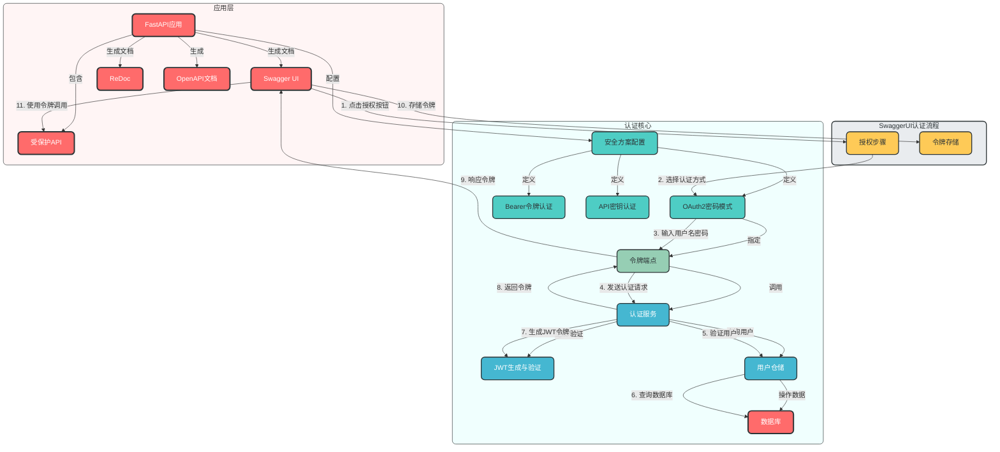
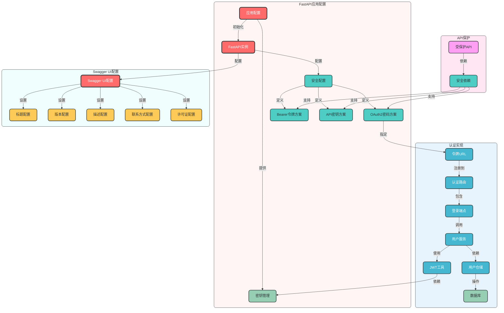

# Swagger UI认证模块设计

## 一、设计概述

本设计实现了一套**企业级的Swagger UI认证方案**，基于FastAPI的OpenAPI规范，提供了安全的API文档访问控制和多种认证方式支持，旨在提高API文档的安全性和易用性，同时保持与FastAPI生态的无缝集成。

### 设计目标

1. **基于OpenAPI规范**：严格遵循OpenAPI 3.0规范，确保文档的标准化和互操作性
2. **多种认证方式**：支持OAuth2密码模式、Bearer令牌、API密钥等多种认证方式
3. **安全的文档访问**：提供API文档的访问控制选项，保护敏感API信息
4. **良好的开发者体验**：提供直观的Swagger UI认证界面，简化API测试流程
5. **与现有认证体系集成**：无缝集成项目现有的JWT认证系统
6. **可扩展性**：支持未来扩展更多认证方式
7. **环境适配**：根据不同环境（开发/测试/生产）提供不同的认证配置

### 设计原则

- ✅ **安全优先**：确保API文档的访问安全，保护敏感信息
- ✅ **易用性**：提供直观的认证界面，降低开发者使用门槛
- ✅ **标准化**：遵循OpenAPI规范，确保文档的互操作性
- ✅ **无缝集成**：与现有认证系统无缝集成，减少配置复杂度
- ✅ **可配置**：支持根据环境和需求灵活配置认证方式
- ✅ **可扩展**：设计便于扩展新的认证方式
- ✅ **文档清晰**：提供详细的使用文档和示例

## 二、架构设计

### 1. 整体架构图



### 2. 核心组件关系图



## 三、核心组件设计

### 1. OpenAPI安全方案配置

```python
# app/config/openapi.py
from fastapi import FastAPI
from fastapi.openapi.utils import get_openapi
from app.dependencies.config import app_settings


def custom_openapi(app: FastAPI):
    """自定义OpenAPI配置，添加安全方案"""
    if app.openapi_schema:
        return app.openapi_schema
    
    openapi_schema = get_openapi(
        title=app_settings.APP_NAME,
        version=app_settings.APP_VERSION,
        description="企业级FastAPI应用，提供完整的RESTful API服务",
        routes=app.routes,
        tags=[
            {
                "name": "认证",
                "description": "用户认证相关API",
            },
            {
                "name": "用户",
                "description": "用户管理相关API",
            },
            # 其他标签...
        ],
        contact={
            "name": "API支持团队",
            "email": "api-support@example.com",
        },
        license_info={
            "name": "MIT License",
            "url": "https://opensource.org/licenses/MIT",
        },
    )
    
    # 添加安全方案
    openapi_schema["components"]["securitySchemes"] = {
        "OAuth2PasswordBearer": {
            "type": "oauth2",
            "flows": {
                "password": {
                    "tokenUrl": f"{app_settings.API_V1_STR}/auth/login",
                    "scopes": {},
                },
            },
        },
        "BearerAuth": {
            "type": "http",
            "scheme": "bearer",
            "bearerFormat": "JWT",
        },
    }
    
    # 为受保护的API添加安全要求
    for path in openapi_schema["paths"]:
        for method in openapi_schema["paths"][path]:
            # 跳过认证相关的端点
            if "/auth/" in path:
                continue
            # 跳过公共端点
            if path in ["/", f"{app_settings.API_V1_STR}/health"]:
                continue
            # 添加安全要求
            if "security" not in openapi_schema["paths"][path][method]:
                openapi_schema["paths"][path][method]["security"] = [
                    {"OAuth2PasswordBearer": []},
                    {"BearerAuth": []},
                ]
    
    app.openapi_schema = openapi_schema
    return app.openapi_schema
```

### 2. FastAPI应用配置

```python
# main.py
from fastapi import FastAPI
from app.config.openapi import custom_openapi
from app.dependencies.config import app_settings

# 创建FastAPI应用
app = FastAPI(
    title=app_settings.APP_NAME,
    version=app_settings.APP_VERSION,
    openapi_url=f"{app_settings.API_V1_STR}/openapi.json",
    # 配置Swagger UI
    swagger_ui_parameters={
        "persistAuthorization": True,  # 保持认证状态
        "displayOperationId": True,  # 显示操作ID
        "defaultModelsExpandDepth": -1,  # 默认不展开模型
    },
    # 配置ReDoc
    redoc_url=f"{app_settings.API_V1_STR}/redoc",
    redoc_parameters={
        "sortOperationsBy": "alpha",  # 按字母顺序排序操作
        "hideHostname": False,  # 显示主机名
    },
)

# 设置自定义OpenAPI配置
app.openapi = lambda: custom_openapi(app)
```

### 3. 认证路由设计

```python
# app/api/v1/auth.py
from fastapi import APIRouter, Depends, status
from fastapi.security import OAuth2PasswordRequestForm
from app.domains.user.schemas.user import Token
from app.dependencies.service import get_user_service

router = APIRouter()


@router.post("/login", response_model=Token, tags=["认证"])
def login(
    form_data: OAuth2PasswordRequestForm = Depends(),
    user_service = Depends(get_user_service),
):
    """用户登录，获取访问令牌
    
    提供用户名和密码，获取JWT访问令牌，用于访问受保护的API。
    
    Args:
        form_data: 包含用户名和密码的表单数据
    
    Returns:
        包含访问令牌、令牌类型和过期时间的响应
    """
    # 验证用户
    user = user_service.authenticate_user(form_data.username, form_data.password)
    
    # 生成访问令牌
    access_token = user_service.generate_token(user)
    
    return {
        "access_token": access_token,
        "token_type": "bearer",
        "expires_in": app_settings.ACCESS_TOKEN_EXPIRE_MINUTES * 60,
    }
```

### 4. 安全依赖设计

```python
# app/dependencies/auth.py
from fastapi import Depends, HTTPException, status
from fastapi.security import OAuth2PasswordBearer, HTTPBearer
from sqlalchemy.orm import Session
from jose import JWTError, jwt
from app.dependencies.config import get_app_settings
from app.dependencies.database import get_sqlite_db
from app.config.logger import logger

# OAuth2密码Bearer模式
oauth2_scheme = OAuth2PasswordBearer(
    tokenUrl=f"{get_app_settings().API_V1_STR}/auth/login",
    description="使用OAuth2密码模式进行认证",
)

# HTTP Bearer令牌模式
bearer_scheme = HTTPBearer(
    description="使用JWT令牌进行认证",
)


def get_current_user(
    token: str = Depends(oauth2_scheme),
    db: Session = Depends(get_sqlite_db),
):
    """获取当前认证用户
    
    验证JWT令牌，获取用户信息并验证用户状态
    
    Args:
        token: JWT令牌
        db: 数据库会话
    
    Returns:
        当前认证用户对象
    
    Raises:
        HTTPException: 认证失败时返回401错误
    """
    credentials_exception = HTTPException(
        status_code=status.HTTP_401_UNAUTHORIZED,
        detail="无法验证凭证",
        headers={"WWW-Authenticate": "Bearer"},
    )

    try:
        # 解码JWT令牌
        settings = get_app_settings()
        payload = jwt.decode(
            token, settings.SECRET_KEY, algorithms=[settings.ALGORITHM]
        )
        user_id: str = payload.get("sub")
        if user_id is None:
            logger.warning("JWT令牌缺少'sub'声明")
            raise credentials_exception
    except JWTError as e:
        logger.warning(f"JWT令牌解码失败: {str(e)}")
        raise credentials_exception

    # 延迟导入，避免循环导入
    from app.domains.user.models.user import User
    
    # 直接使用Session查询用户，避免依赖UserService
    user = db.query(User).filter(User.id == int(user_id)).first()
    if not user:
        logger.warning(f"未找到用户ID: {user_id}")
        raise credentials_exception

    return user


class AuthDeps:
    """认证依赖注入容器，提供统一的认证依赖访问接口"""
    
    @staticmethod
    def current_user():
        """当前认证用户依赖"""
        return Depends(get_current_user)
    
    @staticmethod
    def oauth2():
        """OAuth2密码Bearer模式依赖"""
        return Depends(oauth2_scheme)
    
    @staticmethod
    def bearer():
        """Bearer令牌依赖"""
        return Depends(bearer_scheme)


# 创建依赖容器实例
auth_deps = AuthDeps()
```

## 四、使用示例

### 1. 基本使用

```python
# 1. 在受保护的API中使用认证依赖
from fastapi import APIRouter
from app.dependencies.auth import auth_deps

router = APIRouter()

@router.get("/me", tags=["用户"])
def get_current_user(
    current_user = auth_deps.current_user()
):
    """获取当前用户信息
    
    该API需要认证，使用JWT令牌访问。
    """
    return current_user
```

### 2. Swagger UI认证流程

1. **访问Swagger UI**：打开 `http://localhost:8000/docs`
2. **点击"Authorize"按钮**：在Swagger UI右上角找到并点击"Authorize"按钮
3. **选择认证方式**：
   - 选择"OAuth2PasswordBearer"
   - 输入用户名和密码
   - 点击"Authorize"按钮
4. **开始测试API**：认证成功后，即可测试所有受保护的API
5. **查看认证状态**：Swagger UI会显示当前认证状态，支持持久化认证

### 3. 环境适配配置

```python
# app/config/settings.py
from pydantic_settings import BaseSettings
from typing import List, Optional


class AppSettings(BaseSettings):
    """应用配置"""
    # API配置
    APP_NAME: str = "FastAPI Enterprise Application"
    APP_VERSION: str = "1.0.0"
    API_V1_STR: str = "/api/v1"
    
    # 环境配置
    ENVIRONMENT: str = "development"
    DEBUG: bool = True
    
    # Swagger UI配置
    SWAGGER_UI_ENABLED: bool = True
    REDOC_ENABLED: bool = True
    
    # 生产环境配置
    if ENVIRONMENT == "production":
        DEBUG = False
        SWAGGER_UI_ENABLED = True  # 生产环境可以选择关闭Swagger UI
        REDOC_ENABLED = True       # 生产环境可以选择关闭ReDoc
    
    class Config:
        env_file = ".env"
```

## 五、目录结构设计

### 1. 推荐目录结构

```
fastapi_enterprise/
├── app/                     # 应用核心目录
│   ├── __init__.py
│   ├── main.py              # 应用入口，FastAPI配置
│   ├── api/                 # API路由
│   │   └── v1/              # v1版本API
│   │       ├── auth.py       # 认证路由
│   │       └── users.py      # 用户路由
│   ├── config/              # 配置模块
│   │   ├── openapi.py       # OpenAPI配置
│   │   └── settings.py      # 应用设置
│   ├── dependencies/        # 依赖注入模块
│   │   └── auth.py          # 认证依赖
│   └── ...                  # 其他模块
├── docs/                    # 文档目录
│   └── design/              # 设计文档
│       └── modules/         # 模块设计文档
│           └── Swagger UI认证模块设计.md  # 本设计文档
├── .env                     # 开发环境变量
├── .env.prod                # 生产环境变量
└── .env.test                # 测试环境变量
```

### 2. 关键目录说明

- **config/openapi.py**：OpenAPI文档配置，包括安全方案、标签、联系方式等
- **main.py**：FastAPI应用实例创建，配置Swagger UI和ReDoc
- **dependencies/auth.py**：认证依赖注入，定义安全方案和认证逻辑
- **api/v1/auth.py**：认证路由，提供登录端点

### 3. 设计优势

- **集中管理**：所有Swagger UI认证配置集中管理，便于维护
- **标准化设计**：遵循OpenAPI规范，确保文档的互操作性
- **多种认证方式**：支持OAuth2密码模式和Bearer令牌模式
- **良好的开发者体验**：提供直观的Swagger UI认证界面
- **环境适配**：根据不同环境提供不同的配置选项
- **与现有认证系统集成**：无缝集成项目现有的JWT认证系统

## 六、最佳实践

### 1. 安全最佳实践

- **生产环境考虑**：生产环境可以选择限制Swagger UI的访问，或添加IP白名单
- **敏感信息保护**：避免在Swagger UI中显示敏感API的详细信息
- **令牌过期时间**：设置合理的令牌过期时间，平衡安全性和易用性
- **HTTPS强制**：生产环境强制使用HTTPS，保护认证凭证

### 2. 文档最佳实践

- **详细的API描述**：为每个API添加详细的描述和示例
- **清晰的标签组织**：使用标签组织不同类型的API
- **统一的错误响应**：定义统一的错误响应格式，在文档中说明
- **版本控制**：清晰标识API版本，便于开发者了解API演进

### 3. 开发最佳实践

- **使用依赖注入**：统一管理认证依赖，便于测试和维护
- **自动化测试**：为认证流程编写自动化测试
- **持续集成**：将OpenAPI文档验证纳入CI/CD流程
- **文档版本管理**：对OpenAPI文档进行版本管理

## 七、扩展建议

### 1. 增强认证方式

- **支持OAuth2授权码模式**：适用于第三方应用集成
- **支持OpenID Connect**：提供更完整的身份认证解决方案
- **支持API密钥认证**：便于服务间调用
- **支持多因素认证**：提高认证安全性

### 2. 增强文档功能

- **添加API示例**：为每个API添加请求和响应示例
- **支持API测试自动化**：集成Postman或其他API测试工具
- **提供SDK生成**：自动生成不同语言的SDK
- **添加变更日志**：在文档中显示API变更日志

### 3. 增强安全性

- **API访问控制**：基于角色的访问控制（RBAC）
- **API限流**：防止恶意请求
- **审计日志**：记录所有API访问和认证事件
- **API密钥管理**：提供API密钥的生成、过期和撤销功能

### 4. 增强开发者体验

- **提供交互式教程**：在Swagger UI中添加交互式教程
- **支持API控制台**：提供更强大的API测试控制台
- **添加代码生成器**：支持生成不同语言的客户端代码
- **提供API状态监控**：显示API的可用性和性能指标

## 八、总结

本设计实现了一套功能强大的企业级Swagger UI认证方案，具有以下核心优势：

1. **符合OpenAPI规范**：严格遵循OpenAPI 3.0规范，确保文档的标准化
2. **多种认证方式**：支持OAuth2密码模式和Bearer令牌模式
3. **良好的开发者体验**：提供直观的Swagger UI认证界面
4. **与现有系统集成**：无缝集成项目现有的JWT认证系统
5. **可扩展性**：支持未来扩展更多认证方式和功能
6. **环境适配**：根据不同环境提供灵活的配置选项
7. **安全优先**：提供安全的API文档访问控制

通过使用本Swagger UI认证方案，开发团队可以：
- 提高API文档的安全性
- 简化API测试流程
- 提供专业的API文档
- 支持多种认证方式
- 便于未来功能扩展

本设计方案结合了现代API文档和认证的最佳实践，为FastAPI企业级应用提供了可靠的Swagger UI认证解决方案。