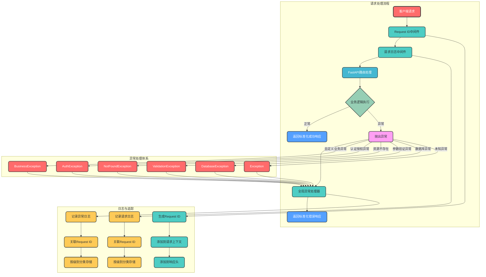

# FastAPI 异常处理模块设计

## 一、设计概述

本设计实现了一套**生产级的FastAPI异常处理框架**，基于标准化响应、分层异常体系、全量异常捕获、请求链路追踪和精细化日志管理，旨在提高API的一致性、系统的稳定性和可维护性，降低前后端对接成本，便于问题定位和日志分析。

### 设计目标

1. **标准化响应**：统一成功/失败返回结构，降低前后端对接成本
2. **分层异常体系**：按业务场景拆分异常类型，便于分类管理和扩展
3. **全量异常捕获**：覆盖所有异常类型，确保系统稳定性
4. **请求链路追踪**：Request ID关联请求上下文，便于问题定位
5. **日志分级记录**：不同异常类型对应不同日志级别，便于监控和排查
6. **易扩展架构**：模块化设计，支持按需扩展，降低维护成本
7. **安全防护**：保护敏感信息，避免信息泄露

### 设计原则

- ✅ **标准化**：统一API响应格式，提高API一致性
- ✅ **分层设计**：清晰的异常分类，便于管理和扩展
- ✅ **全量捕获**：覆盖所有异常类型，确保系统稳定性
- ✅ **链路追踪**：Request ID关联请求上下文，便于问题定位
- ✅ **日志分级**：不同异常类型对应不同日志级别，便于监控和分析
- ✅ **易扩展**：模块化设计，支持按需扩展，不侵入业务代码
- ✅ **安全优先**：保护敏感信息，避免信息泄露
- ✅ **性能优先**：优化异常处理性能，减少系统开销

## 二、架构设计

### 1. 整体架构图



### 2. 核心组件关系图

```mermaid
graph TD
    subgraph 异常处理核心组件
        A[BaseAppException] --> B[BusinessException]
        A --> C[AuthException]
        A --> D[ForbiddenException]
        A --> E[NotFoundException]
        A --> F[ValidationException]
        A --> G[DatabaseException]
        A --> H[ThirdPartyException]
        
        I[全局异常处理器] --> J[标准化响应工具]
        I --> K[日志记录器]
        
        L[Request ID中间件] --> M[请求上下文]
        N[请求日志中间件] --> K
        
        O[FastAPI应用] --> L
        O --> N
        O --> I
    end
    
    subgraph 业务使用组件
        P[业务服务] --> B
        P --> C
        P --> D
        P --> E
        Q[API层] --> P
        Q --> J
    end
    
    style A fill:#FF6B6B,stroke:#2D3436,stroke-width:3px,color:white
    style B fill:#4ECDC4,stroke:#2D3436,stroke-width:2px,color:#2D3436
    style C fill:#4ECDC4,stroke:#2D3436,stroke-width:2px,color:#2D3436
    style D fill:#4ECDC4,stroke:#2D3436,stroke-width:2px,color:#2D3436
    style E fill:#4ECDC4,stroke:#2D3436,stroke-width:2px,color:#2D3436
    style F fill:#4ECDC4,stroke:#2D3436,stroke-width:2px,color:#2D3436
    style G fill:#4ECDC4,stroke:#2D3436,stroke-width:2px,color:#2D3436
    style H fill:#4ECDC4,stroke:#2D3436,stroke-width:2px,color:#2D3436
    style I fill:#45B7D1,stroke:#2D3436,stroke-width:2px,color:white
    style J fill:#FECA57,stroke:#2D3436,stroke-width:2px,color:#2D3436
    style K fill:#FECA57,stroke:#2D3436,stroke-width:2px,color:#2D3436
    style L fill:#FF9FF3,stroke:#2D3436,stroke-width:2px,color:#2D3436
    style M fill:#E9ECEF,stroke:#2D3436,stroke-width:2px,color:#2D3436
    style N fill:#FF9FF3,stroke:#2D3436,stroke-width:2px,color:#2D3436
    style O fill:#54A0FF,stroke:#2D3436,stroke-width:3px,color:white
    style P fill:#96CEB4,stroke:#2D3436,stroke-width:2px,color:#2D3436
    style Q fill:#96CEB4,stroke:#2D3436,stroke-width:2px,color:#2D3436
```



## 三、核心组件设计

### 1. 标准化响应模型

```python
# app/schemas/response.py
from pydantic import BaseModel
from typing import Any, Optional

class BaseResponse(BaseModel):
    """基础响应模型，所有响应的统一结构"""
    code: int
    message: str
    request_id: str
    
    class Config:
        from_attributes = True

class SuccessResponse(BaseResponse):
    """成功响应模型"""
    data: Any = None
    
    class Config:
        arbitrary_types_allowed = True

class ErrorResponse(BaseResponse):
    """错误响应模型"""
    error_details: Optional[dict] = None
```

### 2. 基础异常类

```python
# app/exceptions/base.py
class BaseAppException(Exception):
    """应用基础异常类"""
    def __init__(
        self,
        message: str = "服务器内部错误",
        code: int = 500,
        error_details: dict = None,
        log_level: str = "error"
    ):
        self.message = message
        self.code = code
        self.error_details = error_details or {}
        self.log_level = log_level
        super().__init__(self.message)
```

### 3. 业务异常类

```python
# app/exceptions/business.py
from .base import BaseAppException

class BusinessException(BaseAppException):
    """业务逻辑异常"""
    def __init__(
        self,
        message: str = "业务逻辑错误",
        code: int = 400,
        error_details: dict = None,
        log_level: str = "warning"
    ):
        super().__init__(message, code, error_details, log_level)

class NotFoundException(BaseAppException):
    """资源不存在异常"""
    def __init__(
        self,
        message: str = "资源不存在",
        code: int = 404,
        error_details: dict = None,
        log_level: str = "info"
    ):
        super().__init__(message, code, error_details, log_level)
```

### 4. 认证授权异常类

```python
# app/exceptions/auth.py
from .base import BaseAppException

class AuthException(BaseAppException):
    """认证异常"""
    def __init__(
        self,
        message: str = "认证失败",
        code: int = 401,
        error_details: dict = None,
        log_level: str = "warning"
    ):
        super().__init__(message, code, error_details, log_level)

class ForbiddenException(BaseAppException):
    """权限不足异常"""
    def __init__(
        self,
        message: str = "权限不足",
        code: int = 403,
        error_details: dict = None,
        log_level: str = "warning"
    ):
        super().__init__(message, code, error_details, log_level)
```

### 5. 其他异常类

```python
# app/exceptions/http.py
from .base import BaseAppException

class ValidationException(BaseAppException):
    """参数验证异常"""
    def __init__(
        self,
        message: str = "参数验证失败",
        code: int = 400,
        error_details: dict = None,
        log_level: str = "info"
    ):
        super().__init__(message, code, error_details, log_level)

# app/exceptions/database.py
class DatabaseException(BaseAppException):
    """数据库异常"""
    def __init__(
        self,
        message: str = "数据库操作失败",
        code: int = 500,
        error_details: dict = None,
        log_level: str = "error"
    ):
        super().__init__(message, code, error_details, log_level)
```

### 6. 全局异常处理器

```python
# app/exceptions/handler.py
from fastapi import Request, status
from fastapi.responses import JSONResponse
from fastapi.exceptions import RequestValidationError
from starlette.exceptions import HTTPException as StarletteHTTPException
from sqlalchemy.exc import SQLAlchemyError
from .base import BaseAppException
from .response import ErrorResponse
from app.config.logger import logger
from app.utils.request import get_request_id

async def custom_exception_handler(request: Request, exc: Exception):
    """全局异常处理器"""
    request_id = get_request_id(request)
    
    # 处理自定义异常
    if isinstance(exc, BaseAppException):
        error_response = ErrorResponse(
            code=exc.code,
            message=exc.message,
            error_details=exc.error_details,
            request_id=request_id
        )
        log_level = exc.log_level
    
    # 处理FastAPI参数验证异常
    elif isinstance(exc, RequestValidationError):
        error_details = {
            "errors": exc.errors(),
            "body": exc.body
        }
        error_response = ErrorResponse(
            code=status.HTTP_400_BAD_REQUEST,
            message="请求参数验证失败",
            error_details=error_details,
            request_id=request_id
        )
        log_level = "info"
    
    # 处理Starlette HTTP异常
    elif isinstance(exc, StarletteHTTPException):
        error_response = ErrorResponse(
            code=exc.status_code,
            message=exc.detail,
            request_id=request_id
        )
        log_level = "warning" if exc.status_code < 500 else "error"
    
    # 处理数据库异常
    elif isinstance(exc, SQLAlchemyError):
        error_details = {
            "original_error": str(exc)
        }
        error_response = ErrorResponse(
            code=status.HTTP_500_INTERNAL_SERVER_ERROR,
            message="数据库操作失败",
            error_details=error_details,
            request_id=request_id
        )
        log_level = "error"
    
    # 处理其他未知异常
    else:
        error_details = {
            "exception_type": type(exc).__name__,
            "original_error": str(exc)
        }
        error_response = ErrorResponse(
            code=status.HTTP_500_INTERNAL_SERVER_ERROR,
            message="服务器内部错误",
            error_details=error_details,
            request_id=request_id
        )
        log_level = "error"
    
    # 记录异常日志
    log_exception(request, exc, error_response, log_level)
    
    # 返回标准化错误响应
    return JSONResponse(
        status_code=error_response.code,
        content=error_response.dict()
    )


def log_exception(request: Request, exc: Exception, error_response: ErrorResponse, log_level: str):
    """记录异常日志"""
    log_data = {
        "request_id": error_response.request_id,
        "path": request.url.path,
        "method": request.method,
        "client_ip": request.client.host if request.client else "unknown",
        "code": error_response.code,
        "message": error_response.message,
        "error_details": error_response.error_details,
        "exception_type": type(exc).__name__
    }
    
    # 根据日志级别记录日志
    if log_level == "debug":
        logger.debug(f"[Exception] {error_response.message}", extra=log_data)
    elif log_level == "info":
        logger.info(f"[Exception] {error_response.message}", extra=log_data)
    elif log_level == "warning":
        logger.warning(f"[Exception] {error_response.message}", extra=log_data)
    elif log_level == "error":
        logger.error(f"[Exception] {error_response.message}", extra=log_data, exc_info=True)
    elif log_level == "critical":
        logger.critical(f"[Exception] {error_response.message}", extra=log_data, exc_info=True)
```

### 7. 标准化响应工具

```python
# app/exceptions/response.py
from typing import Any, Optional
from app.schemas.response import SuccessResponse, ErrorResponse

class ResponseBuilder:
    """响应构建器，基于统一响应模型"""
    
    @staticmethod
    def success(data: Any = None, message: str = "success", code: int = 200, request_id: str = None) -> dict:
        """构建成功响应"""
        return SuccessResponse(
            code=code,
            message=message,
            data=data,
            request_id=request_id
        ).dict()
    
    @staticmethod
    def error(message: str, code: int, error_details: Optional[dict] = None, request_id: str = None) -> dict:
        """构建错误响应"""
        return ErrorResponse(
            code=code,
            message=message,
            error_details=error_details,
            request_id=request_id
        ).dict()
```

### 8. Request ID中间件

```python
# app/middleware/request.py
import uuid
from fastapi import Request, Response
from app.utils.request import set_request_id

async def request_id_middleware(request: Request, call_next):
    """Request ID中间件"""
    # 从请求头获取Request ID，若不存在则生成新的
    request_id = request.headers.get("X-Request-ID", str(uuid.uuid4()))
    
    # 设置Request ID到请求上下文
    set_request_id(request, request_id)
    
    # 处理请求
    response = await call_next(request)
    
    # 将Request ID添加到响应头
    response.headers["X-Request-ID"] = request_id
    
    return response
```

### 9. 请求日志中间件

```python
# app/middleware/request.py
import time
from fastapi import Request, Response
from app.config.logger import logger
from app.utils.request import get_request_id

async def request_log_middleware(request: Request, call_next):
    """请求日志中间件"""
    # 记录请求开始时间
    start_time = time.time()
    
    # 获取请求基本信息
    request_id = get_request_id(request)
    path = request.url.path
    method = request.method
    client_ip = request.client.host if request.client else "unknown"
    
    # 记录请求信息（不记录请求体，避免敏感信息泄露）
    logger.info(
        "[Request Received]",
        extra={
            "request_id": request_id,
            "path": path,
            "method": method,
            "client_ip": client_ip,
            "headers": {k: v for k, v in request.headers.items() if k not in ["Authorization", "Cookie"]}
        }
    )
    
    # 处理请求
    response = await call_next(request)
    
    # 计算请求处理时间
    process_time = time.time() - start_time
    
    # 记录响应信息
    logger.info(
        "[Request Completed]",
        extra={
            "request_id": request_id,
            "path": path,
            "method": method,
            "client_ip": client_ip,
            "status_code": response.status_code,
            "process_time": round(process_time * 1000, 2)  # 转换为毫秒
        }
    )
    
    return response
```

## 四、使用示例

### 1. 应用初始化配置

```python
# app/main.py
from fastapi import FastAPI
from app.exceptions.handler import custom_exception_handler
from app.middleware.request import request_id_middleware, request_log_middleware
from app.exceptions.base import BaseAppException
from fastapi.exceptions import RequestValidationError
from starlette.exceptions import HTTPException as StarletteHTTPException

app = FastAPI(title="FastAPI Example", version="1.0.0")

# 注册中间件
app.middleware("http")(request_id_middleware)
app.middleware("http")(request_log_middleware)

# 注册异常处理器
app.add_exception_handler(BaseAppException, custom_exception_handler)
app.add_exception_handler(RequestValidationError, custom_exception_handler)
app.add_exception_handler(StarletteHTTPException, custom_exception_handler)
app.add_exception_handler(Exception, custom_exception_handler)
```

### 2. 业务服务中使用

```python
# app/domains/user/services/user_service.py
from app.domains.user.repositories.user_repository import IUserRepository
from app.exceptions.business import NotFoundException, BusinessException

class UserService:
    """用户服务"""
    
    def __init__(self, user_repository: IUserRepository):
        self.user_repository = user_repository
    
    def get_user(self, user_id: int):
        """获取用户"""
        user = self.user_repository.get(user_id)
        if not user:
            raise NotFoundException(message="用户不存在", error_details={"user_id": user_id})
        
        if user.status == "disabled":
            raise BusinessException(message="用户已禁用", error_details={"user_id": user_id})
        
        return user
```

### 3. API层使用

```python
# app/api/v1/users.py
from fastapi import APIRouter, Depends, Request
from app.domains.user.schemas import UserResponse, UserCreate
from app.domains.user.services.user_service import UserService
from app.dependencies.service import service_deps
from app.exceptions.response import ResponseBuilder
from app.utils.request import get_request_id

router = APIRouter(prefix="/users", tags=["users"])

@router.post("/", response_model=UserResponse)
async def create_user(
    user_in: UserCreate,
    request: Request,
    user_service: UserService = service_deps.user_service()
):
    """创建用户"""
    user = user_service.create_user(user_in)
    return ResponseBuilder.success(
        data=user,
        message="用户创建成功",
        request_id=get_request_id(request)
    )

@router.get("/{user_id}", response_model=UserResponse)
async def get_user(
    user_id: int,
    request: Request,
    user_service: UserService = service_deps.user_service()
):
    """获取用户"""
    user = user_service.get_user(user_id)
    return ResponseBuilder.success(
        data=user,
        request_id=get_request_id(request)
    )
```

## 五、目录结构设计

### 1. 推荐目录结构

```
fastapi_enterprise/
├── app/                     # 应用核心目录
│   ├── __init__.py
│   ├── main.py              # 应用入口
│   ├── domains/             # DDD领域模块（按业务域组织）
│   ├── exceptions/          # 异常处理模块
│   │   ├── __init__.py      # 包初始化文件，导出核心组件
│   │   ├── base.py          # 基础异常类定义
│   │   ├── business.py      # 业务相关异常类
│   │   ├── auth.py          # 认证授权相关异常类
│   │   ├── http.py          # HTTP相关异常类
│   │   ├── database.py      # 数据库相关异常类
│   │   ├── handler.py       # 全局异常处理器
│   │   └── response.py      # 标准化响应工具
│   ├── middleware/          # 中间件目录
│   │   ├── __init__.py      # 包初始化文件
│   │   └── request.py       # 请求ID中间件、请求日志中间件
│   ├── config/              # 配置模块
│   │   ├── __init__.py      # 包初始化文件
│   │   ├── settings.py      # 主配置文件
│   │   └── logger.py        # 日志配置
│   ├── schemas/             # 数据校验模型
│   │   ├── __init__.py      # 包初始化文件
│   │   └── response.py      # 响应模型定义
│   └── utils/               # 工具函数
│       ├── __init__.py      # 包初始化文件
│       └── request.py       # 请求工具
├── .env                     # 开发环境变量
├── .env.prod                # 生产环境变量
└── .env.test                # 测试环境变量
```

### 2. 关键目录说明

- **exceptions/**：异常处理模块主目录，包含所有异常类、处理器和响应工具
  - **exceptions/base.py**：基础异常类，所有自定义异常的父类
  - **exceptions/[type].py**：按类型分类的异常类，如业务异常、认证异常等
  - **exceptions/handler.py**：全局异常处理器，处理所有类型的异常
  - **exceptions/response.py**：标准化响应工具，用于构建统一格式的响应

- **middleware/**：中间件目录，包含Request ID中间件和请求日志中间件
  - **middleware/request.py**：请求相关中间件，处理Request ID和请求日志

- **schemas/**：数据校验模型目录，包含响应模型定义
  - **schemas/response.py**：统一响应模型定义，确保API响应格式一致

- **config/**：配置模块目录，包含日志配置
  - **config/logger.py**：日志配置，定义日志格式和输出方式

- **utils/**：工具函数目录，包含请求相关工具
  - **utils/request.py**：请求工具函数，用于处理Request ID

## 六、最佳实践

### 1. 异常设计最佳实践

- **面向接口编程**：基于异常类型而非具体实现进行异常处理
- **明确的错误信息**：错误信息应清晰、具体，便于调试和用户理解
- **合理的日志级别**：根据异常严重程度选择合适的日志级别
- **避免过度捕获**：只捕获需要处理的异常，避免捕获所有异常
- **保持异常层次结构**：合理组织异常类的继承关系

### 2. 响应设计最佳实践

- **统一响应格式**：所有API返回统一格式的响应
- **明确的状态码**：使用标准的HTTP状态码和业务状态码
- **适当的错误详情**：开发环境显示详细错误信息，生产环境只显示必要信息
- **包含Request ID**：所有响应都应包含Request ID，便于问题追踪

### 3. 日志记录最佳实践

- **日志分级**：根据异常类型和严重程度选择合适的日志级别
- **包含上下文信息**：日志中应包含Request ID、请求路径、方法、客户端IP等上下文信息
- **保护敏感信息**：避免在日志中记录敏感信息，如密码、令牌等
- **结构化日志**：使用JSON格式的结构化日志，便于日志分析工具处理
- **适当的日志保留策略**：根据业务需求和法规要求设置日志保留期限

### 4. 性能最佳实践

- **避免频繁创建异常**：异常创建和处理会带来性能开销，避免在热点路径频繁抛出异常
- **使用预定义异常**：对于常见异常，使用预定义的异常对象，避免重复创建
- **简化异常处理逻辑**：异常处理器应保持简洁，避免复杂的处理逻辑
- **异步日志记录**：考虑使用异步日志记录，减少对请求处理的影响

## 七、扩展建议

### 1. 支持更多异常类型

- **添加第三方服务异常**：专门处理调用第三方服务时的异常
- **添加限流异常**：处理API限流相关的异常
- **添加缓存异常**：处理缓存操作相关的异常
- **添加配置异常**：处理配置错误相关的异常

### 2. 增强异常处理能力

- **支持异常聚合**：对于批量操作，支持聚合多个异常并返回
- **支持异常重试**：对于某些可恢复的异常，支持自动重试
- **支持异常降级**：对于非关键服务的异常，支持服务降级
- **支持异常通知**：对于严重异常，支持发送通知（如邮件、短信、告警等）

### 3. 增强日志和监控

- **集成APM工具**：与应用性能监控工具集成，实现更细粒度的性能监控
- **添加异常统计**：统计异常发生的频率、类型等，便于分析和优化
- **实现分布式追踪**：与分布式追踪系统集成，实现跨服务的请求追踪
- **添加日志采样**：对于高频请求，实现日志采样，减少日志量

### 4. 国际化支持

- **支持多语言错误信息**：根据用户的语言偏好返回不同语言的错误信息
- **添加错误码映射**：将错误码映射到不同语言的错误信息
- **支持自定义错误信息**：允许业务方自定义错误信息

### 5. 测试支持

- **添加异常测试工具**：提供便捷的异常测试工具，便于单元测试和集成测试
- **支持异常模拟**：支持模拟各种异常场景，便于测试异常处理逻辑
- **添加异常覆盖率报告**：生成异常覆盖率报告，确保所有异常类型都被测试到

## 八、总结

本设计实现了一套完整的**FastAPI异常处理框架**，采用**标准化响应**、**分层异常体系**、**全量异常捕获**、**请求链路追踪**和**精细化日志管理**，旨在提高API的一致性、系统的稳定性和可维护性。

该框架具有以下核心优势：

1. **标准化**：统一API响应格式，提高API一致性，降低前后端对接成本
2. **分层设计**：清晰的异常分类，便于管理和扩展，适应复杂业务场景
3. **全量捕获**：覆盖所有异常类型，确保系统稳定性，避免未处理异常导致崩溃
4. **链路追踪**：Request ID关联请求上下文，便于问题定位和日志分析
5. **日志分级**：不同异常类型对应不同日志级别，便于监控和排查，保护敏感信息
6. **易扩展**：模块化设计，支持按需扩展，降低维护成本，适应业务变化
7. **安全优先**：保护敏感信息，避免信息泄露，符合安全合规要求
8. **性能优化**：优化异常处理性能，减少系统开销，提高系统响应速度

通过使用本异常处理框架，开发团队可以：
- 提高API的一致性和易用性
- 增强系统的稳定性和可靠性
- 便于问题定位和日志分析
- 降低维护成本，提高开发效率
- 符合安全合规要求
- 支持系统的快速扩展和迭代

本设计方案结合了现代API设计和异常处理的最佳实践，为FastAPI企业级应用提供了可靠的异常处理解决方案。