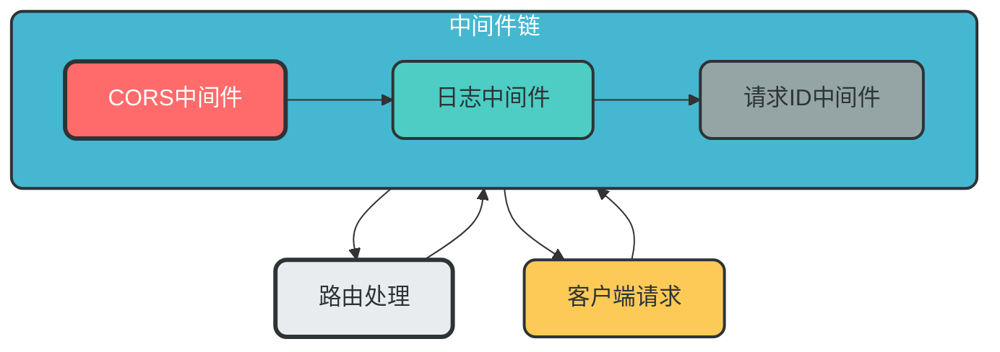
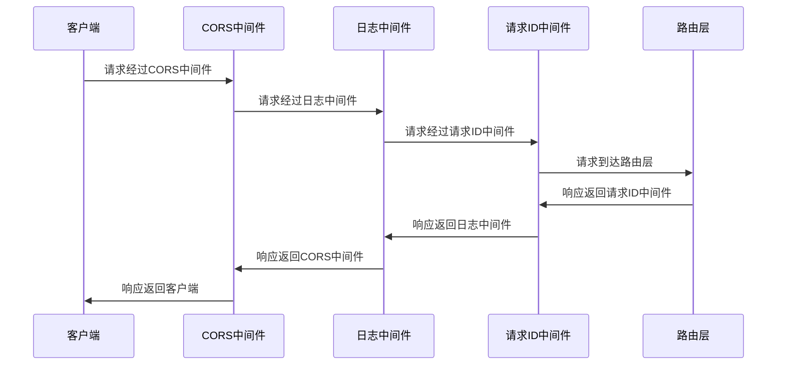

### 6. 中间件模块

**核心作用**：处理请求/响应生命周期的横切逻辑

**设计特点**：
- 支持多种中间件
- 中间件顺序可控
- 支持自定义中间件
- 内置常用中间件（CORS、限流、日志、认证等）

**模块架构图**：


**数据流转图**：


**关键实现**：
```python
# app/middleware/__init__.py
from app.middleware.cors import setup_cors
from app.middleware.request_logger import request_logger_middleware
from app.middleware.authentication import get_current_user, oauth2_scheme
from app.middleware.request import request_id_middleware


# main.py 中的中间件注册
def register_middlewares(app):
    """注册所有中间件"""
    # 1. 注册CORS中间件
    setup_cors(app)
    
    # 2. 注册日志中间件
    app.middleware("http")(request_logger_middleware)
    
    # 3. 注册请求ID中间件
    app.middleware("http")(request_id_middleware)
```