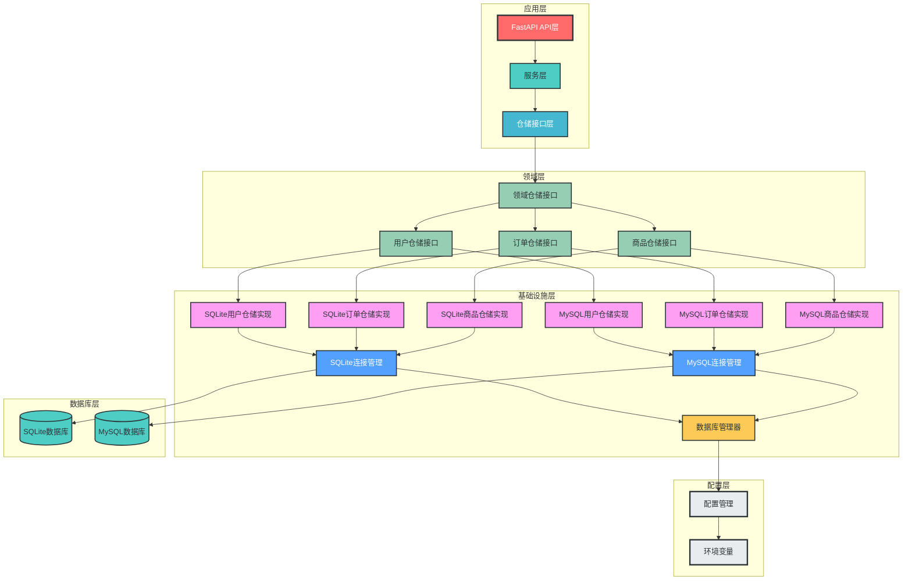
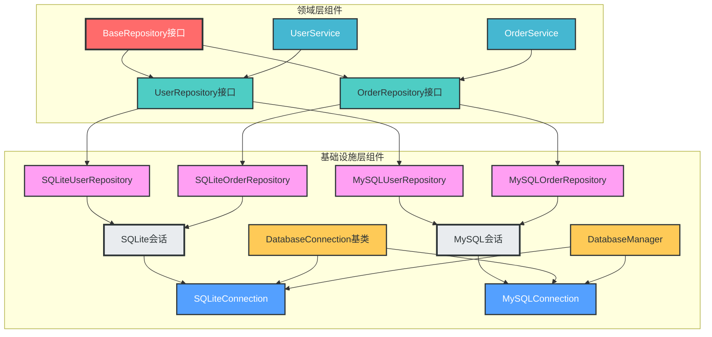

# 仓储层与多数据库管理设计

## 一、设计概述

本设计实现了一套**生产级的仓储层与多数据库管理架构**，支持多种数据库类型（如MySQL、SQLite等），通过**统一的接口抽象**、**标准化的连接管理**和**灵活的依赖注入机制**，实现了业务层与数据访问层的解耦，符合开闭原则、单一职责原则和依赖倒置原则，具备良好的可扩展性和可维护性。

### 设计目标

1. **接口抽象**：通过抽象接口定义数据访问契约，实现业务逻辑与数据访问的分离
2. **多数据库支持**：支持多种数据库后端，便于切换和扩展
3. **统一管理**：提供统一的数据库连接管理和会话获取机制
4. **依赖注入**：支持灵活的依赖注入，便于测试和替换实现
5. **事务支持**：支持事务管理，确保数据一致性
6. **异步支持**：支持异步操作，提高系统并发性能
7. **DDD领域驱动**：按业务域组织仓储接口，体现业务需求

### 设计原则

- ✅ **分层设计**：明确的职责划分，各层之间通过接口通信
- ✅ **依赖倒置**：高层模块不依赖低层模块，两者都依赖抽象接口
- ✅ **单一职责**：每个模块、类和函数只负责一个明确的功能
- ✅ **接口抽象**：通过接口定义契约，实现模块间解耦
- ✅ **可扩展性**：支持新数据库类型的无缝添加
- ✅ **类型安全**：使用类型注解确保类型安全
- ✅ **DDD设计**：按业务域组织核心业务逻辑

## 二、架构设计

### 1. 整体架构图



### 2. 核心组件关系图



## 二、仓储层设计

### 1. 核心概念

**仓储层**是业务逻辑层与数据访问层之间的桥梁，负责领域对象的持久化和检索，实现数据访问与业务逻辑的分离。仓储层采用**DDD领域驱动设计**，按业务域组织仓储接口，体现业务需求。

### 2. 设计原则

- **接口抽象**：通过接口定义数据访问契约，实现依赖倒置
- **DDD领域驱动**：按业务域组织仓储接口，体现业务需求
- **多数据库支持**：支持多种数据库后端，便于切换和扩展
- **事务支持**：参与服务层的事务管理，确保数据一致性
- **类型安全**：使用类型注解确保类型安全
- **可测试性**：设计便于单元测试和集成测试的接口

### 3. 核心组件

#### 3.1 仓储基类接口

```python
# app/domains/base/repositories/base.py
from abc import ABC, abstractmethod
from typing import Optional, List


class BaseRepository(ABC):
    """仓储基类接口，定义仓储层通用接口"""

    @abstractmethod
    def get(self, id: int):
        """根据ID获取实体"""
        pass

    @abstractmethod
    def get_multi(self, skip: int = 0, limit: int = 100):
        """获取实体列表"""
        pass
```

#### 3.2 领域仓储接口

```python
# app/domains/user/repositories/user_repository.py
from abc import ABC, abstractmethod
from typing import Optional, List
from app.domains.base.repositories.base import BaseRepository


class UserRepositoryInterface(BaseRepository):
    """用户仓储接口，定义用户相关的抽象方法"""
    
    @abstractmethod
    def get_by_username(self, username: str) -> Optional[any]:
        """根据用户名获取用户"""
        pass
    
    @abstractmethod
    def get_by_email(self, email: str) -> Optional[any]:
        """根据邮箱获取用户"""
        pass
    
    @abstractmethod
    def create(self, user_in: dict) -> any:
        """创建用户"""
        pass
    
    @abstractmethod
    def update(self, user_id: int, user_in: any) -> Optional[any]:
        """更新用户"""
        pass
    
    @abstractmethod
    def delete(self, user_id: int) -> Optional[any]:
        """删除用户"""
        pass
```

```python
# app/domains/order/repositories/order_repository.py
from abc import ABC, abstractmethod
from typing import Optional, List
from app.domains.base.repositories.base import BaseRepository


class OrderRepositoryInterface(BaseRepository):
    """订单仓储接口，定义订单相关的抽象方法"""
    
    @abstractmethod
    def get_by_user_id(self, user_id: int, skip: int = 0, limit: int = 100) -> List[any]:
        """根据用户ID获取订单列表"""
        pass
    
    @abstractmethod
    def create(self, order_in: dict) -> any:
        """创建订单"""
        pass
    
    @abstractmethod
    def update_status(self, order_id: int, status: str) -> Optional[any]:
        """更新订单状态"""
        pass
```

#### 3.3 仓储实现示例

```python
# app/infrastructure/repositories/sqlite/user_repository.py
from sqlalchemy.orm import Session
from typing import Optional, List
from app.domains.user.repositories.user_repository import UserRepositoryInterface
from app.domains.user.models import User
from app.domains.user.schemas import UserCreate, UserUpdate


class SQLiteUserRepository(UserRepositoryInterface):
    """SQLite用户仓储实现"""

    def __init__(self, db: Session):
        self.db = db

    def get(self, user_id: int) -> Optional[User]:
        """根据ID获取用户"""
        return self.db.query(User).filter(User.id == user_id).first()

    def get_by_username(self, username: str) -> Optional[User]:
        """根据用户名获取用户"""
        return self.db.query(User).filter(User.username == username).first()

    def get_by_email(self, email: str) -> Optional[User]:
        """根据邮箱获取用户"""
        return self.db.query(User).filter(User.email == email).first()

    def get_multi(self, skip: int = 0, limit: int = 100) -> List[User]:
        """获取用户列表"""
        return self.db.query(User).offset(skip).limit(limit).all()

    def create(self, user_in: dict) -> User:
        """创建用户"""
        db_user = User(**user_in)
        self.db.add(db_user)
        self.db.commit()
        self.db.refresh(db_user)
        return db_user

    def update(self, user_id: int, user_in: UserUpdate) -> Optional[User]:
        """更新用户"""
        db_user = self.get(user_id)
        if db_user:
            update_data = user_in.dict(exclude_unset=True)
            for field, value in update_data.items():
                setattr(db_user, field, value)
            self.db.add(db_user)
            self.db.commit()
            self.db.refresh(db_user)
        return db_user

    def delete(self, user_id: int) -> Optional[User]:
        """删除用户"""
        db_user = self.get(user_id)
        if db_user:
            self.db.delete(db_user)
            self.db.commit()
        return db_user
```

```python
# app/infrastructure/repositories/mysql/user_repository.py
from sqlalchemy.orm import Session
from typing import Optional, List
from app.domains.user.repositories.user_repository import UserRepositoryInterface
from app.domains.user.models import User
from app.domains.user.schemas import UserCreate, UserUpdate


class MySQLUserRepository(UserRepositoryInterface):
    """MySQL用户仓储实现"""

    def __init__(self, db: Session):
        self.db = db

    def get(self, user_id: int) -> Optional[User]:
        """根据ID获取用户"""
        return self.db.query(User).filter(User.id == user_id).first()

    def get_by_username(self, username: str) -> Optional[User]:
        """根据用户名获取用户"""
        return self.db.query(User).filter(User.username == username).first()

    def get_by_email(self, email: str) -> Optional[User]:
        """根据邮箱获取用户"""
        return self.db.query(User).filter(User.email == email).first()

    def get_multi(self, skip: int = 0, limit: int = 100) -> List[User]:
        """获取用户列表"""
        return self.db.query(User).offset(skip).limit(limit).all()

    def create(self, user_in: dict) -> User:
        """创建用户"""
        db_user = User(**user_in)
        self.db.add(db_user)
        self.db.commit()
        self.db.refresh(db_user)
        return db_user

    def update(self, user_id: int, user_in: UserUpdate) -> Optional[User]:
        """更新用户"""
        db_user = self.get(user_id)
        if db_user:
            update_data = user_in.dict(exclude_unset=True)
            for field, value in update_data.items():
                setattr(db_user, field, value)
            self.db.add(db_user)
            self.db.commit()
            self.db.refresh(db_user)
        return db_user

    def delete(self, user_id: int) -> Optional[User]:
        """删除用户"""
        db_user = self.get(user_id)
        if db_user:
            self.db.delete(db_user)
            self.db.commit()
        return db_user
```

## 三、多数据库管理设计

### 1. 核心概念

**多数据库管理**负责管理多种数据库的连接、配置和会话，通过统一的接口提供数据库访问能力，实现业务层与具体数据库实现的解耦。多数据库管理采用**基础设施层设计**，集中管理数据库连接和会话。

### 2. 设计原则

- **统一接口**：所有数据库连接实现统一的接口，便于扩展和切换
- **连接池管理**：高效管理数据库连接池，提高性能和资源利用率
- **配置驱动**：通过配置文件和环境变量管理数据库连接信息
- **依赖注入**：支持灵活的依赖注入，便于测试和替换
- **自动连接管理**：自动处理数据库连接的建立和关闭
- **集中化管理**：数据库连接管理集中在基础设施层，便于统一维护

### 3. 核心组件

#### 3.1 数据库连接基类

```python
# app/infrastructure/database/base.py
from abc import ABC, abstractmethod
from typing import Any, Generator, Dict


class DatabaseConnection(ABC):
    """数据库连接基类"""

    @abstractmethod
    def connect(self) -> Any:
        """建立数据库连接"""
        pass

    @abstractmethod
    def disconnect(self) -> None:
        """断开数据库连接"""
        pass

    @abstractmethod
    def get_session(self) -> Generator[Any, None, None]:
        """获取数据库会话"""
        pass
```

#### 3.2 数据库管理器

```python
# app/infrastructure/database/manager.py
from typing import Dict
from app.infrastructure.database.base import DatabaseConnection


class DatabaseManager:
    """数据库管理器，管理多个数据库连接"""

    def __init__(self):
        self._connections: Dict[str, DatabaseConnection] = {}

    def register(self, name: str, connection: DatabaseConnection) -> None:
        """注册数据库连接"""
        self._connections[name] = connection

    def get(self, name: str) -> DatabaseConnection:
        """获取数据库连接"""
        if name not in self._connections:
            raise ValueError(f"Database connection '{name}' not registered")
        return self._connections[name]

    def connect_all(self) -> None:
        """连接所有数据库"""
        for name, connection in self._connections.items():
            connection.connect()

    def disconnect_all(self) -> None:
        """断开所有数据库连接"""
        for name, connection in self._connections.items():
            connection.disconnect()


# 全局数据库管理器实例
database_manager = DatabaseManager()
```

#### 3.3 数据库连接实现示例

```python
# app/infrastructure/database/sqlite/connection.py
from sqlalchemy import create_engine, text
from sqlalchemy.orm import sessionmaker
from app.config.database import sqlite_config
from app.infrastructure.database.base import DatabaseConnection
from app.config.logger import logger
from app.domains.base.models import Base


class SQLiteConnection(DatabaseConnection):
    """SQLite数据库连接管理"""

    def __init__(self):
        self._engine = None
        self._SessionLocal = None
        self._Base = Base

    def connect(self):
        """建立SQLite连接"""
        try:
            self._engine = create_engine(
                sqlite_config.URL,
                connect_args={
                    "check_same_thread": False
                },  # SQLite特定配置，允许在多线程中使用
            )
            self._SessionLocal = sessionmaker(
                autocommit=False, autoflush=False, bind=self._engine
            )
            # 测试连接
            with self._engine.connect() as conn:
                conn.execute(text("SELECT 1"))
            logger.info("SQLite连接成功")
        except Exception as e:
            logger.error(f"SQLite连接失败: {str(e)}")
            raise

    def disconnect(self):
        """断开SQLite连接"""
        if self._engine:
            self._engine.dispose()
            self._engine = None
            logger.info("SQLite连接已断开")

    def get_session(self):
        """获取SQLite会话"""
        if not self._SessionLocal:
            self.connect()
        db = self._SessionLocal()
        try:
            yield db
        finally:
            db.close()

    @property
    def engine(self):
        """获取SQLite引擎"""
        if not self._engine:
            self.connect()
        return self._engine

    @property
    def Base(self):
        """获取SQLite模型基类"""
        return self._Base


# SQLite连接实例
sqlite_connection = SQLiteConnection()
```

```python
# app/infrastructure/database/mysql/connection.py
from sqlalchemy import create_engine, text
from sqlalchemy.orm import sessionmaker
from app.config.database import mysql_config
from app.infrastructure.database.base import DatabaseConnection
from app.config.logger import logger
from app.domains.base.models import Base


class MySQLConnection(DatabaseConnection):
    """MySQL数据库连接管理"""

    def __init__(self):
        self._engine = None
        self._SessionLocal = None
        self._Base = Base

    def connect(self):
        """建立MySQL连接"""
        try:
            self._engine = create_engine(
                mysql_config.URL,
                pool_size=mysql_config.POOL_SIZE,
                max_overflow=mysql_config.MAX_OVERFLOW,
                pool_pre_ping=mysql_config.POOL_PRE_PING
            )
            self._SessionLocal = sessionmaker(
                autocommit=False, autoflush=False, bind=self._engine
            )
            # 测试连接
            with self._engine.connect() as conn:
                conn.execute(text("SELECT 1"))
            logger.info("MySQL连接成功")
        except Exception as e:
            logger.error(f"MySQL连接失败: {str(e)}")
            raise

    def disconnect(self):
        """断开MySQL连接"""
        if self._engine:
            self._engine.dispose()
            self._engine = None
            logger.info("MySQL连接已断开")

    def get_session(self):
        """获取MySQL会话"""
        if not self._SessionLocal:
            self.connect()
        db = self._SessionLocal()
        try:
            yield db
        finally:
            db.close()

    @property
    def engine(self):
        """获取MySQL引擎"""
        if not self._engine:
            self.connect()
        return self._engine

    @property
    def Base(self):
        """获取MySQL模型基类"""
        return self._Base


# MySQL连接实例
mysql_connection = MySQLConnection()
```

## 四、目录结构设计

### 1. 推荐目录结构

```
fastapi_enterprise/
├── app/                     # 应用核心目录
│   ├── __init__.py
│   ├── main.py              # 应用入口
│   ├── domains/             # DDD领域模块（按业务域组织）
│   │   ├── __init__.py
│   │   ├── base/            # 基础领域模块
│   │   │   ├── __init__.py
│   │   │   ├── models/      # 基础模型
│   │   │   └── repositories/ # 基础仓储接口
│   │   │       └── base.py  # 仓储基类接口
│   │   ├── user/            # 用户领域
│   │   │   ├── __init__.py
│   │   │   ├── models.py          # 用户数据模型
│   │   │   ├── schemas.py         # 用户数据校验Schema
│   │   │   ├── services/          # 用户领域服务
│   │   │   │   ├── __init__.py
│   │   │   │   └── user_service.py    # 用户服务实现
│   │   │   └── repositories/      # 用户仓储接口
│   │   │       ├── __init__.py
│   │   │       └── user_repository.py  # 用户仓储接口定义
│   │   └── order/           # 订单领域
│   │       ├── __init__.py
│   │       ├── models.py          # 订单数据模型
│   │       ├── schemas.py         # 订单数据校验Schema
│   │       ├── services/          # 订单领域服务
│   │       │   ├── __init__.py
│   │       │   └── order_service.py   # 订单服务实现
│   │       └── repositories/      # 订单仓储接口
│   │           ├── __init__.py
│   │           └── order_repository.py # 订单仓储接口定义
│   ├── infrastructure/      # 基础设施层（按技术功能组织）
│       ├── __init__.py
│       ├── database/        # 数据库连接管理
│           ├── __init__.py
│           ├── base.py          # 数据库基类和通用工具
│           ├── manager.py       # 数据库管理器
│           ├── sqlite/          # SQLite数据库模块
│           │   ├── __init__.py
│           │   └── connection.py
│           └── mysql/           # MySQL数据库模块
│               ├── __init__.py
│               └── connection.py
│   ├── dependencies/        # 独立的依赖注入模块
│   │   ├── __init__.py
│   │   ├── base.py             # 依赖注入基类和通用工具
│   │   ├── database.py         # 数据库依赖注入
│   │   ├── repository.py       # 仓储层依赖注入
│   │   ├── service.py          # 服务层依赖注入
│   │   └── config.py           # 配置相关依赖注入
│   ├── config/              # 配置模块
│   │   ├── __init__.py
│   │   ├── settings.py      # 主配置文件
│   │   └── database.py      # 数据库配置
│   └── ...                  # 其他模块
├── .env                     # 开发环境变量
├── .env.prod                # 生产环境变量
└── .env.test                # 测试环境变量
```

### 2. 关键目录说明

- **domains/**：DDD领域模块目录，按业务域组织，包含业务模型、接口定义和业务逻辑
  - **domains/[domain]/repositories/**：各业务域的仓储接口定义，体现业务需求

- **infrastructure/**：基础设施层目录，按技术功能组织，包含具体的技术实现
  - **infrastructure/database/**：数据库连接管理目录，包含数据库连接基类、管理器和具体数据库连接实现
  - **infrastructure/repositories/**：仓储层实现目录，按数据库类型划分，包含具体的仓储实现

- **config/**：配置模块目录，包含数据库配置信息

### 3. 设计优势

- **DDD领域驱动**：按业务域组织核心业务逻辑，保持业务内聚性
- **接口与实现分离**：仓储接口定义在业务域下，体现业务需求；仓储实现集中在基础设施层，便于统一管理
- **多数据库支持**：数据库连接管理和仓储实现按数据库类型集中，便于扩展和维护
- **清晰的架构层次**：业务层、接口层、实现层层次分明，便于理解和维护
- **便于测试和替换**：依赖注入机制支持轻松替换不同数据库的实现

## 五、配置管理设计

### 1. 配置基类

```python
# app/config/base.py
from pydantic_settings import BaseSettings as PydanticBaseSettings
from pydantic_settings import SettingsConfigDict
from typing import Optional


class BaseSettings(PydanticBaseSettings):
    """配置基类，统一配置加载逻辑"""
    
    model_config = SettingsConfigDict(
        env_file=".env",         # 默认.env文件路径
        env_file_encoding="utf-8", # 文件编码
        case_sensitive=False,      # 环境变量不区分大小写
        extra="ignore"              # 忽略未知配置项
    )
    
    @classmethod
    def from_env(cls, env_file: Optional[str] = None) -> "BaseSettings":
        """从指定环境文件加载配置"""
        if env_file:
            return cls(_env_file=env_file)
        return cls()
```

### 2. 数据库配置

```python
# app/config/database.py
from app.config.base import BaseSettings
from typing import Optional


class SQLiteConfig(BaseSettings):
    """SQLite数据库配置"""
    HOST: Optional[str] = None  # SQLite不需要host，但保留字段以保持一致性
    PORT: Optional[int] = None  # SQLite不需要port，但保留字段以保持一致性
    USER: Optional[str] = None  # SQLite不需要user，但保留字段以保持一致性
    PASSWORD: Optional[str] = None  # SQLite不需要password，但保留字段以保持一致性
    DATABASE: str = "fastapi_enterprise"
    DATABASE_FILE: str = "app.db"
    
    @property
    def URL(self) -> str:
        """生成SQLite连接URL"""
        return f"sqlite:///{self.DATABASE_FILE}"

    model_config = BaseSettings.model_config.copy()
    model_config["env_prefix"] = "SQLITE_"


class MySQLConfig(BaseSettings):
    """MySQL数据库配置"""
    HOST: str = "localhost"
    PORT: int = 3306
    USER: str = "root"
    PASSWORD: str = "password"
    DATABASE: str = "fastapi_enterprise"
    CHARSET: str = "utf8mb4"
    POOL_SIZE: int = 10
    MAX_OVERFLOW: int = 20
    POOL_PRE_PING: bool = True
    
    @property
    def URL(self) -> str:
        """生成MySQL连接URL"""
        return f"mysql+pymysql://{self.USER}:{self.PASSWORD}@{self.HOST}:{self.PORT}/{self.DATABASE}?charset={self.CHARSET}"

    model_config = BaseSettings.model_config.copy()
    model_config["env_prefix"] = "MYSQL_"


# 数据库配置实例
sqlite_config = SQLiteConfig()
mysql_config = MySQLConfig()
```

## 六、依赖注入设计

### 1. 数据库依赖注入

```python
# app/infrastructure/database/__init__.py
from fastapi import Depends
from app.infrastructure.database.manager import database_manager
from app.infrastructure.database.sqlite.connection import sqlite_connection
from app.infrastructure.database.mysql.connection import mysql_connection

# 注册数据库连接
database_manager.register("sqlite", sqlite_connection)
database_manager.register("mysql", mysql_connection)

# 导出数据库连接实例
sqlite = sqlite_connection
mysql = mysql_connection


# 依赖注入函数 - 用于FastAPI Depends
def get_sqlite_db():
    """SQLite数据库会话依赖注入"""
    yield from sqlite_connection.get_session()


def get_mysql_db():
    """MySQL数据库会话依赖注入"""
    yield from mysql_connection.get_session()


# 依赖注入容器 - 用于FastAPI Depends
class DatabaseDeps:
    """数据库依赖注入容器，提供统一的依赖注入接口"""

    @staticmethod
    def sqlite():
        return Depends(get_sqlite_db)

    @staticmethod
    def mysql():
        return Depends(get_mysql_db)


# 导出依赖注入容器
deps = DatabaseDeps()
```

### 2. 仓储依赖注入

```python
# app/infrastructure/repositories/__init__.py
from fastapi import Depends
from app.infrastructure.repositories.sqlite.user_repository import SQLiteUserRepository
from app.infrastructure.repositories.mysql.user_repository import MySQLUserRepository
from app.infrastructure.repositories.sqlite.order_repository import SQLiteOrderRepository
from app.infrastructure.repositories.mysql.order_repository import MySQLOrderRepository
from app.infrastructure.database import deps as db_deps

# 依赖注入函数

def get_sqlite_user_repository(db=Depends(db_deps.sqlite())):
    """SQLite用户仓储依赖注入"""
    return SQLiteUserRepository(db)


def get_mysql_user_repository(db=Depends(db_deps.mysql())):
    """MySQL用户仓储依赖注入"""
    return MySQLUserRepository(db)


def get_sqlite_order_repository(db=Depends(db_deps.sqlite())):
    """SQLite订单仓储依赖注入"""
    return SQLiteOrderRepository(db)


def get_mysql_order_repository(db=Depends(db_deps.mysql())):
    """MySQL订单仓储依赖注入"""
    return MySQLOrderRepository(db)


# 仓储依赖配置 - 可根据环境变量或配置动态选择使用哪种数据库的仓储实现
from app.config.settings import app_settings

# 默认使用SQLite仓储实现
user_repository = get_sqlite_user_repository
order_repository = get_sqlite_order_repository

# 根据配置切换数据库实现
if app_settings.DEFAULT_DATABASE == "mysql":
    user_repository = get_mysql_user_repository
    order_repository = get_mysql_order_repository


# 导出依赖
deps = {
    "user_repository": user_repository,
    "order_repository": order_repository
}
```

## 七、实现示例

### 1. 应用初始化

```python
# main.py
from fastapi import FastAPI
from app.infrastructure.database import database_manager, sqlite, mysql
from app.config import app_settings

# 创建FastAPI应用
app = FastAPI(
    title=app_settings.APP_NAME,
    version=app_settings.APP_VERSION,
)


# 应用启动事件
@app.on_event("startup")
async def startup_event():
    """应用启动事件 - 初始化数据库连接"""
    database_manager.connect_all()
    # 创建所有表
    if app_settings.DEFAULT_DATABASE == "sqlite":
        sqlite.Base.metadata.create_all(bind=sqlite.engine)
    else:
        mysql.Base.metadata.create_all(bind=mysql.engine)


# 应用关闭事件
@app.on_event("shutdown")
async def shutdown_event():
    """应用关闭事件 - 断开数据库连接"""
    database_manager.disconnect_all()
```

### 2. 服务层使用仓储

```python
# app/domains/user/services/user_service.py
from typing import Optional, List
from app.domains.user.repositories.user_repository import UserRepositoryInterface
from app.domains.user.schemas import UserCreate, UserUpdate


class UserService:
    """用户服务"""

    def __init__(self, user_repository: UserRepositoryInterface):
        self.user_repository = user_repository

    def get_user(self, user_id: int) -> Optional[dict]:
        """根据ID获取用户"""
        user = self.user_repository.get(user_id)
        if user:
            return user.dict()
        return None

    def get_user_by_username(self, username: str) -> Optional[dict]:
        """根据用户名获取用户"""
        user = self.user_repository.get_by_username(username)
        if user:
            return user.dict()
        return None

    def create_user(self, user_in: UserCreate) -> dict:
        """创建用户"""
        user_dict = user_in.dict()
        user = self.user_repository.create(user_dict)
        return user.dict()
```

### 3. API层使用服务

```python
# app/api/v1/users.py
from fastapi import APIRouter, Depends
from typing import List
from app.domains.user.schemas import UserCreate, UserUpdate, UserResponse
from app.domains.user.services.user_service import UserService
from app.infrastructure.repositories import deps as repo_deps

router = APIRouter()


@router.post("/", response_model=UserResponse)
def create_user(
    user_in: UserCreate,
    user_service: UserService = Depends(lambda: UserService(repo_deps.deps["user_repository"]()))
):
    """创建用户"""
    return user_service.create_user(user_in)


@router.get("/{user_id}", response_model=UserResponse)
def get_user(
    user_id: int,
    user_service: UserService = Depends(lambda: UserService(repo_deps.deps["user_repository"]()))
):
    """根据ID获取用户"""
    return user_service.get_user(user_id)
```

## 八、最佳实践

### 1. 仓储层最佳实践

- **接口优先设计**：先定义仓储接口，再实现具体仓储类
- **DDD领域驱动**：按业务域组织仓储接口，体现业务需求
- **单一职责原则**：每个仓储类只负责一个聚合根的持久化
- **避免业务逻辑**：仓储层只负责数据访问，不包含业务逻辑
- **使用泛型**：考虑使用泛型简化相似仓储的实现
- **支持事务**：确保仓储操作支持事务管理

### 2. 多数据库管理最佳实践

- **统一接口**：所有数据库连接实现统一的接口
- **连接池优化**：根据实际需求优化连接池配置
- **延迟连接**：只在需要时建立数据库连接
- **自动断开**：确保应用关闭时自动断开所有数据库连接
- **错误处理**：完善的错误处理和日志记录
- **集中化管理**：数据库连接管理集中在基础设施层，便于统一维护

### 3. 依赖注入最佳实践

- **接口注入**：通过接口注入依赖，而非具体实现
- **作用域管理**：合理设置依赖的作用域（请求级、应用级）
- **避免循环依赖**：设计时避免循环依赖
- **便于测试**：依赖注入设计便于单元测试和集成测试
- **动态切换**：支持根据配置动态切换不同数据库的实现

## 九、扩展建议

### 1. 支持更多数据库类型

- 添加PostgreSQL、Oracle等关系型数据库支持
- 添加Redis、MongoDB等非关系型数据库支持
- 添加ClickHouse、Elasticsearch等大数据存储支持

### 2. 支持异步操作

- 实现异步仓储接口和异步数据库连接
- 使用SQLAlchemy的异步支持
- 支持异步Redis客户端

### 3. 支持读写分离

- 实现数据库读写分离机制
- 支持主从复制配置
- 提供读写分离的会话获取接口

### 4. 支持事务管理

- 实现分布式事务支持
- 支持事务传播机制
- 提供声明式事务管理

### 5. 支持缓存机制

- 实现仓储层缓存支持
- 支持缓存失效策略
- 提供缓存穿透、击穿、雪崩防护

## 十、总结

本设计实现了一套完整的**仓储层与多数据库管理架构**，采用**DDD领域驱动设计**，按业务域组织仓储接口，体现业务需求；采用**基础设施层设计**，集中管理数据库连接和仓储实现，便于统一维护和扩展。

该架构具备以下核心优势：

1. **DDD领域驱动**：按业务域组织核心业务逻辑，保持业务内聚性
2. **接口与实现分离**：仓储接口定义在业务域下，体现业务需求；仓储实现集中在基础设施层，便于统一管理
3. **多数据库支持**：数据库连接管理和仓储实现按数据库类型集中，便于扩展和维护
4. **清晰的架构层次**：业务层、接口层、实现层层次分明，便于理解和维护
5. **便于测试和替换**：依赖注入机制支持轻松替换不同数据库的实现
6. **良好的扩展性**：支持新数据库类型的无缝添加

通过本设计，开发团队可以：
- 专注于业务逻辑开发，无需关心具体数据库实现
- 轻松切换和扩展数据库类型
- 提高代码的可测试性和可维护性
- 遵循DDD和分层设计原则
- 实现生产级的数据库管理

本设计方案结合了DDD领域驱动设计和多数据库管理的最佳实践，为FastAPI企业级应用提供了可靠的数据访问解决方案。