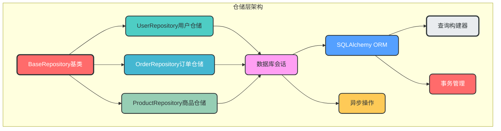
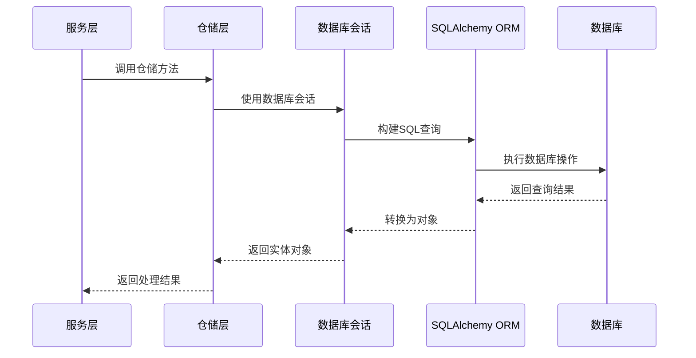

### 5. 仓储层设计（接口抽象）

**核心作用**：抽象数据访问层，负责领域对象的持久化和检索，实现数据访问与业务逻辑分离。

**设计理念**：
- **接口抽象**：通过接口定义数据访问契约，实现依赖倒置，便于测试和替换实现
- **多数据库支持**：支持多种数据库后端（SQLAlchemy, MongoDB等）
- **事务支持**：参与服务层的事务管理，确保数据一致性
- **查询构建器**：支持灵活的查询构建，满足复杂查询需求

**模块架构图**：


**数据流转图**：


**仓储层与服务层的关系**：
- 仓储层是服务层的依赖，服务层通过仓储层访问数据
- 仓储层只负责数据访问，不包含业务规则
- 仓储层的方法设计应该与业务需求紧密相关，而不是简单的CRUD操作

**关键实现**：
```python
# app/repositories/base.py
from abc import ABC, abstractmethod
from typing import TypeVar, Generic, List, Optional
from sqlalchemy.ext.asyncio import AsyncSession

T = TypeVar("T")

class BaseRepository(ABC, Generic[T]):
    """仓储层基类"""
    
    def __init__(self, session: AsyncSession):
        self.session = session
    
    @abstractmethod
    async def get_by_id(self, id: int) -> Optional[T]:
        """根据ID获取实体"""
        pass
    
    @abstractmethod
    async def get_all(self, skip: int = 0, limit: int = 100) -> List[T]:
        """获取所有实体"""
        pass
    
    @abstractmethod
    async def create(self, obj: T) -> T:
        """创建实体"""
        pass
    
    @abstractmethod
    async def update(self, obj: T, update_data: dict) -> T:
        """更新实体"""
        pass
    
    @abstractmethod
    async def delete(self, obj: T) -> None:
        """删除实体"""
        pass
```

**用户仓储示例**：
```python
# app/domains/user/repositories/user_repository.py
from sqlalchemy.ext.asyncio import AsyncSession
from sqlalchemy import select
from app.repositories.base import BaseRepository
from app.domains.user.models import User
from app.domains.user.schemas import UserCreate, UserUpdate

class UserRepository(BaseRepository[User]):
    """用户仓储"""
    
    def __init__(self, session: AsyncSession):
        super().__init__(session)
    
    async def get_by_id(self, id: int) -> Optional[User]:
        """根据ID获取用户"""
        stmt = select(User).where(User.id == id)
        result = await self.session.execute(stmt)
        return result.scalar_one_or_none()
    
    async def get_by_email(self, email: str) -> Optional[User]:
        """根据邮箱获取用户"""
        stmt = select(User).where(User.email == email)
        result = await self.session.execute(stmt)
        return result.scalar_one_or_none()
    
    async def get_all(self, skip: int = 0, limit: int = 100) -> List[User]:
        """获取所有用户"""
        stmt = select(User).offset(skip).limit(limit)
        result = await self.session.execute(stmt)
        return result.scalars().all()
    
    async def create(self, user_create: UserCreate) -> User:
        """创建用户"""
        user = User(**user_create.model_dump())
        self.session.add(user)
        await self.session.commit()
        await self.session.refresh(user)
        return user
    
    async def update(self, user: User, user_update: UserUpdate) -> User:
        """更新用户"""
        update_data = user_update.model_dump(exclude_unset=True)
        for field, value in update_data.items():
            setattr(user, field, value)
        
        self.session.add(user)
        await self.session.commit()
        await self.session.refresh(user)
        return user
    
    async def delete(self, user: User) -> None:
        """删除用户"""
        await self.session.delete(user)
        await self.session.commit()
    
    async def get_users_by_role(self, role: str, skip: int = 0, limit: int = 100) -> List[User]:
        """根据角色获取用户"""
        stmt = select(User).where(User.role == role).offset(skip).limit(limit)
        result = await self.session.execute(stmt)
        return result.scalars().all()
```