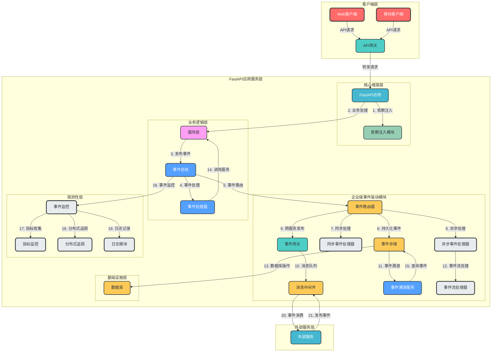
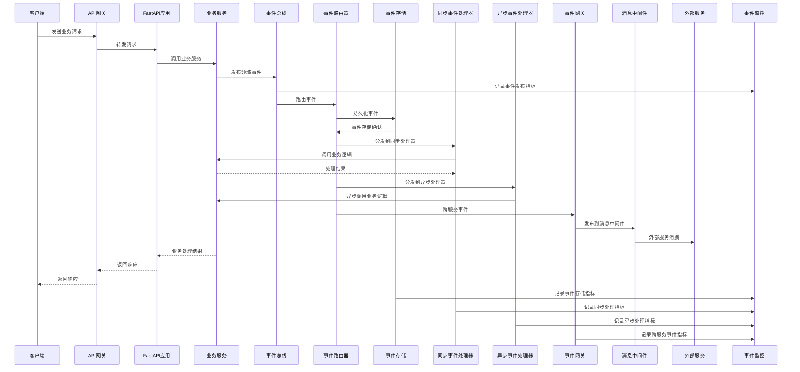
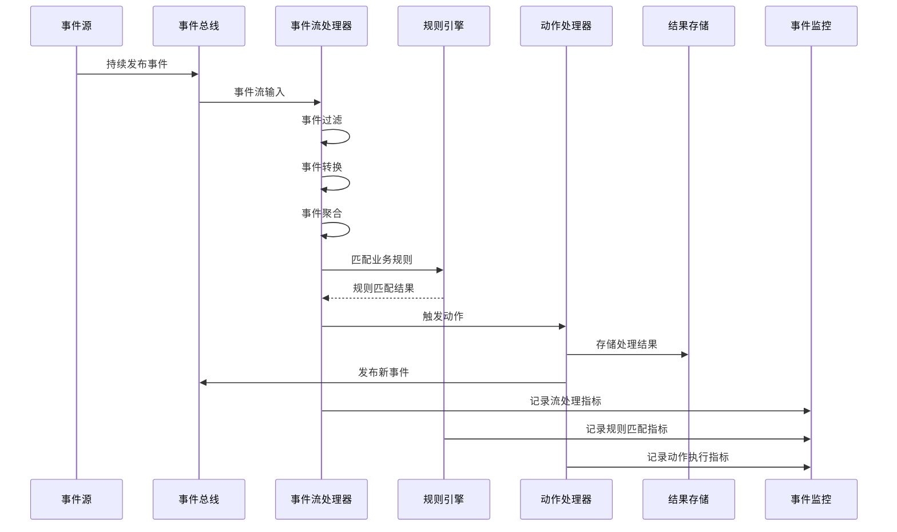
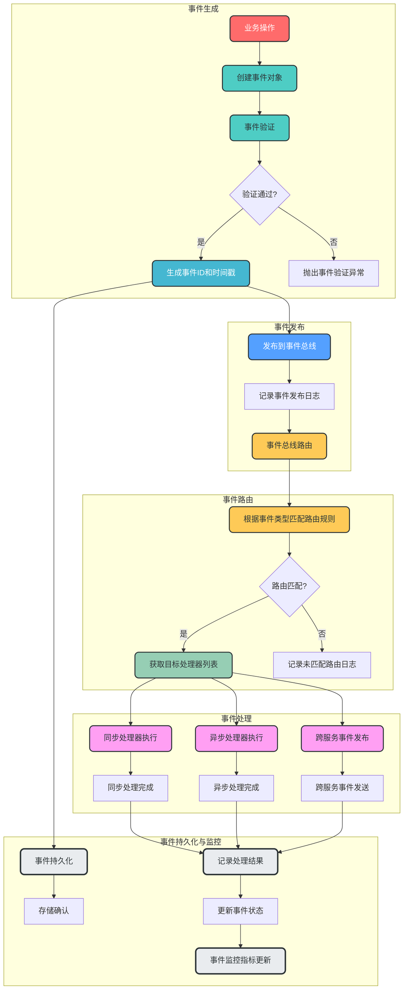
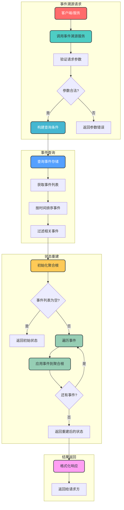
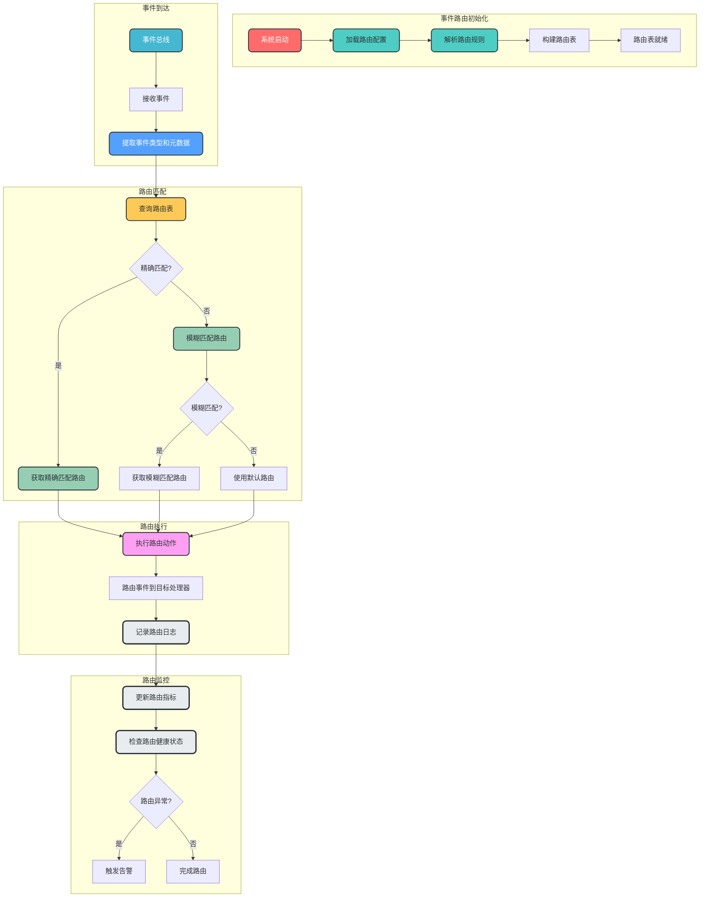
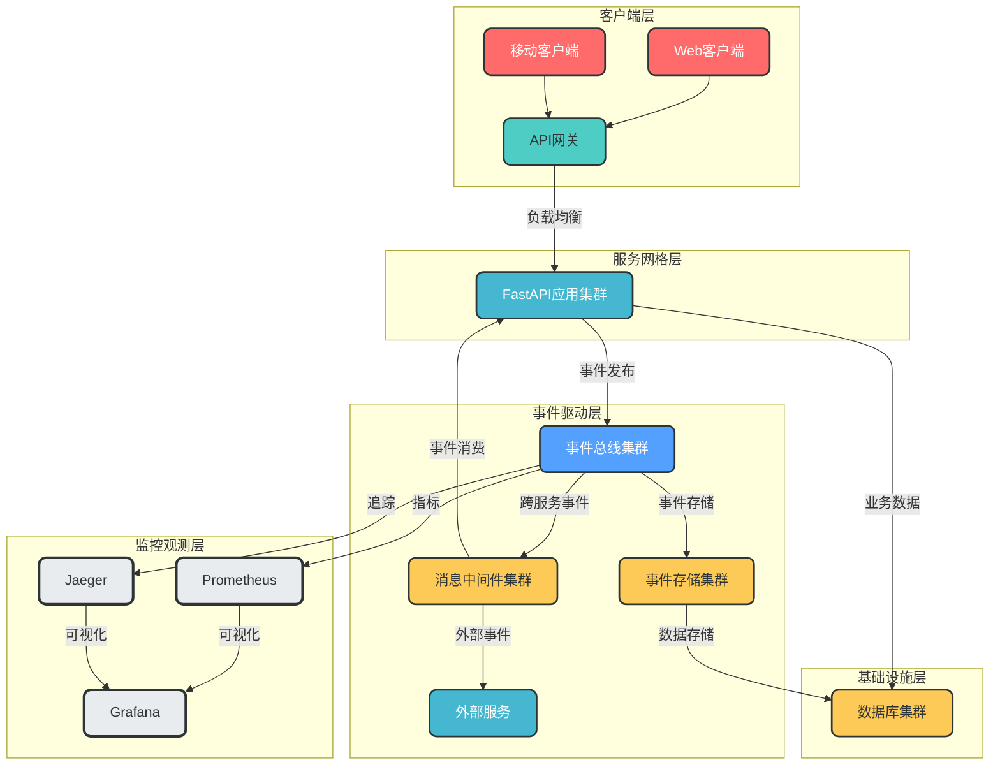

# 企业级事件驱动模块架构设计

## 一、概述

### 1. 设计背景

随着系统规模的扩大和微服务架构的普及，事件驱动架构(EDA)已成为构建高可扩展、松耦合系统的重要设计模式。本项目已实现基础的事件驱动模块，但在企业级应用场景下，需要更完善的事件管理、持久化、可靠性保障和监控观测能力。

### 2. 设计目标

- ✅ **高可靠性**：确保事件不丢失、不重复消费
- ✅ **高扩展性**：支持多种消息中间件和事件处理模式
- ✅ **松耦合**：实现组件间解耦，支持独立部署和扩展
- ✅ **可观测性**：提供事件全生命周期的监控、追踪和审计
- ✅ **企业级特性**：支持事件溯源、复杂事件处理、事件版本管理等

### 3. 核心概念

| 概念 | 说明 |
|------|------|
| **事件(Event)** | 系统中发生的具有业务意义的事实，包含事件ID、类型、时间戳和数据 |
| **事件总线(Event Bus)** | 负责事件的发布、路由和订阅管理 |
| **事件处理器(Event Handler)** | 订阅并处理特定类型事件的组件 |
| **事件存储(Event Store)** | 持久化事件，支持事件溯源和审计 |
| **事件网关(Event Gateway)** | 负责跨服务事件的路由和协议转换 |
| **事件流处理器(Event Stream Processor)** | 处理连续事件流，支持复杂事件处理 |

## 二、架构设计

### 1. 企业级事件驱动架构图



### 2. 核心组件说明

| 组件 | 职责 | 技术实现 |
|------|------|----------|
| **事件总线(Event Bus)** | 事件发布和订阅的核心入口，管理事件的生命周期 | 基于现有EventBus扩展，支持多种消息中间件 |
| **事件路由器(Event Router)** | 根据事件类型和路由规则，将事件路由到不同的处理器 | 支持基于规则的动态路由，可配置路由策略 |
| **事件存储(Event Store)** | 持久化事件数据，支持事件溯源和审计 | 可选用关系型数据库或专门的事件存储系统 |
| **事件处理器(Event Handler)** | 处理事件的业务逻辑，支持同步和异步处理 | 支持基于装饰器的事件订阅，自动注册处理器 |
| **事件网关(Event Gateway)** | 实现跨服务事件的路由和协议转换，支持多种消息中间件 | 支持Kafka、RabbitMQ、Redis等消息中间件 |
| **事件流处理器(Event Stream Processor)** | 处理连续事件流，支持复杂事件处理和实时分析 | 集成Apache Flink或Python流处理库 |
| **事件溯源服务(Event Trace Service)** | 提供事件溯源能力，支持根据事件重建系统状态 | 基于事件存储实现，支持查询和分析历史事件 |
| **事件监控(Event Monitoring)** | 监控事件全生命周期，提供指标、追踪和日志 | 集成OpenTelemetry，支持Prometheus和Jaeger |

## 三、动态执行流程

### 1. 事件发布与处理时序图



### 2. 事件流处理时序图



## 四、关键流程设计

### 1. 事件生命周期管理流程



### 2. 事件溯源流程



### 3. 事件路由规则处理流程



## 五、目录结构设计

### 1. 企业级事件驱动模块目录结构

基于现有项目架构，企业级事件驱动模块将扩展 `app/infrastructure/events/` 目录，添加更多企业级特性组件。以下是详细的目录结构设计：

```
app/
└── infrastructure/
    └── events/                    # 企业级事件驱动模块根目录
        ├── __init__.py            # 模块导出
        ├── core/                  # 核心组件
        │   ├── __init__.py
        │   ├── event.py           # 事件基类和类型定义
        │   ├── bus.py             # 事件总线核心实现
        │   └── exceptions.py      # 事件相关异常
        ├── store/                 # 事件存储组件
        │   ├── __init__.py
        │   ├── base.py            # 事件存储抽象接口
        │   ├── sql.py             # SQL数据库事件存储实现
        │   └── memory.py          # 内存事件存储实现（用于测试）
        ├── routing/               # 事件路由组件
        │   ├── __init__.py
        │   ├── router.py          # 事件路由器核心逻辑
        │   ├── rule.py            # 路由规则定义
        │   └── registry.py        # 路由注册管理
        ├── handlers/              # 事件处理器组件
        │   ├── __init__.py
        │   ├── base.py            # 事件处理器抽象接口
        │   ├── sync_handler.py    # 同步事件处理器
        │   ├── async_handler.py   # 异步事件处理器
        │   └── registry.py        # 处理器注册管理
        ├── gateway/               # 事件网关组件
        │   ├── __init__.py
        │   ├── base.py            # 事件网关抽象接口
        │   ├── kafka_gateway.py   # Kafka事件网关实现
        │   ├── rabbitmq_gateway.py # RabbitMQ事件网关实现
        │   └── redis_gateway.py   # Redis事件网关实现
        ├── stream/                # 事件流处理组件
        │   ├── __init__.py
        │   ├── processor.py       # 事件流处理器
        │   ├── filter.py          # 事件过滤器
        │   └── aggregator.py      # 事件聚合器
        ├── trace/                 # 事件溯源组件
        │   ├── __init__.py
        │   ├── service.py         # 事件溯源服务
        │   └── builder.py         # 聚合根构建器
        ├── monitoring/            # 事件监控组件
        │   ├── __init__.py
        │   ├── metrics.py         # 事件指标收集
        │   ├── tracing.py         # 事件分布式追踪
        │   └── logging.py         # 事件日志记录
        ├── version/               # 事件版本管理
        │   ├── __init__.py
        │   ├── manager.py         # 版本管理器
        │   └── converter.py       # 版本转换器
        └── examples/              # 示例代码
            ├── __init__.py
            ├── user_events.py     # 用户相关事件示例
            └── order_events.py    # 订单相关事件示例
```

### 2. 核心目录说明

| 目录 | 职责 | 核心组件 |
|------|------|----------|
| **core/** | 事件驱动核心组件 | 事件基类、事件类型、事件总线、异常定义 |
| **store/** | 事件持久化存储 | 支持SQL数据库和内存存储，提供事件溯源基础 |
| **routing/** | 事件路由管理 | 基于规则的事件路由，支持动态配置和路由策略 |
| **handlers/** | 事件处理逻辑 | 支持同步和异步事件处理，自动注册和管理处理器 |
| **gateway/** | 跨服务事件通信 | 支持多种消息中间件，实现事件的跨服务发布和订阅 |
| **stream/** | 事件流处理 | 支持复杂事件处理、事件过滤和聚合 |
| **trace/** | 事件溯源 | 提供事件溯源能力，支持根据事件重建系统状态 |
| **monitoring/** | 事件监控观测 | 集成指标、追踪和日志，提供事件全生命周期观测 |
| **version/** | 事件版本管理 | 支持事件版本控制和自动转换，确保向后兼容 |

### 3. 与现有项目的集成

- **依赖注入集成**：通过 `app/dependencies/` 提供事件驱动模块的依赖注入支持
- **配置集成**：在 `app/config/` 中添加事件驱动模块的配置选项
- **监控集成**：与 `app/observability/` 模块集成，提供统一的监控观测能力
- **领域事件集成**：在 `app/domains/` 中使用企业级事件驱动模块发布和处理领域事件

### 4. 模块化设计优势

- **高内聚低耦合**：各组件职责明确，通过接口通信，便于维护和扩展
- **可插拔设计**：支持替换不同的事件存储、网关和处理器实现
- **便于测试**：各组件独立，便于单元测试和集成测试
- **渐进式迁移**：支持现有事件驱动模块的渐进式替换
- **清晰的依赖关系**：目录结构反映了组件间的依赖关系，便于理解和维护

## 六、企业级特性设计

### 1. 事件可靠性保障

| 保障机制 | 实现方式 | 技术选型 |
|----------|----------|----------|
| **事件持久化** | 所有事件先持久化到事件存储，再进行处理 | 关系型数据库(PostgreSQL)或专用事件存储 |
| **至少一次投递** | 事件处理确认机制，失败自动重试 | 基于消息中间件的ACK机制 |
| **幂等性处理** | 事件处理器实现幂等性，防止重复处理 | 基于事件ID的去重机制 |
| **事务性事件发布** | 业务操作与事件发布在同一事务中 | 数据库事务或分布式事务 |
| **死信队列** | 处理失败的事件进入死信队列，支持手动重试 | 消息中间件死信队列机制 |

### 2. 事件版本管理

```mermaid
flowchart TD
    subgraph 事件版本定义
        A[事件设计] --> B[定义事件版本号]
        B --> C[版本号规则: 主版本.次版本]
        C --> D[主版本变化: 破坏性变更]
        C --> E[次版本变化: 非破坏性变更]
    end
    
    subgraph 事件序列化
        F[事件对象] --> G[基于版本选择序列化器]
        G --> H[主版本兼容处理]
        H --> I[次版本兼容处理]
        I --> J[序列化事件数据]
    end
    
    subgraph 事件反序列化
        K[收到事件数据] --> L[解析事件版本]
        L --> M{版本匹配?}
        M -->|是| N[使用对应版本反序列化器]
        M -->|否| O[版本兼容转换]
        O --> P{转换成功?}
        P -->|是| N
        P -->|否| Q[触发版本不兼容告警]
        N --> R[反序列化为事件对象]
    end
    
    subgraph 版本演进
        S[业务需求变更] --> T[评估事件变更影响]
        T --> U{破坏性变更?}
        U -->|是| V[升级主版本]
        U -->|否| W[升级次版本]
        V --> X[更新事件定义]
        W --> X
        X --> Y[更新序列化/反序列化逻辑]
        Y --> Z[部署新版本]
    end
    
    style A fill:#FF6B6B,stroke:#2D3436,stroke-width:2px,color:white,rx:8,ry:8
    style B fill:#4ECDC4,stroke:#2D3436,stroke-width:2px,color:#2D3436,rx:8,ry:8
    style F fill:#45B7D1,stroke:#2D3436,stroke-width:2px,color:white,rx:8,ry:8
    style K fill:#54A0FF,stroke:#2D3436,stroke-width:2px,color:white,rx:8,ry:8
    style S fill:#FECA57,stroke:#2D3436,stroke-width:2px,color:#2D3436,rx:8,ry:8
```



### 3. 事件监控与观测

| 监控维度 | 关键指标 | 实现方式 |
|----------|----------|----------|
| **事件发布** | 发布事件数、发布成功率、发布延迟 | 基于计数器和直方图指标 |
| **事件处理** | 处理事件数、处理成功率、处理延迟、重试次数 | 基于计数器、直方图和仪表盘 |
| **事件存储** | 存储事件数、存储延迟、存储成功率 | 基于计数器和直方图指标 |
| **事件路由** | 路由匹配率、路由延迟、路由错误数 | 基于计数器和直方图指标 |
| **系统健康** | 事件总线状态、消息中间件连接状态、处理器负载 | 基于健康检查和状态指标 |
| **分布式追踪** | 事件链路追踪、跨服务事件追踪 | 集成OpenTelemetry和Jaeger |

## 六、技术选型与集成

### 1. 核心技术栈

| 技术/框架 | 版本 | 用途 |
|-----------|------|------|
| Python | >=3.10 | 开发语言 |
| FastAPI | >=0.125.0 | Web框架 |
| Pydantic | >=2.0.0 | 数据验证和序列化 |
| SQLAlchemy | >=2.0.0 | ORM框架，支持事件存储 |
| aiokafka | >=0.8.0 | Kafka异步客户端 |
| aio-pika | >=9.4.0 | RabbitMQ异步客户端 |
| redis-asyncio | >=2.0.1 | Redis异步客户端 |
| OpenTelemetry | >=1.24.0 | 分布式追踪和指标收集 |
| Prometheus | >=2.40.0 | 监控系统 |
| Jaeger | >=1.40.0 | 分布式追踪系统 |

### 2. 消息中间件适配

| 中间件 | 优势 | 适用场景 | 集成方式 |
|--------|------|----------|----------|
| **Kafka** | 高吞吐量、持久化、分布式 | 大规模事件流、实时数据处理 | 基于aiokafka集成 |
| **RabbitMQ** | 可靠消息传递、灵活路由、支持多种协议 | 异步任务处理、事件通知 | 基于aio-pika集成 |
| **Redis** | 低延迟、简单易用、支持多种数据结构 | 高频率事件、缓存事件 | 基于redis-asyncio集成 |
| **NATS** | 高性能、轻量级、分布式 | 微服务通信、实时消息 | 基于nats-py集成 |

## 七、部署与运维

### 1. 部署架构



### 2. 运维最佳实践

- **事件总线监控**：定期检查事件总线状态、消息队列连接状态和处理器负载
- **事件存储管理**：定期清理过期事件，优化存储性能
- **事件处理器伸缩**：根据事件处理负载，自动调整处理器数量
- **事件流监控**：实时监控事件流量，设置异常告警阈值
- **定期演练**：定期进行事件恢复演练，确保事件可靠性机制有效
- **文档更新**：及时更新事件文档，包括事件类型、数据结构和版本信息

## 八、迁移与升级策略

### 1. 现有事件驱动模块迁移

| 阶段 | 任务 | 风险 | 缓解措施 |
|------|------|------|----------|
| **评估阶段** | 分析现有事件使用情况，识别核心事件 | 事件依赖关系复杂 | 绘制事件依赖图，识别关键路径 |
| **设计阶段** | 设计企业级事件模型，映射现有事件 | 事件模型变更影响大 | 采用渐进式迁移策略，支持向后兼容 |
| **实现阶段** | 开发新的事件驱动模块，保留现有API | 开发工作量大 | 采用模块化设计，逐步替换现有组件 |
| **测试阶段** | 进行单元测试、集成测试和性能测试 | 测试覆盖不足 | 编写全面的测试用例，包括边界情况 |
| **部署阶段** | 灰度部署新模块，逐步替换旧模块 | 部署风险高 | 采用蓝绿部署，设置回滚机制 |
| **监控阶段** | 监控新模块运行状态，收集反馈 | 性能问题 | 设置监控指标和告警阈值，及时调整 |

### 2. 版本升级策略

- **向后兼容**：新版本事件驱动模块必须兼容旧版本事件格式
- **渐进式升级**：支持混合部署，允许部分服务使用旧版本，部分使用新版本
- **版本标记**：所有事件必须包含版本信息，便于版本管理和兼容处理
- **自动转换**：支持不同版本事件之间的自动转换
- **文档更新**：及时更新升级指南和迁移文档

## 九、总结

### 1. 架构优势

- ✅ **高可靠性**：通过事件持久化、至少一次投递和幂等性处理，确保事件可靠传递和处理
- ✅ **高扩展性**：支持多种消息中间件和事件处理模式，可根据业务需求灵活扩展
- ✅ **松耦合**：组件间通过事件通信，实现解耦，支持独立部署和扩展
- ✅ **可观测性**：提供事件全生命周期的监控、追踪和审计，便于问题定位和性能优化
- ✅ **企业级特性**：支持事件溯源、复杂事件处理、事件版本管理等企业级需求

### 2. 应用场景

- **微服务通信**：实现微服务间的松耦合通信
- **实时数据处理**：处理大规模事件流，支持实时分析和决策
- **异步任务处理**：将耗时任务异步化，提高系统响应速度
- **事件溯源**：实现系统状态的可追溯，支持审计和故障恢复
- **跨系统集成**：实现不同系统间的事件驱动集成

### 3. 未来展望

- **AI辅助事件处理**：集成AI技术，实现智能事件路由、异常检测和预测
- **Serverless事件处理**：支持Serverless架构，根据事件负载自动伸缩
- **多租户事件隔离**：实现多租户场景下的事件隔离和安全管理
- **边缘事件处理**：支持边缘计算场景下的事件处理，降低延迟

通过引入企业级事件驱动模块，本项目将具备更强的可扩展性、可靠性和可观测性，能够更好地支持大规模微服务架构和实时数据处理需求，为企业级应用提供坚实的事件驱动基础。