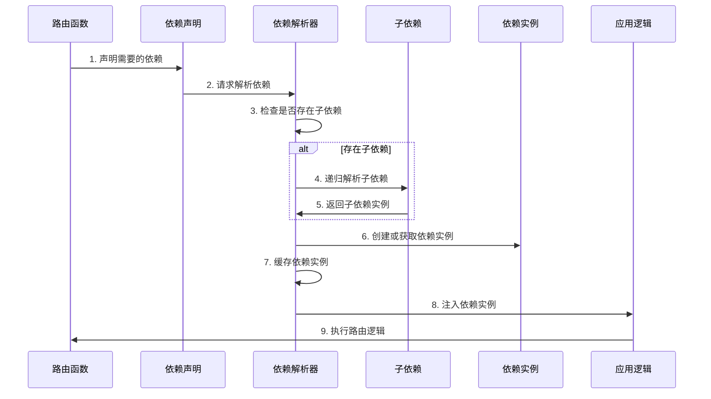

### 2. 依赖注入模块

**核心作用**：封装通用依赖，实现依赖注入，提高代码复用性和可测试性

**设计特点**：
- 基于FastAPI的依赖注入系统
- 支持作用域管理（请求级、应用级）
- 依赖自动注入
- 支持依赖替换，便于测试

**模块架构图**：

```mermaid
graph LR
    A[路由函数] -->|1. 声明依赖| B[依赖声明]
    B -->|2. 请求解析| C[依赖解析器]
    C -->|3. 检查子依赖| D{存在子依赖?}
    D -->|是| E[递归解析子依赖]
    D -->|否| F[创建依赖实例]
    E -->|4. 子依赖解析完成| F
    F -->|5. 缓存实例| G[缓存依赖实例]
    G -->|6. 注入依赖| H[使用依赖]
    
    style A fill:#FF6B6B,stroke:#2D3436,stroke-width:3px,color:white,rx:8,ry:8
    style B fill:#4ECDC4,stroke:#2D3436,stroke-width:2px,color:#2D3436,rx:8,ry:8
    style C fill:#45B7D1,stroke:#2D3436,stroke-width:2px,color:white,rx:8,ry:8
    style D fill:#96CEB4,stroke:#2D3436,stroke-width:2px,color:#2D3436,rx:8,ry:8
    style E fill:#FF9FF3,stroke:#2D3436,stroke-width:2px,color:#2D3436,rx:8,ry:8
    style F fill:#54A0FF,stroke:#2D3436,stroke-width:2px,color:white,rx:8,ry:8
    style G fill:#FECA57,stroke:#2D3436,stroke-width:2px,color:#2D3436,rx:8,ry:8
    style H fill:#E9ECEF,stroke:#2D3436,stroke-width:3px,color:#2D3436,rx:8,ry:8
```


**数据流转图**：


**关键实现**：
```python
# app/dependencies/db.py
from sqlalchemy.ext.asyncio import AsyncSession
from app.database.session import async_session_maker

async def get_db_session() -> AsyncSession:
    """获取数据库会话"""
    async with async_session_maker() as session:
        try:
            yield session
            await session.commit()
        except Exception:
            await session.rollback()
            raise
```