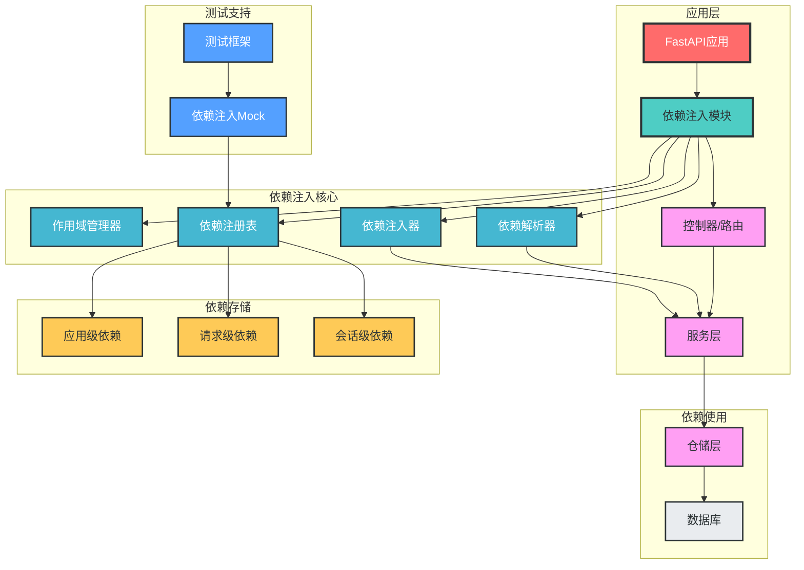
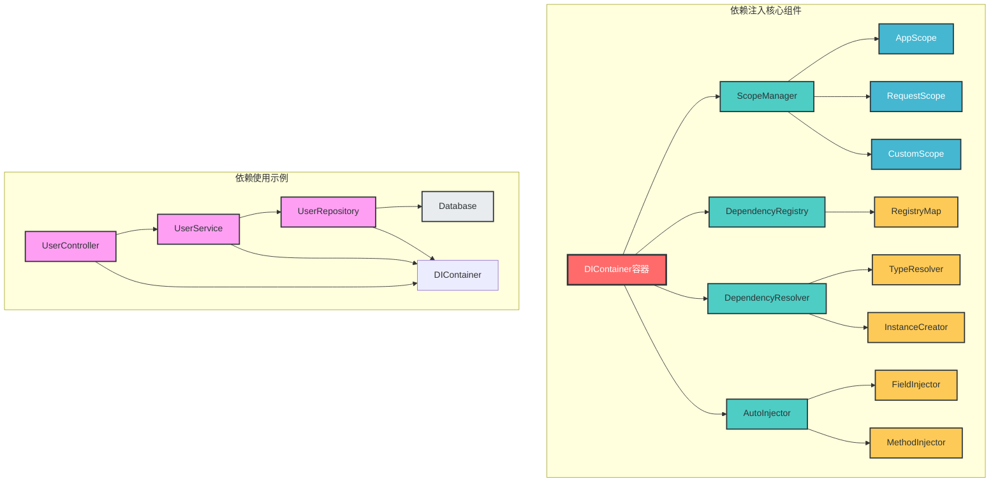

# 依赖注入模块设计

## 一、设计概述

本设计实现了一套**生产级的依赖注入框架**，基于FastAPI的依赖注入系统扩展，提供了更强大的依赖管理能力，包括作用域管理、自动注入、依赖替换等功能，旨在提高代码的复用性、可测试性和可维护性。

### 设计目标

1. **基于FastAPI**：无缝集成FastAPI的依赖注入系统
2. **作用域管理**：支持多种作用域（请求级、应用级、会话级）
3. **自动注入**：支持类成员的自动注入，减少样板代码
4. **依赖替换**：支持测试环境下的依赖替换，便于单元测试
5. **类型安全**：基于类型注解的依赖解析，确保类型安全
6. **可扩展性**：支持自定义作用域和注入策略
7. **易用性**：提供简洁的API，降低学习和使用成本

### 设计原则

- ✅ **依赖倒置**：高层模块不依赖低层模块，两者都依赖抽象
- ✅ **单一职责**：每个组件只负责一个明确的功能
- ✅ **接口抽象**：通过接口定义依赖契约，实现模块解耦
- ✅ **类型安全**：使用类型注解确保依赖注入的类型正确性
- ✅ **可测试性**：设计便于单元测试和集成测试的API
- ✅ **易用性**：提供简洁直观的API，降低使用门槛
- ✅ **性能优先**：优化依赖解析和注入性能

## 二、架构设计

### 1. 整体架构图



### 2. 核心组件关系图



## 三、核心组件设计

### 1. 作用域管理

```python
# app/dependencies/scope.py
from enum import Enum, auto
from typing import Any, Dict, Generator, Optional


class ScopeType(Enum):
    """作用域类型枚举"""
    APP = auto()          # 应用级作用域，全局唯一实例
    REQUEST = auto()      # 请求级作用域，每个HTTP请求创建一个实例
    SESSION = auto()      # 会话级作用域，每个用户会话创建一个实例
    TRANSIENT = auto()    # 瞬时作用域，每次注入创建新实例


class Scope:
    """作用域基类"""
    
    def __init__(self, scope_type: ScopeType):
        self.scope_type = scope_type
        self._instances: Dict[type, Any] = {}
    
    def get_instance(self, dependency_type: type) -> Optional[Any]:
        """获取作用域内的实例"""
        return self._instances.get(dependency_type)
    
    def set_instance(self, dependency_type: type, instance: Any) -> None:
        """设置作用域内的实例"""
        self._instances[dependency_type] = instance
    
    def clear(self) -> None:
        """清除作用域内的所有实例"""
        self._instances.clear()


class ScopeManager:
    """作用域管理器"""
    
    def __init__(self):
        self._scopes: Dict[ScopeType, Scope] = {
            ScopeType.APP: Scope(ScopeType.APP),
        }
        self._current_request_scope: Optional[Scope] = None
        self._current_session_scope: Optional[Scope] = None
    
    def get_scope(self, scope_type: ScopeType) -> Scope:
        """获取指定类型的作用域"""
        if scope_type == ScopeType.REQUEST:
            if not self._current_request_scope:
                self._current_request_scope = Scope(ScopeType.REQUEST)
            return self._current_request_scope
        elif scope_type == ScopeType.SESSION:
            if not self._current_session_scope:
                self._current_session_scope = Scope(ScopeType.SESSION)
            return self._current_session_scope
        return self._scopes[scope_type]
    
    def enter_request_scope(self) -> Generator[Scope, None, None]:
        """进入请求作用域上下文"""
        self._current_request_scope = Scope(ScopeType.REQUEST)
        try:
            yield self._current_request_scope
        finally:
            self._current_request_scope.clear()
            self._current_request_scope = None
    
    def enter_session_scope(self, session_id: str) -> Generator[Scope, None, None]:
        """进入会话作用域上下文"""
        # 实际实现中可以基于session_id管理不同的会话作用域
        self._current_session_scope = Scope(ScopeType.SESSION)
        try:
            yield self._current_session_scope
        finally:
            self._current_session_scope.clear()
            self._current_session_scope = None
```

### 2. 依赖注册表

```python
# app/dependencies/registry.py
from typing import Any, Callable, Dict, Optional, Type, Union
from .scope import ScopeType


class DependencyRegistry:
    """依赖注册表"""
    
    def __init__(self):
        self._registrations: Dict[Type, Dict] = {}
    
    def register(
        self,
        dependency_type: Type,
        implementation: Optional[Union[Type, Callable]] = None,
        scope: ScopeType = ScopeType.TRANSIENT,
        factory: Optional[Callable] = None,
    ) -> None:
        """注册依赖"""
        # 如果未指定实现，则使用依赖类型本身
        if implementation is None:
            implementation = dependency_type
        
        self._registrations[dependency_type] = {
            "implementation": implementation,
            "scope": scope,
            "factory": factory,
        }
    
    def register_singleton(
        self,
        dependency_type: Type,
        implementation: Optional[Union[Type, Callable]] = None,
        factory: Optional[Callable] = None,
    ) -> None:
        """注册单例依赖（应用级作用域）"""
        self.register(dependency_type, implementation, ScopeType.APP, factory)
    
    def register_request_scoped(
        self,
        dependency_type: Type,
        implementation: Optional[Union[Type, Callable]] = None,
        factory: Optional[Callable] = None,
    ) -> None:
        """注册请求级作用域依赖"""
        self.register(dependency_type, implementation, ScopeType.REQUEST, factory)
    
    def register_transient(
        self,
        dependency_type: Type,
        implementation: Optional[Union[Type, Callable]] = None,
        factory: Optional[Callable] = None,
    ) -> None:
        """注册瞬时依赖"""
        self.register(dependency_type, implementation, ScopeType.TRANSIENT, factory)
    
    def get_registration(self, dependency_type: Type) -> Optional[Dict]:
        """获取依赖注册信息"""
        return self._registrations.get(dependency_type)
    
    def unregister(self, dependency_type: Type) -> None:
        """注销依赖"""
        if dependency_type in self._registrations:
            del self._registrations[dependency_type]
    
    def clear(self) -> None:
        """清除所有注册"""
        self._registrations.clear()
```

### 3. 依赖解析器

```python
# app/dependencies/resolver.py
from typing import Any, Dict, Optional, Type, get_args, get_origin
from fastapi import Depends, Request
from .registry import DependencyRegistry
from .scope import ScopeManager, ScopeType


class DependencyResolver:
    """依赖解析器"""
    
    def __init__(self, registry: DependencyRegistry, scope_manager: ScopeManager):
        self._registry = registry
        self._scope_manager = scope_manager
    
    def resolve(self, dependency_type: Type) -> Any:
        """解析依赖"""
        registration = self._registry.get_registration(dependency_type)
        if not registration:
            # 如果没有注册，则尝试直接实例化（用于具体类）
            return self._create_instance(dependency_type)
        
        implementation = registration["implementation"]
        scope = registration["scope"]
        factory = registration["factory"]
        
        # 检查作用域缓存
        if scope != ScopeType.TRANSIENT:
            scope_instance = self._scope_manager.get_scope(scope)
            cached_instance = scope_instance.get_instance(dependency_type)
            if cached_instance:
                return cached_instance
        
        # 创建实例
        if factory:
            # 使用工厂函数创建实例
            instance = factory()
        else:
            # 直接实例化
            instance = self._create_instance(implementation)
        
        # 存入作用域缓存
        if scope != ScopeType.TRANSIENT:
            scope_instance = self._scope_manager.get_scope(scope)
            scope_instance.set_instance(dependency_type, instance)
        
        return instance
    
    def _create_instance(self, cls: Type) -> Any:
        """创建类实例，自动解析构造函数依赖"""
        from inspect import signature
        
        sig = signature(cls.__init__)
        params = sig.parameters
        
        # 跳过self参数
        if "self" in params:
            params = {k: v for k, v in params.items() if k != "self"}
        
        if not params:
            # 无参构造函数
            return cls()
        
        # 解析构造函数依赖
        kwargs = {}
        for name, param in params.items():
            if param.annotation == param.empty:
                # 没有类型注解，跳过（或抛出异常）
                continue
            
            # 解析依赖
            dependency = self.resolve(param.annotation)
            kwargs[name] = dependency
        
        return cls(**kwargs)
    
    def resolve_all(self, *dependency_types: Type) -> Dict[Type, Any]:
        """解析多个依赖"""
        return {dep_type: self.resolve(dep_type) for dep_type in dependency_types}
    
    def create_fastapi_dependency(self, dependency_type: Type) -> Any:
        """创建FastAPI依赖注入函数"""
        def _dependency(request: Request):
            return self.resolve(dependency_type)
        return Depends(_dependency)
```

### 4. 自动注入器

```python
# app/dependencies/autoinject.py
from typing import Any, List, Type, get_type_hints
from .resolver import DependencyResolver


class AutoInjector:
    """自动注入器"""
    
    def __init__(self, resolver: DependencyResolver):
        self._resolver = resolver
    
    def inject(self, instance: Any) -> Any:
        """自动注入对象的成员变量"""
        if not instance:
            return instance
        
        # 获取类型注解
        type_hints = get_type_hints(instance.__class__)
        
        # 注入成员变量
        for name, dependency_type in type_hints.items():
            if hasattr(instance, name):
                continue  # 如果已经有值，则跳过
            
            # 解析依赖
            dependency = self._resolver.resolve(dependency_type)
            setattr(instance, name, dependency)
        
        return instance
    
    def inject_into_method(self, instance: Any, method_name: str, *args, **kwargs) -> Any:
        """自动注入方法参数"""
        method = getattr(instance, method_name)
        if not callable(method):
            raise ValueError(f"{method_name} is not a callable method")
        
        from inspect import signature
        sig = signature(method)
        params = sig.parameters
        
        # 准备方法参数
        method_kwargs = {**kwargs}
        
        # 跳过self和已提供的参数
        for name, param in params.items():
            if name == "self" or name in method_kwargs:
                continue
            
            if param.annotation == param.empty:
                continue
            
            # 解析依赖
            dependency = self._resolver.resolve(param.annotation)
            method_kwargs[name] = dependency
        
        return method(*args, **method_kwargs)
    
    def inject_into_class(self, cls: Type) -> Type:
        """装饰器：自动注入类的成员变量"""
        original_init = cls.__init__
        
        def new_init(self, *args, **kwargs):
            # 调用原始构造函数
            original_init(self, *args, **kwargs)
            # 自动注入成员变量
            from .container import di_container
            di_container.inject(self)
        
        cls.__init__ = new_init
        return cls
```

### 5. 依赖注入容器

```python
# app/dependencies/container.py
from typing import Any, Optional, Type
from .registry import DependencyRegistry
from .resolver import DependencyResolver
from .autoinject import AutoInjector
from .scope import ScopeManager, ScopeType


class DIContainer:
    """依赖注入容器"""
    
    def __init__(self):
        self._registry = DependencyRegistry()
        self._scope_manager = ScopeManager()
        self._resolver = DependencyResolver(self._registry, self._scope_manager)
        self._auto_injector = AutoInjector(self._resolver)
    
    # 注册方法
    def register(
        self,
        dependency_type: Type,
        implementation: Optional[Type] = None,
        scope: ScopeType = ScopeType.TRANSIENT,
        factory: Optional[Any] = None,
    ) -> None:
        """注册依赖"""
        self._registry.register(dependency_type, implementation, scope, factory)
    
    def register_singleton(
        self,
        dependency_type: Type,
        implementation: Optional[Type] = None,
        factory: Optional[Any] = None,
    ) -> None:
        """注册单例依赖"""
        self._registry.register_singleton(dependency_type, implementation, factory)
    
    def register_request_scoped(
        self,
        dependency_type: Type,
        implementation: Optional[Type] = None,
        factory: Optional[Any] = None,
    ) -> None:
        """注册请求级依赖"""
        self._registry.register_request_scoped(dependency_type, implementation, factory)
    
    def register_transient(
        self,
        dependency_type: Type,
        implementation: Optional[Type] = None,
        factory: Optional[Any] = None,
    ) -> None:
        """注册瞬时依赖"""
        self._registry.register_transient(dependency_type, implementation, factory)
    
    # 解析方法
    def resolve(self, dependency_type: Type) -> Any:
        """解析依赖"""
        return self._resolver.resolve(dependency_type)
    
    def resolve_all(self, *dependency_types: Type) -> Any:
        """解析多个依赖"""
        return self._resolver.resolve_all(*dependency_types)
    
    # 自动注入方法
    def inject(self, instance: Any) -> Any:
        """自动注入对象成员"""
        return self._auto_injector.inject(instance)
    
    def inject_into_method(self, instance: Any, method_name: str, *args, **kwargs) -> Any:
        """自动注入方法参数"""
        return self._auto_injector.inject_into_method(instance, method_name, *args, **kwargs)
    
    def auto_inject(self, cls: Type) -> Type:
        """装饰器：自动注入类成员"""
        return self._auto_injector.inject_into_class(cls)
    
    # FastAPI集成方法
    def fastapi_dependency(self, dependency_type: Type) -> Any:
        """创建FastAPI依赖"""
        return self._resolver.create_fastapi_dependency(dependency_type)
    
    # 作用域管理方法
    def enter_request_scope(self):
        """进入请求作用域"""
        return self._scope_manager.enter_request_scope()
    
    def enter_session_scope(self, session_id: str):
        """进入会话作用域"""
        return self._scope_manager.enter_session_scope(session_id)
    
    # 测试支持方法
    def replace_dependency(self, dependency_type: Type, mock_implementation: Any) -> None:
        """替换依赖（用于测试）"""
        self._registry.register(
            dependency_type,
            implementation=lambda: mock_implementation,
            scope=ScopeType.APP,
            factory=lambda: mock_implementation
        )
    
    def clear(self) -> None:
        """清除所有注册和缓存"""
        self._registry.clear()
        # 清除作用域缓存
        for scope_type in ScopeType:
            if scope_type != ScopeType.APP:
                self._scope_manager.get_scope(scope_type).clear()


# 全局依赖注入容器
di_container = DIContainer()
```

## 四、使用示例

### 1. 基本使用

```python
# 1. 定义依赖接口和实现
from abc import ABC, abstractmethod

class IDatabase(ABC):
    @abstractmethod
    def connect(self):
        pass

class MySQLDatabase(IDatabase):
    def connect(self):
        return "MySQL connected"

# 2. 注册依赖
from app.dependencies.container import di_container
from app.dependencies.scope import ScopeType

di_container.register_singleton(IDatabase, MySQLDatabase)

# 3. 解析依赖
db = di_container.resolve(IDatabase)
print(db.connect())  # 输出: MySQL connected
```

### 2. 自动注入

```python
from app.dependencies.container import di_container
from app.dependencies.scope import ScopeType

# 使用装饰器自动注入
@di_container.auto_inject
class UserService:
    # 自动注入IDatabase依赖
    database: IDatabase
    
    def get_users(self):
        self.database.connect()
        return ["user1", "user2"]

# 创建实例，自动注入依赖
user_service = UserService()
print(user_service.get_users())  # 输出: ["user1", "user2"]
```

### 3. FastAPI集成

```python
from fastapi import APIRouter, Depends
from app.dependencies.container import di_container
from app.domains.user.schemas import UserCreate, UserResponse
from app.domains.user.services.user_service import UserService

router = APIRouter()

@router.post("/", response_model=UserResponse)
def create_user(
    user_in: UserCreate,
    user_service: UserService = di_container.fastapi_dependency(UserService)
):
    """创建用户"""
    return user_service.create_user(user_in)

@router.get("/{user_id}", response_model=UserResponse)
def get_user(
    user_id: int,
    user_service: UserService = di_container.fastapi_dependency(UserService)
):
    """获取用户"""
    return user_service.get_user(user_id)
```

### 4. 测试环境下的依赖替换

```python
import pytest
from app.dependencies.container import di_container
from app.domains.user.services.user_service import UserService
from app.domains.user.repositories.user_repository import IUserRepository

class MockUserRepository(IUserRepository):
    def get(self, user_id: int):
        return {"id": user_id, "username": "test_user"}
    
    # 实现其他方法...

def test_user_service():
    # 替换依赖
    di_container.replace_dependency(IUserRepository, MockUserRepository())
    
    # 获取服务实例
    user_service = di_container.resolve(UserService)
    
    # 执行测试
    user = user_service.get_user(1)
    assert user["username"] == "test_user"
    
    # 清理
    di_container.clear()
```

### 5. 自定义作用域

```python
from app.dependencies.container import di_container
from app.dependencies.scope import ScopeType

# 注册会话级依赖
di_container.register(
    ISessionService,
    SessionService,
    scope=ScopeType.SESSION
)

# 使用会话作用域
with di_container.enter_session_scope("session_123"):
    session_service = di_container.resolve(ISessionService)
    # 会话内的多次解析将返回相同实例
    session_service2 = di_container.resolve(ISessionService)
    assert session_service is session_service2
```

## 五、目录结构设计

### 1. 推荐目录结构

```
fastapi_enterprise/
├── app/                     # 应用核心目录
│   ├── __init__.py
│   ├── main.py              # 应用入口
│   ├── domains/             # DDD领域模块（按业务域组织）
│   ├── infrastructure/      # 基础设施层（按技术功能组织）
│   ├── dependencies/        # 依赖注入模块
│   │   ├── __init__.py      # 依赖注入模块入口
│   │   ├── container.py     # 依赖注入容器核心实现
│   │   ├── scope.py         # 作用域管理实现
│   │   ├── registry.py      # 依赖注册表实现
│   │   ├── resolver.py      # 依赖解析器实现
│   │   ├── autoinject.py    # 自动注入器实现
│   │   ├── database.py      # 数据库依赖注入
│   │   ├── repository.py    # 仓储层依赖注入
│   │   ├── service.py       # 服务层依赖注入
│   │   └── config.py        # 配置相关依赖注入
│   ├── config/              # 配置模块
│   └── ...                  # 其他模块
├── .env                     # 开发环境变量
├── .env.prod                # 生产环境变量
└── .env.test                # 测试环境变量
```

### 2. 关键目录说明

- **dependencies/**：依赖注入模块主目录，集中管理所有依赖注入逻辑
  - **dependencies/container.py**：依赖注入容器核心实现，提供统一的依赖管理接口
  - **dependencies/scope.py**：作用域管理实现，支持多种作用域类型
  - **dependencies/registry.py**：依赖注册表，管理依赖的注册和查找
  - **dependencies/resolver.py**：依赖解析器，负责依赖的自动解析和实例创建
  - **dependencies/autoinject.py**：自动注入器，实现类成员和方法参数的自动注入
  - **dependencies/[layer].py**：各层的依赖注入配置，如database.py、repository.py等

### 3. 设计优势

- **集中管理**：所有依赖注入逻辑集中在dependencies目录下，便于统一维护
- **模块化设计**：依赖注入模块内部按功能模块化，职责清晰
- **易于扩展**：新增依赖类型或注入策略时，只需在对应子模块中扩展
- **清晰的依赖关系**：各层依赖注入配置分离，便于理解和维护
- **测试友好**：依赖注入设计便于单元测试和集成测试

## 六、最佳实践

### 1. 依赖设计最佳实践

- **面向接口编程**：依赖接口而非具体实现
- **明确作用域**：为每个依赖选择合适的作用域
- **避免循环依赖**：设计时避免循环依赖
- **最小依赖原则**：每个类只依赖必要的组件
- **类型注解**：为所有依赖添加类型注解

### 2. 注册和解析最佳实践

- **集中注册**：在应用启动时集中注册所有依赖
- **分层注册**：按模块或层组织依赖注册
- **优先使用装饰器**：对于类成员注入，优先使用`@auto_inject`装饰器
- **避免过度依赖自动注入**：对于关键依赖，显式注入更清晰

### 3. 测试最佳实践

- **使用依赖替换**：测试时使用`replace_dependency`替换真实依赖
- **清理依赖容器**：测试完成后清理依赖容器，避免测试间相互影响
- **测试边界情况**：测试依赖未注册、循环依赖等边界情况
- **使用工厂函数**：对于复杂依赖，使用工厂函数创建测试实例

### 4. 性能最佳实践

- **合理使用作用域**：频繁使用的依赖使用应用级作用域
- **避免不必要的注入**：只注入必要的依赖
- **预解析依赖**：在应用启动时预解析应用级依赖
- **缓存解析结果**：利用作用域机制缓存解析结果

## 七、扩展建议

### 1. 支持更多作用域类型

- **会话级作用域**：基于用户会话的作用域管理
- **事务级作用域**：基于数据库事务的作用域
- **自定义作用域**：支持用户自定义作用域类型

### 2. 增强自动注入能力

- **方法参数自动注入**：支持方法调用时的自动参数注入
- **属性注入**：支持通过属性访问器的注入
- **条件注入**：支持基于条件的选择性注入

### 3. 高级特性支持

- **依赖链可视化**：提供依赖链的可视化工具
- **依赖注入监控**：监控依赖解析和注入性能
- **热重载支持**：支持运行时的依赖重新注册和重载
- **异步依赖**：支持异步依赖的解析和注入

### 4. 集成更多框架

- **Pytest集成**：提供Pytest插件，简化测试
- **Celery集成**：支持Celery任务中的依赖注入
- **FastAPI扩展**：提供更多FastAPI集成功能

## 八、总结

本设计实现了一套功能强大的依赖注入框架，基于FastAPI的依赖注入系统扩展，提供了作用域管理、自动注入、依赖替换等高级功能。该框架具有以下核心优势：

1. **无缝集成FastAPI**：与FastAPI的依赖注入系统完美结合
2. **强大的作用域管理**：支持多种作用域，满足不同场景需求
3. **自动注入能力**：减少样板代码，提高开发效率
4. **优秀的测试支持**：便于单元测试和集成测试
5. **类型安全**：基于类型注解的依赖解析，确保类型正确
6. **简洁易用的API**：降低学习和使用成本
7. **良好的可扩展性**：支持自定义扩展和高级特性

通过使用本依赖注入框架，开发团队可以：
- 提高代码的复用性和可维护性
- 简化单元测试和集成测试
- 实现模块间的解耦
- 遵循依赖倒置原则
- 减少样板代码，提高开发效率

本设计方案结合了现代依赖注入框架的最佳实践，为FastAPI企业级应用提供了可靠的依赖管理解决方案。