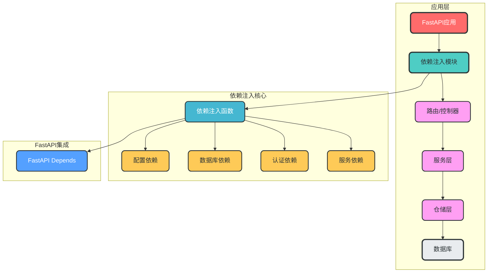
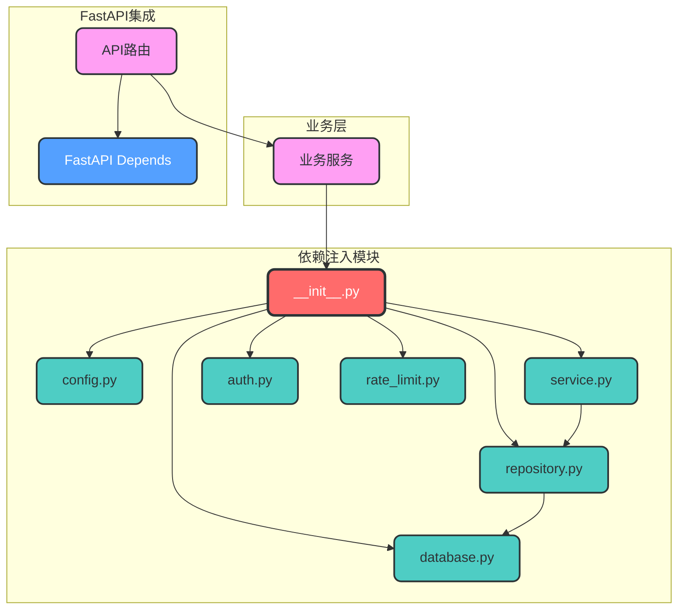

# 依赖注入模块设计_简化版

## 一、设计概述

本设计实现了一套**简化的依赖注入框架**，基于FastAPI的内置依赖注入系统，提供了简洁、易用的依赖管理能力，旨在提高代码的复用性、可测试性和可维护性，同时降低学习和使用成本。

### 设计目标

1. **基于FastAPI**：无缝集成FastAPI的依赖注入系统
2. **简洁易用**：提供简洁的API，降低学习和使用成本
3. **类型安全**：基于类型注解的依赖解析，确保类型安全
4. **可测试性**：设计便于单元测试和集成测试的API
5. **模块化**：按功能模块化，职责清晰
6. **低耦合**：各模块间低耦合，便于扩展和维护

### 设计原则

- ✅ **依赖倒置**：高层模块不依赖低层模块，两者都依赖抽象
- ✅ **单一职责**：每个组件只负责一个明确的功能
- ✅ **接口抽象**：通过接口定义依赖契约，实现模块解耦
- ✅ **类型安全**：使用类型注解确保依赖注入的类型正确性
- ✅ **可测试性**：设计便于单元测试和集成测试的API
- ✅ **易用性**：提供简洁直观的API，降低使用门槛
- ✅ **性能优先**：优化依赖解析和注入性能
- ✅ **最小化依赖**：减少对外部库的依赖

## 二、架构设计

### 1. 整体架构图



### 2. 核心组件关系图



## 三、核心组件设计

### 1. 依赖注入函数设计

```python
# app/dependencies/config.py
from fastapi import Depends
from app.config.base import BaseSettings
from app.config.settings import app_settings, AppSettings
from app.config.database import sqlite_config, SQLiteConfig
from app.config.logger import logging_config, LoggingConfig


# 配置依赖注入函数
def get_app_settings() -> AppSettings:
    """获取应用主配置"""
    return app_settings


def get_sqlite_config() -> SQLiteConfig:
    """获取SQLite配置"""
    return sqlite_config


def get_logging_config() -> LoggingConfig:
    """获取日志配置"""
    return logging_config
```

### 2. 数据库依赖注入

```python
# app/dependencies/database.py
from fastapi import Depends
from app.infrastructure.database.base import DatabaseConnection
from app.infrastructure.database.sqlite.connection import SQLiteConnection


# 全局数据库管理器实例
database_manager = DatabaseManager()
# 创建SQLite连接实例并注册
sqlite_connection = SQLiteConnection()
database_manager.register("sqlite", sqlite_connection)


# 依赖注入函数 - 用于FastAPI Depends
def get_sqlite_db():
    """SQLite数据库会话依赖注入"""
    yield from sqlite_connection.get_session()
```

### 3. 服务层依赖注入

```python
# app/dependencies/service.py
from fastapi import Depends
from app.domains.user.services.user_service import UserService
from app.dependencies.repository import get_sqlite_user_repository


# 服务层依赖注入函数
def get_user_service(user_repository = Depends(get_sqlite_user_repository)):
    """用户服务依赖注入"""
    return UserService(user_repository)
```

### 4. 依赖注入入口

```python
# app/dependencies/__init__.py
# FastAPI依赖注入模块
# 集中管理所有依赖注入，提供统一的导入入口

# 直接导入依赖注入函数，简化设计

# 配置依赖
from app.dependencies.config import (
    get_app_settings,
    get_sqlite_config,
    get_logging_config,
)

# 数据库依赖
from app.dependencies.database import (
    get_sqlite_db,
)

# 认证依赖
from app.dependencies.auth import (
    get_current_user,
    oauth2_scheme,
)

# 服务层依赖
from app.dependencies.service import (
    get_user_service,
)

# 导出所有依赖注入函数
__all__ = [
    # 配置依赖
    "get_app_settings",
    "get_sqlite_config",
    "get_logging_config",
    # 数据库依赖
    "get_sqlite_db",
    # 认证依赖
    "get_current_user",
    "oauth2_scheme",
    # 服务层依赖
    "get_user_service",
]
```

## 四、使用示例

### 1. FastAPI路由中使用

```python
# app/api/v1/users.py
from fastapi import APIRouter, Depends
from app.domains.user.schemas.user import UserCreate, UserResponse, Token
from app.domains.user.services.user_service import UserService
from app.dependencies.service import get_user_service
from app.dependencies.auth import get_current_user

router = APIRouter()


@router.post("/register", response_model=UserResponse, status_code=status.HTTP_201_CREATED)
def register_user(
    user_in: UserCreate,
    user_service: UserService = Depends(get_user_service)
):
    """用户注册"""
    user = user_service.create_user(user_in)
    return UserResponse.model_validate(user)


@router.get("/me", response_model=UserResponse)
def get_current_user(
    current_user = Depends(get_current_user)
):
    """获取当前用户信息"""
    return current_user
```

### 2. 测试环境下的使用

```python
# tests/test_user_service.py
import pytest
from app.domains.user.services.user_service import UserService
from app.infrastructure.repositories.sqlite.user_repository import UserRepository


def test_register_user():
    """测试用户注册"""
    # 创建测试用的仓储实例
    db = get_test_db()  # 测试数据库会话
    user_repository = UserRepository(db)
    
    # 直接创建服务实例，注入测试仓储
    user_service = UserService(user_repository)
    
    # 执行测试
    user_create = UserCreate(
        username="newuser",
        email="newuser@example.com",
        password="password123"
    )
    
    user = user_service.create_user(user_create)
    assert user["username"] == "newuser"
    assert user["email"] == "newuser@example.com"
```

### 3. 配置依赖注入

```python
# main.py
from fastapi import FastAPI, Depends
from app.dependencies.config import get_app_settings, get_sqlite_config, get_logging_config
from app.config.settings import AppSettings, SQLiteConfig, LoggingConfig

app = FastAPI()


@app.get("/api/v1/config")
def get_config(
    app_config: AppSettings = Depends(get_app_settings),
    db_config: SQLiteConfig = Depends(get_sqlite_config),
    log_config: LoggingConfig = Depends(get_logging_config),
):
    """测试配置依赖注入"""
    return {
        "app_name": app_config.APP_NAME,
        "environment": app_config.ENVIRONMENT,
        "sqlite_url": db_config.URL,
        "log_level": log_config.LEVEL,
        "log_file": log_config.FILE,
    }
```

## 五、目录结构设计

### 1. 实际目录结构

```
fastapi_enterprise/
├── app/                     # 应用核心目录
│   ├── __init__.py
│   ├── main.py              # 应用入口
│   ├── api/                 # API路由层
│   ├── config/              # 配置模块
│   ├── domains/             # DDD领域模块（按业务域组织）
│   ├── infrastructure/      # 基础设施层（按技术功能组织）
│   ├── dependencies/        # 依赖注入模块
│   │   ├── __init__.py      # 依赖注入模块入口
│   │   ├── auth.py          # 认证相关依赖
│   │   ├── config.py        # 配置相关依赖
│   │   ├── database.py      # 数据库相关依赖
│   │   ├── db.py            # 数据库会话管理
│   │   ├── rate_limit.py    # 限流相关依赖
│   │   ├── repository.py    # 仓储层依赖
│   │   └── service.py       # 服务层依赖
│   └── ...                  # 其他模块
├── .env                     # 开发环境变量
├── .env.prod                # 生产环境变量
└── .env.test                # 测试环境变量
```

### 2. 关键目录说明

- **dependencies/**：依赖注入模块主目录，集中管理所有依赖注入逻辑
  - **dependencies/__init__.py**：依赖注入模块入口，统一导出所有依赖注入函数
  - **dependencies/[type].py**：按类型组织的依赖注入配置，如auth.py、config.py等

### 3. 设计优势

- **简洁直观**：直接使用函数式依赖注入，易于理解和使用
- **集中管理**：所有依赖注入逻辑集中在dependencies目录下，便于统一维护
- **模块化设计**：依赖注入模块内部按功能模块化，职责清晰
- **易于扩展**：新增依赖类型时，只需在对应子模块中添加依赖注入函数
- **清晰的依赖关系**：各层依赖注入配置分离，便于理解和维护
- **测试友好**：依赖注入设计便于单元测试和集成测试
- **低学习成本**：基于FastAPI内置依赖系统，学习成本低

## 六、最佳实践

### 1. 依赖设计最佳实践

- **面向接口编程**：依赖接口而非具体实现
- **明确依赖关系**：每个依赖注入函数只负责一个明确的依赖
- **避免循环依赖**：设计时避免循环依赖
- **最小依赖原则**：每个类只依赖必要的组件
- **类型注解**：为所有依赖添加类型注解

### 2. 注册和解析最佳实践

- **分层组织**：按模块或层组织依赖注入函数
- **直接注入**：优先使用直接注入，避免过度抽象
- **显式依赖**：对于关键依赖，显式注入更清晰

### 3. 测试最佳实践

- **手动注入**：测试时手动创建依赖实例，便于控制测试环境
- **使用测试数据库**：测试时使用独立的测试数据库
- **隔离测试**：确保测试间相互隔离

### 4. 性能最佳实践

- **避免不必要的注入**：只注入必要的依赖
- **合理使用FastAPI依赖缓存**：利用FastAPI的依赖缓存机制

## 七、扩展建议

### 1. 支持更多依赖类型

- **异步依赖**：支持异步依赖的解析和注入
- **第三方服务依赖**：添加外部服务的依赖注入支持

### 2. 增强依赖管理

- **依赖版本管理**：添加依赖版本管理功能
- **依赖监控**：监控依赖使用情况

### 3. 集成更多框架

- **Pytest集成**：提供Pytest插件，简化测试
- **Celery集成**：支持Celery任务中的依赖注入

## 八、总结

本设计实现了一套简化的依赖注入框架，基于FastAPI的内置依赖注入系统，提供了简洁、易用的依赖管理能力。该框架具有以下核心优势：

1. **无缝集成FastAPI**：与FastAPI的依赖注入系统完美结合
2. **简洁易用**：提供简洁的API，降低学习和使用成本
3. **类型安全**：基于类型注解的依赖解析，确保类型正确
4. **优秀的测试支持**：便于单元测试和集成测试
5. **模块化设计**：按功能模块化，职责清晰
6. **低耦合**：各模块间低耦合，便于扩展和维护
7. **低学习成本**：基于FastAPI内置依赖系统，学习成本低

通过使用本依赖注入框架，开发团队可以：
- 提高代码的复用性和可维护性
- 简化单元测试和集成测试
- 实现模块间的解耦
- 遵循依赖倒置原则
- 减少样板代码，提高开发效率

本设计方案结合了现代依赖注入框架的最佳实践，为FastAPI企业级应用提供了可靠、易用的依赖管理解决方案，同时保持了代码的简洁性和可维护性。