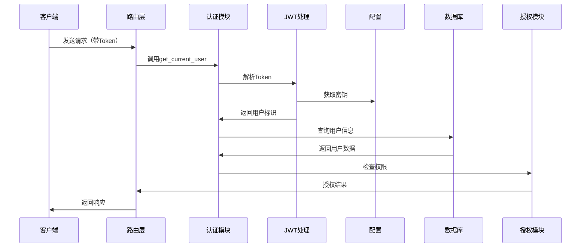

### 7. 安全模块

**核心作用**：提供全面的安全保障

**设计特点**：
- 支持多种认证方式（JWT、API Key、OAuth2等）
- 细粒度权限控制
- 输入验证和输出过滤
- 防止常见安全漏洞（SQL注入、XSS、CSRF等）

**模块架构图**：

```mermaid
graph LR
    subgraph 安全模块
        A[认证模块] --> B[JWT认证]
        A --> C[API Key认证]
        A --> D[OAuth2认证]
        
        E[授权模块] --> F[基于角色的访问控制]
        E --> G[基于权限的访问控制]
        
        H[数据安全] --> I[输入验证]
        H --> J[输出过滤]
        H --> K[加密解密]
        
        L[安全防护] --> M[防止SQL注入]
        L --> N[防止XSS攻击]
        L --> O[防止CSRF攻击]
    end
    
    style A fill:#FF6B6B,stroke:#2D3436,stroke-width:3px,color:white,rx:8,ry:8
    style B fill:#4ECDC4,stroke:#2D3436,stroke-width:2px,color:#2D3436,rx:8,ry:8
    style C fill:#45B7D1,stroke:#2D3436,stroke-width:2px,color:white,rx:8,ry:8
    style D fill:#96CEB4,stroke:#2D3436,stroke-width:2px,color:#2D3436,rx:8,ry:8
    style E fill:#FF9FF3,stroke:#2D3436,stroke-width:2px,color:#2D3436,rx:8,ry:8
    style F fill:#54A0FF,stroke:#2D3436,stroke-width:2px,color:white,rx:8,ry:8
    style G fill:#FECA57,stroke:#2D3436,stroke-width:2px,color:#2D3436,rx:8,ry:8
    style H fill:#E9ECEF,stroke:#2D3436,stroke-width:3px,color:#2D3436,rx:8,ry:8
    style I fill:#FF6B6B,stroke:#2D3436,stroke-width:2px,color:white,rx:8,ry:8
    style J fill:#4ECDC4,stroke:#2D3436,stroke-width:2px,color:#2D3436,rx:8,ry:8
    style K fill:#45B7D1,stroke:#2D3436,stroke-width:2px,color:white,rx:8,ry:8
    style L fill:#96CEB4,stroke:#2D3436,stroke-width:2px,color:#2D3436,rx:8,ry:8
    style M fill:#FF9FF3,stroke:#2D3436,stroke-width:2px,color:#2D3436,rx:8,ry:8
    style N fill:#54A0FF,stroke:#2D3436,stroke-width:2px,color:white,rx:8,ry:8
    style O fill:#FECA57,stroke:#2D3436,stroke-width:2px,color:#2D3436,rx:8,ry:8
```


**数据流转图**：


**关键实现**：
```python
# app/security/auth.py
from fastapi import Depends, HTTPException, status
from fastapi.security import OAuth2PasswordBearer
from jose import JWTError, jwt
from app.config.settings import settings

oauth2_scheme = OAuth2PasswordBearer(tokenUrl="/api/v1/auth/token")

async def get_current_user(token: str = Depends(oauth2_scheme)):
    """获取当前用户"""
    credentials_exception = HTTPException(
        status_code=status.HTTP_401_UNAUTHORIZED,
        detail="Could not validate credentials",
        headers={"WWW-Authenticate": "Bearer"},
    )
    try:
        payload = jwt.decode(token, settings.security.secret_key, algorithms=[settings.security.algorithm])
        username: str = payload.get("sub")
        if username is None:
            raise credentials_exception
    except JWTError:
        raise credentials_exception
    # 从数据库获取用户
    # user = await user_repository.get_by_username(username)
    # if user is None:
    #     raise credentials_exception
    return username
```