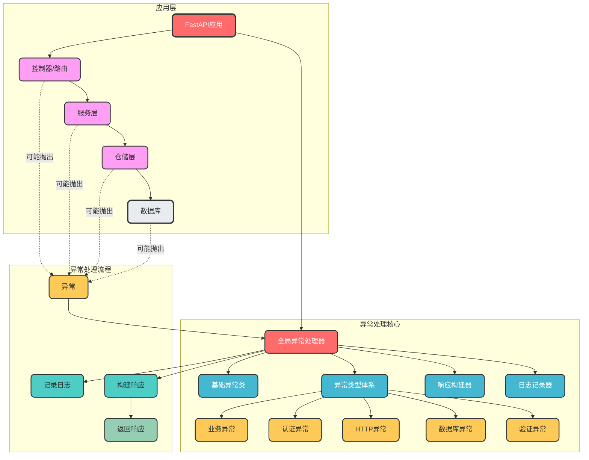

# 异常处理模块设计

## 一、设计概述

本设计实现了一套**生产级的异常处理框架**，基于FastAPI的异常处理机制扩展，提供了全面的异常管理能力，包括异常分类、统一响应格式、日志记录、异常追踪等功能，旨在提高系统的可靠性、可维护性和用户体验。

### 设计目标

1. **统一异常处理**：集中管理所有异常，提供一致的错误响应格式
2. **异常分类体系**：建立清晰的异常分类，便于识别和处理不同类型的异常
3. **标准化响应**：定义统一的错误响应结构，包含错误码、消息、详情等
4. **完整日志记录**：记录异常的详细信息，便于问题定位和分析
5. **异常追踪**：支持请求ID追踪，便于关联同一请求的所有日志
6. **类型安全**：基于类型系统的异常处理，确保类型安全
7. **可扩展性**：支持自定义异常类型和处理策略
8. **易用性**：提供简洁的API，降低使用成本

### 设计原则

- ✅ **统一出口**：所有异常通过统一的处理器处理，确保响应格式一致
- ✅ **异常分类**：不同类型的异常使用不同的异常类，便于区分和处理
- ✅ **信息分层**：错误信息分为不同级别，便于不同场景使用
- ✅ **日志完整**：记录异常的完整上下文，包括请求信息、异常堆栈等
- ✅ **可追踪性**：支持请求ID追踪，便于关联同一请求的所有操作
- ✅ **用户友好**：返回清晰易懂的错误信息，避免技术术语泄露
- ✅ **性能优先**：优化异常处理流程，减少性能开销

## 二、架构设计

### 1. 整体架构图



### 2. 核心组件关系图

```mermaid
graph TD
    subgraph 异常处理核心组件
        BaseAppException[BaseAppException] --> BusinessException[BusinessException]
        BaseAppException --> NotFoundException[NotFoundException]
        BaseAppException --> AuthException[AuthException]
        BaseAppException --> ForbiddenException[ForbiddenException]
        BaseAppException --> ValidationException[ValidationException]
        BaseAppException --> DatabaseException[DatabaseException]
        
        GlobalHandler[custom_exception_handler] --> BaseAppException
        GlobalHandler --> FastAPIExceptions[FastAPI内置异常]
        GlobalHandler --> SQLAlchemyEx[SQLAlchemy异常]
        GlobalHandler --> PythonEx[Python内置异常]
        
        GlobalHandler --> ErrorResponse[ErrorResponse]
        GlobalHandler --> Logger[Logger]
    end
    
    subgraph 异常处理流程
        UserController[UserController] --> RaiseBusinessEx[抛出业务异常]
        UserService[UserService] --> RaiseAuthEx[抛出认证异常]
        UserRepository[UserRepository] --> RaiseDBEx[抛出数据库异常]
        
        RaiseBusinessEx --> GlobalHandler
        RaiseAuthEx --> GlobalHandler
        RaiseDBEx --> GlobalHandler
        
        GlobalHandler --> BuildErrorResponse[构建错误响应]
        GlobalHandler --> LogException[记录异常日志]
        
        BuildErrorResponse --> ReturnJSON[返回JSON响应]
    end
    
    style BaseAppException fill:#FF6B6B,stroke:#2D3436,stroke-width:3px,color:white,rx:8,ry:8
    style BusinessException fill:#4ECDC4,stroke:#2D3436,stroke-width:2px,color:#2D3436,rx:8,ry:8
    style NotFoundException fill:#4ECDC4,stroke:#2D3436,stroke-width:2px,color:#2D3436,rx:8,ry:8
    style AuthException fill:#4ECDC4,stroke:#2D3436,stroke-width:2px,color:#2D3436,rx:8,ry:8
    style ForbiddenException fill:#4ECDC4,stroke:#2D3436,stroke-width:2px,color:#2D3436,rx:8,ry:8
    style ValidationException fill:#4ECDC4,stroke:#2D3436,stroke-width:2px,color:#2D3436,rx:8,ry:8
    style DatabaseException fill:#4ECDC4,stroke:#2D3436,stroke-width:2px,color:#2D3436,rx:8,ry:8
    style GlobalHandler fill:#45B7D1,stroke:#2D3436,stroke-width:3px,color:white,rx:8,ry:8
    style ErrorResponse fill:#FECA57,stroke:#2D3436,stroke-width:2px,color:#2D3436,rx:8,ry:8
    style Logger fill:#54A0FF,stroke:#2D3436,stroke-width:2px,color:white,rx:8,ry:8
    style UserController fill:#FF9FF3,stroke:#2D3436,stroke-width:2px,color:#2D3436,rx:8,ry:8
    style UserService fill:#FF9FF3,stroke:#2D3436,stroke-width:2px,color:#2D3436,rx:8,ry:8
    style UserRepository fill:#FF9FF3,stroke:#2D3436,stroke-width:2px,color:#2D3436,rx:8,ry:8
    style FastAPIExceptions fill:#96CEB4,stroke:#2D3436,stroke-width:2px,color:#2D3436,rx:8,ry:8
    style SQLAlchemyEx fill:#96CEB4,stroke:#2D3436,stroke-width:2px,color:#2D3436,rx:8,ry:8
    style PythonEx fill:#96CEB4,stroke:#2D3436,stroke-width:2px,color:#2D3436,rx:8,ry:8
    style RaiseBusinessEx fill:#FF9FF3,stroke:#2D3436,stroke-width:2px,color:#2D3436,rx:8,ry:8
    style RaiseAuthEx fill:#FF9FF3,stroke:#2D3436,stroke-width:2px,color:#2D3436,rx:8,ry:8
    style RaiseDBEx fill:#FF9FF3,stroke:#2D3436,stroke-width:2px,color:#2D3436,rx:8,ry:8
    style BuildErrorResponse fill:#45B7D1,stroke:#2D3436,stroke-width:2px,color:white,rx:8,ry:8
    style LogException fill:#45B7D1,stroke:#2D3436,stroke-width:2px,color:white,rx:8,ry:8
    style ReturnJSON fill:#45B7D1,stroke:#2D3436,stroke-width:2px,color:white,rx:8,ry:8
```



## 三、核心组件设计

### 1. 基础异常类

```python
# app/exception/base.py
class BaseAppException(Exception):
    """应用基础异常类"""
    def __init__(
        self,
        message: str = "服务器内部错误",
        code: int = 500,
        error_details: dict = None,
        log_level: str = "error"
    ):
        self.message = message
        self.code = code
        self.error_details = error_details or {}
        self.log_level = log_level
        super().__init__(self.message)
```

### 2. 异常类型体系

#### 业务异常

```python
# app/exception/business.py
from .base import BaseAppException

class BusinessException(BaseAppException):
    """业务逻辑异常"""
    def __init__(
        self,
        message: str = "业务逻辑错误",
        code: int = 400,
        error_details: dict = None,
        log_level: str = "warning"
    ):
        super().__init__(message, code, error_details, log_level)

class NotFoundException(BaseAppException):
    """资源不存在异常"""
    def __init__(
        self,
        message: str = "资源不存在",
        code: int = 404,
        error_details: dict = None,
        log_level: str = "info"
    ):
        super().__init__(message, code, error_details, log_level)
```

#### 认证异常

```python
# app/exception/auth.py
from .base import BaseAppException

class AuthException(BaseAppException):
    """认证异常"""
    def __init__(
        self,
        message: str = "认证失败",
        code: int = 401,
        error_details: dict = None,
        log_level: str = "warning"
    ):
        super().__init__(message, code, error_details, log_level)

class ForbiddenException(BaseAppException):
    """权限不足异常"""
    def __init__(
        self,
        message: str = "权限不足",
        code: int = 403,
        error_details: dict = None,
        log_level: str = "warning"
    ):
        super().__init__(message, code, error_details, log_level)
```

#### HTTP和验证异常

```python
# app/exception/http.py
from .base import BaseAppException

class ValidationException(BaseAppException):
    """参数验证异常"""
    def __init__(
        self,
        message: str = "参数验证失败",
        code: int = 400,
        error_details: dict = None,
        log_level: str = "info"
    ):
        super().__init__(message, code, error_details, log_level)
```

#### 数据库异常

```python
# app/exception/database.py
from .base import BaseAppException

class DatabaseException(BaseAppException):
    """数据库异常"""
    def __init__(
        self,
        message: str = "数据库操作失败",
        code: int = 500,
        error_details: dict = None,
        log_level: str = "error"
    ):
        super().__init__(message, code, error_details, log_level)
```

### 3. 全局异常处理器

```python
# app/exception/handler.py
from fastapi import Request, status
from fastapi.responses import JSONResponse
from fastapi.exceptions import RequestValidationError
from starlette.exceptions import HTTPException as StarletteHTTPException
from sqlalchemy.exc import SQLAlchemyError
from app.exception.base import BaseAppException
from app.schemas.response import ErrorResponse
from app.config.logger import logger
from app.utils.request import get_request_id

async def custom_exception_handler(request: Request, exc: Exception):
    """全局异常处理器"""
    request_id = get_request_id(request)
    
    # 1. 处理自定义异常
    if isinstance(exc, BaseAppException):
        error_response = ErrorResponse(
            code=exc.code,
            message=exc.message,
            error_details=exc.error_details,
            request_id=request_id
        )
        log_level = exc.log_level
    
    # 2. 处理FastAPI参数验证异常
    elif isinstance(exc, RequestValidationError):
        error_details = {
            "errors": exc.errors(),
            "body": exc.body
        }
        error_response = ErrorResponse(
            code=status.HTTP_400_BAD_REQUEST,
            message="请求参数验证失败",
            error_details=error_details,
            request_id=request_id
        )
        log_level = "info"
    
    # 3. 处理Starlette HTTP异常
    elif isinstance(exc, StarletteHTTPException):
        error_response = ErrorResponse(
            code=exc.status_code,
            message=exc.detail,
            request_id=request_id
        )
        log_level = "warning" if exc.status_code < 500 else "error"
    
    # 4. 处理数据库异常
    elif isinstance(exc, SQLAlchemyError):
        error_details = {
            "original_error": str(exc)
        }
        error_response = ErrorResponse(
            code=status.HTTP_500_INTERNAL_SERVER_ERROR,
            message="数据库操作失败",
            error_details=error_details,
            request_id=request_id
        )
        log_level = "error"
    
    # 5. 处理其他未知异常
    else:
        error_details = {
            "exception_type": type(exc).__name__,
            "original_error": str(exc)
        }
        error_response = ErrorResponse(
            code=status.HTTP_500_INTERNAL_SERVER_ERROR,
            message="服务器内部错误",
            error_details=error_details,
            request_id=request_id
        )
        log_level = "error"
    
    # 记录异常日志
    log_exception(request, exc, error_response, log_level)
    
    # 返回标准化错误响应
    return JSONResponse(
        status_code=error_response.code,
        content=error_response.dict()
    )


def log_exception(request: Request, exc: Exception, error_response: ErrorResponse, log_level: str):
    """记录异常日志"""
    log_data = {
        "request_id": error_response.request_id,
        "path": request.url.path,
        "method": request.method,
        "client_ip": request.client.host if request.client else "unknown",
        "code": error_response.code,
        "error_message": error_response.message,
        "error_details": error_response.error_details,
        "exception_type": type(exc).__name__
    }
    
    # 根据日志级别记录日志
    if log_level == "debug":
        logger.debug(f"[Exception] {error_response.message}", extra=log_data)
    elif log_level == "info":
        logger.info(f"[Exception] {error_response.message}", extra=log_data)
    elif log_level == "warning":
        logger.warning(f"[Exception] {error_response.message}", extra=log_data)
    elif log_level == "error":
        logger.error(f"[Exception] {error_response.message}", extra=log_data, exc_info=True)
    elif log_level == "critical":
        logger.critical(f"[Exception] {error_response.message}", extra=log_data, exc_info=True)
```

### 4. 错误响应模型

```python
# app/schemas/response.py
from pydantic import BaseModel
from typing import Any, Dict, Optional

class ErrorResponse(BaseModel):
    """错误响应模型"""
    code: int
    message: str
    error_details: Optional[Dict[str, Any]] = None
    request_id: Optional[str] = None
    
    class Config:
        schema_extra = {
            "example": {
                "code": 400,
                "message": "业务逻辑错误",
                "error_details": {
                    "field": "username",
                    "reason": "用户名已存在"
                },
                "request_id": "req_1234567890"
            }
        }
```

## 四、使用示例

### 1. 基本使用

```python
# 1. 抛出异常
from app.exception import BusinessException, NotFoundException

class UserService:
    def create_user(self, username: str):
        # 检查用户名是否已存在
        if username == "existing_user":
            raise BusinessException(
                message="用户名已存在",
                error_details={"field": "username", "reason": "用户名已被注册"}
            )
        # 创建用户...
    
    def get_user(self, user_id: int):
        # 查询用户
        user = None  # 模拟未找到用户
        if not user:
            raise NotFoundException(
                message=f"用户ID {user_id} 不存在",
                error_details={"user_id": user_id}
            )
        return user
```

### 2. 认证和权限异常

```python
# 2. 抛出认证和权限异常
from app.exception import AuthException, ForbiddenException
from app.dependencies.auth import get_current_user

async def delete_user(user_id: int, current_user = Depends(get_current_user)):
    # 检查用户是否登录
    if not current_user:
        raise AuthException(
            message="请先登录",
            error_details={"action": "delete_user"}
        )
    
    # 检查用户是否有权限
    if current_user.id != user_id and not current_user.is_admin:
        raise ForbiddenException(
            message="无权删除该用户",
            error_details={"user_id": user_id, "current_user_id": current_user.id}
        )
    
    # 删除用户...
```

### 3. 数据库异常

```python
# 3. 抛出数据库异常
from app.exception import DatabaseException
from sqlalchemy.exc import SQLAlchemyError

try:
    # 执行数据库操作
    db.session.commit()
except SQLAlchemyError as e:
    db.session.rollback()
    raise DatabaseException(
        message="数据库操作失败",
        error_details={"original_error": str(e)}
    )
```

### 4. FastAPI集成

```python
# 4. 在FastAPI应用中注册异常处理器
from fastapi import FastAPI
from app.exception.handler import custom_exception_handler
from app.exception.base import BaseAppException

app = FastAPI()

# 注册全局异常处理器
app.add_exception_handler(BaseAppException, custom_exception_handler)
app.add_exception_handler(Exception, custom_exception_handler)
```

### 5. 测试异常处理

```python
# 5. 测试异常处理
import pytest
from fastapi.testclient import TestClient
from app.main import app
from app.exception import BusinessException

client = TestClient(app)

def test_business_exception():
    # 模拟触发业务异常的请求
    response = client.post("/users", json={"username": "existing_user"})
    
    # 验证响应
    assert response.status_code == 400
    assert response.json()["message"] == "用户名已存在"
    assert "error_details" in response.json()
    assert "request_id" in response.json()
```

## 五、目录结构设计

### 1. 推荐目录结构

```
fastapi_enterprise/
├── app/                     # 应用核心目录
│   ├── __init__.py
│   ├── main.py              # 应用入口
│   ├── exception/           # 异常处理模块
│   │   ├── __init__.py      # 异常模块入口
│   │   ├── base.py          # 基础异常类
│   │   ├── business.py      # 业务异常
│   │   ├── auth.py          # 认证异常
│   │   ├── http.py          # HTTP异常
│   │   ├── database.py      # 数据库异常
│   │   ├── handler.py       # 全局异常处理器
│   │   └── response.py      # 响应构建器
│   ├── schemas/             # 数据模型
│   │   └── response.py      # 响应模型定义
│   ├── config/              # 配置模块
│   ├── utils/               # 工具模块
│   └── ...                  # 其他模块
├── tests/                   # 测试目录
│   └── test_exception.py    # 异常处理测试
└── ...                      # 其他文件
```

### 2. 关键目录说明

- **exception/**：异常处理模块主目录，集中管理所有异常相关逻辑
  - **exception/base.py**：基础异常类，定义异常的基本结构和属性
  - **exception/business.py**：业务相关异常，如参数错误、业务规则违反等
  - **exception/auth.py**：认证和权限相关异常，如未登录、权限不足等
  - **exception/http.py**：HTTP相关异常，如参数验证失败等
  - **exception/database.py**：数据库相关异常，如数据库连接失败、查询错误等
  - **exception/handler.py**：全局异常处理器，统一处理所有异常
  - **exception/response.py**：响应构建器，负责构建标准化的错误响应

### 3. 设计优势

- **集中管理**：所有异常处理逻辑集中在exception目录下，便于统一维护
- **模块化设计**：不同类型的异常分开管理，职责清晰
- **易于扩展**：新增异常类型时，只需在对应子模块中扩展
- **清晰的异常层次**：基于继承的异常体系，便于理解和使用
- **测试友好**：异常处理设计便于单元测试和集成测试

## 六、最佳实践

### 1. 异常设计最佳实践

- **遵循异常层次**：新异常应继承自合适的父异常类
- **提供有意义的错误信息**：错误信息应清晰描述异常原因，便于调试和用户理解
- **包含必要的错误详情**：根据需要提供额外的错误详情，如字段名、参数值等
- **设置适当的日志级别**：根据异常类型设置合适的日志级别
- **避免泄露敏感信息**：错误信息中不应包含敏感数据，如数据库密码、内部路径等

### 2. 异常使用最佳实践

- **早抛出，晚捕获**：在异常发生的最早时刻抛出，在合适的层级统一捕获
- **具体异常优先**：优先捕获具体的异常类型，而不是通用的Exception
- **使用try-except-finally**：确保资源正确释放
- **避免过度使用异常**：不要将异常用于控制流程，只用于处理异常情况
- **提供补偿机制**：对于关键操作，提供异常后的补偿机制，如回滚事务

### 3. 日志记录最佳实践

- **记录完整上下文**：日志中应包含请求ID、路径、方法、客户端IP等上下文信息
- **根据异常类型设置日志级别**：业务异常使用warning，系统异常使用error
- **记录异常堆栈**：系统异常应记录完整的堆栈信息，便于调试
- **结构化日志**：使用结构化日志格式，便于日志分析和监控
- **避免日志泛滥**：根据环境调整日志级别，避免生产环境日志过多

### 4. 响应设计最佳实践

- **统一响应格式**：所有异常返回统一的响应结构
- **包含错误码**：使用HTTP状态码或自定义错误码标识异常类型
- **提供用户友好的错误信息**：面向用户的错误信息应清晰易懂
- **包含请求ID**：便于关联请求和日志
- **根据环境调整错误详情**：生产环境可减少详细错误信息，避免泄露内部实现

## 七、扩展建议

### 1. 增强异常类型体系

- **添加更多异常类型**：根据业务需求添加更多细分的异常类型
- **支持自定义错误码**：实现自定义错误码体系，便于前端处理不同类型的异常
- **添加异常国际化支持**：支持多语言的错误信息

### 2. 增强异常处理能力

- **添加异常重试机制**：对于临时性异常，如网络超时，支持自动重试
- **实现异常熔断**：对于频繁发生的异常，实现熔断机制，保护系统
- **添加异常告警**：对于严重异常，触发告警通知

### 3. 增强日志和监控

- **添加异常统计**：统计异常发生的频率和分布，便于系统优化
- **实现异常追踪**：使用分布式追踪系统，如Jaeger或Zipkin，追踪异常的完整调用链
- **添加异常仪表盘**：提供异常监控仪表盘，实时查看系统异常情况

### 4. 增强开发体验

- **添加异常文档生成**：自动生成异常文档，便于前端和测试人员理解
- **提供异常模拟器**：开发环境下提供异常模拟工具，便于测试不同异常场景
- **实现异常调试工具**：提供异常调试工具，便于开发人员定位和修复异常

### 5. 集成更多框架

- **Pytest集成**：提供Pytest插件，简化异常测试
- **Celery集成**：支持Celery任务中的异常处理
- **FastAPI扩展**：提供更多FastAPI集成功能，如异常装饰器

## 八、总结

本设计实现了一套功能强大的异常处理框架，基于FastAPI的异常处理机制扩展，提供了全面的异常管理能力。该框架具有以下核心优势：

1. **完整的异常分类体系**：建立了清晰的异常层次结构，便于识别和处理不同类型的异常
2. **统一的异常处理机制**：集中管理所有异常，提供一致的错误响应格式
3. **完整的日志记录**：记录异常的详细上下文信息，便于问题定位和分析
4. **标准化的错误响应**：定义统一的错误响应结构，提高用户体验
5. **良好的可扩展性**：新类型的异常可以方便添加，不影响现有代码
6. **优秀的测试支持**：异常处理设计便于单元测试和集成测试
7. **清晰的文档和示例**：提供详细的使用文档和示例，降低学习成本

通过使用本异常处理框架，开发团队可以：
- 提高系统的可靠性和稳定性
- 简化异常处理逻辑，减少样板代码
- 提高问题定位和调试效率
- 提供一致的用户体验
- 便于系统监控和告警

本设计方案结合了现代异常处理框架的最佳实践，为FastAPI企业级应用提供了可靠的异常管理解决方案。