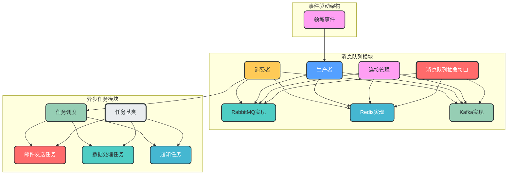
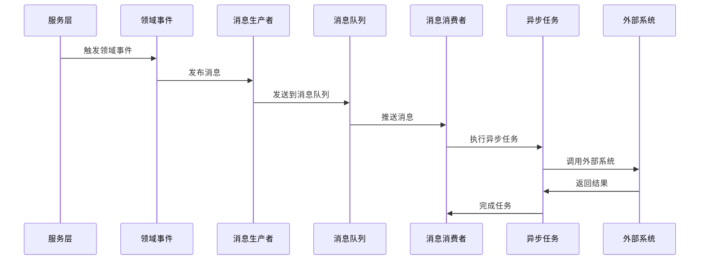

### 9. 异步任务与消息队列

**核心作用**：处理异步任务，支持事件驱动架构，提高系统的并发性能和可靠性

**设计特点**：
- 支持多种消息队列集成（RabbitMQ, Redis, Kafka等）
- 异步任务处理，提高系统并发性能
- 事件驱动设计，支持松耦合架构
- 任务重试机制，提高系统可靠性
- 统一的消息队列接口，便于切换实现

**模块架构图**：


**数据流转图**：


**消息队列选型建议**：
| 消息队列 | 适用场景 | 特点 |
| --- | --- | --- |
| **RabbitMQ** | 异步任务处理、事件驱动、工作队列 | 可靠性高、支持多种协议、成熟稳定 |
| **Redis** | 简单异步任务、缓存、实时数据处理 | 性能高、部署简单、支持多种数据结构 |
| **Kafka** | 大规模数据流处理、日志收集、实时分析 | 高吞吐量、支持持久化、分布式设计 |

**目录结构设计**：
```
app/infrastructure/queue/
├── __init__.py
├── base.py              # 消息队列抽象接口
├── connection.py        # 连接管理
├── producers/           # 消息生产者
│   ├── __init__.py
│   ├── rabbitmq_producer.py
│   ├── redis_producer.py
│   └── kafka_producer.py
├── consumers/           # 消息消费者
│   ├── __init__.py
│   ├── rabbitmq_consumer.py
│   ├── redis_consumer.py
│   └── kafka_consumer.py
└── config.py            # 消息队列配置
```

**关键实现**：
```python
# app/infrastructure/queue/base.py
from abc import ABC, abstractmethod
from typing import Any, Dict, List

class BaseQueue(ABC):
    """消息队列抽象基类"""
    
    @abstractmethod
    async def connect(self) -> None:
        """连接到消息队列"""
        pass
    
    @abstractmethod
    async def disconnect(self) -> None:
        """断开消息队列连接"""
        pass
    
    @abstractmethod
    async def publish(self, topic: str, message: Dict[str, Any]) -> None:
        """发布消息"""
        pass
    
    @abstractmethod
    async def subscribe(self, topic: str, callback) -> None:
        """订阅消息"""
        pass

# app/infrastructure/queue/connection.py
from app.config.settings import settings
from app.infrastructure.queue.producers.rabbitmq_producer import RabbitMQProducer
from app.infrastructure.queue.producers.redis_producer import RedisProducer
from app.infrastructure.queue.producers.kafka_producer import KafkaProducer

async def get_queue_producer():
    """获取消息队列生产者"""
    queue_type = settings.queue.type  # 从配置中获取消息队列类型
    
    if queue_type == "rabbitmq":
        producer = RabbitMQProducer()
    elif queue_type == "redis":
        producer = RedisProducer()
    elif queue_type == "kafka":
        producer = KafkaProducer()
    else:
        raise ValueError(f"Unsupported queue type: {queue_type}")
    
    await producer.connect()
    try:
        yield producer
    finally:
        await producer.disconnect()

# app/tasks/base.py
from abc import ABC, abstractmethod
from typing import Any, Dict

class BaseTask(ABC):
    """任务基类"""
    
    @abstractmethod
    async def execute(self, **kwargs: Dict[str, Any]) -> Any:
        """执行任务"""
        pass

# app/tasks/email.py
from app.tasks.base import BaseTask
from app.observability.logging import logger

class SendEmailTask(BaseTask):
    """发送邮件任务"""
    
    async def execute(self, **kwargs: Dict[str, Any]) -> Any:
        """执行发送邮件任务"""
        email = kwargs.get("email")
        subject = kwargs.get("subject")
        content = kwargs.get("content")
        
        # 实际发送邮件逻辑
        logger.info(f"Sending email to {email} with subject: {subject}")
        # send_email(email, subject, content)
        
        return {"status": "success", "email": email}
```

**使用示例**：
```python
# 发布事件
from app.infrastructure.queue.connection import get_queue_producer

async def publish_user_created_event(user_id: int, email: str):
    """发布用户创建事件"""
    async with get_queue_producer() as producer:
        await producer.publish("user.created", {
            "user_id": user_id,
            "email": email
        })

# 消费事件
from app.infrastructure.queue.connection import get_queue_consumer
from app.tasks.email import SendEmailTask

async def consume_user_created_events():
    """消费用户创建事件"""
    email_task = SendEmailTask()
    
    async def handle_user_created(event_data):
        """处理用户创建事件"""
        user_id = event_data["user_id"]
        email = event_data["email"]
        
        # 发送欢迎邮件
        await email_task.execute(
            email=email,
            subject="Welcome to our platform",
            content=f"Hello, thank you for registering with us! Your user ID is {user_id}."
        )
    
    async with get_queue_consumer() as consumer:
        await consumer.subscribe("user.created", handle_user_created)
```