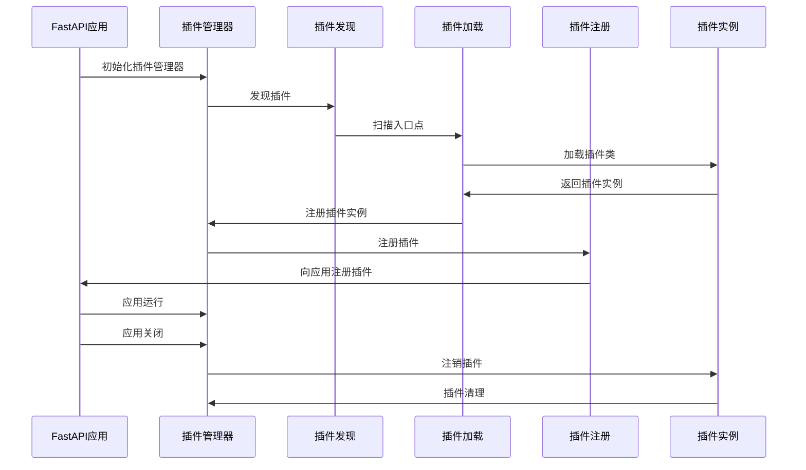

### 10. 插件架构设计

**核心作用**：支持架构扩展，允许动态加载插件

**设计特点**：
- 插件接口抽象
- 插件自动发现
- 插件生命周期管理
- 插件依赖管理

**模块架构图**：

```mermaid
graph TD
    subgraph 插件架构
        A[插件基类] --> B[认证插件]
        A --> C[日志插件]
        A --> D[监控插件]
        A --> E[自定义插件]
        
        F[插件管理器] --> G[插件发现]
        F --> H[插件注册]
        F --> I[插件初始化]
        F --> J[插件注销]
        
        G --> K[入口点扫描]
        G --> L[动态加载]
        
        H --> M[路由注册]
        H --> N[中间件注册]
        H --> O[事件监听]
    end
    
    FastAPI[FastAPI应用] --> F
    F --> FastAPI
    
    style A fill:#FF6B6B,stroke:#2D3436,stroke-width:3px,color:white,rx:8,ry:8
    style B fill:#4ECDC4,stroke:#2D3436,stroke-width:2px,color:#2D3436,rx:8,ry:8
    style C fill:#45B7D1,stroke:#2D3436,stroke-width:2px,color:white,rx:8,ry:8
    style D fill:#96CEB4,stroke:#2D3436,stroke-width:2px,color:#2D3436,rx:8,ry:8
    style E fill:#FF9FF3,stroke:#2D3436,stroke-width:2px,color:#2D3436,rx:8,ry:8
    style F fill:#54A0FF,stroke:#2D3436,stroke-width:2px,color:white,rx:8,ry:8
    style G fill:#FECA57,stroke:#2D3436,stroke-width:2px,color:#2D3436,rx:8,ry:8
    style H fill:#E9ECEF,stroke:#2D3436,stroke-width:3px,color:#2D3436,rx:8,ry:8
    style I fill:#FF6B6B,stroke:#2D3436,stroke-width:2px,color:white,rx:8,ry:8
    style J fill:#4ECDC4,stroke:#2D3436,stroke-width:2px,color:#2D3436,rx:8,ry:8
    style K fill:#45B7D1,stroke:#2D3436,stroke-width:2px,color:white,rx:8,ry:8
    style L fill:#96CEB4,stroke:#2D3436,stroke-width:2px,color:#2D3436,rx:8,ry:8
    style M fill:#FF9FF3,stroke:#2D3436,stroke-width:2px,color:#2D3436,rx:8,ry:8
    style N fill:#54A0FF,stroke:#2D3436,stroke-width:2px,color:white,rx:8,ry:8
    style O fill:#FECA57,stroke:#2D3436,stroke-width:2px,color:#2D3436,rx:8,ry:8
    style FastAPI fill:#45B7D1,stroke:#2D3436,stroke-width:2px,color:white,rx:8,ry:8
```


**数据流转图**：


**关键实现**：
```python
# app/plugins/base.py
from abc import ABC, abstractmethod
from fastapi import FastAPI

class BasePlugin(ABC):
    """插件基类"""
    
    name: str
    version: str
    description: str
    
    @abstractmethod
    def register(self, app: FastAPI) -> None:
        """注册插件"""
        pass
    
    @abstractmethod
    def unregister(self) -> None:
        """注销插件"""
        pass

# app/plugins/manager.py
from fastapi import FastAPI
from app.plugins.base import BasePlugin
from typing import List
import pkg_resources

class PluginManager:
    """插件管理器"""
    
    def __init__(self):
        self.plugins: List[BasePlugin] = []
    
    def discover_plugins(self) -> None:
        """发现插件"""
        for entry_point in pkg_resources.iter_entry_points("fastapi.plugins"):
            try:
                plugin_class = entry_point.load()
                if issubclass(plugin_class, BasePlugin):
                    plugin = plugin_class()
                    self.plugins.append(plugin)
            except Exception as e:
                # 记录插件加载失败
                from app.observability.logging import logger
                logger.error(f"Failed to load plugin {entry_point.name}: {e}")
    
    def register_plugins(self, app: FastAPI) -> None:
        """注册所有插件"""
        for plugin in self.plugins:
            try:
                plugin.register(app)
            except Exception as e:
                # 记录插件注册失败
                from app.observability.logging import logger
                logger.error(f"Failed to register plugin {plugin.name}: {e}")
```