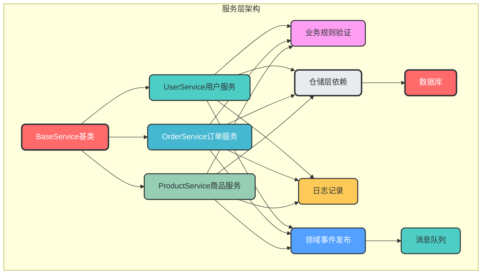
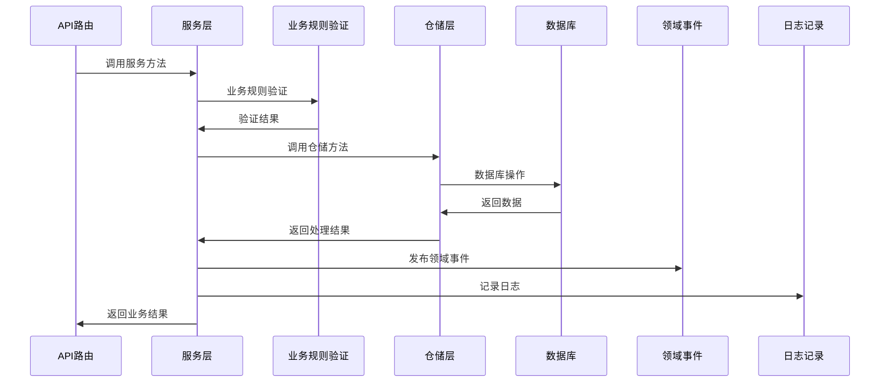

### 4. 服务层设计（DDD增强）

**核心作用**：封装核心业务逻辑，实现业务与技术分离，是连接表示层（API路由）和数据访问层（仓储层）的桥梁。

**设计理念**：
- **业务逻辑封装**：将复杂的业务规则和流程封装在服务层，避免业务逻辑分散到控制器或数据访问层
- **DDD领域驱动**：基于领域模型设计，实现领域服务、领域事件和领域规则
- **接口抽象**：通过抽象接口定义服务契约，实现依赖倒置，便于测试和替换实现
- **事务管理**：负责业务事务的管理，确保数据一致性

**模块架构图**：


**数据流转图**：


**服务层与仓储层的关系**：
- 服务层调用仓储层来获取和持久化数据
- 仓储层只负责数据访问，不包含业务逻辑
- 服务层负责业务规则验证、业务流程控制和领域事件发布

**领域服务目录结构设计**：

服务层采用DDD领域驱动设计，按业务域组织服务代码，每个业务域拥有自己的服务实现。以下是用户域和订单域的服务目录结构示例：

```
app/domains/
├── user/                # 用户领域
│   └── services/        # 用户领域服务
│       ├── __init__.py
│       └── user_service.py   # 用户服务实现
└── order/               # 订单领域
    └── services/        # 订单领域服务
        ├── __init__.py
        └── order_service.py  # 订单服务实现
```

**基类设计的作用与优势**：

服务层基类`BaseService`的设计具有以下重要作用：

1. **统一接口规范**：定义了服务层必须实现的核心方法，确保所有服务类遵循相同的接口规范
2. **减少重复代码**：封装了通用的服务逻辑，避免每个服务类重复实现相同的方法
3. **提高可维护性**：统一的接口设计使代码更易于理解和维护
4. **支持泛型**：使用泛型设计，支持不同类型的实体操作
5. **便于扩展**：新增领域服务时，只需继承基类并实现抽象方法，无需修改基类
6. **便于测试**：统一的接口设计使单元测试更加方便

**为什么新增领域服务不需要修改基类？**

- 基类采用抽象类设计，定义了通用的服务接口
- 新增领域服务时，只需继承基类并实现抽象方法
- 基类的设计遵循开闭原则（对扩展开放，对修改关闭）
- 每个领域服务可以根据自身需求扩展额外的方法，而不影响基类

**关键实现**：
```python
# app/services/base.py
from abc import ABC, abstractmethod
from typing import TypeVar, Generic, Optional

T = TypeVar("T")

class BaseService(ABC, Generic[T]):
    """服务层基类，定义通用的服务接口"""
    
    @abstractmethod
    async def get_by_id(self, id: int) -> Optional[T]:
        """根据ID获取实体"""
        pass
    
    @abstractmethod
    async def create(self, obj: T) -> T:
        """创建实体"""
        pass
    
    @abstractmethod
    async def update(self, id: int, obj: T) -> Optional[T]:
        """更新实体"""
        pass
    
    @abstractmethod
    async def delete(self, id: int) -> bool:
        """删除实体"""
        pass
```

**用户服务示例**：
```python
# app/domains/user/services/user_service.py
from app.services.base import BaseService
from app.domains.user.models import User
from app.domains.user.schemas import UserCreate, UserUpdate
from app.domains.user.repositories.user_repository import UserRepository
from app.observability.logging import logger
from app.infrastructure.queue.connection import get_queue_producer

class UserService(BaseService[User]):
    """用户服务，继承自BaseService"""
    
    def __init__(self, user_repository: UserRepository):
        self.user_repository = user_repository
    
    async def get_by_id(self, id: int) -> Optional[User]:
        """根据ID获取用户"""
        return await self.user_repository.get_by_id(id)
    
    async def get_by_email(self, email: str) -> Optional[User]:
        """根据邮箱获取用户，扩展方法"""
        return await self.user_repository.get_by_email(email)
    
    async def create(self, user_create: UserCreate) -> User:
        """创建用户"""
        # 业务规则验证
        existing_user = await self.get_by_email(user_create.email)
        if existing_user:
            raise ValueError("Email already registered")
        
        # 创建用户
        user = await self.user_repository.create(user_create)
        
        # 发布领域事件
        async with get_queue_producer() as producer:
            await producer.publish("user.created", {"user_id": user.id, "email": user.email})
        
        logger.info(f"User created: {user.id}")
        return user
    
    async def update(self, id: int, user_update: UserUpdate) -> Optional[User]:
        """更新用户"""
        user = await self.get_by_id(id)
        if not user:
            return None
        
        # 更新用户
        updated_user = await self.user_repository.update(user, user_update)
        
        # 发布领域事件
        async with get_queue_producer() as producer:
            await producer.publish("user.updated", {"user_id": updated_user.id})
        
        logger.info(f"User updated: {updated_user.id}")
        return updated_user
    
    async def delete(self, id: int) -> bool:
        """删除用户"""
        user = await self.get_by_id(id)
        if not user:
            return False
        
        # 删除用户
        await self.user_repository.delete(user)
        
        # 发布领域事件
        async with get_queue_producer() as producer:
            await producer.publish("user.deleted", {"user_id": id})
        
        logger.info(f"User deleted: {id}")
        return True
    
    async def authenticate(self, email: str, password: str) -> Optional[User]:
        """用户认证，扩展方法"""
        user = await self.get_by_email(email)
        if not user:
            return None
        
        # 密码验证
        if not user.verify_password(password):
            return None
        
        logger.info(f"User authenticated: {user.id}")
        return user
```

**订单服务示例**：
```python
# app/domains/order/services/order_service.py
from app.services.base import BaseService
from app.domains.order.models import Order
from app.domains.order.schemas import OrderCreate, OrderUpdate
from app.domains.order.repositories.order_repository import OrderRepository
from app.domains.user.services.user_service import UserService
from app.observability.logging import logger
from app.infrastructure.queue.connection import get_queue_producer

class OrderService(BaseService[Order]):
    """订单服务，继承自BaseService"""
    
    def __init__(self, order_repository: OrderRepository, user_service: UserService):
        self.order_repository = order_repository
        self.user_service = user_service
    
    async def get_by_id(self, id: int) -> Optional[Order]:
        """根据ID获取订单"""
        return await self.order_repository.get_by_id(id)
    
    async def create(self, order_create: OrderCreate) -> Order:
        """创建订单"""
        # 验证用户是否存在
        user = await self.user_service.get_by_id(order_create.user_id)
        if not user:
            raise ValueError("User not found")
        
        # 创建订单
        order = await self.order_repository.create(order_create)
        
        # 发布领域事件
        async with get_queue_producer() as producer:
            await producer.publish("order.created", {"order_id": order.id, "user_id": order.user_id})
        
        logger.info(f"Order created: {order.id}")
        return order
    
    async def update(self, id: int, order_update: OrderUpdate) -> Optional[Order]:
        """更新订单"""
        order = await self.get_by_id(id)
        if not order:
            return None
        
        # 更新订单
        updated_order = await self.order_repository.update(order, order_update)
        
        # 发布领域事件
        async with get_queue_producer() as producer:
            await producer.publish("order.updated", {"order_id": updated_order.id})
        
        logger.info(f"Order updated: {updated_order.id}")
        return updated_order
    
    async def delete(self, id: int) -> bool:
        """删除订单"""
        order = await self.get_by_id(id)
        if not order:
            return False
        
        # 删除订单
        await self.order_repository.delete(order)
        
        # 发布领域事件
        async with get_queue_producer() as producer:
            await producer.publish("order.deleted", {"order_id": id})
        
        logger.info(f"Order deleted: {id}")
        return True
    
    async def get_orders_by_user_id(self, user_id: int) -> list[Order]:
        """根据用户ID获取订单，扩展方法"""
        return await self.order_repository.get_orders_by_user_id(user_id)
```