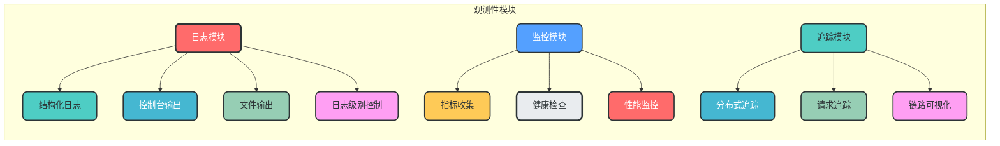
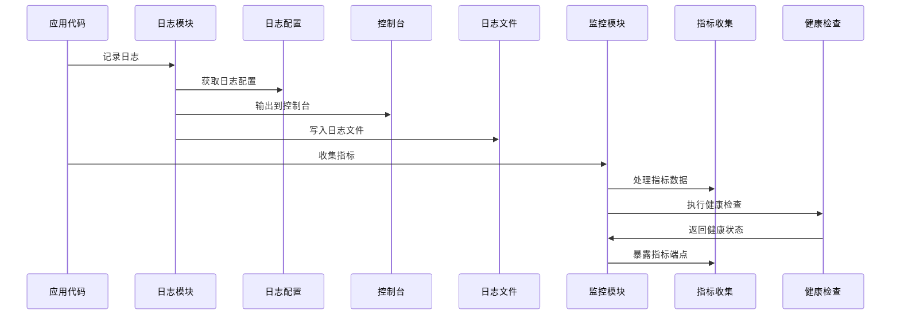

### 8. 观测性模块

**核心作用**：提供全面的监控、追踪和日志功能，便于系统的运维、调试和性能优化

**设计特点**：
- 结构化日志：支持JSON格式日志，便于分析和监控
- 请求追踪：支持分布式追踪，便于定位请求瓶颈
- 性能监控：支持指标收集，便于性能分析和优化
- 健康检查：支持系统健康状态检查
- 可扩展性：支持多种观测性工具集成

**模块架构图**：


**数据流转图**：


**日志配置说明**：
- 日志配置统一在观测性模块中管理
- 支持多环境日志配置
- 支持控制台和文件两种日志输出方式
- 支持不同日志级别配置
- 支持结构化日志格式

**关键实现**：
```python
# app/observability/logging.py
import logging
from logging.config import dictConfig
from app.config.settings import settings

LOGGING_CONFIG = {
    "version": 1,
    "disable_existing_loggers": False,
    "formatters": {
        "json": {
            "()": "pythonjsonlogger.jsonlogger.JsonFormatter",
            "format": "%(asctime)s %(name)s %(levelname)s %(message)s %(extra)s",
        },
        "console": {
            "format": "%(asctime)s - %(name)s - %(levelname)s - %(message)s",
        },
    },
    "handlers": {
        "console": {
            "class": "logging.StreamHandler",
            "formatter": "console",
            "level": "DEBUG" if settings.debug else "INFO",
        },
        "file": {
            "class": "logging.handlers.RotatingFileHandler",
            "filename": "app.log",
            "maxBytes": 1024 * 1024 * 100,  # 100MB
            "backupCount": 5,
            "formatter": "json",
            "level": "INFO",
        },
    },
    "loggers": {
        "app": {
            "handlers": ["console", "file"],
            "level": "DEBUG" if settings.debug else "INFO",
            "propagate": False,
        },
        "uvicorn": {
            "handlers": ["console"],
            "level": "INFO",
            "propagate": False,
        },
    },
}

# 配置日志
dictConfig(LOGGING_CONFIG)
logger = logging.getLogger("app")
```

**使用示例**：
```python
# 在代码中使用日志
from app.observability.logging import logger

logger.info("User created", extra={"user_id": 1, "email": "test@example.com"})
logger.error("Failed to create user", exc_info=True, extra={"email": "test@example.com"})
```