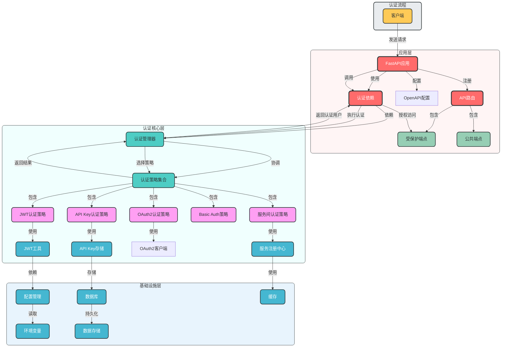
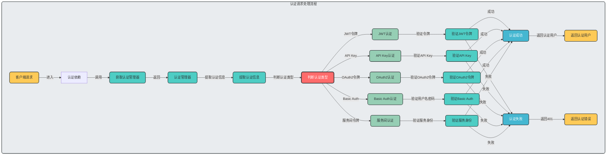

## 一、当前项目认证方式分析

### 1. 现有认证机制

- **核心方式**：基于JWT的Bearer令牌认证
- **认证流程**：用户注册 → 登录 → 获取JWT令牌 → 使用令牌访问受保护资源
- **依赖**：FastAPI的`OAuth2PasswordBearer`
- **局限性**：
    - 主要依赖用户登录场景
    - 仅支持单种认证方式
    - 缺少服务间认证支持
    - 扩展能力有限

### 2. 认证方式必要性分析

当前项目的认证方式**不必须**依赖用户登录，企业级架构应支持多种认证场景：

- ✅ **用户认证**：基于用户名密码的登录认证
- ✅ **服务间认证**：微服务架构中的服务调用
- ✅ **API Key认证**：第三方应用集成
- ✅ **Bearer令牌**：前端应用访问API
- ✅ **无状态认证**：无需用户登录的场景

## 二、企业级认证架构设计

### 1. 设计原则

- **安全优先**：采用多层安全机制，确保认证安全
- **多种认证支持**：同时支持多种认证方式
- **可扩展性**：易于添加新的认证方式
- **分层设计**：认证逻辑与业务逻辑分离
- **无状态设计**：支持水平扩展
- **统一接口**：所有认证方式提供统一的接口

### 2. 核心组件设计

### 2.1 认证方式抽象层

- **认证策略接口**：定义统一的认证方法
- **多种认证实现**：
    - JWT认证策略
    - API Key认证策略
    - OAuth2认证策略
    - Basic Auth认证策略
    - 服务间认证策略

### 2.2 认证管理器

- **认证策略注册与管理**：统一管理所有认证策略
- **认证方式选择**：根据请求选择合适的认证方式
- **认证结果处理**：统一处理认证结果

### 2.3 认证依赖工厂

- **动态依赖生成**：根据配置生成相应的认证依赖
- **灵活配置**：支持不同路由使用不同认证方式
- **环境适配**：根据环境配置不同的认证策略

### 3. 架构图设计

### 4. 认证策略流程图

## 三、无用户登录场景的认证方案

### 1. 适用场景

- 服务间调用
- 第三方应用集成
- 公共API访问控制
- 系统内部服务通信

### 2. 推荐认证方式

### 2.1 API Key认证

- **适用场景**：第三方应用集成、公共API访问
- **实现方式**：
    - 生成唯一API Key和Secret
    - 在请求头中传递API Key
    - 服务端验证API Key的有效性
    - 支持API Key的过期和撤销

### 2.2 服务间认证

- **适用场景**：微服务架构中的服务调用
- **实现方式**：
    - 基于预共享密钥的HMAC签名
    - 服务注册中心管理服务身份
    - 短期令牌机制，定期刷新
    - 支持服务身份验证和授权

### 2.3 基于IP的认证

- **适用场景**：内部服务通信、信任网络环境
- **实现方式**：
    - 配置信任IP列表
    - 验证请求来源IP
    - 结合其他认证方式使用

## 四、企业级认证设计建议

### 1. 架构设计建议

- **采用策略模式**：将不同认证方式封装为策略，便于扩展和管理
- **依赖注入优先**：使用依赖注入管理认证逻辑，提高可测试性
- **配置驱动**：通过配置文件管理认证方式，支持动态切换
- **分层设计**：认证核心逻辑与业务逻辑分离，提高可维护性

### 2. 安全最佳实践

- **使用HTTPS**：所有认证请求必须使用HTTPS
- **令牌过期机制**：设置合理的令牌过期时间
- **令牌刷新机制**：支持令牌刷新，避免频繁登录
- **认证日志**：记录所有认证请求和结果，便于审计
- **限流保护**：对认证端点实施限流，防止暴力破解

### 3. 扩展性设计

- **预留扩展点**：为新的认证方式预留扩展接口
- **插件化架构**：支持动态加载认证插件
- **统一认证接口**：所有认证方式遵循统一接口
- **文档自动化**：自动生成认证相关的API文档

### 4. 环境适配建议

- **开发环境**：宽松认证，便于开发测试
- **测试环境**：完整认证，模拟生产环境
- **生产环境**：严格认证，启用所有安全机制
- **配置隔离**：不同环境使用不同的认证配置

## 五、总结

1. **当前项目认证方式**：当前项目主要基于用户登录的JWT认证，不必须依赖用户登录，可以扩展支持多种认证方式。
2. **无用户登录场景**：建议采用API Key认证、服务间认证或基于IP的认证方式，根据具体场景选择合适的认证机制。
3. **企业级认证架构**：设计了一个支持多种认证方式、可扩展的企业级认证架构，采用策略模式和分层设计，支持灵活配置和环境适配。
4. **Mermaid架构图**：创建了两个Mermaid架构图，展示了认证组件之间的静态关系和认证请求处理流程，清晰地展示了企业级认证架构的设计。

该设计方案符合企业级架构要求，具有良好的安全性、可扩展性和可维护性，能够支持多种认证场景，包括无用户登录的情况。