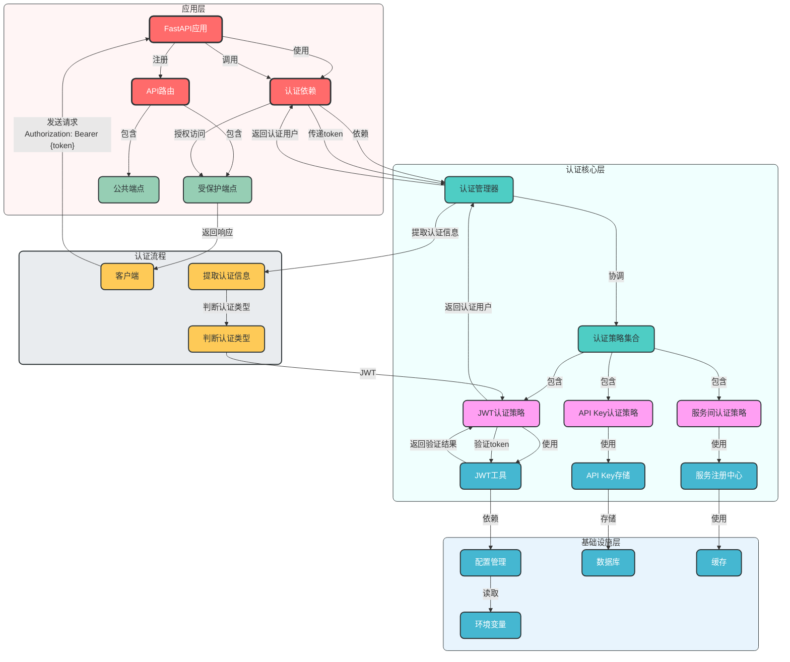
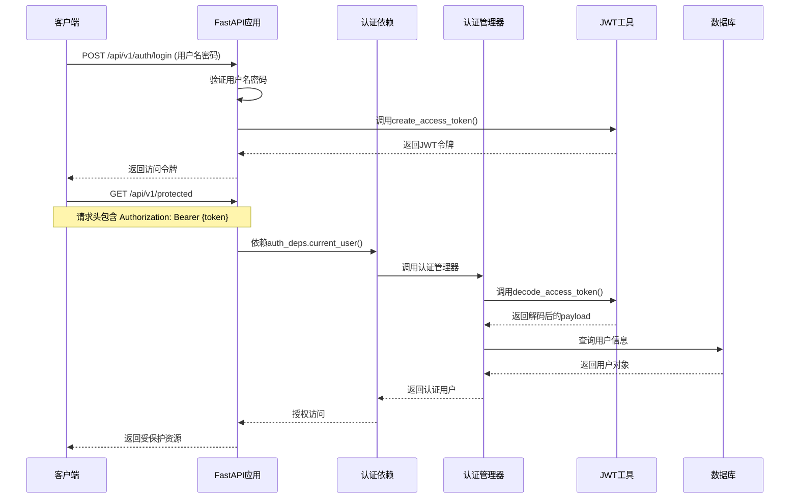
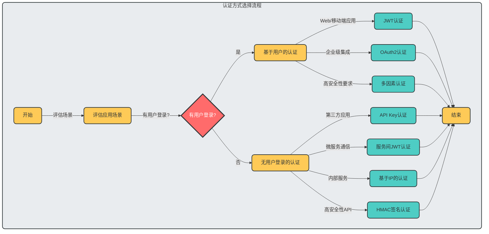
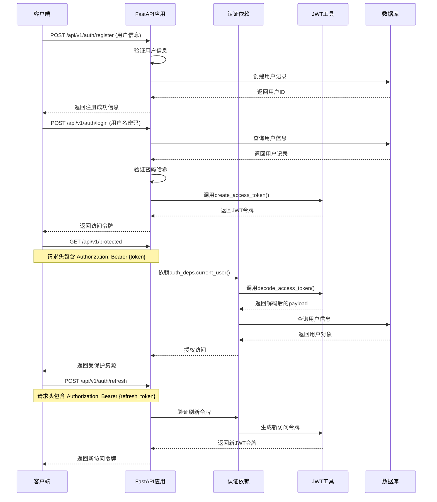
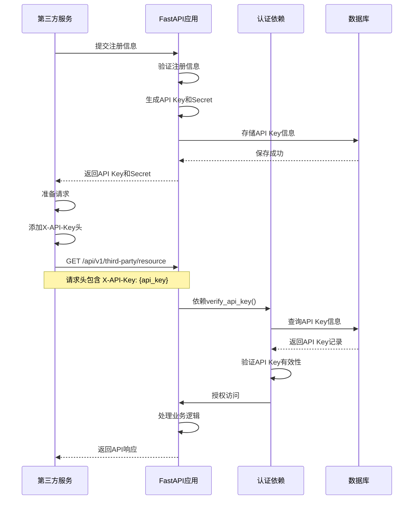
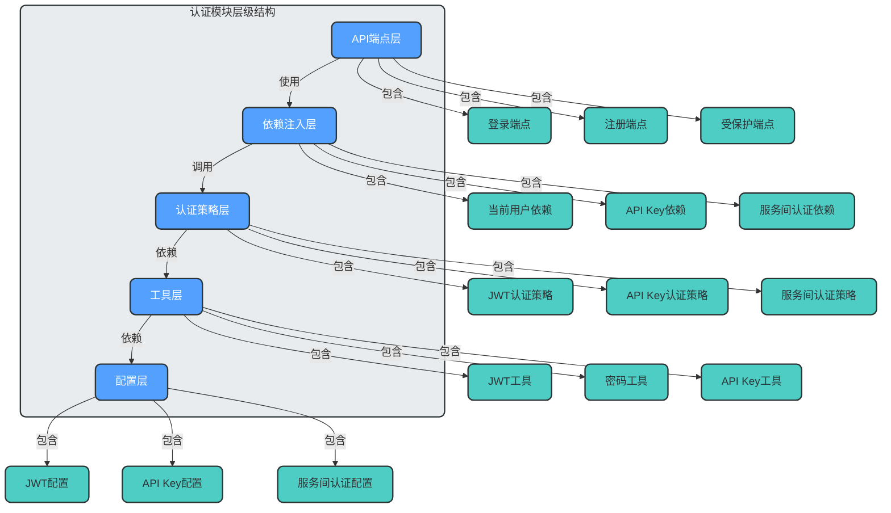
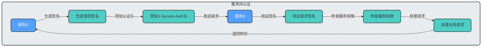
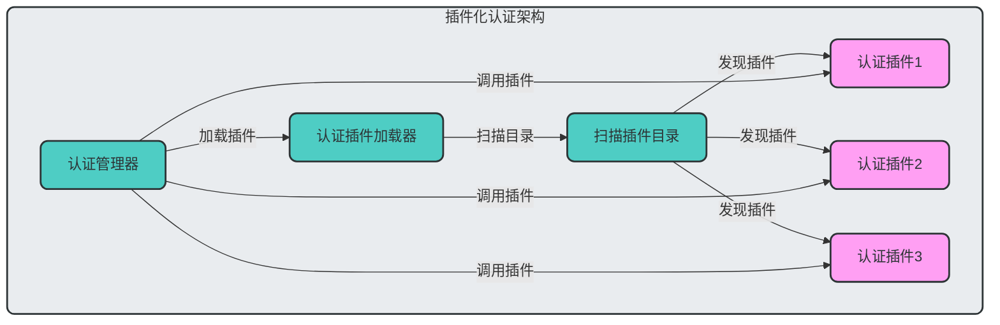

# 认证模块设计与实现

## 一、模块概述

### 1.1 认证模块定位
认证模块是企业级API框架的核心安全组件，负责验证请求的合法性和授权访问。本模块基于FastAPI框架，设计了一套灵活、可扩展的认证架构，支持多种认证方式，满足不同场景的需求。

### 1.2 设计目标
- **安全优先**：采用多层安全机制，确保认证安全
- **多种认证支持**：同时支持JWT、API Key、服务间认证等多种方式
- **可扩展性**：易于添加新的认证方式
- **分层设计**：认证逻辑与业务逻辑分离
- **无状态设计**：支持水平扩展
- **统一接口**：所有认证方式提供统一的接口

## 二、认证架构设计

### 2.1 架构图



### 2.2 核心组件说明

| 组件 | 职责 | 代码位置 |
|------|------|----------|
| 认证依赖 | 提供认证相关的依赖注入 | `app/dependencies/auth.py` |
| JWT工具 | 生成和验证JWT令牌 | `app/utils/jwt.py` |
| 认证API | 提供登录、注册等认证端点 | `app/api/v1/auth.py` |
| 认证策略 | 不同认证方式的具体实现 | 待扩展 |
| 认证管理器 | 协调不同认证策略 | 待实现 |

## 三、认证流程详解

### 3.1 JWT认证流程



### 3.2 认证请求处理流程

```mermaid
graph TD
    %% 认证请求处理流程
    subgraph AuthRequestFlow["认证请求处理流程"]
        Request["客户端请求<br/>Authorization: Bearer {token}"] -->|进入| AuthDeps[认证依赖]
        AuthDeps -->|调用| GetAuthManager[获取认证管理器]
        GetAuthManager -->|返回| AuthManager[认证管理器]
        AuthManager -->|提取token| ExtractToken[提取JWT令牌]
        ExtractToken -->|解码token| DecodeToken[解码JWT令牌]
        DecodeToken -->|验证有效性| ValidateToken[验证令牌有效性]
        ValidateToken -->|检查过期时间| CheckExpiry[检查过期时间]
        CheckExpiry -->|获取用户ID| GetUserID[从payload获取sub]
        GetUserID -->|查询用户| QueryUser[查询数据库获取用户]
        QueryUser -->|返回用户| ReturnUser[返回认证用户]
        ReturnUser -->|授权访问| GrantAccess[授权访问受保护资源]
        GrantAccess -->|返回响应| Response[返回API响应]

        %% 错误处理分支
        DecodeToken -->|解码失败| AuthError[认证错误]
        ValidateToken -->|无效令牌| AuthError
        CheckExpiry -->|令牌过期| AuthError
        QueryUser -->|用户不存在| AuthError
        AuthError -->|返回401| ErrorResponse[返回401错误]
    end

    %% 样式定义
    classDef flowStyle fill:#FECA57,stroke:#2D3436,stroke-width:2px,color:#2D3436,rx:8,ry:8
    classDef processStyle fill:#4ECDC4,stroke:#2D3436,stroke-width:2px,color:#2D3436,rx:8,ry:8
    classDef decisionStyle fill:#FF6B6B,stroke:#2D3436,stroke-width:3px,color:white,rx:8,ry:8
    classDef resultStyle fill:#45B7D1,stroke:#2D3436,stroke-width:2px,color:white,rx:8,ry:8
    classDef errorStyle fill:#FF6B6B,stroke:#2D3436,stroke-width:2px,color:white,rx:8,ry:8

    %% 样式应用
    class Request,Response,ErrorResponse flowStyle
    class AuthDeps,GetAuthManager,ExtractToken,DecodeToken,ValidateToken,CheckExpiry,GetUserID,QueryUser,GrantAccess processStyle
    class AuthManager decisionStyle
    class ReturnUser resultStyle
    class AuthError errorStyle

    %% 子图样式
    style AuthRequestFlow fill:#E9ECEF,stroke:#2D3436,stroke-width:2px,rx:8,ry:8
```



## 四、核心组件实现

### 4.1 认证依赖实现

## 五、认证方式选择与流程指南

### 5.1 认证方式选择矩阵

根据不同的场景和需求，选择合适的认证方式是认证模块设计的关键。以下是认证方式选择矩阵，帮助您根据具体情况做出决策：

| 场景类型 | 有用户登录 | 无用户登录 | 推荐认证方式 | 安全性 | 集成复杂度 |
|----------|------------|------------|--------------|--------|------------|
| Web应用 | ✅ | ❌ | JWT认证 | 高 | 中等 |
| 移动端应用 | ✅ | ❌ | JWT认证 + 刷新令牌 | 高 | 复杂 |
| 第三方应用集成 | ❌ | ✅ | API Key认证 | 中等 | 简单 |
| 微服务通信 | ❌ | ✅ | 服务间JWT认证 | 高 | 中等 |
| 公共API访问 | ❌ | ✅ | API Key认证 | 中等 | 简单 |
| 企业级应用集成 | ✅ | ✅ | OAuth2认证 | 高 | 复杂 |
| 内部服务通信 | ❌ | ✅ | 基于IP的认证 | 低 | 简单 |
| 高安全性要求API | ✅ | ✅ | HMAC签名认证 | 高 | 中等 |

### 5.2 认证方式分类与技术实现

#### 5.2.1 基于用户的认证

| 认证方式 | 技术实现 | 核心组件 | 适用场景 |
|----------|----------|----------|----------|
| JWT认证 | JWT令牌 + 密码哈希 | `app/utils/jwt.py` | Web应用、移动端应用 |
| OAuth2认证 | OAuth2协议 + JWT | `fastapi.security.OAuth2PasswordBearer` | 企业级应用集成 |
| 多因素认证 | JWT + 短信/邮箱验证码 | 待实现 | 高安全性要求的用户登录 |

#### 5.2.2 无用户登录的认证

| 认证方式 | 技术实现 | 核心组件 | 适用场景 |
|----------|----------|----------|----------|
| API Key认证 | 唯一标识符 + 验证逻辑 | 待实现 | 第三方应用集成、公共API |
| 服务间JWT认证 | JWT令牌 + 服务标识符 | 待实现 | 微服务通信 |
| HMAC签名认证 | 共享密钥 + 哈希算法 | 待实现 | 高安全性API |
| 基于IP的认证 | IP白名单 + 验证逻辑 | 待实现 | 内部服务通信 |

### 5.3 详细认证流程

#### 5.3.1 认证方式选择流程



#### 5.3.2 基于用户的JWT认证完整流程



#### 5.3.3 无用户登录的API Key认证流程



### 5.4 认证方式的技术实现细节

#### 5.4.1 Swagger UI认证与端点认证的区别

| 特性 | Swagger UI认证 | 端点认证 |
|------|----------------|----------|
| 用途 | 用于API文档测试，方便开发者在UI中测试API | 用于实际API端点的安全保护，验证请求合法性 |
| 实现方式 | 通过OpenAPI文档配置 | 通过FastAPI依赖注入实现 |
| 生效范围 | 仅在Swagger UI中生效 | 对所有API请求生效 |
| 配置位置 | `app.openapi_schema` | 路由依赖中 |
| 安全性 | 仅用于开发测试 | 实际生产环境安全保障 |

#### 5.4.2 认证方式的技术栈对比

| 认证方式 | 核心技术 | 依赖库 | 实现难度 | 性能 |
|----------|----------|--------|----------|------|
| JWT认证 | JWT、密码哈希 | jose、passlib | 中等 | 高 |
| API Key认证 | API Key验证 | 无特殊依赖 | 简单 | 高 |
| OAuth2认证 | OAuth2协议 | fastapi.security | 复杂 | 中 |
| HMAC签名认证 | HMAC算法 | hashlib | 中等 | 中 |
| 服务间JWT认证 | JWT、服务标识 | jose | 中等 | 高 |

### 5.5 认证模块的层级结构

认证模块采用分层设计，确保各组件职责清晰，便于扩展和维护：



### 5.6 认证流程总结

1. **基于用户的认证流程**：
   - 用户注册 → 登录获取令牌 → 使用令牌访问受保护资源 → 令牌过期刷新
   - 核心技术：JWT令牌、密码哈希、OAuth2协议
   - 适用场景：Web应用、移动端应用、企业级应用

2. **无用户登录的认证流程**：
   - 第三方服务注册获取API Key → 使用API Key访问API → 服务端验证API Key
   - 核心技术：API Key、JWT、HMAC签名
   - 适用场景：第三方应用集成、微服务通信、公共API

3. **Swagger UI与端点认证**：
   - Swagger UI认证：仅用于开发测试，方便在UI中测试API
   - 端点认证：实际生产环境的安全保障，对所有请求生效
   - 两者配合使用，提高开发效率和安全性

通过本章节的说明，希望能够帮助您理清认证模块的各种认证方式、技术实现和流程，根据具体场景选择合适的认证方式。

## 六、核心组件实现

### 6.1 认证依赖实现

```python
# app/dependencies/auth.py
from fastapi import Depends, HTTPException, status
from fastapi.security import OAuth2PasswordBearer
from sqlalchemy.orm import Session
from jose import JWTError, jwt

# OAuth2密码Bearer模式
oauth2_scheme = OAuth2PasswordBearer(
    tokenUrl=f"{get_app_settings().API_V1_STR}/auth/login"
)

def get_current_user(
    token: str = Depends(oauth2_scheme),
    db: Session = Depends(get_sqlite_db),
):
    """获取当前认证用户"""
    credentials_exception = HTTPException(
        status_code=status.HTTP_401_UNAUTHORIZED,
        detail="Could not validate credentials",
        headers={"WWW-Authenticate": "Bearer"},
    )

    try:
        # 解码JWT令牌
        settings = get_app_settings()
        payload = jwt.decode(
            token, settings.SECRET_KEY, algorithms=[settings.ALGORITHM]
        )
        user_id: str = payload.get("sub")
        if user_id is None:
            raise credentials_exception
    except JWTError:
        raise credentials_exception

    # 查询用户
    from app.domains.user.models.user import User
    user = db.query(User).filter(User.id == int(user_id)).first()
    if user is None:
        raise credentials_exception

    return user

# 认证依赖注入容器
class AuthDeps:
    """认证依赖注入容器，提供统一的认证依赖访问接口"""

    @staticmethod
    def current_user():
        """当前认证用户依赖"""
        return Depends(get_current_user)

    @staticmethod
    def oauth2():
        """OAuth2密码Bearer模式依赖"""
        return Depends(oauth2_scheme)

# 创建依赖容器实例
auth_deps = AuthDeps()
```

### 4.2 JWT工具实现

```python
# app/utils/jwt.py
from datetime import datetime, timedelta
from typing import Optional
from jose import JWTError, jwt
from app.dependencies.config import app_settings

def create_access_token(data: dict, expires_delta: Optional[timedelta] = None) -> str:
    """生成访问令牌"""
    to_encode = data.copy()
    if expires_delta:
        expire = datetime.utcnow() + expires_delta
    else:
        expire = datetime.utcnow() + timedelta(minutes=app_settings.ACCESS_TOKEN_EXPIRE_MINUTES)
    to_encode.update({"exp": expire})
    encoded_jwt = jwt.encode(to_encode, app_settings.SECRET_KEY, algorithm=app_settings.ALGORITHM)
    return encoded_jwt

def decode_access_token(token: str) -> Optional[dict]:
    """解码访问令牌"""
    try:
        payload = jwt.decode(token, app_settings.SECRET_KEY, algorithms=[app_settings.ALGORITHM])
        return payload
    except JWTError:
        return None
```

### 4.3 认证API实现

```python
# app/api/v1/auth.py
from fastapi import APIRouter, Depends, HTTPException, status, Request
from fastapi.security import OAuth2PasswordRequestForm
from app.domains.user.schemas.user import UserCreate, UserResponse, Token
from app.dependencies.service import get_user_service

router = APIRouter()

@router.post(
    "/register", response_model=UserResponse, status_code=status.HTTP_201_CREATED
)
def register(
    user_create: UserCreate,
    user_service = Depends(get_user_service),
):
    """用户注册"""
    user = user_service.create_user(user_create)
    return user

@router.post("/login", response_model=Token)
def login(
    request: Request,
    form_data: OAuth2PasswordRequestForm = Depends(),
    user_service = Depends(get_user_service),
):
    """用户登录"""
    # 获取客户端IP地址
    client_ip = request.client.host if request.client else "unknown"

    # 验证用户
    user = user_service.authenticate_user(form_data.username, form_data.password)

    # 生成访问令牌，传递IP地址
    access_token = user_service.generate_token(user, ip_address=client_ip)

    return {
        "access_token": access_token,
        "token_type": "bearer",
        "expires_in": app_settings.ACCESS_TOKEN_EXPIRE_MINUTES * 60,
    }
```

## 五、无用户登录场景的认证方案

### 5.1 API Key认证

**适用场景**：第三方应用集成、公共API访问

**实现思路**：
1. 生成唯一API Key和Secret
2. 在请求头中传递API Key
3. 服务端验证API Key的有效性
4. 支持API Key的过期和撤销

**代码示例**：
```python
# 待实现：API Key认证策略
class APIKeyStrategy:
    def authenticate(self, api_key: str) -> Optional[User]:
        # 验证API Key并返回用户信息
        pass
```

### 5.2 服务间认证

**适用场景**：微服务架构中的服务调用

**实现思路**：
1. 基于预共享密钥的HMAC签名
2. 服务注册中心管理服务身份
3. 短期令牌机制，定期刷新
4. 支持服务身份验证和授权

**架构设计**：


### 5.3 基于IP的认证

**适用场景**：内部服务通信、信任网络环境

**实现思路**：
1. 配置信任IP列表
2. 验证请求来源IP
3. 结合其他认证方式使用

## 六、安全最佳实践

### 6.1 令牌安全
- 使用强密钥生成JWT令牌
- 设置合理的令牌过期时间
- 实现令牌刷新机制
- 支持令牌撤销
- 传输过程中使用HTTPS加密

### 6.2 认证日志
- 记录所有认证请求和结果
- 记录客户端IP地址
- 记录认证方式和结果
- 定期审计认证日志

### 6.3 限流保护
- 对认证端点实施限流
- 防止暴力破解攻击
- 实现渐进式延迟

### 6.4 数据保护
- 密码使用bcrypt等强哈希算法
- 敏感数据加密存储
- 最小权限原则

## 七、扩展性设计

### 7.1 插件化认证架构



### 7.2 添加新认证方式的步骤
1. 创建认证策略类，实现统一接口
2. 注册到认证管理器
3. 配置认证规则
4. 更新API文档

## 八、代码示例和使用指南

### 8.1 保护API端点

```python
# 在路由中使用认证依赖
from fastapi import APIRouter
from app.dependencies.auth import auth_deps

router = APIRouter()

@router.get("/protected")
def protected_route(current_user = auth_deps.current_user()):
    """受保护的API端点"""
    return {"message": "Hello, world!", "user": current_user.username}
```

### 8.2 配置认证参数

```python
# app/config/settings.py
class Settings(BaseSettings):
    # JWT配置
    SECRET_KEY: str = "your-secret-key"
    ALGORITHM: str = "HS256"
    ACCESS_TOKEN_EXPIRE_MINUTES: int = 30
    
    # API Key配置
    API_KEY_HEADER: str = "X-API-Key"
    API_KEY_SECRET: str = "your-api-key-secret"
    
    # 服务间认证配置
    SERVICE_AUTH_HEADER: str = "X-Service-Auth"
    SERVICE_SECRET: str = "your-service-secret"
```

## 九、总结

本认证模块设计了一套灵活、可扩展的企业级认证架构，支持多种认证方式，满足不同场景的需求。当前实现了基于JWT的用户认证，同时预留了API Key、服务间认证等扩展点。

### 9.1 优势
- **安全性高**：采用多层安全机制，确保认证安全
- **可扩展性强**：易于添加新的认证方式
- **使用简单**：提供统一的依赖注入接口
- **无状态设计**：支持水平扩展
- **文档完整**：结合代码和mermaid图进行说明

### 9.2 未来规划
- 实现认证管理器，支持多种认证策略
- 添加API Key认证和服务间认证
- 实现令牌刷新机制
- 添加认证日志和审计功能
- 支持细粒度的权限控制

该设计方案符合企业级架构要求，具有良好的安全性、可扩展性和可维护性，能够支持多种认证场景，包括无用户登录的情况。