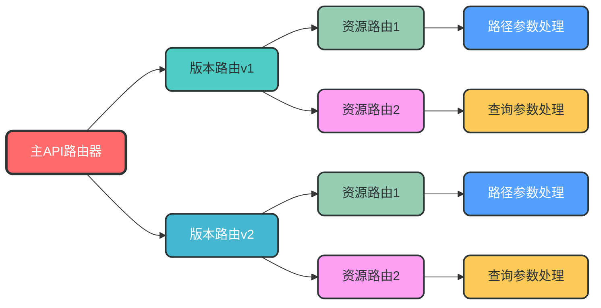
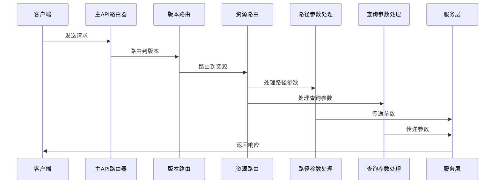

### 3. 路由与API版本控制

**核心作用**：处理HTTP请求，支持API版本控制，实现路由与业务逻辑分离

**设计特点**：
- 支持URL路径版本控制
- 支持Header版本控制
- 路由自动注册
- 支持路由分组

**模块架构图**：


**数据流转图**：


**关键实现**：
```python
# app/api/__init__.py
from fastapi import APIRouter
from app.api.v1 import api_router as v1_router
from app.api.v2 import api_router as v2_router

# 主API路由器
api_router = APIRouter(prefix="/api")

# 注册版本路由
api_router.include_router(v1_router, prefix="/v1", tags=["v1"])
api_router.include_router(v2_router, prefix="/v2", tags=["v2"])
```