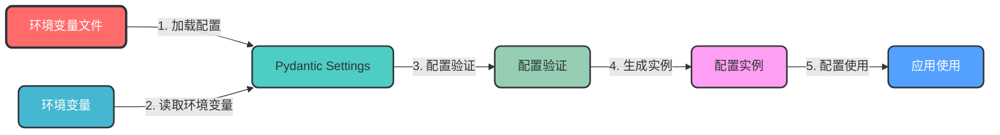
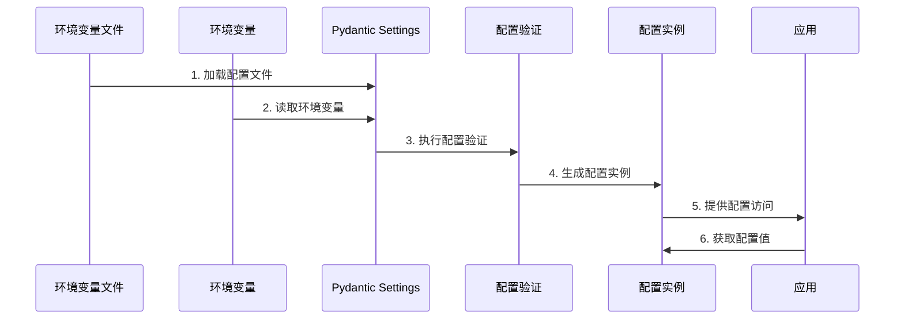

### 1. 配置管理模块

**核心作用**：统一管理多环境配置，支持动态配置更新，避免硬编码

**设计特点**：
- 使用Pydantic Settings进行类型安全的配置管理
- 支持多环境配置文件（.env.dev, .env.test, .env.prod）
- 支持环境变量覆盖配置文件
- 配置热更新支持
- 配置验证机制

**模块架构图**：


**数据流转图**：


**关键实现**：
```python
# app/config/settings.py
from pydantic_settings import BaseSettings
from typing import Optional

class DatabaseSettings(BaseSettings):
    """数据库配置"""
    url: str
    echo: bool = False
    pool_size: int = 10
    max_overflow: int = 20

class RedisSettings(BaseSettings):
    """Redis配置"""
    url: str
    db: int = 0

class SecuritySettings(BaseSettings):
    """安全配置"""
    secret_key: str
    algorithm: str = "HS256"
    access_token_expire_minutes: int = 30

class AppSettings(BaseSettings):
    """应用配置"""
    name: str = "FastAPI Enterprise"
    version: str = "1.0.0"
    debug: bool = False
    
    # 子配置
    database: DatabaseSettings = DatabaseSettings()
    redis: RedisSettings = RedisSettings()
    security: SecuritySettings = SecuritySettings()

    class Config:
        env_file = ".env"
        env_nested_delimiter = "__"

# 全局配置实例
settings = AppSettings()
```