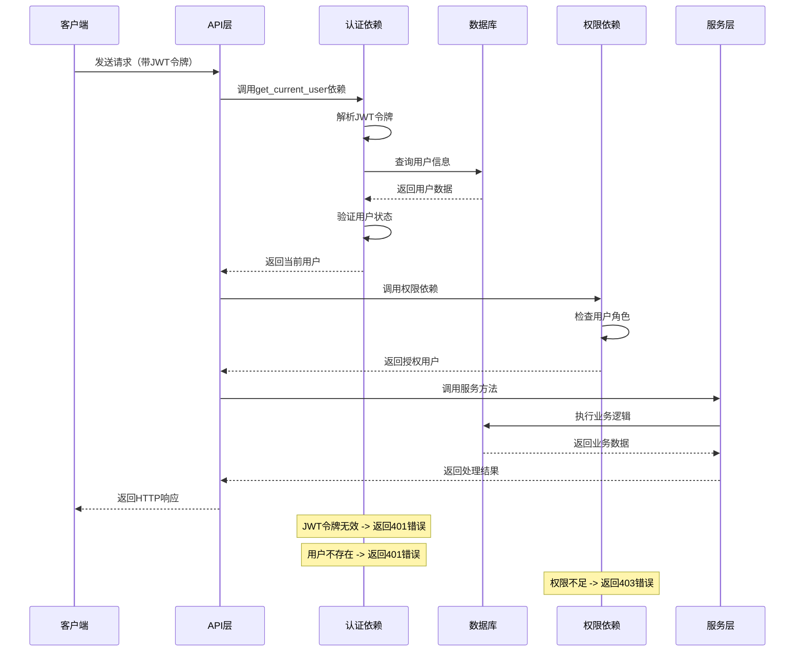
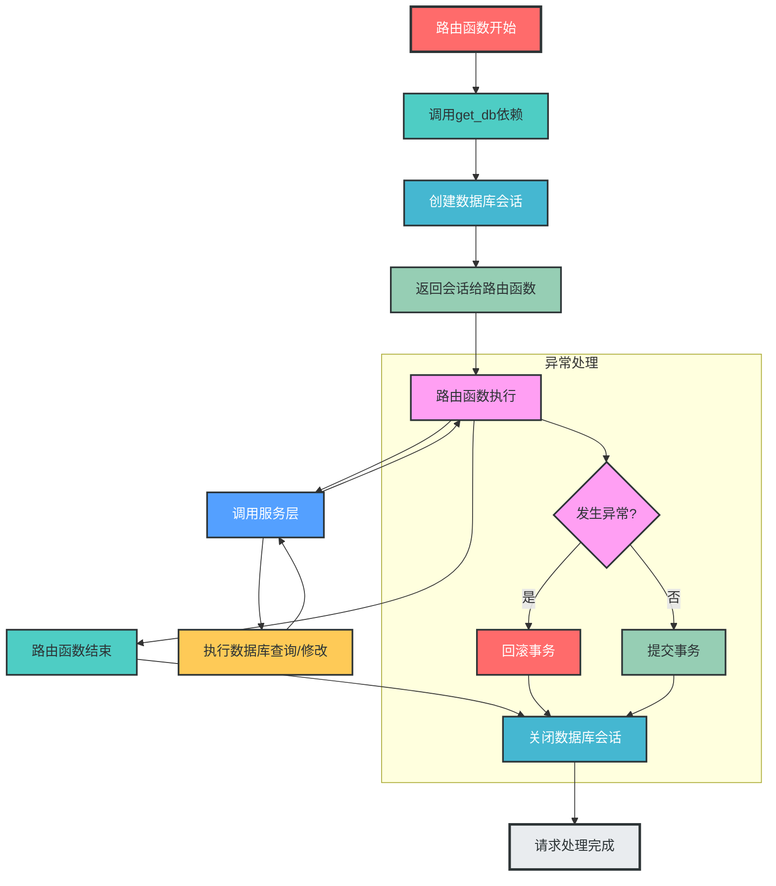
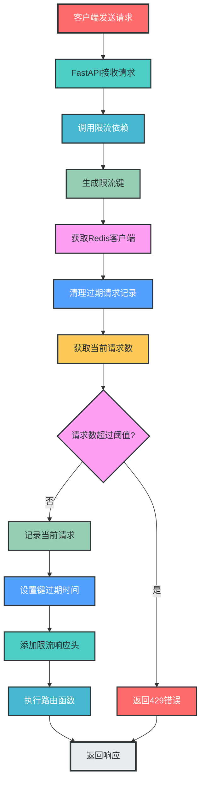
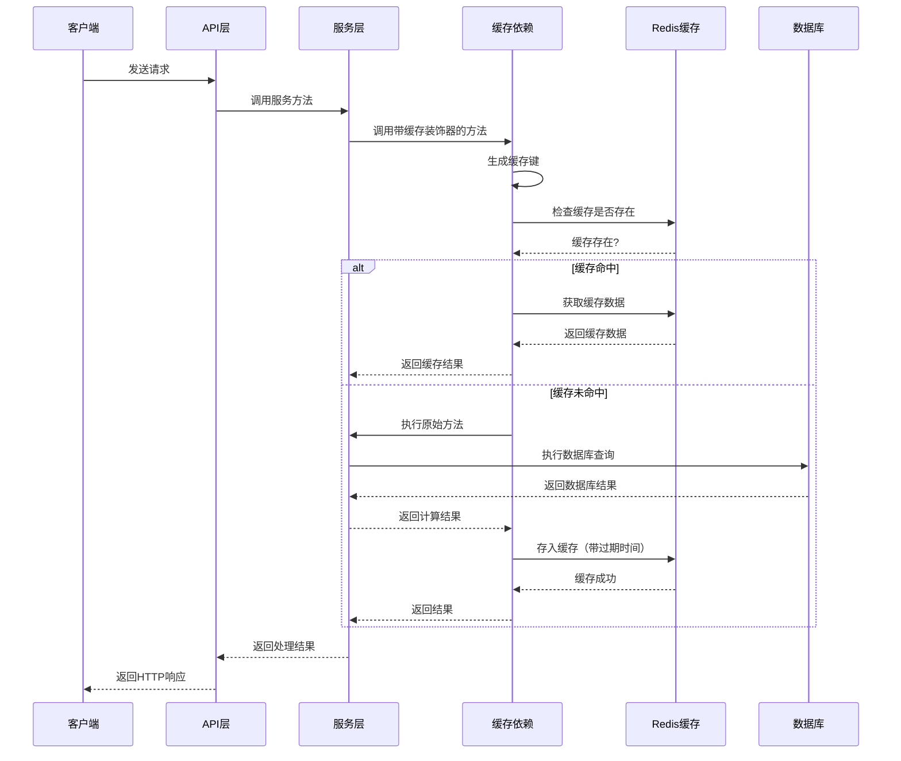

# FastAPI依赖注入模块设计说明

## 一、依赖注入概述

### 1. 核心概念

**依赖注入（Dependency Injection, DI）** 是一种设计模式，它通过**外部容器**向对象提供其所依赖的组件，而不是让对象自己创建或查找依赖。在FastAPI中，依赖注入系统是框架的核心特性之一，用于管理应用的各种依赖关系。

### 2. 核心作用

- 集中管理通用依赖 ：将认证、数据库连接、限流等通用逻辑集中到一个模块中
- 实现关注点分离 ：让路由函数更专注于业务逻辑，而非基础设施代码
- 支持依赖嵌套和组合 ：复杂依赖可以由多个简单依赖组合而成
- 提高代码可测试性 ：便于在测试中替换真实依赖为模拟实现
- 支持依赖作用域管理 ：如请求级依赖（每次请求创建新实例）、应用级依赖（全局共享实例）

## 二、依赖注入模块目录结构

```
app/                     # 应用核心目录
├── dependencies/        # 依赖注入模块
│   ├── __init__.py      # 依赖导出与模块配置
│   ├── auth.py          # 认证相关依赖
│   ├── db.py            # 数据库连接依赖
│   ├── rate_limit.py    # 限流依赖
│   ├── role.py          # 角色权限依赖
│   ├── cache.py         # 缓存依赖
│   └── logging.py       # 日志相关依赖
├── routes/              # 路由模块（使用依赖）
├── services/            # 服务层（使用依赖）
└── main.py              # 应用入口（配置依赖）
```

## 三、核心依赖实现示例

### 1. 数据库依赖

```python
# app/dependencies/db.py
from typing import Generator
from sqlalchemy.orm import Session
from app.databases.mysql.connection import mysql_connection

# MySQL数据库依赖
def get_mysql_db() -> Generator[Session, None, None]:
    """获取MySQL数据库会话（请求级依赖）
    
    - 每次请求创建新的数据库会话
    - 请求结束后自动关闭会话
    - 支持事务管理
    """
    db = next(mysql_connection.get_session())
    try:
        yield db
    finally:
        db.close()

# Redis缓存依赖
def get_redis_client():
    """获取Redis客户端（应用级依赖）
    
    - 全局共享同一个Redis客户端实例
    - 应用启动时创建，关闭时销毁
    """
    from app.databases.redis.client import redis_client
    return redis_client.client
```

### 2. 认证依赖

```python
# app/dependencies/auth.py
from fastapi import Depends, HTTPException, status
from fastapi.security import OAuth2PasswordBearer, HTTPBearer
from jose import JWTError, jwt
from sqlalchemy.orm import Session
from app.config.settings import settings
from app.dependencies.db import get_mysql_db
from app.models.user import User
from app.logger.config import logger

# OAuth2密码流配置
oauth2_scheme = OAuth2PasswordBearer(
    tokenUrl="/api/v1/auth/token",
    scheme_name="JWT Authentication"
)

# HTTP Bearer认证
bearer_scheme = HTTPBearer()

def get_current_user(
    token: str = Depends(oauth2_scheme),
    db: Session = Depends(get_mysql_db)
) -> User:
    """获取当前登录用户
    
    - 解析JWT令牌
    - 验证令牌有效性
    - 查询用户信息
    - 验证用户状态
    """
    credentials_exception = HTTPException(
        status_code=status.HTTP_401_UNAUTHORIZED,
        detail="无效的认证凭据",
        headers={"WWW-Authenticate": "Bearer"},
    )
    
    try:
        # 解码JWT令牌
        payload = jwt.decode(
            token,
            settings.SECRET_KEY,
            algorithms=[settings.ALGORITHM]
        )
        
        # 获取用户ID
        user_id: str = payload.get("sub")
        if user_id is None:
            logger.error("JWT令牌缺少sub字段")
            raise credentials_exception
            
        # 获取令牌过期时间
        exp: int = payload.get("exp")
        if exp is None:
            logger.error("JWT令牌缺少exp字段")
            raise credentials_exception
            
    except JWTError as e:
        logger.error(f"JWT解码失败: {str(e)}")
        raise credentials_exception
    
    # 查询用户
    user = db.query(User).filter(User.id == user_id).first()
    if user is None:
        logger.error(f"用户不存在: {user_id}")
        raise credentials_exception
    
    # 验证用户状态
    if not user.is_active:
        logger.error(f"用户已禁用: {user_id}")
        raise HTTPException(
            status_code=status.HTTP_403_FORBIDDEN,
            detail="用户已被禁用"
        )
    
    logger.info(f"用户认证成功: {user.username} ({user.id})")
    return user

def get_current_active_user(
    current_user: User = Depends(get_current_user)
) -> User:
    """获取当前活跃用户"""
    if not current_user.is_active:
        raise HTTPException(status_code=400, detail="用户已禁用")
    return current_user
```

### 3. 权限依赖

```python
# app/dependencies/role.py
from fastapi import Depends, HTTPException, status
from typing import List, Callable
from app.dependencies.auth import get_current_active_user
from app.models.user import User
from app.logger.config import logger

def get_user_with_roles(required_roles: List[str]) -> Callable:
    """基于角色的权限控制依赖生成器
    
    - 支持多个角色的OR逻辑（满足任意一个角色即可）
    - 角色名称区分大小写
    - 自动处理用户角色验证
    
    Args:
        required_roles: 需要的角色列表
        
    Returns:
        权限检查函数
    """
    def role_checker(current_user: User = Depends(get_current_active_user)) -> User:
        """检查用户是否具有所需角色"""
        # 检查用户角色
        has_role = any(role in current_user.roles for role in required_roles)
        
        if not has_role:
            logger.error(
                f"用户 {current_user.username} 缺少必需角色: {required_roles}, 当前角色: {current_user.roles}"
            )
            raise HTTPException(
                status_code=status.HTTP_403_FORBIDDEN,
                detail=f"需要以下角色之一: {required_roles}"
            )
        
        logger.info(
            f"用户 {current_user.username} 角色验证成功: {required_roles}"
        )
        return current_user
    
    return role_checker

# 预定义的角色检查器
get_admin_user = get_user_with_roles(["admin"])
get_superuser = get_user_with_roles(["superuser"])
get_staff_user = get_user_with_roles(["admin", "staff"])
get_user_or_admin = get_user_with_roles(["user", "admin"])
```

### 4. 限流依赖

```python
# app/dependencies/rate_limit.py
from fastapi import Depends, HTTPException, status, Request
from app.dependencies.redis import get_redis_client
from app.logger.config import logger
import time
from typing import Callable

def rate_limiter(max_requests: int, window_seconds: int) -> Callable:
    """限流依赖生成器
    
    - 基于Redis实现的滑动窗口限流
    - 支持自定义请求次数和时间窗口
    
    Args:
        max_requests: 时间窗口内最大请求数
        window_seconds: 时间窗口大小（秒）
        
    Returns:
        限流检查函数
    """
    def limiter(request: Request, redis_client = Depends(get_redis_client)):
        """限流检查函数"""
        # 生成限流键（基于IP或用户ID）
        client_ip = request.client.host
        path = request.url.path
        rate_limit_key = f"rate_limit:{client_ip}:{path}"
        
        current_time = time.time()
        window_start = current_time - window_seconds
        
        # 使用管道减少Redis请求
        pipe = redis_client.pipeline()
        
        # 移除时间窗口外的请求记录
        pipe.zremrangebyscore(rate_limit_key, 0, window_start)
        
        # 获取当前时间窗口内的请求数
        pipe.zcard(rate_limit_key)
        
        # 添加当前请求记录
        pipe.zadd(rate_limit_key, {str(current_time): current_time})
        
        # 设置键过期时间
        pipe.expire(rate_limit_key, window_seconds)
        
        # 执行所有命令
        results = pipe.execute()
        current_requests = results[1]
        
        # 检查是否超过限流阈值
        if current_requests >= max_requests:
            logger.warning(
                f"IP {client_ip} 访问 {path} 超过限流: {current_requests}/{max_requests} in {window_seconds}s"
            )
            raise HTTPException(
                status_code=status.HTTP_429_TOO_MANY_REQUESTS,
                detail="请求过于频繁，请稍后再试",
                headers={
                    "Retry-After": str(window_seconds),
                    "X-RateLimit-Limit": str(max_requests),
                    "X-RateLimit-Remaining": "0"
                }
            )
        
        # 计算剩余请求次数
        remaining = max_requests - current_requests - 1
        
        # 添加响应头
        request.state.rate_limit_headers = {
            "X-RateLimit-Limit": str(max_requests),
            "X-RateLimit-Remaining": str(remaining),
            "X-RateLimit-Reset": str(int(current_time + window_seconds))
        }
        
        logger.debug(
            f"IP {client_ip} 访问 {path} 限流检查通过: {current_requests+1}/{max_requests} in {window_seconds}s"
        )
    
    return limiter

# 预定义的限流策略
get_strict_rate_limit = rate_limiter(max_requests=10, window_seconds=60)  # 每分钟10次
get_normal_rate_limit = rate_limiter(max_requests=100, window_seconds=60)  # 每分钟100次
get_relaxed_rate_limit = rate_limiter(max_requests=1000, window_seconds=60)  # 每分钟1000次
```

### 5. 缓存依赖

```python
# app/dependencies/cache.py
from typing import Optional, Any, Callable
from functools import wraps
from app.dependencies.redis import get_redis_client
from app.logger.config import logger
import json

def cache_key_generator(func: Callable, *args, **kwargs) -> str:
    """生成缓存键
    
    - 基于函数名和参数生成唯一键
    - 支持基本类型参数的序列化
    """
    args_str = ":".join([str(arg) for arg in args])
    kwargs_str = ":".join([f"{k}={v}" for k, v in sorted(kwargs.items())])
    return f"cache:{func.__module__}:{func.__name__}:{args_str}:{kwargs_str}"

def cache(duration: int = 3600) -> Callable:
    """缓存装饰器
    
    - 自动缓存函数返回值
    - 支持自定义缓存时长
    - 支持缓存键自动生成
    - 支持缓存失效机制
    
    Args:
        duration: 缓存时长（秒），默认1小时
        
    Returns:
        装饰器函数
    """
    def decorator(func: Callable) -> Callable:
        @wraps(func)
        async def async_wrapper(*args, **kwargs):
            """异步函数缓存包装器"""
            # 生成缓存键
            cache_key = cache_key_generator(func, *args, **kwargs)
            
            # 获取Redis客户端
            redis_client = get_redis_client()
            
            # 尝试从缓存获取
            cached_result = redis_client.get(cache_key)
            if cached_result:
                logger.debug(f"从缓存获取结果: {cache_key}")
                return json.loads(cached_result)
            
            # 执行函数获取结果
            result = await func(*args, **kwargs)
            
            # 存入缓存
            redis_client.setex(cache_key, duration, json.dumps(result))
            logger.debug(f"结果存入缓存: {cache_key}, 时长: {duration}s")
            
            return result
        
        @wraps(func)
        def sync_wrapper(*args, **kwargs):
            """同步函数缓存包装器"""
            # 生成缓存键
            cache_key = cache_key_generator(func, *args, **kwargs)
            
            # 获取Redis客户端
            redis_client = get_redis_client()
            
            # 尝试从缓存获取
            cached_result = redis_client.get(cache_key)
            if cached_result:
                logger.debug(f"从缓存获取结果: {cache_key}")
                return json.loads(cached_result)
            
            # 执行函数获取结果
            result = func(*args, **kwargs)
            
            # 存入缓存
            redis_client.setex(cache_key, duration, json.dumps(result))
            logger.debug(f"结果存入缓存: {cache_key}, 时长: {duration}s")
            
            return result
        
        # 根据函数类型返回相应的包装器
        return async_wrapper if func.__code__.co_flags & 0x80 else sync_wrapper
    
    return decorator
```

## 四、依赖注入的使用方式

### 1. 路由函数中使用依赖

```python
from fastapi import APIRouter, Depends
from sqlalchemy.orm import Session
from typing import List
from app.dependencies.db import get_mysql_db
from app.dependencies.auth import get_current_active_user
from app.dependencies.role import get_admin_user
from app.dependencies.rate_limit import get_normal_rate_limit
from app.models.user import User
from app.schemas.v1.user import UserCreate, UserUpdate, UserResponse
from app.services.v1.user_service import UserService

router = APIRouter(prefix="/users", tags=["用户管理"])

# GET /api/v1/users
@router.get(
    "/", 
    response_model=List[UserResponse],
    dependencies=[Depends(get_normal_rate_limit)]  # 限流依赖
)
def get_users(
    skip: int = 0, 
    limit: int = 100,
    db: Session = Depends(get_mysql_db),
    current_user: User = Depends(get_current_active_user)  # 认证依赖
):
    """获取用户列表"""
    user_service = UserService(db)
    return user_service.get_users(skip=skip, limit=limit)

# POST /api/v1/users
@router.post(
    "/", 
    response_model=UserResponse,
    status_code=201,
    dependencies=[Depends(get_normal_rate_limit)]
)
def create_user(
    user_in: UserCreate,
    db: Session = Depends(get_mysql_db),
    admin_user: User = Depends(get_admin_user)  # 管理员权限依赖
):
    """创建新用户（仅管理员）"""
    user_service = UserService(db)
    return user_service.create_user(user_in)
```

### 2. 路由级别使用依赖

```python
# 所有路由都需要认证
router = APIRouter(
    prefix="/users",
    tags=["用户管理"],
    dependencies=[
        Depends(get_current_active_user),  # 认证依赖
        Depends(get_normal_rate_limit)     # 限流依赖
    ]
)

# 路由函数无需重复声明依赖
@router.get("/", response_model=List[UserResponse])
def get_users(skip: int = 0, limit: int = 100, db: Session = Depends(get_mysql_db)):
    """获取用户列表"""
    # 业务逻辑...
```

### 3. 应用级别使用依赖

```python
# app/main.py
from fastapi import FastAPI, Depends
from app.dependencies.auth import get_current_active_user
from app.routes import api_router

# 所有路由都需要认证
app = FastAPI(
    title="FastAPI MVC",
    version="1.0.0",
    dependencies=[Depends(get_current_active_user)]  # 应用级依赖
)

app.include_router(api_router)
```

### 4. 服务层使用依赖

```python
# app/services/v1/user_service.py
from sqlalchemy.orm import Session
from app.models.user import User
from app.schemas.v1.user import UserCreate, UserUpdate
from app.dependencies.cache import cache

class UserService:
    """用户服务类"""
    
    def __init__(self, db: Session):
        self.db = db
    
    @cache(duration=3600)  # 缓存1小时
    def get_user_by_username(self, username: str) -> User:
        """根据用户名获取用户（带缓存）"""
        return self.db.query(User).filter(User.username == username).first()
    
    # 其他方法...
```

## 五、关键流程流程图

### 1. 依赖解析流程

```mermaid
graph TD
    subgraph 请求处理流程
        A[客户端发送请求] --> B[FastAPI接收请求]
        B --> C[匹配路由]
        C --> D[解析路由依赖]
        D --> E{依赖是否已解析?}
        E -->|是| F[使用已解析的依赖]
        E -->|否| G[创建依赖实例]
        G --> H{依赖有子依赖?}
        H -->|是| I[递归解析子依赖]
        H -->|否| J[缓存依赖实例]
        I --> J
        J --> F
        F --> K[执行路由函数]
        K --> L[序列化响应]
        L --> M[返回响应]
    end
    
    style A fill:#FF6B6B,stroke:#2D3436,stroke-width:3px,color:white
    style B fill:#4ECDC4,stroke:#2D3436,stroke-width:2px,color:#2D3436
    style C fill:#45B7D1,stroke:#2D3436,stroke-width:2px,color:white
    style D fill:#96CEB4,stroke:#2D3436,stroke-width:2px,color:#2D3436
    style E fill:#FF9FF3,stroke:#2D3436,stroke-width:2px,color:#2D3436
    style F fill:#54A0FF,stroke:#2D3436,stroke-width:2px,color:white
    style G fill:#FECA57,stroke:#2D3436,stroke-width:2px,color:#2D3436
    style H fill:#FF9FF3,stroke:#2D3436,stroke-width:2px,color:#2D3436
    style I fill:#FECA57,stroke:#2D3436,stroke-width:2px,color:#2D3436
    style J fill:#E9ECEF,stroke:#2D3436,stroke-width:3px,color:#2D3436
    style K fill:#4ECDC4,stroke:#2D3436,stroke-width:2px,color:#2D3436
    style L fill:#45B7D1,stroke:#2D3436,stroke-width:2px,color:white
    style M fill:#E9ECEF,stroke:#2D3436,stroke-width:3px,color:#2D3436
```



### 2. 认证授权流程



### 3. 数据库会话管理流程



### 4. 限流依赖工作流程



### 5. 缓存依赖工作流程



## 四、如何设计和使用一个依赖

### 1. 依赖设计步骤

#### 步骤1：确定依赖的功能和作用域

首先，明确你要设计的依赖的核心功能和作用域：

- **功能**：依赖要实现什么功能？（如认证、数据库连接、限流等）
- **作用域**：依赖的生命周期是什么？
  - ✅ **请求级依赖**：每次请求创建新实例（如数据库会话）
  - ✅ **应用级依赖**：全局共享一个实例（如Redis客户端）
  - ✅ **单次使用依赖**：每次调用创建新实例（如复杂计算）

#### 步骤2：设计依赖的接口和参数

- **输入参数**：依赖需要哪些输入？（如配置信息、其他依赖等）
- **返回类型**：依赖应该返回什么类型的数据？
- **异常处理**：依赖可能抛出哪些异常？如何处理？

#### 步骤3：实现依赖函数

按照以下模板实现依赖函数：

```python
def dependency_name(
    param1: Type1,
    param2: Type2 = default_value,
    other_dep: OtherType = Depends(other_dependency)
) -> ReturnType:
    """依赖的文档字符串
    
    - 说明依赖的功能
    - 说明参数的含义
    - 说明返回值的类型和含义
    - 说明可能抛出的异常
    """
    # 实现依赖逻辑
    # 可能包含初始化、验证、计算等
    
    # 如果是生成器依赖（请求级）
    try:
        yield result
    finally:
        # 清理资源（如关闭连接）
        pass
    
    # 如果是普通依赖
    return result
```

### 2. 依赖使用方法

#### 方法1：路由函数中直接使用

```python
@router.get("/resource/{id}")
def get_resource(
    id: int,
    db: Session = Depends(get_db),  # 使用数据库依赖
    current_user: User = Depends(get_current_user)  # 使用认证依赖
):
    # 业务逻辑
    pass
```

#### 方法2：路由装饰器中使用

```python
@router.get(
    "/resource/{id}",
    dependencies=[
        Depends(get_normal_rate_limit),  # 限流依赖
        Depends(validate_request)  # 请求验证依赖
    ]
)
def get_resource(id: int, db: Session = Depends(get_db)):
    # 业务逻辑
    pass
```

#### 方法3：路由级别使用

```python
router = APIRouter(
    prefix="/resources",
    tags=["资源管理"],
    dependencies=[
        Depends(get_current_active_user),  # 所有路由都需要认证
        Depends(get_normal_rate_limit)     # 所有路由都需要限流
    ]
)

# 路由函数无需重复声明依赖
@router.get("/", response_model=List[ResourceResponse])
def get_resources(skip: int = 0, limit: int = 100, db: Session = Depends(get_db)):
    # 业务逻辑
    pass
```

### 3. 完整示例：设计和使用一个请求验证依赖

#### 设计依赖

```python
# app/dependencies/validation.py
from fastapi import Depends, HTTPException, status, Request
from app.logger.config import logger

def validate_request(request: Request) -> dict:
    """验证请求的依赖
    
    - 验证请求方法是否允许
    - 验证请求头是否包含必要字段
    - 验证请求体格式是否正确
    
    Args:
        request: FastAPI请求对象
        
    Returns:
        dict: 验证后的请求信息
        
    Raises:
        HTTPException: 请求验证失败时抛出
    """
    # 1. 验证请求方法
    allowed_methods = ["GET", "POST", "PUT", "DELETE"]
    if request.method not in allowed_methods:
        logger.error(f"不允许的请求方法: {request.method}")
        raise HTTPException(
            status_code=status.HTTP_405_METHOD_NOT_ALLOWED,
            detail=f"不允许的请求方法，允许的方法: {allowed_methods}"
        )
    
    # 2. 验证必要的请求头
    if "User-Agent" not in request.headers:
        logger.error("缺少User-Agent请求头")
        raise HTTPException(
            status_code=status.HTTP_400_BAD_REQUEST,
            detail="缺少必要的User-Agent请求头"
        )
    
    # 3. 验证请求体格式（仅POST/PUT请求）
    if request.method in ["POST", "PUT"]:
        # 这里可以添加更复杂的请求体验证逻辑
        pass
    
    # 4. 返回验证后的请求信息
    request_info = {
        "method": request.method,
        "path": request.url.path,
        "user_agent": request.headers.get("User-Agent"),
        "client_ip": request.client.host
    }
    
    logger.info(f"请求验证通过: {request_info}")
    return request_info
```

#### 使用依赖

```python
# app/routes/resource.py
from fastapi import APIRouter, Depends
from app.dependencies.validation import validate_request
from app.dependencies.db import get_db

router = APIRouter(prefix="/resources", tags=["资源管理"])

# 在路由函数中使用
@router.post(
    "/",
    dependencies=[Depends(validate_request)]  # 使用请求验证依赖
)
def create_resource(db=Depends(get_db)):
    """创建新资源"""
    # 业务逻辑
    return {"message": "资源创建成功"}

# 在路由函数参数中使用
@router.get("/{id}")
def get_resource(
    id: int,
    db=Depends(get_db),
    request_info: dict = Depends(validate_request)  # 获取依赖返回值
):
    """获取资源详情"""
    # 使用依赖返回的请求信息
    logger.info(f"处理请求: {request_info}")
    # 业务逻辑
    return {"id": id, "request_info": request_info}
```

## 五、依赖注入的最佳实践

### 1. 设计原则

- **单一职责原则**：每个依赖只负责一个功能
- **依赖倒置原则**：依赖抽象接口而非具体实现
- **接口隔离原则**：依赖应该是最小化的，只提供必要的功能
- **开闭原则**：支持扩展新依赖，不修改现有依赖
- **里氏替换原则**：依赖的实现可以被其子类替换

### 2. 实现建议

- ✅ **按功能组织依赖文件**：如auth.py、db.py、rate_limit.py
- ✅ **使用类型注解**：明确依赖的输入输出类型
- ✅ **添加详细文档**：说明依赖的作用、参数和使用场景
- ✅ **合理设计依赖作用域**：请求级依赖 vs 应用级依赖
- ✅ **避免循环依赖**：确保依赖关系是单向的
- ✅ **使用依赖组合**：复杂依赖由简单依赖组合而成
- ✅ **编写单元测试**：测试依赖的正确性和边界情况
- ✅ **使用缓存装饰器**：减少重复计算和数据库查询
- ✅ **实现限流机制**：保护API免受恶意请求攻击
- ✅ **集中管理认证授权**：统一处理用户认证和权限检查

### 3. 性能优化

- ✅ **减少依赖嵌套层级**：过深的依赖嵌套会增加请求处理时间
- ✅ **合理使用缓存**：缓存频繁访问的数据和计算结果
- ✅ **批量获取依赖**：避免在循环中重复获取同一依赖
- ✅ **使用异步依赖**：对于I/O密集型操作，使用异步依赖提高并发性能
- ✅ **优化数据库会话管理**：确保会话及时关闭，避免连接泄漏

## 六、依赖注入的高级特性

### 1. 依赖组合

```python
# 组合多个依赖
from fastapi import Depends
from app.dependencies.auth import get_current_active_user
from app.dependencies.role import get_admin_user
from app.dependencies.rate_limit import get_normal_rate_limit

# 组合依赖（认证 + 权限 + 限流）
def get_admin_with_rate_limit(
    admin_user = Depends(get_admin_user),
    _ = Depends(get_normal_rate_limit)
):
    """获取带限流的管理员用户"""
    return admin_user

# 使用组合依赖
@router.post("/admin/action", dependencies=[Depends(get_admin_with_rate_limit)])
def admin_action():
    """管理员操作"""
    pass
```

### 2. 依赖工厂模式

```python
# 依赖工厂函数
def get_service_container(db = Depends(get_mysql_db)):
    """创建服务容器，提供多个服务实例"""
    from app.services.v1.user_service import UserService
    from app.services.v1.order_service import OrderService
    
    return {
        "user_service": UserService(db),
        "order_service": OrderService(db)
    }

# 使用服务容器
@router.get("/users/{user_id}/orders")
def get_user_orders(
    user_id: int,
    services = Depends(get_service_container)
):
    """获取用户订单"""
    user_service = services["user_service"]
    order_service = services["order_service"]
    
    user = user_service.get_user(user_id)
    orders = order_service.get_orders_by_user(user_id)
    
    return {"user": user, "orders": orders}
```

### 3. 上下文管理依赖

```python
from contextlib import contextmanager
from sqlalchemy.orm import Session

@contextmanager
def get_db_context():
    """数据库上下文管理器"""
    db = next(get_mysql_db())
    try:
        yield db
        db.commit()
    except Exception as e:
        db.rollback()
        raise
    finally:
        db.close()

# 使用上下文管理器
@router.post("/batch-update")
def batch_update(db_context = Depends(get_db_context)):
    """批量更新操作，自动处理事务"""
    with db_context as db:
        # 执行批量更新操作
        pass
```

## 七、总结

FastAPI的依赖注入系统是一个强大的工具，它可以帮助我们构建模块化、可测试、可维护的API应用。通过合理设计和使用依赖注入模块，我们可以实现：

1. **关注点分离**：业务逻辑与基础设施代码分离
2. **代码复用**：通用逻辑集中管理，避免重复代码
3. **提高可测试性**：便于在测试中替换依赖
4. **支持复杂依赖关系**：依赖嵌套、组合和扩展
5. **增强安全性**：统一的认证授权机制
6. **提高性能**：缓存、限流等机制

遵循依赖注入的最佳实践，我们可以构建出高性能、可扩展、易维护的生产级API应用。

通过本设计文档，我们详细介绍了FastAPI依赖注入模块的设计原则、目录结构、核心实现和最佳实践，并通过mermaid流程图展示了关键流程，希望能帮助开发者更好地理解和使用FastAPI的依赖注入系统。