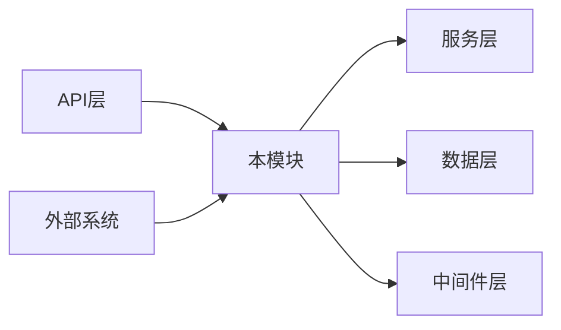

# 模块设计文档模板

## 1. 文档概述

### 1.1 设计目标

[描述本模块的设计目标，包括解决的问题、预期达到的效果和业务价值]

### 1.2 适用范围

[描述本设计文档适用的场景、系统组件和业务范围]

### 1.3 核心概念

| 概念 | 定义 |
|------|------|
| [概念1] | [定义1] |
| [概念2] | [定义2] |
| [概念3] | [定义3] |

## 2. 架构设计

### 2.1 模块定位

[描述本模块在整个系统架构中的位置和作用，与其他模块的关系]

### 2.2 设计原则

[列出本模块设计遵循的核心原则，如高内聚低耦合、可扩展性、可测试性等]

### 2.3 核心架构图



## 3. 目录结构设计

```
├── app/
│   ├── [module_name]/          # 模块核心目录
│   │   ├── __init__.py         # 包初始化
│   │   ├── base.py             # 基础类和接口定义
│   │   ├── [submodule1]/       # 子模块1
│   │   ├── [submodule2]/       # 子模块2
│   │   └── config.py           # 模块配置
│   └── [other_module]/         # 其他相关模块
└── tests/
    └── [module_name]/          # 模块测试目录
```

## 4. 核心组件设计

### 4.1 组件1：[组件名称]

#### 4.1.1 功能描述

[描述该组件的核心功能和职责]

#### 4.1.2 设计细节

[详细描述组件的设计，包括类结构、关键方法和数据流程]

#### 4.1.3 代码示例

```python
# 核心代码示例
class [ComponentName]:
    def __init__(self, config):
        self.config = config
    
    def [method_name](self, param1, param2):
        # 实现逻辑
        pass
```

### 4.2 组件2：[组件名称]

[类似组件1的结构]

## 5. API设计

### 5.1 接口列表

| 接口名称 | 功能描述 | 参数 | 返回值 | 异常 |
|----------|----------|------|--------|------|
| [接口1] | [描述1] | [参数1: 类型, 参数2: 类型] | [返回值类型] | [异常类型] |
| [接口2] | [描述2] | [参数1: 类型, 参数2: 类型] | [返回值类型] | [异常类型] |

### 5.2 示例用法

```python
# API使用示例
from app.[module_name].[component] import [ComponentName]

component = [ComponentName](config)
result = component.[method_name](param1, param2)
```

## 6. 数据模型设计

### 6.1 数据结构

| 字段名 | 类型 | 描述 | 约束 |
|--------|------|------|------|
| [字段1] | [类型1] | [描述1] | [约束1] |
| [字段2] | [类型2] | [描述2] | [约束2] |
| [字段3] | [类型3] | [描述3] | [约束3] |

### 6.2 数据库设计（如果适用）

```sql
-- 数据库表设计示例
CREATE TABLE [table_name] (
    [id] SERIAL PRIMARY KEY,
    [field1] VARCHAR(255) NOT NULL,
    [field2] INTEGER DEFAULT 0,
    [created_at] TIMESTAMP DEFAULT CURRENT_TIMESTAMP
);
```

## 7. 依赖关系

### 7.1 内部依赖

| 依赖模块 | 用途 |
|----------|------|
| [模块1] | [用途1] |
| [模块2] | [用途2] |

### 7.2 外部依赖

| 依赖库 | 版本 | 用途 |
|--------|------|------|
| fastapi | >=0.125.0 | Web框架 |
| uvicorn | >=0.30.0 | ASGI服务器 |
| pydantic-settings | >=2.0.0 | 配置管理 |
| sqlalchemy | >=2.0.45 | ORM框架 |
| python-dotenv | >=1.2.1 | 环境变量管理 |
| [其他库] | [版本] | [用途] |

## 8. 版本控制设计

### 8.1 版本策略

[描述模块的版本控制策略，如API版本控制、向后兼容保证等]

### 8.2 升级路径

[描述模块的升级路径和迁移方案]

## 9. 测试策略

### 9.1 测试类型

| 测试类型 | 覆盖范围 | 工具/框架 |
|----------|----------|-----------|
| 单元测试 | [覆盖范围1] | [工具1] |
| 集成测试 | [覆盖范围2] | [工具2] |
| 端到端测试 | [覆盖范围3] | [工具3] |

### 9.2 测试用例设计

[描述关键测试用例的设计思路和覆盖场景]

## 10. 部署与配置

### 10.1 部署架构

[描述模块的部署架构和要求]

### 10.2 配置项

| 配置项 | 类型 | 默认值 | 描述 |
|--------|------|--------|------|
| [配置1] | [类型1] | [默认值1] | [描述1] |
| [配置2] | [类型2] | [默认值2] | [描述2] |

## 11. 最佳实践与约束

### 11.1 代码规范

[描述模块开发应遵循的代码规范和风格]

### 11.2 性能考量

[描述模块的性能要求和优化建议]

### 11.3 安全考量

[描述模块的安全要求和防护措施]

## 12. 架构评估与优化

### 12.1 优势分析

- ✅ [优势1]
- ✅ [优势2]
- ✅ [优势3]

### 12.2 潜在风险

- ⚠️ [风险1]
- ⚠️ [风险2]
- ⚠️ [风险3]

### 12.3 优化建议

[描述模块的优化方向和建议]

## 13. 总结

[总结模块设计的核心要点和价值，强调设计的合理性和可行性]
