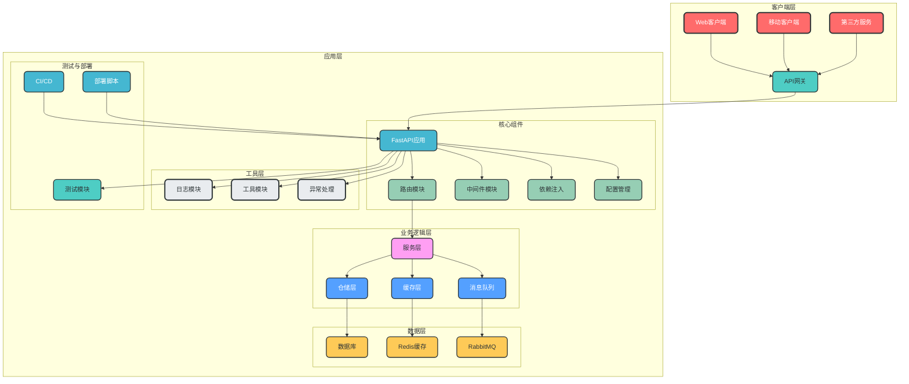
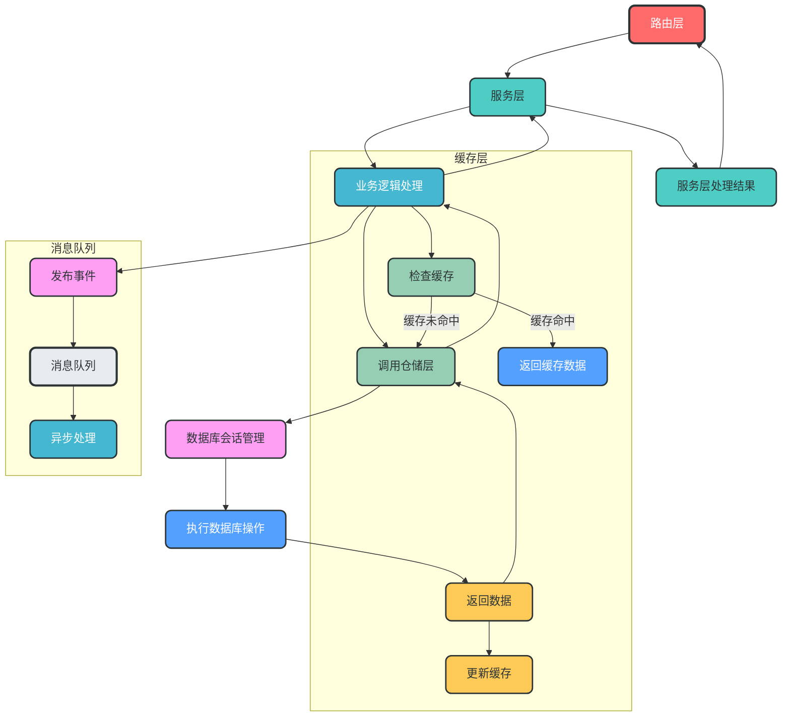
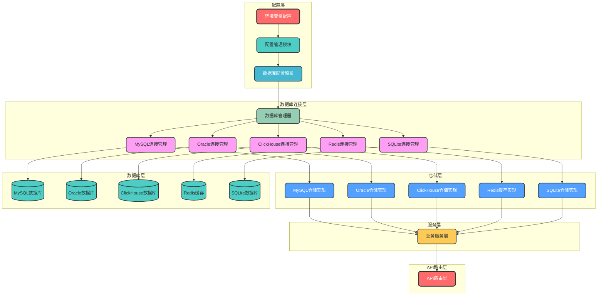
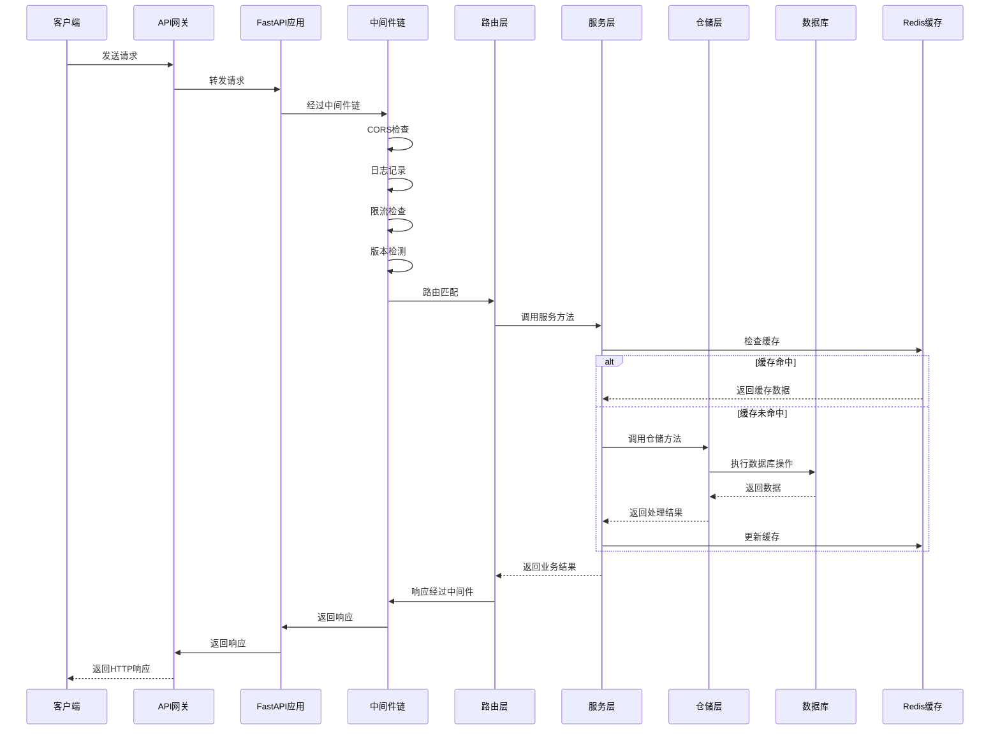
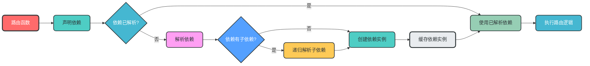
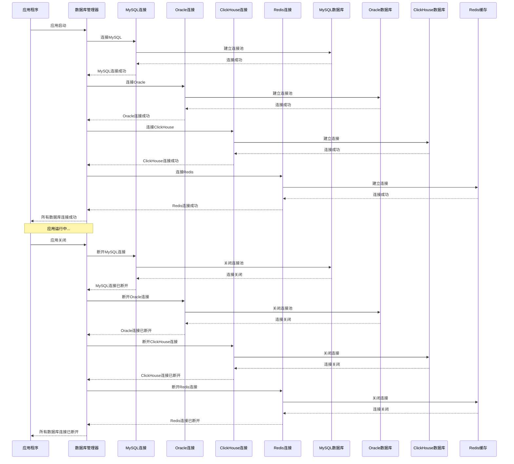

# 如何设计和实现一个生产级FastAPI架构

## 一、项目概述

这是一个基于FastAPI框架的生产级架构设计项目，包含完整的模块设计、最佳实践和实现示例。该架构支持多环境部署、API版本控制、模块化设计和企业级特性，适合构建各种规模的FastAPI应用。

## 二、架构设计

### 1. 整体架构图



### 2. 分模块架构图

#### 路由与中间件模块

```mermaid
graph LR
    A[客户端请求] --> B[API网关]
    B --> C[FastAPI应用]
    C --> D[中间件链]
    D --> E[CORS中间件]
    E --> F[日志中间件]
    F --> G[限流中间件]
    G --> H[版本检测中间件]
    H --> I[路由匹配]
    I --> J[依赖注入解析]
    J --> K[路由处理函数]
    K --> L[服务层调用]
    L --> M[返回响应]
    M --> D
    D --> N[客户端响应]
    
    style A fill:#FF6B6B,stroke:#2D3436,stroke-width:3px,color:white,rx:8,ry:8
    style B fill:#4ECDC4,stroke:#2D3436,stroke-width:2px,color:#2D3436,rx:8,ry:8
    style C fill:#45B7D1,stroke:#2D3436,stroke-width:2px,color:white,rx:8,ry:8
    style D fill:#96CEB4,stroke:#2D3436,stroke-width:2px,color:#2D3436,rx:8,ry:8
    style E fill:#FF9FF3,stroke:#2D3436,stroke-width:2px,color:#2D3436,rx:8,ry:8
    style F fill:#FF9FF3,stroke:#2D3436,stroke-width:2px,color:#2D3436,rx:8,ry:8
    style G fill:#FF9FF3,stroke:#2D3436,stroke-width:2px,color:#2D3436,rx:8,ry:8
    style H fill:#FF9FF3,stroke:#2D3436,stroke-width:2px,color:#2D3436,rx:8,ry:8
    style I fill:#54A0FF,stroke:#2D3436,stroke-width:2px,color:white,rx:8,ry:8
    style J fill:#FECA57,stroke:#2D3436,stroke-width:2px,color:#2D3436,rx:8,ry:8
    style K fill:#4ECDC4,stroke:#2D3436,stroke-width:2px,color:#2D3436,rx:8,ry:8
    style L fill:#45B7D1,stroke:#2D3436,stroke-width:2px,color:white,rx:8,ry:8
    style M fill:#96CEB4,stroke:#2D3436,stroke-width:2px,color:#2D3436,rx:8,ry:8
    style N fill:#FF6B6B,stroke:#2D3436,stroke-width:3px,color:white,rx:8,ry:8
```



#### 服务与仓储模块



#### 多数据库管理模块


## 三、核心流程

### 1. 请求处理流程



### 2. 依赖注入流程



### 3. 数据库会话管理流程

```mermaid
graph LR
    A[路由函数开始] --> B[调用数据库依赖]
    B --> C[创建数据库会话]
    C --> D[返回会话给路由]
    D --> E[路由函数执行]
    E --> F[调用服务层]
    F --> G[执行数据库操作]
    G --> H{操作成功?}
    H -->|是| I[提交事务]
    H -->|否| J[回滚事务]
    I --> K[关闭数据库会话]
    J --> K
    K --> L[路由函数结束]
    
    style A fill:#FF6B6B,stroke:#2D3436,stroke-width:3px,color:white,rx:8,ry:8
    style B fill:#4ECDC4,stroke:#2D3436,stroke-width:2px,color:#2D3436,rx:8,ry:8
    style C fill:#45B7D1,stroke:#2D3436,stroke-width:2px,color:white,rx:8,ry:8
    style D fill:#96CEB4,stroke:#2D3436,stroke-width:2px,color:#2D3436,rx:8,ry:8
    style E fill:#FF9FF3,stroke:#2D3436,stroke-width:2px,color:#2D3436,rx:8,ry:8
    style F fill:#54A0FF,stroke:#2D3436,stroke-width:2px,color:white,rx:8,ry:8
    style G fill:#FECA57,stroke:#2D3436,stroke-width:2px,color:#2D3436,rx:8,ry:8
    style H fill:#4ECDC4,stroke:#2D3436,stroke-width:2px,color:#2D3436,rx:8,ry:8
    style I fill:#96CEB4,stroke:#2D3436,stroke-width:2px,color:#2D3436,rx:8,ry:8
    style J fill:#FF6B6B,stroke:#2D3436,stroke-width:2px,color:white,rx:8,ry:8
    style K fill:#E9ECEF,stroke:#2D3436,stroke-width:3px,color:#2D3436,rx:8,ry:8
    style L fill:#45B7D1,stroke:#2D3436,stroke-width:2px,color:white,rx:8,ry:8
```



### 4. 多数据库连接管理流程



## 四、模块说明

### 1. 核心模块

| 模块名称 | 主要职责 | 关键特性 |
|---------|---------|---------|
| **路由模块** | API端点定义与管理 | 支持版本控制、依赖注入、自动文档生成 |
| **中间件模块** | 请求/响应处理 | CORS、日志、限流、版本检测 |
| **依赖注入** | 管理对象依赖 | 支持请求级、应用级依赖，自动注入 |
| **配置管理** | 多环境配置 | 类型安全、环境变量支持、配置验证 |
| **服务层** | 业务逻辑封装 | 事务管理、服务间调用、业务规则 |
| **仓储层** | 数据访问抽象 | 支持多种数据库、ORM集成、数据持久化 |
| **多数据库管理** | 管理多种数据库连接 | 支持MySQL、Oracle、ClickHouse、Redis，统一连接管理 |
| **缓存层** | 缓存管理 | Redis支持、自动缓存、缓存失效机制 |
| **消息队列** | 异步消息处理 | 事件驱动、消息可靠性、异步任务 |

### 2. 辅助模块

| 模块名称 | 主要职责 | 关键特性 |
|---------|---------|---------|
| **日志模块** | 日志记录与管理 | 多输出目标、日志轮转、结构化日志 |
| **异常处理** | 统一异常管理 | 全局异常处理器、标准化错误响应 |
| **工具模块** | 通用工具函数 | 加密、日期、HTTP客户端、JWT |
| **测试模块** | 代码质量保障 | 单元测试、集成测试、API测试 |
| **数据库迁移** | 数据库变更管理 | Alembic支持、自动迁移、多环境兼容 |

## 五、最佳实践

1. **模块化设计**：按业务域划分模块，保持单一职责
2. **API版本控制**：支持URL路径版本和Header版本
3. **依赖注入**：充分利用FastAPI的依赖注入系统
4. **类型安全**：使用Pydantic模型进行数据验证
5. **缓存策略**：合理使用缓存减少数据库查询
6. **异步支持**：关键路径使用异步操作提高并发
7. **日志规范**：统一日志格式，包含必要上下文信息
8. **测试覆盖**：单元测试≥80%，集成测试覆盖核心流程
9. **部署自动化**：使用CI/CD工具自动化部署流程
10. **监控告警**：集成监控系统，及时发现问题

## 六、项目文件结构

```
notes/
├── note.md                      # 主架构设计文档
├── multi_database_management.md # 多数据库管理设计
├── fastapi_routing_design.md    # 路由模块设计
├── fastapi_dependency_injection_design.md # 依赖注入设计
└── README.md                    # 项目综合说明
```

## 七、快速开始

### 1. 安装依赖

```bash
pip install fastapi uvicorn sqlalchemy pydantic redis pika
```

### 2. 运行应用

```bash
uvicorn app.main:app --reload
```

### 3. 访问文档

- Swagger UI: http://localhost:8000/docs
- ReDoc: http://localhost:8000/redoc

## 八、技术栈

| 技术 | 版本 | 用途 |
|-----|-----|-----|
| FastAPI | 最新 | Web框架 |
| Python | 3.9+ | 开发语言 |
| SQLAlchemy | 最新 | ORM框架 |
| Pydantic | 最新 | 数据验证 |
| Redis | 最新 | 缓存系统 |
| RabbitMQ | 最新 | 消息队列 |
| Alembic | 最新 | 数据库迁移 |
| Uvicorn | 最新 | ASGI服务器 |

## 九、总结

本项目提供了一个完整的FastAPI架构设计方案，包含从模块设计到实现示例的全面指导。该架构具有以下特点：

- ✅ 模块化设计，便于扩展和维护
- ✅ 支持多环境部署和API版本控制
- ✅ 企业级特性，适合生产环境
- ✅ 遵循最佳实践和设计原则
- ✅ 完整的文档和示例代码

通过参考本架构设计，开发者可以快速构建高质量、可扩展的FastAPI应用，减少重复设计和实现工作，专注于业务逻辑开发。