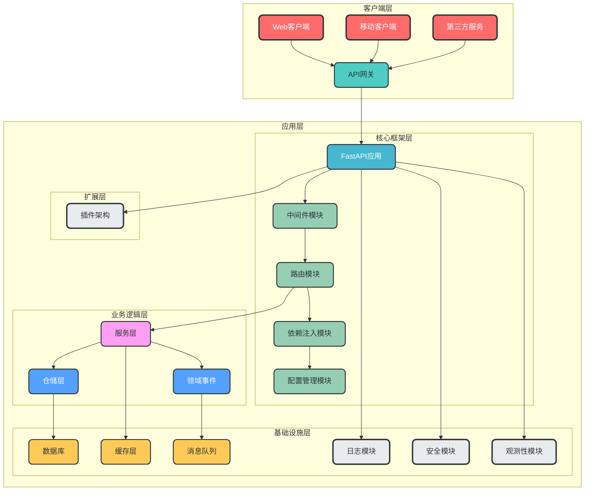
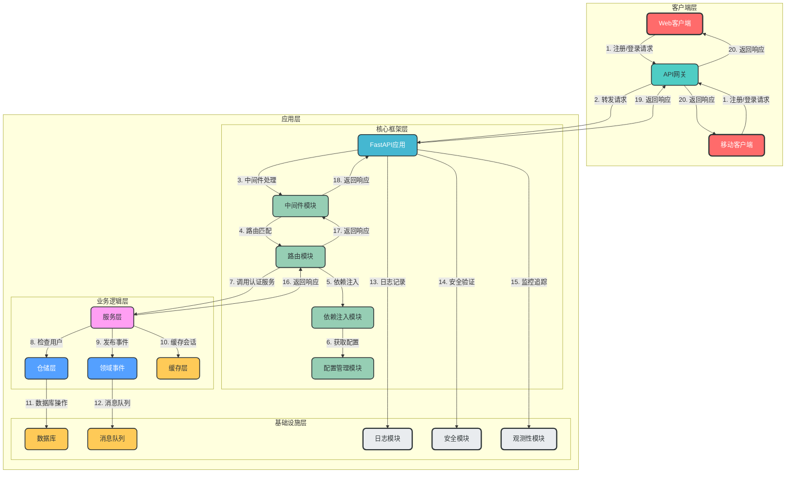
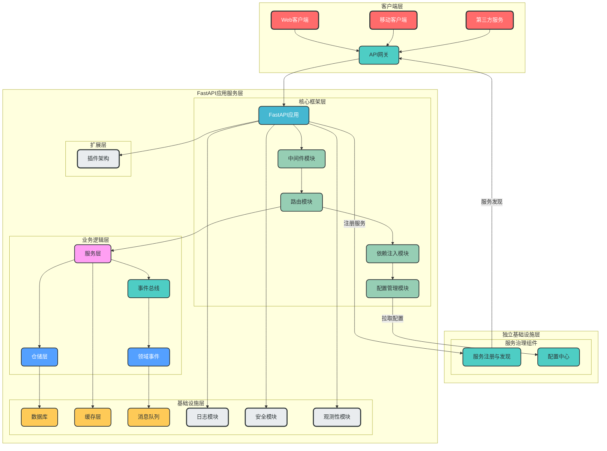

# FastAPI 企业级架构设计指南

## 一、项目概述

这是一个基于FastAPI框架的生产级架构设计，旨在作为多个项目的通用轮子项目。该架构支持多环境部署、API版本控制、模块化设计和企业级特性，适合构建各种规模的FastAPI应用。架构设计遵循高内聚、低耦合原则，确保未来新增功能时基础架构无需变更，具备良好的可扩展性和可维护性。

## 二、设计原则与理念

### 1. 架构设计原则

- ✅ **分层设计**：明确的职责划分，各层之间通过接口通信
- ✅ **模块化设计**：按业务域划分模块，支持独立开发和部署
- ✅ **依赖倒置**：高层模块不依赖低层模块，两者都依赖抽象接口
- ✅ **单一职责**：每个模块、类和函数只负责一个明确的功能
- ✅ **接口抽象**：通过接口定义契约，实现模块间解耦
- ✅ **可测试性**：设计便于单元测试和集成测试的架构
- ✅ **可扩展性**：支持新功能的无缝添加，无需修改现有架构
- ✅ **类型安全**：使用Pydantic进行数据验证，确保类型安全

### 2. DDD领域驱动设计

本架构采用DDD领域驱动设计思想，将业务逻辑与技术实现分离：

- **领域模型**：核心业务概念的抽象，包含实体(Entity)、值对象(Value Object)和聚合根(Aggregate Root)
- **领域服务**：封装跨实体的业务逻辑
- **领域事件**：用于处理领域内的异步通信
- **仓储**：负责领域对象的持久化和检索

### 3. 模块化设计思想

- **业务模块化**：按业务域划分模块，如用户模块、订单模块等
- **技术模块化**：按技术功能划分模块，如配置模块、日志模块等
- **插件化设计**：支持通过插件机制扩展功能，无需修改核心代码

## 三、整体架构设计

为了便于不同层次的读者理解系统架构，我们将架构图分为四个清晰的版本，从专注于FastAPI应用本身到包含完整的企业级基础设施服务，逐步深入：

### 1. FastAPI应用核心架构图

**适用场景**：快速理解FastAPI应用的核心架构，适合初学者或需要快速了解架构的读者。
**核心特点**：聚焦FastAPI应用内部核心组件，突出核心层次结构，去除复杂的企业级基础设施服务。



### 2. FastAPI应用核心详细架构图

**适用场景**：需要了解FastAPI应用核心架构如何实际运行的读者，适合开发人员或架构设计人员。
**核心特点**：在FastAPI应用核心架构的基础上，增加了用户注册登录流程，展示了从客户端发起请求到服务器返回响应的完整数据流转。



### 3. 企业级完整架构图

**适用场景**：了解企业级架构特性，适合架构师或需要设计企业级系统的读者。
**核心特点**：包含完整的企业级基础设施服务，明确区分独立基础设施服务与FastAPI应用服务，包含服务治理和配置中心等企业级特性，结构清晰，突出核心企业级组件。



### 4. 企业级完整详细架构图

**适用场景**：需要深入了解完整企业级架构设计的读者，适合资深架构师或需要实现复杂系统的开发团队。
**核心特点**：包含完整的企业级基础设施服务和FastAPI应用服务，明确区分两者边界，包含API网关详细设计、配置中心、服务注册与发现、事件总线、数据一致性保障、分布式追踪等完整企业级特性。

```mermaid
graph TD
    subgraph 客户端层
        A[Web客户端] -->|1. 注册/登录请求| B[API网关]
        C[移动客户端] -->|1. 注册/登录请求| B
        D[第三方服务] --> B
    end
    
    subgraph 独立基础设施层
        subgraph 服务治理组件
            ZK[服务注册与发现] 
            CC[配置中心] 
            B[API网关] 
        end
        
        subgraph API网关功能
            B1[路由转发与负载均衡] --> B
            B2[认证授权前置处理] --> B
            B3[限流与熔断机制] --> B
            B4[API版本管理] --> B
            B5[请求/响应转换] --> B
        end
    end
    
    subgraph FastAPI应用服务层
        B -->|3. 转发请求| E[FastAPI应用]
        
        subgraph 核心框架层
            E -->|4. 中间件处理| G[中间件模块]
            G -->|5. 路由匹配| F[路由模块]
            F -->|6. 依赖注入| H[依赖注入模块]
            H -->|7. 获取配置| I[配置管理模块]
        end
        
        subgraph 业务逻辑层
            F -->|9. 调用认证服务| J[服务层]
            J -->|10. 检查用户| K[仓储层]
            J -->|11. 事件发布| EB[事件总线]
            EB -->|12. 触发领域事件| L[领域事件]
            J -->|13. 缓存会话| N[缓存层]
        end
        
        subgraph 数据一致性层
            K -->|14. 数据一致性处理| DC[数据一致性保障]
            DC -->|15. 数据库操作| M[数据库]
        end
        
        subgraph 基础设施层
            K -->|16. 直接数据库操作| M[数据库]
            L -->|17. 消息队列发布| O[消息队列]
            E -->|18. 日志记录| P[日志模块]
            E -->|19. 安全验证| Q[安全模块]
            E -->|20. 监控追踪| R[观测性模块]
            R -->|21. 指标收集| R1[指标监控]
            R -->|22. 分布式追踪| R2[分布式追踪]
            R -->|23. 健康检查| R3[健康检查]
            R -->|24. 告警触发| R4[告警系统]
        end
        
        subgraph 扩展层
            E --> S[插件架构]
        end
    end
    
    %% 独立基础设施与FastAPI应用的连接关系
    E -->|注册服务实例| ZK
    B -->|2. 服务发现| ZK
    I -->|8. 配置同步| CC
    
    %% 响应流程
    J -->|25. 返回响应| F
    F -->|26. 返回响应| G
    G -->|27. 返回响应| E
    E -->|28. 返回响应| B
    B -->|29. 返回响应| A
    B -->|29. 返回响应| C
    
    style A fill:#FF6B6B,stroke:#2D3436,stroke-width:3px,color:white,rx:8,ry:8
    style C fill:#FF6B6B,stroke:#2D3436,stroke-width:3px,color:white,rx:8,ry:8
    style D fill:#FF6B6B,stroke:#2D3436,stroke-width:3px,color:white,rx:8,ry:8
    style B fill:#4ECDC4,stroke:#2D3436,stroke-width:2px,color:#2D3436,rx:8,ry:8
    style E fill:#45B7D1,stroke:#2D3436,stroke-width:2px,color:white,rx:8,ry:8
    style F fill:#96CEB4,stroke:#2D3436,stroke-width:2px,color:#2D3436,rx:8,ry:8
    style G fill:#96CEB4,stroke:#2D3436,stroke-width:2px,color:#2D3436,rx:8,ry:8
    style H fill:#96CEB4,stroke:#2D3436,stroke-width:2px,color:#2D3436,rx:8,ry:8
    style I fill:#96CEB4,stroke:#2D3436,stroke-width:2px,color:#2D3436,rx:8,ry:8
    style J fill:#FF9FF3,stroke:#2D3436,stroke-width:2px,color:#2D3436,rx:8,ry:8
    style K fill:#54A0FF,stroke:#2D3436,stroke-width:2px,color:white,rx:8,ry:8
    style L fill:#54A0FF,stroke:#2D3436,stroke-width:2px,color:white,rx:8,ry:8
    style M fill:#FECA57,stroke:#2D3436,stroke-width:2px,color:#2D3436,rx:8,ry:8
    style N fill:#FECA57,stroke:#2D3436,stroke-width:2px,color:#2D3436,rx:8,ry:8
    style O fill:#FECA57,stroke:#2D3436,stroke-width:2px,color:#2D3436,rx:8,ry:8
    style P fill:#E9ECEF,stroke:#2D3436,stroke-width:3px,color:#2D3436,rx:8,ry:8
    style Q fill:#E9ECEF,stroke:#2D3436,stroke-width:3px,color:#2D3436,rx:8,ry:8
    style R fill:#E9ECEF,stroke:#2D3436,stroke-width:3px,color:#2D3436,rx:8,ry:8
    style S fill:#E9ECEF,stroke:#2D3436,stroke-width:3px,color:#2D3436,rx:8,ry:8
    style ZK fill:#4ECDC4,stroke:#2D3436,stroke-width:2px,color:#2D3436,rx:8,ry:8
    style CC fill:#4ECDC4,stroke:#2D3436,stroke-width:2px,color:#2D3436,rx:8,ry:8
    style EB fill:#4ECDC4,stroke:#2D3436,stroke-width:2px,color:#2D3436,rx:8,ry:8
    style DC fill:#4ECDC4,stroke:#2D3436,stroke-width:2px,color:#2D3436,rx:8,ry:8
    style R1 fill:#E9ECEF,stroke:#2D3436,stroke-width:2px,color:#2D3436,rx:8,ry:8
    style R2 fill:#E9ECEF,stroke:#2D3436,stroke-width:2px,color:#2D3436,rx:8,ry:8
    style R3 fill:#E9ECEF,stroke:#2D3436,stroke-width:2px,color:#2D3436,rx:8,ry:8
    style R4 fill:#E9ECEF,stroke:#2D3436,stroke-width:2px,color:#2D3436,rx:8,ry:8
    style B1 fill:#4ECDC4,stroke:#2D3436,stroke-width:2px,color:#2D3436,rx:8,ry:8
    style B2 fill:#4ECDC4,stroke:#2D3436,stroke-width:2px,color:#2D3436,rx:8,ry:8
    style B3 fill:#4ECDC4,stroke:#2D3436,stroke-width:2px,color:#2D3436,rx:8,ry:8
    style B4 fill:#4ECDC4,stroke:#2D3436,stroke-width:2px,color:#2D3436,rx:8,ry:8
    style B5 fill:#4ECDC4,stroke:#2D3436,stroke-width:2px,color:#2D3436,rx:8,ry:8
```



### 5. 分层设计

| 层级 | 职责 | 核心模块 |
| --- | --- | --- |
| **独立基础设施层** | 提供企业级基础设施服务 | API网关、服务注册与发现、配置中心 |
| **FastAPI应用服务层** | 包含FastAPI应用的核心功能 |
| └─ **核心框架层** | 提供FastAPI基础框架支持 | 路由模块、中间件模块、依赖注入模块、配置管理模块 |
| └─ **业务逻辑层** | 封装核心业务逻辑 | 服务层、仓储层、领域事件、事件总线 |
| └─ **数据一致性层** | 保障分布式数据一致性 | 数据一致性保障机制 |
| └─ **基础设施层** | 提供应用内技术支持 | 数据库、缓存层、消息队列、日志模块、安全模块、观测性模块 |
| └─ **扩展层** | 支持架构扩展 | 插件架构 |

## 四、目录结构设计

```
fastapi_enterprise/
├── app/                     # 应用核心目录
│   ├── __init__.py
│   ├── main.py              # 应用入口（创建实例、注册所有组件）
│   ├── api/                 # API路由模块（按版本划分）
│   │   ├── __init__.py
│   │   ├── v1/              # v1版本API
│   │   │   ├── __init__.py
│   │   │   ├── auth.py
│   │   │   └── users.py
│   │   └── v2/              # v2版本API
│   │       ├── __init__.py
│   │       └── users.py
│   ├── config/              # 配置模块
│   │   ├── __init__.py
│   │   ├── settings.py
│   │   └── version.py
│   ├── dependencies/        # 依赖注入模块（通用依赖）
│   │   ├── __init__.py
│   │   ├── auth.py
│   │   └── database.py
│   ├── domains/             # DDD领域模块
│   │   ├── __init__.py
│   │   ├── user/            # 用户领域
│   │   │   ├── __init__.py
│   │   │   ├── models.py          # 用户数据模型（实体）
│   │   │   ├── schemas.py         # 用户数据校验Schema
│   │   │   ├── services/          # 用户领域服务
│   │   │   │   ├── __init__.py
│   │   │   │   └── user_service.py    # 用户服务实现
│   │   │   └── repositories/      # 用户仓储层
│   │   │       ├── __init__.py
│   │   │       └── user_repository.py  # 用户仓储实现
│   │   ├── order/           # 订单领域
│   │   │   ├── __init__.py
│   │   │   ├── models.py          # 订单数据模型
│   │   │   ├── schemas.py         # 订单数据校验Schema
│   │   │   ├── services/          # 订单领域服务
│   │   │   │   ├── __init__.py
│   │   │   │   └── order_service.py   # 订单服务实现
│   │   │   └── repositories/      # 订单仓储层
│   │   │       ├── __init__.py
│   │   │       └── order_repository.py # 订单仓储实现
│   │   └── product/         # 商品领域
│   │       ├── __init__.py
│   │       ├── models.py          # 商品数据模型
│   │       ├── schemas.py         # 商品数据校验Schema
│   │       ├── services/          # 商品领域服务
│   │       │   ├── __init__.py
│   │       │   └── product_service.py  # 商品服务实现
│   │       └── repositories/      # 商品仓储层
│   │           ├── __init__.py
│   │           └── product_repository.py # 商品仓储实现
│   ├── infrastructure/      # 基础设施层
│   │   ├── __init__.py
│   │   ├── database/        # 数据库连接管理
│   │   ├── cache/           # 缓存模块
│   │   ├── queue/           # 消息队列
│   │   ├── logging/         # 日志模块
│   │   └── security/        # 安全模块
│   ├── middleware/          # 中间件模块
│   │   ├── __init__.py
│   │   ├── cors.py
│   │   ├── logging.py
│   │   └── rate_limiter.py
│   ├── observability/       # 观测性模块
│   │   ├── __init__.py
│   │   ├── logging.py
│   │   ├── metrics.py
│   │   └── tracing.py
│   ├── plugins/             # 插件架构
│   │   ├── __init__.py
│   │   ├── base.py
│   │   └── manager.py
│   ├── tasks/               # 异步任务模块
│   │   ├── __init__.py
│   │   └── base.py
│   ├── utils/               # 工具模块
│   │   ├── __init__.py
│   │   ├── cryptography.py
│   │   └── validator.py
│   └── exceptions/          # 自定义异常
│       ├── __init__.py
│       └── base.py
├── alembic/                 # 数据库迁移模块（Alembic）
├── tests/                   # 测试模块（按业务域组织）
│   ├── __init__.py
│   ├── conftest.py          # 测试夹具
│   ├── integration/         # 集成测试
│   ├── unit/                # 单元测试
│   └── utils/               # 测试工具
├── docs/                    # 文档模块
│   ├── api/                 # API文档
│   ├── architecture/        # 架构设计文档
│   └── deployment/          # 部署文档
├── scripts/                 # 脚本模块
│   ├── deploy.sh            # 部署脚本
│   ├── init_db.py           # 数据库初始化脚本
│   └── start_consumer.py    # 启动消费者脚本
├── plugins/                 # 插件目录
│   └── example_plugin/      # 示例插件
├── .env                     # 环境变量模板
├── .env.dev                 # 开发环境变量
├── .env.test                # 测试环境变量
├── .env.prod                # 生产环境变量
├── alembic.ini              # Alembic配置文件
├── pyproject.toml           # 项目配置
├── requirements.txt         # 核心依赖
├── requirements-dev.txt     # 开发依赖
└── README.md                # 项目文档
```

## 五、API版本控制设计

### 1. 版本控制策略

本架构支持多种API版本控制策略，推荐使用**URL路径版本控制**作为主要策略，同时支持**Header版本控制**作为兼容策略。

**URL路径版本控制**：
```
/api/v1/users
/api/v2/users
```

**Header版本控制**：
```
GET /api/users
X-API-Version: v1
```

### 2. 版本管理实现

```python
# app/config/version.py
from enum import Enum

class APIVersion(str, Enum):
    """API版本枚举"""
    V1 = "v1"
    V2 = "v2"

# 默认版本
DEFAULT_API_VERSION = APIVersion.V1
# 支持的版本列表
SUPPORTED_VERSIONS = [v.value for v in APIVersion]
```

```python
# app/api/__init__.py
from fastapi import APIRouter, FastAPI, Request, Depends
from fastapi.responses import JSONResponse
from app.config.version import SUPPORTED_VERSIONS, DEFAULT_API_VERSION

def get_api_version(request: Request) -> str:
    """获取API版本"""
    # 从URL路径获取版本
    for version in SUPPORTED_VERSIONS:
        if request.url.path.startswith(f"/api/{version}"):
            return version
    # 从Header获取版本
    version_header = request.headers.get("X-API-Version")
    if version_header in SUPPORTED_VERSIONS:
        return version_header
    # 返回默认版本
    return DEFAULT_API_VERSION

# 主API路由器
api_router = APIRouter(prefix="/api")

# 注册版本路由
from app.api.v1 import api_router as v1_router
from app.api.v2 import api_router as v2_router

api_router.include_router(v1_router, prefix="/v1", tags=["v1"])
api_router.include_router(v2_router, prefix="/v2", tags=["v2"])
```

## 六、最佳实践

### 1. 代码组织最佳实践

- **按业务域组织代码**：使用DDD思想，将相关代码组织在同一个业务域目录下
- **接口抽象优先**：通过接口定义模块间的契约，实现解耦
- **依赖注入**：充分利用FastAPI的依赖注入系统，提高代码可测试性
- **类型安全**：使用Pydantic进行数据验证，确保类型安全
- **异步优先**：对IO密集型操作使用异步IO，提高并发性能

### 2. API设计最佳实践

- **RESTful设计**：遵循RESTful API设计原则
- **API版本控制**：使用URL路径版本控制（/api/v1/）
- **标准化响应格式**：统一API响应格式，包含code、message、data字段
- **分页设计**：对列表接口实现分页，支持page和page_size参数
- **过滤和排序**：支持通过查询参数进行过滤和排序
- **文档自动生成**：利用FastAPI的自动文档生成功能

### 3. 数据库设计最佳实践

- **ORM优先**：使用SQLAlchemy ORM进行数据库操作
- **数据库迁移**：使用Alembic管理数据库表结构变更
- **事务管理**：使用数据库事务确保数据一致性
- **索引优化**：为频繁查询的字段添加索引
- **连接池管理**：合理配置数据库连接池大小

### 4. 安全最佳实践

- **认证授权**：实现细粒度的认证授权机制
- **输入验证**：对所有输入进行严格验证
- **输出过滤**：对输出数据进行过滤，防止敏感信息泄露
- **加密传输**：使用HTTPS进行数据传输
- **加密存储**：对敏感数据进行加密存储
- **防止常见攻击**：防止SQL注入、XSS、CSRF等常见安全漏洞
- **定期安全审计**：定期进行安全审计和漏洞扫描

### 5. 测试策略

**测试分层**：
- **单元测试**：测试单个函数、类或模块
- **集成测试**：测试模块间的交互
- **API测试**：测试API端点的正确性
- **端到端测试**：测试整个系统的流程

**测试框架**：
- 使用pytest进行单元测试和集成测试
- 使用pytest-asyncio进行异步测试
- 使用httpx进行API测试

**测试覆盖率**：
- 单元测试覆盖率≥80%
- 关键业务逻辑覆盖率100%
- API测试覆盖率≥90%

### 6. 部署和DevOps最佳实践

**部署策略**：
- 支持多环境部署（开发、测试、生产）
- 容器化部署（Docker + Kubernetes）
- 持续集成和持续部署（CI/CD）
- 蓝绿部署或金丝雀发布

**监控和告警**：
- 集成Prometheus和Grafana进行监控
- 实现日志集中管理（ELK或Loki）
- 设置关键指标告警
- 定期性能分析

**DevOps工具链**：
- 代码管理：Git + GitHub/GitLab
- CI/CD：GitHub Actions或GitLab CI
- 基础设施即代码：Terraform或Ansible
- 容器编排：Kubernetes
- 监控告警：Prometheus + Grafana + Alertmanager

## 七、技术栈选型

| 技术/框架 | 版本 | 用途 |
|-----------|------|------|
| fastapi | >=0.125.0 | Web框架 |
| uvicorn | >=0.30.0 | ASGI服务器 |
| pydantic-settings | >=2.0.0 | 配置管理 |
| sqlalchemy | >=2.0.45 | ORM框架 |
| asyncpg | >=0.29.0 | PostgreSQL异步驱动 |
| python-jose | >=3.5.0 | JWT处理 |
| bcrypt | >=5.0.0 | 密码加密 |
| redis | >=5.0.0 | 缓存系统 |
| aioredis | >=2.0.1 | Redis异步客户端 |
| aio-pika | >=9.4.0 | RabbitMQ异步客户端 |
| alembic | >=1.10.0 | 数据库迁移 |
| pytest | >=9.0.2 | 测试框架 |
| pytest-asyncio | >=0.23.2 | 异步测试支持 |
| httpx | >=0.27.0 | HTTP客户端 |
| python-dotenv | >=1.2.1 | 环境变量管理 |
| python-json-logger | >=2.0.7 | JSON日志格式化 |
| prometheus-client | >=0.20.0 | 指标收集 |
| opentelemetry-sdk | >=1.24.0 | 分布式追踪 |

## 八、架构评估与优化建议

### 1. 架构优势

- ✅ **分层设计清晰**：各层职责明确，耦合度低
- ✅ **DDD领域驱动设计**：业务逻辑与技术实现分离，便于维护和扩展
- ✅ **插件架构**：支持动态扩展，便于功能定制
- ✅ **全面的安全保障**：支持多种认证授权方式，防止常见安全漏洞
- ✅ **良好的观测性**：提供全面的监控、追踪和日志功能
- ✅ **异步支持**：充分利用FastAPI的异步特性，提高并发性能
- ✅ **类型安全**：使用Pydantic进行数据验证，确保类型安全
- ✅ **可测试性**：设计便于测试的架构，支持多种测试方式

### 2. 架构优化建议

#### 2.1 短期优化建议

- **实现自动化测试**：完善单元测试、集成测试和API测试
- **优化数据库查询**：添加索引，优化查询性能
- **实现缓存策略**：对频繁访问的数据进行缓存
- **完善日志系统**：实现结构化日志，便于分析和监控

#### 2.2 中期优化建议

- **引入事件驱动架构**：使用消息队列处理异步事件
- **实现分布式追踪**：集成OpenTelemetry实现分布式追踪
- **优化部署策略**：实现蓝绿部署或金丝雀发布
- **完善监控告警**：设置关键指标告警，及时发现问题

#### 2.3 长期优化建议

- **支持多租户**：实现多租户架构，支持多个客户共享同一套系统
- **实现微服务架构**：将大型单体应用拆分为多个微服务
- **支持Serverless部署**：支持Serverless部署模式，降低运维成本
- **实现AI辅助功能**：集成AI功能，提高系统智能化水平

## 九、总结

本FastAPI企业级架构设计指南提供了一个完整的、可扩展的架构设计，适合作为多个项目的通用轮子项目。该架构具有以下特点：

1. **合理性**：遵循分层设计、DDD领域驱动设计和模块化设计原则，职责划分清晰，耦合度低
2. **可扩展性**：支持插件架构，便于动态扩展功能，无需修改核心代码
3. **安全性**：提供全面的安全保障，防止常见安全漏洞
4. **观测性**：提供全面的监控、追踪和日志功能，便于运维和问题排查
5. **异步支持**：充分利用FastAPI的异步特性，提高并发性能
6. **类型安全**：使用Pydantic进行数据验证，确保类型安全
7. **可测试性**：设计便于测试的架构，支持多种测试方式

通过使用本架构，开发团队可以快速构建高质量、可扩展的FastAPI应用，减少重复设计和实现工作，专注于业务逻辑开发。同时，本架构支持多环境部署、API版本控制和持续集成持续部署，适合构建各种规模的企业级应用。

## 十、TODO列表

### 1. 核心架构实现
- [ ] 实现配置管理模块，支持多环境配置
- [ ] 实现依赖注入模块，封装通用依赖
- [ ] 实现路由模块，支持API版本控制
- [ ] 实现服务层，基于DDD设计
- [ ] 实现仓储层，支持多种数据库

### 2. 安全模块实现
- [ ] 实现JWT认证
- [ ] 实现API Key认证
- [ ] 实现细粒度权限控制
- [ ] 实现输入验证和输出过滤

### 3. 观测性模块实现
- [ ] 实现结构化日志
- [ ] 实现请求追踪
- [ ] 实现性能监控
- [ ] 实现健康检查

### 4. 异步和消息队列实现
- [ ] 实现异步任务处理
- [ ] 实现消息队列集成
- [ ] 实现领域事件发布订阅

### 5. 插件架构实现
- [ ] 实现插件接口
- [ ] 实现插件自动发现
- [ ] 实现插件生命周期管理

### 6. 测试和部署
- [ ] 实现单元测试和集成测试
- [ ] 实现API测试
- [ ] 实现CI/CD流水线
- [ ] 实现容器化部署

### 7. 文档完善
- [ ] 编写详细的模块文档
- [ ] 编写API文档
- [ ] 编写部署文档
- [ ] 编写最佳实践指南

## 十一、参考资料

- [FastAPI官方文档](https://fastapi.tiangolo.com/)
- [DDD领域驱动设计](https://domainlanguage.com/)
- [SQLAlchemy官方文档](https://docs.sqlalchemy.org/)
- [Pydantic官方文档](https://docs.pydantic.dev/)
- [Kubernetes官方文档](https://kubernetes.io/docs/)
- [Prometheus官方文档](https://prometheus.io/docs/)
- [Grafana官方文档](https://grafana.com/docs/)
