## 四、核心模块设计

### 1. 配置管理模块

**核心作用**：统一管理多环境配置，支持动态配置更新，避免硬编码

**设计特点**：
- 使用Pydantic Settings进行类型安全的配置管理
- 支持多环境配置文件（.env.dev, .env.test, .env.prod）
- 支持环境变量覆盖配置文件
- 配置热更新支持
- 配置验证机制

**模块架构图**：
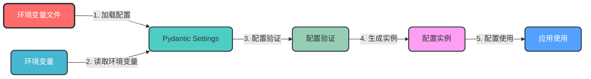

**数据流转图**：
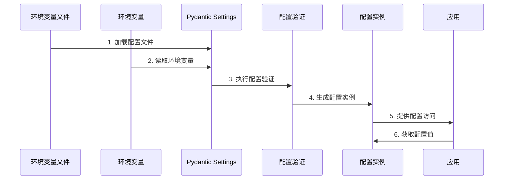

**关键实现**：
```python
# app/config/settings.py
from pydantic_settings import BaseSettings
from typing import Optional

class DatabaseSettings(BaseSettings):
    """数据库配置"""
    url: str
    echo: bool = False
    pool_size: int = 10
    max_overflow: int = 20

class RedisSettings(BaseSettings):
    """Redis配置"""
    url: str
    db: int = 0

class SecuritySettings(BaseSettings):
    """安全配置"""
    secret_key: str
    algorithm: str = "HS256"
    access_token_expire_minutes: int = 30

class AppSettings(BaseSettings):
    """应用配置"""
    name: str = "FastAPI Enterprise"
    version: str = "1.0.0"
    debug: bool = False
    
    # 子配置
    database: DatabaseSettings = DatabaseSettings()
    redis: RedisSettings = RedisSettings()
    security: SecuritySettings = SecuritySettings()

    class Config:
        env_file = ".env"
        env_nested_delimiter = "__"

# 全局配置实例
settings = AppSettings()
```

### 2. 依赖注入模块

**核心作用**：封装通用依赖，实现依赖注入，提高代码复用性和可测试性

**设计特点**：
- 基于FastAPI的依赖注入系统
- 支持作用域管理（请求级、应用级）
- 依赖自动注入
- 支持依赖替换，便于测试

**模块架构图**：
```mermaid
graph LR
    A[路由函数] -->|1. 声明依赖| B[依赖声明]
    B -->|2. 请求解析| C[依赖解析器]
    C -->|3. 检查子依赖| D{存在子依赖?}
    D -->|是| E[递归解析子依赖]
    D -->|否| F[创建依赖实例]
    E -->|4. 子依赖解析完成| F
    F -->|5. 缓存实例| G[缓存依赖实例]
    G -->|6. 注入依赖| H[使用依赖]
    
    style A fill:#FF6B6B,stroke:#2D3436,stroke-width:3px,color:white,rx:8,ry:8
    style B fill:#4ECDC4,stroke:#2D3436,stroke-width:2px,color:#2D3436,rx:8,ry:8
    style C fill:#45B7D1,stroke:#2D3436,stroke-width:2px,color:white,rx:8,ry:8
    style D fill:#96CEB4,stroke:#2D3436,stroke-width:2px,color:#2D3436,rx:8,ry:8
    style E fill:#FF9FF3,stroke:#2D3436,stroke-width:2px,color:#2D3436,rx:8,ry:8
    style F fill:#54A0FF,stroke:#2D3436,stroke-width:2px,color:white,rx:8,ry:8
    style G fill:#FECA57,stroke:#2D3436,stroke-width:2px,color:#2D3436,rx:8,ry:8
    style H fill:#E9ECEF,stroke:#2D3436,stroke-width:3px,color:#2D3436,rx:8,ry:8
```

**数据流转图**：
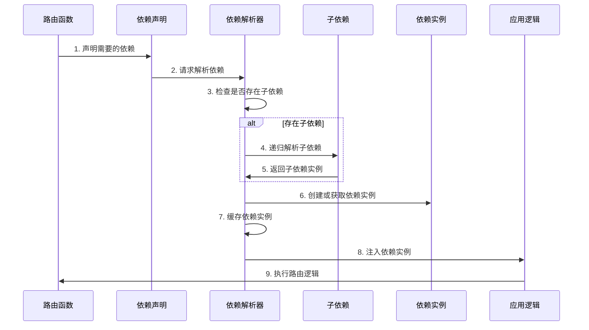

**关键实现**：
```python
# app/dependencies/db.py
from sqlalchemy.ext.asyncio import AsyncSession
from app.database.session import async_session_maker

async def get_db_session() -> AsyncSession:
    """获取数据库会话"""
    async with async_session_maker() as session:
        try:
            yield session
            await session.commit()
        except Exception:
            await session.rollback()
            raise
```

### 3. 路由与API版本控制

**核心作用**：处理HTTP请求，支持API版本控制，实现路由与业务逻辑分离

**设计特点**：
- 支持URL路径版本控制
- 支持Header版本控制
- 路由自动注册
- 支持路由分组

**模块架构图**：
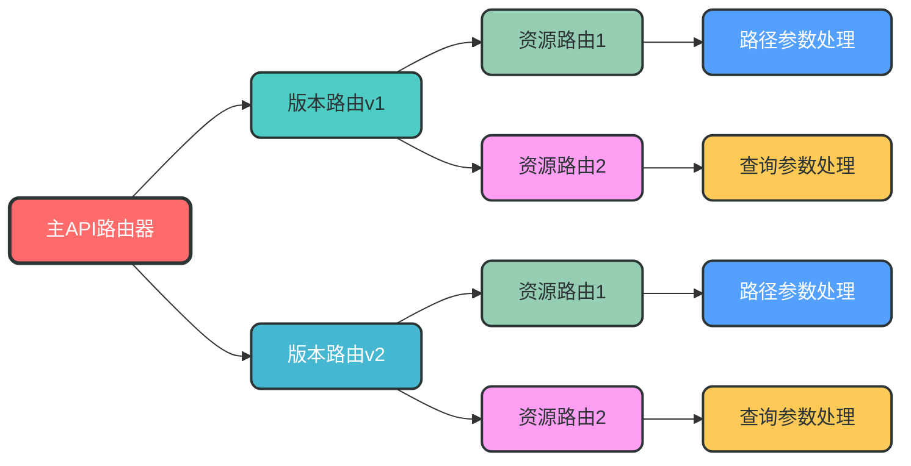

**数据流转图**：
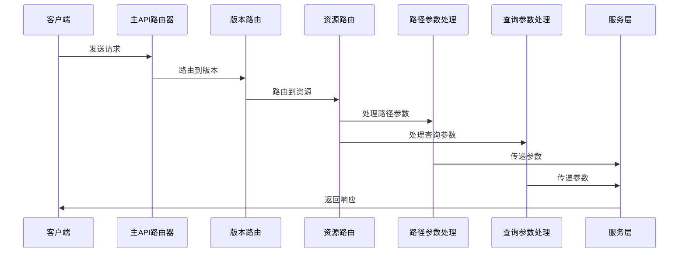

**关键实现**：
```python
# app/api/__init__.py
from fastapi import APIRouter
from app.api.v1 import api_router as v1_router
from app.api.v2 import api_router as v2_router

# 主API路由器
api_router = APIRouter(prefix="/api")

# 注册版本路由
api_router.include_router(v1_router, prefix="/v1", tags=["v1"])
api_router.include_router(v2_router, prefix="/v2", tags=["v2"])
```

### 4. 服务层设计（DDD增强）

**核心作用**：封装核心业务逻辑，实现业务与技术分离，是连接表示层（API路由）和数据访问层（仓储层）的桥梁。

**设计理念**：
- **业务逻辑封装**：将复杂的业务规则和流程封装在服务层，避免业务逻辑分散到控制器或数据访问层
- **DDD领域驱动**：基于领域模型设计，实现领域服务、领域事件和领域规则
- **接口抽象**：通过抽象接口定义服务契约，实现依赖倒置，便于测试和替换实现
- **事务管理**：负责业务事务的管理，确保数据一致性

**模块架构图**：
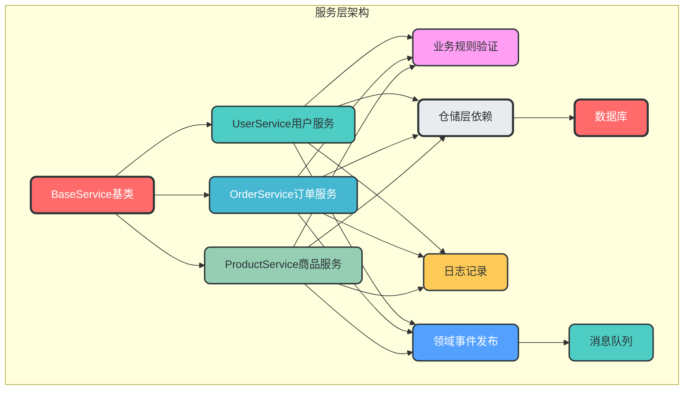

**数据流转图**：
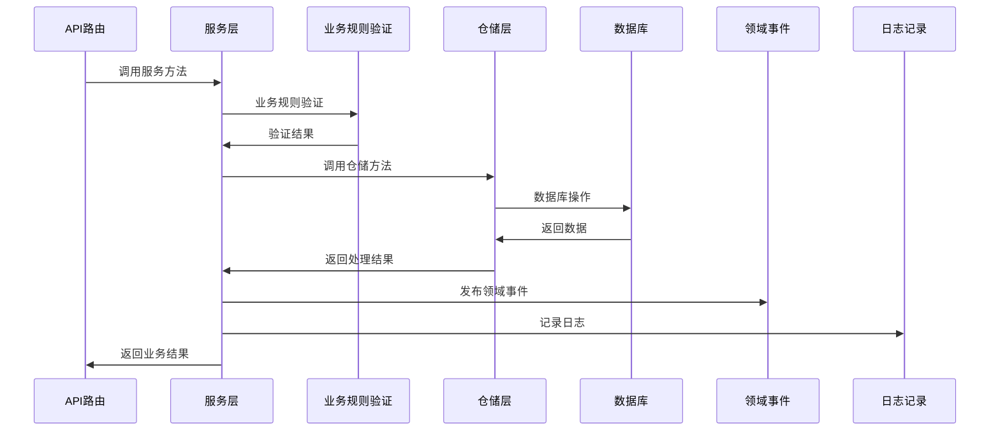

**服务层与仓储层的关系**：
- 服务层调用仓储层来获取和持久化数据
- 仓储层只负责数据访问，不包含业务逻辑
- 服务层负责业务规则验证、业务流程控制和领域事件发布

**领域服务目录结构设计**：

服务层采用DDD领域驱动设计，按业务域组织服务代码，每个业务域拥有自己的服务实现。以下是用户域和订单域的服务目录结构示例：

```
app/domains/
├── user/                # 用户领域
│   └── services/        # 用户领域服务
│       ├── __init__.py
│       └── user_service.py   # 用户服务实现
└── order/               # 订单领域
    └── services/        # 订单领域服务
        ├── __init__.py
        └── order_service.py  # 订单服务实现
```

**基类设计的作用与优势**：

服务层基类`BaseService`的设计具有以下重要作用：

1. **统一接口规范**：定义了服务层必须实现的核心方法，确保所有服务类遵循相同的接口规范
2. **减少重复代码**：封装了通用的服务逻辑，避免每个服务类重复实现相同的方法
3. **提高可维护性**：统一的接口设计使代码更易于理解和维护
4. **支持泛型**：使用泛型设计，支持不同类型的实体操作
5. **便于扩展**：新增领域服务时，只需继承基类并实现抽象方法，无需修改基类
6. **便于测试**：统一的接口设计使单元测试更加方便

**为什么新增领域服务不需要修改基类？**

- 基类采用抽象类设计，定义了通用的服务接口
- 新增领域服务时，只需继承基类并实现抽象方法
- 基类的设计遵循开闭原则（对扩展开放，对修改关闭）
- 每个领域服务可以根据自身需求扩展额外的方法，而不影响基类

**关键实现**：
```python
# app/services/base.py
from abc import ABC, abstractmethod
from typing import TypeVar, Generic, Optional

T = TypeVar("T")

class BaseService(ABC, Generic[T]):
    """服务层基类，定义通用的服务接口"""
    
    @abstractmethod
    async def get_by_id(self, id: int) -> Optional[T]:
        """根据ID获取实体"""
        pass
    
    @abstractmethod
    async def create(self, obj: T) -> T:
        """创建实体"""
        pass
    
    @abstractmethod
    async def update(self, id: int, obj: T) -> Optional[T]:
        """更新实体"""
        pass
    
    @abstractmethod
    async def delete(self, id: int) -> bool:
        """删除实体"""
        pass
```

**用户服务示例**：
```python
# app/domains/user/services/user_service.py
from app.services.base import BaseService
from app.domains.user.models import User
from app.domains.user.schemas import UserCreate, UserUpdate
from app.domains.user.repositories.user_repository import UserRepository
from app.observability.logging import logger
from app.infrastructure.queue.connection import get_queue_producer

class UserService(BaseService[User]):
    """用户服务，继承自BaseService"""
    
    def __init__(self, user_repository: UserRepository):
        self.user_repository = user_repository
    
    async def get_by_id(self, id: int) -> Optional[User]:
        """根据ID获取用户"""
        return await self.user_repository.get_by_id(id)
    
    async def get_by_email(self, email: str) -> Optional[User]:
        """根据邮箱获取用户，扩展方法"""
        return await self.user_repository.get_by_email(email)
    
    async def create(self, user_create: UserCreate) -> User:
        """创建用户"""
        # 业务规则验证
        existing_user = await self.get_by_email(user_create.email)
        if existing_user:
            raise ValueError("Email already registered")
        
        # 创建用户
        user = await self.user_repository.create(user_create)
        
        # 发布领域事件
        async with get_queue_producer() as producer:
            await producer.publish("user.created", {"user_id": user.id, "email": user.email})
        
        logger.info(f"User created: {user.id}")
        return user
    
    async def update(self, id: int, user_update: UserUpdate) -> Optional[User]:
        """更新用户"""
        user = await self.get_by_id(id)
        if not user:
            return None
        
        # 更新用户
        updated_user = await self.user_repository.update(user, user_update)
        
        # 发布领域事件
        async with get_queue_producer() as producer:
            await producer.publish("user.updated", {"user_id": updated_user.id})
        
        logger.info(f"User updated: {updated_user.id}")
        return updated_user
    
    async def delete(self, id: int) -> bool:
        """删除用户"""
        user = await self.get_by_id(id)
        if not user:
            return False
        
        # 删除用户
        await self.user_repository.delete(user)
        
        # 发布领域事件
        async with get_queue_producer() as producer:
            await producer.publish("user.deleted", {"user_id": id})
        
        logger.info(f"User deleted: {id}")
        return True
    
    async def authenticate(self, email: str, password: str) -> Optional[User]:
        """用户认证，扩展方法"""
        user = await self.get_by_email(email)
        if not user:
            return None
        
        # 密码验证
        if not user.verify_password(password):
            return None
        
        logger.info(f"User authenticated: {user.id}")
        return user
```

**订单服务示例**：
```python
# app/domains/order/services/order_service.py
from app.services.base import BaseService
from app.domains.order.models import Order
from app.domains.order.schemas import OrderCreate, OrderUpdate
from app.domains.order.repositories.order_repository import OrderRepository
from app.domains.user.services.user_service import UserService
from app.observability.logging import logger
from app.infrastructure.queue.connection import get_queue_producer

class OrderService(BaseService[Order]):
    """订单服务，继承自BaseService"""
    
    def __init__(self, order_repository: OrderRepository, user_service: UserService):
        self.order_repository = order_repository
        self.user_service = user_service
    
    async def get_by_id(self, id: int) -> Optional[Order]:
        """根据ID获取订单"""
        return await self.order_repository.get_by_id(id)
    
    async def create(self, order_create: OrderCreate) -> Order:
        """创建订单"""
        # 验证用户是否存在
        user = await self.user_service.get_by_id(order_create.user_id)
        if not user:
            raise ValueError("User not found")
        
        # 创建订单
        order = await self.order_repository.create(order_create)
        
        # 发布领域事件
        async with get_queue_producer() as producer:
            await producer.publish("order.created", {"order_id": order.id, "user_id": order.user_id})
        
        logger.info(f"Order created: {order.id}")
        return order
    
    async def update(self, id: int, order_update: OrderUpdate) -> Optional[Order]:
        """更新订单"""
        order = await self.get_by_id(id)
        if not order:
            return None
        
        # 更新订单
        updated_order = await self.order_repository.update(order, order_update)
        
        # 发布领域事件
        async with get_queue_producer() as producer:
            await producer.publish("order.updated", {"order_id": updated_order.id})
        
        logger.info(f"Order updated: {updated_order.id}")
        return updated_order
    
    async def delete(self, id: int) -> bool:
        """删除订单"""
        order = await self.get_by_id(id)
        if not order:
            return False
        
        # 删除订单
        await self.order_repository.delete(order)
        
        # 发布领域事件
        async with get_queue_producer() as producer:
            await producer.publish("order.deleted", {"order_id": id})
        
        logger.info(f"Order deleted: {id}")
        return True
    
    async def get_orders_by_user_id(self, user_id: int) -> list[Order]:
        """根据用户ID获取订单，扩展方法"""
        return await self.order_repository.get_orders_by_user_id(user_id)
```

### 5. 仓储层设计（接口抽象）

**核心作用**：抽象数据访问层，负责领域对象的持久化和检索，实现数据访问与业务逻辑分离。

**设计理念**：
- **接口抽象**：通过接口定义数据访问契约，实现依赖倒置，便于测试和替换实现
- **多数据库支持**：支持多种数据库后端（SQLAlchemy, MongoDB等）
- **事务支持**：参与服务层的事务管理，确保数据一致性
- **查询构建器**：支持灵活的查询构建，满足复杂查询需求

**模块架构图**：
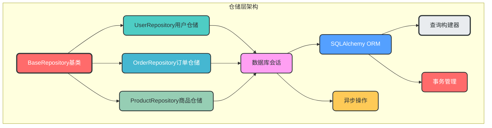

**数据流转图**：
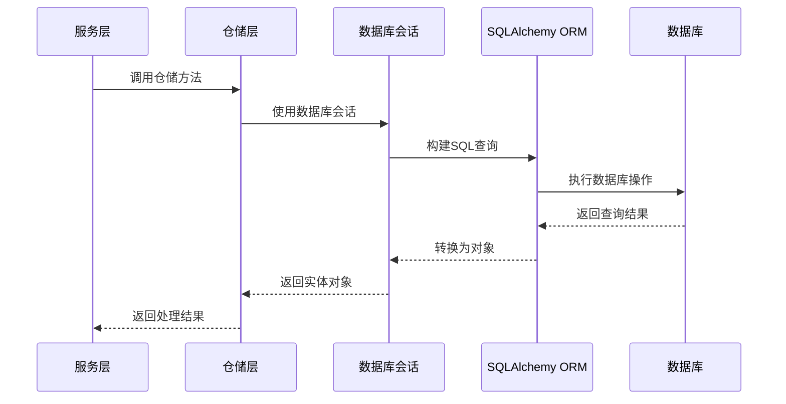

**仓储层与服务层的关系**：
- 仓储层是服务层的依赖，服务层通过仓储层访问数据
- 仓储层只负责数据访问，不包含业务规则
- 仓储层的方法设计应该与业务需求紧密相关，而不是简单的CRUD操作

**关键实现**：
```python
# app/repositories/base.py
from abc import ABC, abstractmethod
from typing import TypeVar, Generic, List, Optional
from sqlalchemy.ext.asyncio import AsyncSession

T = TypeVar("T")

class BaseRepository(ABC, Generic[T]):
    """仓储层基类"""
    
    def __init__(self, session: AsyncSession):
        self.session = session
    
    @abstractmethod
    async def get_by_id(self, id: int) -> Optional[T]:
        """根据ID获取实体"""
        pass
    
    @abstractmethod
    async def get_all(self, skip: int = 0, limit: int = 100) -> List[T]:
        """获取所有实体"""
        pass
    
    @abstractmethod
    async def create(self, obj: T) -> T:
        """创建实体"""
        pass
    
    @abstractmethod
    async def update(self, obj: T, update_data: dict) -> T:
        """更新实体"""
        pass
    
    @abstractmethod
    async def delete(self, obj: T) -> None:
        """删除实体"""
        pass
```

**用户仓储示例**：
```python
# app/domains/user/repositories/user_repository.py
from sqlalchemy.ext.asyncio import AsyncSession
from sqlalchemy import select
from app.repositories.base import BaseRepository
from app.domains.user.models import User
from app.domains.user.schemas import UserCreate, UserUpdate

class UserRepository(BaseRepository[User]):
    """用户仓储"""
    
    def __init__(self, session: AsyncSession):
        super().__init__(session)
    
    async def get_by_id(self, id: int) -> Optional[User]:
        """根据ID获取用户"""
        stmt = select(User).where(User.id == id)
        result = await self.session.execute(stmt)
        return result.scalar_one_or_none()
    
    async def get_by_email(self, email: str) -> Optional[User]:
        """根据邮箱获取用户"""
        stmt = select(User).where(User.email == email)
        result = await self.session.execute(stmt)
        return result.scalar_one_or_none()
    
    async def get_all(self, skip: int = 0, limit: int = 100) -> List[User]:
        """获取所有用户"""
        stmt = select(User).offset(skip).limit(limit)
        result = await self.session.execute(stmt)
        return result.scalars().all()
    
    async def create(self, user_create: UserCreate) -> User:
        """创建用户"""
        user = User(**user_create.model_dump())
        self.session.add(user)
        await self.session.commit()
        await self.session.refresh(user)
        return user
    
    async def update(self, user: User, user_update: UserUpdate) -> User:
        """更新用户"""
        update_data = user_update.model_dump(exclude_unset=True)
        for field, value in update_data.items():
            setattr(user, field, value)
        
        self.session.add(user)
        await self.session.commit()
        await self.session.refresh(user)
        return user
    
    async def delete(self, user: User) -> None:
        """删除用户"""
        await self.session.delete(user)
        await self.session.commit()
    
    async def get_users_by_role(self, role: str, skip: int = 0, limit: int = 100) -> List[User]:
        """根据角色获取用户"""
        stmt = select(User).where(User.role == role).offset(skip).limit(limit)
        result = await self.session.execute(stmt)
        return result.scalars().all()
```

### 6. 中间件模块

**核心作用**：处理请求/响应生命周期的横切逻辑

**设计特点**：
- 支持多种中间件
- 中间件顺序可控
- 支持自定义中间件
- 内置常用中间件（CORS、限流、日志、认证等）

**模块架构图**：
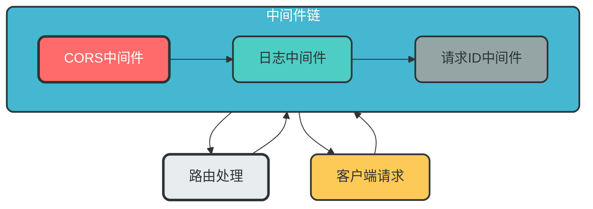

**数据流转图**：
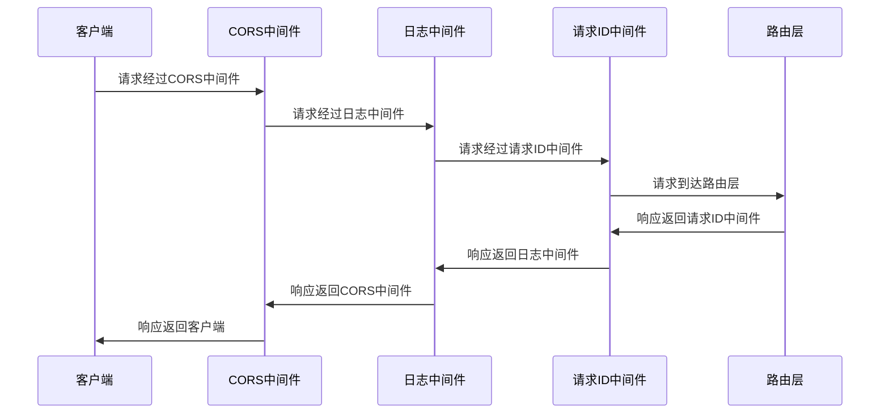

**关键实现**：
```python
# app/middleware/__init__.py
from app.middleware.cors import setup_cors
from app.middleware.request_logger import request_logger_middleware
from app.middleware.authentication import get_current_user, oauth2_scheme
from app.middleware.request import request_id_middleware


# main.py 中的中间件注册
def register_middlewares(app):
    """注册所有中间件"""
    # 1. 注册CORS中间件
    setup_cors(app)
    
    # 2. 注册日志中间件
    app.middleware("http")(request_logger_middleware)
    
    # 3. 注册请求ID中间件
    app.middleware("http")(request_id_middleware)
```

### 7. 安全模块

**核心作用**：提供全面的安全保障

**设计特点**：
- 支持多种认证方式（JWT、API Key、OAuth2等）
- 细粒度权限控制
- 输入验证和输出过滤
- 防止常见安全漏洞（SQL注入、XSS、CSRF等）

**模块架构图**：
```mermaid
graph LR
    subgraph 安全模块
        A[认证模块] --> B[JWT认证]
        A --> C[API Key认证]
        A --> D[OAuth2认证]
        
        E[授权模块] --> F[基于角色的访问控制]
        E --> G[基于权限的访问控制]
        
        H[数据安全] --> I[输入验证]
        H --> J[输出过滤]
        H --> K[加密解密]
        
        L[安全防护] --> M[防止SQL注入]
        L --> N[防止XSS攻击]
        L --> O[防止CSRF攻击]
    end
    
    style A fill:#FF6B6B,stroke:#2D3436,stroke-width:3px,color:white,rx:8,ry:8
    style B fill:#4ECDC4,stroke:#2D3436,stroke-width:2px,color:#2D3436,rx:8,ry:8
    style C fill:#45B7D1,stroke:#2D3436,stroke-width:2px,color:white,rx:8,ry:8
    style D fill:#96CEB4,stroke:#2D3436,stroke-width:2px,color:#2D3436,rx:8,ry:8
    style E fill:#FF9FF3,stroke:#2D3436,stroke-width:2px,color:#2D3436,rx:8,ry:8
    style F fill:#54A0FF,stroke:#2D3436,stroke-width:2px,color:white,rx:8,ry:8
    style G fill:#FECA57,stroke:#2D3436,stroke-width:2px,color:#2D3436,rx:8,ry:8
    style H fill:#E9ECEF,stroke:#2D3436,stroke-width:3px,color:#2D3436,rx:8,ry:8
    style I fill:#FF6B6B,stroke:#2D3436,stroke-width:2px,color:white,rx:8,ry:8
    style J fill:#4ECDC4,stroke:#2D3436,stroke-width:2px,color:#2D3436,rx:8,ry:8
    style K fill:#45B7D1,stroke:#2D3436,stroke-width:2px,color:white,rx:8,ry:8
    style L fill:#96CEB4,stroke:#2D3436,stroke-width:2px,color:#2D3436,rx:8,ry:8
    style M fill:#FF9FF3,stroke:#2D3436,stroke-width:2px,color:#2D3436,rx:8,ry:8
    style N fill:#54A0FF,stroke:#2D3436,stroke-width:2px,color:white,rx:8,ry:8
    style O fill:#FECA57,stroke:#2D3436,stroke-width:2px,color:#2D3436,rx:8,ry:8
```

**数据流转图**：
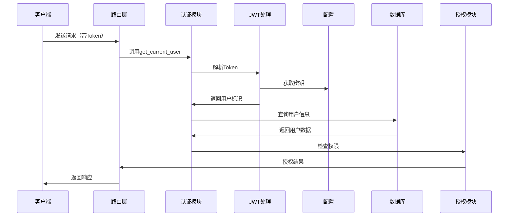

**关键实现**：
```python
# app/security/auth.py
from fastapi import Depends, HTTPException, status
from fastapi.security import OAuth2PasswordBearer
from jose import JWTError, jwt
from app.config.settings import settings

oauth2_scheme = OAuth2PasswordBearer(tokenUrl="/api/v1/auth/token")

async def get_current_user(token: str = Depends(oauth2_scheme)):
    """获取当前用户"""
    credentials_exception = HTTPException(
        status_code=status.HTTP_401_UNAUTHORIZED,
        detail="Could not validate credentials",
        headers={"WWW-Authenticate": "Bearer"},
    )
    try:
        payload = jwt.decode(token, settings.security.secret_key, algorithms=[settings.security.algorithm])
        username: str = payload.get("sub")
        if username is None:
            raise credentials_exception
    except JWTError:
        raise credentials_exception
    # 从数据库获取用户
    # user = await user_repository.get_by_username(username)
    # if user is None:
    #     raise credentials_exception
    return username
```

### 8. 观测性模块

**核心作用**：提供全面的监控、追踪和日志功能，便于系统的运维、调试和性能优化

**设计特点**：
- 结构化日志：支持JSON格式日志，便于分析和监控
- 请求追踪：支持分布式追踪，便于定位请求瓶颈
- 性能监控：支持指标收集，便于性能分析和优化
- 健康检查：支持系统健康状态检查
- 可扩展性：支持多种观测性工具集成

**模块架构图**：
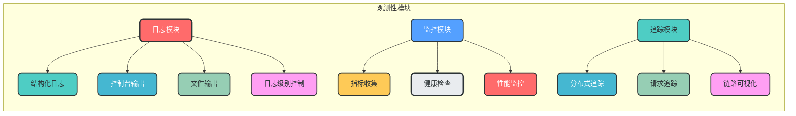

**数据流转图**：
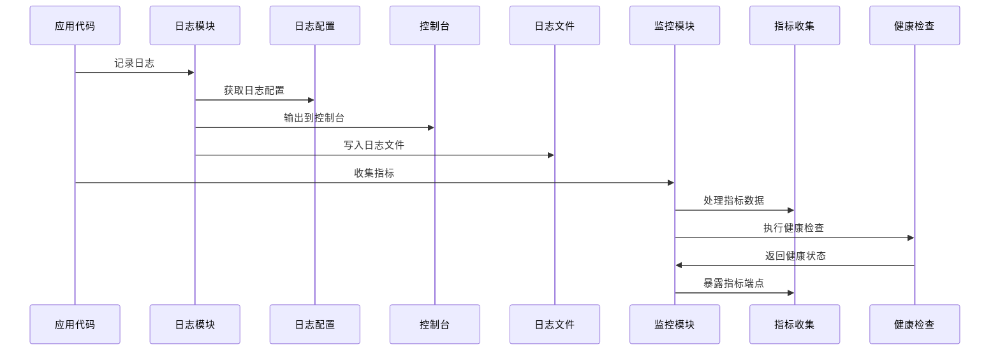

**日志配置说明**：
- 日志配置统一在观测性模块中管理
- 支持多环境日志配置
- 支持控制台和文件两种日志输出方式
- 支持不同日志级别配置
- 支持结构化日志格式

**关键实现**：
```python
# app/observability/logging.py
import logging
from logging.config import dictConfig
from app.config.settings import settings

LOGGING_CONFIG = {
    "version": 1,
    "disable_existing_loggers": False,
    "formatters": {
        "json": {
            "()": "pythonjsonlogger.jsonlogger.JsonFormatter",
            "format": "%(asctime)s %(name)s %(levelname)s %(message)s %(extra)s",
        },
        "console": {
            "format": "%(asctime)s - %(name)s - %(levelname)s - %(message)s",
        },
    },
    "handlers": {
        "console": {
            "class": "logging.StreamHandler",
            "formatter": "console",
            "level": "DEBUG" if settings.debug else "INFO",
        },
        "file": {
            "class": "logging.handlers.RotatingFileHandler",
            "filename": "app.log",
            "maxBytes": 1024 * 1024 * 100,  # 100MB
            "backupCount": 5,
            "formatter": "json",
            "level": "INFO",
        },
    },
    "loggers": {
        "app": {
            "handlers": ["console", "file"],
            "level": "DEBUG" if settings.debug else "INFO",
            "propagate": False,
        },
        "uvicorn": {
            "handlers": ["console"],
            "level": "INFO",
            "propagate": False,
        },
    },
}

# 配置日志
dictConfig(LOGGING_CONFIG)
logger = logging.getLogger("app")
```

**使用示例**：
```python
# 在代码中使用日志
from app.observability.logging import logger

logger.info("User created", extra={"user_id": 1, "email": "test@example.com"})
logger.error("Failed to create user", exc_info=True, extra={"email": "test@example.com"})
```

### 9. 异步任务与消息队列

**核心作用**：处理异步任务，支持事件驱动架构，提高系统的并发性能和可靠性

**设计特点**：
- 支持多种消息队列集成（RabbitMQ, Redis, Kafka等）
- 异步任务处理，提高系统并发性能
- 事件驱动设计，支持松耦合架构
- 任务重试机制，提高系统可靠性
- 统一的消息队列接口，便于切换实现

**模块架构图**：
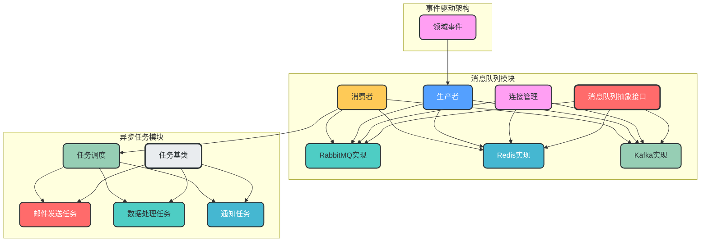

**数据流转图**：
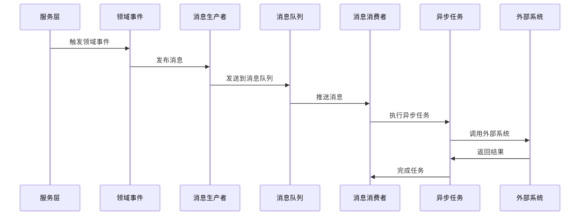

**消息队列选型建议**：
| 消息队列 | 适用场景 | 特点 |
| --- | --- | --- |
| **RabbitMQ** | 异步任务处理、事件驱动、工作队列 | 可靠性高、支持多种协议、成熟稳定 |
| **Redis** | 简单异步任务、缓存、实时数据处理 | 性能高、部署简单、支持多种数据结构 |
| **Kafka** | 大规模数据流处理、日志收集、实时分析 | 高吞吐量、支持持久化、分布式设计 |

**目录结构设计**：
```
app/infrastructure/queue/
├── __init__.py
├── base.py              # 消息队列抽象接口
├── connection.py        # 连接管理
├── producers/           # 消息生产者
│   ├── __init__.py
│   ├── rabbitmq_producer.py
│   ├── redis_producer.py
│   └── kafka_producer.py
├── consumers/           # 消息消费者
│   ├── __init__.py
│   ├── rabbitmq_consumer.py
│   ├── redis_consumer.py
│   └── kafka_consumer.py
└── config.py            # 消息队列配置
```

**关键实现**：
```python
# app/infrastructure/queue/base.py
from abc import ABC, abstractmethod
from typing import Any, Dict, List

class BaseQueue(ABC):
    """消息队列抽象基类"""
    
    @abstractmethod
    async def connect(self) -> None:
        """连接到消息队列"""
        pass
    
    @abstractmethod
    async def disconnect(self) -> None:
        """断开消息队列连接"""
        pass
    
    @abstractmethod
    async def publish(self, topic: str, message: Dict[str, Any]) -> None:
        """发布消息"""
        pass
    
    @abstractmethod
    async def subscribe(self, topic: str, callback) -> None:
        """订阅消息"""
        pass

# app/infrastructure/queue/connection.py
from app.config.settings import settings
from app.infrastructure.queue.producers.rabbitmq_producer import RabbitMQProducer
from app.infrastructure.queue.producers.redis_producer import RedisProducer
from app.infrastructure.queue.producers.kafka_producer import KafkaProducer

async def get_queue_producer():
    """获取消息队列生产者"""
    queue_type = settings.queue.type  # 从配置中获取消息队列类型
    
    if queue_type == "rabbitmq":
        producer = RabbitMQProducer()
    elif queue_type == "redis":
        producer = RedisProducer()
    elif queue_type == "kafka":
        producer = KafkaProducer()
    else:
        raise ValueError(f"Unsupported queue type: {queue_type}")
    
    await producer.connect()
    try:
        yield producer
    finally:
        await producer.disconnect()

# app/tasks/base.py
from abc import ABC, abstractmethod
from typing import Any, Dict

class BaseTask(ABC):
    """任务基类"""
    
    @abstractmethod
    async def execute(self, **kwargs: Dict[str, Any]) -> Any:
        """执行任务"""
        pass

# app/tasks/email.py
from app.tasks.base import BaseTask
from app.observability.logging import logger

class SendEmailTask(BaseTask):
    """发送邮件任务"""
    
    async def execute(self, **kwargs: Dict[str, Any]) -> Any:
        """执行发送邮件任务"""
        email = kwargs.get("email")
        subject = kwargs.get("subject")
        content = kwargs.get("content")
        
        # 实际发送邮件逻辑
        logger.info(f"Sending email to {email} with subject: {subject}")
        # send_email(email, subject, content)
        
        return {"status": "success", "email": email}
```

**使用示例**：
```python
# 发布事件
from app.infrastructure.queue.connection import get_queue_producer

async def publish_user_created_event(user_id: int, email: str):
    """发布用户创建事件"""
    async with get_queue_producer() as producer:
        await producer.publish("user.created", {
            "user_id": user_id,
            "email": email
        })

# 消费事件
from app.infrastructure.queue.connection import get_queue_consumer
from app.tasks.email import SendEmailTask

async def consume_user_created_events():
    """消费用户创建事件"""
    email_task = SendEmailTask()
    
    async def handle_user_created(event_data):
        """处理用户创建事件"""
        user_id = event_data["user_id"]
        email = event_data["email"]
        
        # 发送欢迎邮件
        await email_task.execute(
            email=email,
            subject="Welcome to our platform",
            content=f"Hello, thank you for registering with us! Your user ID is {user_id}."
        )
    
    async with get_queue_consumer() as consumer:
        await consumer.subscribe("user.created", handle_user_created)
```

### 10. 插件架构设计

**核心作用**：支持架构扩展，允许动态加载插件

**设计特点**：
- 插件接口抽象
- 插件自动发现
- 插件生命周期管理
- 插件依赖管理

**模块架构图**：
```mermaid
graph TD
    subgraph 插件架构
        A[插件基类] --> B[认证插件]
        A --> C[日志插件]
        A --> D[监控插件]
        A --> E[自定义插件]
        
        F[插件管理器] --> G[插件发现]
        F --> H[插件注册]
        F --> I[插件初始化]
        F --> J[插件注销]
        
        G --> K[入口点扫描]
        G --> L[动态加载]
        
        H --> M[路由注册]
        H --> N[中间件注册]
        H --> O[事件监听]
    end
    
    FastAPI[FastAPI应用] --> F
    F --> FastAPI
    
    style A fill:#FF6B6B,stroke:#2D3436,stroke-width:3px,color:white,rx:8,ry:8
    style B fill:#4ECDC4,stroke:#2D3436,stroke-width:2px,color:#2D3436,rx:8,ry:8
    style C fill:#45B7D1,stroke:#2D3436,stroke-width:2px,color:white,rx:8,ry:8
    style D fill:#96CEB4,stroke:#2D3436,stroke-width:2px,color:#2D3436,rx:8,ry:8
    style E fill:#FF9FF3,stroke:#2D3436,stroke-width:2px,color:#2D3436,rx:8,ry:8
    style F fill:#54A0FF,stroke:#2D3436,stroke-width:2px,color:white,rx:8,ry:8
    style G fill:#FECA57,stroke:#2D3436,stroke-width:2px,color:#2D3436,rx:8,ry:8
    style H fill:#E9ECEF,stroke:#2D3436,stroke-width:3px,color:#2D3436,rx:8,ry:8
    style I fill:#FF6B6B,stroke:#2D3436,stroke-width:2px,color:white,rx:8,ry:8
    style J fill:#4ECDC4,stroke:#2D3436,stroke-width:2px,color:#2D3436,rx:8,ry:8
    style K fill:#45B7D1,stroke:#2D3436,stroke-width:2px,color:white,rx:8,ry:8
    style L fill:#96CEB4,stroke:#2D3436,stroke-width:2px,color:#2D3436,rx:8,ry:8
    style M fill:#FF9FF3,stroke:#2D3436,stroke-width:2px,color:#2D3436,rx:8,ry:8
    style N fill:#54A0FF,stroke:#2D3436,stroke-width:2px,color:white,rx:8,ry:8
    style O fill:#FECA57,stroke:#2D3436,stroke-width:2px,color:#2D3436,rx:8,ry:8
    style FastAPI fill:#45B7D1,stroke:#2D3436,stroke-width:2px,color:white,rx:8,ry:8
```

**数据流转图**：
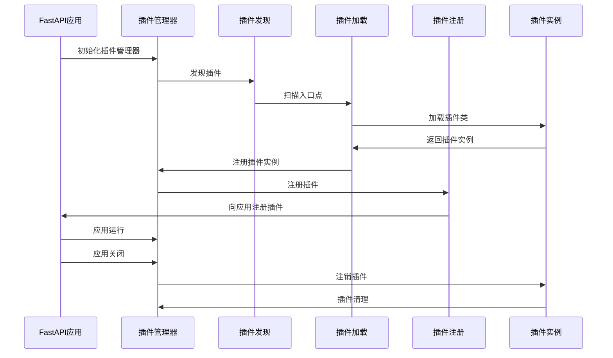

**关键实现**：
```python
# app/plugins/base.py
from abc import ABC, abstractmethod
from fastapi import FastAPI

class BasePlugin(ABC):
    """插件基类"""
    
    name: str
    version: str
    description: str
    
    @abstractmethod
    def register(self, app: FastAPI) -> None:
        """注册插件"""
        pass
    
    @abstractmethod
    def unregister(self) -> None:
        """注销插件"""
        pass

# app/plugins/manager.py
from fastapi import FastAPI
from app.plugins.base import BasePlugin
from typing import List
import pkg_resources

class PluginManager:
    """插件管理器"""
    
    def __init__(self):
        self.plugins: List[BasePlugin] = []
    
    def discover_plugins(self) -> None:
        """发现插件"""
        for entry_point in pkg_resources.iter_entry_points("fastapi.plugins"):
            try:
                plugin_class = entry_point.load()
                if issubclass(plugin_class, BasePlugin):
                    plugin = plugin_class()
                    self.plugins.append(plugin)
            except Exception as e:
                # 记录插件加载失败
                from app.observability.logging import logger
                logger.error(f"Failed to load plugin {entry_point.name}: {e}")
    
    def register_plugins(self, app: FastAPI) -> None:
        """注册所有插件"""
        for plugin in self.plugins:
            try:
                plugin.register(app)
            except Exception as e:
                # 记录插件注册失败
                from app.observability.logging import logger
                logger.error(f"Failed to register plugin {plugin.name}: {e}")
```