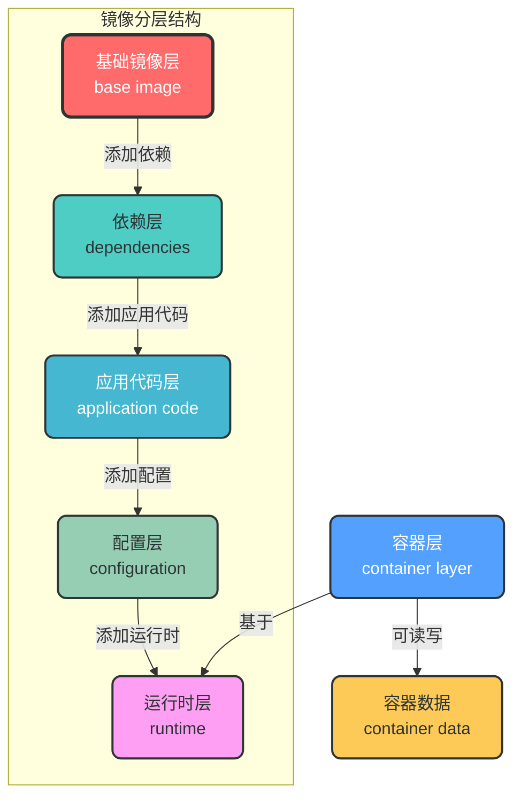
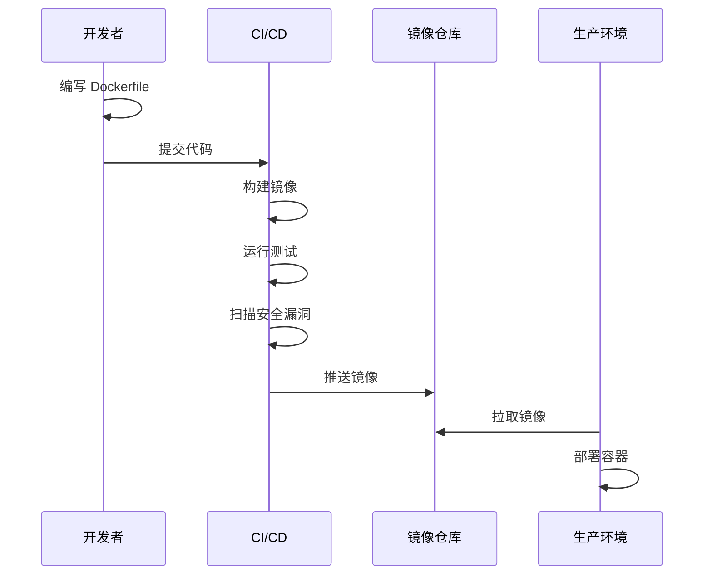

# 1. 镜像管理

## 1.1 核心概念

Docker 镜像是一个轻量级、可执行的独立软件包，包含运行应用程序所需的所有内容：代码、运行时、库、环境变量和配置文件。

### 1.1.1 镜像的分层结构

Docker 镜像采用分层文件系统（Layered File System），每层代表镜像构建过程中的一个步骤。这种设计带来了以下优势：

- **复用性**：不同镜像可以共享相同的底层层
- **增量更新**：只需要更新变化的层
- **减少存储占用**：共享层只存储一次



## 1.2 镜像命令

### 1.2.1 镜像拉取

从镜像仓库拉取镜像到本地。

```bash
# 拉取最新版本镜像
docker pull <image_name>

# 拉取指定版本镜像
docker pull <image_name>:<tag>

# 拉取所有版本镜像
docker pull -a <image_name>

# 示例：拉取最新版 Ubuntu 镜像
docker pull ubuntu

# 示例：拉取指定版本 Ubuntu 镜像
docker pull ubuntu:22.04
```

### 1.2.2 镜像列表

查看本地已有的镜像。

```bash
# 列出所有本地镜像
docker images

# 列出所有本地镜像（包括中间层镜像）
docker images -a

# 只显示镜像 ID
docker images -q

# 过滤镜像
docker images | grep <keyword>

# 示例：列出所有 Ubuntu 相关镜像
docker images | grep ubuntu
```

### 1.2.3 镜像构建

使用 Dockerfile 构建镜像。

```bash
# 基本构建命令
docker build -t <image_name>:<tag> <build_context>

# 从指定 Dockerfile 构建
docker build -f <dockerfile_path> -t <image_name>:<tag> <build_context>

# 构建时传递构建参数
docker build --build-arg <arg_name>=<value> -t <image_name>:<tag> <build_context>

# 示例：从当前目录构建镜像
docker build -t myapp:1.0 .

# 示例：从指定 Dockerfile 构建
docker build -f ./Dockerfile.prod -t myapp:prod .
```

### 1.2.4 镜像检查

查看镜像的详细信息。

```bash
# 查看镜像详细信息
docker inspect <image_name>:<tag>

# 查看镜像历史
docker history <image_name>:<tag>

# 示例：查看 Ubuntu 镜像详细信息
docker inspect ubuntu:22.04

# 示例：查看镜像构建历史
docker history myapp:1.0
```

### 1.2.5 镜像标记

为镜像添加新的标签。

```bash
# 为镜像添加标签
docker tag <source_image>:<source_tag> <target_image>:<target_tag>

# 示例：为本地镜像添加仓库标签
docker tag myapp:1.0 registry.example.com/myapp:1.0
```

### 1.2.6 镜像推送

将本地镜像推送到远程仓库。

```bash
# 推送镜像到远程仓库
docker push <image_name>:<tag>

# 示例：推送镜像到 Docker Hub
docker push myusername/myapp:1.0

# 示例：推送镜像到私有仓库
docker push registry.example.com/myapp:1.0
```

### 1.2.7 镜像删除

删除本地镜像。

```bash
# 删除单个镜像
docker rmi <image_name>:<tag>

# 删除多个镜像
docker rmi <image1> <image2> <image3>

# 强制删除镜像
docker rmi -f <image_name>:<tag>

# 删除所有本地镜像
docker rmi $(docker images -q)

# 示例：删除指定镜像
docker rmi myapp:1.0

# 示例：强制删除镜像
docker rmi -f ubuntu:22.04
```

## 1.3 镜像构建流程

```mermaid
flowchart TD
    subgraph 镜像构建流程
        A[编写 Dockerfile] -->|定义构建指令| B[Dockerfile]
        C[构建上下文] -->|提供文件| D[docker build 命令]
        B -->|读取| D
        D -->|步骤1| E[解析 Dockerfile]
        E -->|步骤2| F[创建构建上下文]
        F -->|步骤3| G[拉取基础镜像]
        G -->|步骤4| H[执行 RUN 指令]
        H -->|步骤5| I[执行其他指令]
        I -->|步骤6| J[创建新镜像层]
        J -->|步骤7| K[生成最终镜像]
        K -->|输出| L[镜像 ID]
    end
    
    style A fill:#FF6B6B,stroke:#2D3436,stroke-width:3px,color:white,rx:8,ry:8
    style B fill:#4ECDC4,stroke:#2D3436,stroke-width:2px,color:#2D3436,rx:8,ry:8
    style C fill:#45B7D1,stroke:#2D3436,stroke-width:2px,color:white,rx:8,ry:8
    style D fill:#96CEB4,stroke:#2D3436,stroke-width:2px,color:#2D3436,rx:8,ry:8
    style E fill:#FF9FF3,stroke:#2D3436,stroke-width:2px,color:#2D3436,rx:8,ry:8
    style F fill:#54A0FF,stroke:#2D3436,stroke-width:2px,color:white,rx:8,ry:8
    style G fill:#FECA57,stroke:#2D3436,stroke-width:2px,color:#2D3436,rx:8,ry:8
    style H fill:#A29BFE,stroke:#2D3436,stroke-width:2px,color:white,rx:8,ry:8
    style I fill:#FD79A8,stroke:#2D3436,stroke-width:2px,color:white,rx:8,ry:8
    style J fill:#E17055,stroke:#2D3436,stroke-width:2px,color:white,rx:8,ry:8
    style K fill:#00B894,stroke:#2D3436,stroke-width:2px,color:white,rx:8,ry:8
    style L fill:#6C5CE7,stroke:#2D3436,stroke-width:2px,color:white,rx:8,ry:8
```



## 1.4 镜像优化策略

### 1.4.1 减少镜像大小

- 使用更小的基础镜像（如 Alpine Linux）
- 合并 RUN 指令，减少镜像层数
- 清理构建过程中的临时文件
- 使用 .dockerignore 文件排除不必要的文件

### 1.4.2 提高构建速度

- 使用缓存机制，合理安排指令顺序
- 使用多阶段构建（Multi-stage Build）
- 分离依赖安装和应用代码

### 1.4.3 多阶段构建示例

```dockerfile
# 第一阶段：构建阶段
FROM node:18 AS builder
WORKDIR /app
COPY package*.json ./
RUN npm install
COPY . .
RUN npm run build

# 第二阶段：运行阶段
FROM nginx:alpine
COPY --from=builder /app/dist /usr/share/nginx/html
EXPOSE 80
CMD ["nginx", "-g", "daemon off;"]
```

## 1.5 镜像管理最佳实践

1. **使用语义化版本标签**：避免使用 `latest` 标签，使用明确的版本号
2. **保持镜像轻量化**：只包含必要的依赖和文件
3. **使用多阶段构建**：分离构建环境和运行环境
4. **定期更新基础镜像**：及时修复安全漏洞
5. **使用镜像扫描工具**：检测镜像中的安全漏洞
6. **建立镜像命名规范**：如 `registry.example.com/project/service:version`
7. **使用 .dockerignore 文件**：排除不必要的文件和目录
8. **编写清晰的 Dockerfile 注释**：提高可维护性

## 1.6 常见镜像问题

### 1.6.1 镜像拉取失败

```bash
# 问题：拉取镜像超时
# 解决方案：配置国内镜像源
echo '{"registry-mirrors": ["https://registry.docker-cn.com"]}' > /etc/docker/daemon.json

# 重启 Docker 服务
systemctl restart docker
```

### 1.6.2 镜像构建失败

```bash
# 问题：构建过程中依赖安装失败
# 解决方案：检查网络连接和依赖源配置
# 示例：在 Dockerfile 中添加国内源
RUN sed -i 's/archive.ubuntu.com/mirrors.aliyun.com/g' /etc/apt/sources.list
```

### 1.6.3 镜像体积过大

```bash
# 问题：镜像体积过大
# 解决方案：使用 docker-slim 工具优化镜像
docker-slim build --http-probe myapp:1.0
```

## 1.7 镜像管理工作流



## 1.8 镜像存储与清理

### 1.8.1 镜像存储位置

Docker 镜像默认存储在 `/var/lib/docker` 目录下，可以通过 Docker 守护进程配置修改存储位置。

### 1.8.2 镜像清理命令

```bash
# 删除未使用的镜像
docker image prune

# 删除所有未使用的镜像（包括中间层镜像）
docker image prune -a

# 删除指定镜像
docker rmi <image_name>:<tag>

# 删除所有镜像
docker rmi $(docker images -q)
```

通过本章节的学习，您已经掌握了 Docker 镜像的核心概念、管理命令和最佳实践。镜像管理是 Docker 使用的基础，熟练掌握这些知识将为您后续的容器管理和编排打下坚实的基础。