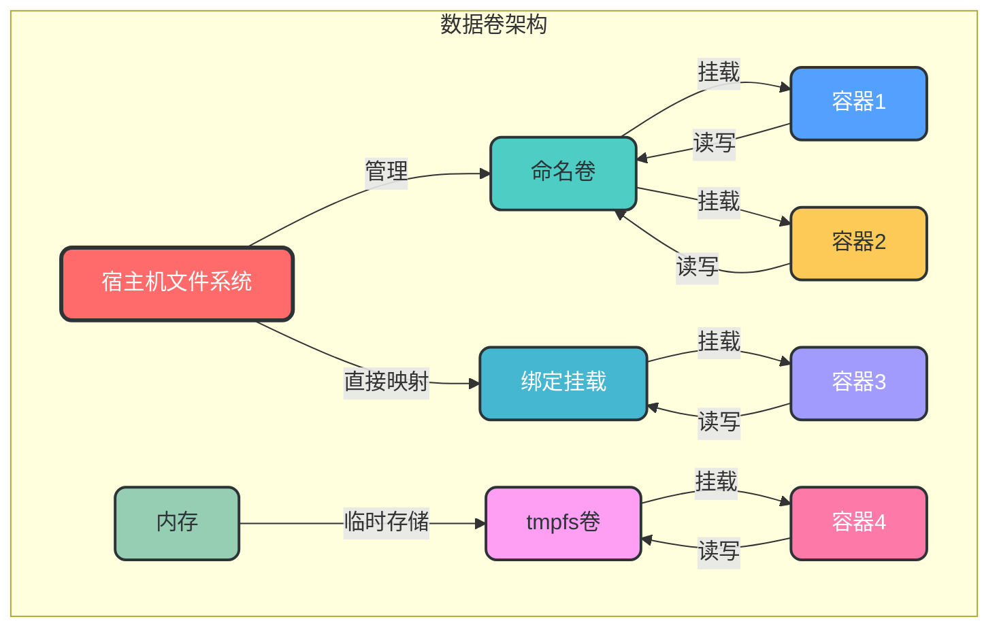
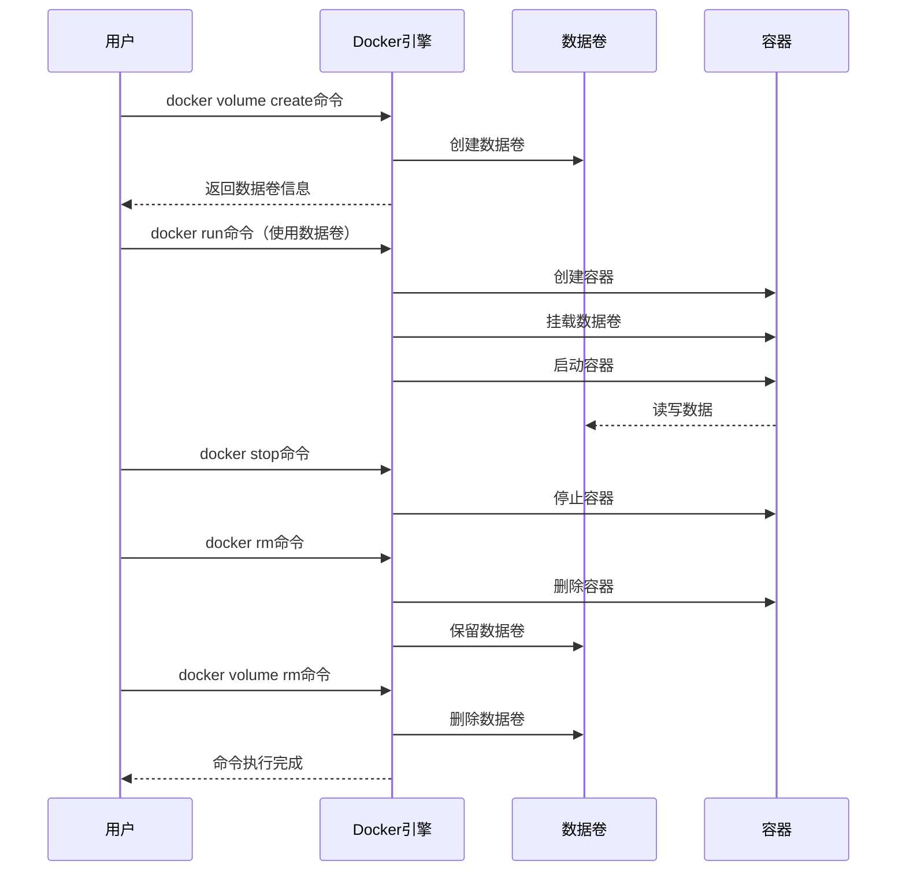

# 4. 数据卷管理

## 4.1 核心概念

Docker 数据卷是用于持久化存储容器数据的机制，它独立于容器的生命周期，能够在容器之间共享数据，并且可以在容器删除后保留数据。

### 4.1.1 数据卷的优势

- **持久化存储**：数据卷独立于容器生命周期，容器删除后数据仍保留
- **数据共享**：多个容器可以共享同一个数据卷
- **高性能**：直接映射到宿主机文件系统，IO 性能高
- **易于备份和恢复**：可以直接从宿主机访问和管理数据
- **跨平台兼容**：在不同操作系统上表现一致

## 4.2 数据卷类型

Docker 支持三种主要的数据持久化方式：

| 数据卷类型 | 描述 | 适用场景 |
|---------|------|----------|
| 命名卷 (Named Volumes) | 由 Docker 管理的卷，存储在默认路径 | 大多数场景，推荐使用 |
| 绑定挂载 (Bind Mounts) | 将宿主机目录或文件挂载到容器 | 需要访问宿主机特定目录 |
| tmpfs 卷 (tmpfs Volumes) | 存储在内存中的临时文件系统 | 临时数据，不需要持久化 |

### 4.2.1 数据卷架构



## 4.3 数据卷命令

### 4.3.1 数据卷管理

```bash
# 创建数据卷
docker volume create <volume_name>

# 列出所有数据卷
docker volume ls

# 查看数据卷详情
docker volume inspect <volume_name>

# 删除数据卷
docker volume rm <volume_name>

# 删除所有未使用的数据卷
docker volume prune

# 示例：创建数据卷
docker volume create myapp-data

# 示例：查看数据卷详情
docker volume inspect myapp-data
```

### 4.3.2 数据卷使用

```bash
# 使用命名卷启动容器
docker run -d --name myapp -v <volume_name>:<container_path> <image_name>:<tag>

# 使用绑定挂载启动容器
docker run -d --name myapp -v <host_path>:<container_path> <image_name>:<tag>

# 使用 tmpfs 卷启动容器
docker run -d --name myapp --tmpfs <container_path> <image_name>:<tag>

# 示例：使用命名卷
docker run -d --name mysql -v mysql-data:/var/lib/mysql -e MYSQL_ROOT_PASSWORD=123456 mysql:8.0

# 示例：使用绑定挂载
docker run -d --name nginx -v ./html:/usr/share/nginx/html nginx:alpine
```

## 4.4 数据卷使用示例

### 4.4.1 命名卷示例

```bash
# 创建命名卷
docker volume create app-data

# 启动容器使用命名卷
docker run -d --name app1 -v app-data:/app/data nginx:alpine

# 另一个容器共享同一个命名卷
docker run -d --name app2 -v app-data:/app/data nginx:alpine

# 在 app1 中创建文件
docker exec app1 touch /app/data/test.txt

# 在 app2 中查看文件是否存在
docker exec app2 ls -la /app/data/
```

### 4.4.2 绑定挂载示例

```bash
# 创建宿主机目录
mkdir -p ./app-data

# 启动容器使用绑定挂载
docker run -d --name app -v ./app-data:/app/data nginx:alpine

# 在宿主机创建文件
echo "Hello Docker" > ./app-data/hello.txt

# 在容器中查看文件
docker exec app cat /app/data/hello.txt
```

### 4.4.3 tmpfs 卷示例

```bash
# 启动容器使用 tmpfs 卷
docker run -d --name app --tmpfs /app/tmp nginx:alpine

# 在容器中创建临时文件
docker exec app echo "Temp Data" > /app/tmp/temp.txt

# 查看临时文件
docker exec app cat /app/tmp/temp.txt

# 重启容器后，临时文件将丢失
docker restart app
docker exec app cat /app/tmp/temp.txt
```

## 4.5 数据卷最佳实践

### 4.5.1 命名规范

```bash
# 推荐命名规范：<project>-<service>-<purpose>
# 示例：
docker volume create myapp-mysql-data
docker volume create myapp-nginx-logs
docker volume create myapp-redis-cache
```

### 4.5.2 数据备份与恢复

```bash
# 备份数据卷
# 方法1：使用容器复制数据
docker run --rm -v <volume_name>:/volume -v $(pwd):/backup ubuntu tar -czvf /backup/<volume_name>.tar.gz /volume

# 方法2：直接复制数据卷目录
# 查看数据卷路径
docker volume inspect <volume_name> | grep -A 5 "Mountpoint"
# 复制数据
sudo cp -r <volume_path> <backup_path>

# 恢复数据卷
# 方法1：使用容器恢复数据
docker run --rm -v <volume_name>:/volume -v $(pwd):/backup ubuntu tar -xzvf /backup/<volume_name>.tar.gz -C /

# 示例：备份 mysql-data 卷
docker run --rm -v mysql-data:/volume -v $(pwd):/backup ubuntu tar -czvf /backup/mysql-data.tar.gz /volume

# 示例：恢复 mysql-data 卷
docker volume create mysql-data
cdocker run --rm -v mysql-data:/volume -v $(pwd):/backup ubuntu tar -xzvf /backup/mysql-data.tar.gz -C /
```

### 4.5.3 数据卷权限管理

```bash
# 方式1：在 Dockerfile 中设置权限
FROM nginx:alpine
RUN mkdir -p /app/data && chown -R nginx:nginx /app/data
USER nginx

# 方式2：运行容器时指定用户
docker run -d --name app -v app-data:/app/data -u $(id -u):$(id -g) nginx:alpine

# 方式3：使用 --mount 选项指定权限
docker run -d --name app --mount type=volume,src=app-data,dst=/app/data,readonly nginx:alpine
```

### 4.5.4 数据卷性能优化

```bash
# 1. 选择合适的存储驱动
# 查看当前存储驱动
docker info | grep -i storage

# 2. 避免在数据卷中存储大量小文件
# 3. 使用 SSD 存储提高性能
# 4. 合理设置数据卷大小
# 5. 定期清理数据卷中的无用数据
```

## 4.6 数据卷生命周期管理



## 4.7 数据卷监控与维护

### 4.7.1 数据卷监控

```bash
# 查看数据卷使用情况
# 方法1：使用 df 命令
docker run --rm -v <volume_name>:/volume alpine df -h /volume

# 方法2：查看宿主机上的数据卷大小
docker volume inspect <volume_name> | grep -A 5 "Mountpoint"
sudo du -sh <volume_path>

# 示例：查看 mysql-data 卷大小
docker run --rm -v mysql-data:/volume alpine df -h /volume
```

### 4.7.2 数据卷清理

```bash
# 删除未使用的数据卷
docker volume prune

# 清理数据卷中的无用数据
# 示例：清理旧日志文件
docker exec <container_name> rm -rf /app/data/*.log.old

# 示例：清理超过30天的文件
docker exec <container_name> find /app/data -type f -mtime +30 -delete
```

## 4.8 常见数据卷问题

### 4.8.1 权限问题

```bash
# 问题：容器无法写入数据卷
# 解决方案：检查权限设置

# 1. 查看容器内文件权限
docker exec <container_name> ls -la <container_path>

# 2. 查看宿主机上的数据卷权限
docker volume inspect <volume_name> | grep -A 5 "Mountpoint"
sudo ls -la <volume_path>

# 3. 修复权限
docker run --rm -v <volume_name>:/volume alpine chown -R <user>:<group> /volume

# 示例：修复 mysql-data 卷权限
docker run --rm -v mysql-data:/volume alpine chown -R mysql:mysql /volume
```

### 4.8.2 数据丢失

```bash
# 问题：数据卷中的数据丢失
# 解决方案：

# 1. 检查数据卷是否被误删
docker volume ls

# 2. 检查是否使用了错误的数据卷名称
docker inspect <container_name> | grep -A 10 "Mounts"

# 3. 检查是否使用了绑定挂载而非命名卷

# 4. 恢复从备份
docker run --rm -v <volume_name>:/volume -v $(pwd):/backup ubuntu tar -xzvf /backup/<volume_name>.tar.gz -C /
```

### 4.8.3 数据卷性能问题

```bash
# 问题：数据卷读写性能差
# 解决方案：

# 1. 检查存储驱动类型
docker info | grep -i storage

# 2. 检查磁盘 IO 使用率
iostat -x 1

# 3. 考虑使用 SSD 存储

# 4. 优化应用程序 IO 模式

# 5. 考虑使用 tmpfs 卷存储临时数据
```

### 4.8.4 数据卷空间不足

```bash
# 问题：数据卷空间不足
# 解决方案：

# 1. 查看数据卷使用情况
docker run --rm -v <volume_name>:/volume alpine df -h /volume

# 2. 清理数据卷中的无用数据
docker exec <container_name> rm -rf /app/data/*.log.old

# 3. 考虑使用外部存储服务（如云存储）

# 4. 扩展存储卷大小（如果支持）
```

## 4.9 数据卷与 Docker Compose

在 Docker Compose 中使用数据卷的示例：

```yaml
version: '3.8'
services:
  mysql:
    image: mysql:8.0
    environment:
      MYSQL_ROOT_PASSWORD: 123456
    volumes:
      - mysql-data:/var/lib/mysql
      - ./init.sql:/docker-entrypoint-initdb.d/init.sql:ro
  
  nginx:
    image: nginx:alpine
    volumes:
      - ./html:/usr/share/nginx/html
      - nginx-logs:/var/log/nginx
    ports:
      - "80:80"
  
  app:
    image: myapp:1.0
    volumes:
      - app-data:/app/data
      - type: tmpfs
        target: /app/tmp
    depends_on:
      - mysql
      - nginx

volumes:
  mysql-data:
  nginx-logs:
  app-data:
```

## 4.10 数据卷最佳实践总结

1. **优先使用命名卷**：由 Docker 管理，更安全可靠
2. **使用清晰的命名规范**：便于管理和维护
3. **定期备份数据卷**：防止数据丢失
4. **合理设置权限**：保障数据安全
5. **监控数据卷使用情况**：及时发现问题
6. **清理未使用的数据卷**：释放存储空间
7. **选择合适的数据卷类型**：根据场景选择命名卷、绑定挂载或 tmpfs 卷
8. **优化数据卷性能**：选择合适的存储驱动和硬件
9. **避免在数据卷中存储敏感信息**：敏感数据使用环境变量或外部密钥管理服务
10. **测试数据恢复流程**：确保备份数据可以正常恢复

通过本章节的学习，您已经掌握了 Docker 数据卷的核心概念、管理命令和最佳实践。数据卷管理是 Docker 持久化存储的重要组成部分，熟练掌握这些知识将帮助您构建可靠的数据存储方案。