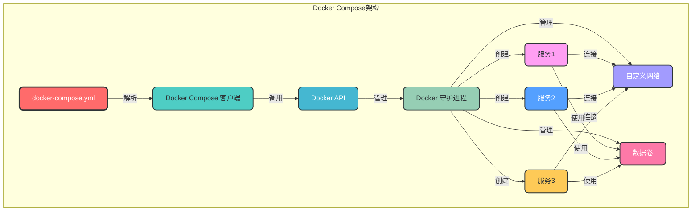
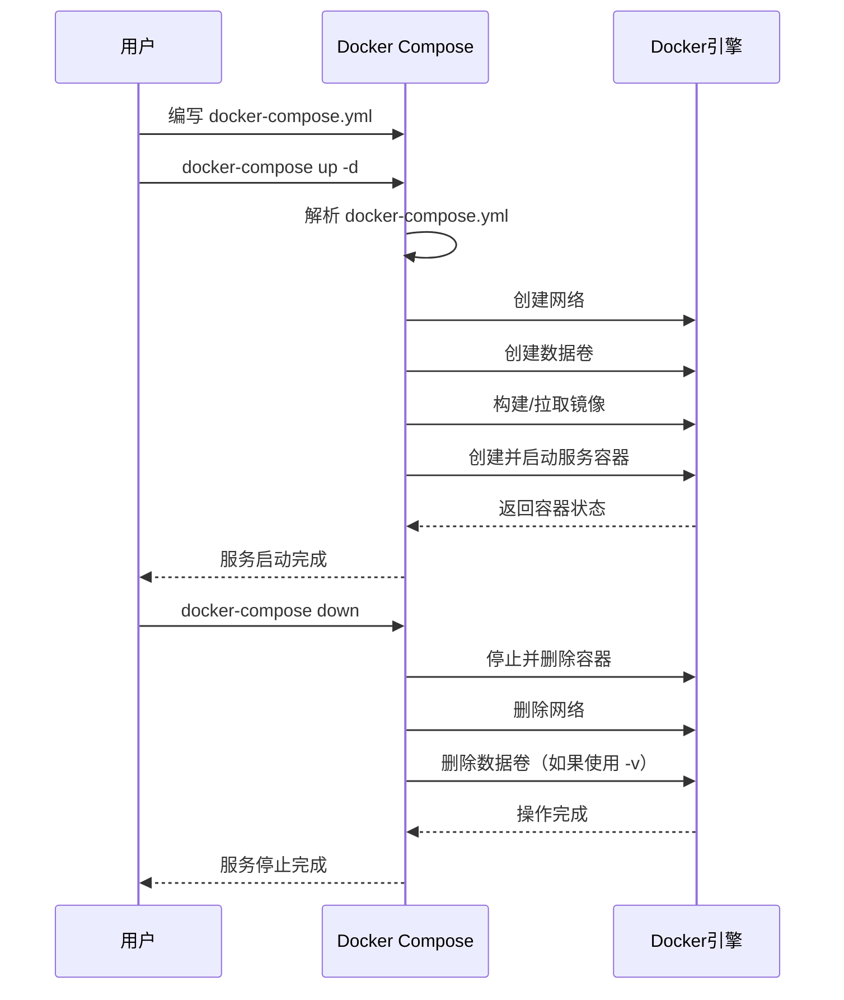

# 5. Docker Compose

## 5.1 核心概念

Docker Compose 是用于定义和运行多容器 Docker 应用程序的工具，通过一个 YAML 文件配置应用程序的服务、网络和卷，实现一键部署和管理多容器应用。

### 5.1.1 Docker Compose 的优势

- **简化配置**：使用 YAML 文件统一配置所有服务
- **一键部署**：通过单个命令启动整个应用栈
- **服务依赖管理**：自动处理服务间的依赖关系
- **可扩展性**：支持动态扩展服务实例数量
- **环境隔离**：不同环境使用不同的配置文件
- **易于维护**：集中管理所有服务配置

### 5.1.2 Docker Compose 架构



## 5.2 安装与配置

### 5.2.1 安装 Docker Compose

```bash
# 方法1：使用 pip 安装
pip install docker-compose

# 方法2：下载二进制文件（推荐）
sudo curl -L "https://github.com/docker/compose/releases/latest/download/docker-compose-$(uname -s)-$(uname -m)" -o /usr/local/bin/docker-compose

# 添加执行权限
sudo chmod +x /usr/local/bin/docker-compose

# 验证安装
docker-compose --version

# 示例输出：
docker-compose version 1.29.2, build 5becea4c
```

### 5.2.2 Docker Compose V2

Docker Compose V2 是 Docker Desktop 的一部分，以 Docker CLI 插件形式提供：

```bash
# 验证 Docker Compose V2 安装
docker compose version

# 示例输出：
Docker Compose version v2.10.2
```

## 5.3 基本使用

### 5.3.1 核心命令

```bash
# 启动服务（后台运行）
docker-compose up -d

# 启动服务（前台运行）
docker-compose up

# 查看服务状态
docker-compose ps

# 查看服务日志
docker-compose logs
# 查看特定服务日志
docker-compose logs <service_name>
# 实时查看日志
docker-compose logs -f <service_name>

# 停止服务
docker-compose down
# 停止并移除容器、网络、卷
docker-compose down -v

# 重启服务
docker-compose restart
# 重启特定服务
docker-compose restart <service_name>

# 构建服务镜像
docker-compose build
# 构建特定服务镜像
docker-compose build <service_name>

# 拉取服务镜像
docker-compose pull
# 拉取特定服务镜像
docker-compose pull <service_name>

# 执行服务命令
docker-compose exec <service_name> <command>
# 示例：进入 web 服务容器
docker-compose exec web sh
```

### 5.3.2 基本工作流程



## 5.4 docker-compose.yml 语法

### 5.4.1 基本结构

```yaml
version: '3.8'  # Compose 文件版本
services:       # 服务定义
  service1:     # 服务名称
    # 服务配置
    image: nginx:alpine
    ports:
      - "80:80"
    volumes:
      - ./html:/usr/share/nginx/html
    networks:
      - my-network
  
  service2:
    # 服务配置
    build: .
    environment:
      - DB_HOST=service3
    depends_on:
      - service3
    
  service3:
    # 服务配置
    image: mysql:8.0
    volumes:
      - mysql-data:/var/lib/mysql
    environment:
      - MYSQL_ROOT_PASSWORD=123456

volumes:         # 数据卷定义
  mysql-data:

networks:        # 网络定义
  my-network:
    driver: bridge
```

### 5.4.2 版本兼容性

| Compose 文件版本 | Docker 引擎版本 |
|----------------|---------------|
| 3.8            | 19.03.0+      |
| 3.7            | 18.06.0+      |
| 3.6            | 18.02.0+      |
| 3.5            | 17.12.0+      |
| 3.4            | 17.09.0+      |
| 3.3            | 17.06.0+      |
| 3.2            | 17.04.0+      |
| 3.1            | 1.13.1+       |
| 3.0            | 1.13.0+       |

## 5.5 服务定义

### 5.5.1 核心配置项

```yaml
services:
  web:
    # 镜像配置
    image: nginx:alpine        # 使用现有镜像
    build: .                   # 从 Dockerfile 构建镜像
    build:
      context: .               # 构建上下文
      dockerfile: Dockerfile.prod  # 指定 Dockerfile
      args:                    # 构建参数
        - NODE_ENV=production
    
    # 容器配置
    container_name: my-web     # 容器名称
    restart: always            # 重启策略
    hostname: web-server       # 容器主机名
    domainname: example.com    # 容器域名
    
    # 网络配置
    ports:                     # 端口映射
      - "80:80"
      - "443:443"
    expose:                    # 暴露端口（不映射到宿主机）
      - "8080"
    networks:                  # 网络配置
      - my-network
    
    # 数据卷配置
    volumes:                   # 卷挂载
      - ./html:/usr/share/nginx/html:ro  # 绑定挂载
      - nginx-logs:/var/log/nginx        # 命名卷
      - type: tmpfs                      # tmpfs 卷
        target: /app/tmp
    
    # 环境配置
    environment:               # 环境变量
      - NODE_ENV=production
      - DB_HOST=db
    env_file:                  # 环境变量文件
      - .env.production
    
    # 资源限制
    deploy:
      resources:
        limits:
          cpus: "0.5"
          memory: 512M
        reservations:
          cpus: "0.25"
          memory: 256M
    
    # 依赖关系
    depends_on:                # 服务依赖
      - db
    
    # 健康检查
    healthcheck:               # 健康检查配置
      test: ["CMD", "curl", "-f", "http://localhost:80"]
      interval: 30s
      timeout: 10s
      retries: 3
      start_period: 5s
```

## 5.6 网络配置

### 5.6.1 网络定义

```yaml
networks:
  # 默认桥接网络
  default:
    driver: bridge
  
  # 自定义桥接网络
  my-bridge-network:
    driver: bridge
    ipam:
      config:
        - subnet: 172.20.0.0/16
          gateway: 172.20.0.1
  
  # 自定义 overlay 网络（用于 Swarm 集群）
  my-overlay-network:
    driver: overlay
    attachable: true
  
  # 外部网络
  external-network:
    external: true
    name: existing-network
```

### 5.6.2 服务网络配置

```yaml
services:
  web:
    image: nginx:alpine
    networks:
      - my-network
      - external-network
    
  db:
    image: mysql:8.0
    networks:
      my-network:
        aliases:               # 网络别名
          - database
          - mysql
```

## 5.7 数据卷配置

### 5.7.1 卷定义

```yaml
volumes:
  # 默认卷配置
  db-data:
    driver: local
  
  # 自定义卷配置
  app-data:
    driver: local
    driver_opts:
      type: "none"
      o: "bind"
      device: "./app-data"
  
  # 外部卷
  external-volume:
    external: true
    name: existing-volume
```

### 5.7.2 服务卷配置

```yaml
services:
  web:
    image: nginx:alpine
    volumes:
      # 绑定挂载：宿主机路径:容器路径
      - ./html:/usr/share/nginx/html:ro
      
      # 命名卷：卷名:容器路径
      - nginx-logs:/var/log/nginx
      
      # tmpfs 卷
      - type: tmpfs
        target: /app/tmp
        tmpfs: 
          size: 1000000  # 1MB
      
      # 命名卷（长格式）
      - type: volume
        source: app-data
        target: /app/data
        read_only: false
```

## 5.8 环境变量

### 5.8.1 环境变量配置方式

```yaml
# 方式1：直接指定
services:
  web:
    environment:
      - NODE_ENV=production
      - DB_HOST=db
      - DB_PORT=3306
  
# 方式2：使用环境变量文件
services:
  web:
    env_file:
      - .env
      - .env.production
  
# 方式3：使用变量替换
services:
  web:
    image: nginx:${NGINX_VERSION:-alpine}
    ports:
      - "${WEB_PORT:-80}:80"
```

### 5.8.2 .env 文件示例

```bash
# .env 文件示例
NGINX_VERSION=1.21.0
WEB_PORT=8080
DB_HOST=localhost
DB_PORT=3306
DB_USER=root
DB_PASSWORD=123456
```

## 5.9 构建镜像

### 5.9.1 基本构建配置

```yaml
services:
  web:
    build: .
    image: myapp/web:1.0
  
  api:
    build:
      context: ./api
      dockerfile: Dockerfile.prod
      args:
        - NODE_ENV=production
        - BUILD_DATE=${BUILD_DATE:-$(date -u +'%Y-%m-%dT%H:%M:%SZ')}
    image: myapp/api:1.0
```

### 5.9.2 构建缓存

```bash
# 强制重新构建（不使用缓存）
docker-compose build --no-cache

# 仅构建已更改的服务
docker-compose build --pull
```

## 5.10 扩展服务

### 5.10.1 扩展服务实例

```bash
# 扩展 web 服务到 3 个实例
docker-compose up -d --scale web=3

# 查看扩展后的服务
docker-compose ps
```

### 5.10.2 扩展配置

```yaml
services:
  web:
    image: nginx:alpine
    deploy:
      replicas: 3  # 默认 3 个实例
      restart_policy:
        condition: on-failure
      update_config:
        parallelism: 2  # 并行更新 2 个实例
        delay: 10s       # 更新间隔 10 秒
```

## 5.11 多环境配置

### 5.11.1 使用多个配置文件

```bash
# 基本配置文件：docker-compose.yml
# 开发环境：docker-compose.override.yml（自动加载）
# 生产环境：docker-compose.prod.yml

# 使用生产环境配置启动
docker-compose -f docker-compose.yml -f docker-compose.prod.yml up -d

# 示例：基本配置文件
docker-compose.yml:
version: '3.8'
services:
  web:
    image: nginx:alpine
    ports:
      - "80:80"
    volumes:
      - ./html:/usr/share/nginx/html
  
# 示例：生产环境配置文件
docker-compose.prod.yml:
version: '3.8'
services:
  web:
    image: myapp/web:prod
    ports:
      - "80:80"
      - "443:443"
    volumes:
      - nginx-logs:/var/log/nginx
    restart: always
volumes:
  nginx-logs:
```

## 5.12 最佳实践

### 5.12.1 配置文件最佳实践

1. **使用最新版本**：使用最新的 Compose 文件版本
2. **清晰命名**：服务、网络、卷使用清晰的命名规范
3. **分离环境**：不同环境使用不同的配置文件
4. **使用环境变量**：避免硬编码配置
5. **添加注释**：为复杂配置添加注释
6. **使用相对路径**：便于在不同环境中使用
7. **指定依赖关系**：使用 `depends_on` 明确服务依赖

### 5.12.2 服务配置最佳实践

1. **单一职责原则**：每个服务只负责一个功能
2. **使用官方镜像**：优先使用官方或经过验证的镜像
3. **指定镜像版本**：避免使用 `latest` 标签
4. **配置健康检查**：确保服务正常运行
5. **设置合理的重启策略**：根据服务类型选择合适的重启策略
6. **限制资源使用**：避免服务过度消耗资源
7. **使用只读文件系统**：提高安全性

### 5.12.3 网络与卷最佳实践

1. **使用自定义网络**：避免使用默认网络
2. **合理规划网络**：不同服务使用不同的网络
3. **使用命名卷**：便于管理和备份
4. **定期备份数据卷**：防止数据丢失
5. **清理未使用的资源**：定期执行 `docker-compose down -v` 清理资源

## 5.13 常见问题

### 5.13.1 服务启动顺序问题

```bash
# 问题：依赖服务未就绪，导致服务启动失败
# 解决方案：

# 1. 使用 depends_on + 健康检查（Compose V3+）
services:
  web:
    depends_on:
      db:
        condition: service_healthy
  
  db:
    image: mysql:8.0
    healthcheck:
      test: ["CMD", "mysqladmin", "ping", "-h", "localhost"]
      interval: 10s
      timeout: 5s
      retries: 5

# 2. 使用脚本控制启动顺序
# 示例：wait-for-it.sh 脚本
```

### 5.13.2 端口冲突问题

```bash
# 问题：端口已被占用，导致服务启动失败
# 解决方案：

# 1. 查看端口占用
sudo netstat -tuln | grep <port>

# 2. 修改配置文件中的端口映射
ports:
  - "8080:80"  # 将宿主机端口从 80 改为 8080

# 3. 停止占用端口的进程
sudo kill <pid>
```

### 5.13.3 环境变量问题

```bash
# 问题：环境变量未正确加载
# 解决方案：

# 1. 检查 .env 文件路径和格式
# 2. 验证环境变量是否被正确替换
docker-compose config

# 3. 使用 docker-compose exec 查看容器内环境变量
docker-compose exec <service_name> env

# 4. 检查环境变量名称拼写
```

### 5.13.4 构建失败问题

```bash
# 问题：服务构建失败
# 解决方案：

# 1. 查看详细构建日志
docker-compose build --no-cache <service_name>

# 2. 检查 Dockerfile 语法和依赖

# 3. 检查构建上下文路径

# 4. 检查构建参数是否正确
```

## 5.14 高级功能

### 5.14.1 服务配置文件

```yaml
services:
  web:
    image: nginx:alpine
    configs:
      - source: nginx-config
        target: /etc/nginx/nginx.conf

configs:
  nginx-config:
    file: ./nginx.conf
```

### 5.14.2  secrets 管理

```yaml
services:
  db:
    image: mysql:8.0
    secrets:
      - db-password
    environment:
      - MYSQL_ROOT_PASSWORD_FILE=/run/secrets/db-password

secrets:
  db-password:
    file: ./db-password.txt
```

## 5.15 示例应用

### 5.15.1 简单 Web 应用

```yaml
version: '3.8'
services:
  web:
    image: nginx:alpine
    ports:
      - "80:80"
    volumes:
      - ./html:/usr/share/nginx/html
      - ./nginx.conf:/etc/nginx/nginx.conf:ro
    restart: always
    depends_on:
      - php
  
  php:
    image: php:8.1-fpm-alpine
    volumes:
      - ./html:/var/www/html
    restart: always
  
  mysql:
    image: mysql:8.0
    volumes:
      - mysql-data:/var/lib/mysql
    environment:
      - MYSQL_ROOT_PASSWORD=123456
      - MYSQL_DATABASE=myapp
      - MYSQL_USER=myapp
      - MYSQL_PASSWORD=myapp123
    restart: always
    healthcheck:
      test: ["CMD", "mysqladmin", "ping", "-h", "localhost"]
      interval: 10s
      timeout: 5s
      retries: 5

volumes:
  mysql-data:
```

### 5.15.2 微服务应用

```yaml
version: '3.8'
services:
  api-gateway:
    image: myapp/api-gateway:latest
    ports:
      - "80:8080"
    depends_on:
      - user-service
      - order-service
      - product-service
    restart: always
  
  user-service:
    image: myapp/user-service:latest
    depends_on:
      - user-db
      - rabbitmq
    restart: always
  
  order-service:
    image: myapp/order-service:latest
    depends_on:
      - order-db
      - rabbitmq
    restart: always
  
  product-service:
    image: myapp/product-service:latest
    depends_on:
      - product-db
      - rabbitmq
    restart: always
  
  user-db:
    image: mysql:8.0
    volumes:
      - user-db:/var/lib/mysql
    environment:
      - MYSQL_ROOT_PASSWORD=123456
      - MYSQL_DATABASE=user_db
    restart: always
  
  order-db:
    image: mysql:8.0
    volumes:
      - order-db:/var/lib/mysql
    environment:
      - MYSQL_ROOT_PASSWORD=123456
      - MYSQL_DATABASE=order_db
    restart: always
  
  product-db:
    image: mysql:8.0
    volumes:
      - product-db:/var/lib/mysql
    environment:
      - MYSQL_ROOT_PASSWORD=123456
      - MYSQL_DATABASE=product_db
    restart: always
  
  rabbitmq:
    image: rabbitmq:3-management-alpine
    ports:
      - "5672:5672"
      - "15672:15672"
    volumes:
      - rabbitmq-data:/var/lib/rabbitmq
    restart: always

volumes:
  user-db:
  order-db:
  product-db:
  rabbitmq-data:
```

通过本章节的学习，您已经掌握了 Docker Compose 的核心概念、配置语法和最佳实践。Docker Compose 是管理多容器应用的强大工具，熟练掌握这些知识将帮助您高效地构建、部署和管理复杂的 Docker 应用程序。