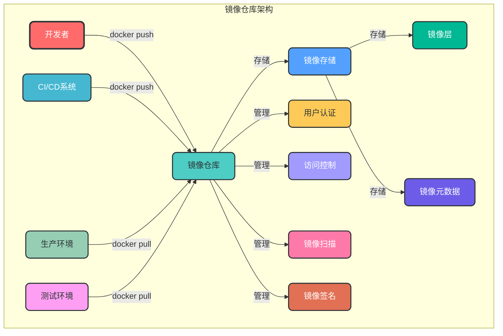
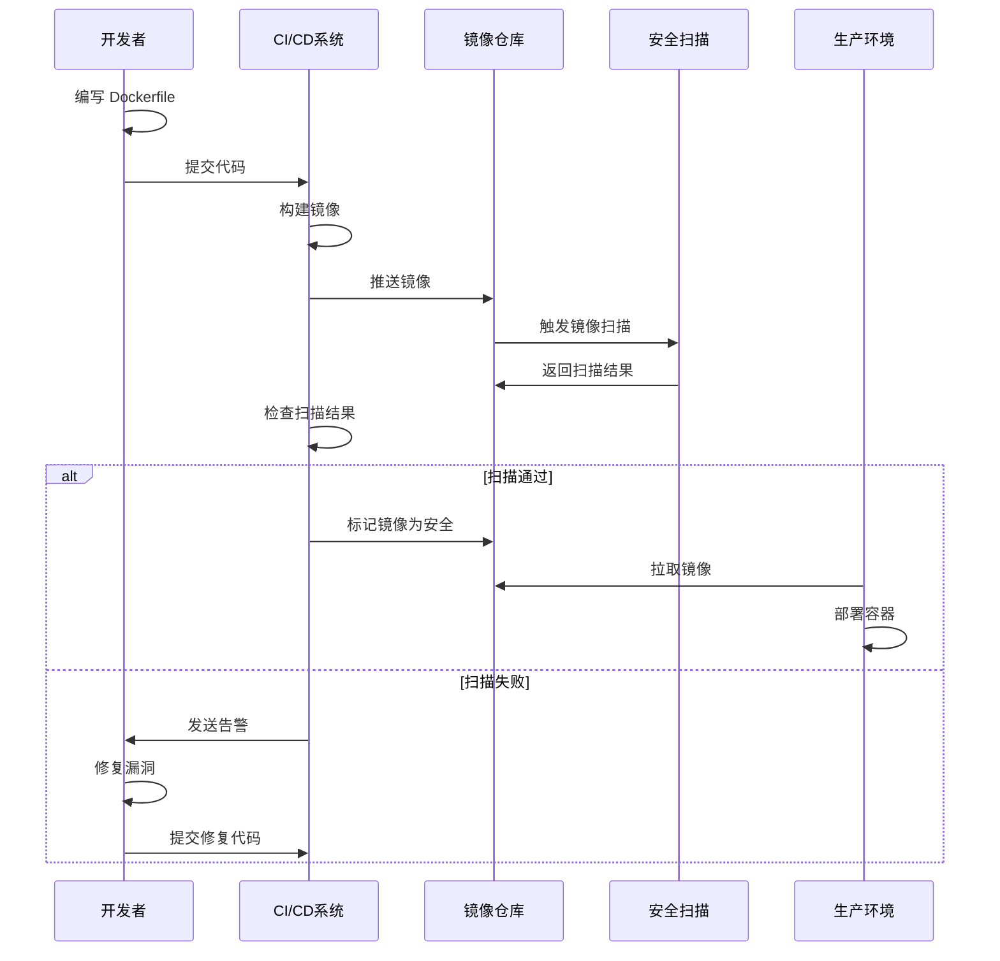

# 6. 镜像仓库管理

## 6.1 核心概念

Docker 镜像仓库是用于存储和分发 Docker 镜像的服务，它允许用户上传、下载和管理镜像，是 Docker 生态系统中的重要组成部分。

### 6.1.1 镜像仓库的作用

- **集中存储**：将镜像集中存储在一个位置，便于管理和访问
- **版本控制**：支持镜像的版本管理，便于回滚和更新
- **访问控制**：提供用户认证和授权机制，保护镜像安全
- **镜像扫描**：检测镜像中的安全漏洞
- **高可用性**：支持镜像仓库的高可用部署

### 6.1.2 镜像仓库架构



## 6.2 镜像仓库类型

### 6.2.1 公共镜像仓库

- **Docker Hub**：Docker 官方的公共镜像仓库，包含大量官方和社区镜像
- **Quay.io**：Red Hat 提供的公共镜像仓库，支持镜像扫描和签名
- **GitHub Container Registry**：GitHub 提供的镜像仓库，与 GitHub 代码仓库集成
- **Google Container Registry (GCR)**：Google 提供的公共镜像仓库
- **Amazon Elastic Container Registry (ECR)**：AWS 提供的公共镜像仓库

### 6.2.2 私有镜像仓库

- **Docker Registry**：Docker 官方提供的开源镜像仓库
- **Harbor**：VMware 开源的企业级镜像仓库，支持镜像扫描、签名和访问控制
- **Nexus Repository**：Sonatype 提供的仓库管理工具，支持多种包格式
- **Artifactory**：JFrog 提供的企业级仓库管理工具

## 6.3 Docker Hub

### 6.3.1 Docker Hub 基本使用

```bash
# 1. 登录 Docker Hub
docker login

# 2. 推送镜像到 Docker Hub
docker tag <image_name>:<tag> <username>/<repository>:<tag>
docker push <username>/<repository>:<tag>

# 3. 从 Docker Hub 拉取镜像
docker pull <username>/<repository>:<tag>

# 4. 退出 Docker Hub
docker logout

# 示例：推送镜像到 Docker Hub
docker tag myapp:1.0 myusername/myapp:1.0
docker push myusername/myapp:1.0

# 示例：从 Docker Hub 拉取镜像
docker pull myusername/myapp:1.0
```

### 6.3.2 Docker Hub 高级功能

1. **自动构建**：从 GitHub 或 Bitbucket 自动构建镜像
2. **组织管理**：支持创建组织，管理多个用户
3. **团队协作**：为团队成员分配不同的权限
4. **镜像扫描**：检测镜像中的安全漏洞
5. **镜像签名**：验证镜像的完整性和来源

## 6.4 私有镜像仓库搭建

### 6.4.1 使用 Docker Registry

```bash
# 1. 启动私有镜像仓库
docker run -d -p 5000:5000 --name registry \
  -v registry-data:/var/lib/registry \
  registry:2

# 2. 配置 Docker 客户端信任私有仓库
# 方法1：添加到不安全注册表
# 在 /etc/docker/daemon.json 中添加：
# { "insecure-registries": ["registry.example.com:5000"] }

# 方法2：配置 TLS 证书
# 参考：https://docs.docker.com/registry/deploying/#run-an-externally-accessible-registry

# 3. 推送镜像到私有仓库
docker tag <image_name>:<tag> <registry_url>/<repository>:<tag>
docker push <registry_url>/<repository>:<tag>

# 4. 从私有仓库拉取镜像
docker pull <registry_url>/<repository>:<tag>

# 示例：使用私有仓库
docker tag myapp:1.0 localhost:5000/myapp:1.0
docker push localhost:5000/myapp:1.0
docker pull localhost:5000/myapp:1.0
```

### 6.4.2 Docker Registry 管理

```bash
# 1. 查看仓库中的镜像
docker run --rm -it --name registry-browser \
  -p 8080:8080 \
  -e REGISTRY_URL=http://registry:5000 \
  -e DELETE_IMAGES=true \
  --link registry \
  klausmeyer/docker-registry-browser

# 2. 列出仓库中的镜像（API）
curl http://<registry_url>/v2/_catalog

# 3. 列出镜像的标签（API）
curl http://<registry_url>/v2/<repository>/tags/list

# 4. 删除镜像（API）
# 首先获取镜像的 digest
curl -I -X HEAD http://<registry_url>/v2/<repository>/manifests/<tag>
# 然后删除镜像
curl -X DELETE http://<registry_url>/v2/<repository>/manifests/<digest>

# 5. 清理未引用的镜像
docker exec registry registry garbage-collect /etc/docker/registry/config.yml
```

## 6.5 Harbor 企业级镜像仓库

### 6.5.1 Harbor 特点

- **企业级特性**：支持多租户、RBAC 权限管理、LDAP 集成
- **安全扫描**：集成 Clair 进行镜像漏洞扫描
- **镜像签名**：支持 Docker Content Trust
- **复制功能**：支持镜像在多个 Harbor 实例之间复制
- **高可用性**：支持多节点部署
- **审计日志**：记录所有操作日志
- **API 支持**：提供 RESTful API

### 6.5.2 Harbor 安装

```bash
# 1. 下载 Harbor 安装包
wget https://github.com/goharbor/harbor/releases/download/v2.5.0/harbor-offline-installer-v2.5.0.tgz

# 2. 解压安装包
tar xvf harbor-offline-installer-v2.5.0.tgz
cd harbor

# 3. 配置 Harbor
cp harbor.yml.tmpl harbor.yml
# 编辑 harbor.yml，配置 hostname、https 等

# 4. 安装 Harbor
./install.sh

# 5. 启动 Harbor
docker-compose up -d

# 6. 访问 Harbor Web 界面
# http://<harbor_hostname>
# 默认用户名：admin，密码：Harbor12345
```

### 6.5.3 Harbor 使用

```bash
# 1. 登录 Harbor
docker login <harbor_hostname>

# 2. 推送镜像到 Harbor
docker tag <image_name>:<tag> <harbor_hostname>/<project>/<repository>:<tag>
docker push <harbor_hostname>/<project>/<repository>:<tag>

# 3. 从 Harbor 拉取镜像
docker pull <harbor_hostname>/<project>/<repository>:<tag>

# 示例：使用 Harbor
docker tag myapp:1.0 harbor.example.com/myproject/myapp:1.0
docker push harbor.example.com/myproject/myapp:1.0
docker pull harbor.example.com/myproject/myapp:1.0
```

## 6.6 镜像仓库安全最佳实践

### 6.6.1 访问控制

1. **使用私有镜像仓库**：避免敏感镜像泄露
2. **配置认证机制**：启用用户认证，设置强密码
3. **使用 RBAC 权限管理**：为不同用户分配最小必要权限
4. **集成 LDAP/AD**：使用企业级身份认证
5. **启用审计日志**：记录所有操作，便于追溯

### 6.6.2 镜像安全

1. **镜像扫描**：定期扫描镜像中的安全漏洞
2. **镜像签名**：验证镜像的完整性和来源
3. **使用官方镜像**：优先使用官方或经过验证的镜像
4. **定期更新镜像**：及时修复安全漏洞
5. **使用多阶段构建**：减少镜像中的攻击面

### 6.6.3 网络安全

1. **配置 TLS 证书**：使用 HTTPS 加密镜像传输
2. **限制访问 IP**：只允许信任的 IP 访问镜像仓库
3. **使用防火墙**：配置防火墙规则，限制访问端口
4. **隔离网络**：将镜像仓库部署在专用网络中

### 6.6.4 高可用性和备份

1. **高可用部署**：使用多节点部署，确保服务可用性
2. **定期备份**：定期备份镜像仓库数据
3. **灾难恢复**：制定灾难恢复计划
4. **监控告警**：监控镜像仓库的运行状态

## 6.7 镜像仓库管理工作流



## 6.8 常见问题解决方案

### 6.8.1 镜像推送失败

```bash
# 问题：推送镜像到私有仓库时失败，提示 "http: server gave HTTP response to HTTPS client"
# 解决方案：配置 Docker 客户端信任私有仓库

# 方法1：在 /etc/docker/daemon.json 中添加不安全注册表
echo '{"insecure-registries": ["registry.example.com:5000"]}' > /etc/docker/daemon.json

# 方法2：重启 Docker 服务
systemctl restart docker
```

### 6.8.2 镜像拉取缓慢

```bash
# 问题：从 Docker Hub 拉取镜像缓慢
# 解决方案：配置国内镜像加速

# 1. 配置 Docker Hub 镜像加速
echo '{"registry-mirrors": ["https://registry.docker-cn.com", "https://docker.mirrors.ustc.edu.cn"]}' > /etc/docker/daemon.json

# 2. 重启 Docker 服务
systemctl restart docker
```

### 6.8.3 镜像仓库存储不足

```bash
# 问题：镜像仓库存储不足
# 解决方案：

# 1. 清理未引用的镜像（Docker Registry）
docker exec registry registry garbage-collect /etc/docker/registry/config.yml

# 2. 清理 Harbor 中的镜像
# 通过 Harbor Web 界面删除旧镜像或使用 API

# 3. 扩展存储卷
# 增加镜像仓库的数据卷大小
```

### 6.8.4 镜像扫描发现漏洞

```bash
# 问题：镜像扫描发现安全漏洞
# 解决方案：

# 1. 更新基础镜像
docker pull <base_image>:latest
docker build -t <image_name>:<tag> .

# 2. 修复应用依赖
# 更新应用中的依赖包，修复已知漏洞

# 3. 重新扫描镜像
# 使用镜像扫描工具重新扫描修复后的镜像

# 4. 制定镜像更新策略
# 定期更新基础镜像和应用依赖
```

## 6.9 镜像仓库监控

### 6.9.1 Docker Registry 监控

```bash
# 1. 启用 Registry 指标
# 在启动 Registry 时添加 --metrics 选项
docker run -d -p 5000:5000 --name registry \
  -v registry-data:/var/lib/registry \
  -e REGISTRY_HTTP_DEBUG_ADDR=:5001 \
  registry:2 --metrics.prometheus.enabled=true

# 2. 访问指标端点
# http://<registry_host>:5001/debug/metrics/prometheus

# 3. 使用 Prometheus + Grafana 监控
# 配置 Prometheus 采集 Registry 指标，使用 Grafana 可视化
```

### 6.9.2 Harbor 监控

Harbor 内置了监控指标，可以通过以下方式访问：

1. **Prometheus 端点**：http://<harbor_host>:9090/metrics
2. **Grafana 仪表板**：Harbor 提供了预定义的 Grafana 仪表板
3. **日志监控**：收集 Harbor 容器日志，使用 ELK 或 Loki 进行分析

## 6.10 镜像仓库迁移

### 6.10.1 迁移到新的镜像仓库

```bash
# 1. 从旧仓库拉取镜像
docker pull <old_registry>/<image_name>:<tag>

# 2. 标记镜像为新仓库
docker tag <old_registry>/<image_name>:<tag> <new_registry>/<image_name>:<tag>

# 3. 推送到新仓库
docker push <new_registry>/<image_name>:<tag>

# 4. 删除旧镜像
docker rmi <old_registry>/<image_name>:<tag>

# 5. 使用脚本批量迁移
#!/bin/bash
OLD_REGISTRY=old.example.com
NEW_REGISTRY=new.example.com
IMAGES=("nginx:alpine" "mysql:8.0" "redis:latest")

for image in "${IMAGES[@]}"; do
  docker pull $OLD_REGISTRY/$image
  docker tag $OLD_REGISTRY/$image $NEW_REGISTRY/$image
  docker push $NEW_REGISTRY/$image
  docker rmi $OLD_REGISTRY/$image
  docker rmi $NEW_REGISTRY/$image
done
```

通过本章节的学习，您已经掌握了 Docker 镜像仓库的核心概念、搭建方法和最佳实践。镜像仓库管理是 Docker 生态系统中的重要组成部分，熟练掌握这些知识将帮助您构建安全、高效的镜像管理系统。