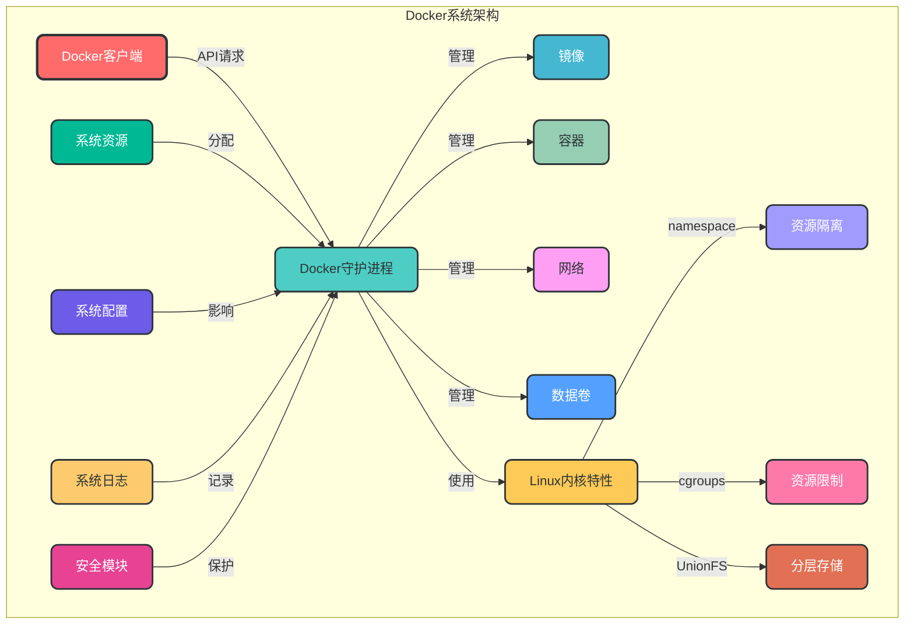

# 7. 系统管理

## 7.1 核心概念

Docker 系统管理是指对 Docker 守护进程、系统资源和 Docker 生态系统进行管理和优化，确保 Docker 环境的稳定运行和高效利用。

### 7.1.1 Docker 系统架构



## 7.2 Docker 守护进程配置

### 7.2.1 守护进程配置文件

Docker 守护进程的配置文件默认位于 `/etc/docker/daemon.json`，可以通过该文件配置 Docker 守护进程的各种参数。

```json
# 示例：daemon.json 配置
{
  "registry-mirrors": ["https://registry.docker-cn.com"],  # 镜像加速地址
  "insecure-registries": ["registry.example.com:5000"],  # 不安全注册表
  "data-root": "/var/lib/docker",  # Docker 数据存储目录
  "exec-root": "/var/run/docker",  # Docker 运行时目录
  "storage-driver": "overlay2",  # 存储驱动
  "log-driver": "json-file",  # 日志驱动
  "log-opts": {  # 日志选项
    "max-size": "10m",
    "max-file": "3"
  },
  "bip": "172.17.0.1/16",  # 默认桥接网络 IP
  "mtu": 1500,  # 网络 MTU
  "default-address-pools": [  # 默认地址池
    {
      "base": "172.16.0.0/12",
      "size": 24
    }
  ],
  "live-restore": true,  # 直播恢复
  "debug": false,  # 调试模式
  "tls": false,  # TLS 配置
  "experimental": false  # 实验性功能
}
```

### 7.2.2 守护进程启动选项

Docker 守护进程还可以通过命令行选项进行配置：

```bash
# 示例：使用命令行选项启动守护进程
sudo dockerd \
  --registry-mirrors https://registry.docker-cn.com \
  --insecure-registries registry.example.com:5000 \
  --data-root /var/lib/docker \
  --storage-driver overlay2 \
  --log-driver json-file \
  --log-opt max-size=10m \
  --log-opt max-file=3
```

### 7.2.3 守护进程配置重载

```bash
# 1. 修改 daemon.json 配置文件
sudo vi /etc/docker/daemon.json

# 2. 重启 Docker 服务以应用配置
sudo systemctl restart docker

# 3. 验证配置是否生效
docker info | grep -i registry
```

## 7.3 系统资源管理

### 7.3.1 CPU 资源管理

```bash
# 1. 查看 Docker 守护进程 CPU 使用情况
top -p $(pgrep dockerd)

# 2. 限制容器 CPU 使用
# 使用 --cpus 限制 CPU 核心数
docker run -d --name app --cpus 0.5 myapp:1.0

# 使用 --cpu-shares 设置 CPU 份额
docker run -d --name app --cpu-shares 512 myapp:1.0

# 3. 查看容器 CPU 使用情况
docker stats <container_name>
```

### 7.3.2 内存资源管理

```bash
# 1. 查看 Docker 守护进程内存使用情况
top -p $(pgrep dockerd)

# 2. 限制容器内存使用
# 使用 -m 限制内存大小
docker run -d --name app -m 512m myapp:1.0

# 使用 --memory-swap 限制内存+交换分区
docker run -d --name app -m 512m --memory-swap 1g myapp:1.0

# 3. 查看容器内存使用情况
docker stats <container_name>
```

### 7.3.3 磁盘资源管理

```bash
# 1. 查看 Docker 数据目录使用情况
df -h /var/lib/docker

# 2. 查看镜像和容器占用的磁盘空间
docker system df

# 3. 清理未使用的 Docker 资源
docker system prune
# 清理所有未使用的资源（包括镜像、容器、网络、卷）
docker system prune -a
# 清理指定类型的资源
docker image prune
docker container prune
docker volume prune
docker network prune

# 4. 查看单个容器占用的磁盘空间
docker ps -s <container_name>
```

### 7.3.4 网络资源管理

```bash
# 1. 查看 Docker 网络使用情况
docker network stats

# 2. 限制容器网络带宽
# 使用 --network 选项指定网络
docker run -d --name app --network my-network myapp:1.0

# 3. 查看容器网络统计信息
docker exec <container_name> netstat -tuln
# 或
docker exec <container_name> ss -tuln
```

## 7.4 Docker 系统日志

### 7.4.1 守护进程日志

```bash
# 1. 查看 Docker 守护进程日志（systemd）
journalctl -u docker.service
# 实时查看日志
journalctl -u docker.service -f

# 2. 查看 Docker 守护进程日志（syslog）
cat /var/log/docker.log

# 3. 配置守护进程日志级别
sudo vi /etc/docker/daemon.json
{
  "log-level": "info"  # 可选：debug, info, warn, error, fatal
}
```

### 7.4.2 容器日志管理

```bash
# 1. 查看容器日志
docker logs <container_name>
# 实时查看日志
docker logs -f <container_name>
# 查看最近 N 行日志
docker logs --tail 100 <container_name>
# 查看带时间戳的日志
docker logs -t <container_name>

# 2. 配置容器日志驱动
# 在 daemon.json 中配置默认日志驱动
{
  "log-driver": "json-file",
  "log-opts": {
    "max-size": "10m",
    "max-file": "3"
  }
}

# 在运行容器时指定日志驱动
docker run -d --name app --log-driver json-file --log-opt max-size=10m --log-opt max-file=3 myapp:1.0

# 3. 集中管理容器日志
# 使用 ELK Stack 或 Loki 收集和分析容器日志
```

## 7.5 系统备份与恢复

### 7.5.1 镜像备份与恢复

```bash
# 1. 备份单个镜像
docker save -o <output_file.tar> <image_name>:<tag>
# 示例：备份 nginx 镜像
docker save -o nginx-alpine.tar nginx:alpine

# 2. 恢复单个镜像
docker load -i <input_file.tar>
# 示例：恢复 nginx 镜像
docker load -i nginx-alpine.tar

# 3. 备份所有镜像
docker save $(docker images -q) -o all-images.tar

# 4. 恢复所有镜像
docker load -i all-images.tar
```

### 7.5.2 数据卷备份与恢复

```bash
# 1. 备份数据卷
docker run --rm -v <volume_name>:/volume -v $(pwd):/backup ubuntu tar -czvf /backup/<volume_name>.tar.gz /volume
# 示例：备份 mysql-data 卷
docker run --rm -v mysql-data:/volume -v $(pwd):/backup ubuntu tar -czvf /backup/mysql-data.tar.gz /volume

# 2. 恢复数据卷
# 创建新的数据卷
docker volume create mysql-data
# 恢复数据
docker run --rm -v mysql-data:/volume -v $(pwd):/backup ubuntu tar -xzvf /backup/mysql-data.tar.gz -C /
```

### 7.5.3 容器备份与恢复

```bash
# 1. 备份容器（导出容器状态）
docker export <container_name> > <output_file.tar>
# 示例：备份运行中的 nginx 容器
docker export nginx > nginx-container.tar

# 2. 恢复容器（导入容器状态）
docker import <input_file.tar> <image_name>:<tag>
# 示例：恢复 nginx 容器
docker import nginx-container.tar nginx-restored:latest
# 运行恢复后的容器
docker run -d --name nginx-restored nginx-restored:latest
```

### 7.5.4 Docker 系统备份与恢复流程图

```mermaid
flowchart TD
    subgraph Docker系统备份
        A[开始] -->|选择备份类型| B[镜像备份]
        A -->|选择备份类型| C[数据卷备份]
        A -->|选择备份类型| D[容器备份]
        
        B -->|执行备份| E[保存镜像为 tar 文件]
        C -->|执行备份| F[打包数据卷内容]
        D -->|执行备份| G[导出容器状态]
        
        E -->|存储| H[备份存储]
        F -->|存储| H
        G -->|存储| H
        
        H -->|完成| I[备份完成]
    end
    
    subgraph Docker系统恢复
        J[开始] -->|选择恢复类型| K[镜像恢复]
        J -->|选择恢复类型| L[数据卷恢复]
        J -->|选择恢复类型| M[容器恢复]
        
        K -->|执行恢复| N[加载镜像 tar 文件]
        L -->|执行恢复| O[创建数据卷并解压]
        M -->|执行恢复| P[导入容器状态]
        
        N -->|验证| Q[验证镜像]
        O -->|验证| R[验证数据卷]
        P -->|验证| S[验证容器]
        
        Q -->|完成| T[恢复完成]
        R -->|完成| T
        S -->|完成| T
    end
    
    style A fill:#FF6B6B,stroke:#2D3436,stroke-width:3px,color:white,rx:8,ry:8
    style B fill:#4ECDC4,stroke:#2D3436,stroke-width:2px,color:#2D3436,rx:8,ry:8
    style C fill:#45B7D1,stroke:#2D3436,stroke-width:2px,color:white,rx:8,ry:8
    style D fill:#96CEB4,stroke:#2D3436,stroke-width:2px,color:#2D3436,rx:8,ry:8
    style E fill:#FF9FF3,stroke:#2D3436,stroke-width:2px,color:#2D3436,rx:8,ry:8
    style F fill:#54A0FF,stroke:#2D3436,stroke-width:2px,color:white,rx:8,ry:8
    style G fill:#FECA57,stroke:#2D3436,stroke-width:2px,color:#2D3436,rx:8,ry:8
    style H fill:#A29BFE,stroke:#2D3436,stroke-width:2px,color:white,rx:8,ry:8
    style I fill:#FD79A8,stroke:#2D3436,stroke-width:2px,color:white,rx:8,ry:8
    style J fill:#E17055,stroke:#2D3436,stroke-width:3px,color:white,rx:8,ry:8
    style K fill:#00B894,stroke:#2D3436,stroke-width:2px,color:white,rx:8,ry:8
    style L fill:#6C5CE7,stroke:#2D3436,stroke-width:2px,color:white,rx:8,ry:8
    style M fill:#FDCB6E,stroke:#2D3436,stroke-width:2px,color:#2D3436,rx:8,ry:8
    style N fill:#E84393,stroke:#2D3436,stroke-width:2px,color:white,rx:8,ry:8
    style O fill:#FF6B6B,stroke:#2D3436,stroke-width:2px,color:white,rx:8,ry:8
    style P fill:#4ECDC4,stroke:#2D3436,stroke-width:2px,color:#2D3436,rx:8,ry:8
    style Q fill:#45B7D1,stroke:#2D3436,stroke-width:2px,color:white,rx:8,ry:8
    style R fill:#96CEB4,stroke:#2D3436,stroke-width:2px,color:#2D3436,rx:8,ry:8
    style S fill:#FF9FF3,stroke:#2D3436,stroke-width:2px,color:#2D3436,rx:8,ry:8
    style T fill:#54A0FF,stroke:#2D3436,stroke-width:2px,color:white,rx:8,ry:8
```



## 7.6 Docker 系统升级

### 7.6.1 升级方法

```bash
# 1. 备份数据
# 备份镜像、数据卷和容器配置

# 2. 升级 Docker（Ubuntu/Debian）
sudo apt-get update
sudo apt-get install --only-upgrade docker-ce docker-ce-cli containerd.io

# 3. 升级 Docker（CentOS/RHEL）
sudo yum update docker-ce docker-ce-cli containerd.io

# 4. 升级 Docker Compose
sudo curl -L "https://github.com/docker/compose/releases/latest/download/docker-compose-$(uname -s)-$(uname -m)" -o /usr/local/bin/docker-compose
sudo chmod +x /usr/local/bin/docker-compose

# 5. 验证升级结果
docker --version
docker-compose --version
```

### 7.6.2 升级注意事项

1. **备份数据**：在升级前备份所有重要数据，包括镜像、数据卷和容器配置
2. **检查兼容性**：确保应用程序与新版本 Docker 兼容
3. **停止容器**：在升级前停止所有运行中的容器
4. **测试环境验证**：在生产环境升级前，先在测试环境验证
5. **监控升级过程**：密切关注升级过程，及时处理可能出现的问题
6. **回滚计划**：制定回滚计划，以便在升级失败时快速恢复

## 7.7 Docker 系统安全

### 7.7.1 守护进程安全

```bash
# 1. 使用 TLS 保护 Docker API
# 生成 TLS 证书
# 参考：https://docs.docker.com/engine/security/protect-access/

# 2. 配置 Docker 守护进程只监听特定 IP
# 在 daemon.json 中配置
{
  "hosts": ["tcp://127.0.0.1:2375", "unix:///var/run/docker.sock"]
}

# 3. 限制 Docker 守护进程权限
# 使用非 root 用户运行 Docker 守护进程（实验性）

# 4. 启用内容信任
# 启用 DCT（Docker Content Trust）
export DOCKER_CONTENT_TRUST=1
```

### 7.7.2 系统级安全配置

```bash
# 1. 定期更新系统和 Docker
# 自动更新系统包
sudo apt-get update && sudo apt-get upgrade -y
# 自动更新 Docker
sudo apt-get update && sudo apt-get install --only-upgrade docker-ce docker-ce-cli containerd.io -y

# 2. 配置防火墙规则
# 允许 Docker 相关端口
sudo ufw allow 2375/tcp  # Docker API（不安全）
sudo ufw allow 2376/tcp  # Docker API（TLS）
sudo ufw allow 2377/tcp  # Docker Swarm 管理端口
sudo ufw allow 7946/tcp  # Docker Swarm 节点间通信
sudo ufw allow 7946/udp  # Docker Swarm 节点间通信
sudo ufw allow 4789/udp  # Docker Swarm 覆盖网络

# 3. 限制容器权限
# 不使用特权模式运行容器
# 限制容器的能力
docker run --cap-drop ALL --cap-add NET_BIND_SERVICE myapp:1.0

# 4. 使用只读文件系统
docker run --read-only myapp:1.0
```

## 7.8 系统监控

### 7.8.1 Docker 系统监控工具

1. **Docker Stats**：实时查看容器资源使用情况
   ```bash
   docker stats
   ```

2. **cAdvisor**：容器性能监控工具
   ```bash
   docker run -d --name=cadvisor -p 8080:8080 -v /:/rootfs:ro -v /var/run:/var/run:ro -v /sys:/sys:ro -v /var/lib/docker/:/var/lib/docker:ro -v /dev/disk/:/dev/disk:ro --privileged --device=/dev/kmsg gcr.io/cadvisor/cadvisor:v0.47.0
   ```
   访问地址：http://localhost:8080

3. **Prometheus + Grafana**：企业级监控解决方案
   - Prometheus：收集和存储监控数据
   - Grafana：可视化监控数据

4. **Docker Bench for Security**：Docker 安全检查工具
   ```bash
   docker run -it --rm --net host --pid host --userns host --cap-add audit_control \
     -e DOCKER_CONTENT_TRUST=$DOCKER_CONTENT_TRUST \
     -v /var/lib:/var/lib \
     -v /var/run/docker.sock:/var/run/docker.sock \
     -v /etc:/etc --label docker_bench_security \
     docker/docker-bench-security
   ```

### 7.8.2 关键指标监控

| 指标类型 | 关键指标 | 监控工具 |
|---------|---------|---------|
| 系统资源 | CPU 使用率、内存使用率、磁盘使用率、网络吞吐量 | Docker Stats、cAdvisor、Prometheus |
| 容器状态 | 运行状态、启动时间、重启次数 | Docker Stats、Prometheus |
| 镜像管理 | 镜像大小、镜像数量、镜像更新频率 | Docker API、Prometheus |
| 网络状态 | 网络连接数、网络延迟、网络错误率 | cAdvisor、Prometheus |
| 日志监控 | 日志量、错误日志率、日志级别 | ELK Stack、Loki、Prometheus |

## 7.9 常见问题解决方案

### 7.9.1 守护进程启动失败

```bash
# 问题：Docker 守护进程无法启动
# 解决方案：

# 1. 检查守护进程日志
journalctl -u docker.service -n 100

# 2. 检查配置文件语法
sudo docker info

# 3. 检查端口是否被占用
sudo netstat -tuln | grep 2375

# 4. 检查存储驱动
# 确保使用支持的存储驱动
docker info | grep -i storage

# 5. 重启 Docker 服务
sudo systemctl restart docker
```

### 7.9.2 资源不足问题

```bash
# 问题：Docker 容器因资源不足被杀死
# 解决方案：

# 1. 检查系统资源使用情况
top
df -h

# 2. 检查内核日志
dmesg | grep -i "kill"

# 3. 增加容器资源限制
docker run -d --name app --cpus 1 --memory 1g myapp:1.0

# 4. 清理未使用的资源
docker system prune -a

# 5. 扩展系统资源
# 增加 CPU、内存或磁盘空间
```

### 7.9.3 Docker 命令执行缓慢

```bash
# 问题：Docker 命令执行缓慢
# 解决方案：

# 1. 检查 Docker 守护进程 CPU 和内存使用情况
top -p $(pgrep dockerd)

# 2. 检查磁盘 I/O 性能
iostat -x 1

# 3. 检查网络连接
docker network inspect bridge

# 4. 清理 Docker 缓存
docker system prune

# 5. 重启 Docker 服务
sudo systemctl restart docker
```

### 7.9.4 容器无法访问外部网络

```bash
# 问题：容器无法访问外部网络
# 解决方案：

# 1. 检查 Docker 网络配置
docker network inspect bridge

# 2. 检查 iptables 规则
sudo iptables -L -n

# 3. 检查 DNS 配置
docker exec <container_name> cat /etc/resolv.conf

# 4. 重启 Docker 服务
sudo systemctl restart docker

# 5. 检查宿主机网络连接
ping www.baidu.com
```

## 7.10 最佳实践

### 7.10.1 系统配置最佳实践

1. **定期备份数据**：制定定期备份策略，确保数据安全
2. **监控系统性能**：使用监控工具实时监控系统性能
3. **定期更新**：及时更新 Docker 和系统组件，修复安全漏洞
4. **配置合理的资源限制**：根据应用需求配置容器资源限制
5. **使用安全的配置**：启用 TLS、内容信任等安全功能
6. **记录操作日志**：记录所有关键操作，便于审计和故障排查

### 7.10.2 资源管理最佳实践

1. **合理规划资源**：根据应用需求规划 CPU、内存、磁盘和网络资源
2. **使用资源限制**：为每个容器设置合理的资源限制
3. **定期清理资源**：定期清理未使用的 Docker 资源，释放存储空间
4. **使用高效的存储驱动**：选择适合的存储驱动，提高性能
5. **优化镜像大小**：使用多阶段构建等技术减少镜像大小

### 7.10.3 安全最佳实践

1. **使用官方镜像**：优先使用官方或经过验证的镜像
2. **定期扫描镜像**：使用镜像扫描工具检测安全漏洞
3. **限制容器权限**：不使用特权模式，只授予必要的能力
4. **启用网络隔离**：使用自定义网络，限制容器间通信
5. **保护 Docker API**：使用 TLS 保护 Docker API，限制访问权限
6. **定期安全审计**：使用 Docker Bench for Security 等工具进行安全审计

通过本章节的学习，您已经掌握了 Docker 系统管理的核心概念、配置方法和最佳实践。系统管理是 Docker 环境稳定运行的重要保障，熟练掌握这些知识将帮助您构建高效、安全、可靠的 Docker 环境。