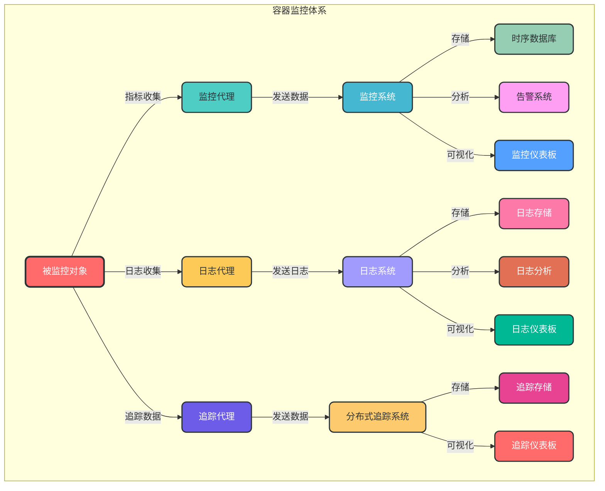

# 8.1 容器监控

## 8.1.1 监控概述

容器监控是指对 Docker 容器的运行状态、资源使用情况和性能指标进行实时收集、分析和可视化的过程。通过容器监控，可以及时发现和解决容器运行中的问题，确保应用程序的稳定运行。

### 8.1.1.1 监控的重要性

- **实时了解容器状态**：及时掌握容器的运行状态，发现异常情况
- **优化资源使用**：分析资源使用情况，优化资源配置
- **提前发现问题**：通过监控指标的变化，提前发现潜在问题
- **性能优化**：分析性能瓶颈，优化应用程序性能
- **故障排查**：在发生故障时，通过监控数据进行快速排查
- **容量规划**：根据监控数据，进行合理的容量规划

### 8.1.1.2 监控体系架构



## 8.1.2 内置监控工具

### 8.1.2.1 Docker Stats

Docker Stats 是 Docker 内置的监控命令，可以实时查看容器的资源使用情况。

```bash
# 基本用法
docker stats

# 查看特定容器的统计信息
docker stats <container_name>

# 格式化输出
docker stats --format "table {{.Name}}\t{{.CPUPerc}}\t{{.MemUsage}}\t{{.NetIO}}\t{{.BlockIO}}\t{{.PIDs}}"

# 不实时刷新，只显示一次
docker stats --no-stream
```

### 8.1.2.2 Docker Inspect

Docker Inspect 命令可以查看容器的详细配置和状态信息。

```bash
# 查看容器详细信息
docker inspect <container_name>

# 查看容器的网络配置
docker inspect --format='{{json .NetworkSettings}}' <container_name> | jq

# 查看容器的挂载信息
docker inspect --format='{{json .Mounts}}' <container_name> | jq

# 查看容器的资源限制
docker inspect --format='{{json .HostConfig.Resources}}' <container_name> | jq
```

### 8.1.2.3 Docker Events

Docker Events 命令可以查看 Docker 系统的事件日志。

```bash
# 查看 Docker 事件
docker events

# 过滤特定类型的事件
docker events --filter 'type=container'

# 格式化输出
docker events --format '{{.Time}} {{.Type}} {{.Action}} {{.Actor.Attributes.name}}'
```

## 8.1.3 第三方监控工具

### 8.1.3.1 cAdvisor

cAdvisor（Container Advisor）是 Google 开发的容器监控工具，可以收集、聚合和导出容器的资源使用情况和性能指标。

```bash
# 运行 cAdvisor
docker run -d --name=cadvisor -p 8080:8080 \
  -v /:/rootfs:ro \
  -v /var/run:/var/run:ro \
  -v /sys:/sys:ro \
  -v /var/lib/docker/:/var/lib/docker:ro \
  -v /dev/disk/:/dev/disk:ro \
  --privileged \
  --device=/dev/kmsg \
  gcr.io/cadvisor/cadvisor:v0.47.0
```

访问地址：http://localhost:8080

### 8.1.3.2 Prometheus + Grafana

Prometheus 是一个开源的监控和告警系统，Grafana 是一个开源的可视化平台，两者结合可以构建强大的容器监控系统。

#### 部署 Prometheus

```yaml
# prometheus.yml
global:
  scrape_interval: 15s
  evaluation_interval: 15s

scrape_configs:
  - job_name: 'prometheus'
    static_configs:
      - targets: ['localhost:9090']
  
  - job_name: 'docker'
    static_configs:
      - targets: ['cadvisor:8080']
    metrics_path: /metrics
    
  - job_name: 'node'
    static_configs:
      - targets: ['node-exporter:9100']
```

```bash
# 运行 Prometheus
docker run -d --name prometheus -p 9090:9090 \
  -v $(pwd)/prometheus.yml:/etc/prometheus/prometheus.yml \
  --network monitoring \
  prom/prometheus
```

#### 部署 Node Exporter

```bash
# 运行 Node Exporter
docker run -d --name node-exporter -p 9100:9100 \
  -v /proc:/host/proc:ro \
  -v /sys:/host/sys:ro \
  -v /:/rootfs:ro \
  --net="host" \
  prom/node-exporter
```

#### 部署 Grafana

```bash
# 运行 Grafana
docker run -d --name grafana -p 3000:3000 \
  --network monitoring \
  -v grafana-data:/var/lib/grafana \
  grafana/grafana
```

访问地址：http://localhost:3000

#### 导入 Grafana 仪表板

1. 登录 Grafana（默认用户名：admin，密码：admin）
2. 添加 Prometheus 数据源
3. 导入 Docker 相关的仪表板模板
   - Docker 仪表板 ID：12271
   - Node Exporter 仪表板 ID：1860
   - cAdvisor 仪表板 ID：13978

### 8.1.3.3 ELK Stack

ELK Stack（Elasticsearch + Logstash + Kibana）是一个流行的日志管理和分析平台，可以用于收集、存储、分析和可视化容器日志。

```bash
# 使用 Docker Compose 部署 ELK Stack
# 参考：https://github.com/deviantony/docker-elk
```

### 8.1.3.4 Loki + Promtail + Grafana

Loki 是 Grafana Labs 开发的日志聚合系统，Promtail 是日志收集代理，结合 Grafana 可以构建轻量级的日志监控系统。

```bash
# 运行 Loki
docker run -d --name loki -p 3100:3100 \
  grafana/loki:2.6.0

# 运行 Promtail
docker run -d --name promtail \
  -v $(pwd)/promtail-config.yml:/etc/promtail/config.yml \
  -v /var/lib/docker/containers:/var/lib/docker/containers:ro \
  -v /var/run/docker.sock:/var/run/docker.sock \
  grafana/promtail:2.6.0
```

```yaml
# promtail-config.yml
server:
  http_listen_port: 9080
  grpc_listen_port: 0

positions:
  filename: /tmp/positions.yaml

clients:
  - url: http://loki:3100/loki/api/v1/push

scrape_configs:
- job_name: system
  static_configs:
  - targets:
      - localhost
    labels:
      job: varlogs
      __path__: /var/log/*log

- job_name: docker
  static_configs:
  - targets:
      - localhost
    labels:
      job: docker
      __path__: /var/lib/docker/containers/*/*-json.log
```

## 8.1.4 监控指标

### 8.1.4.1 核心监控指标

| 指标类型 | 具体指标 | 说明 | 单位 |
|---------|---------|------|------|
| **CPU 指标** | CPU 使用率 | 容器使用的 CPU 百分比 | % |
| | CPU 限制 | 容器的 CPU 限制 | 核心数 |
| | CPU  throttle | CPU 节流次数 | 次 |
| **内存指标** | 内存使用率 | 容器使用的内存百分比 | % |
| | 内存使用量 | 容器使用的内存大小 | MB/GB |
| | 内存限制 | 容器的内存限制 | MB/GB |
| | 内存缓存 | 容器使用的内存缓存大小 | MB/GB |
| **磁盘指标** | 磁盘 IO 读取 | 容器的磁盘读取速度 | MB/s |
| | 磁盘 IO 写入 | 容器的磁盘写入速度 | MB/s |
| | 磁盘使用量 | 容器使用的磁盘空间 | MB/GB |
| **网络指标** | 网络 IO 接收 | 容器的网络接收速度 | MB/s |
| | 网络 IO 发送 | 容器的网络发送速度 | MB/s |
| | 网络连接数 | 容器的网络连接数量 | 个 |
| **容器指标** | 容器状态 | 容器的运行状态 | running/exited/paused |
| | 容器启动时间 | 容器的启动时间 | 时间戳 |
| | 容器重启次数 | 容器的重启次数 | 次 |
| | 容器内进程数 | 容器内的进程数量 | 个 |

### 8.1.4.2 应用级指标

除了系统级指标外，还需要监控应用程序级别的指标，例如：

- HTTP 请求数和响应时间
- 数据库查询性能
- 缓存命中率
- 业务指标（如每秒处理订单数）

这些指标通常需要在应用程序中集成监控库来收集，例如：

- Prometheus Client Library
- StatsD
- OpenTelemetry

## 8.1.5 监控最佳实践

### 8.1.5.1 监控策略

1. **分层监控**：从基础设施、容器到应用程序，进行分层监控
2. **关键指标监控**：关注核心业务指标和系统指标
3. **告警策略**：设置合理的告警阈值，避免告警风暴
4. **监控数据保留**：根据需求设置合理的数据保留时间
5. **监控系统高可用**：确保监控系统本身的高可用性

### 8.1.5.2 告警策略

1. **分级告警**：根据问题的严重程度设置不同级别的告警（如 P0、P1、P2）
2. **告警收敛**：对相同类型的告警进行收敛，避免重复告警
3. **告警通知方式**：选择合适的通知方式（如邮件、短信、Slack、微信）
4. **告警处理流程**：建立明确的告警处理流程和责任人
5. **告警测试**：定期测试告警系统，确保其正常工作

### 8.1.5.3 性能优化

1. **减少监控开销**：合理设置监控采样频率，避免过度监控
2. **使用高效的监控工具**：选择性能开销小的监控工具
3. **分布式监控**：对于大规模部署，使用分布式监控架构
4. **数据聚合**：对监控数据进行聚合，减少存储和计算开销
5. **监控数据压缩**：对监控数据进行压缩，减少存储空间

## 8.1.6 常见监控问题

### 8.1.6.1 监控数据缺失

```bash
# 问题：无法收集到容器的监控数据
# 解决方案：

# 1. 检查监控工具是否正常运行
docker ps | grep cadvisor

# 2. 检查监控工具的配置
docker inspect cadvisor

# 3. 检查容器的权限设置
# 确保监控工具具有足够的权限访问容器数据

# 4. 检查网络连接
# 确保监控工具可以连接到容器和监控系统

# 5. 查看监控工具日志
docker logs cadvisor
```

### 8.1.6.2 监控数据不准确

```bash
# 问题：监控数据与实际情况不符
# 解决方案：

# 1. 检查监控工具的版本
# 确保使用的是最新版本的监控工具

# 2. 检查监控配置
# 确保监控工具的配置正确

# 3. 校准监控数据
# 将监控数据与实际资源使用情况进行对比

# 4. 检查容器的资源限制
# 确保容器的资源限制设置合理
```

### 8.1.6.3 监控系统性能问题

```bash
# 问题：监控系统本身性能不佳
# 解决方案：

# 1. 优化监控采样频率
# 降低采样频率，减少数据量

# 2. 增加监控系统资源
# 为监控系统分配更多的 CPU、内存和磁盘资源

# 3. 优化监控数据存储
# 使用更高效的时序数据库，如 Prometheus、InfluxDB

# 4. 分布式部署监控系统
# 将监控系统分布到多个节点，提高性能和可用性
```

## 8.1.7 容器监控总结

容器监控是 Docker 运维的重要组成部分，通过合理的监控策略和工具选择，可以确保容器的稳定运行和高效管理。在实际应用中，需要根据具体的业务需求和技术栈，选择合适的监控工具和方案，构建完整的容器监控体系。

推荐的监控方案：
- 对于小型环境：使用 Docker 内置命令 + cAdvisor
- 对于中型环境：使用 Prometheus + Grafana + cAdvisor
- 对于大型环境：使用分布式监控系统，如 Prometheus 集群 + Grafana + cAdvisor + ELK Stack

通过持续优化监控策略和工具，可以不断提高容器监控的效率和效果，为容器化应用的稳定运行提供有力保障。