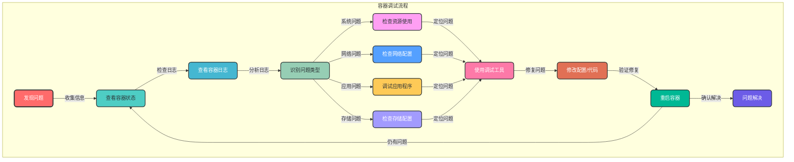

# 8.2 容器调试

## 8.2.1 调试概述

容器调试是指在容器运行过程中，对出现的问题进行诊断、定位和修复的过程。由于容器的隔离性和轻量化特性，容器调试与传统应用调试有所不同，需要使用专门的工具和方法。

### 8.2.1.1 容器调试的挑战

- **隔离性**：容器与宿主机和其他容器隔离，调试工具可能无法直接访问容器内部
- **临时性**：容器可能在故障后自动重启或被删除，难以保留现场
- **资源限制**：容器可能配置了资源限制，导致调试工具无法正常运行
- **日志缺失**：容器日志可能不完整或被截断，难以获取完整的故障信息
- **网络限制**：容器可能处于隔离的网络环境中，难以进行网络调试

### 8.2.1.2 调试流程



## 8.2.2 内置调试工具

### 8.2.2.1 Docker Exec

Docker Exec 命令可以在运行中的容器内部执行命令，是最常用的容器调试工具。

```bash
# 进入容器的交互式 shell
docker exec -it <container_name> /bin/bash
# 或
docker exec -it <container_name> sh

# 在容器中执行单个命令
docker exec <container_name> ls -la

# 查看容器内的进程
docker exec <container_name> ps aux

# 查看容器内的网络连接
docker exec <container_name> netstat -tuln
# 或
docker exec <container_name> ss -tuln

# 查看容器内的环境变量
docker exec <container_name> env

# 查看容器内的文件内容
docker exec <container_name> cat /etc/nginx/nginx.conf

# 检查容器内的磁盘空间
docker exec <container_name> df -h

# 检查容器内的内存使用
docker exec <container_name> free -m
```

### 8.2.2.2 Docker Logs

Docker Logs 命令用于查看容器的日志输出。

```bash
# 查看容器日志
docker logs <container_name>

# 实时查看日志
docker logs -f <container_name>

# 查看最近 N 行日志
docker logs --tail 100 <container_name>

# 查看带时间戳的日志
docker logs -t <container_name>

# 查看日志并过滤关键字
docker logs <container_name> | grep "error"

# 查看日志并显示匹配行前后的内容
docker logs <container_name> | grep -A 5 -B 5 "error"
```

### 8.2.2.3 Docker Inspect

Docker Inspect 命令用于查看容器的详细配置和状态信息。

```bash
# 查看容器的完整信息
docker inspect <container_name>

# 查看容器的网络配置
docker inspect --format='{{json .NetworkSettings}}' <container_name> | jq

# 查看容器的挂载信息
docker inspect --format='{{json .Mounts}}' <container_name> | jq

# 查看容器的资源限制
docker inspect --format='{{json .HostConfig.Resources}}' <container_name> | jq

# 查看容器的环境变量
docker inspect --format='{{json .Config.Env}}' <container_name> | jq

# 查看容器的健康检查配置
docker inspect --format='{{json .Config.Healthcheck}}' <container_name> | jq
```

### 8.2.2.4 Docker Stats

Docker Stats 命令用于查看容器的实时资源使用情况。

```bash
# 查看容器的资源使用情况
docker stats <container_name>

# 查看所有容器的资源使用情况
docker stats

# 查看资源使用情况，不实时刷新
docker stats --no-stream
```

## 8.2.3 第三方调试工具

### 8.2.3.1 Docker Debug

Docker Debug 是 Docker 19.03+ 引入的实验性调试工具，可以在不影响容器运行的情况下，对容器进行调试。

```bash
# 启用实验性功能
export DOCKER_CLI_EXPERIMENTAL=enabled

# 使用 docker debug 调试容器
docker debug <container_name>
```

### 8.2.3.2 nsenter

nsenter 是一个 Linux 工具，可以进入指定的命名空间，用于调试容器。

```bash
# 获取容器的 PID
PID=$(docker inspect --format '{{.State.Pid}}' <container_name>)

# 使用 nsenter 进入容器的命名空间
sudo nsenter -t $PID -m -u -i -n -p /bin/bash
```

### 8.2.3.3 lsof

lsof（List Open Files）工具可以查看容器内打开的文件和网络连接。

```bash
# 在容器内运行 lsof
docker exec <container_name> lsof

# 查看特定端口的连接
docker exec <container_name> lsof -i :80

# 查看特定进程打开的文件
docker exec <container_name> lsof -p <pid>
```

### 8.2.3.4 tcpdump

tcpdump 是一个网络抓包工具，可以用于调试容器的网络问题。

```bash
# 在容器内运行 tcpdump
docker exec -it <container_name> tcpdump -i eth0

# 抓包并保存到文件
docker exec -it <container_name> tcpdump -i eth0 -w /tmp/traffic.pcap

# 从容器中复制抓包文件到宿主机
docker cp <container_name>:/tmp/traffic.pcap ./

# 使用 Wireshark 分析抓包文件
wireshark ./traffic.pcap
```

### 8.2.3.5 strace

strace 是一个系统调用跟踪工具，可以用于调试容器内进程的系统调用。

```bash
# 在容器内运行 strace
docker exec -it <container_name> strace -p <pid>

# 跟踪特定系统调用
docker exec -it <container_name> strace -e open,read,write -p <pid>

# 跟踪新进程的系统调用
docker exec -it <container_name> strace -f <command>
```

### 8.2.3.6 gdb

gdb 是一个调试器，可以用于调试容器内的 C/C++ 程序。

```bash
# 在容器内运行 gdb
docker exec -it <container_name> gdb <executable> <pid>

# 调试崩溃的程序（需要 core dump）
docker exec -it <container_name> gdb <executable> core
```

## 8.2.4 调试方法

### 8.2.4.1 系统问题调试

1. **检查容器状态**
   ```bash
   docker ps -a | grep <container_name>
   ```

2. **查看容器日志**
   ```bash
   docker logs <container_name>
   ```

3. **检查资源使用情况**
   ```bash
   docker stats <container_name>
   ```

4. **检查系统日志**
   ```bash
   # 查看宿主机系统日志
sudo dmesg | grep -i "docker"
   ```

5. **检查容器内部系统状态**
   ```bash
   docker exec <container_name> top
   docker exec <container_name> df -h
   docker exec <container_name> free -m
   ```

### 8.2.4.2 网络问题调试

1. **检查容器网络配置**
   ```bash
   docker inspect --format='{{json .NetworkSettings}}' <container_name> | jq
   ```

2. **测试容器网络连通性**
   ```bash
   # 测试容器内部网络
docker exec <container_name> ping -c 3 localhost

   # 测试容器间通信
docker exec <container1> ping -c 3 <container2_ip>

   # 测试容器与外部网络通信
docker exec <container_name> ping -c 3 www.baidu.com

   # 测试 DNS 解析
docker exec <container_name> nslookup www.baidu.com
   ```

3. **检查端口映射**
   ```bash
   docker port <container_name>
   ```

4. **检查防火墙规则**
   ```bash
   sudo iptables -L -n
   ```

5. **使用 tcpdump 抓包**
   ```bash
   docker exec -it <container_name> tcpdump -i eth0
   ```

### 8.2.4.3 应用程序调试

1. **进入容器调试**
   ```bash
   docker exec -it <container_name> /bin/bash
   ```

2. **查看应用日志**
   ```bash
   # 假设应用日志位于 /var/log/app.log
docker exec <container_name> tail -f /var/log/app.log
   ```

3. **检查应用进程**
   ```bash
   docker exec <container_name> ps aux | grep <app_name>
   ```

4. **使用调试工具**
   ```bash
   # 使用 strace 跟踪应用进程
docker exec -it <container_name> strace -p <pid>

   # 使用 gdb 调试应用程序
docker exec -it <container_name> gdb <executable> <pid>
   ```

5. **修改应用配置**
   ```bash
   # 复制配置文件到宿主机
docker cp <container_name>:/etc/app/config.yml ./

   # 修改配置文件后，复制回容器
docker cp ./config.yml <container_name>:/etc/app/

   # 重启容器
docker restart <container_name>
   ```

### 8.2.4.4 存储问题调试

1. **检查挂载配置**
   ```bash
   docker inspect --format='{{json .Mounts}}' <container_name> | jq
   ```

2. **检查挂载点权限**
   ```bash
   docker exec <container_name> ls -la <mount_point>
   ```

3. **检查磁盘空间**
   ```bash
   docker exec <container_name> df -h
   ```

4. **检查文件系统**
   ```bash
   docker exec <container_name> fsck /dev/sda1
   ```

5. **测试读写权限**
   ```bash
   docker exec <container_name> touch <mount_point>/test.txt
   ```

## 8.2.5 调试最佳实践

### 8.2.5.1 容器设计考虑调试需求

1. **包含调试工具**：在容器中包含常用的调试工具，如 bash、cat、ls、ps、netstat、tcpdump 等
2. **暴露调试端口**：如果应用支持远程调试，暴露调试端口
3. **配置详细日志**：配置应用程序输出详细的日志，包括调试信息
4. **支持环境变量配置**：允许通过环境变量调整应用程序的日志级别和行为
5. **健康检查**：配置健康检查，便于快速发现异常容器

### 8.2.5.2 调试环境准备

1. **保留故障现场**：在容器发生故障时，不要立即删除容器，而是保留下来进行调试
2. **创建调试副本**：对于生产环境的容器，可以创建一个副本进行调试，避免影响生产服务
3. **使用调试镜像**：创建专门的调试镜像，包含完整的调试工具和依赖
4. **配置日志持久化**：将容器日志持久化到外部存储，便于后续分析

### 8.2.5.3 调试技巧

1. **从外到内调试**：先检查容器状态、日志和资源使用情况，再进入容器内部调试
2. **分步骤排查**：根据问题症状，逐步缩小排查范围
3. **使用多种工具**：结合使用多种调试工具，获取全面的信息
4. **记录调试过程**：记录调试过程和发现，便于后续分析和分享
5. **测试修复方案**：在测试环境中验证修复方案，确保安全后再应用到生产环境

### 8.2.5.4 预防措施

1. **定期监控**：建立完善的监控体系，及时发现潜在问题
2. **日志管理**：建立集中的日志管理系统，便于日志分析和查询
3. **定期备份**：定期备份容器数据和配置，便于恢复
4. **版本控制**：对容器镜像和配置进行版本控制，便于回滚
5. **自动化测试**：建立自动化测试体系，在部署前发现问题

## 8.2.6 常见问题解决方案

### 8.2.6.1 容器无法启动

```bash
# 问题：容器无法启动，提示 "Error: No such container: <container_name>"
# 解决方案：检查容器名称是否正确

# 问题：容器启动后立即退出
# 解决方案：查看容器日志
docker logs <container_name>

# 问题：容器启动失败，提示资源不足
# 解决方案：增加容器资源限制
docker run -d --name app --cpus 1 --memory 1g myapp:1.0

# 问题：容器启动失败，提示端口被占用
# 解决方案：修改端口映射或停止占用端口的进程
docker run -d --name app -p 8080:80 myapp:1.0
```

### 8.2.6.2 容器网络不通

```bash
# 问题：容器无法访问外部网络
# 解决方案：检查容器网络配置
docker network inspect <network_name>

# 问题：容器间无法通信
# 解决方案：确保容器在同一网络
docker network connect <network_name> <container_name>

# 问题：外部无法访问容器端口
# 解决方案：检查端口映射和防火墙规则
docker port <container_name>
sudo ufw status
```

### 8.2.6.3 容器数据丢失

```bash
# 问题：容器重启后数据丢失
# 解决方案：使用数据卷持久化数据
docker run -d --name app -v <volume_name>:<container_path> myapp:1.0

# 问题：数据卷中的数据损坏
# 解决方案：从备份恢复数据
```

### 8.2.6.4 应用程序崩溃

```bash
# 问题：应用程序崩溃，容器重启
# 解决方案：

# 1. 查看容器日志
docker logs <container_name>

# 2. 配置 core dump
docker run -d --name app --ulimit core=-1 myapp:1.0

# 3. 使用 gdb 调试 core dump
docker exec -it <container_name> gdb <executable> core
```

## 8.2.7 容器调试总结

容器调试是 Docker 运维的重要技能，需要掌握多种工具和方法，结合实际情况灵活运用。通过合理的容器设计和调试准备，可以提高调试效率，快速定位和解决问题。

在实际应用中，需要结合具体的业务场景和技术栈，选择合适的调试工具和方法。同时，建立完善的监控和日志管理体系，可以减少调试的频率和难度，提高系统的可靠性和可用性。