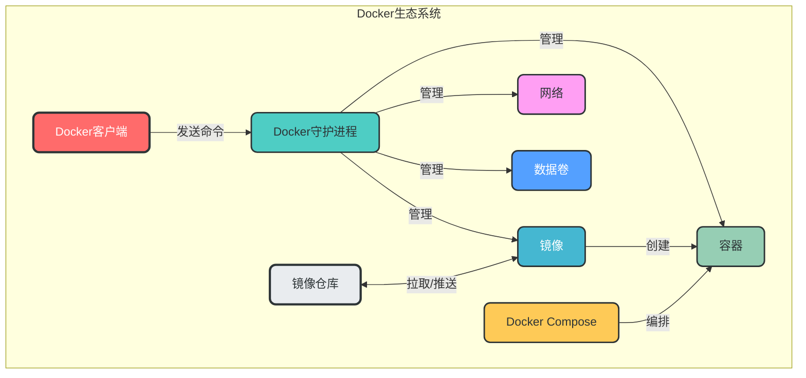
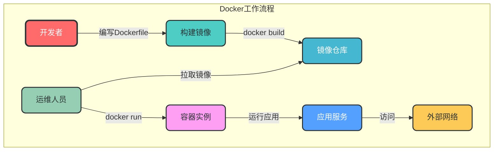

# Docker 完整指南

本指南系统整理了 Docker 的核心功能、最佳实践和常见问题解决方案，结合命令示例、详细说明和 Mermaid 流程图，帮助开发者全面掌握 Docker 技术栈。

## 目录结构

1. [镜像管理](./1.镜像管理.md)
2. [容器管理](./2.容器管理.md)
3. [网络管理](./3.网络管理.md)
4. [数据卷管理](./4.数据卷管理.md)
5. [Docker Compose](./5.Docker%20Compose.md)
6. [镜像仓库管理](./6.镜像仓库管理.md)
7. [系统管理](./7.系统管理.md)
8. [监控与调试](./8.监控与调试.md)
   - [容器监控](./8.1.容器监控.md)
   - [容器调试](./8.2.容器调试.md)
9. [最佳实践](./9.最佳实践.md)
   - [镜像构建最佳实践](./9.1.镜像构建最佳实践.md)
   - [容器运行最佳实践](./9.2.容器运行最佳实践.md)
   - [安全最佳实践](./9.3.安全最佳实践.md)
10. [常见问题解决方案](./10.常见问题解决方案.md)
    - [权限问题](./10.1.权限问题.md)
    - [网络问题](./10.2.网络问题.md)
    - [存储问题](./10.3.存储问题.md)
    - [镜像拉取问题](./10.4.镜像拉取问题.md)
11. [命令速查表](./11.命令速查表.md)
    - [常用命令](./11.1.常用命令.md)
    - [Docker Compose 常用命令](./11.2.Docker%20Compose常用命令.md)
    - [资源清理命令](./11.3.资源清理命令.md)
12. [附录](./12.附录.md)
    - [Dockerfile 示例](./12.1.Dockerfile示例.md)
    - [docker-compose.yml 示例](./12.2.docker-compose.yml示例.md)
    - [常用 Docker 镜像](./12.3.常用Docker镜像.md)

## Docker 核心组件关系

## Docker 工作流程

## 学习路径

1. **基础概念**：镜像、容器、仓库
2. **核心操作**：镜像管理、容器管理
3. **高级功能**：网络管理、数据卷管理
4. **编排工具**：Docker Compose
5. **最佳实践**：镜像构建、容器运行、安全
6. **监控与调试**：容器监控、调试技巧
7. **常见问题**：解决方案与排查思路

## 核心优势

- **轻量级**：基于容器化技术，资源占用少
- **可移植性**：一次构建，随处运行
- **一致性**：消除开发、测试、生产环境差异
- **高效性**：快速启动、停止和扩展
- **隔离性**：资源隔离，提高安全性
- **可扩展性**：支持大规模集群部署

## 应用场景

- **应用容器化**：将传统应用迁移到容器环境
- **微服务架构**：构建和管理微服务应用
- **持续集成/持续部署**：自动化构建、测试和部署
- **开发环境标准化**：确保开发团队环境一致
- **快速部署和扩展**：响应业务需求快速调整

通过本指南的学习，您将能够：
- 熟练使用 Docker 命令行工具
- 构建高效、安全的 Docker 镜像
- 编排和管理多容器应用
- 解决 Docker 使用过程中的常见问题
- 遵循 Docker 最佳实践

让我们开始 Docker 之旅！