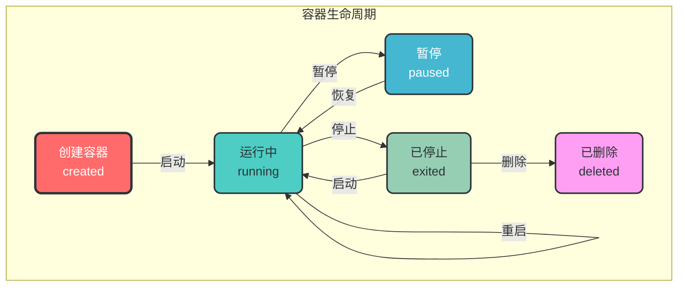
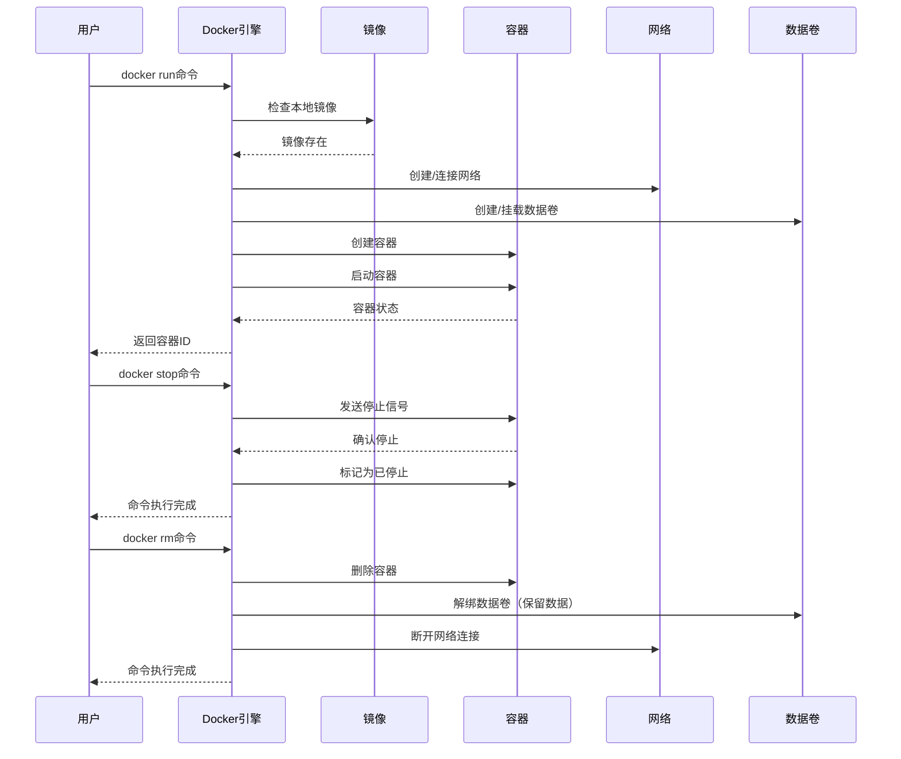

# 2. 容器管理

## 2.1 核心概念

Docker 容器是 Docker 镜像的运行实例，是一个轻量级、可移植的执行环境。容器包含了应用程序及其所有依赖，但与宿主机和其他容器隔离，实现了资源的隔离和限制。

### 2.1.1 容器的生命周期



## 2.2 容器命令

### 2.2.1 容器创建与启动

```bash
# 创建容器但不启动
docker create [options] <image_name>:<tag> [command]

# 创建并启动容器
docker run [options] <image_name>:<tag> [command]

# 常用选项：
# -d, --detach: 后台运行容器
# -p, --publish: 端口映射，格式：宿主机端口:容器端口
# -v, --volume: 挂载卷，格式：宿主机路径:容器路径
# -e, --env: 设置环境变量
# --name: 指定容器名称
# --restart: 容器重启策略
# --network: 连接到指定网络

# 示例：后台运行 nginx 容器
docker run -d --name nginx -p 80:80 nginx:alpine

# 示例：带环境变量的容器
docker run -d --name mysql -e MYSQL_ROOT_PASSWORD=123456 mysql:8.0
```

### 2.2.2 容器列表

```bash
# 列出运行中的容器
docker ps

# 列出所有容器（包括已停止的）
docker ps -a

# 只显示容器 ID
docker ps -q

# 过滤容器
docker ps -f <filter>

# 示例：列出所有 nginx 容器
docker ps -f name=nginx

# 示例：列出所有已停止的容器
docker ps -f status=exited
```

### 2.2.3 容器操作

```bash
# 启动容器
docker start <container_id|container_name>

# 停止容器
docker stop <container_id|container_name>

# 重启容器
docker restart <container_id|container_name>

# 暂停容器
docker pause <container_id|container_name>

# 恢复容器
docker unpause <container_id|container_name>

# 删除容器
docker rm <container_id|container_name>

# 强制删除运行中的容器
docker rm -f <container_id|container_name>

# 删除所有已停止的容器
docker container prune

# 示例：启动已停止的容器
docker start nginx

# 示例：强制删除运行中的容器
docker rm -f mysql
```

### 2.2.4 容器访问

```bash
# 进入正在运行的容器（交互式）
docker exec -it <container_id|container_name> <shell>

# 在容器中执行命令
docker exec <container_id|container_name> <command>

# 查看容器日志
docker logs <container_id|container_name>

# 实时查看日志
docker logs -f <container_id|container_name>

# 查看容器资源使用情况
docker stats <container_id|container_name>

# 示例：进入容器
docker exec -it nginx sh

# 示例：在容器中执行命令
docker exec nginx ls -la /usr/share/nginx/html

# 示例：查看容器日志
docker logs -f mysql
```

### 2.2.5 容器检查

```bash
# 查看容器详细信息
docker inspect <container_id|container_name>

# 查看容器端口映射
docker port <container_id|container_name>

# 查看容器内进程
docker top <container_id|container_name>

# 查看容器文件系统变化
docker diff <container_id|container_name>

# 示例：查看容器详细信息
docker inspect nginx

# 示例：查看容器端口
docker port nginx
```

### 2.2.6 容器数据管理

```bash
# 复制文件到容器
docker cp <host_path> <container_id|container_name>:<container_path>

# 从容器复制文件到主机
docker cp <container_id|container_name>:<container_path> <host_path>

# 示例：复制文件到容器
docker cp index.html nginx:/usr/share/nginx/html/

# 示例：从容器复制文件到主机
docker cp nginx:/etc/nginx/nginx.conf ./nginx.conf
```

## 2.3 容器运行时配置

### 2.3.1 资源限制

```bash
# CPU 限制
# --cpus: 限制 CPU 核心数
# --cpu-shares: CPU 份额（相对权重）
# --cpu-period: CPU 调度周期
# --cpu-quota: CPU 配额

# 内存限制
# -m, --memory: 内存限制
# --memory-swap: 内存+交换分区限制

# 示例：限制容器使用 0.5 个 CPU 和 512MB 内存
docker run -d --name app --cpus 0.5 --memory 512m myapp:1.0

# 示例：设置 CPU 份额
docker run -d --name app --cpu-shares 512 myapp:1.0
```

### 2.3.2 重启策略

```bash
# --restart 选项：
# no: 不自动重启（默认）
# on-failure[:max-retries]: 失败时重启，可指定最大重试次数
# always: 总是重启
# unless-stopped: 除非手动停止，否则总是重启

# 示例：失败时重启，最多重试 5 次
docker run -d --name app --restart on-failure:5 myapp:1.0

# 示例：总是重启
docker run -d --name app --restart always myapp:1.0
```

### 2.3.3 安全配置

```bash
# 以特权模式运行容器
# 注意：特权模式会突破容器隔离，谨慎使用
docker run -d --name app --privileged myapp:1.0

# 禁用容器内的一些能力
docker run -d --name app --cap-drop ALL --cap-add NET_ADMIN myapp:1.0

# 只读文件系统
# --read-only: 容器文件系统只读
docker run -d --name app --read-only myapp:1.0

# 示例：禁用特权模式，只添加必要的能力
docker run -d --name app --cap-drop ALL --cap-add CHOWN --cap-add NET_BIND_SERVICE myapp:1.0
```

## 2.4 容器网络配置

```bash
# 连接容器到网络
docker network connect <network_name> <container_id|container_name>

# 断开容器与网络的连接
docker network disconnect <network_name> <container_id|container_name>

# 示例：连接容器到自定义网络
docker network connect my-network app

# 示例：断开容器与默认网络的连接
docker network disconnect bridge app
```

## 2.5 容器管理最佳实践

### 2.5.1 容器设计原则

1. **单一职责原则**：每个容器只运行一个应用进程
2. **无状态设计**：容器应该是无状态的，数据存储在外部存储
3. **不可变性**：容器应该是不可变的，更新时创建新容器而非修改现有容器
4. **轻量化**：使用最小的基础镜像，减少攻击面
5. **健康检查**：配置健康检查，确保容器正常运行

### 2.5.2 容器命名规范

```bash
# 推荐命名规范：<project>-<service>-<environment>-<instance>
# 示例：
docker run -d --name myapp-web-prod-01 myapp:prod
```

### 2.5.3 健康检查配置

```dockerfile
# Dockerfile 中配置健康检查
HEALTHCHECK --interval=30s --timeout=10s --start-period=5s --retries=3 \
  CMD curl -f http://localhost/health || exit 1

# 运行容器时配置健康检查
docker run -d --name app \
  --health-cmd="curl -f http://localhost/health || exit 1" \
  --health-interval=30s \
  --health-timeout=10s \
  --health-start-period=5s \
  --health-retries=3 \
  myapp:1.0
```

## 2.6 容器生命周期管理

### 2.6.1 容器编排流程



### 2.6.2 容器监控与日志

```bash
# 查看容器资源使用情况
docker stats

# 实时查看容器日志
docker logs -f <container_name>

# 查看容器日志并显示时间戳
docker logs -t <container_name>

# 查看最近 100 行日志
docker logs --tail 100 <container_name>

# 示例：监控所有容器资源使用情况
docker stats $(docker ps -q)
```

## 2.7 常见容器问题

### 2.7.1 容器启动失败

```bash
# 问题：容器启动后立即退出
# 解决方案：查看容器日志
docker logs <container_name>

# 示例：查看失败容器的日志
docker logs nginx-failed
```

### 2.7.2 容器网络不通

```bash
# 问题：容器无法访问外部网络
# 解决方案：检查容器网络配置
docker inspect <container_name> | grep -A 20 "Networks"

# 示例：测试容器网络连通性
docker exec <container_name> ping -c 3 www.baidu.com
```

### 2.7.3 容器资源不足

```bash
# 问题：容器因资源不足被杀死
# 解决方案：查看系统日志
dmesg | grep -i "kill"

# 示例：增加容器资源限制
docker run -d --name app --cpus 1 --memory 1g myapp:1.0
```

## 2.8 容器管理工作流

```mermaid
flowchart TD
    subgraph 容器管理工作流
        A[镜像准备<br/>Image Preparation] -->|docker pull| B[镜像验证<br/>Image Validation]
        B -->|docker run| C[容器创建与启动<br/>Container Creation]
        C -->|docker exec| D[容器操作与管理<br/>Container Operations]
        D -->|docker logs/stats| E[容器监控与日志<br/>Monitoring & Logs]
        E -->|docker stop| F[容器停止<br/>Container Stop]
        F -->|docker rm| G[容器清理<br/>Container Cleanup]
    end
    
    style A fill:#FF6B6B,stroke:#2D3436,stroke-width:3px,color:white,rx:8,ry:8
    style B fill:#4ECDC4,stroke:#2D3436,stroke-width:2px,color:#2D3436,rx:8,ry:8
    style C fill:#45B7D1,stroke:#2D3436,stroke-width:2px,color:white,rx:8,ry:8
    style D fill:#96CEB4,stroke:#2D3436,stroke-width:2px,color:#2D3436,rx:8,ry:8
    style E fill:#FF9FF3,stroke:#2D3436,stroke-width:2px,color:#2D3436,rx:8,ry:8
    style F fill:#54A0FF,stroke:#2D3436,stroke-width:2px,color:white,rx:8,ry:8
    style G fill:#FECA57,stroke:#2D3436,stroke-width:2px,color:#2D3436,rx:8,ry:8
```



## 2.9 容器管理工具

### 2.9.1 Docker Compose

用于定义和运行多容器 Docker 应用程序的工具，详见 [Docker Compose](./5.Docker%20Compose.md) 章节。

### 2.9.2 Docker Swarm

Docker 内置的容器编排工具，用于管理大规模容器集群。

### 2.9.3 Kubernetes

生产级容器编排平台，用于自动化部署、扩展和管理容器化应用程序。

## 2.10 容器安全最佳实践

1. **使用官方镜像**：优先使用官方或经过验证的镜像
2. **定期更新镜像**：及时修复安全漏洞
3. **最小权限原则**：避免使用特权模式，只授予必要的能力
4. **启用容器日志**：收集和分析容器日志，便于安全审计
5. **使用只读文件系统**：减少容器被攻击的风险
6. **配置网络隔离**：使用自定义网络，限制容器间通信
7. **使用容器扫描工具**：检测容器中的安全漏洞
8. **避免在容器中存储敏感数据**：使用环境变量或外部存储
9. **限制容器资源**：防止容器消耗过多资源
10. **使用健康检查**：及时发现和恢复异常容器

通过本章节的学习，您已经掌握了 Docker 容器的核心概念、管理命令和最佳实践。容器管理是 Docker 使用的核心内容，熟练掌握这些知识将帮助您高效地管理和运行容器化应用程序。