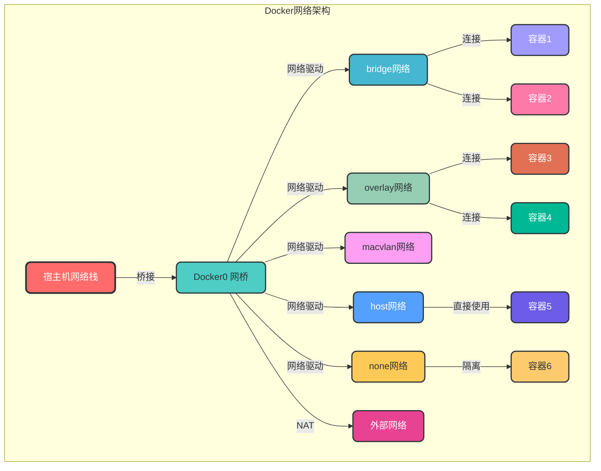
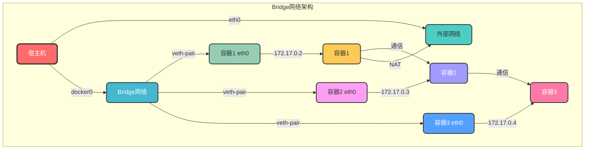
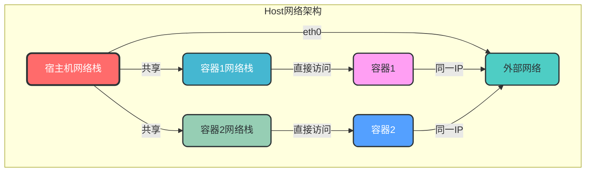
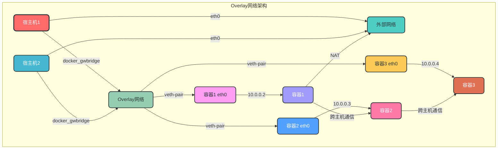
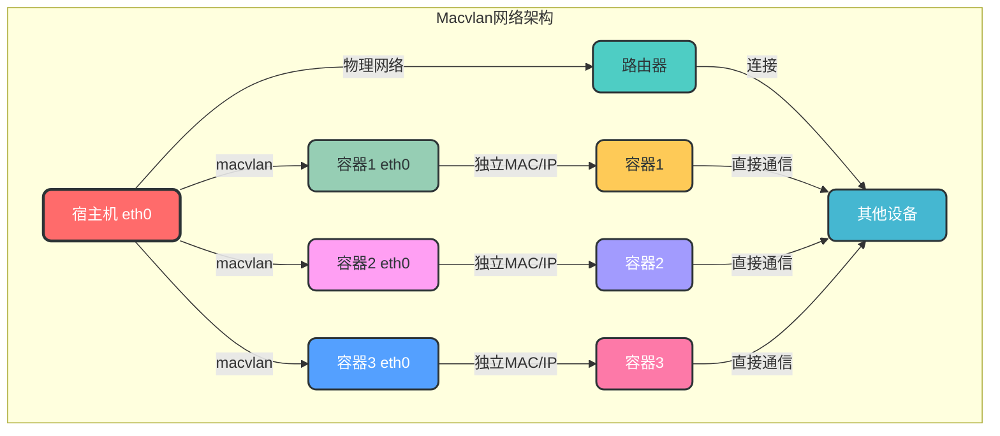
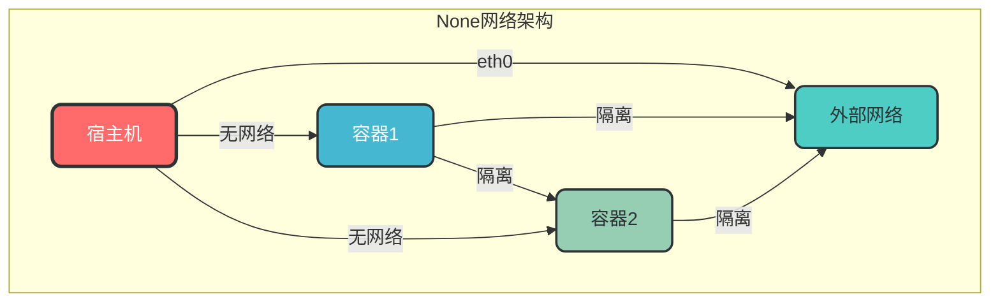
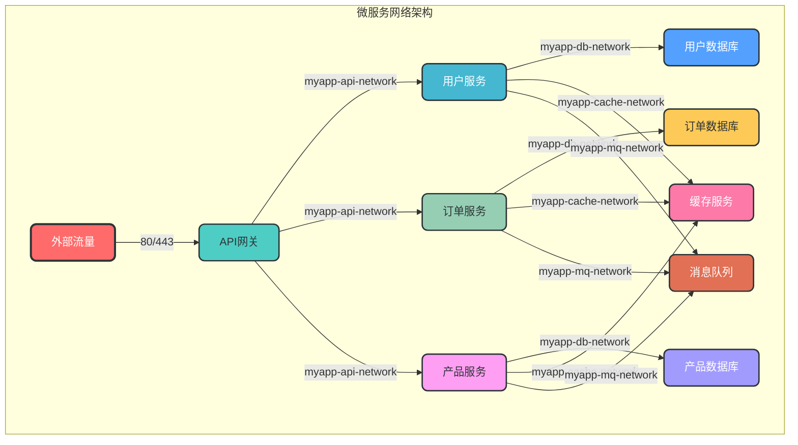

# 3. 网络管理

## 3.1 核心概念

Docker 网络是 Docker 容器之间以及容器与外部网络通信的基础设施。Docker 提供了多种网络驱动，用于满足不同场景的网络需求。

### 3.1.1 Docker 网络模型

Docker 使用 CNI（Container Network Interface）或 CNM（Container Network Model）来管理容器网络，支持多种网络驱动：

| 网络驱动 | 描述 | 适用场景 |
|---------|------|----------|
| bridge | 默认网络驱动，适用于单主机容器通信 | 开发环境、小型应用 |
| host | 容器直接使用宿主机网络 | 高性能场景、需要访问宿主机网络 |
| overlay | 跨主机容器通信网络 | 多主机集群、Docker Swarm/Kubernetes |
| macvlan | 为容器分配 MAC 地址，使其作为物理网络上的独立设备 | 传统应用迁移、需要物理网络地址 |
| none | 禁用容器网络 | 不需要网络的容器 |

### 3.1.2 Docker 网络架构



## 3.2 网络命令

### 3.2.1 网络列表

```bash
# 列出所有 Docker 网络
docker network ls

# 查看网络详情
docker network inspect <network_name>

# 示例：列出所有网络
docker network ls

# 示例：查看 bridge 网络详情
docker network inspect bridge
```

### 3.2.2 网络创建

```bash
# 创建自定义网络
docker network create [options] <network_name>

# 常用选项：
# -d, --driver: 指定网络驱动（默认 bridge）
# --subnet: 指定子网CIDR
# --gateway: 指定网关
# --ip-range: 指定IP范围
# --aux-address: 指定辅助IP地址

# 示例：创建自定义 bridge 网络
docker network create my-bridge-network

# 示例：创建带自定义子网的网络
docker network create --subnet 172.20.0.0/16 --gateway 172.20.0.1 my-subnet-network
```

### 3.2.3 网络管理

```bash
# 连接容器到网络
docker network connect <network_name> <container_name>

# 断开容器与网络的连接
docker network disconnect <network_name> <container_name>

# 删除网络
docker network rm <network_name>

# 删除所有未使用的网络
docker network prune

# 示例：连接容器到自定义网络
docker network connect my-bridge-network my-container

# 示例：删除未使用的网络
docker network prune
```

### 3.2.4 网络监控

```bash
# 查看网络统计信息
docker network stats

# 示例：查看所有网络的统计信息
docker network stats
```

## 3.3 网络类型详解

### 3.3.1 Bridge 网络

Bridge 网络是 Docker 的默认网络类型，适用于同一宿主机上的容器之间通信。



```bash
# 使用默认 bridge 网络运行容器
docker run -d --name container1 nginx:alpine
docker run -d --name container2 nginx:alpine

# 创建自定义 bridge 网络
docker network create my-bridge

# 使用自定义 bridge 网络运行容器
docker run -d --name container3 --network my-bridge nginx:alpine
docker run -d --name container4 --network my-bridge nginx:alpine
```

### 3.3.2 Host 网络

Host 网络使容器直接使用宿主机的网络栈，容器与宿主机共享网络命名空间。



```bash
# 使用 host 网络运行容器
docker run -d --name container-host --network host nginx:alpine
```

### 3.3.3 Overlay 网络

Overlay 网络用于跨主机容器通信，适用于 Docker Swarm 或 Kubernetes 集群。



```bash
# 初始化 Swarm 集群
docker swarm init

# 创建 overlay 网络
docker network create -d overlay my-overlay-network

# 在 Swarm 服务中使用 overlay 网络
docker service create --name my-service --network my-overlay-network nginx:alpine
```

### 3.3.4 Macvlan 网络

Macvlan 网络为容器分配 MAC 地址，使其作为物理网络上的独立设备。



```bash
# 创建 macvlan 网络
docker network create -d macvlan \
  --subnet=192.168.1.0/24 \
  --gateway=192.168.1.1 \
  --ip-range=192.168.1.100/28 \
  --mac-address=02:42:c0:a8:01:64 \
  -o parent=eth0 \
  my-macvlan-network

# 使用 macvlan 网络运行容器
docker run -d --name container-macvlan --network my-macvlan-network nginx:alpine
```

### 3.3.5 None 网络

None 网络禁用容器的网络功能，适用于不需要网络的容器。



```bash
# 使用 none 网络运行容器
docker run -d --name container-none --network none nginx:alpine
```

## 3.4 网络配置最佳实践

### 3.4.1 网络设计原则

1. **网络隔离**：使用不同的网络隔离不同服务，提高安全性
2. **清晰命名**：为网络使用清晰的命名规范，便于管理
3. **合理规划IP地址**：避免IP地址冲突，便于扩展
4. **使用自定义网络**：优先使用自定义bridge网络，而不是默认bridge网络
5. **跨主机通信**：在多主机环境中使用overlay网络
6. **安全配置**：限制容器间通信，只允许必要的端口访问

### 3.4.2 网络命名规范

```bash
# 推荐命名规范：<project>-<environment>-<network-type>
# 示例：
docker network create myapp-prod-bridge
docker network create myapp-prod-overlay
```

### 3.4.3 网络连接最佳实践

```bash
# 1. 使用自定义网络替代默认bridge网络
docker network create myapp-network

# 2. 运行容器时指定网络
docker run -d --name myapp --network myapp-network nginx:alpine

# 3. 为已有容器添加网络连接
docker network connect myapp-network existing-container

# 4. 从网络中移除容器
docker network disconnect myapp-network existing-container
```

## 3.5 网络性能优化

### 3.5.1 选择合适的网络驱动

- 对于单主机高性能场景，使用 host 网络
- 对于跨主机场景，使用 overlay 网络
- 对于需要物理网络地址的场景，使用 macvlan 网络

### 3.5.2 调整网络参数

```bash
# 调整 Docker 守护进程网络参数
echo '{"bip": "172.17.0.1/16", "mtu": 1500}' > /etc/docker/daemon.json

# 重启 Docker 服务
systemctl restart docker
```

### 3.5.3 使用高速网络设备

- 使用万兆网卡
- 调整 MTU 大小以匹配物理网络
- 启用网络硬件加速

## 3.6 网络故障排查

### 3.6.1 容器网络不通

```bash
# 1. 检查容器是否运行
docker ps

# 2. 检查容器网络配置
docker inspect <container_name> | grep -A 20 "Networks"

# 3. 测试容器内部网络
docker exec <container_name> ping -c 3 localhost

# 4. 测试容器间通信
docker exec <container1> ping -c 3 <container2_ip>

# 5. 测试容器与外部网络通信
docker exec <container_name> ping -c 3 www.baidu.com

# 6. 检查网络配置
docker network inspect <network_name>
```

### 3.6.2 端口映射问题

```bash
# 1. 检查端口映射配置
docker port <container_name>

# 2. 检查宿主机端口占用
sudo netstat -tuln | grep <port>

# 3. 测试端口访问
curl http://localhost:<port>
```

### 3.6.3 DNS 解析问题

```bash
# 1. 测试容器 DNS 解析
docker exec <container_name> nslookup www.baidu.com

# 2. 检查容器 DNS 配置
docker exec <container_name> cat /etc/resolv.conf

# 3. 测试自定义 DNS 服务器
docker run -d --name test-dns --dns 8.8.8.8 --dns 8.8.4.4 nginx:alpine
docker exec test-dns nslookup www.baidu.com
```

## 3.7 网络安全最佳实践

1. **使用自定义网络**：避免使用默认 bridge 网络，减少安全风险
2. **网络隔离**：使用不同网络隔离不同服务，限制容器间通信
3. **端口映射最小化**：只映射必要的端口，避免不必要的暴露
4. **使用防火墙**：配置宿主机防火墙，限制外部访问
5. **禁用特权模式**：避免使用 `--privileged` 选项，减少攻击面
6. **使用 TLS 加密**：在跨主机网络中使用 TLS 加密通信
7. **定期更新 Docker**：及时修复网络相关安全漏洞
8. **监控网络流量**：使用工具监控容器网络流量，检测异常行为

## 3.8 Docker 网络与微服务

在微服务架构中，Docker 网络扮演着重要角色，用于连接和管理各个微服务容器。

### 3.8.1 微服务网络设计



### 3.8.2 服务发现

在微服务架构中，服务发现是一个重要的组件，用于自动发现和连接服务。

```bash
# 使用 Docker DNS 服务发现
docker run -d --name service1 --network my-network nginx:alpine
docker run -d --name service2 --network my-network nginx:alpine

# 在 service1 中访问 service2
docker exec service1 curl http://service2
```

## 3.9 常见网络问题解决方案

### 3.9.1 容器无法访问外部网络

```bash
# 问题：容器无法访问外部网络
# 解决方案：

# 1. 检查 Docker 网络配置
docker network inspect bridge

# 2. 检查 iptables 规则
sudo iptables -L -n

# 3. 重启 Docker 服务
systemctl restart docker

# 4. 检查 DNS 配置
docker exec <container_name> cat /etc/resolv.conf
```

### 3.9.2 外部无法访问容器端口

```bash
# 问题：外部无法访问容器端口
# 解决方案：

# 1. 检查端口映射配置
docker port <container_name>

# 2. 检查宿主机防火墙
sudo ufw status

# 3. 检查宿主机 IP 地址
ip addr

# 4. 测试本地访问
curl http://localhost:<port>
```

### 3.9.3 容器间无法通信

```bash
# 问题：同一网络的容器无法通信
# 解决方案：

# 1. 检查容器是否在同一网络
docker inspect <container1> | grep -A 10 "Networks"
docker inspect <container2> | grep -A 10 "Networks"

# 2. 检查网络配置
docker network inspect <network_name>

# 3. 测试容器间 ping
docker exec <container1> ping -c 3 <container2_name>

# 4. 检查 iptables 规则
sudo iptables -L -n
```

通过本章节的学习，您已经掌握了 Docker 网络的核心概念、管理命令和最佳实践。网络管理是 Docker 使用的重要组成部分，熟练掌握这些知识将帮助您构建安全、高效的容器网络环境。