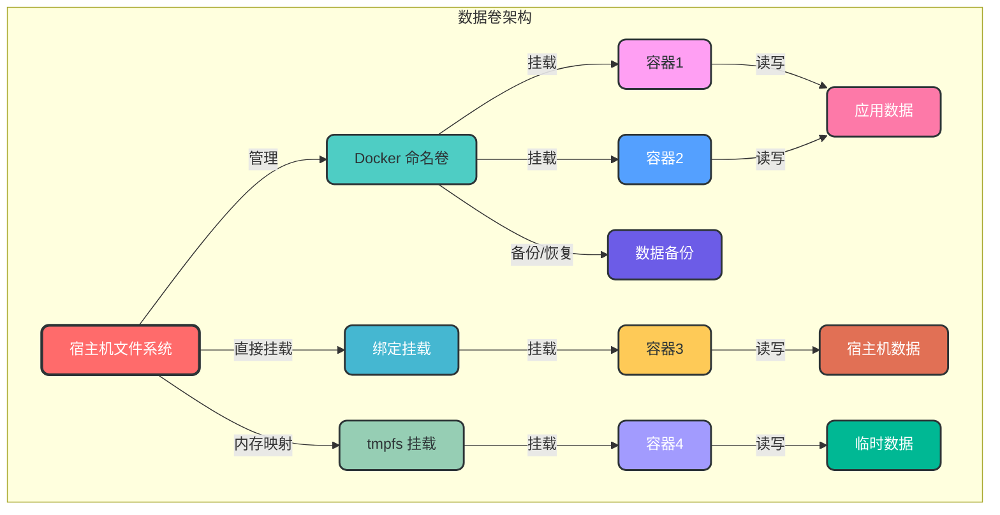
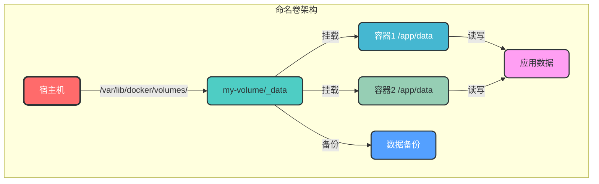
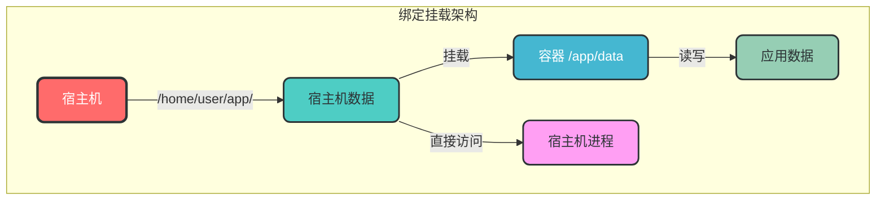
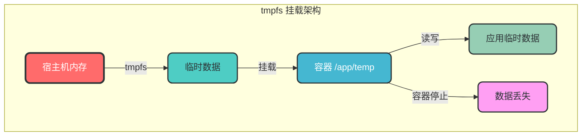

# 4. 数据卷管理

## 4.1 核心概念

Docker 数据卷是用于持久化存储容器数据的机制，它可以绕过容器的可写层，直接存储在宿主机文件系统中。数据卷提供了数据持久化、容器间数据共享和备份恢复等功能。

### 4.1.1 数据卷类型

| 数据卷类型 | 描述 | 适用场景 |
|-----------|------|----------|
| 命名卷（Named Volumes） | 由 Docker 管理的卷，存储在默认路径 | 容器间数据共享、持久化存储 |
| 绑定挂载（Bind Mounts） | 将宿主机指定路径挂载到容器 | 开发环境、需要访问宿主机文件 |
| tmpfs 挂载（tmpfs Mounts） | 存储在宿主机内存中，容器停止后数据丢失 | 临时数据存储、敏感数据处理 |

### 4.1.2 数据卷架构



## 4.2 数据卷命令

### 4.2.1 数据卷管理

```bash
# 创建数据卷
docker volume create [options] <volume_name>

# 列出所有数据卷
docker volume ls

# 查看数据卷详情
docker volume inspect <volume_name>

# 删除数据卷
docker volume rm <volume_name>

# 删除所有未使用的数据卷
docker volume prune

# 示例：创建数据卷
docker volume create my-volume

# 示例：查看数据卷详情
docker volume inspect my-volume

# 示例：删除未使用的数据卷
docker volume prune
```

### 4.2.2 数据卷使用

#### 4.2.2.1 命名卷

```bash
# 运行容器时挂载命名卷
docker run -d --name <container_name> -v <volume_name>:<container_path> <image_name>

# 示例：使用命名卷运行容器
docker run -d --name mysql -v mysql-data:/var/lib/mysql -e MYSQL_ROOT_PASSWORD=123456 mysql:8.0
```

#### 4.2.2.2 绑定挂载

```bash
# 运行容器时挂载绑定卷
docker run -d --name <container_name> -v <host_path>:<container_path> <image_name>

# 示例：使用绑定挂载运行容器
docker run -d --name nginx -v ./html:/usr/share/nginx/html -p 80:80 nginx:alpine
```

#### 4.2.2.3 tmpfs 挂载

```bash
# 运行容器时挂载 tmpfs 卷
docker run -d --name <container_name> --tmpfs <container_path> <image_name>

# 示例：使用 tmpfs 挂载运行容器
docker run -d --name redis --tmpfs /data redis:alpine
```

## 4.3 数据卷类型详解

### 4.3.1 命名卷

命名卷是由 Docker 管理的卷，存储在宿主机的默认路径（通常是 `/var/lib/docker/volumes/`）。



### 4.3.2 绑定挂载

绑定挂载是将宿主机的指定路径直接挂载到容器中，Docker 不对挂载的路径进行任何管理。



### 4.3.3 tmpfs 挂载

tmpfs 挂载是将数据存储在宿主机的内存中，容器停止后数据会丢失，适用于临时数据存储。



## 4.4 数据卷配置选项

### 4.4.1 挂载选项

```bash
# 只读挂载
docker run -d --name <container_name> -v <volume_name>:<container_path>:ro <image_name>

# 示例：只读挂载数据卷
docker run -d --name nginx -v nginx-data:/usr/share/nginx/html:ro -p 80:80 nginx:alpine
```

### 4.4.2 权限配置

```bash
# 设置挂载目录的 UID 和 GID
docker run -d --name <container_name> -v <volume_name>:<container_path> -u <uid>:<gid> <image_name>

# 示例：设置挂载目录权限
docker run -d --name app -v app-data:/app/data -u 1000:1000 myapp:1.0
```

## 4.5 数据卷备份与恢复

### 4.5.1 数据卷备份

```bash
# 备份数据卷到本地文件
docker run --rm -v <volume_name>:<container_path> -v $(pwd):/backup alpine tar cvf /backup/<backup_name>.tar <container_path>

# 示例：备份 mysql 数据卷
docker run --rm -v mysql-data:/var/lib/mysql -v $(pwd):/backup alpine tar cvf /backup/mysql-backup.tar /var/lib/mysql
```

### 4.5.2 数据卷恢复

```bash
# 从备份文件恢复数据卷
docker run --rm -v <volume_name>:<container_path> -v $(pwd):/backup alpine tar xvf /backup/<backup_name>.tar -C /

# 示例：恢复 mysql 数据卷
docker run --rm -v mysql-data:/var/lib/mysql -v $(pwd):/backup alpine tar xvf /backup/mysql-backup.tar -C /
```

### 4.5.3 数据卷迁移

```bash
# 1. 备份源数据卷
docker run --rm -v source-volume:/data -v $(pwd):/backup alpine tar cvf /backup/volume-backup.tar /data

# 2. 创建目标数据卷
docker volume create target-volume

# 3. 恢复数据到目标数据卷
docker run --rm -v target-volume:/data -v $(pwd):/backup alpine tar xvf /backup/volume-backup.tar -C /
```

## 4.6 数据卷管理最佳实践

### 4.6.1 数据卷设计原则

1. **数据与容器分离**：容器应该是无状态的，数据存储在外部数据卷中
2. **使用命名卷**：优先使用命名卷而非绑定挂载，便于管理
3. **定期备份**：定期备份数据卷，防止数据丢失
4. **权限管理**：正确设置数据卷的权限，避免安全问题
5. **使用适当的存储驱动**：根据需求选择合适的存储驱动

### 4.6.2 数据卷命名规范

```bash
# 推荐命名规范：<project>-<service>-<volume-type>
# 示例：
docker volume create myapp-mysql-data
docker volume create myapp-redis-cache
```

### 4.6.3 数据卷使用建议

```bash
# 1. 为数据库使用命名卷
docker run -d --name mysql -v mysql-data:/var/lib/mysql mysql:8.0

# 2. 为静态文件使用绑定挂载（开发环境）
docker run -d --name nginx -v ./html:/usr/share/nginx/html -p 80:80 nginx:alpine

# 3. 为临时数据使用 tmpfs 挂载
docker run -d --name redis --tmpfs /data redis:alpine

# 4. 多个容器共享数据卷
docker run -d --name app1 -v shared-data:/app/data myapp:1.0
docker run -d --name app2 -v shared-data:/app/data myapp:1.0
```

## 4.7 数据卷性能优化

### 4.7.1 选择合适的存储驱动

- **local**：默认存储驱动，适用于大多数场景
- **zfs**：支持高级存储功能，如快照和克隆
- **btrfs**：支持快照和克隆，适用于大规模存储
- **overlay2**：Docker 推荐的存储驱动，性能较好

### 4.7.2 调整存储参数

```bash
# 调整 Docker 守护进程存储参数
echo '{"storage-driver": "overlay2", "storage-opts": ["overlay2.override_kernel_check=true"]}' > /etc/docker/daemon.json

# 重启 Docker 服务
systemctl restart docker
```

### 4.7.3 使用高速存储设备

- 使用 SSD 存储
- 避免使用网络存储（如 NFS）
- 调整文件系统参数以提高性能

## 4.8 数据卷故障排查

### 4.8.1 数据卷挂载失败

```bash
# 1. 检查数据卷是否存在
docker volume ls | grep <volume_name>

# 2. 检查数据卷权限
sudo ls -la /var/lib/docker/volumes/<volume_name>/_data

# 3. 检查挂载路径是否存在
docker exec <container_name> ls -la <container_path>

# 4. 查看容器日志
docker logs <container_name>
```

### 4.8.2 数据卷数据丢失

```bash
# 问题：数据卷数据丢失
# 解决方案：

# 1. 检查是否使用了 tmpfs 挂载
docker inspect <container_name> | grep -A 10 "Mounts"

# 2. 检查容器是否被删除并重新创建
docker ps -a

# 3. 从备份恢复数据
docker run --rm -v <volume_name>:<container_path> -v $(pwd):/backup alpine tar xvf /backup/<backup_name>.tar -C /
```

### 4.8.3 数据卷权限问题

```bash
# 问题：容器无法读写数据卷
# 解决方案：

# 1. 检查数据卷权限
sudo ls -la /var/lib/docker/volumes/<volume_name>/_data

# 2. 调整数据卷权限
sudo chown -R <uid>:<gid> /var/lib/docker/volumes/<volume_name>/_data

# 3. 运行容器时指定用户
docker run -d --name <container_name> -v <volume_name>:<container_path> -u <uid>:<gid> <image_name>
```

## 4.9 数据卷与 Docker Compose

在 Docker Compose 中，可以更方便地管理数据卷，详见 [Docker Compose](./5.Docker%20Compose.md) 章节。

```yaml
# docker-compose.yml 示例
version: '3.8'

services:
  mysql:
    image: mysql:8.0
    volumes:
      - mysql-data:/var/lib/mysql
    environment:
      MYSQL_ROOT_PASSWORD: 123456

volumes:
  mysql-data:  # 命名卷
    driver: local
```

## 4.10 数据卷安全最佳实践

1. **定期备份**：定期备份数据卷，防止数据丢失
2. **加密存储**：对敏感数据使用加密存储
3. **权限控制**：正确设置数据卷的权限，避免未授权访问
4. **隔离敏感数据**：将敏感数据存储在独立的数据卷中
5. **审计日志**：记录数据卷的访问日志，便于安全审计
6. **限制容器权限**：避免使用特权模式，减少数据泄露风险
7. **使用只读挂载**：对不需要修改的数据使用只读挂载
8. **定期清理**：定期清理不再使用的数据卷，减少安全风险

通过本章节的学习，您已经掌握了 Docker 数据卷的核心概念、管理命令和最佳实践。数据卷管理是 Docker 使用的重要组成部分，熟练掌握这些知识将帮助您构建可靠、安全的数据存储方案。