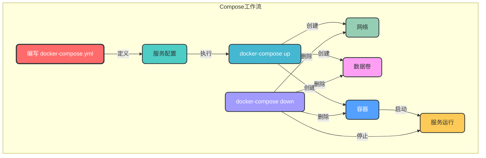
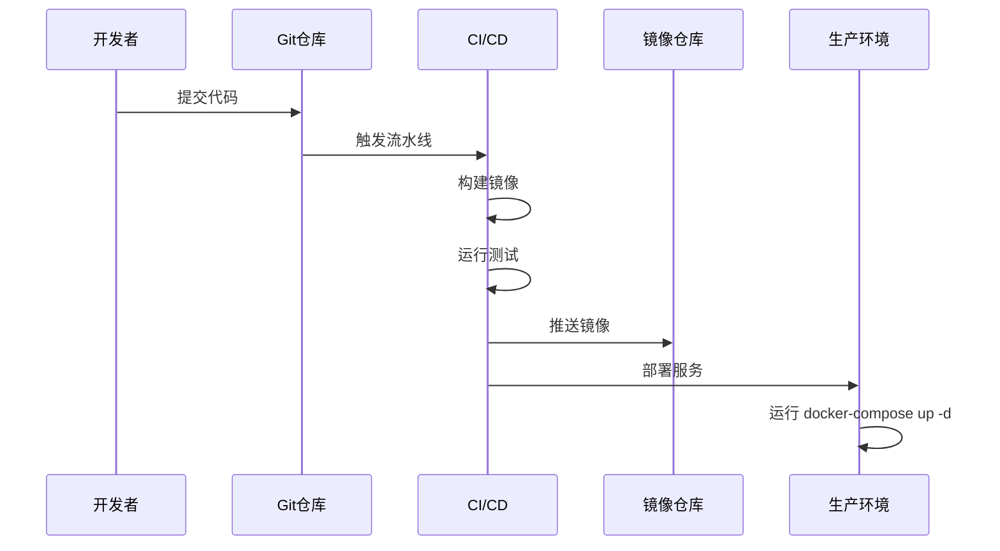

# 5. Docker Compose

## 5.1 核心概念

Docker Compose 是用于定义和运行多容器 Docker 应用程序的工具。通过 Compose，您可以使用 YAML 文件来配置应用程序的服务，然后使用单个命令创建并启动所有服务。

### 5.1.1 Compose 工作流



### 5.1.2 Compose 文件结构

```yaml
# docker-compose.yml 基本结构
version: '3.8'  # Compose 版本

services:  # 服务定义
  web:  # 服务名称
    build: .  # 构建上下文
    ports:  # 端口映射
      - "80:80"
    volumes:  # 数据卷
      - ./html:/usr/share/nginx/html
    networks:  # 网络配置
      - my-network
    depends_on:  # 依赖关系
      - db
  
  db:  # 另一个服务
    image: mysql:8.0  # 使用现有镜像
    environment:  # 环境变量
      MYSQL_ROOT_PASSWORD: 123456
    volumes:  # 数据卷
      - mysql-data:/var/lib/mysql
    networks:  # 网络配置
      - my-network

volumes:  # 数据卷定义
  mysql-data:  # 命名卷

networks:  # 网络定义
  my-network:  # 自定义网络
    driver: bridge
```

## 5.2 Compose 命令

### 5.2.1 基本命令

```bash
# 启动服务（前台运行）
docker-compose up

# 启动服务（后台运行）
docker-compose up -d

# 停止服务
docker-compose down

# 查看服务状态
docker-compose ps

# 查看服务日志
docker-compose logs

# 实时查看服务日志
docker-compose logs -f

# 示例：启动服务并后台运行
docker-compose up -d

# 示例：查看服务状态
docker-compose ps
```

### 5.2.2 服务管理

```bash
# 启动指定服务
docker-compose up -d <service_name>

# 停止指定服务
docker-compose stop <service_name>

# 重启指定服务
docker-compose restart <service_name>

# 删除指定服务
docker-compose rm <service_name>

# 进入指定服务容器
docker-compose exec <service_name> <command>

# 示例：启动 web 服务
docker-compose up -d web

# 示例：进入 db 服务容器
docker-compose exec db bash
```

### 5.2.3 构建命令

```bash
# 构建服务镜像
docker-compose build

# 构建指定服务镜像
docker-compose build <service_name>

# 强制重新构建镜像
docker-compose build --no-cache

# 示例：构建所有服务镜像
docker-compose build

# 示例：构建 web 服务镜像（无缓存）
docker-compose build --no-cache web
```

### 5.2.4 其他命令

```bash
# 查看服务依赖关系
docker-compose top

# 验证 Compose 文件语法
docker-compose config

# 缩放服务实例数量
docker-compose up -d --scale <service_name>=<number>

# 示例：验证 Compose 文件
docker-compose config

# 示例：缩放 web 服务到 3 个实例
docker-compose up -d --scale web=3
```

## 5.3 Compose 文件详解

### 5.3.1 版本选择

| Compose 版本 | Docker 版本要求 |
|-------------|----------------|
| 3.8 | 19.03.0+ |
| 3.7 | 18.06.0+ |
| 3.6 | 18.02.0+ |
| 3.5 | 17.12.0+ |
| 3.4 | 17.09.0+ |

### 5.3.2 服务配置

#### 5.3.2.1 镜像配置

```yaml
services:
  web:
    image: nginx:alpine  # 使用现有镜像
    # 或
    build: .  # 从当前目录构建
    # 或
    build:
      context: ./app  # 构建上下文
      dockerfile: Dockerfile.prod  # 指定 Dockerfile
      args:  # 构建参数
        - NODE_ENV=production
```

#### 5.3.2.2 端口配置

```yaml
services:
  web:
    ports:
      - "80:80"  # 宿主机端口:容器端口
      - "443:443"  # 多个端口映射
      - "127.0.0.1:8080:80"  # 指定绑定地址
```

#### 5.3.2.3 网络配置

```yaml
services:
  web:
    networks:
      - frontend  # 加入 frontend 网络
      - backend  # 加入 backend 网络

networks:
  frontend:
    driver: bridge  # 网络驱动
  backend:
    driver: overlay  # 网络驱动
```

#### 5.3.2.4 数据卷配置

```yaml
services:
  web:
    volumes:
      - ./html:/usr/share/nginx/html  # 绑定挂载
      - web-data:/app/data  # 命名卷
      - /app/temp  # tmpfs 挂载

volumes:
  web-data:  # 命名卷定义
    driver: local  # 存储驱动
```

#### 5.3.2.5 环境变量配置

```yaml
services:
  db:
    environment:
      MYSQL_ROOT_PASSWORD: 123456  # 直接设置
      MYSQL_DATABASE: myapp
    # 或
    env_file:
      - .env  # 从文件加载环境变量
      - .env.local
```

#### 5.3.2.6 依赖配置

```yaml
services:
  web:
    depends_on:
      - db  # 依赖 db 服务
      - redis  # 依赖 redis 服务
    # 或
    depends_on:
      db:
        condition: service_healthy  # 等待 db 服务健康检查通过
      redis:
        condition: service_started  # 等待 redis 服务启动
```

#### 5.3.2.7 健康检查配置

```yaml
services:
  web:
    healthcheck:
      test: ["CMD", "curl", "-f", "http://localhost/health"]  # 健康检查命令
      interval: 30s  # 检查间隔
      timeout: 10s  # 超时时间
      retries: 3  # 重试次数
      start_period: 5s  # 启动等待时间
```

## 5.4 Compose 最佳实践

### 5.4.1 项目结构

```
myapp/
├── docker-compose.yml
├── .env
├── web/
│   ├── Dockerfile
│   └── ...
├── db/
│   ├── Dockerfile
│   └── ...
└── nginx/
    ├── Dockerfile
    └── ...
```

### 5.4.2 Compose 文件组织

1. **使用环境变量**：将敏感信息和配置项放在环境变量文件中
2. **分离配置文件**：使用多个 Compose 文件分离不同环境的配置
3. **使用标签**：为服务添加标签，便于管理和监控
4. **限制资源**：为服务设置资源限制，避免资源竞争

### 5.4.3 多环境配置

```bash
# docker-compose.yml - 基础配置
docker-compose.yml

# docker-compose.dev.yml - 开发环境配置
docker-compose.dev.yml

# docker-compose.prod.yml - 生产环境配置
docker-compose.prod.yml

# 启动开发环境
docker-compose -f docker-compose.yml -f docker-compose.dev.yml up -d

# 启动生产环境
docker-compose -f docker-compose.yml -f docker-compose.prod.yml up -d
```

### 5.4.4 资源限制

```yaml
services:
  web:
    image: nginx:alpine
    deploy:
      resources:
        limits:
          cpus: "0.5"  # CPU 限制
          memory: 512M  # 内存限制
        reservations:
          cpus: "0.25"  # CPU 预留
          memory: 256M  # 内存预留
```

## 5.5 Compose 与生产环境

### 5.5.1 生产环境部署注意事项

1. **使用固定版本标签**：避免使用 `latest` 标签，使用明确的版本号
2. **配置健康检查**：确保服务健康状态可监控
3. **设置重启策略**：确保服务故障后自动恢复
4. **配置日志管理**：收集和管理服务日志
5. **使用 secrets 管理敏感信息**：避免在 Compose 文件中直接存储敏感信息

### 5.5.2 重启策略配置

```yaml
services:
  web:
    image: nginx:alpine
    restart: always  # 总是重启
    # 或
    restart: on-failure:5  # 失败时重启，最多 5 次
    # 或
    restart: unless-stopped  # 除非手动停止，否则总是重启
```

### 5.5.3 日志配置

```yaml
services:
  web:
    image: nginx:alpine
    logging:
      driver: json-file  # 日志驱动
      options:
        max-size: "10m"  # 单个日志文件最大大小
        max-file: "3"  # 保留日志文件数量
```

## 5.6 Compose 与 Swarm 集成

### 5.6.1 Swarm 模式部署

```bash
# 初始化 Swarm 集群
docker swarm init

# 部署 Compose 服务到 Swarm
docker stack deploy -c docker-compose.yml <stack_name>

# 查看 Stack 服务
docker stack services <stack_name>

# 删除 Stack
docker stack rm <stack_name>

# 示例：部署 Stack
docker stack deploy -c docker-compose.yml myapp

# 示例：查看 Stack 服务
docker stack services myapp
```

### 5.6.2 Swarm 模式 Compose 文件

```yaml
version: '3.8'

services:
  web:
    image: nginx:alpine
    ports:
      - "80:80"
    deploy:
      replicas: 3  # 副本数量
      restart_policy:
        condition: on-failure  # 重启策略
      update_config:
        parallelism: 1  # 并行更新数量
        delay: 10s  # 更新延迟
      rollback_config:
        parallelism: 1  # 并行回滚数量
        delay: 10s  # 回滚延迟
    networks:
      - my-network

networks:
  my-network:
    driver: overlay  # 覆盖网络
```

## 5.7 Compose 故障排查

### 5.7.1 服务启动失败

```bash
# 1. 查看服务日志
docker-compose logs <service_name>

# 2. 检查服务配置
docker-compose config

# 3. 检查依赖服务状态
docker-compose ps <dependency_service>

# 4. 手动启动服务（前台运行）
docker-compose up <service_name>

# 示例：查看 web 服务日志
docker-compose logs web
```

### 5.7.2 网络连接问题

```bash
# 1. 检查网络配置
docker network inspect <project_name>_<network_name>

# 2. 测试容器间通信
docker-compose exec <service1> ping -c 3 <service2>

# 3. 检查端口映射
docker-compose port <service_name> <container_port>

# 示例：测试 web 服务到 db 服务的通信
docker-compose exec web ping -c 3 db
```

### 5.7.3 数据卷问题

```bash
# 1. 检查数据卷配置
docker-compose config | grep -A 10 "volumes"

# 2. 查看数据卷
docker volume ls | grep <project_name>

# 3. 检查数据卷内容
docker run --rm -v <project_name>_<volume_name>:<mount_path> alpine ls -la <mount_path>

# 示例：查看 mysql-data 数据卷内容
docker run --rm -v myapp_mysql-data:/var/lib/mysql alpine ls -la /var/lib/mysql
```

## 5.8 Compose 性能优化

### 5.8.1 构建优化

1. **使用多阶段构建**：减少最终镜像大小
2. **合理使用缓存**：优化 Dockerfile 指令顺序，利用缓存
3. **使用构建上下文忽略**：使用 `.dockerignore` 文件排除不必要的文件

### 5.8.2 运行时优化

1. **限制资源使用**：为服务设置资源限制
2. **使用合适的网络驱动**：根据需求选择网络驱动
3. **优化存储**：使用高性能存储驱动和设备

### 5.8.3 启动优化

1. **并行启动服务**：合理设置服务依赖，并行启动不相关服务
2. **减少启动时间**：优化服务启动脚本，减少启动时间
3. **使用健康检查**：确保服务完全启动后才对外提供服务

## 5.9 Compose 常见问题

### 5.9.1 端口冲突

```bash
# 问题：端口已被占用
# 解决方案：

# 1. 检查端口占用
sudo netstat -tuln | grep <port>

# 2. 修改 Compose 文件中的端口映射
docker-compose.yml:
  ports:
    - "8080:80"  # 改为其他端口

# 3. 停止占用端口的进程
sudo kill <pid>
```

### 5.9.2 环境变量不生效

```bash
# 问题：环境变量不生效
# 解决方案：

# 1. 检查环境变量文件格式
cat .env

# 2. 检查 Compose 文件中的环境变量引用
environment:
  - DB_HOST=${DB_HOST}  # 正确引用方式

# 3. 验证 Compose 配置
docker-compose config

# 4. 重启服务
docker-compose down && docker-compose up -d
```

### 5.9.3 服务依赖问题

```bash
# 问题：服务依赖的服务尚未准备好
# 解决方案：

# 1. 使用健康检查依赖
depends_on:
  db:
    condition: service_healthy  # 等待 db 服务健康检查通过

# 2. 在应用中添加重试机制
# 3. 使用 init 容器等待依赖服务就绪
```

## 5.10 Compose 与 CI/CD 集成

### 5.10.1 CI/CD 工作流



### 5.10.2 CI/CD 示例（GitHub Actions）

```yaml
# .github/workflows/deploy.yml
name: Deploy

on:
  push:
    branches: [ main ]

jobs:
  deploy:
    runs-on: ubuntu-latest
    steps:
    - uses: actions/checkout@v2
    
    - name: Build and push images
      run: |
        docker-compose build
        docker-compose push
    
    - name: Deploy to production
      uses: appleboy/ssh-action@master
      with:
        host: ${{ secrets.HOST }}
        username: ${{ secrets.USERNAME }}
        key: ${{ secrets.SSH_KEY }}
        script: |
          cd /path/to/app
          docker-compose pull
          docker-compose up -d
```

通过本章节的学习，您已经掌握了 Docker Compose 的核心概念、管理命令和最佳实践。Docker Compose 是管理多容器应用的重要工具，熟练掌握这些知识将帮助您高效地构建、部署和管理复杂的 Docker 应用程序。