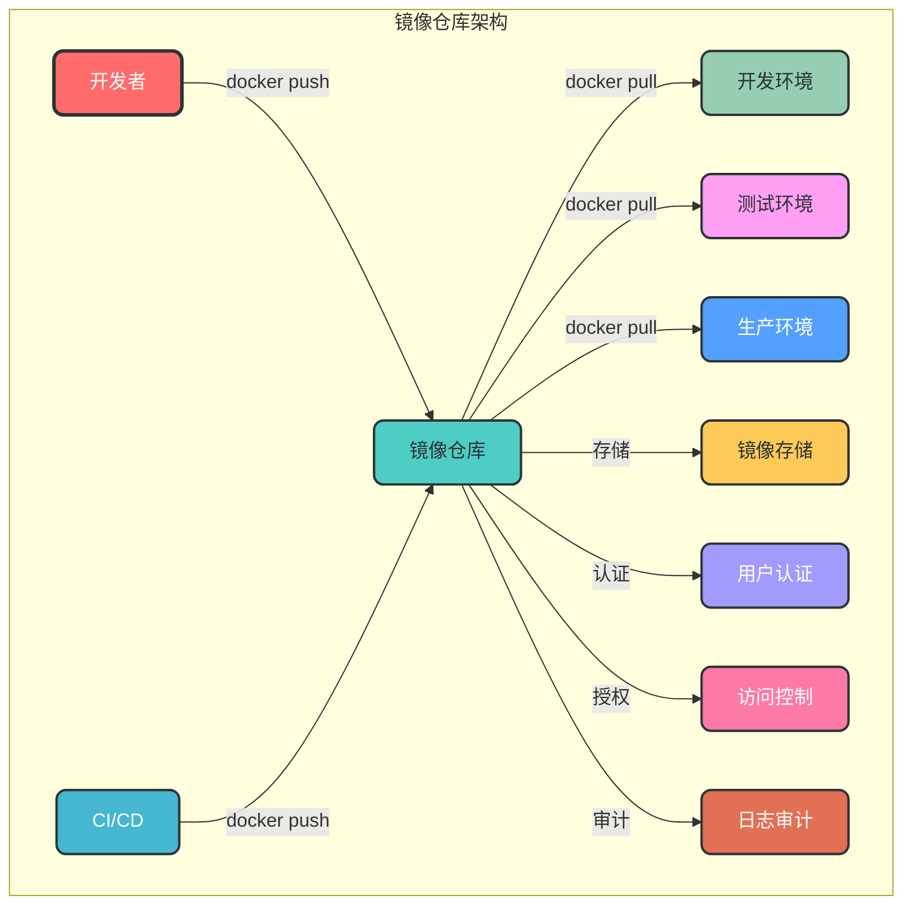
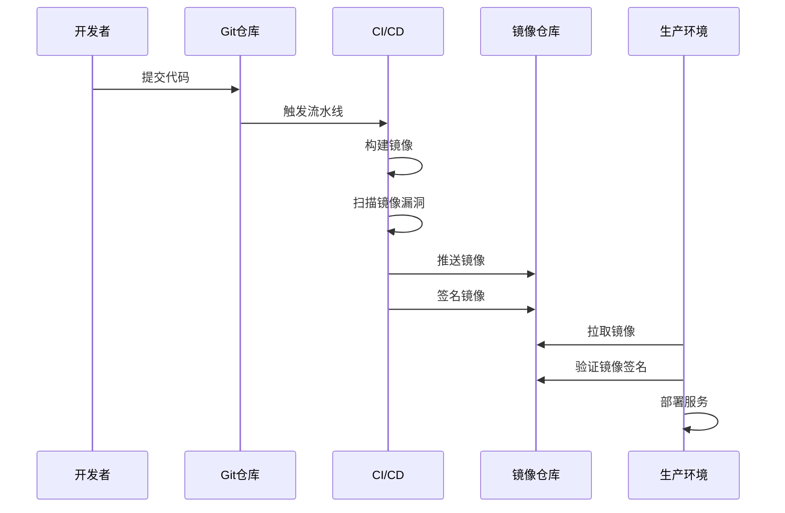

# 6. 镜像仓库管理

## 6.1 核心概念

Docker 镜像仓库是用于存储和分发 Docker 镜像的服务。它允许用户上传、下载和管理镜像，是 Docker 生态系统中的重要组成部分。

### 6.1.1 镜像仓库类型

| 仓库类型 | 描述 | 适用场景 |
|---------|------|----------|
| Docker Hub | Docker 官方公共仓库 | 公共镜像存储、开源项目 |
| 私有仓库 | 企业或个人搭建的私有仓库 | 企业内部镜像存储、敏感项目 |
| 第三方仓库 | 如阿里云镜像服务、腾讯云镜像服务等 | 国内加速访问、企业级服务 |

### 6.1.2 镜像仓库架构



## 6.2 镜像仓库命令

### 6.2.1 登录与登出

```bash
# 登录镜像仓库
docker login [options] [registry]

# 登出镜像仓库
docker logout [registry]

# 常用选项：
# -u, --username: 用户名
# -p, --password: 密码

# 示例：登录 Docker Hub
docker login -u myusername -p mypassword

# 示例：登录私有仓库
docker login registry.example.com
```

### 6.2.2 镜像推送与拉取

```bash
# 拉取镜像
docker pull [options] <image_name>:<tag>

# 推送镜像
docker push [options] <image_name>:<tag>

# 示例：拉取 Docker Hub 镜像
docker pull nginx:alpine

# 示例：推送镜像到私有仓库
docker push registry.example.com/myapp:1.0
```

### 6.2.3 镜像标签

```bash
# 为镜像添加标签
docker tag <source_image>:<source_tag> <target_image>:<target_tag>

# 示例：为本地镜像添加私有仓库标签
docker tag myapp:1.0 registry.example.com/myapp:1.0
```

### 6.2.4 镜像搜索

```bash
# 搜索镜像仓库中的镜像
docker search [options] <keyword>

# 常用选项：
# --filter, -f: 过滤搜索结果
# --limit: 限制搜索结果数量

# 示例：搜索 nginx 镜像
docker search nginx

# 示例：搜索官方 nginx 镜像
docker search --filter "is-official=true" nginx
```

## 6.3 私有仓库搭建

### 6.3.1 使用 Docker Registry

```bash
# 运行 Docker Registry 容器
docker run -d --name registry -p 5000:5000 -v registry-data:/var/lib/registry registry:2

# 配置 Docker 客户端信任私有仓库
# 对于 HTTP 仓库，需要在 /etc/docker/daemon.json 中添加：
echo '{"insecure-registries": ["registry.example.com:5000"]}' > /etc/docker/daemon.json

# 重启 Docker 服务
systemctl restart docker
```

### 6.3.2 使用 Harbor

Harbor 是 VMware 开源的企业级 Docker 镜像仓库，提供了更丰富的功能，如权限管理、镜像扫描、日志审计等。

```bash
# 下载 Harbor 安装包
wget https://github.com/goharbor/harbor/releases/download/v2.8.0/harbor-offline-installer-v2.8.0.tgz

# 解压安装包
tar xvf harbor-offline-installer-v2.8.0.tgz

# 配置 Harbor
cd harbor
cp harbor.yml.tmpl harbor.yml
vim harbor.yml

# 安装 Harbor
./install.sh
```

### 6.3.3 私有仓库使用

```bash
# 1. 登录私有仓库
docker login registry.example.com:5000

# 2. 为镜像添加标签
docker tag myapp:1.0 registry.example.com:5000/myapp:1.0

# 3. 推送镜像到私有仓库
docker push registry.example.com:5000/myapp:1.0

# 4. 从私有仓库拉取镜像
docker pull registry.example.com:5000/myapp:1.0
```

## 6.4 镜像仓库最佳实践

### 6.4.1 镜像命名规范

```bash
# 推荐命名规范：<registry>/<namespace>/<repository>:<tag>
# 示例：
# Docker Hub 镜像
docker.io/library/nginx:alpine

# 私有仓库镜像
registry.example.com/myapp/web:1.0.0
registry.example.com/myapp/db:8.0
```

### 6.4.2 镜像版本管理

1. **使用语义化版本**：如 `1.0.0`、`1.1.0` 等
2. **避免使用 latest 标签**：latest 标签指向最新版本，可能导致不可预测的问题
3. **保留历史版本**：保留一定数量的历史版本，便于回滚
4. **使用稳定标签**：如 `stable`、`lts` 等指向稳定版本

### 6.4.3 镜像安全

1. **镜像扫描**：使用工具如 Trivy、Clair 等扫描镜像中的安全漏洞
2. **签名验证**：使用 Docker Content Trust (DCT) 对镜像进行签名和验证
3. **最小化镜像**：使用最小化基础镜像，减少攻击面
4. **定期更新**：定期更新基础镜像和依赖，修复安全漏洞

### 6.4.4 镜像仓库性能优化

1. **使用 CDN**：为公共仓库配置 CDN，加速镜像拉取
2. **配置缓存**：在私有仓库中配置缓存，减少重复拉取
3. **优化存储**：使用高性能存储设备，如 SSD
4. **水平扩展**：对于大规模仓库，使用多节点部署

## 6.5 镜像仓库监控与管理

### 6.5.1 Docker Registry 监控

```bash
# 查看 Registry 日志
docker logs -f registry

# 查看 Registry 统计信息
curl http://registry.example.com:5000/v2/_catalog

# 查看指定镜像的标签
curl http://registry.example.com:5000/v2/myapp/tags/list
```

### 6.5.2 Harbor 监控

Harbor 提供了 Web 界面和 API 用于监控和管理：

- Web 界面：`http://harbor.example.com`
- API 文档：`http://harbor.example.com/api/v2.0`
- Prometheus 监控：`http://harbor.example.com/metrics`

### 6.5.3 镜像清理

```bash
# Docker Registry 清理
# 1. 进入 Registry 容器
docker exec -it registry /bin/sh

# 2. 清理未使用的镜像
registry garbage-collect /etc/docker/registry/config.yml --delete-untagged

# Harbor 清理
# 通过 Web 界面或 API 清理镜像
```

## 6.6 镜像仓库安全

### 6.6.1 访问控制

1. **用户认证**：配置用户名密码认证
2. **角色授权**：为不同用户分配不同角色，如管理员、开发者、访客等
3. **IP 白名单**：限制允许访问仓库的 IP 地址
4. **HTTPS 配置**：使用 HTTPS 加密通信

### 6.6.2 镜像签名与验证

```bash
# 启用 Docker Content Trust
export DOCKER_CONTENT_TRUST=1

# 签名镜像
docker push registry.example.com/myapp:1.0

# 验证镜像
docker pull registry.example.com/myapp:1.0
```

### 6.6.3 镜像扫描

```bash
# 使用 Trivy 扫描镜像
trivy image nginx:alpine

# 使用 Clair 扫描镜像
clair-scanner --ip 127.0.0.1 nginx:alpine
```

## 6.7 常见镜像仓库问题

### 6.7.1 镜像推送失败

```bash
# 问题：镜像推送失败
# 解决方案：

# 1. 检查网络连接
ping registry.example.com

# 2. 检查登录状态
docker login registry.example.com

# 3. 检查镜像标签
docker images | grep <image_name>

# 4. 检查仓库权限
docker logs registry

# 5. 检查 HTTPS 配置
# 对于 HTTP 仓库，需要配置 insecure-registries
```

### 6.7.2 镜像拉取缓慢

```bash
# 问题：镜像拉取缓慢
# 解决方案：

# 1. 使用国内镜像源
# 配置 Docker 守护进程镜像源
echo '{"registry-mirrors": ["https://registry.docker-cn.com"]}' > /etc/docker/daemon.json

# 2. 搭建本地镜像缓存
# 使用 Docker Registry 或 Harbor 搭建本地缓存

# 3. 检查网络连接
speedtest-cli
```

### 6.7.3 仓库存储空间不足

```bash
# 问题：仓库存储空间不足
# 解决方案：

# 1. 清理未使用的镜像
docker exec -it registry registry garbage-collect /etc/docker/registry/config.yml --delete-untagged

# 2. 扩展存储卷
# 对于 Docker Registry，扩展挂载的数据卷

# 3. 配置存储策略
# 设置镜像保留策略，定期清理旧镜像
```

## 6.8 镜像仓库与 CI/CD 集成

### 6.8.1 CI/CD 工作流



### 6.8.2 GitHub Actions 示例

```yaml
# .github/workflows/build.yml
name: Build and Push Image

on:
  push:
    branches: [ main ]
    tags: [ 'v*' ]

jobs:
  build:
    runs-on: ubuntu-latest
    steps:
    - uses: actions/checkout@v2
    
    - name: Login to Docker Hub
      uses: docker/login-action@v2
      with:
        username: ${{ secrets.DOCKER_HUB_USERNAME }}
        password: ${{ secrets.DOCKER_HUB_TOKEN }}
    
    - name: Build and push
      uses: docker/build-push-action@v4
      with:
        context: .
        push: true
        tags: myusername/myapp:${{ github.sha }},myusername/myapp:latest
    
    - name: Scan image for vulnerabilities
      uses: aquasecurity/trivy-action@master
      with:
        image-ref: 'docker.io/myusername/myapp:${{ github.sha }}'
        format: 'sarif'
        output: 'trivy-results.sarif'
    
    - name: Upload Trivy scan results to GitHub Security tab
      uses: github/codeql-action/upload-sarif@v2
      with:
        sarif_file: 'trivy-results.sarif'
```

## 6.9 企业级镜像仓库管理

### 6.9.1 多仓库管理

1. **主仓库与镜像缓存**：设置主仓库存储官方镜像，镜像缓存加速访问
2. **环境隔离**：为开发、测试、生产环境设置不同的仓库
3. **地域分布**：在不同地域设置仓库节点，加速本地访问

### 6.9.2 镜像生命周期管理

1. **构建阶段**：自动化构建、镜像扫描、签名验证
2. **测试阶段**：测试环境验证、性能测试
3. **发布阶段**：版本标记、稳定版发布
4. **归档阶段**：历史版本归档、旧版本清理

### 6.9.3 合规与审计

1. **镜像合规检查**：确保镜像符合企业安全政策
2. **访问日志审计**：记录所有镜像操作日志
3. **定期安全审计**：定期检查仓库安全配置
4. **合规报告生成**：生成镜像合规报告

通过本章节的学习，您已经掌握了 Docker 镜像仓库的核心概念、管理命令和最佳实践。镜像仓库管理是 Docker 生态系统中的重要组成部分，熟练掌握这些知识将帮助您高效地管理和分发镜像，确保企业级应用的安全性和可靠性。