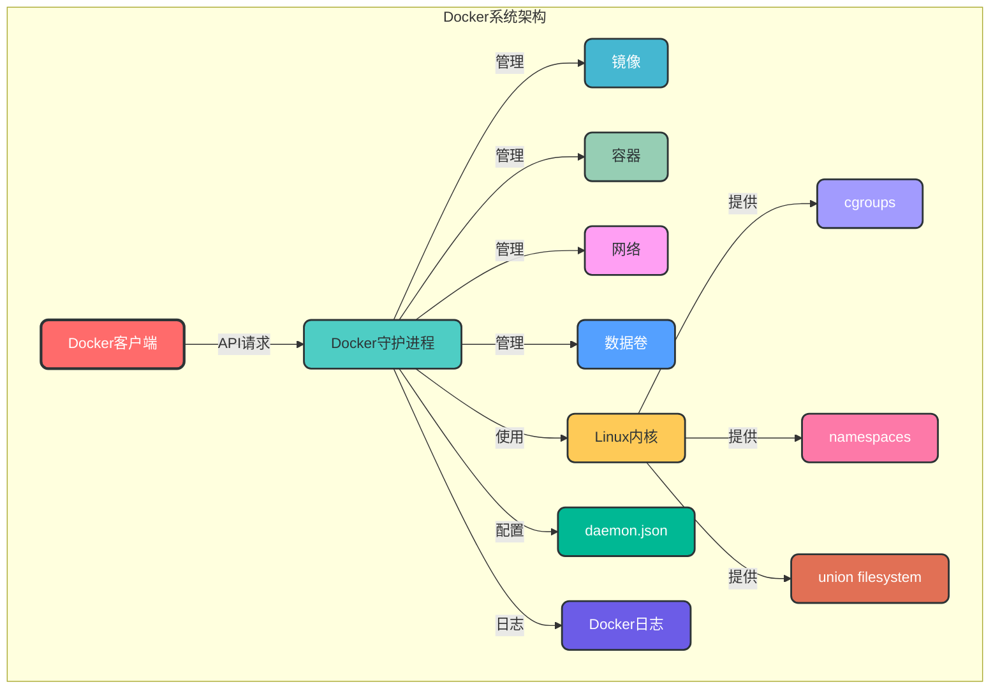

# 7. 系统管理

## 7.1 核心概念

Docker 系统管理是指对 Docker 引擎、守护进程和系统资源的管理。它包括 Docker 配置、资源管理、安全配置、日志管理等方面，是确保 Docker 环境稳定运行的重要组成部分。

### 7.1.1 Docker 系统架构



## 7.2 Docker 系统命令

### 7.2.1 系统信息

```bash
# 查看 Docker 系统信息
docker info

# 查看 Docker 版本
docker version

# 示例：查看 Docker 系统信息
docker info

# 示例：查看 Docker 客户端版本
docker version --format '{{.Client.Version}}'
```

### 7.2.2 系统状态

```bash
# 查看 Docker 系统状态
docker stats

# 查看 Docker 系统事件
docker events

# 示例：查看所有容器的资源使用情况
docker stats $(docker ps -q)

# 示例：查看 Docker 系统事件（最近 10 条）
docker events --since '10m' --until 'now' --format '{{.Time}} {{.Type}} {{.Action}} {{.Actor.Attributes.name}}'
```

### 7.2.3 系统清理

```bash
# 清理未使用的资源
docker system prune

# 清理未使用的镜像
docker image prune

# 清理未使用的容器
docker container prune

# 清理未使用的网络
docker network prune

# 清理未使用的数据卷
docker volume prune

# 示例：清理所有未使用的资源（包括数据卷）
docker system prune -a --volumes
```

## 7.3 Docker 守护进程配置

### 7.3.1 配置文件

Docker 守护进程的配置文件位于 `/etc/docker/daemon.json`，可以通过修改该文件来配置 Docker 守护进程。

```json
{
  "registry-mirrors": ["https://registry.docker-cn.com"],  # 镜像加速源
  "insecure-registries": ["registry.example.com:5000"],  # 不安全的私有仓库
  "data-root": "/var/lib/docker",  # Docker 数据存储路径
  "storage-driver": "overlay2",  # 存储驱动
  "bip": "172.17.0.1/16",  # Docker0 网桥 IP
  "mtu": 1500,  # 网络 MTU
  "default-runtime": "runc",  # 默认运行时
  "log-driver": "json-file",  # 默认日志驱动
  "log-opts": {  # 日志选项
    "max-size": "10m",
    "max-file": "3"
  },
  "cgroup-parent": "/docker",  # 默认 cgroup 父目录
  "exec-opts": ["native.cgroupdriver=systemd"],  # 执行选项
  "live-restore": true,  # 实时恢复
  "experimental": false  # 是否启用实验性功能
}
```

### 7.3.2 配置重载

```bash
# 重新加载 Docker 配置
systemctl reload docker

# 重启 Docker 服务
systemctl restart docker

# 查看 Docker 服务状态
systemctl status docker

# 示例：修改配置后重启 Docker 服务
echo '{"registry-mirrors": ["https://registry.docker-cn.com"]}' > /etc/docker/daemon.json
systemctl restart docker
```

## 7.4 资源管理

### 7.4.1 内存管理

```bash
# 查看 Docker 内存使用情况
docker stats --format "table {{.Name}}\t{{.MemUsage}}\t{{.MemPerc}}"

# 运行容器时限制内存
docker run -d --name <container_name> --memory <limit> <image_name>

# 示例：限制容器使用 512MB 内存
docker run -d --name app --memory 512m nginx:alpine

# 示例：查看容器内存详细信息
docker stats --no-stream app
```

### 7.4.2 CPU 管理

```bash
# 查看 Docker CPU 使用情况
docker stats --format "table {{.Name}}\t{{.CPUPerc}}\t{{.CPUS}}"

# 运行容器时限制 CPU 核心数
docker run -d --name <container_name> --cpus <limit> <image_name>

# 运行容器时设置 CPU 权重
docker run -d --name <container_name> --cpu-shares <shares> <image_name>

# 示例：限制容器使用 0.5 个 CPU 核心
docker run -d --name app --cpus 0.5 nginx:alpine

# 示例：设置容器 CPU 权重为 512
docker run -d --name app --cpu-shares 512 nginx:alpine
```

### 7.4.3 磁盘管理

```bash
# 查看 Docker 磁盘使用情况
docker system df

# 查看镜像磁盘使用情况
docker image ls -s

# 查看容器磁盘使用情况
docker ps -s

# 示例：查看 Docker 系统磁盘使用情况
docker system df -v

# 示例：清理未使用的镜像和容器
docker system prune -a
```

## 7.5 安全配置

### 7.5.1 用户与权限

```bash
# 将用户添加到 docker 组
sudo usermod -aG docker <username>

# 查看 docker 组的成员
grep docker /etc/group

# 示例：将当前用户添加到 docker 组
sudo usermod -aG docker $USER
newgrp docker
```

### 7.5.2 安全加固

```bash
# 1. 启用 Docker Content Trust
export DOCKER_CONTENT_TRUST=1

# 2. 限制容器权限
docker run --cap-drop ALL --cap-add NET_BIND_SERVICE <image_name>

# 3. 使用只读文件系统
docker run --read-only <image_name>

# 4. 禁用特权模式
docker run --privileged=false <image_name>

# 5. 启用 SELinux 或 AppArmor
docker run --security-opt label=type:container_runtime_t <image_name>
```

## 7.6 日志管理

### 7.6.1 日志驱动

Docker 支持多种日志驱动，用于管理容器日志。

| 日志驱动 | 描述 | 适用场景 |
|---------|------|----------|
| json-file | 默认日志驱动，将日志存储为 JSON 文件 | 开发环境、小规模部署 |
| syslog | 将日志发送到 syslog 服务器 | 企业级日志管理、集中式日志 |
| journald | 将日志发送到 systemd journal | 基于 systemd 的系统 |
| gelf | 将日志发送到 Graylog 或 Logstash | 集中式日志管理 |
| fluentd | 将日志发送到 Fluentd 服务器 | 日志聚合、分析 |

### 7.6.2 日志配置

```json
{
  "log-driver": "json-file",
  "log-opts": {
    "max-size": "10m",
    "max-file": "3"
  }
}
```

### 7.6.3 日志查看

```bash
# 查看容器日志
docker logs <container_name>

# 实时查看容器日志
docker logs -f <container_name>

# 查看日志并显示时间戳
docker logs -t <container_name>

# 查看最近 N 行日志
docker logs --tail <N> <container_name>

# 示例：查看 nginx 容器的最近 50 行日志
docker logs --tail 50 nginx
```

## 7.7 事件管理

### 7.7.1 事件监控

```bash
# 查看 Docker 事件
docker events

# 过滤 Docker 事件
docker events --filter <filter>

# 格式化输出
docker events --format <format>

# 示例：查看容器相关事件
docker events --filter "type=container"

# 示例：查看镜像相关事件
docker events --filter "type=image"

# 示例：格式化输出事件
docker events --format '{{.Time}} {{.Type}} {{.Action}} {{.Actor.Attributes.name}}'
```

### 7.7.2 事件处理

可以使用第三方工具如 `docker-events` 或自定义脚本处理 Docker 事件，实现自动化运维。

```bash
# 使用 docker-events 工具监控事件
docker run -v /var/run/docker.sock:/var/run/docker.sock icecrime/docker-events
```

## 7.8 系统监控

### 7.8.1 Docker 内置监控

```bash
# 查看容器资源使用情况
docker stats

# 查看系统信息
docker info

# 查看磁盘使用情况
docker system df
```

### 7.8.2 第三方监控工具

| 监控工具 | 描述 | 适用场景 |
|---------|------|----------|
| cAdvisor | Google 开源的容器监控工具 | 容器资源监控、性能分析 |
| Prometheus + Grafana | 开源监控和可视化平台 | 大规模容器集群监控 |
| Docker Stats Exporter | Prometheus  exporter for Docker stats | Prometheus 监控集成 |
| Sysdig | 系统级监控和分析工具 | 深入的容器监控、故障排查 |

### 7.8.3 cAdvisor 示例

```bash
# 运行 cAdvisor 容器
docker run \
  --volume=/:/rootfs:ro \
  --volume=/var/run:/var/run:ro \
  --volume=/sys:/sys:ro \
  --volume=/var/lib/docker/:/var/lib/docker:ro \
  --publish=8080:8080 \
  --detach=true \
  --name=cadvisor \
  gcr.io/cadvisor/cadvisor:latest
```

访问 `http://localhost:8080` 查看 cAdvisor 监控界面。

## 7.9 系统备份与恢复

### 7.9.1 数据备份

```bash
# 备份 Docker 数据目录
tar -czf docker-backup-$(date +%Y%m%d).tar.gz /var/lib/docker

# 备份 Docker 配置文件
tar -czf docker-config-$(date +%Y%m%d).tar.gz /etc/docker
```

### 7.9.2 数据恢复

```bash
# 停止 Docker 服务
systemctl stop docker

# 恢复 Docker 数据目录
tar -xzf docker-backup-$(date +%Y%m%d).tar.gz -C /

# 恢复 Docker 配置文件
tar -xzf docker-config-$(date +%Y%m%d).tar.gz -C /

# 启动 Docker 服务
systemctl start docker
```

## 7.10 Docker 升级与降级

### 7.10.1 升级 Docker

```bash
# 使用 apt 升级 Docker（Ubuntu/Debian）
sudo apt update
sudo apt upgrade docker-ce docker-ce-cli containerd.io

# 使用 yum 升级 Docker（CentOS/RHEL）
sudo yum update docker-ce docker-ce-cli containerd.io

# 使用 brew 升级 Docker（macOS）
brew upgrade docker
```

### 7.10.2 降级 Docker

```bash
# 查看可用的 Docker 版本（Ubuntu/Debian）
apt-cache madison docker-ce

# 安装指定版本的 Docker（Ubuntu/Debian）
sudo apt install docker-ce=<version> docker-ce-cli=<version> containerd.io

# 查看可用的 Docker 版本（CentOS/RHEL）
yum --showduplicates list docker-ce

# 安装指定版本的 Docker（CentOS/RHEL）
sudo yum install docker-ce-<version> docker-ce-cli-<version> containerd.io
```

## 7.11 常见系统问题

### 7.11.1 Docker 服务无法启动

```bash
# 1. 查看 Docker 服务日志
journalctl -u docker.service

# 2. 检查 Docker 配置文件
cat /etc/docker/daemon.json

# 3. 检查 Docker 数据目录权限
sudo ls -la /var/lib/docker

# 4. 检查磁盘空间
df -h

# 5. 检查内存使用
free -h
```

### 7.11.2 Docker 命令执行失败

```bash
# 1. 检查用户权限
id

# 2. 检查 Docker 服务状态
systemctl status docker

# 3. 检查 Docker 守护进程日志
docker logs docker

# 4. 测试 Docker 连接
docker info
```

### 7.11.3 容器无法创建

```bash
# 1. 检查镜像是否存在
docker images

# 2. 检查磁盘空间
docker system df

# 3. 检查内存限制
docker info | grep -i memory

# 4. 检查 cgroup 配置
cat /proc/cgroups
```

## 7.12 系统管理最佳实践

1. **定期备份**：定期备份 Docker 数据和配置文件
2. **监控系统资源**：实时监控 Docker 系统资源使用情况
3. **合理配置资源限制**：为容器设置合理的资源限制，避免资源竞争
4. **启用日志管理**：配置集中式日志管理，便于故障排查
5. **定期清理资源**：定期清理未使用的镜像、容器、网络和数据卷
6. **安全加固**：启用 Docker Content Trust，限制容器权限，使用只读文件系统
7. **定期升级**：定期升级 Docker 版本，修复安全漏洞
8. **使用监控工具**：使用第三方监控工具如 cAdvisor、Prometheus 等监控 Docker 系统
9. **配置镜像加速**：使用国内镜像加速源，提高镜像拉取速度
10. **合理规划网络**：规划 Docker 网络，避免 IP 地址冲突

通过本章节的学习，您已经掌握了 Docker 系统管理的核心概念、管理命令和最佳实践。系统管理是 Docker 环境稳定运行的重要保障，熟练掌握这些知识将帮助您构建可靠、安全、高效的 Docker 环境。